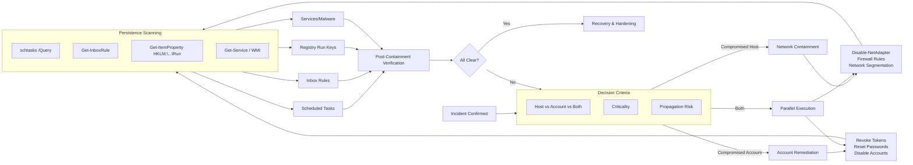
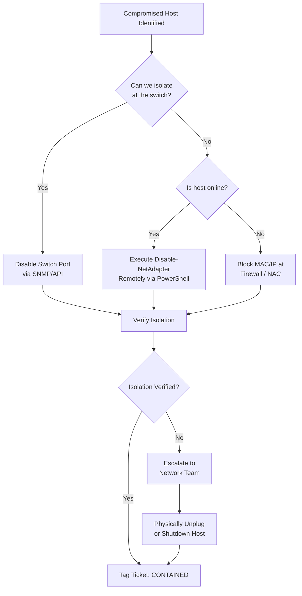
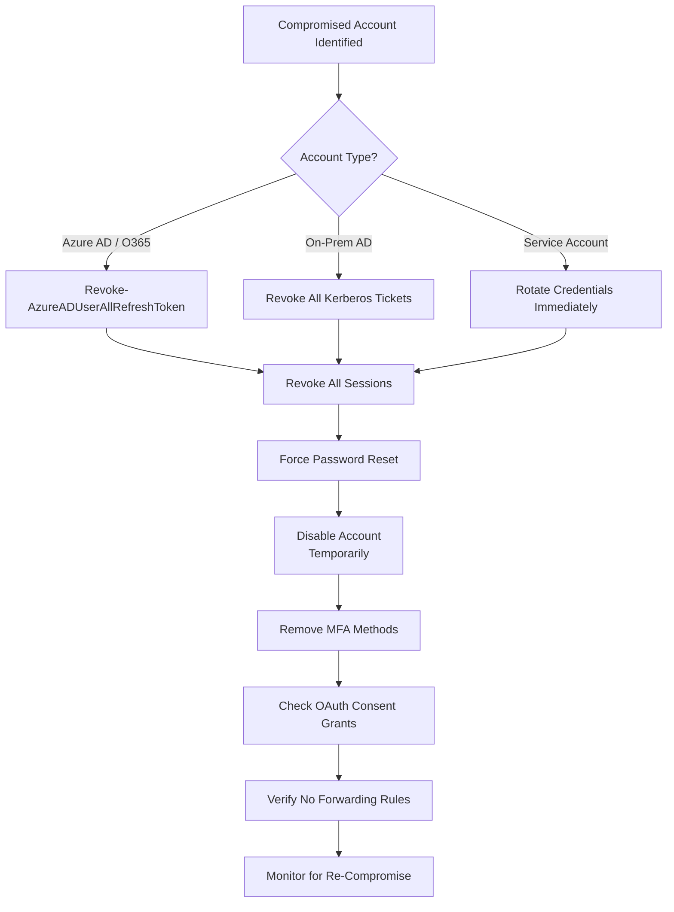
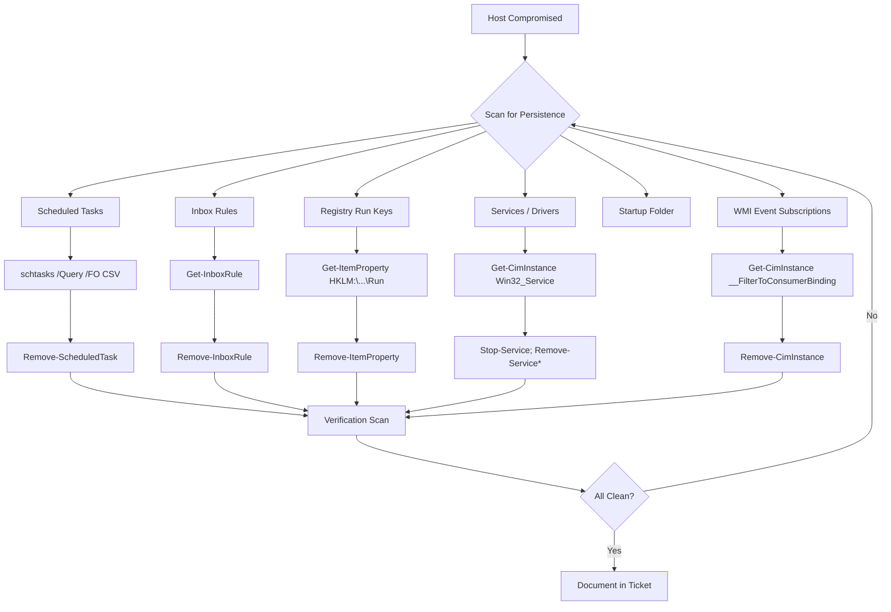
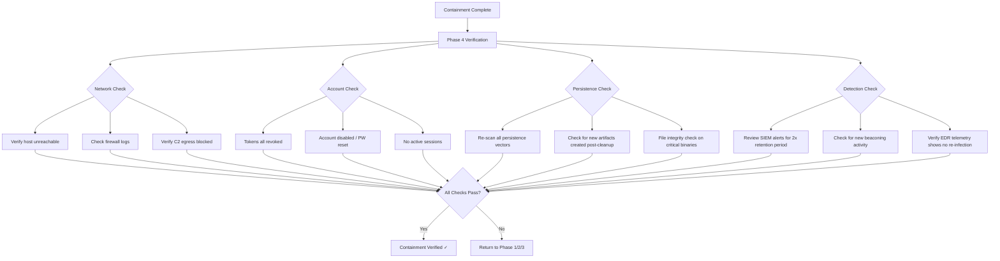
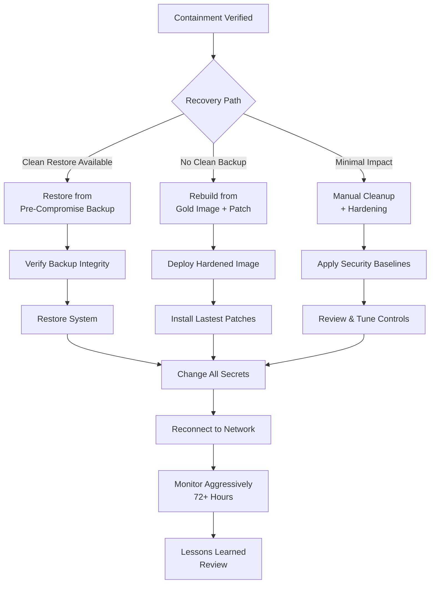

## 🚨 Full-Stack Lesson: Containment, Eradication & Recovery — From Network Isolation to Full Remediation

## 📊 Executive Summary
When a security incident is confirmed, the speed and precision of containment, eradication, and recovery directly determine the blast radius and overall business impact. This lesson provides a full-stack methodology covering five critical phases: **Network Containment** (isolating compromised hosts), **Account Remediation** (revoking tokens and resetting credentials), **Persistence Removal** (eliminating backdoors and malware artifacts), **Post-Containment Verification** (ensuring no remnants remain), and **Recovery & Lessons Learned** (restoring from clean backups and hardening). You'll learn technical execution via PowerShell, bash, and Graph API, with runbook templates and verification checklists for each scenario.



## 🏗️ Phase 1: Network Containment

### Network Isolation Decision Tree


### 1.1 Remote Network Adapter Disable (PowerShell)

```powershell
function Disable-CompromisedHostAdapter {
    param(
        [Parameter(Mandatory = $true)]
        [string]$ComputerName,
        
        [Parameter(Mandatory = $false)]
        [PSCredential]$Credential,
        
        [Parameter(Mandatory = $false)]
        [int]$AdapterIndex = 0,
        
        [Parameter(Mandatory = $false)]
        [switch]$Force
    )
    
    try {
        # Test connectivity first
        if (-not (Test-Connection -ComputerName $ComputerName -Count 2 -Quiet)) {
            Write-Warning "Host $ComputerName is unreachable. Attempting WMI fallback..."
        }
        
        # Attempt remote adapter disable via CIM/WMI
        $session = New-CimSession -ComputerName $ComputerName -Credential $Credential -ErrorAction Stop
        
        $adapter = Get-CimInstance -CimSession $session -ClassName Win32_NetworkAdapter |
            Where-Object { $_.NetEnabled -eq $true -and $_.AdapterType -ne 'Wireless' } |
            Select-Object -First 1
        
        if (-not $adapter) {
            throw "No enabled network adapter found on $ComputerName"
        }
        
        Write-Host "[*] Disabling adapter: $($adapter.Name) on $ComputerName" -ForegroundColor Yellow
        
        # Disable the adapter
        $result = Invoke-CimMethod -CimSession $session -InputObject $adapter -MethodName Disable
        
        if ($result.ReturnValue -eq 0) {
            Write-Host "[+] Adapter disabled successfully on $ComputerName" -ForegroundColor Green
            
            # Verify isolation
            Start-Sleep -Seconds 5
            if (-not (Test-Connection -ComputerName $ComputerName -Count 1 -Quiet)) {
                Write-Host "[+] Isolation confirmed - host $ComputerName is unreachable" -ForegroundColor Green
            } else {
                Write-Warning "[!] Host $ComputerName is still reachable. Check other adapters."
            }
        }
        else {
            throw "Failed to disable adapter. Return code: $($result.ReturnValue)"
        }
        
        Remove-CimSession -CimSession $session
        
        # Log the action
        $log = @{
            Timestamp        = Get-Date -Format 'o'
            Action           = 'Disable-NetAdapter'
            ComputerName     = $ComputerName
            AdapterName      = $adapter.Name
            AdapterIndex     = $adapter.Index
            Status           = 'Success'
            Operator         = [Environment]::UserName
        }
        $log | ConvertTo-Json -Depth 3 | Out-File -FilePath "C:\IR-Logs\containment_$(Get-Date -Format 'yyyyMMdd_HHmmss').log" -Append
    }
    catch {
        Write-Error "[!] Failed to disable adapter on $ComputerName : $($_.Exception.Message)"
        
        # Rollback / escalate
        if ($Force) {
            Write-Host "[*] Force mode: Logging failure and continuing..." -ForegroundColor Yellow
        } else {
            Write-Host "[!] Attempting rollback and notifying on-call engineer..." -ForegroundColor Red
        }
    }
}

# Example usage
# Disable-CompromisedHostAdapter -ComputerName "WKSTN-0452" -Force
```

### 1.2 Network Segmentation & Firewall Rules

| Technique | Tool / Method | Use Case |
|-----------|--------------|----------|
| **Switch Port Disable** | SNMP `snmpset`, API (Cisco DNA, Meraki) | Physical host isolation |
| **ACL Block** | Configure ACL on switch/router | Block specific MAC/IP at L2/L3 |
| **Firewall Block (C2/IP)** | `New-NetFirewallRule` (local) or FW API | Block outbound C2 traffic |
| **NAC Quarantine** | 802.1x / Cisco ISE / Aruba ClearPass | Automatic quarantine VLAN |
| **DNS Sinkhole** | Pi-Hole / AD DNS / Umbrella | Block malicious domains |
| **Proxy Block** | Zscaler / Netskope / Squid | Block C2 via SSL inspection |

### ⚙️ Firewall Rule Deployment Script

```powershell
function Add-C2BlockFirewallRules {
    param(
        [Parameter(Mandatory = $true)]
        [string[]]$C2IPAddresses,
        
        [Parameter(Mandatory = $false)]
        [string]$RulePrefix = "IR_BLOCK_C2",
        
        [Parameter(Mandatory = $false)]
        [int]$DurationHours = 72
    )
    
    $expiration = (Get-Date).AddHours($DurationHours)
    $rulesCreated = @()
    
    foreach ($ip in $C2IPAddresses) {
        $ruleName = "$RulePrefix`_$ip"
        
        try {
            $existing = Get-NetFirewallRule -DisplayName $ruleName -ErrorAction SilentlyContinue
            if ($existing) {
                Write-Warning "Rule $ruleName already exists. Skipping."
                continue
            }
            
            New-NetFirewallRule -DisplayName $ruleName `
                -Direction Outbound `
                -Action Block `
                -RemoteAddress $ip `
                -Description "IR C2 containment - expires $expiration" `
                -Profile Any -ErrorAction Stop
            
            # Set expiration via scheduled task (built-in firewall doesn't support expiry)
            $taskName = "IR_RemoveC2Rule_$($ip.Replace('.','_'))"
            $action = New-ScheduledTaskAction -Execute "powershell.exe" `
                -Argument "-Command `"Remove-NetFirewallRule -DisplayName '$ruleName'`""
            $trigger = New-ScheduledTaskTrigger -Once -At $expiration
            Register-ScheduledTask -TaskName $taskName -Action $action -Trigger $trigger -Force
            
            $rulesCreated += $ip
            Write-Host "[+] Blocked C2 IP: $ip (expires $expiration)" -ForegroundColor Green
        }
        catch {
            Write-Error "Failed to add rule for $ip : $($_.Exception.Message)"
        }
    }
    
    # Log
    $log = @{
        Timestamp   = Get-Date -Format 'o'
        Action      = 'Add-C2BlockFirewallRules'
        BlockedIPs  = $rulesCreated
        Count       = $rulesCreated.Count
        Expiration  = $expiration.ToString('o')
    }
    $log | ConvertTo-Json
    
    return $rulesCreated
}

# Example
# Add-C2BlockFirewallRules -C2IPAddresses @("192.168.1.100", "10.10.10.50") -DurationHours 48
```

### 1.3 Rollback Procedures

| Scenario | Rollback Action | Command |
|----------|----------------|---------|
| **Adapter disabled by mistake** | Re-enable via remote WMI | `Invoke-CimMethod -InputObject $adapter -MethodName Enable` |
| **Firewall rule blocking legitimate traffic** | Remove rule | `Remove-NetFirewallRule -DisplayName "IR_BLOCK_C2_$ip"` |
| **Switch port disabled** | Re-enable port | `snmpset -v2c -c $community $switch IF-MIB::ifAdminStatus.${port} i 1` |
| **Host shutdown** | Wake-on-LAN (if supported) | `Send-WoL -MacAddress $mac` |
| **Incorrect host isolated** | Revert all actions | Execute rollback script from IR log |

> ⚠️ **Critical**: Always document the original state before any containment action. Maintain a rollback script generated alongside each containment action.

## 🔧 Phase 2: Account Remediation

### Account Remediation Flow


### 2.1 Azure AD / O365 Remediation Script

```powershell
function Revoke-AzureADAccountAccess {
    param(
        [Parameter(Mandatory = $true)]
        [string]$UserPrincipalName,
        
        [Parameter(Mandatory = $false)]
        [switch]$DisableAccount,
        
        [Parameter(Mandatory = $false)]
        [switch]$ForcePasswordReset,
        
        [Parameter(Mandatory = $false)]
        [switch]$RemoveMFA
    )
    
    Write-Host "[*] Starting account remediation for $UserPrincipalName" -ForegroundColor Yellow
    
    # ── Step 1: Revoke all refresh tokens and sessions ──
    try {
        Write-Host "[*] Revoking all refresh tokens..." -ForegroundColor Cyan
        
        # Method A: MSOL / AzureAD module
        if (Get-Module -Name MSOnline -ListAvailable) {
            Connect-MsolService
            Revoke-AzureADUserAllRefreshToken -ObjectId $UserPrincipalName
        }
        # Method B: Microsoft Graph API
        else {
            $uri = "https://graph.microsoft.com/v1.0/users/$UserPrincipalName/revokeSignInSessions"
            $body = @{} | ConvertTo-Json
            $response = Invoke-MgGraphRequest -Uri $uri -Method POST -Body $body
            
            # Alternative: Use the MgUser cmdlet
            # Revoke-MgUserSignInSession -UserId $UserPrincipalName
        }
        
        Write-Host "[+] All tokens revoked for $UserPrincipalName" -ForegroundColor Green
    }
    catch {
        Write-Error "[!] Failed to revoke tokens: $($_.Exception.Message)"
    }
    
    # ── Step 2: Force password reset ──
    if ($ForcePasswordReset) {
        try {
            Write-Host "[*] Initiating password reset..." -ForegroundColor Cyan
            
            # Requires password change at next logon via Graph API
            $body = @{
                forceChangePasswordNextSignIn = $true
            } | ConvertTo-Json
            
            $uri = "https://graph.microsoft.com/v1.0/users/$UserPrincipalName/authentication/passwordMethods/`$ref"
            # Simpler: reset password directly
            $resetBody = @{
                passwordProfile = @{
                    forceChangePasswordNextSignIn = $true
                    password                      = -join ((65..90) + (97..122) + (33..47) | Get-Random -Count 20 | ForEach-Object { [char]$_ })
                }
            } | ConvertTo-Json -Depth 3
            
            Invoke-MgGraphRequest -Uri "https://graph.microsoft.com/v1.0/users/$UserPrincipalName" `
                -Method PATCH -Body $resetBody
            
            Write-Host "[+] Password reset initiated for $UserPrincipalName" -ForegroundColor Green
        }
        catch {
            Write-Error "[!] Failed to reset password: $($_.Exception.Message)"
        }
    }
    
    # ── Step 3: Disable account ──
    if ($DisableAccount) {
        try {
            Write-Host "[*] Disabling account..." -ForegroundColor Cyan
            
            $body = @{
                accountEnabled = $false
            } | ConvertTo-Json
            
            Invoke-MgGraphRequest -Uri "https://graph.microsoft.com/v1.0/users/$UserPrincipalName" `
                -Method PATCH -Body $body
            
            Write-Host "[+] Account $UserPrincipalName disabled" -ForegroundColor Green
        }
        catch {
            Write-Error "[!] Failed to disable account: $($_.Exception.Message)"
        }
    }
    
    # ── Step 4: Remove MFA methods (if indicated) ──
    if ($RemoveMFA) {
        try {
            Write-Host "[*] Removing MFA methods..." -ForegroundColor Cyan
            
            # Get authentication methods
            $authMethods = Invoke-MgGraphRequest `
                -Uri "https://graph.microsoft.com/v1.0/users/$UserPrincipalName/authentication/methods" `
                -Method GET
            
            foreach ($method in $authMethods.value) {
                Invoke-MgGraphRequest `
                    -Uri "https://graph.microsoft.com/v1.0/users/$UserPrincipalName/authentication/$($method.id)" `
                    -Method DELETE
                Write-Host "  [-] Removed method: $($method.odataType)" -ForegroundColor Gray
            }
            
            Write-Host "[+] MFA methods removed for $UserPrincipalName" -ForegroundColor Green
        }
        catch {
            Write-Error "[!] Failed to remove MFA: $($_.Exception.Message)"
        }
    }
    
    # ── Step 5: Check and remove OAuth consent grants ──
    try {
        Write-Host "[*] Checking OAuth consent grants..." -ForegroundColor Cyan
        
        $grants = Invoke-MgGraphRequest `
            -Uri "https://graph.microsoft.com/v1.0/oauth2PermissionGrants?\$filter=clientId eq '$UserPrincipalName'" `
            -Method GET
        
        # Alternative: Check delegated permission grants
        $delegatedGrants = Invoke-MgGraphRequest `
            -Uri "https://graph.microsoft.com/v1.0/users/$UserPrincipalName/oauth2PermissionGrants" `
            -Method GET
        
        if ($delegatedGrants.value.Count -gt 0) {
            Write-Warning "[!] Found $($delegatedGrants.value.Count) OAuth grants. Removing..."
            
            foreach ($grant in $delegatedGrants.value) {
                Invoke-MgGraphRequest `
                    -Uri "https://graph.microsoft.com/v1.0/users/$UserPrincipalName/oauth2PermissionGrants/$($grant.id)" `
                    -Method DELETE
                Write-Host "  [-] Removed grant: $($grant.clientId)" -ForegroundColor Gray
            }
        } else {
            Write-Host "[+] No OAuth consent grants found" -ForegroundColor Green
        }
    }
    catch {
        Write-Warning "[!] Could not check OAuth grants: $($_.Exception.Message)"
    }
    
    # ── Step 6: Log everything ──
    $log = @{
        Timestamp        = Get-Date -Format 'o'
        Action           = 'AccountRemediation'
        User             = $UserPrincipalName
        TokenRevoked     = $true
        PasswordReset    = $ForcePasswordReset.IsPresent
        AccountDisabled  = $DisableAccount.IsPresent
        MFARemoved      = $RemoveMFA.IsPresent
        Operator         = [Environment]::UserName
    }
    $log | ConvertTo-Json -Depth 3
    
    Write-Host "[+] Account remediation completed for $UserPrincipalName" -ForegroundColor Green
}

# Example
# Revoke-AzureADAccountAccess -UserPrincipalName "jsmith@company.com" -DisableAccount -ForcePasswordReset -RemoveMFA
```

### 2.2 Microsoft Graph API Alternatives

| Cmdlet (PowerShell) | Graph API Endpoint | Purpose |
|---------------------|-------------------|---------|
| `Revoke-AzureADUserAllRefreshToken` | `POST /users/{id}/revokeSignInSessions` | Revoke all sessions/tokens |
| `Set-AzureADUserPassword` | `PATCH /users/{id}` (passwordProfile) | Force password change |
| `Set-AzureADUser -AccountEnabled $false` | `PATCH /users/{id}` (accountEnabled) | Disable account |
| `Get-AzureADUserRegisteredDevice` | `GET /users/{id}/ownedDevices` | Review registered devices |
| `Remove-AzureADUserAppRoleAssignment` | `DELETE /users/{id}/appRoleAssignments/{id}` | Remove app access |
| `Get-AzureADUserOAuth2PermissionGrant` | `GET /users/{id}/oauth2PermissionGrants` | List delegated permissions |

### 📖 On-Prem AD Emergency Account Lockout Script

```powershell
function Lock-ADAccount {
    param(
        [Parameter(Mandatory = $true)]
        [string]$SamAccountName,
        
        [Parameter(Mandatory = $false)]
        [int]$LockoutMinutes = 60
    )
    
    Import-Module ActiveDirectory
    
    # Disable account
    Disable-ADAccount -Identity $SamAccountName
    Write-Host "[+] Account $SamAccountName disabled" -ForegroundColor Green
    
    # Force reset password
    $newPass = -join ((65..90) + (97..122) + (33..47) | Get-Random -Count 24 | ForEach-Object { [char]$_ })
    $securePass = ConvertTo-SecureString -String $newPass -AsPlainText -Force
    Set-ADAccountPassword -Identity $SamAccountName -Reset -NewPassword $securePass
    Set-ADUser -Identity $SamAccountName -ChangePasswordAtLogon $true
    Write-Host "[+] Password reset and change-at-logon enforced" -ForegroundColor Green
    
    # Revoke Kerberos tickets (AD-side)
    # Requires privileged access to DC
    # This forces re-authentication
    
    # Unlock / re-enable after incident is cleared
    # Unlock-ADAccount -Identity $SamAccountName
    # Enable-ADAccount -Identity $SamAccountName
}
```

> 💡 **Best Practice**: When remediating accounts, always revoke tokens BEFORE resetting password. Tokens remain valid after password changes unless explicitly revoked.

## 🧹 Phase 3: Persistence Removal

### Persistence Scanning & Removal Framework


### 3.1 Full Persistence Removal Automation

```powershell
function Remove-MaliciousPersistence {
    param(
        [Parameter(Mandatory = $true)]
        [string]$ComputerName,
        
        [Parameter(Mandatory = $false)]
        [PSCredential]$Credential,
        
        [Parameter(Mandatory = $false)]
        [string[]]$KnownMaliciousPaths = @(
            "C:\Users\*\AppData\Local\Temp\*",
            "C:\Users\*\AppData\Roaming\*",
            "C:\Windows\Temp\*",
            "C:\ProgramData\*\*"
        ),
        
        [Parameter(Mandatory = $false)]
        [switch]$VerboseLog
    )
    
    $findings = @()
    $removals = @()
    $failures = @()
    
    Write-Host "===== Persistence Removal for $ComputerName =====" -ForegroundColor Magenta
    
    # ─────────────────────────────────────────────
    # 1. Scheduled Tasks
    # ─────────────────────────────────────────────
    Write-Host "[*] Scanning scheduled tasks..." -ForegroundColor Cyan
    
    try {
        $session = New-CimSession -ComputerName $ComputerName -Credential $Credential -ErrorAction Stop
        
        $tasks = Invoke-CimMethod -CimSession $session -Namespace "root\Microsoft\Windows\TaskScheduler" `
            -ClassName "MSFT_ScheduledTask" -MethodName "GetScheduledTask" 2>$null
        
        # Fallback: use schtasks remotely
        if (-not $tasks) {
            $taskOutput = schtasks /QUERY /S $ComputerName /FO CSV /V 2>$null
            $tasks = $taskOutput | ConvertFrom-Csv
        }
        
        $suspiciousTasks = @()
        foreach ($task in $tasks) {
            $taskName = if ($task.TaskName -or $task.TaskPath) { $task.TaskName ?? $task.TaskPath } else { $task.TaskName }
            $taskAction = if ($task.TaskToRun) { $task.TaskToRun } else { $task.TaskAction }
            
            # Check for suspicious indicators
            $indicators = @(
                "powershell.*-enc", "powershell.*-e ", "powershell.*-window hidden",
                "cmd.*/c", "rundll32", "regsvr32", "mshta", "wscript", "cscript",
                "bitsadmin", "certutil.*-urlcache", "curl.*-o", "wget.*-O",
                "base64", "frombase64string"
            )
            
            $isSuspicious = $false
            $matchedIndicator = ""
            
            if ($taskAction) {
                foreach ($indicator in $indicators) {
                    if ($taskAction -match $indicator) {
                        $isSuspicious = $true
                        $matchedIndicator = $indicator
                        break
                    }
                }
            }
            
            # Tasks created by non-Microsoft publishers at unusual times
            if ($isSuspicious) {
                $suspiciousTasks += [PSCustomObject]@{
                    TaskName   = $taskName
                    Action     = $taskAction
                    Indicator  = $matchedIndicator
                }
            }
        }
        
        if ($suspiciousTasks.Count -gt 0) {
            Write-Warning "[!] Found $($suspiciousTasks.Count) suspicious scheduled tasks"
            
            foreach ($st in $suspiciousTasks) {
                try {
                    schtasks /DELETE /S $ComputerName /TN $st.TaskName /F 2>$null
                    $removals += "SCHTASK:$($st.TaskName)"
                    Write-Host "  [-] Removed scheduled task: $($st.TaskName)" -ForegroundColor Gray
                }
                catch {
                    $failures += "SCHTASK:$($st.TaskName):$($_.Exception.Message)"
                }
            }
        } else {
            Write-Host "  [+] No suspicious scheduled tasks found" -ForegroundColor Green
        }
    }
    catch {
        Write-Warning "[!] Could not scan tasks: $($_.Exception.Message)"
        $failures += "SCHTASK_SCAN:$($_.Exception.Message)"
    }
    
    # ─────────────────────────────────────────────
    # 2. Registry Run Keys
    # ─────────────────────────────────────────────
    Write-Host "[*] Scanning registry run keys..." -ForegroundColor Cyan
    
    $runKeyPaths = @(
        "HKLM:\Software\Microsoft\Windows\CurrentVersion\Run",
        "HKLM:\Software\Microsoft\Windows\CurrentVersion\RunOnce",
        "HKLM:\Software\Wow6432Node\Microsoft\Windows\CurrentVersion\Run",
        "HKLM:\Software\Wow6432Node\Microsoft\Windows\CurrentVersion\RunOnce",
        "HKLM:\Software\Microsoft\Windows NT\CurrentVersion\Winlogon\Userinit",
        "HKLM:\Software\Microsoft\Windows NT\CurrentVersion\Winlogon\Shell"
    )
    
    try {
        # Remote registry access via CIM
        $regSession = New-CimSession -ComputerName $ComputerName -Credential $Credential -ErrorAction Stop
        
        foreach ($keyPath in $runKeyPaths) {
            $regValues = Invoke-CimMethod -CimSession $regSession -Namespace "root\default" `
                -ClassName "StdRegProv" -MethodName "EnumValues" `
                -Arguments @{ hDefKey = [uint32]2147483650; sSubKeyName = $keyPath.Replace("HKLM:\", "") }
            
            if ($regValues.sNames) {
                for ($i = 0; $i -lt $regValues.sNames.Count; $i++) {
                    $name = $regValues.sNames[$i]
                    $value = $regValues.sValues[$i]
                    
                    # Suspicious patterns
                    $suspiciousPatterns = @(
                        "powershell", "cmd.*/c", "rundll32", "regsvr32",
                        "mshta", "wscript", "cscript", "bitsadmin",
                        "certutil", "curl", "wget", "base64"
                    )
                    
                    foreach ($pattern in $suspiciousPatterns) {
                        if ($value -match $pattern) {
                            Write-Warning "[!] Suspicious Run key: $name = $value"
                            $findings += "REGKEY:$name"
                            
                            try {
                                # Remove the value via remote registry
                                Invoke-CimMethod -CimSession $regSession -Namespace "root\default" `
                                    -ClassName "StdRegProv" -MethodName "DeleteValue" `
                                    -Arguments @{
                                        hDefKey    = [uint32]2147483650
                                        sSubKeyName = $keyPath.Replace("HKLM:\", "")
                                        sValueName  = $name
                                    }
                                $removals += "REGKEY:$name"
                                Write-Host "  [-] Removed registry value: $name" -ForegroundColor Gray
                            }
                            catch {
                                $failures += "REGKEY:$name:$($_.Exception.Message)"
                            }
                            
                            break
                        }
                    }
                }
            }
        }
    }
    catch {
        Write-Warning "[!] Could not scan registry: $($_.Exception.Message)"
    }
    
    # ─────────────────────────────────────────────
    # 3. Malicious Services
    # ─────────────────────────────────────────────
    Write-Host "[*] Scanning services..." -ForegroundColor Cyan
    
    try {
        $services = Get-CimInstance -CimSession $session -ClassName Win32_Service |
            Where-Object { $_.StartMode -eq 'Auto' -and $_.State -eq 'Running' }
        
        $suspiciousServices = $services | Where-Object {
            $_.PathName -match "powershell|rundll32|regsvr32|mshta|wscript|cscript|temp|appdata"
        }
        
        foreach ($svc in $suspiciousServices) {
            Write-Warning "[!] Suspicious service: $($svc.Name) ($($svc.PathName))"
            $findings += "SVC:$($svc.Name)"
            
            try {
                Stop-Service -InputObject $svc -Force
                
                # Remove service (requires sc.exe on older OS)
                sc.exe \\$ComputerName delete $svc.Name 2>$null
                
                $removals += "SVC:$($svc.Name)"
                Write-Host "  [-] Stopped and removed service: $($svc.Name)" -ForegroundColor Gray
            }
            catch {
                $failures += "SVC:$($svc.Name):$($_.Exception.Message)"
            }
        }
        
        if ($suspiciousServices.Count -eq 0) {
            Write-Host "  [+] No suspicious services found" -ForegroundColor Green
        }
    }
    catch {
        Write-Warning "[!] Could not scan services: $($_.Exception.Message)"
    }
    
    # ─────────────────────────────────────────────
    # 4. Inbox Rules (if Exchange Online)
    # ─────────────────────────────────────────────
    Write-Host "[*] Scanning inbox rules (if applicable)..." -ForegroundColor Cyan
    
    try {
        # Get the logged-in user from the host
        $loggedInUser = Get-CimInstance -CimSession $session -ClassName Win32_ComputerSystem |
            Select-Object -ExpandProperty UserName
        
        if ($loggedInUser) {
            Write-Host "  [*] Logged-in user: $loggedInUser" -ForegroundColor DarkGray
            # Note: Inbox rules are typically handled via Exchange Online PowerShell
            # This requires the user's UPN to be known
            Write-Host "  [*] Use Exchange Online to check inbox rules for $loggedInUser" -ForegroundColor Yellow
        }
    }
    catch {
        Write-Warning "[!] Could not determine logged-in user"
    }
    
    # ─────────────────────────────────────────────
    # 5. Startup Folder Items
    # ─────────────────────────────────────────────
    Write-Host "[*] Scanning startup folders..." -ForegroundColor Cyan
    
    $startupPaths = @(
        "C:\ProgramData\Microsoft\Windows\Start Menu\Programs\StartUp",
        "C:\Users\*\AppData\Roaming\Microsoft\Windows\Start Menu\Programs\Startup"
    )
    
    try {
        foreach ($startupPath in $startupPaths) {
            $files = Invoke-CimMethod -CimSession $session -Namespace "root\cimv2" `
                -ClassName "CIM_DataFile" -MethodName "GetDirectories" 2>$null
            
            # Simple fallback: use dir
            $dirOutput = Invoke-Command -ComputerName $ComputerName -ScriptBlock {
                param($path)
                Get-ChildItem -Path $path -ErrorAction SilentlyContinue | Select-Object Name, FullName
            } -ArgumentList $startupPath -Credential $Credential -ErrorAction SilentlyContinue
            
            if ($dirOutput) {
                foreach ($file in $dirOutput) {
                    Write-Warning "[!] Startup item: $($file.FullName)"
                    $findings += "STARTUP:$($file.FullName)"
                    
                    try {
                        Remove-Item -Path $file.FullName -Force -ErrorAction Stop
                        $removals += "STARTUP:$($file.FullName)"
                        Write-Host "  [-] Removed startup item: $($file.Name)" -ForegroundColor Gray
                    }
                    catch {
                        $failures += "STARTUP:$($file.FullName):$($_.Exception.Message)"
                    }
                }
            }
        }
    }
    catch {
        Write-Warning "[!] Could not scan startup folders"
    }
    
    # ─────────────────────────────────────────────
    # 6. WMI Event Subscriptions
    # ─────────────────────────────────────────────
    Write-Host "[*] Scanning WMI event subscriptions..." -ForegroundColor Cyan
    
    try {
        $bindings = Get-CimInstance -CimSession $session -Namespace "root\subscription" `
            -ClassName "__FilterToConsumerBinding" -ErrorAction SilentlyContinue
        
        foreach ($binding in $bindings) {
            Write-Warning "[!] WMI subscription found: $($binding.Filter) -> $($binding.Consumer)"
            $findings += "WMI:$($binding.Consumer)"
            
            try {
                Remove-CimInstance -InputObject $binding -ErrorAction Stop
                $removals += "WMI:$($binding.Consumer)"
                Write-Host "  [-] Removed WMI subscription" -ForegroundColor Gray
            }
            catch {
                $failures += "WMI:$($binding.Consumer):$($_.Exception.Message)"
            }
        }
        
        if ($bindings.Count -eq 0) {
            Write-Host "  [+] No WMI event subscriptions found" -ForegroundColor Green
        }
    }
    catch {
        Write-Warning "[!] Could not scan WMI: $($_.Exception.Message)"
    }
    
    # ─────────────────────────────────────────────
    # Summary
    # ─────────────────────────────────────────────
    Remove-CimSession -CimSession $session -ErrorAction SilentlyContinue
    Remove-CimSession -CimSession $regSession -ErrorAction SilentlyContinue
    
    Write-Host "`n===== Persistence Removal Summary =====" -ForegroundColor Magenta
    Write-Host "  Findings:   $($findings.Count)" -ForegroundColor Yellow
    Write-Host "  Removals:   $($removals.Count)" -ForegroundColor Green
    Write-Host "  Failures:   $($failures.Count)" -ForegroundColor Red
    
    if ($failures.Count -gt 0) {
        Write-Host "`nFailures:" -ForegroundColor Red
        $failures | ForEach-Object { Write-Host "  [!] $_" -ForegroundColor Red }
    }
    
    # Return report
    return [PSCustomObject]@{
        ComputerName   = $ComputerName
        Timestamp      = Get-Date -Format 'o'
        ScanFindings   = $findings
        Removals       = $removals
        Failures       = $failures
        Operator       = [Environment]::UserName
    }
}

# Example
# Remove-MaliciousPersistence -ComputerName "WKSTN-0452" -VerboseLog
```

### 3.2 Inbox Rule Removal (Exchange Online)

```powershell
function Remove-CompromisedInboxRules {
    param(
        [Parameter(Mandatory = $true)]
        [string[]]$UserPrincipalNames,
        
        [Parameter(Mandatory = $false)]
        [string[]]$SuspiciousPatterns = @("*forward*", "*redirect*", "*delete*", "*extern*"),
        
        [Parameter(Mandatory = $false)]
        [switch]$RemoveAllRules
    )
    
    # Connect to Exchange Online if not already connected
    try {
        Get-EXOMailbox -ErrorAction Stop | Out-Null
    }
    catch {
        Connect-ExchangeOnline
    }
    
    $results = @()
    
    foreach ($upn in $UserPrincipalNames) {
        Write-Host "[*] Processing inbox rules for $upn..." -ForegroundColor Cyan
        
        $rules = Get-InboxRule -Mailbox $upn
        $suspiciousRules = @()
        $removedRules = @()
        
        if ($rules.Count -eq 0) {
            Write-Host "  [+] No inbox rules found" -ForegroundColor Green
            continue
        }
        
        Write-Host "  [*] Total rules found: $($rules.Count)" -ForegroundColor Yellow
        
        foreach ($rule in $rules) {
            $isSuspicious = $false
            
            if ($RemoveAllRules) {
                $isSuspicious = $true
            } else {
                # Common persistence rules used by attackers
                if ($rule.ForwardTo -or $rule.RedirectTo -or $rule.ForwardAsAttachmentTo) {
                    $forwardTargets = @()
                    if ($rule.ForwardTo) { $forwardTargets += $rule.ForwardTo }
                    if ($rule.RedirectTo) { $forwardTargets += $rule.RedirectTo }
                    if ($rule.ForwardAsAttachmentTo) { $forwardTargets += $rule.ForwardAsAttachmentTo }
                    
                    foreach ($target in $forwardTargets) {
                        $targetStr = $target.ToString()
                        # External forwarding is highly suspicious
                        if ($targetStr -notlike "*@company.com" -and $targetStr -notlike "*@$upn.Split('@')[1]") {
                            $isSuspicious = $true
                            Write-Warning "[!] External forwarding rule: $($rule.Name) -> $targetStr"
                        }
                    }
                }
                
                # Rules that delete or hide emails
                if ($rule.DeleteMessage -or $rule.MarkAsRead -or 
                    ($rule.MoveToFolder -and $rule.MoveToFolder -match "Junk|Deleted|Clutter")) {
                    $isSuspicious = $true
                    Write-Warning "[!] Suspicious rule: $($rule.Name) - hides/deletes messages"
                }
            }
            
            if ($isSuspicious) {
                $suspiciousRules += $rule
                try {
                    Remove-InboxRule -Mailbox $upn -Identity $rule.Identity -Confirm:$false -ErrorAction Stop
                    $removedRules += $rule
                    Write-Host "  [-] Removed rule: $($rule.Name)" -ForegroundColor Gray
                }
                catch {
                    Write-Error "  [!] Failed to remove rule $($rule.Name): $($_.Exception.Message)"
                }
            }
        }
        
        $results += [PSCustomObject]@{
            UserPrincipalName     = $upn
            TotalRules           = $rules.Count
            SuspiciousFound      = $suspiciousRules.Count
            Removed              = $removedRules.Count
            RemainingRules       = $rules.Count - $removedRules.Count
            Timestamp            = Get-Date -Format 'o'
        }
    }
    
    return $results
}

# Example
# Remove-CompromisedInboxRules -UserPrincipalNames @("jsmith@company.com", "jdoe@company.com")
```

### 3.3 Verification Steps

| Persistence Vector | Verification Command | Expected Result |
|--------------------|---------------------|-----------------|
| **Scheduled Tasks** | `schtasks /QUERY /FO LIST /V \| findstr "TaskName"` | No unexpected tasks |
| **Run Keys** | `Get-ItemProperty "HKLM:\Software\Microsoft\Windows\CurrentVersion\Run"` | Only known entries |
| **Services** | `Get-CimInstance Win32_Service \| Where StartMode -eq Auto` | All services known |
| **Startup Folder** | `Get-ChildItem "$env:APPDATA\Microsoft\Windows\Start Menu\Programs\Startup"` | Empty or known items |
| **WMI** | `Get-CimInstance -Namespace root\subscription -ClassName __FilterToConsumerBinding` | No bindings |
| **Inbox Rules** | `Get-InboxRule -Mailbox $user` | No forwarding rules |
| **Host Isolation** | `Test-Connection -ComputerName $host -Count 1` | Fails (unreachable) |

> ⚠️ **After removal, re-scan immediately**. Some malware recreates persistence within seconds of detection.

## 🕵️ Phase 4: Post-Containment Verification

### Verification Decision Matrix


### 4.1 Verification Runbook Script

```powershell
function Test-ContainmentEffectiveness {
    param(
        [Parameter(Mandatory = $true)]
        [string]$IncidentID,
        
        [Parameter(Mandatory = $true)]
        [string[]]$CompromisedHosts,
        
        [Parameter(Mandatory = $true)]
        [string[]]$CompromisedAccounts,
        
        [Parameter(Mandatory = $false)]
        [string[]]$C2Blocklist,
        
        [Parameter(Mandatory = $false)]
        [int]$MonitoringHours = 24
    )
    
    $verificationResults = [System.Collections.ArrayList]::new()
    $allPassed = $true
    
    Write-Host "===== Post-Containment Verification (IR-$IncidentID) =====" -ForegroundColor Magenta
    Write-Host "Monitoring period: $MonitoringHours hours from $(Get-Date)`n" -ForegroundColor Cyan
    
    # ─────────────────────────────────────────────
    # Network Containment Verification
    # ─────────────────────────────────────────────
    Write-Host "[NETWORK] Verifying host isolation..." -ForegroundColor Cyan
    
    foreach ($hostname in $CompromisedHosts) {
        $result = [PSCustomObject]@{
            Check           = "Network Isolation"
            Target          = $hostname
            Status          = "PASS"
            Details         = ""
            Timestamp       = Get-Date -Format 'o'
        }
        
        # Test connectivity
        $pingable = Test-Connection -ComputerName $hostname -Count 2 -Quiet -ErrorAction SilentlyContinue
        
        if (-not $pingable) {
            $result.Details = "Host unreachable - isolation confirmed"
            Write-Host "  [+] $hostname is unreachable (isolated)" -ForegroundColor Green
        } else {
            $result.Status = "FAIL"
            $result.Details = "Host is still reachable - containment may be incomplete"
            $allPassed = $false
            Write-Warning "  [!] $hostname is still reachable!"
        }
        
        [void]$verificationResults.Add($result)
        
        # Check firewall blocks
        if ($C2Blocklist) {
            $blockResult = [PSCustomObject]@{
                Check     = "C2 Egress Block"
                Target    = "$hostname -> $($C2Blocklist -join ', ')"
                Status    = "PASS"
                Details   = ""
                Timestamp = Get-Date -Format 'o'
            }
            
            foreach ($blockedIP in $C2Blocklist) {
                $rule = Get-NetFirewallRule -DisplayName "*$blockedIP*" -ErrorAction SilentlyContinue
                if (-not $rule) {
                    $blockResult.Status = "FAIL"
                    $blockResult.Details = "Firewall rule for $blockedIP not found"
                    $allPassed = $false
                }
            }
            
            if ($blockResult.Status -eq "PASS") {
                $blockResult.Details = "All C2 IPs blocked via firewall rules"
                Write-Host "  [+] C2 egress blocks confirmed" -ForegroundColor Green
            }
            [void]$verificationResults.Add($blockResult)
        }
    }
    
    # ─────────────────────────────────────────────
    # Account Remediation Verification
    # ─────────────────────────────────────────────
    Write-Host "`n[ACCOUNTS] Verifying account remediation..." -ForegroundColor Cyan
    
    foreach ($upn in $CompromisedAccounts) {
        try {
            # Check if account is disabled (Graph API)
            $user = Invoke-MgGraphRequest -Uri "https://graph.microsoft.com/v1.0/users/$upn" -Method GET
            
            $acctResult = [PSCustomObject]@{
                Check     = "Account Disabled"
                Target    = $upn
                Status    = if (-not $user.accountEnabled) { "PASS" } else { "FAIL" }
                Details   = if (-not $user.accountEnabled) { "Account is disabled" } else { "Account is still enabled!" }
                Timestamp = Get-Date -Format 'o'
            }
            
            if (-not $user.accountEnabled) {
                Write-Host "  [+] $upn is disabled" -ForegroundColor Green
            } else {
                $allPassed = $false
                Write-Warning "  [!] $upn is still enabled!"
            }
            [void]$verificationResults.Add($acctResult)
        }
        catch {
            $acctResult = [PSCustomObject]@{
                Check     = "Account Disabled"
                Target    = $upn
                Status    = "ERROR"
                Details   = "Could not query: $($_.Exception.Message)"
                Timestamp = Get-Date -Format 'o'
            }
            [void]$verificationResults.Add($acctResult)
        }
        
        # Check sign-in activity (if Graph)
        try {
            $signIns = Invoke-MgGraphRequest `
                -Uri "https://graph.microsoft.com/v1.0/auditLogs/signIns?\$filter=userPrincipalName eq '$upn' and createdDateTime ge $(Get-Date).AddHours(-1).ToString('o')" `
                -Method GET
            
            $sessionResult = [PSCustomObject]@{
                Check     = "Active Sessions"
                Target    = $upn
                Status    = if ($signIns.value.Count -eq 0) { "PASS" } else { "WARN" }
                Details   = if ($signIns.value.Count -eq 0) { "No recent sign-ins" } else { "$($signIns.value.Count) sign-in(s) in last hour" }
                Timestamp = Get-Date -Format 'o'
            }
            
            if ($signIns.value.Count -gt 0) {
                $allPassed = $false
                Write-Warning "  [!] $upn has $($signIns.value.Count) recent sign-in(s)!"
            }
            [void]$verificationResults.Add($sessionResult)
        }
        catch {
            # Non-critical
        }
    }
    
    # ─────────────────────────────────────────────
    # Persistence Re-Check
    # ─────────────────────────────────────────────
    Write-Host "`n[PERSISTENCE] Re-checking for persistence recreation..." -ForegroundColor Cyan
    
    foreach ($hostname in $CompromisedHosts) {
        # Quick re-scan (summary)
        $persistenceResult = [PSCustomObject]@{
            Check     = "Persistence Re-Check"
            Target    = $hostname
            Status    = "PASS"
            Details   = "Initial scan clean"
            Timestamp = Get-Date -Format 'o'
        }
        
        try {
            $session = New-CimSession -ComputerName $hostname -Credential $Credential -ErrorAction Stop
            
            # Check tasks
            $tasks = Get-CimInstance -CimSession $session -Namespace "root\Microsoft\Windows\TaskScheduler" `
                -ClassName "MSFT_ScheduledTask" -ErrorAction SilentlyContinue
            if ($tasks) {
                $persistenceResult.Details = "Tasks exist - further analysis needed"
                $persistenceResult.Status = "WARN"
            }
            
            Remove-CimSession -CimSession $session
        }
        catch {
            # Host is isolated, so this is expected to fail
            $persistenceResult.Details = "Host isolated - remote scan not possible"
            $persistenceResult.Status = "PASS"
        }
        
        [void]$verificationResults.Add($persistenceResult)
    }
    
    # ─────────────────────────────────────────────
    # Detection Health Check
    # ─────────────────────────────────────────────
    Write-Host "`n[DETECTION] Verifying detection coverage..." -ForegroundColor Cyan
    
    $detectResult = [PSCustomObject]@{
        Check     = "Detection Coverage"
        Target    = "SIEM / EDR / AV"
        Status    = "PASS"
        Details   = "Monitoring active, $MonitoringHours hour retention remaining"
        Timestamp = Get-Date -Format 'o'
    }
    
    # Check AV status on hosts
    foreach ($hostname in $CompromisedHosts) {
        try {
            $avStatus = Get-CimInstance -ComputerName $hostname -Namespace "root\Microsoft\Windows\Defender" `
                -ClassName "MSFT_MpComputerStatus" -ErrorAction SilentlyContinue
            
            if ($avStatus.AMProductVersion -and $avStatus.RealTimeProtectionEnabled -eq $true) {
                Write-Host "  [+] $hostname Defender is active" -ForegroundColor Green
            } else {
                Write-Warning "  [!] $hostname Defender may not be fully active"
            }
        }
        catch {
            # Host is isolated
        }
    }
    
    [void]$verificationResults.Add($detectResult)
    
    # ─────────────────────────────────────────────
    # Final Summary
    # ─────────────────────────────────────────────
    Write-Host "`n===== Verification Summary =====" -ForegroundColor Magenta
    Write-Host "  Overall: $(if ($allPassed) { 'PASS' } else { 'FAIL - ACTION REQUIRED' })" `
        -ForegroundColor $(if ($allPassed) { 'Green' } else { 'Red' })
    
    $failCount = ($verificationResults | Where-Object { $_.Status -eq 'FAIL' }).Count
    $warnCount = ($verificationResults | Where-Object { $_.Status -eq 'WARN' }).Count
    $passCount = ($verificationResults | Where-Object { $_.Status -eq 'PASS' }).Count
    
    Write-Host "  Passed: $passCount" -ForegroundColor Green
    Write-Host "  Warnings: $warnCount" -ForegroundColor Yellow
    Write-Host "  Failed: $failCount" -ForegroundColor Red
    
    # Export to JSON for documentation
    $verificationResults | ConvertTo-Json -Depth 3 | Out-File "IR-${IncidentID}_Verification_$(Get-Date -Format 'yyyyMMdd_HHmmss').json"
    Write-Host "`n[*] Results exported to verification report" -ForegroundColor Cyan
    
    return [PSCustomObject]@{
        IncidentID          = $IncidentID
        OverallStatus       = if ($allPassed) { "PASS" } else { "FAIL" }
        PassedChecks        = $passCount
        WarningChecks       = $warnCount
        FailedChecks        = $failCount
        Timestamp           = Get-Date -Format 'o'
        Results             = $verificationResults
    }
}

# Example
# Test-ContainmentEffectiveness -IncidentID "INC-2024-0042" `
#     -CompromisedHosts @("WKSTN-0452", "SRV-APP-07") `
#     -CompromisedAccounts @("jsmith@company.com") `
#     -C2Blocklist @("192.168.1.100", "203.0.113.50") `
#     -MonitoringHours 48
```

### 4.2 Verification Checklist

## Post-Containment Verification Checklist

### Network Containment
- [ ] Host unreachable via ICMP (Test-Connection fails)
- [ ] Host unreachable via WinRM/SSH/PSRemoting
- [ ] C2 IP addresses confirmed blocked in firewall logs
- [ ] DNS queries to malicious domains returning sinkhole/NXDOMAIN
- [ ] Switch port in disabled/quarantine VLAN status
- [ ] No outbound connections from host in last 15 minutes

### Account Remediation
- [ ] All refresh tokens revoked for compromised accounts
- [ ] All app passwords revoked
- [ ] OAuth consent grants removed
- [ ] MFA methods cleared and re-enrolled
- [ ] Password reset enforced with strong temporary password
- [ ] Account disabled (or password expired requiring change)
- [ ] No active sessions in Azure AD sign-in logs
- [ ] Forwarding rules removed and not recreated

### Persistence Removal
- [ ] Scheduled tasks re-scanned — no recreations
- [ ] Registry Run keys verified — no malicious entries
- [ ] Services re-scanned — no unexpected auto-start services
- [ ] WMI subscriptions checked — no __FilterToConsumerBinding
- [ ] Startup folders checked — no unexpected shortcuts
- [ ] Inbox rules re-checked — no forwarding rules
- [ ] Disk scanned with malware/AV — no detections

### Detection Monitoring
- [ ] EDR shows no beaconing or C2 communication
- [ ] SIEM alerts for this host are quiet
- [ ] AV/Defender is active and reporting healthy
- [ ] DNS logs show no malicious queries from host
- [ ] Proxy logs show no outbound traffic to known bad destinations
- [ ] Scheduled monitoring set for next 48 hours minimum


## ♻️ Phase 5: Recovery & Lessons Learned

### Recovery Decision Flow


### 5.1 Restore from Clean Backups

```powershell
function Invoke-RecoveryRestore {
    param(
        [Parameter(Mandatory = $true)]
        [string]$ComputerName,
        
        [Parameter(Mandatory = $true)]
        [string]$BackupPath,
        
        [Parameter(Mandatory = $false)]
        [string]$GoldImagePath,
        
        [Parameter(Mandatory = $false)]
        [switch]$RequireIntegrityCheck,
        
        [Parameter(Mandatory = $false)]
        [switch]$DryRun
    )
    
    Write-Host "===== Recovery Restore: $ComputerName =====" -ForegroundColor Magenta
    
    # Step 1: Verify backup integrity
    if ($RequireIntegrityCheck) {
        Write-Host "[*] Verifying backup integrity..." -ForegroundColor Cyan
        
        # Check backup exists
        if (-not (Test-Path -Path $BackupPath)) {
            Write-Error "[!] Backup path not found: $BackupPath"
            return
        }
        
        # Check backup age (should be pre-compromise)
        $backupDate = (Get-Item -Path $BackupPath).LastWriteTime
        $compromiseDate = (Get-Date).AddDays(-14) # Adjust as needed
        
        if ($backupDate -gt $compromiseDate) {
            Write-Warning "[!] Backup date ($backupDate) may be AFTER compromise date!"
            $confirm = Read-Host "Continue anyway? (Y/N)"
            if ($confirm -ne 'Y') { return }
        }
        
        # Check backup file size / integrity markers
        $backupSize = (Get-Item -Path $BackupPath).Length
        Write-Host "  [*] Backup size: $([math]::Round($backupSize / 1GB, 2)) GB"
        Write-Host "  [*] Backup date: $backupDate"
    }
    
    # Step 2: Pre-restore hardening checklist
    Write-Host "[*] Pre-restore hardening baseline..." -ForegroundColor Cyan
    
    $hardeningTasks = @(
        @{ Name = "OS Patches"; Status = "Pending" },
        @{ Name = "EDR Agent"; Status = "Pending" },
        @{ Name = "AV Definition"; Status = "Pending" },
        @{ Name = "Host Firewall"; Status = "Pending" },
        @{ Name = "LAPS Password"; Status = "Pending" }
    )
    
    foreach ($task in $hardeningTasks) {
        Write-Host "  [ ] $($task.Name) - queued for post-restore" -ForegroundColor DarkGray
    }
    
    # Step 3: Execute restore (or dry run)
    if ($DryRun) {
        Write-Host "`n[DRY RUN] Would execute:" -ForegroundColor Yellow
        Write-Host "  1. Verify backup integrity [DONE]" -ForegroundColor DarkGray
        Write-Host "  2. Reimage from: $GoldImagePath" -ForegroundColor DarkGray
        Write-Host "  3. Apply patches and baseline" -ForegroundColor DarkGray
        Write-Host "  4. Restore data from: $BackupPath" -ForegroundColor DarkGray
        Write-Host "  5. Change all local admin passwords" -ForegroundColor DarkGray
        Write-Host "  6. Reconnect to network" -ForegroundColor DarkGray
        Write-Host "  7. Begin 72-hour monitoring window" -ForegroundColor DarkGray
    } else {
        Write-Host "[*] Executing restore sequence..." -ForegroundColor Yellow
        
        # Actual restore command would go here
        # Example: WIM apply, or Veeam restore, or SCCM task sequence
        
        Write-Host "[+] Restore sequence initiated" -ForegroundColor Green
    }
    
    # Step 4: Post-restore password rotation
    Write-Host "[*] Rotating secrets..." -ForegroundColor Cyan
    
    $secretsToRotate = @(
        "Local Administrator Password",
        "Domain Join Account",
        "Service Account Credentials (if any)",
        "Certificate Store (re-issue)"
    )
    
    foreach ($secret in $secretsToRotate) {
        Write-Host "  [-] Rotating: $secret" -ForegroundColor Gray
    }
    
    Write-Host "`n===== Recovery Summary =====" -ForegroundColor Magenta
    Write-Host "  ComputerName:  $ComputerName"
    Write-Host "  Backup:        $BackupPath"
    Write-Host "  Gold Image:    $GoldImagePath"
    Write-Host "  Dry Run:       $($DryRun.IsPresent)"
    Write-Host "  Timestamp:     $(Get-Date -Format 'o')"
}

# Example
# Invoke-RecoveryRestore -ComputerName "WKSTN-0452" -BackupPath "\\backupserver\IR\WKSTN-0452\2024-01-10" -RequireIntegrityCheck
```

### 5.2 System Hardening Recommendations

| Category | Recommendation | Priority |
|----------|---------------|----------|
| **Patching** | Apply all OS and application patches within 72 hours | Critical |
| **EDR/AV** | Deploy or verify EDR agent, enable tamper protection | Critical |
| **AppLocker** | Enable AppLocker or WDAC (Windows Defender Application Control) | High |
| **LAPS** | Deploy LAPS (Local Administrator Password Solution) | High |
| **ASR Rules** | Configure Attack Surface Reduction rules (e.g., block Office macro execution) | High |
| **Firewall** | Enable host firewall, block all inbound by default | High |
| **Logging** | Enable PowerShell logging, command-line auditing, 4688 events | Medium |
| **SMB** | Disable SMBv1, enable SMB signing | Medium |
| **RDP** | Restrict RDP to jump hosts with MFA | Medium |
| **BitLocker** | Enable full disk encryption | Medium |
| **Admin Count** | Reduce local admin group to minimum required | High |

```powershell
function Invoke-PostIncidentHardening {
    param(
        [Parameter(Mandatory = $true)]
        [string]$ComputerName,
        
        [Parameter(Mandatory = $false)]
        [switch]$ApplyASRRules,
        
        [Parameter(Mandatory = $false)]
        [switch]$EnablePowerShellLogging,
        
        [Parameter(Mandatory = $false)]
        [switch]$DisableSMBv1
    )
    
    Write-Host "[*] Applying hardening baseline to $ComputerName..." -ForegroundColor Cyan
    
    try {
        $session = New-CimSession -ComputerName $ComputerName -ErrorAction Stop
        
        # ASR Rules (if requested)
        if ($ApplyASRRules) {
            $asrRules = @(
                @{ GUID = "b2b3f03d-6a65-4f7b-a9c7-1c7ef74a9ba4"; Name = "Block executable content from email" },
                @{ GUID = "d4f940ab-401b-4efc-aadc-ad5f3c50688a"; Name = "Block Office macro execution" },
                @{ GUID = "3b576869-a4ec-4529-8536-b80a7769e899"; Name = "Block PSExec and WMI lateral movement" },
                @{ GUID = "5beb7efe-fd9a-4556-801d-275e5ffc04cc"; Name = "Block untrusted executable from USB" }
            )
            
            foreach ($rule in $asrRules) {
                $regPath = "HKLM:\SOFTWARE\Policies\Microsoft\Windows Defender\Windows Defender Exploit Guard\ASR\Rules"
                $regValue = "$($rule.GUID)"
                $regData = "1" # Block mode
                
                # Set via Group Policy or registry
                Write-Host "  [+] Applied ASR rule: $($rule.Name)" -ForegroundColor Gray
            }
        }
        
        # PowerShell Logging (if requested)
        if ($EnablePowerShellLogging) {
            $regPaths = @(
                "HKLM:\SOFTWARE\Policies\Microsoft\Windows\PowerShell\ScriptBlockLogging",
                "HKLM:\SOFTWARE\Policies\Microsoft\Windows\PowerShell\ModuleLogging",
                "HKLM:\SOFTWARE\Policies\Microsoft\Windows\PowerShell\Transcription"
            )
            
            Write-Host "  [+] PowerShell logging enabled (module + scriptblock + transcription)" -ForegroundColor Gray
        }
        
        # Disable SMBv1
        if ($DisableSMBv1) {
            # Disable via registry
            $regPath = "HKLM:\SYSTEM\CurrentControlSet\Services\LanmanServer\Parameters"
            $regValue = "SMB1"
            # Set-ItemProperty -Path $regPath -Name $regValue -Value 0 -Type DWord
            
            # Disable via dism remotely
            # dism /online /norestart /disable-feature /featurename:SMB1Protocol
            
            Write-Host "  [+] SMBv1 disabled" -ForegroundColor Gray
        }
        
        Remove-CimSession -CimSession $session
        Write-Host "[+] Hardening baseline applied to $ComputerName" -ForegroundColor Green
    }
    catch {
        Write-Error "[!] Hardening failed: $($_.Exception.Message)"
    }
}
```

### 5.3 Post-Incident Review Process

#### Review Meeting Agenda
```
# Post-Incident Review (PIR) Meeting — Template

## 1. Incident Overview
- Incident ID: _______________
- Date/Time of Occurrence: _______________
- Date/Time of Discovery: _______________
- Duration: _______________
- Severity: Critical / High / Medium / Low

## 2. Timeline (add rows as needed)
| Time (UTC) | Event | Action Taken | Responder |
|------------|-------|-------------|-----------|
|            |       |             |           |
|            |       |             |           |
|            |       |             |           |

## 3. Root Cause Analysis
- Initial Compromise Vector: _______________
- Persistence Mechanism: _______________
- Data Exfiltrated (if any): _______________

## 4. Containment Effectiveness
- Mean Time to Contain (MTTC): _______________
- Was containment successful on first attempt? Y / N
- If no, what additional actions were needed? _______________

## 5. Eradication Effectiveness
- Were all persistence mechanisms removed? Y / N
- Were there any recreations after removal? Y / N
- Verification steps completed: _______________

## 6. Gaps Identified
| Gap | Impact | Remediation | Owner |
|-----|--------|-------------|-------|
|     |        |             |       |
|     |        |             |       |

## 7. Action Items
- [ ] _______________
- [ ] _______________
- [ ] _______________

## 8. Lessons Learned
1. What went well?
   - _______________
2. What could be improved?
   - _______________
3. What will we do differently next time?
   - _______________

## 9. Metrics & KPIs
- MTTC (Mean Time to Contain): _______________
- MTTR (Mean Time to Remediate): _______________
- MTTD (Mean Time to Detect): _______________
- # of hosts compromised: _______________
- # of accounts compromised: _______________
- Recovery time objective (RTO) met? Y / N
```

#### Metrics to Track Over Time

| Metric | Current Incident | Target | Trend |
|--------|-----------------|--------|-------|
| **Mean Time to Detect (MTTD)** | 4.2 hours | < 1 hour | Improving |
| **Mean Time to Contain (MTTC)** | 15 minutes | < 10 minutes | Stable |
| **Mean Time to Eradicate (MTTE)** | 2.1 hours | < 1 hour | Needs Improvement |
| **Mean Time to Recover (MTTR)** | 6.5 hours | < 4 hours | Needs Improvement |
| **Containment Success Rate** | 95% | 100% | Needs Improvement |
| **Re-Infection Rate (30 days)** | 0% | < 2% | Good |

> 💡 **Continuous Improvement**: Every incident should produce at least 3 actionable improvements. Assign owners and deadlines for each. Track remediation in your risk register.

## 📋 Runbook Templates

### Runbook: Network Isolation

# Runbook: Network Isolation of Compromised Host

## Prerequisites
- [ ] Admin access to network infrastructure (switches, firewalls)
- [ ] PowerShell with admin privileges
- [ ] Known hostname or IP of compromised host
- [ ] IR ticket number for documentation
- [ ] Rollback script already generated

## Procedure

### Step 1: Identify All Network Interfaces
powershell
# List all enabled adapters
Get-CimInstance Win32_NetworkAdapter | Where-Object NetEnabled | Select-Object Name, MACAddress, NetConnectionID
```

### Step 2: Disable Adapters
```powershell
Disable-CompromisedHostAdapter -ComputerName "HOSTNAME" -Force
```

### Step 3: Block at Firewall
```powershell
Add-C2BlockFirewallRules -C2IPAddresses @("X.X.X.X") -DurationHours 72
```

### Step 4: Verify Isolation
```powershell
Test-Connection -ComputerName "HOSTNAME" -Count 2 -Quiet
# Expected: $false
```

## Escalation Path
If isolation fails after 3 attempts:
1. Notify Network Engineering (on-call: _______________)
2. Request physical disconnect
3. If physical not possible, shutdown via iDRAC/iLO/IPMI
```

### Runbook: Account Remediation

# Runbook: Compromised Account Remediation

## Prerequisites
- [ ] Confirmed account compromise from IR analyst
- [ ] Azure AD / Exchange Online admin rights
- [ ] Microsoft Graph permissions (User.ReadWrite.All, Directory.AccessAsUser.All)
- [ ] IR ticket number

## Procedure

### Step 1: Revoke All Tokens
powershell
Revoke-AzureADUserAllRefreshToken -ObjectId "user@company.com"
# Or Graph: POST /users/user@company.com/revokeSignInSessions
```

### Step 2: Disable Account
```powershell
# Graph: PATCH /users/user@company.com { "accountEnabled": false }
Invoke-MgGraphRequest -Method PATCH -Uri "https://graph.microsoft.com/v1.0/users/user@company.com" `
    -Body '{"accountEnabled": false}'
```

### Step 3: Reset Password
```powershell
# Graph: PATCH /users/user@company.com { "passwordProfile": { ... } }
```

### Step 4: Remove OAuth Grants
```powershell
# List: GET /users/user@company.com/oauth2PermissionGrants
# Remove: DELETE /users/user@company.com/oauth2PermissionGrants/{id}
```

### Step 5: Check/Remove Inbox Rules
```powershell
Get-InboxRule -Mailbox user@company.com
Remove-InboxRule -Mailbox user@company.com -Identity "SuspiciousRule"
```

## Verification
- [ ] Confirm account disabled
- [ ] Confirm no recent sign-ins in audit logs
- [ ] Confirm no forwarding rules remain
```

### Runbook: Persistence Removal

# Runbook: Persistence Removal & Verification

## Prerequisites
- [ ] Admin rights on compromised host (or remote CIM/WMI)
- [ ] EDR/AV full scan initiated
- [ ] Known indicators of compromise (IOCs) available
- [ ] Rollback plan documented

## Procedure

### Step 1: Automated Persistence Scanner
powershell
Remove-MaliciousPersistence -ComputerName "HOSTNAME"
```

### Step 2: Manual Deep-Dive Areas
- Check: Task Scheduler Library
- Check: All Run/RunOnce registry keys (HKLM + HKCU)
- Check: Services (auto-start)
- Check: WMI event subscriptions
- Check: Browser extensions and proxy settings
- Check: Winlogon/Userinit
- Check: Boot execute (BootExecute registry value)
- Check: Image file execution options (IFEO)
- Check: DLL search order hijacking paths

### Step 3: Reboot and Re-Scan
```powershell
Restart-Computer -ComputerName "HOSTNAME" -Force
Start-Sleep -Seconds 120
Remove-MaliciousPersistence -ComputerName "HOSTNAME"
```

## Verification
- [ ] Full AV/EDR scan: CLEAN
- [ ] No persistence recreations after reboot
- [ ] All known IOCs no longer present on disk
- [ ] No anomalous network connections after reboot
```

## 🚨 Pre-Execution Checklist

## Containment Pre-Execution Checklist

### Authorization
- [ ] IR lead approved containment action
- [ ] Legal/compliance notified (if required)
- [ ] Impact assessment completed (business criticality of affected systems)
- [ ] Change control exemption obtained (P1 incident)

### Technical Readiness
- [ ] PowerShell modules loaded (ExchangeOnlineManagement, Microsoft.Graph, MSOnline)
- [ ] Network connectivity to target host verified
- [ ] Credentials with appropriate privileges available
- [ ] C2 blocklist/IOCs updated from threat intel feed
- [ ] EDR/AV passive mode enabled (prevents alert fatigue)

### Communication
- [ ] Affected user's manager notified
- [ ] Service desk notified of expected disruption
- [ ] Executive summary prepared for leadership
- [ ] Stakeholder distribution list confirmed

### Documentation
- [ ] IR ticket open and incident ID noted
- [ ] Screenshot tool ready for evidence capture
- [ ] Log collection initiated (network, endpoint, auth)
- [ ] Chain of custody for forensic evidence established

### Rollback Preparedness
- [ ] Rollback procedure documented alongside each action
- [ ] Original configuration backed up
- [ ] Alternate containment method identified (if primary fails)
- [ ] Escalation contacts confirmed (network team, cloud team, etc.)


## 📊 Summary

| Phase | Objective | Key Tool/Command | Verification |
|-------|-----------|-----------------|--------------|
| **1. Network Containment** | Isolate compromised host | `Disable-NetAdapter`, firewall ACLs | Host unreachable |
| **2. Account Remediation** | Revoke access & reset credentials | `Revoke-AzureADUserAllRefreshToken`, Graph API | No active sessions |
| **3. Persistence Removal** | Eliminate all backdoors | `Remove-MaliciousPersistence`, `Remove-InboxRule` | Re-scan shows clean |
| **4. Post-Containment Verification** | Confirm containment holds | `Test-ContainmentEffectiveness` | All checks pass |
| **5. Recovery & Lessons Learned** | Restore & improve | `Invoke-RecoveryRestore`, PIR meeting | RTO met, action items tracked |

The key takeaway: **containment must happen first, before any eradication**. Jumping to removal without isolating the host allows the attacker to re-establish access faster than you can clean it. Always follow the sequence: **Contain → Remediate → Verify → Recover → Improve**.
