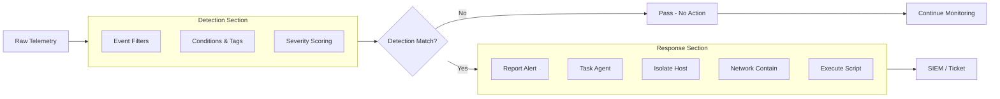
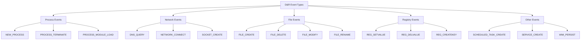
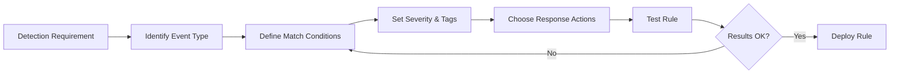
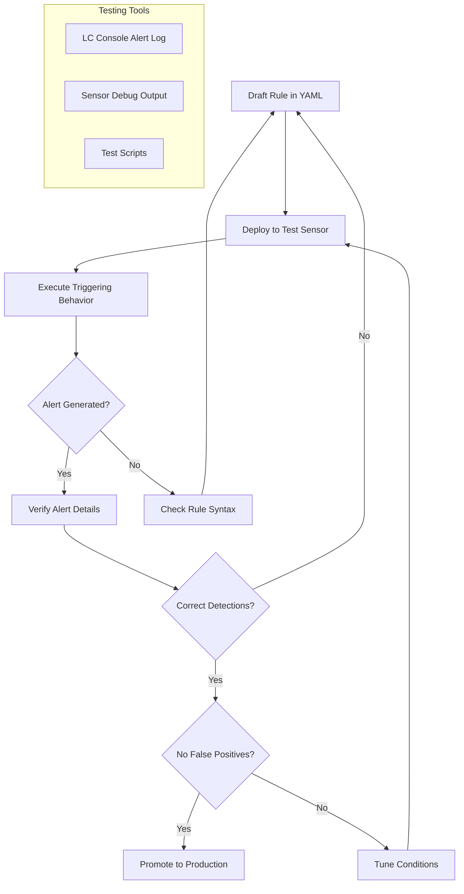
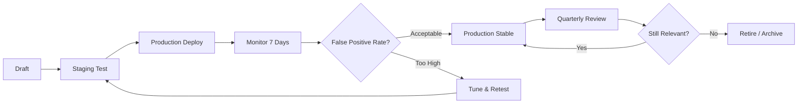

# 🛡️ Full-Stack Lesson: Reading and Writing Detection & Response (D&R) Rules in LimaCharlie

## 📊 Executive Summary
LimaCharlie's Detection & Response (D&R) rules are the core detection engine that transforms raw telemetry into actionable security alerts. A D&R rule consists of two tightly coupled sections: a **Detection** block that defines what to look for using event filters and conditions, and a **Response** block that specifies what action to take when a match occurs. This lesson provides a full-stack methodology to read, interpret, and write D&R rules from detection requirements, covering the rule structure, common actions, testing strategies, and real-world detection examples. You will learn to craft rules that detect behaviors like PowerShell spawning from Office applications, new service creation, and process injection attempts.



## 🏗️ Phase 1: Understanding D&R Rule Architecture

### What Are D&R Rules?
D&R rules are YAML-based detection definitions that live in LimaCharlie's cloud console. Every rule contains:

| Section | Purpose | Required |
|---------|---------|----------|
| **`detect`** | Defines the detection logic, event filters, and matching conditions | Yes |
| **`respond`** | Defines actions to execute when detection triggers | Yes |
| **`name`** | Human-readable rule identifier | Yes |
| **`meta`** | Metadata tags, severity, mitre-attack mappings | No |
| **`tags`** | Searchable labels for categorization | No |

### Detection Section Anatomy

```yaml
detect:
  events:
    - EVENT_TYPE          # Telemetry stream to monitor (NEW_PROCESS, DNS_QUERY, etc.)
  op: and                 # Logical operator: and / or
  rules:
    - op: is              # Comparison operator
      path: event/FIELD   # JSON path to the field
      value: "VALUE"     # Expected value
  target:
    - HOSTNAME            # Sensor targeting
  severity: medium        # Alert severity (low, medium, high, critical)
```

### Response Section Anatomy

```yaml
respond:
  - action: report        # Action type
    name: Alert Title
    description: Alert description with {{templates}} 
    event:
      severity: medium
      tags:
        - tag1
        - tag2
```

### Supported Comparison Operators

| Operator | Meaning | Example |
|----------|---------|---------|
| **`is`** | Exact string match | `path: event/COMMAND_LINE, value: "powershell"` |
| **`contains`** | Substring match | `path: event/COMMAND_LINE, contains: " -enc "` |
| **`starts_with`** | Prefix match | `path: event/FILE_PATH, starts_with: "C:\Windows\Temp\"` |
| **`ends_with`** | Suffix match | `path: event/FILE_PATH, ends_with: ".ps1"` |
| **`matches`** | Regex match | `path: event/COMMAND_LINE, matches: ".*-e.*[A-Za-z0-9+/]{50,}.*"` |
| **`gt`** | Greater than (numeric) | `path: event/SIZE, gt: 1000000` |
| **`lt`** | Less than (numeric) | `path: event/SIZE, lt: 1000` |
| **`exists`** | Field exists | `path: event/PARENT_PID, exists: true` |
| **`not`** | Negation wrapper | Wraps another rule and inverts match |

### Event Types Reference



## 🔍 Phase 2: Reading and Interpreting Existing D&R Rules

### Rule Analysis Methodology

When encountering an existing D&R rule, follow this systematic approach:

1. **Identify the Detection Target** — What behavior is the rule looking for?
2. **Parse Event Filters** — What telemetry event type is being examined?
3. **Analyze Conditions** — What specific field values must match?
4. **Determine Severity** — How critical is the detection?
5. **Review Response Actions** — What happens on match?
6. **Evaluate Effectiveness** — Could this produce false positives?

### Example: Reading a Known Rule

### 📖 Example: `office-spawn-powershell` Rule Analysis

```yaml
name: office-spawn-powershell
detect:
  events:
    - NEW_PROCESS
  op: and
  rules:
    - op: is
      path: event/PARENT_PROC
      value: "WINWORD.EXE"
    - op: ends_with
      path: event/FILE_PATH
      value: "powershell.exe"
    - op: is
      path: event/COMMAND_LINE
      value: ""
  target:
    - Windows
  severity: high
respond:
  - action: report
    name: Office Spawning PowerShell
    description: >
      Microsoft Word spawned PowerShell.
      Possible malicious macro execution.
      Host: {{hostname}}
      PID: {{event/PID}}
      Parent PID: {{event/PARENT_PID}}
    event:
      severity: high
      tags:
        - attack.t1204
        - defense-evasion
        - macro
      mitre_attack:
        - T1204.002
```

**Analysis**:
| Element | Value | Interpretation |
|---------|-------|---------------|
| **Event Type** | NEW_PROCESS | Triggers on every new process creation |
| **Parent Process** | WINWORD.EXE | Watching for processes launched by Word |
| **Child Process** | powershell.exe | Specifically, PowerShell being spawned |
| **Command Line** | Empty (`""`: not empty check via `is: ""`) | Matches any command line — waits for actual value |
| **Severity** | high | Significant detection priority |
| **Response** | report | Generates a high-severity alert with MITRE tags |

### Rule Quality Assessment Checklist

## D&R Rule Quality Checklist

### Completeness
- [ ] Rule has a descriptive `name`
- [ ] `events` field specifies correct telemetry type
- [ ] Detection conditions are specific enough to avoid false positives
- [ ] Response section includes actionable output

### Performance
- [ ] Event types are as narrow as possible (prefer NEW_PROCESS over audit:all)
- [ ] Conditions use indexed fields for faster matching
- [ ] No redundant or overlapping rules

### Response
- [ ] `action: report` includes template variables (hostname, PID, etc.)
- [ ] `severity` is appropriate for the behavior detected
- [ ] MITRE ATT&CK tags are included for mapping
- [ ] `description` contains actionable information for the analyst

## ✍️ Phase 3: Writing D&R Rules from Detection Requirements

### The Rule Writing Workflow



### Detection Requirement 1: PowerShell Spawning from Office Apps

This detection identifies macro-enabled documents that execute PowerShell via `WinWord.exe`, `Excel.exe`, or `PowerPoint.exe`.

```yaml
name: office-application-spawning-powershell
detect:
  events:
    - NEW_PROCESS
  op: and
  rules:
    - op: or
      rules:
        - op: is
          path: event/PARENT_PROC
          value: "WINWORD.EXE"
        - op: is
          path: event/PARENT_PROC
          value: "EXCEL.EXE"
        - op: is
          path: event/PARENT_PROC
          value: "POWERPNT.EXE"
    - op: or
      rules:
        - op: ends_with
          path: event/FILE_PATH
          value: "powershell.exe"
        - op: ends_with
          path: event/FILE_PATH
          value: "cmd.exe"
        - op: contains
          path: event/COMMAND_LINE
          value: "wscript"
        - op: contains
          path: event/COMMAND_LINE
          value: "cscript"
  target:
    - Windows
  severity: high
respond:
  - action: report
    name: Office Application Spawning Suspicious Process
    description: >
      {{event/PARENT_PROC}} (PID: {{event/PARENT_PID}}) spawned
      {{event/FILE_PATH}} (PID: {{event/PID}})
      with command line: {{event/COMMAND_LINE}}
      Host: {{hostname}}
    event:
      severity: high
      tags:
        - attack.t1204.002
        - phishing
        - macro
      mitre_attack:
        - T1204.002
  - action: task
    name: Collect Process Details
    command: processes?pid={{event/PID}}
```

> ⚠️ **False Positive Consideration**: Some legitimate Office add-ins or templates may spawn PowerShell. Tune with exclusion lists or specific command-line patterns.

### Detection Requirement 2: New Service Creation

This detection identifies when a new Windows service is created, particularly those pointing to suspicious binary paths.

```yaml
name: suspicious-service-creation
detect:
  events:
    - SERVICE_CREATE
  op: and
  rules:
    - op: or
      rules:
        - path: event/SERVICE_NAME
          contains: "scvhost"  # Common masquerade
        - path: event/SERVICE_NAME
          contains: "svch0st"
        - path: event/SERVICE_PATH
          matches: ".*\\\\Temp\\\\[^\\\\]*\\.exe$"
        - path: event/SERVICE_PATH
          matches: ".*\\\\Users\\\\[^\\\\]+\\\\AppData\\\\Local\\\\Temp\\\\[^\\\\]*\\.exe$"
        - path: event/SERVICE_PATH
          starts_with: "C:\\Windows\\Temp"
        - path: event/SERVICE_PATH
          contains: "powershell"
  target:
    - Windows
  severity: medium
respond:
  - action: report
    name: Suspicious Service Creation
    description: >
      New service created on {{hostname}}:
      Service Name: {{event/SERVICE_NAME}}
      Image Path: {{event/SERVICE_PATH}}
      Command: {{event/SERVICE_COMMAND}}
    event:
      severity: medium
      tags:
        - attack.t1543.003
        - persistence
        - service
      mitre_attack:
        - T1543.003
  - action: task
    name: Query Service Details
    command: services?name={{event/SERVICE_NAME}}
```

### Detection Requirement 3: Encoded PowerShell Command

Detects PowerShell launched with base64-encoded commands, a common obfuscation technique.

```yaml
name: encoded-powershell-command
detect:
  events:
    - NEW_PROCESS
  op: and
  rules:
    - op: ends_with
      path: event/FILE_PATH
      value: "powershell.exe"
    - op: or
      rules:
        - op: contains
          path: event/COMMAND_LINE
          value: " -enc "
        - op: contains
          path: event/COMMAND_LINE
          value: " -e "
        - op: matches
          path: event/COMMAND_LINE
          value: ".*-e[A-Za-z0-9+/]{50,}.*"
  target:
    - Windows
  severity: critical
respond:
  - action: report
    name: Encoded PowerShell Command Detected
    description: >
      Host: {{hostname}}
      PID: {{event/PID}}
      Parent PID: {{event/PARENT_PID}}
      Parent Process: {{event/PARENT_PROC}}
      Command Line: {{event/COMMAND_LINE}}
    event:
      severity: critical
      tags:
        - attack.t1059.001
        - obfuscation
        - execution
      mitre_attack:
        - T1059.001
        - T1027
  - action: isolate
    name: Isolate Suspicious Host
```

> 💡 **Pro Tip**: The `matches` operator with regex is powerful but expensive. Prefer `contains` and `starts_with` when possible for better performance.

### Common Response Actions Reference

| Action | Purpose | When to Use |
|--------|---------|-------------|
| **`report`** | Generate a security alert in the console | Most detections — always include a report |
| **`task`** | Execute an LCQL command on the agent | Need additional context (process list, network connections) |
| **`isolate`** | Disconnect host from network (except LC cloud) | Confirmed malicious activity, ransomware, C2 beaconing |
| **`contain`** | Block network connections for the process | Suspicious process actively communicating externally |
| **`tag`** | Add a tag to the sensor | Mark hosts for tracking or grouping |
| **`event`** | Generate a custom event | Enrich the telemetry stream with derived data |
| **`script`** | Execute a custom script on the agent | Remediation actions, artifact collection |
| **`email`** | Send notification via configured email | Non-critical alerts needing human review |
| **`webhook`** | POST alert data to an external URL | SOAR integration, Slack/Teams notifications |
| **`syslog`** | Forward alert to SIEM via syslog | Centralized logging compliance |

## 🧪 Phase 4: Rule Testing Methodology

### Testing Workflow



### Step 1: Deploy Rule to Staging

```yaml
# Save as encoded-powershell-staging.yaml
name: TEST-encoded-powershell-command
detect:
  events:
    - NEW_PROCESS
  op: and
  rules:
    - op: ends_with
      path: event/FILE_PATH
      value: "powershell.exe"
    - op: contains
      path: event/COMMAND_LINE
      value: " -enc "
  target:
    - WINDOWS_STAGING_GROUP  # Target a specific group
  severity: medium
respond:
  - action: report
    name: TEST - Encoded PowerShell
    description: Testing rule for encoded PowerShell detection
    event:
      severity: medium
```

### Step 2: Execute Test Trigger

```powershell
# On a test sensor, execute a simulated malicious command
powershell.exe -enc SQBkAG8AbgAnAHQAIABkAG8AIABhAG4AeQB0AGgAaQBuAGcA
```

### Step 3: Verify Alert in Console

```yaml
# Expected alert structure in LimaCharlie console
{
  "detect": {
    "name": "TEST - Encoded PowerShell",
    "event": {
      "severity": "medium"
    }
  },
  "event": {
    "FILE_PATH": "C:\\Windows\\System32\\WindowsPowerShell\\v1.0\\powershell.exe",
    "COMMAND_LINE": "powershell.exe -enc SQBkAG8AbgAnAHQAIABkAG8AIABhAG4AeQB0AGgAaQBuAGcA",
    "PID": 1234,
    "PARENT_PID": 888,
    "PARENT_PROC": "cmd.exe"
  }
}
```

### Step 4: Refine Based on Results

### 🔧 Tuning Considerations

| Issue | Solution | Example |
|-------|----------|---------|
| **Too many false positives** | Add more conditions or exclusions | Exclude known admin tools or scripts |
| **No detection** | Check event type and field paths | Ensure `event/PARENT_PROC` matches case |
| **Wrong severity** | Adjust severity based on impact | Lower for informational, raise for critical |
| **Missing context** | Add more `event/` template variables | Include `event/PARENT_PID` for process tree tracing |

## 🚀 Phase 5: Advanced Rule Patterns

### Pattern 1: Multi-Event Correlation

```yaml
name: persistence-chain-detection
detect:
  events:
    - NEW_PROCESS
    - SERVICE_CREATE
    - SCHEDULED_TASK_CREATE
  op: and
  rules:
    - op: is
      path: event/PARENT_PROC
      value: "cmd.exe"
    - op: contains
      path: event/COMMAND_LINE
      value: "schtasks"
  target:
    - Windows
  severity: high
respond:
  - action: report
    name: Scheduled Task Creation via CMD
    description: >
      Scheduled task created from cmd.exe on {{hostname}}.
      Command: {{event/COMMAND_LINE}}
    event:
      severity: high
      tags:
        - attack.t1053.005
        - persistence
```

### Pattern 2: Network-Based Detection with Process Context

```yaml
name: suspicious-dns-to-known-bad
detect:
  events:
    - DNS_QUERY
  op: and
  rules:
    - op: matches
      path: event/DOMAIN
      value: ".*\\.(xyz|top|gq|ml|tk)$"
  target:
    - Windows
  severity: medium
respond:
  - action: report
    name: Suspicious TLD DNS Query
    description: >
      Host: {{hostname}}
      Domain: {{event/DOMAIN}}
      Process: {{event/PROCESS_PATH}}
      PID: {{event/PID}}
    event:
      severity: medium
      tags:
        - attack.t1048
        - c2
        - network
  - action: task
    name: Get Full Network State
    command: netconn
```

### Pattern 3: Behavioral Anomaly Scoring

```yaml
name: multiple-scheduled-tasks-creation
detect:
  events:
    - SCHEDULED_TASK_CREATE
  op: and
  rules:
    - op: gt
      path: event/COUNT
      value: 5
  timeframe: 300  # 5 minute window
  target:
    - Windows
  severity: high
respond:
  - action: report
    name: Rapid Scheduled Task Creation
    description: >
      {{hostname}} created {{event/COUNT}} scheduled tasks in 5 minutes.
      Possible lateral movement tool deployment.
    event:
      severity: high
      tags:
        - attack.t1053.005
        - lateral-movement
```

## 📝 Phase 6: Best Practices and Rule Management

### D&R Rule Development Best Practices

1. **Start Broad, Narrow Down**: Begin with wider conditions, then add specificity to eliminate noise
2. **Use MITRE ATT&CK Mapping**: Always tag rules with relevant T-codes for operational context
3. **Leverage Template Variables**: Populate alerts with `{{hostname}}`, `{{event/PID}}`, `{{event/PARENT_PROC}}` for analyst utility
4. **Test Before Production**: Use staging groups and test scenarios to validate rules
5. **Monitor False Positive Rate**: Review rule performance weekly, tune aggressively

### Common Pitfalls

| Pitfall | Consequence | Prevention |
|---------|-------------|------------|
| **Overly broad conditions** | Alert fatigue from false positives | Use specific event types and multiple conditions |
| **Missing severity** | Alerts lack prioritization context | Always assign appropriate severity |
| **No response actions** | Detection without context is useless | Always include `report` with descriptive text |
| **Case sensitivity** | Missed detections | Understand field value casing (usually uppercase) |
| **Wrong event type** | Rule never triggers | Verify event type matches telemetry stream |

### Rule Lifecycle



### Deployment Checklist

## D&R Rule Deployment Checklist

### Pre-Deployment
- [ ] Rule syntax validated (no YAML errors)
- [ ] Rule deployed to staging group first
- [ ] Test scenario executed and alert confirmed
- [ ] False positive potential assessed
- [ ] Severity aligned with organizational SLAs

### Deployment
- [ ] Rule deployed to production group
- [ ] Notification sent to SOC team
- [ ] Rule name follows naming convention
- [ ] Tags match taxonomy standards

### Post-Deployment
- [ ] Alert volume baseline established
- [ ] False positive rate monitored (first 48 hours)
- [ ] Rule tuned based on initial feedback
- [ ] Documentation updated in runbook

## 🎯 Conclusion

D&R rules are the backbone of LimaCharlie's detection capability, providing a flexible YAML-based framework for translating behavioral detection requirements into automated response actions. By mastering the rule structure, understanding the event types and comparison operators, and following a disciplined testing methodology, you can create high-fidelity detections that minimize false positives while maximizing threat coverage. The key is to iterate: deploy, test, tune, and monitor continuously.
