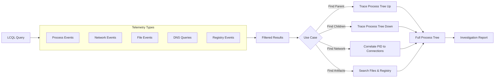
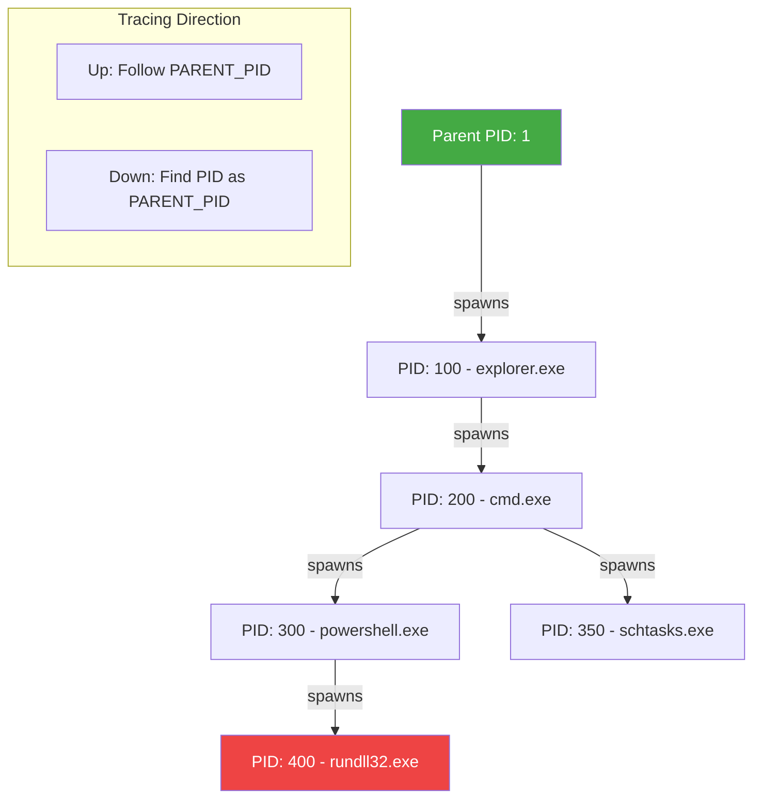
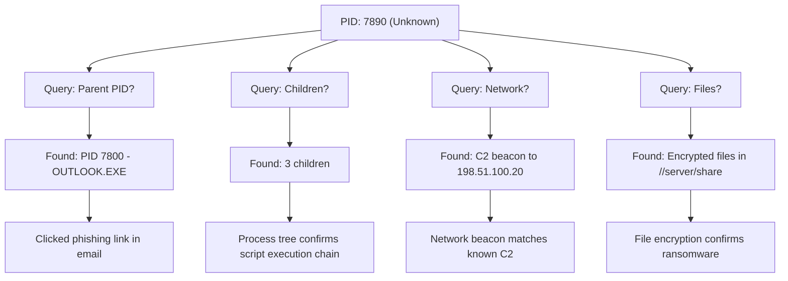

# 🔬 Full-Stack Lesson: Writing LCQL Queries and Tracing Process Trees in LimaCharlie

## 📊 Executive Summary
LimaCharlie's Log Collection Query Language (LCQL) is a powerful query engine that enables analysts to search across all collected telemetry in real time. Unlike traditional SIEM query languages, LCQL is specifically designed for EDR data—process creation events, network connections, DNS queries, file operations, and registry modifications. This lesson provides a full-stack methodology for writing LCQL queries, filtering by process identifiers and command lines, tracing process lineage through the event stream, and correlating network connections to their parent processes. You will learn to reconstruct entire process trees from telemetry, enabling deep forensic investigation of host compromise.



## 🏗️ Phase 1: Understanding LCQL Fundamentals

### What Is LCQL?
LCQL is a JSON-query language that uses MongoDB-style operators to filter and project telemetry events. Queries are executed against a time-series database of all collected EDR events.

**Key Characteristics**:
- **Event-Centric**: Each query targets a specific event type (e.g., `NEW_PROCESS`, `DNS_QUERY`)
- **Time-Bounded**: Queries must specify a time range
- **Stateless**: Each query is independent; results are not persisted
- **Real-Time Ready**: Can be used in live investigations and automated rules
- **Pipeable**: Results can be piped through transformations

### Basic Query Structure

```json
{
  "event_type": ["NEW_PROCESS"],
  "time_range": {
    "start": "2024-01-01T00:00:00Z",
    "end": "2024-01-02T00:00:00Z"
  },
  "filter": [
    {
      "field": "event/PARENT_PROC",
      "operator": "=",
      "value": "WINWORD.EXE"
    }
  ],
  "projection": {
    "include": ["event/PROC_PATH", "event/COMMAND_LINE", "event/PID"]
  },
  "limit": 100
}
```

### LCQL Query Anatomy

| Component | Purpose | Required |
|-----------|---------|----------|
| **`event_type`** | Array of telemetry types to search | Yes |
| **`time_range`** | Start/end timestamps with optional timezone | Yes |
| **`filter`** | Array of conditions using operators | No |
| **`projection`** | Include or exclude specific fields | No |
| **`sort`** | Sort results by field and direction | No |
| **`limit`** | Maximum results to return (default 100, max 10000) | No |
| **`cursor`** | Pagination cursor for large result sets | No |

### Supported Filter Operators

| Operator | LCQL Symbol | Description | Example |
|----------|-------------|-------------|---------|
| **Equals** | `=` | Exact match | `{"field": "event/FILE_PATH", "operator": "=", "value": "powershell.exe"}` |
| **Not Equals** | `!=` | Negation | `{"field": "event/PARENT_PROC", "operator": "!=", "value": "explorer.exe"}` |
| **Contains** | `contains` | Substring match | `{"field": "event/COMMAND_LINE", "operator": "contains", "value": "-enc"}` |
| **Starts With** | `starts_with` | Prefix match | `{"field": "event/FILE_PATH", "operator": "starts_with", "value": "C:\\Users"}` |
| **Ends With** | `ends_with` | Suffix match | `{"field": "event/FILE_PATH", "operator": "ends_with", "value": ".ps1"}` |
| **Regex** | `regex` | Regular expression | `{"field": "event/COMMAND_LINE", "operator": "regex", "value": ".*-e[A-Za-z0-9+/]{50,}.*"}` |
| **Greater Than** | `>` | Numeric comparison | `{"field": "event/SIZE", "operator": ">", "value": 1000000}` |
| **Less Than** | `<` | Numeric comparison | `{"field": "event/SIZE", "operator": "<", "value": 1000}` |
| **In** | `in` | Array membership | `{"field": "event/PARENT_PROC", "operator": "in", "value": ["WINWORD.EXE", "EXCEL.EXE"]}` |
| **Exists** | `exists` | Field presence | `{"field": "event/PARENT_PID", "operator": "exists", "value": true}` |

### Common Telemetry Event Fields

| Field Path | Event Types | Description |
|------------|-------------|-------------|
| `event/PID` | All | Process ID |
| `event/PARENT_PID` | NEW_PROCESS | Parent process ID |
| `event/PARENT_PROC` | NEW_PROCESS | Parent process name |
| `event/FILE_PATH` | NEW_PROCESS | Path to executable |
| `event/COMMAND_LINE` | NEW_PROCESS | Full command line with arguments |
| `event/PROC_PATH` | NEW_PROCESS | Process image path |
| `event/USER` | NEW_PROCESS | User account context |
| `event/DOMAIN` | DNS_QUERY | Domain name being resolved |
| `event/IPS` | NETWORK_CONNECT | Array of destination IPs |
| `event/PORTS` | NETWORK_CONNECT | Array of destination ports |
| `event/PROTOCOL` | NETWORK_CONNECT | TCP or UDP |
| `event/LOCAL_IP` | NETWORK_CONNECT | Local IP address |
| `event/REMOTE_IP` | NETWORK_CONNECT | Remote IP address |
| `event/REMOTE_PORT` | NETWORK_CONNECT | Remote port number |
| `event/DIRECTION` | NETWORK_CONNECT | Outbound / Inbound |
| `event/SERVICE_NAME` | SERVICE_CREATE | Windows service name |
| `event/SERVICE_PATH` | SERVICE_CREATE | Service binary path |
| `event/SERVICE_COMMAND` | SERVICE_CREATE | Service start command |
| `event/REG_KEY` | REG_SETVALUE | Registry key path |
| `event/REG_VALUE` | REG_SETVALUE | Registry value name |
| `event/REG_DATA` | REG_SETVALUE | Registry value data |
| `event/FILE_NAME` | FILE_CREATE | Name of created file |
| `event/FILE_PATH_CREATED` | FILE_CREATE | Full path of created file |
| `hostname` | All | Sensor hostname |
| `sensor_id` | All | Unique sensor identifier |
| `time` | All | Event timestamp (epoch microseconds) |

## 🔍 Phase 2: Running LCQL Queries

### Method 1: Via LimaCharlie Web Console

1. Navigate to **Detection & Response** → **LCQL Search**
2. Paste JSON query into the query editor
3. Set time range in the UI picker
4. Click **Run**

### Method 2: Via REST API

```python
import requests
import json

def run_lcql_query(api_key: str, org_id: str, query: dict) -> dict:
    url = f"https://api.lima-charlie.io/v1/orgs/{org_id}/detections/lcql/run"
    headers = {
        "Content-Type": "application/json",
        "Authorization": f"Bearer {api_key}"
    }
    response = requests.post(url, json=query, headers=headers, timeout=30)
    response.raise_for_status()
    return response.json()

# Example usage
query = {
    "event_type": ["NEW_PROCESS"],
    "time_range": {
        "start": "2024-01-01T00:00:00Z",
        "end": "2024-01-02T00:00:00Z"
    },
    "filter": [
        {"field": "event/PARENT_PROC", "operator": "=", "value": "WINWORD.EXE"}
    ],
    "limit": 50
}

# results = run_lcql_query("your_api_key", "your_org_id", query)
```

### Method 3: Via Python SDK

```python
# pip install lima-charlie-sdk
from limacharlie import Manager

def query_process_tree(api_key: str, org_id: str, pid: int, time_start: str, time_end: str) -> list:
    """
    Query process events matching a specific PID within a time range.
    """
    mgr = Manager(api_key, oid=org_id)
    
    query = {
        "event_type": ["NEW_PROCESS"],
        "time_range": {
            "start": time_start,
            "end": time_end
        },
        "filter": [
            {"field": "event/PID", "operator": "=", "value": pid}
        ],
        "limit": 10
    }
    
    results = mgr.run_lcql(query)
    return results

# Example
# events = query_process_tree(API_KEY, ORG_ID, 1234, "2024-01-01T00:00:00Z", "2024-01-02T00:00:00Z")
```

## 🌳 Phase 3: Tracing Process Trees Through the Event Stream

### The Process Tree Concept

Every process creation event (`NEW_PROCESS`) contains a `PID` and `PARENT_PID`. By chaining these relationships across events, you can reconstruct the complete ancestry of any process.



### Tracing Up the Tree (Finding Ancestors)

To find the parent chain of process with PID 300:

**Step 1: Find the target process**

```json
{
  "event_type": ["NEW_PROCESS"],
  "time_range": {
    "start": "2024-01-01T00:00:00Z",
    "end": "2024-01-02T00:00:00Z"
  },
  "filter": [
    {"field": "event/PID", "operator": "=", "value": 300}
  ],
  "limit": 1
}
```

**Step 2: Find the parent process using PARENT_PID**

```json
{
  "event_type": ["NEW_PROCESS"],
  "time_range": {
    "start": "2024-01-01T00:00:00Z",
    "end": "2024-01-02T00:00:00Z"
  },
  "filter": [
    {"field": "event/PID", "operator": "=", "value": 200}
  ],
  "limit": 1
}
```

### Tracing Down the Tree (Finding Children)

To find all processes spawned by PID 200:

```json
{
  "event_type": ["NEW_PROCESS"],
  "time_range": {
    "start": "2024-01-01T00:00:00Z",
    "end": "2024-01-02T00:00:00Z"
  },
  "filter": [
    {"field": "event/PARENT_PID", "operator": "=", "value": 200}
  ],
  "projection": {
    "include": [
      "event/PID",
      "event/FILE_PATH",
      "event/COMMAND_LINE",
      "event/PARENT_PROC",
      "time"
    ]
  },
  "limit": 100
}
```

### Automated Process Tree Reconstruction

### 🐍 Python Script: Full Process Tree Tracer

```python
from typing import Dict, List, Optional
from dataclasses import dataclass
from datetime import datetime

@dataclass
class ProcessNode:
    pid: int
    parent_pid: int
    process_name: str
    command_line: str
    file_path: str
    timestamp: str
    children: List['ProcessNode'] = None
    
    def __post_init__(self):
        if self.children is None:
            self.children = []

class ProcessTreeTracer:
    def __init__(self, query_runner):
        """
        query_runner: A callable that takes an LCQL query dict and returns results.
        """
        self.query_runner = query_runner
    
    def get_process_event(self, pid: int, time_start: str, time_end: str) -> Optional[ProcessNode]:
        """Fetch a single NEW_PROCESS event by PID."""
        query = {
            "event_type": ["NEW_PROCESS"],
            "time_range": {"start": time_start, "end": time_end},
            "filter": [{"field": "event/PID", "operator": "=", "value": pid}],
            "limit": 1
        }
        results = self.query_runner(query)
        
        if not results or len(results) == 0:
            return None
        
        event = results[0]
        return ProcessNode(
            pid=event.get('event', {}).get('PID'),
            parent_pid=event.get('event', {}).get('PARENT_PID'),
            process_name=event.get('event', {}).get('PARENT_PROC', event.get('event', {}).get('FILE_PATH', 'unknown')),
            command_line=event.get('event', {}).get('COMMAND_LINE', ''),
            file_path=event.get('event', {}).get('FILE_PATH', ''),
            timestamp=event.get('time', '')
        )
    
    def get_child_processes(self, parent_pid: int, time_start: str, time_end: str) -> List[ProcessNode]:
        """Fetch all processes spawned by a given PID."""
        query = {
            "event_type": ["NEW_PROCESS"],
            "time_range": {"start": time_start, "end": time_end},
            "filter": [{"field": "event/PARENT_PID", "operator": "=", "value": parent_pid}],
            "sort": [{"field": "time", "order": "asc"}],
            "limit": 1000
        }
        results = self.query_runner(query)
        
        children = []
        for event in results:
            child = ProcessNode(
                pid=event.get('event', {}).get('PID'),
                parent_pid=event.get('event', {}).get('PARENT_PID'),
                process_name=event.get('event', {}).get('FILE_PATH', 'unknown'),
                command_line=event.get('event', {}).get('COMMAND_LINE', ''),
                file_path=event.get('event', {}).get('FILE_PATH', ''),
                timestamp=event.get('time', '')
            )
            children.append(child)
        
        return children
    
    def trace_ancestry(self, pid: int, time_start: str, time_end: str, max_depth: int = 10) -> List[ProcessNode]:
        """
        Trace up the process tree from a given PID to find all ancestors.
        Returns: List from root ancestor down to the target process.
        """
        ancestors = []
        current_pid = pid
        depth = 0
        
        while current_pid and depth < max_depth:
            node = self.get_process_event(current_pid, time_start, time_end)
            if not node:
                break
            
            ancestors.insert(0, node)  # Prepend to build root->leaf
            current_pid = node.parent_pid
            depth += 1
        
        return ancestors
    
    def trace_descendants(self, pid: int, time_start: str, time_end: str, max_depth: int = 5) -> Dict[int, ProcessNode]:
        """
        Recursively trace down the process tree from a given PID.
        Returns: Dict of PID -> ProcessNode with children populated.
        """
        root = self.get_process_event(pid, time_start, time_end)
        if not root:
            # Create a synthetic root
            root = ProcessNode(
                pid=pid,
                parent_pid=0,
                process_name=f"PID:{pid} (not found)",
                command_line="",
                file_path="",
                timestamp=""
            )
        
        self._build_subtree(root, time_start, time_end, depth=0, max_depth=max_depth)
        return {root.pid: root}
    
    def _build_subtree(self, node: ProcessNode, time_start: str, time_end: str, depth: int, max_depth: int):
        """Recursively build child subtrees."""
        if depth >= max_depth:
            return
        
        children = self.get_child_processes(node.pid, time_start, time_end)
        for child in children:
            node.children.append(child)
            self._build_subtree(child, time_start, time_end, depth + 1, max_depth)
    
    def print_tree(self, node: ProcessNode, indent: str = ""):
        """Pretty-print the process tree."""
        cmd_prefix = f" ({node.command_line[:60]})" if node.command_line else ""
        print(f"{indent}├─ PID:{node.pid} | {node.process_name}{cmd_prefix}")
        
        for i, child in enumerate(node.children):
            is_last = (i == len(node.children) - 1)
            next_indent = indent + ("    " if is_last else "│   ")
            self.print_tree(child, next_indent)
    
    def to_json(self, node: ProcessNode) -> Dict:
        """Serialize process tree to JSON."""
        return {
            "pid": node.pid,
            "parent_pid": node.parent_pid,
            "process_name": node.process_name,
            "command_line": node.command_line,
            "file_path": node.file_path,
            "timestamp": node.timestamp,
            "children": [self.to_json(c) for c in node.children]
        }

# Usage
# tracer = ProcessTreeTracer(run_lcql_query)
# 
# # Trace up from suspicious PID
# ancestors = tracer.trace_ancestry(
#     pid=1234,
#     time_start="2024-06-15T08:00:00Z",
#     time_end="2024-06-15T10:00:00Z"
# )
# for node in ancestors:
#     print(f"{node.process_name} (PID: {node.pid}) <- ", end="")
# 
# # Trace full descendant tree
# tree = tracer.trace_descendants(
#     pid=456,
#     time_start="2024-06-15T08:00:00Z",
#     time_end="2024-06-15T10:00:00Z"
# )
# tracer.print_tree(tree[456])
```

## 🔗 Phase 4: Filtering by PID, Command Line, and Network Connections

### Finding All Processes by PID

```json
{
  "event_type": ["NEW_PROCESS"],
  "time_range": {
    "start": "2024-06-15T08:00:00Z",
    "end": "2024-06-15T10:00:00Z"
  },
  "filter": [
    {"field": "event/PID", "operator": "=", "value": 456}
  ],
  "limit": 10
}
```

### Finding All Process Spawned by a Specific Parent PID

```json
{
  "event_type": ["NEW_PROCESS"],
  "time_range": {
    "start": "2024-06-15T08:00:00Z",
    "end": "2024-06-15T10:00:00Z"
  },
  "filter": [
    {"field": "event/PARENT_PID", "operator": "=", "value": 456}
  ],
  "projection": {
    "include": ["event/PID", "event/FILE_PATH", "event/COMMAND_LINE", "time"]
  },
  "sort": [{"field": "time", "order": "asc"}],
  "limit": 100
}
```

### Finding Processes by Command Line Pattern

```json
{
  "event_type": ["NEW_PROCESS"],
  "time_range": {
    "start": "2024-06-15T08:00:00Z",
    "end": "2024-06-15T10:00:00Z"
  },
  "filter": [
    {
      "field": "event/COMMAND_LINE",
      "operator": "contains",
      "value": "-enc"
    }
  ],
  "projection": {
    "include": [
      "event/PID",
      "event/FILE_PATH",
      "event/COMMAND_LINE",
      "event/PARENT_PROC",
      "hostname",
      "time"
    ]
  },
  "limit": 100
}
```

### Finding Network Connections from a Process

```json
{
  "event_type": ["NETWORK_CONNECT"],
  "time_range": {
    "start": "2024-06-15T08:00:00Z",
    "end": "2024-06-15T10:00:00Z"
  },
  "filter": [
    {"field": "event/PID", "operator": "=", "value": 456}
  ],
  "projection": {
    "include": [
      "event/REMOTE_IP",
      "event/REMOTE_PORT",
      "event/LOCAL_IP",
      "event/DIRECTION",
      "event/PROTOCOL",
      "time"
    ]
  },
  "sort": [{"field": "time", "order": "asc"}],
  "limit": 100
}
```

### Correlating Process with Network and DNS

```json
{
  "event_type": ["NETWORK_CONNECT", "DNS_QUERY"],
  "time_range": {
    "start": "2024-06-15T08:00:00Z",
    "end": "2024-06-15T10:00:00Z"
  },
  "filter": [
    {"field": "event/PID", "operator": "=", "value": 456}
  ],
  "sort": [{"field": "time", "order": "asc"}],
  "limit": 200
}
```

### Complete Process Investigation Query Bundle

### 📦 Bundle: Full Process Investigation

```python
def investigate_process(api_key, org_id, pid, time_start, time_end, hostname=None):
    """
    Run a complete investigation bundle for a suspicious PID.
    """
    queries = {
        "process_details": {
            "event_type": ["NEW_PROCESS"],
            "time_range": {"start": time_start, "end": time_end},
            "filter": [{"field": "event/PID", "operator": "=", "value": pid}],
            "limit": 1
        },
        "parent_process": {
            "event_type": ["NEW_PROCESS"],
            "time_range": {"start": time_start, "end": time_end},
            "filter": [{"field": "event/PID", "operator": "=", "value": None}],  # Updated with PARENT_PID
            "limit": 1
        },
        "child_processes": {
            "event_type": ["NEW_PROCESS"],
            "time_range": {"start": time_start, "end": time_end},
            "filter": [{"field": "event/PARENT_PID", "operator": "=", "value": pid}],
            "limit": 100
        },
        "network_connections": {
            "event_type": ["NETWORK_CONNECT"],
            "time_range": {"start": time_start, "end": time_end},
            "filter": [{"field": "event/PID", "operator": "=", "value": pid}],
            "limit": 100
        },
        "dns_queries": {
            "event_type": ["DNS_QUERY"],
            "time_range": {"start": time_start, "end": time_end},
            "filter": [{"field": "event/PID", "operator": "=", "value": pid}],
            "limit": 100
        },
        "file_operations": {
            "event_type": ["FILE_CREATE", "FILE_MODIFY"],
            "time_range": {"start": time_start, "end": time_end},
            "filter": [{"field": "event/PID", "operator": "=", "value": pid}],
            "limit": 100
        },
        "registry_operations": {
            "event_type": ["REG_SETVALUE"],
            "time_range": {"start": time_start, "end": time_end},
            "filter": [{"field": "event/PID", "operator": "=", "value": pid}],
            "limit": 100
        }
    }
    
    if hostname:
        for key in queries:
            if key != "parent_process":  # Skip for parent, will update later
                queries[key].setdefault("filter", []).append(
                    {"field": "hostname", "operator": "=", "value": hostname}
                )
    
    return queries
```

## 🔄 Phase 5: Practical Investigation Exercises

### Exercise 1: Suspicious PowerShell Execution

**Scenario**: A security alert fires indicating encoded PowerShell on host `CORP-WIN10-01` at approximately `2024-06-15T09:30:00Z`.

**Task**: Find the process, trace its parent, and identify any network connections.

```json
// Query 1: Find the PowerShell process
{
  "event_type": ["NEW_PROCESS"],
  "time_range": {
    "start": "2024-06-15T09:25:00Z",
    "end": "2024-06-15T09:35:00Z"
  },
  "filter": [
    {"field": "hostname", "operator": "=", "value": "CORP-WIN10-01"},
    {"field": "event/FILE_PATH", "operator": "contains", "value": "powershell.exe"}
  ],
  "limit": 50
}
```

**Follow-Up**: From the results, extract the `PID` and `PARENT_PID`, then:

```json
// Query 2: Find the parent process details
{
  "event_type": ["NEW_PROCESS"],
  "time_range": {
    "start": "2024-06-15T09:25:00Z",
    "end": "2024-06-15T09:35:00Z"
  },
  "filter": [
    {"field": "event/PID", "operator": "=", "value": PARENT_PID_VALUE}
  ],
  "limit": 1
}
```

```json
// Query 3: Find network connections from the PowerShell PID
{
  "event_type": ["NETWORK_CONNECT"],
  "time_range": {
    "start": "2024-06-15T09:25:00Z",
    "end": "2024-06-15T09:35:00Z"
  },
  "filter": [
    {"field": "event/PID", "operator": "=", "value": PID_VALUE}
  ],
  "limit": 100
}
```

**Expected Analysis Flow**:
1. Find PowerShell with encoded command → Extract PID
2. Query parent PID → Find `WINWORD.EXE` → Indicates macro-based infection
3. Query network connections for PID → Find outbound to `203.0.113.5:443` → C2 beaconing

### Exercise 2: Lateral Movement Detection

**Scenario**: An alert shows service creation on host `SERVER-DB-02` with unusual binary path.

**Task**: Trace the process tree to find the source of the lateral movement.

```json
// Query 1: Find the service creation event
{
  "event_type": ["SERVICE_CREATE"],
  "time_range": {
    "start": "2024-06-15T14:00:00Z",
    "end": "2024-06-15T15:00:00Z"
  },
  "filter": [
    {"field": "hostname", "operator": "=", "value": "SERVER-DB-02"}
  ],
  "limit": 50
}
```

```json
// Query 2: Find NEW_PROCESS events around the same time for context
{
  "event_type": ["NEW_PROCESS"],
  "time_range": {
    "start": "2024-06-15T14:00:00Z",
    "end": "2024-06-15T15:00:00Z"
  },
  "filter": [
    {"field": "hostname", "operator": "=", "value": "SERVER-DB-02"},
    {"field": "event/COMMAND_LINE", "operator": "contains", "value": "service"}
  ],
  "limit": 50
}
```

### Exercise 3: Full Process Tree from Ransomware Alert

**Scenario**: A critical alert fires for a process on `FINANCE-WORKSTATION-05` isolating the host. You need to reconstruct the full process tree to understand the infection vector.

**Given PID**: `7890` at `2024-06-15T11:15:00Z`



**Queries to Run**:

```json
// Step 1: Get process details for PID 7890
{
  "event_type": ["NEW_PROCESS"],
  "time_range": {"start": "2024-06-15T11:00:00Z", "end": "2024-06-15T11:30:00Z"},
  "filter": [{"field": "event/PID", "operator": "=", "value": 7890}],
  "limit": 1
}

// Step 2: Find the parent chain
{
  "event_type": ["NEW_PROCESS"],
  "time_range": {"start": "2024-06-15T11:00:00Z", "end": "2024-06-15T11:30:00Z"},
  "filter": [{"field": "event/PID", "operator": "=", "value": PARENT_PID}],
  "limit": 1
}

// Step 3: Find all children of PID 7890
{
  "event_type": ["NEW_PROCESS"],
  "time_range": {"start": "2024-06-15T11:00:00Z", "end": "2024-06-15T11:30:00Z"},
  "filter": [{"field": "event/PARENT_PID", "operator": "=", "value": 7890}],
  "limit": 100
}

// Step 4: Find network connections
{
  "event_type": ["NETWORK_CONNECT"],
  "time_range": {"start": "2024-06-15T11:00:00Z", "end": "2024-06-15T11:30:00Z"},
  "filter": [{"field": "event/PID", "operator": "=", "value": 7890}],
  "limit": 100
}

// Step 5: Find DNS queries
{
  "event_type": ["DNS_QUERY"],
  "time_range": {"start": "2024-06-15T11:00:00Z", "end": "2024-06-15T11:30:00Z"},
  "filter": [{"field": "event/PID", "operator": "=", "value": 7890}],
  "limit": 100
}

// Step 6: Find file operations
{
  "event_type": ["FILE_CREATE", "FILE_MODIFY", "FILE_RENAME"],
  "time_range": {"start": "2024-06-15T11:00:00Z", "end": "2024-06-15T11:30:00Z"},
  "filter": [{"field": "event/PID", "operator": "=", "value": 7890}],
  "limit": 100
}
```

## 🧪 Phase 6: Advanced LCQL Techniques

### Using Projections for Performance

```json
// Include only relevant fields to reduce payload size
{
  "event_type": ["NEW_PROCESS"],
  "time_range": {"start": "2024-01-01T00:00:00Z", "end": "2024-01-02T00:00:00Z"},
  "filter": [{"field": "event/PARENT_PROC", "operator": "=", "value": "WINWORD.EXE"}],
  "projection": {
    "include": [
      "time",
      "hostname",
      "event/PID",
      "event/PARENT_PID",
      "event/FILE_PATH",
      "event/COMMAND_LINE"
    ]
  },
  "limit": 100
}
```

### Paginating Large Result Sets

```json
// First page
{
  "event_type": ["NEW_PROCESS"],
  "time_range": {"start": "2024-01-01T00:00:00Z", "end": "2024-01-02T00:00:00Z"},
  "filter": [{"field": "hostname", "operator": "=", "value": "CORP-WIN10-01"}],
  "limit": 1000
}

// Second page (use cursor from first response)
{
  "event_type": ["NEW_PROCESS"],
  "time_range": {"start": "2024-01-01T00:00:00Z", "end": "2024-01-02T00:00:00Z"},
  "filter": [{"field": "hostname", "operator": "=", "value": "CORP-WIN10-01"}],
  "cursor": "cursor_value_from_previous_response",
  "limit": 1000
}
```

### Sorting Results

```json
// Sort by time ascending (oldest first)
{
  "event_type": ["NEW_PROCESS"],
  "time_range": {"start": "2024-01-01T00:00:00Z", "end": "2024-01-02T00:00:00Z"},
  "filter": [{"field": "event/PID", "operator": "=", "value": 456}],
  "sort": [{"field": "time", "order": "asc"}],
  "limit": 100
}

// Sort by time descending (newest first - default)
{
  "event_type": ["NEW_PROCESS"],
  "time_range": {"start": "2024-01-01T00:00:00Z", "end": "2024-01-02T00:00:00Z"},
  "filter": [{"field": "event/PID", "operator": "=", "value": 456}],
  "sort": [{"field": "time", "order": "desc"}],
  "limit": 100
}
```

## 📝 Phase 7: Best Practices and Troubleshooting

### LCQL Query Best Practices

1. **Always bound time ranges** — Queries without time constraints may scan massive data volumes
2. **Prefer indexed fields** — `PID`, `PARENT_PID`, `hostname`, `event_type` are optimized for fast lookup
3. **Use projections** — Only request the fields you need to reduce network payload
4. **Limit results early** — Start with small limits, expand if needed
5. **Sort for consistency** — Always sort by time when analyzing process trees to get chronological order
6. **Batch related queries** — Investigation bundles can run in parallel for efficiency

### Common LCQL Issues

| Issue | Symptom | Solution |
|-------|---------|----------|
| **No results** | Empty response | Check time range, event type name, field paths, and sensor connectivity |
| **Too many results** | Query times out | Narrow time range, add more filters, use projection |
| **Wrong field name** | No matches to expected data | Verify field path from raw event JSON or documentation |
| **Case sensitivity** | Missed matches | Event field values are typically uppercase; use regex if uncertain |
| **PID recycling** | Wrong process attributed | Always include time context; PIDs can be reused across reboots |

### Investigation Checklist

## Process Tree Investigation Checklist

### Initial Triage
- [ ] Identify suspicious PID from alert
- [ ] Query process details: event/PID matches target
- [ ] Record: hostname, FILE_PATH, COMMAND_LINE, time

### Parent Chain (Upward)
- [ ] Query parent process: event/PID = event/PARENT_PID
- [ ] Repeat until reaching known-good root (explorer.exe, services.exe, wininit.exe)
- [ ] Document: full ancestry chain with PIDs and names

### Children & Descendants (Downward)
- [ ] Query immediate children: event/PARENT_PID = target PID
- [ ] Recursively trace each child for full tree
- [ ] Look for: secondary payloads, persistence mechanisms, LOLBins

### Network Correlation
- [ ] Query network connections for each PID in tree
- [ ] Query DNS queries for each PID
- [ ] Cross-reference remote IPs with threat intelligence
- [ ] Document: outbound connections, domains, protocols

### Artifact Correlation
- [ ] Query file creations: FILE_CREATE for each PID
- [ ] Query registry modifications: REG_SETVALUE for each PID
- [ ] Look for: persistence (run keys, services, scheduled tasks)

### Timeline Reconstruction
- [ ] Sort all events chronologically
- [ ] Identify: initial access timestamp, execution chain, C2 timeline
- [ ] Map: MITRE ATT&CK tactics to each event phase

## 🎯 Conclusion

LCQL is the primary investigative interface into LimaCharlie's telemetry store, enabling deep forensic analysis through precise, filterable queries against process, network, file, and registry events. By mastering LCQL syntax, understanding the event field schema, and following a systematic process tree tracing methodology, you can reconstruct the complete timeline of an incident—from initial execution through lateral movement and C2 communication. The combination of upward ancestry tracing and downward child discovery, paired with network and file operation correlation, provides the comprehensive visibility needed for effective EDR investigations.
