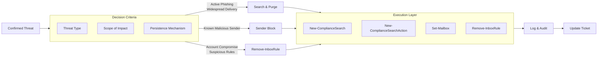
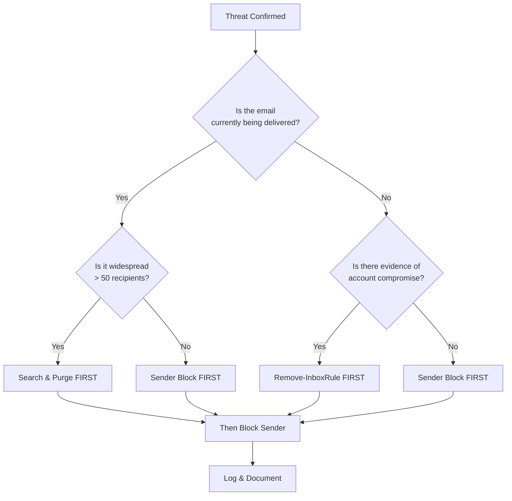
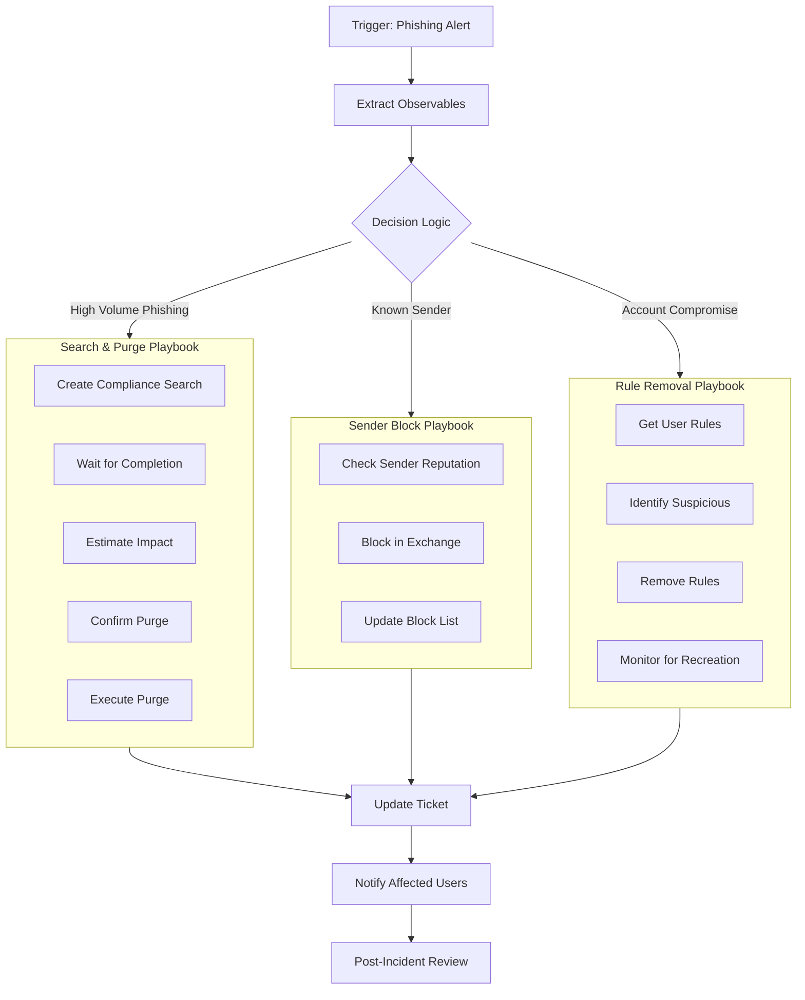

# 🚨 Full-Stack Lesson: Deciding & Executing Reactive Email Responses

## 📊 Executive Summary
When an email threat is confirmed, the speed and accuracy of your reactive response determine the blast radius. This lesson provides a full-stack methodology for deciding between and executing three critical containment actions: **Search & Purge** (remove the threat from all mailboxes), **Sender Block** (prevent future deliveries), and **Remove-InboxRule** (eliminate attacker persistence). You'll learn the decision framework, technical execution via PowerShell and APIs, and how to automate these responses in a SOAR playbook.



## 🧠 Phase 1: The Decision Framework

### Response Action Matrix
| Threat Scenario | Primary Response | Secondary Response | Example |
|----------------|------------------|-------------------|---------|
| **Active Phishing Campaign** | Search & Purge | Sender Block | O365 credential harvest with 500+ recipients |
| **Known Malicious Sender** | Sender Block | Search & Purge (if recent delivery) | Known threat actor domain |
| **Account Compromise** | Remove-InboxRule | Search & Purge, Sender Block | Attacker created forwarding rules |
| **Internal Propagation** | Search & Purge | Sender Block (internal sender) | Worm spreading via email |
| **Spear Phishing with Attachment** | Search & Purge | Sender Block (if external) | Malicious PDF to executives |

### Decision Tree


### Key Considerations
1. **Speed vs. Scope**: Search & Purge takes minutes to propagate, while Sender Block is near-instant
2. **Persistence**: Inbox rules survive password resets, making them a priority in account compromise
3. **Collateral Damage**: Blocking a sender affects all future emails, including legitimate replies
4. **Compliance**: Search & Purge creates auditable compliance records, while manual deletion doesn't

## 🛠️ Phase 2: Technical Execution (PowerShell & Graph API)

### Prerequisites
```powershell
# Install required modules (if not already)
Install-Module -Name ExchangeOnlineManagement -Scope CurrentUser
Install-Module -Name Microsoft.Graph.Security -Scope CurrentUser

# Connect to services
Connect-ExchangeOnline
Connect-MgSecurity -Scopes "SecurityEvents.ReadWrite.All"
```

### 1. Search & Purge Execution

### ⚙️ Advanced Search & Purge Script

```powershell
function Invoke-EmailSearchAndPurge {
    param(
        [Parameter(Mandatory=$true)]
        [string]$SearchQuery,
        
        [Parameter(Mandatory=$true)]
        [string]$PurgeReason,
        
        [int]$EstimateOnly = 0,
        
        [int]$PurgeAction = 0  # 0 = SoftDelete, 1 = HardDelete
    )
    
    # Generate unique search name
    $searchName = "ThreatResponse_$(Get-Date -Format 'yyyyMMdd_HHmmss')"
    
    # Create compliance search
    $search = New-ComplianceSearch -Name $searchName -ExchangeLocation All -ContentMatchQuery $SearchQuery
    
    # Start the search
    Start-ComplianceSearch -Identity $searchName
    
    # Wait for search to complete
    Write-Host "Waiting for search to complete..." -ForegroundColor Yellow
    while ((Get-ComplianceSearch -Identity $searchName).Status -ne "Completed") {
        Start-Sleep -Seconds 10
    }
    
    # Get search statistics
    $searchStats = Get-ComplianceSearch -Identity $searchName
    Write-Host "`nSearch Statistics:" -ForegroundColor Cyan
    Write-Host "  Items found: $($searchStats.Items)"
    Write-Host "  Size: $([math]::Round($searchStats.Size / 1MB, 2)) MB"
    
    if ($EstimateOnly -eq 1) {
        Write-Host "`nEstimate only. No purge performed." -ForegroundColor Yellow
        return $searchStats
    }
    
    # Prompt for confirmation
    $confirmation = Read-Host "Do you want to purge these items? (Y/N)"
    if ($confirmation -ne 'Y') {
        Write-Host "Purge cancelled." -ForegroundColor Yellow
        return $searchStats
    }
    
    # Create purge action
    $purgeName = "$searchName`_Purge"
    New-ComplianceSearchAction -SearchName $searchName -Purge -PurgeType $PurgeAction -Confirm:$false
    
    # Wait for purge to complete
    Write-Host "Waiting for purge to complete..." -ForegroundColor Yellow
    while ((Get-ComplianceSearchAction -Identity $purgeName).Status -ne "Completed") {
        Start-Sleep -Seconds 15
    }
    
    # Get purge results
    $purgeResults = Get-ComplianceSearchAction -Identity $purgeName
    Write-Host "`nPurge Results:" -ForegroundColor Green
    Write-Host "  Items purged: $($purgeResults.PurgeCount)"
    Write-Host "  Status: $($purgeResults.Status)"
    
    # Log the action
    $logEntry = @{
        Timestamp = Get-Date -Format "o"
        Action = "SearchAndPurge"
        SearchQuery = $SearchQuery
        ItemsFound = $searchStats.Items
        ItemsPurged = $purgeResults.PurgeCount
        Reason = $PurgeReason
        SearchName = $searchName
    }
    
    # Output to JSON for ticket integration
    $logEntry | ConvertTo-Json -Depth 3
    
    return $purgeResults
}

# Example usage
# Invoke-EmailSearchAndPurge -SearchQuery 'Subject:"Urgent: Password Reset" AND From:phishing@example.com' -PurgeReason "Active phishing campaign"
```


### 2. Sender Block Execution

```powershell
function Block-SenderAddress {
    param(
        [Parameter(Mandatory=$true)]
        [string]$SenderAddress,
        
        [Parameter(Mandatory=$false)]
        [string]$Reason = "Threat response",
        
        [Parameter(Mandatory=$false)]
        [int]$DurationHours = 0  # 0 = indefinite
    )
    
    # Block in Exchange Online
    $blockParams = @{
        Identity = $SenderAddress
        BlockedSenderAddress = $true
    }
    
    if ($DurationHours -gt 0) {
        $blockParams.Add("ExpirationDate", (Get-Date).AddHours($DurationHours))
    }
    
    Set-Mailbox @blockParams
    
    # Alternative: Block in tenant's blocked sender domains
    # Set-RemoteDomain -Identity "Malicious Domain" -AutoForwardEnabled $false
    
    # Log the action
    $logEntry = @{
        Timestamp = Get-Date -Format "o"
        Action = "SenderBlock"
        SenderAddress = $SenderAddress
        Reason = $Reason
        DurationHours = $DurationHours
    }
    
    $logEntry | ConvertTo-Json
    
    Write-Host "Sender blocked: $SenderAddress" -ForegroundColor Green
}

# Example usage
# Block-SenderAddress -SenderAddress "phishing@example.com" -Reason "Known phishing domain" -DurationHours 72
```

### 3. Remove-InboxRule Execution

### 🔧 Advanced Inbox Rule Scanner & Remover

```powershell
function Remove-SuspiciousInboxRules {
    param(
        [Parameter(Mandatory=$true)]
        [string]$UserPrincipalName,
        
        [Parameter(Mandatory=$false)]
        [string[]]$SuspiciousPatterns = @(
            "forwardto:*@external.com",
            "redirectto:*@external.com",
            "deletemessage:",
            "movetofolder:junk",
            "markasread:"
        ),
        
        [Parameter(Mandatory=$false)]
        [switch]$Force
    )
    
    # Get all inbox rules for the user
    $rules = Get-InboxRule -Mailbox $UserPrincipalName
    
    $suspiciousRules = @()
    $removedRules = @()
    
    foreach ($rule in $rules) {
        $isSuspicious = $false
        
        # Check for suspicious patterns
        foreach ($pattern in $SuspiciousPatterns) {
            if ($rule.ToString() -like $pattern) {
                $isSuspicious = $true
                break
            }
        }
        
        # Check for common attacker patterns
        if ($rule.ForwardTo -like "*@external.com" -or 
            $rule.RedirectTo -like "*@external.com" -or
            $rule.DeleteMessage -eq $true -or
            $rule.MoveToFolder -eq "Junk" -or
            $rule.MarkAsRead -eq $true) {
            
            $isSuspicious = $true
        }
        
        if ($isSuspicious) {
            $suspiciousRules += $rule
            
            if ($Force -or $PSCmdlet.ShouldProcess($rule.Name, "Remove")) {
                Remove-InboxRule -Mailbox $UserPrincipalName -Identity $rule.Identity -Confirm:$false
                $removedRules += $rule
            }
        }
    }
    
    # Generate report
    $report = @{
        UserPrincipalName = $UserPrincipalName
        TotalRules = $rules.Count
        SuspiciousRulesFound = $suspiciousRules.Count
        RulesRemoved = $removedRules.Count
        SuspiciousRules = $suspiciousRules | Select-Object Name, ForwardTo, RedirectTo, DeleteMessage, MoveToFolder
        RemovedRules = $removedRules | Select-Object Name, Identity
        Timestamp = Get-Date -Format "o"
    }
    
    $report | ConvertTo-Json -Depth 3
    
    return $report
}

# Example usage
# Remove-SuspiciousInboxRules -UserPrincipalName "compromised@company.com" -Force
```


## 🔄 Phase 3: Automation & SOAR Integration

### Playbook Design



### Python SOAR Integration

```python
import requests
import json
from datetime import datetime

class EmailResponseAutomator:
    def __init__(self, exchange_url, graph_url, ticketing_api):
        self.exchange_url = exchange_url
        self.graph_url = graph_url
        self.ticketing_api = ticketing_api
        
    def execute_response(self, threat_intel, decision):
        """Execute the appropriate response based on decision."""
        
        if decision['action'] == 'search_purge':
            result = self._search_and_purge(
                threat_intel['query'],
                threat_intel['reason']
            )
        elif decision['action'] == 'sender_block':
            result = self._block_sender(
                threat_intel['sender'],
                threat_intel['reason'],
                decision.get('duration_hours', 0)
            )
        elif decision['action'] == 'remove_rules':
            result = self._remove_inbox_rules(
                threat_intel['user'],
                threat_intel['patterns']
            )
        else:
            raise ValueError(f"Unknown action: {decision['action']}")
        
        # Update ticket
        self._update_ticket(threat_intel['ticket_id'], result)
        
        return result
    
    def _search_and_purge(self, query, reason):
        """Execute Search & Purge via Exchange PowerShell."""
        # Convert to PowerShell command
        ps_command = f"""
        $search = New-ComplianceSearch -Name "ThreatResponse_{datetime.now().strftime('%Y%m%d_%H%M%S')}" -ExchangeLocation All -ContentMatchQuery '{query}'
        Start-ComplianceSearch -Identity $search.Name
        # Wait and purge logic here
        """
        
        # Execute via PowerShell endpoint
        response = requests.post(
            f"{self.exchange_url}/api/v1.0/execute",
            json={"command": ps_command},
            headers={"Content-Type": "application/json"}
        )
        
        return response.json()
    
    def _block_sender(self, sender, reason, duration_hours=0):
        """Block sender via Exchange Online."""
        ps_command = f"""
        Set-Mailbox -Identity "{sender}" -BlockedSenderAddress $true
        """
        
        if duration_hours > 0:
            ps_command += f"""
            $expiration = (Get-Date).AddHours({duration_hours})
            Set-Mailbox -Identity "{sender}" -ExpirationDate $expiration
            """
        
        response = requests.post(
            f"{self.exchange_url}/api/v1.0/execute",
            json={"command": ps_command},
            headers={"Content-Type": "application/json"}
        )
        
        return response.json()
    
    def _remove_inbox_rules(self, user, patterns):
        """Remove suspicious inbox rules."""
        ps_command = f"""
        $rules = Get-InboxRule -Mailbox "{user}"
        $removed = @()
        
        foreach ($rule in $rules) {{
            $isSuspicious = $false
            foreach ($pattern in {patterns}) {{
                if ($rule.ToString() -like $pattern) {{
                    $isSuspicious = $true
                    break
                }}
            }}
            
            if ($isSuspicious) {{
                Remove-InboxRule -Mailbox "{user}" -Identity $rule.Identity -Confirm:$false
                $removed += $rule
            }}
        }}
        
        ConvertTo-Json -Depth 3 @{{
            User = "{user}"
            RemovedRules = $removed
            Timestamp = Get-Date -Format "o"
        }}
        """
        
        response = requests.post(
            f"{self.exchange_url}/api/v1.0/execute",
            json={"command": ps_command},
            headers={"Content-Type": "application/json"}
        )
        
        return response.json()
    
    def _update_ticket(self, ticket_id, result):
        """Update ticketing system with response results."""
        update_data = {
            "ticket_id": ticket_id,
            "status": "response_executed",
            "response_result": result,
            "timestamp": datetime.now().isoformat()
        }
        
        requests.post(
            f"{self.ticketing_api}/update",
            json=update_data,
            headers={"Content-Type": "application/json"}
        )

# Example usage
# automator = EmailResponseAutomator(
#     exchange_url="https://exchange.company.com",
#     graph_url="https://graph.microsoft.com",
#     ticketing_api="https://tickets.company.com/api"
# )
# 
# result = automator.execute_response(
#     threat_intel={
#         "query": 'Subject:"Urgent: Password Reset" AND From:phishing@example.com',
#         "sender": "phishing@example.com",
#         "user": "compromised@company.com",
#         "reason": "Active phishing campaign",
#         "ticket_id": "INC-12345"
#     },
#     decision={
#         "action": "search_purge",
#         "priority": "high"
#     }
# )
```

## 📋 Phase 4: Best Practices & Runbook

### Pre-Execution Checklist
```markdown
## Reactive Response Pre-Execution Checklist

### 1. Verification
- [ ] Threat confirmed by multiple sources
- [ ] False positive rate assessed
- [ ] Impact scope determined (number of recipients)

### 2. Authorization
- [ ] Approval level appropriate for action
  - Search & Purge: L2 SOC
  - Sender Block: L2 SOC
  - Remove-InboxRule: L3/IR Team
- [ ] Compliance requirements checked
- [ ] Legal hold considerations reviewed

### 3. Technical Preparation
- [ ] PowerShell modules updated
- [ ] API credentials valid
- [ ] Test environment validated (if available)
- [ ] Rollback plan documented

### 4. Communication
- [ ] Affected users identified
- [ ] Notification templates prepared
- [ ] Management informed of potential impact
- [ ] Security team coordination confirmed
```

### Execution Runbook

### 📖 Detailed Step-by-Step Runbook

# Email Threat Response Runbook

## Scenario 1: Active Phishing Campaign (Search & Purge)

### Step 1: Create Compliance Search
```powershell
$searchName = "PhishingResponse_$(Get-Date -Format 'yyyyMMdd_HHmmss')"
New-ComplianceSearch -Name $searchName -ExchangeLocation All -ContentMatchQuery 'Subject:"Urgent: Password Reset" AND From:phishing@example.com'
Start-ComplianceSearch -Identity $searchName
```

### Step 2: Monitor Search Progress
```powershell
Get-ComplianceSearch -Identity $searchName | Select-Object Name, Status, Items, Size
```

### Step 3: Estimate Impact
```powershell
$searchStats = Get-ComplianceSearch -Identity $searchName
Write-Host "Found $($searchStats.Items) items ($([math]::Round($searchStats.Size / 1MB, 2)) MB)"
```

### Step 4: Execute Purge
```powershell
New-ComplianceSearchAction -SearchName $searchName -Purge -PurgeType SoftDelete -Confirm:$false
```

### Step 5: Verify Purge
```powershell
Get-ComplianceSearchAction -Identity "$searchName`_Purge"
```

## Scenario 2: Account Compromise (Remove-InboxRule)

### Step 1: Identify Compromised Account
```powershell
$compromisedUser = "user@company.com"
```

### Step 2: Get Existing Rules
```powershell
$rules = Get-InboxRule -Mailbox $compromisedUser
$rules | Select-Object Name, ForwardTo, RedirectTo, DeleteMessage
```

### Step 3: Remove Suspicious Rules
```powershell
$suspiciousRules = $rules | Where-Object {
    $_.ForwardTo -like "*@external.com" -or
    $_.RedirectTo -like "*@external.com" -or
    $_.DeleteMessage -eq $true
}

foreach ($rule in $suspiciousRules) {
    Remove-InboxRule -Mailbox $compromisedUser -Identity $rule.Identity -Confirm:$false
}
```

### Step 4: Verify Removal
```powershell
Get-InboxRule -Mailbox $compromisedUser
```

## Scenario 3: Known Malicious Sender (Block Sender)

### Step 1: Block Sender
```powershell
Set-Mailbox -Identity "malicious@external.com" -BlockedSenderAddress $true
```

### Step 2: Verify Block
```powershell
Get-Mailbox -Identity "malicious@external.com" | Select-Object BlockedSenderAddress
```

### Step 3: Alternative - Block Domain
```powershell
Set-RemoteDomain -Identity "malicious.com" -AutoForwardEnabled $false
```

### Post-Execution Actions
1. **Document Everything**: Log actions in ticket with timestamps
2. **Monitor Effectiveness**: Check for rule recreation or new phishing attempts
3. **User Notification**: Inform affected users of actions taken
4. **Update Signatures**: Add indicators to detection systems
5. **Post-Incident Review**: Analyze response time and effectiveness

## 🚨 Phase 5: Common Pitfalls & Troubleshooting

| Pitfall | Symptom | Solution |
|---------|---------|----------|
| **Search Stuck in "Starting"** | Search never progresses | Check search permissions, try simpler query |
| **Purge Partial Failure** | Some items not purged | Check mailbox permissions, retry with HardDelete |
| **Rule Recreation** | Rules reappear after removal | Account still compromised, reset password |
| **False Positive Block** | Legitimate sender blocked | Review block list, use temporary duration |
| **Permission Errors** | Access denied errors | Verify RBAC roles, check admin permissions |

### Troubleshooting Script
```powershell
function Test-ResponsePermissions {
    param([string]$UserPrincipalName)
    
    $results = @{}
    
    # Test Search & Purge permissions
    try {
        New-ComplianceSearch -Name "Test_$(Get-Random)" -ExchangeLocation $UserPrincipalName -ContentMatchQuery "Subject:Test" -ErrorAction Stop
        $results['SearchPurge'] = $true
    } catch {
        $results['SearchPurge'] = $_.Exception.Message
    }
    
    # Test Sender Block permissions
    try {
        Set-Mailbox -Identity $UserPrincipalName -BlockedSenderAddress $true -ErrorAction Stop
        $results['SenderBlock'] = $true
        Set-Mailbox -Identity $UserPrincipalName -BlockedSenderAddress $false -ErrorAction Stop
    } catch {
        $results['SenderBlock'] = $_.Exception.Message
    }
    
    # Test Inbox Rule permissions
    try {
        Get-InboxRule -Mailbox $UserPrincipalName -ErrorAction Stop
        $results['InboxRules'] = $true
    } catch {
        $results['InboxRules'] = $_.Exception.Message
    }
    
    return $results
}

# Example usage
# Test-ResponsePermissions -UserPrincipalName "admin@company.com"
```

## 📈 Phase 6: Metrics & Continuous Improvement

### Key Performance Indicators
1. **Mean Time to Respond (MTTR)**: Time from detection to response execution
2. **False Positive Rate**: Percentage of actions taken on legitimate emails
3. **Coverage Percentage**: Percentage of affected mailboxes successfully cleaned
4. **Rule Recreation Rate**: Percentage of removed rules that reappear within 24 hours

### Response Time Targets
| Threat Type | Target MTTR | Maximum MTTR |
|-------------|-------------|--------------|
| **Active Phishing** | < 15 minutes | < 30 minutes |
| **Account Compromise**