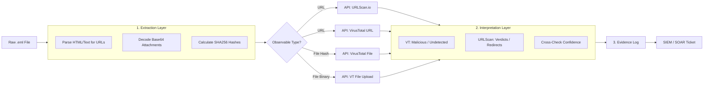

# 🧪 Full-Stack Lesson: Extracting, Submitting, and Interpreting URL & Attachment Verdicts

## 📊 Executive Summary
In the 7-step triage flow, **Enrichment** and **Investigation** rely heavily on detonating and scanning observables. Manually copying and pasting URLs or saving attachments to upload to sandboxes is slow, error-prone, and dangerous. This lesson provides a full-stack methodology to programmatically extract URLs and attachments from a raw `.eml` file, submit them to VirusTotal (VT) and URLScan.io via API, parse the verdicts, and inject the results directly into your running evidence log.



## 🏗️ Phase 1: The Extraction Engine (Data Layer)

Before scanning, we must safely extract observables. We need the URLs (including those hidden in HTML `href` tags) and the attachments (decoded from base64, hashed, and optionally saved to a secure sandbox directory).

### Python Extraction Script
This script extends the standard `email` module to handle HTML parsing and base64 decoding securely.

```python
import email
import re
import base64
import hashlib
from email import policy
from urllib.parse import urlparse
from bs4 import BeautifulSoup # Requires: pip install beautifulsoup4

class EmailObservableExtractor:
    def __init__(self, eml_path):
        self.eml_path = eml_path
        with open(eml_path, 'rb') as f:
            self.msg = email.message_from_binary_file(f, policy=policy.default)
        
        self.urls = set()
        self.attachments = [] # List of dicts: {filename, sha256, size, content_bytes}

    def extract_observables(self):
        self._extract_urls_from_headers()
        self._walk_parts()
        return {
            "urls": list(self.urls),
            "attachments": self.attachments
        }

    def _extract_urls_from_headers(self):
        # Look for URLs in common header fields
        for header in ['List-Unsubscribe', 'Feedback-ID']:
            value = self.msg.get(header, '')
            if value:
                found_urls = re.findall(r'https?://[^\s>]+', value)
                self.urls.update(found_urls)

    def _walk_parts(self):
        for part in self.msg.walk():
            content_type = part.get_content_type()
            content_disposition = str(part.get("Content-Disposition", ""))

            # 1. Handle Attachments
            if "attachment" in content_disposition:
                filename = part.get_filename() or "unknown_attachment"
                payload = part.get_payload(decode=True)
                
                if payload:
                    sha256 = hashlib.sha256(payload).hexdigest()
                    self.attachments.append({
                        "filename": filename,
                        "sha256": sha256,
                        "size": len(payload),
                        "content_bytes": payload # Keep in memory for VT upload; CAUTION with large files
                    })
            
            # 2. Handle Body Text/HTML for URLs
            elif content_type == 'text/plain':
                payload = part.get_payload(decode=True)
                if payload:
                    text = payload.decode(part.get_content_charset() or 'utf-8', errors='replace')
                    self._extract_urls_from_text(text)
                    
            elif content_type == 'text/html':
                payload = part.get_payload(decode=True)
                if payload:
                    html = payload.decode(part.get_content_charset() or 'utf-8', errors='replace')
                    self._extract_urls_from_html(html)

    def _extract_urls_from_text(self, text):
        # Catch http/https links
        urls = re.findall(r'https?://[^\s<>"]+|www\.[^\s<>"]+', text)
        self.urls.update(urls)

    def _extract_urls_from_html(self, html):
        # Use BeautifulSoup to parse href tags accurately
        soup = BeautifulSoup(html, 'html.parser')
        for a_tag in soup.find_all('a', href=True):
            href = a_tag['href']
            if href.startswith(('http://', 'https://')):
                self.urls.add(href)
        
        # Fallback regex for poorly formed HTML
        self._extract_urls_from_text(html)

# Usage
# extractor = EmailObservableExtractor("phishing_email.eml")
# observables = extractor.extract_observables()
```

> ⚠️ **Security Note**: Keeping `content_bytes` in memory is fine for small scripts, but for production SOAR integrations, write the payload directly to a secure, isolated quarantine directory on disk and discard the memory buffer immediately to prevent Denial of Service (DoS) via zip bombs or memory exhaustion.

## 🔗 Phase 2: The API Integration (Backend Layer)

We will integrate with **VirusTotal (v3 API)** and **URLScan.io**. VirusTotal provides aggregate AV engine verdicts, while URLScan.io provides a live browser detonation snapshot, which is invaluable for catching credential harvesting pages that AV engines miss.

### 1. VirusTotal API Integration
VT v3 uses SHA256 for file lookups and base64 (no padding) for URL lookups.

```python
import requests
import base64
import time

class VirusTotalEnricher:
    def __init__(self, api_key):
        self.api_key = api_key
        self.base_url = "https://www.virustotal.com/api/v3"
        self.headers = {"x-apikey": self.api_key}

    def _get_url_id(self, url):
        # VT expects URL to be base64 encoded without padding
        url_id = base64.urlsafe_b64encode(url.encode()).decode().strip("=")
        return url_id

    def scan_url(self, url):
        # 1. Submit URL for scanning (if not recently scanned)
        post_url = f"{self.base_url}/urls"
        requests.post(post_url, headers=self.headers, data={"url": url})
        
        # 2. Get the report
        url_id = self._get_url_id(url)
        get_url = f"{self.base_url}/urls/{url_id}"
        response = requests.get(get_url, headers=self.headers)
        return response.json()

    def scan_file_hash(self, sha256):
        # Check if file has already been scanned by hash
        get_url = f"{self.base_url}/files/{sha256}"
        response = requests.get(get_url, headers=self.headers)
        if response.status_code == 200:
            return response.json()
        return None # Not found in VT

    def upload_file(self, file_bytes, filename):
        # Upload binary if hash lookup fails
        post_url = f"{self.base_url}/files"
        files = {"file": (filename, file_bytes)}
        response = requests.post(post_url, headers=self.headers, files=files)
        
        # Get the analysis ID and wait for processing
        if response.status_code == 200:
            analysis_id = response.json()['data']['id']
            return self._poll_analysis(analysis_id)
        return None

    def _poll_analysis(self, analysis_id, max_retries=5):
        get_url = f"{self.base_url}/analyses/{analysis_id}"
        for _ in range(max_retries):
            response = requests.get(get_url, headers=self.headers).json()
            status = response['data']['attributes']['status']
            if status == 'completed':
                return response
            time.sleep(15) # Wait for AV engines to process
        return None
```

### 2. URLScan.io API Integration
URLScan is asynchronous. You submit the scan, then poll the result UUID.

```python
class URLScanEnricher:
    def __init__(self, api_key):
        self.api_key = api_key
        self.headers = {
            "API-Key": api_key,
            "Content-Type": "application/json"
        }

    def scan_url(self, url, visibility="public"):
        # 1. Submit
        post_url = "https://urlscan.io/api/v1/scan/"
        payload = {"url": url, "visibility": visibility}
        response = requests.post(post_url, headers=self.headers, json=payload)
        
        if response.status_code == 200:
            result_uuid = response.json()['uuid']
            return self._poll_result(result_uuid)
        return None

    def _poll_result(self, uuid, max_retries=10):
        get_url = f"https://urlscan.io/api/v1/result/{uuid}/"
        for _ in range(max_retries):
            response = requests.get(get_url, headers=self.headers)
            if response.status_code == 200:
                return response.json()
            time.sleep(5) # Wait for browser to finish
        return None
```

## 🧠 Phase 3: Interpreting the Verdicts (Analyst Layer)

Getting JSON back is only half the battle. You must interpret the data correctly to avoid false positives/negatives.

### Interpreting VirusTotal
| Data Point | Meaning | Pitfall |
|------------|---------|---------|
| `last_analysis_stats.malicious` | Number of AV engines flagging it | **0 does not mean safe!** It might be a zero-day or a custom phishing kit. |
| `last_analysis_stats.undetected` | Engines scanned it but didn't flag it | Different from "type-unsupported" (engines that don't scan that file type). |
| `community_votes` | Crowd-sourced verdict | Can be heavily biased or manipulated. Use as a tie-breaker, not primary source. |
| `tags` | e.g., `phishing`, `malware` | Helpful for quick triage. |

**Rule of Thumb**: If 1-3 obscure engines flag a file, it *might* be a false positive. If 15+ flag it, or if major engines (CrowdStrike, Microsoft, Symantec) flag it, treat as True Positive.

### Interpreting URLScan.io
URLScan provides the "behavioral" truth.
| Data Point | Meaning | Why it Matters |
|------------|---------|----------------|
| `verdicts.overall.malicious` | URLScan's ML verdict | Catches generic phishing kits even if URL is brand new. |
| `lists.urls` | All URLs loaded by the page | Look for credential submission endpoints (e.g., `login.php`, `api/submit`). |
| `lists.hashes` | SHA256 of loaded JS/HTML | Cross-reference these hashes in VT to see if the *infrastructure* is known bad. |
| `task.screenshotURL` | Visual snapshot of the page | The most valuable artifact. Does it look like O365? A bank? A blank page? |
| `meta.processors` | e.g., `gtls` (TLS info), `dnstcp` | Reveals the true IP/host the domain resolves to, bypassing CDNs. |

## 🔄 Phase 4: The Full-Stack Automation Playbook

Let's stitch the extraction, API calls, and interpretation together into a unified script that outputs directly into the **Running Evidence Log** format established in Lesson 2.

```python
from datetime import datetime

def analyze_email_observables(eml_path, vt_key, urlscan_key):
    # 1. Initialize
    extractor = EmailObservableExtractor(eml_path)
    vt = VirusTotalEnricher(vt_key)
    urlscan = URLScanEnricher(urlscan_key)
    
    # 2. Extract
    observables = extractor.extract_observables()
    log_entries = []
    
    # 3. Enrich URLs
    for url in observables['urls']:
        print(f"[*] Scanning URL: {url}")
        vt_data = vt.scan_url(url)
        urlscan_data = urlscan.scan_url(url)
        
        # Interpret VT
        vt_malicious = vt_data.get('data', {}).get('attributes', {}).get('last_analysis_stats', {}).get('malicious', 0)
        
        # Interpret URLScan
        us_malicious = urlscan_data.get('verdicts', {}).get('overall', {}).get('malicious', False)
        us_screenshot = urlscan_data.get('task', {}).get('screenshotURL', 'N/A')
        
        # Build Evidence Log Entry
        entry = (
            f"[{datetime.utcnow().isoformat()}Z] [OBSERVATION] @automated-agent - URL Analysis: {url}\n"
            f"  - VT Result: {vt_malicious} engines flagged as malicious.\n"
            f"  - URLScan Result: {'MALICIOUS' if us_malicious else 'CLEAN/UNKNOWN'}\n"
            f"  - URLScan Screenshot: {us_screenshot}"
        )
        log_entries.append(entry)
        
    # 4. Enrich Attachments
    for att in observables['attachments']:
        print(f"[*] Scanning Attachment: {att['filename']} ({att['sha256']})")
        
        # Try hash lookup first
        vt_data = vt.scan_file_hash(att['sha256'])
        
        if not vt_data:
            # Hash not found, upload binary
            vt_data = vt.upload_file(att['content_bytes'], att['filename'])
            
        if vt_data:
            # Handle both direct file reports and analysis objects
            attrs = vt_data.get('data', {}).get('attributes', {})
            stats = attrs.get('last_analysis_stats', {})
            vt_malicious = stats.get('malicious', 0)
            
            entry = (
                f"[{datetime.utcnow().isoformat()}Z] [OBSERVATION] @automated-agent - Attachment Analysis: {att['filename']}\n"
                f"  - SHA256: {att['sha256']}\n"
                f"  - VT Result: {vt_malicious} engines flagged as malicious."
            )
            log_entries.append(entry)
            
    return log_entries

# --- Execution & Output Formatting ---
vt_api_key = "YOUR_VT_API_KEY"
urlscan_api_key = "YOUR_URLSCAN_API_KEY"

evidence_logs = analyze_email_observables("phishing_email.eml", vt_api_key, urlscan_api_key)

print("\n" + "="*50)
print("📋 TICKET EVIDENCE LOG UPDATE")
print("="*50)
for log in evidence_logs:
    print(log)
    print("-" * 50)
```

### Example Automated Output
```text
==================================================
📋 TICKET EVIDENCE LOG UPDATE
==================================================
[2024-05-20T15:32:10.112233Z] [OBSERVATION] @automated-agent - URL Analysis: https://evil-phish.com/login
  - VT Result: 2 engines flagged as malicious.
  - URLScan Result: MALICIOUS
  - URLScan Screenshot: https://urlscan.io/screenshots/abc123.png
--------------------------------------------------
[2024-05-20T15:33:45.987654Z] [OBSERVATION] @automated-agent - Attachment Analysis: Invoice_2024.xlsx
  - SHA256: 9f86d081884c7d659a2feaa0c55ad015a3bf4f1b2b0b822cd15d6c15b0f00a08
  - VT Result: 34 engines flagged as malicious.
--------------------------------------------------
```

## 🛡️ Phase 5: Best Practices & Security Considerations

1. **API Hygiene**: Never hardcode API keys. Use environment variables or a secrets manager (like HashiCorp Vault or AWS Secrets Manager).
2. **Defensive Coding**: Both VT and URLScan have rate limits. Wrap your API calls in `try/except` blocks and implement exponential backoff (e.g., using the `tenacity` Python library).
3. **Safe Handling of Binaries**: If you write attachments to disk for sandboxing (like Cuckoo, Any.Run), ensure the directory is encrypted and isolated. **Never** extract binaries to a network share.
4. **False Positive Awareness**: 
   - Excel macros used by Finance might trigger 1-2 heuristics. 
   - URL shorteners (bit.ly) will often trigger URLScan warnings because they hide the final destination. Always check the *final* destination.
5. **Privacy**: URLScan defaults to public visibility. If you are analyzing internal phishing (e.g., an employee sent a malicious email to another), set `visibility="unlisted"` or `visibility="private"` to avoid leaking internal domain info to the public internet.

By automating this pipeline, you collapse the **Enrich** and **Investigate** phases of the 7-step triage from 15 minutes of manual clicking down to 30 seconds of compute time, allowing the analyst to jump straight to **Assess** and **Verdict** with high-fidelity threat intelligence.