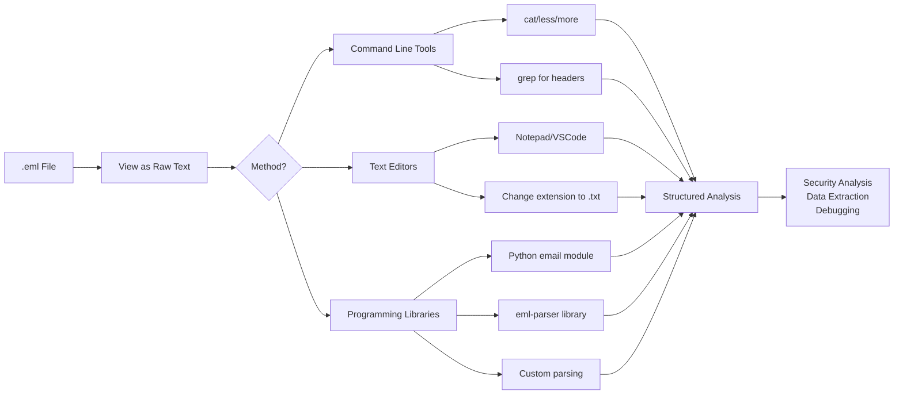

# 📧 Full-Stack Lesson: Reading Raw Email Source (.eml Files) as Plain Text

## 📊 Executive Summary
An `.eml` file is the raw, plain-text representation of an email message, preserving headers, body, and attachments in a single file 【turn0search3】. Learning to read it as raw text—rather than a rendered preview—is essential for security analysis, debugging, and data extraction. This lesson covers the full stack: from understanding the `.eml` format to using command-line tools, text editors, and programming libraries to parse and manipulate raw email data safely and effectively.



## 🏗️ Phase 1: Understanding the `.eml` File Format

### What is an `.eml` File?
An `.eml` file is a plain-text file that stores an email message according to the RFC-822 standard 【turn0search3】. It contains:
- **Headers**: Metadata like From, To, Subject, Date, and routing information
- **Body**: The message content (plain text and/or HTML)
- **Attachments**: Binary files encoded in base64 within the text

> 💡 **Key Insight**: Since `.eml` files are plain text, you can open them in any text editor without special software—though email clients provide a rendered view 【turn0search3】.

### Structure of a Raw Email

From: sender@example.com
To: recipient@example.com
Subject: Test Email
Date: Mon, 20 May 2024 14:30:00 +0000
MIME-Version: 1.0
Content-Type: multipart/mixed; boundary="----=_Part_12345_67890"

------=_Part_12345_67890
Content-Type: text/plain; charset=utf-8
Content-Transfer-Encoding: 7bit

This is the plain text body.

------=_Part_12345_67890
Content-Type: text/html; charset=utf-8
Content-Transfer-Encoding: 7bit

<html><body><h1>This is HTML body</h1></body></html>

------=_Part_12345_67890
Content-Type: application/pdf; name="document.pdf"
Content-Transfer-Encoding: base64
Content-Disposition: attachment; filename="document.pdf"

JVBERi0xLjQKJcOkw7zDtsO8DQogNCAwIG9iago8PAov...
------=_Part_12345_67890--


## 🛠️ Phase 2: Opening `.eml` Files as Raw Text (No Rendering)

### Method 1: Command-Line Tools (Linux/macOS/WSL)
The simplest approach is to use standard Unix tools to view the raw text:

```bash
# View entire file
cat email.eml

# View with pagination
less email.eml

# Search for specific headers
grep -i "subject:" email.eml
grep -i "from:" email.eml

# View first 50 lines (headers often there)
head -n 50 email.eml

# View only headers (up to first blank line)
sed '/^$/q' email.eml
```

### 🔧 Advanced Command-Line Extraction

```bash
# Extract all email addresses from headers
grep -oE '[a-zA-Z0-9._%+-]+@[a-zA-Z0-9.-]+\.[a-zA-Z]{2,}' email.eml

# Extract all IPs from headers (Received: fields)
grep -oE '[0-9]+\.[0-9]+\.[0-9]+\.[0-9]+' email.eml

# Extract subject (handles multi-line subjects)
sed -n '/^Subject: /,/^[A-Z]/p' email.eml | head -n -1

# Decode base64 attachment and save to file
grep -A 1000 'Content-Transfer-Encoding: base64' email.eml | \
  sed 's/^------=_Part_.*//g' | \
  tr -d '\n' | \
  base64 -d > attachment.pdf
```

### Method 2: Text Editors (Cross-Platform)
Since `.eml` files are plain text, any text editor works:

| Editor | Platform | How to Open |
|--------|----------|-------------|
| **Notepad** | Windows | Right-click → Open With → Notepad |
| **VSCode** | Cross-platform | File → Open File, or `code email.eml` |
| **Sublime Text** | Cross-platform | File → Open File |
| **Vim/Neovim** | Linux/macOS | `vim email.eml` |
| **Emacs** | Cross-platform | `emacs email.eml` |

> ⚠️ **Note**: Some email clients (like Outlook) may associate `.eml` files with themselves. You may need to right-click and select "Open With" to choose a text editor.

### Method 3: Browser Trick (Quick View)
You can also open `.eml` files in web browsers, which display the raw text:

1. **Drag and drop** the `.eml` file into a browser window (Chrome, Firefox, Edge)
2. The browser will display the raw text, including headers and encoded attachments
3. This works because `.eml` files are similar to `.mht` (MHTML) format 【turn0search3】

### Method 4: Extension Rename Trick
The simplest method is to change the file extension:

1. Rename `email.eml` to `email.txt`
2. Open with any text editor
3. The content is identical—it's just a plain text file 【turn0search3】

## 🐍 Phase 3: Programmatic Parsing with Python

### Option 1: Python's Built-in `email` Module
The standard library provides everything needed to parse `.eml` files:

```python
import email
from email import policy
from pathlib import Path

# Read the .eml file as binary
with open('email.eml', 'rb') as f:
    msg = email.message_from_binary_file(f, policy=policy.default)

# Basic headers
print(f"From: {msg['from']}")
print(f"To: {msg['to']}")
print(f"Subject: {msg['subject']}")
print(f"Date: {msg['date']}")

# Walk through parts (handles multipart messages)
for part in msg.walk():
    content_type = part.get_content_type()
    content_disposition = str(part.get("Content-Disposition"))
    
    # Skip attachments in this example
    if "attachment" in content_disposition:
        continue
    
    # Plain text body
    if content_type == "text/plain":
        body = part.get_payload(decode=True).decode()
        print("\nPlain Text Body:")
        print(body)
    
    # HTML body
    elif content_type == "text/html":
        html_body = part.get_payload(decode=True).decode()
        print("\nHTML Body (first 200 chars):")
        print(html_body[:200] + "...")
```

### Option 2: Specialized `eml-parser` Library
For more advanced analysis, the `eml-parser` library provides structured data extraction 【turn0search7】:

```python
# Install: pip install eml-parser
import eml_parser

def parse_eml(file_path):
    with open(file_path, 'rb') as f:
        raw_email = f.read()
    
    # Parse the email
    ep = eml_parser.EmlParser()
    parsed = ep.decode_email_bytes(raw_email)
    
    # Structured output
    return {
        'headers': parsed.get('header', {}),
        'body_plain': parsed.get('body', [{}])[0].get('content', ''),
        'body_html': parsed.get('body', [{}])[1].get('content', '') if len(parsed.get('body', [])) > 1 else '',
        'attachments': [att.get('filename', '') for att in parsed.get('attachment', [])],
        'metadata': {
            'date': parsed.get('header', {}).get('date', ''),
            'from': parsed.get('header', {}).get('from', ''),
            'to': parsed.get('header', {}).get('to', []),
        }
    }

# Usage
result = parse_eml('email.eml')
print(result)
```

### 📦 Complete Python Script for Batch Processing

```python
#!/usr/bin/env python3
"""
Batch EML Parser - Extract headers, bodies, and attachments from .eml files
"""

import email
import eml_parser
import json
from pathlib import Path
from typing import Dict, List, Any

class EMLProcessor:
    def __init__(self, use_eml_parser=True):
        self.use_eml_parser = use_eml_parser
        self.ep = eml_parser.EmlParser() if use_eml_parser else None
    
    def parse_with_stdlib(self, file_path: Path) -> Dict[str, Any]:
        """Parse using Python's built-in email module"""
        with open(file_path, 'rb') as f:
            msg = email.message_from_binary_file(f, policy=policy.default)
        
        result = {
            'file': file_path.name,
            'headers': dict(msg.items()),
            'body_plain': '',
            'body_html': '',
            'attachments': []
        }
        
        for part in msg.walk():
            content_disposition = str(part.get("Content-Disposition", ""))
            
            if "attachment" in content_disposition:
                # Save attachment info
                filename = part.get_filename()
                if filename:
                    result['attachments'].append({
                        'filename': filename,
                        'content_type': part.get_content_type(),
                        'size': len(part.get_payload(decode=True))
                    })
            else:
                # Body content
                content_type = part.get_content_type()
                payload = part.get_payload(decode=True)
                if payload:
                    try:
                        decoded = payload.decode(part.get_content_charset() or 'utf-8', errors='replace')
                        if content_type == "text/plain":
                            result['body_plain'] += decoded
                        elif content_type == "text/html":
                            result['body_html'] += decoded
                    except Exception as e:
                        result['body_plain'] += f"[Error decoding: {e}]\n"
        
        return result
    
    def parse_with_eml_parser(self, file_path: Path) -> Dict[str, Any]:
        """Parse using eml-parser library"""
        with open(file_path, 'rb') as f:
            raw_email = f.read()
        
        parsed = self.ep.decode_email_bytes(raw_email)
        
        # Convert to our standard format
        result = {
            'file': file_path.name,
            'headers': parsed.get('header', {}),
            'body_plain': '',
            'body_html': '',
            'attachments': []
        }
        
        # Extract bodies
        for body in parsed.get('body', []):
            if body.get('content_type') == 'text/plain':
                result['body_plain'] = body.get('content', '')
            elif body.get('content_type') == 'text/html':
                result['body_html'] = body.get('content', '')
        
        # Extract attachments
        for att in parsed.get('attachment', []):
            result['attachments'].append({
                'filename': att.get('filename', ''),
                'content_type': att.get('content_type', ''),
                'size': att.get('size', 0)
            })
        
        return result
    
    def process_directory(self, directory: Path) -> List[Dict[str, Any]]:
        """Process all .eml files in a directory"""
        results = []
        
        for eml_file in directory.glob('*.eml'):
            try:
                if self.use_eml_parser:
                    result = self.parse_with_eml_parser(eml_file)
                else:
                    result = self.parse_with_stdlib(eml_file)
                
                results.append(result)
                print(f"Processed: {eml_file.name}")
                
            except Exception as e:
                print(f"Error processing {eml_file.name}: {e}")
                results.append({
                    'file': eml_file.name,
                    'error': str(e)
                })
        
        return results

# Usage example
if __name__ == "__main__":
    processor = EMLProcessor(use_eml_parser=True)
    
    # Process current directory
    results = processor.process_directory(Path('.'))
    
    # Save to JSON
    with open('eml_analysis.json', 'w') as f:
        json.dump(results, f, indent=2, ensure_ascii=False)
    
    print(f"\nProcessed {len(results)} .eml files. Results saved to eml_analysis.json")
```

## 🔍 Phase 4: Security Analysis & Forensic Examination

### Why Read Raw Source Instead of Rendered Preview?
1. **Detect Phishing**: Malicious links may be hidden in HTML or obfuscated in raw source
2. **Analyze Headers**: Routing information (`Received:` fields) reveals the email's true path
3. **Extract Indicators**: IPs, domains, and hashes for threat intelligence
4. **Verify Authenticity**: Check digital signatures and DKIM/SPF/DMARC results
5. **Extract Attachments Safely**: Decode base64 attachments without executing them

### Key Security Analysis Tasks

### 🛡️ Security Analysis Checklist

## Security Analysis of .eml Files

### 1. Header Analysis
- [ ] Check `Received:` fields for true origin (last `Received:` is the sender)
- [ ] Verify `From:` matches actual sender domain
- [ ] Check `Reply-To:` and `Return-Path:` for discrepancies
- [ ] Examine `Message-ID:` for uniqueness and domain
- [ ] Verify `Date:` is reasonable and not future/past
- [ ] Check `DKIM-Signature:` for domain authentication
- [ ] Examine `Authentication-Results:` for SPF/DKIM/DMARC

### 2. Content Analysis
- [ ] Extract all URLs (even if not displayed in rendered view)
- [ ] Check for URL obfuscation (e.g., `http://evil.com@trusted.com`)
- [ ] Analyze HTML for hidden elements (0x0 iframes, invisible text)
- [ ] Look for suspicious attachments (executables, macros, scripts)
- [ ] Check for social engineering tactics (urgency, authority, fear)

### 3. Attachment Safety
- [ ] List all attachments and their types
- [ ] Check for double extensions (`document.pdf.exe`)
- [ ] Verify attachment size and content type consistency
- [ ] Scan attachments with antivirus (in sandboxed environment)
- [ ] Extract and analyze macro code in Office documents

### 4. Indicator Extraction
- [ ] Extract all IP addresses from headers
- [ ] Extract all domains (including subdomains)
- [ ] Calculate file hashes of attachments
- [ ] Extract email addresses (From, To, CC, Reply-To)
- [ ] Look for tracking pixels or web beacons


### Python Script for Security Analysis
```python
import re
import hashlib
from pathlib import Path
from collections import defaultdict

class EMLSecurityAnalyzer:
    def __init__(self, eml_path: Path):
        self.eml_path = eml_path
        self.content = eml_path.read_text(encoding='utf-8', errors='replace')
        self.headers = self._extract_headers()
    
    def _extract_headers(self) -> Dict[str, str]:
        """Extract headers from .eml content"""
        headers = {}
        header_pattern = re.compile(r'^([A-Za-z-]+):\s*(.*?)$', re.MULTILINE)
        
        for match in header_pattern.finditer(self.content):
            header_name = match.group(1).lower()
            header_value = match.group(2).strip()
            headers[header_name] = header_value
        
        return headers
    
    def extract_ips(self) -> List[str]:
        """Extract IP addresses from headers"""
        ip_pattern = re.compile(r'\b(?:\d{1,3}\.){3}\d{1,3}\b')
        ips = set()
        
        # Check specific header fields
        for header in ['received', 'x-originating-ip', 'x-sender-ip']:
            if header in self.headers:
                found_ips = ip_pattern.findall(self.headers[header])
                ips.update(found_ips)
        
        return list(ips)
    
    def extract_urls(self) -> List[str]:
        """Extract URLs from email body"""
        url_pattern = re.compile(
            r'http[s]?://(?:[a-zA-Z]|[0-9]|[$-_@.&+]|[!*\\(\\),]|(?:%[0-9a-fA-F][0-9a-fA-F]))+'
        )
        return list(set(url_pattern.findall(self.content)))
    
    def extract_email_addresses(self) -> List[str]:
        """Extract email addresses from headers"""
        email_pattern = re.compile(r'[a-zA-Z0-9._%+-]+@[a-zA-Z0-9.-]+\.[a-zA-Z]{2,}')
        emails = set()
        
        for header in ['from', 'to', 'cc', 'reply-to', 'return-path']:
            if header in self.headers:
                found_emails = email_pattern.findall(self.headers[header])
                emails.update(found_emails)
        
        return list(emails)
    
    def calculate_attachment_hashes(self) -> Dict[str, str]:
        """Calculate hashes of attachments (if any)"""
        hashes = {}
        attachment_pattern = re.compile(
            r'Content-Type:\s*(.*?);\s*name="(.*?)"\s*Content-Transfer-Encoding:\s*base64\s*Content-Disposition:\s*attachment;\s*filename="(.*?)"\s*([\s\S]*?)------=_Part_',
            re.MULTILINE
        )
        
        for match in attachment_pattern.finditer(self.content):
            content_type = match.group(1)
            name = match.group(2)
            filename = match.group(3)
            base64_data = match.group(4).strip()
            
            try:
                # Decode base64 and calculate hashes
                decoded = base64.b64decode(base64_data)
                md5 = hashlib.md5(decoded).hexdigest()
                sha1 = hashlib.sha1(decoded).hexdigest()
                sha256 = hashlib.sha256(decoded).hexdigest()
                
                hashes[filename] = {
                    'content_type': content_type,
                    'size': len(decoded),
                    'md5': md5,
                    'sha1': sha1,
                    'sha256': sha256
                }
            except Exception as e:
                hashes[filename] = {'error': str(e)}
        
        return hashes
    
    def generate_report(self) -> Dict[str, Any]:
        """Generate comprehensive security analysis report"""
        return {
            'file': str(self.eml_path),
            'headers': self.headers,
            'ips': self.extract_ips(),
            'urls': self.extract_urls(),
            'email_addresses': self.extract_email_addresses(),
            'attachment_hashes': self.calculate_attachment_hashes(),
            'analysis_timestamp': datetime.now().isoformat(),
            'suspicious_indicators': self._check_suspicious_patterns()
        }
    
    def _check_suspicious_patterns(self) -> List[str]:
        """Check for suspicious patterns"""
        suspicious = []
        
        # Check for mismatched From/Reply-To
        if 'from' in self.headers and 'reply-to' in self.headers:
            if self.headers['from'] != self.headers['reply-to']:
                suspicious.append("From/Reply-To mismatch")
        
        # Check for IP addresses in headers
        if self.extract_ips():
            suspicious.append(f"Contains {len(self.extract_ips())} IP addresses")
        
        # Check for URLs
        if self.extract_urls():
            suspicious.append(f"Contains {len(self.extract_urls())} URLs")
        
        # Check for attachments
        if self.calculate_attachment_hashes():
            suspicious.append(f"Contains {len(self.calculate_attachment_hashes())} attachments")
        
        return suspicious

# Usage
analyzer = EMLSecurityAnalyzer(Path('suspicious_email.eml'))
report = analyzer.generate_report()
```

## 🚀 Phase 5: Automation & Integration

### Batch Processing with Python
```python
from pathlib import Path
import json

def batch_analyze_eml(directory: Path, output_file: Path = None) -> List[Dict]:
    """Analyze all .eml files in a directory"""
    results = []
    
    for eml_file in directory.glob('**/*.eml'):
        try:
            analyzer = EMLSecurityAnalyzer(eml_file)
            report = analyzer.generate_report()
            results.append(report)
            print(f"Analyzed: {eml_file.name}")
        except Exception as e:
            print(f"Error analyzing {eml_file.name}: {e}")
            results.append({
                'file': str(eml_file),
                'error': str(e)
            })
    
    # Save results
    if output_file:
        with open(output_file, 'w') as f:
            json.dump(results, f, indent=2, ensure_ascii=False)
    
    return results

# Example usage
results = batch_analyze_eml(
    directory=Path('/path/to/eml/files'),
    output_file=Path('eml_analysis_report.json')
)
```

### Integration with Security Tools
### 🔧 SIEM/SOAR Integration Examples

```python
# Example: Send analysis results to SIEM via API
import requests
import json

def send_to_siem(analysis_results: Dict, siem_url: str, api_key: str) -> bool:
    """Send analysis results to SIEM"""
    headers = {
        'Authorization': f'Bearer {api_key}',
        'Content-Type': 'application/json'
    }
    
    payload = {
        'event_type': 'email_analysis',
        'timestamp': analysis_results['analysis_timestamp'],
        'source_ip': analysis_results.get('ips', []),
        'url': analysis_results.get('urls', []),
        'file_hash': list(analysis_results.get('attachment_hashes', {}).values()),
        'verdict': 'suspicious' if analysis_results['suspicious_indicators'] else 'clean'
    }
    
    try:
        response = requests.post(
            f"{siem_url}/api/events",
            json=payload,
            headers=headers,
            timeout=10
        )
        return response.status_code == 200
    except Exception as e:
        print(f"Error sending to SIEM: {e}")
        return False

# Example: Create incident in ticketing system
def create_incident(analysis_results: Dict, ticketing_api: str) -> str:
    """Create incident from email analysis"""
    incident_data = {
        'title': f"Suspicious Email: {analysis_results['headers'].get('subject', 'No Subject')}",
        'description': f"Email analysis results:\n\n"
                      f"From: {analysis_results['headers'].get('from')}\n"
                      f"To: {analysis_results['headers'].get('to')}\n"
                      f"Suspicious Indicators: {', '.join(analysis_results['suspicious_indicators'])}",
        'severity': 'high' if analysis_results['suspicious_indicators'] else 'low',
        'indicators': {
            'ips': analysis_results['ips'],
            'urls': analysis_results['urls'],
            'hashes': list(analysis_results['attachment_hashes'].keys())
        }
    }
    
    try:
        response = requests.post(
            f"{ticketing_api}/incidents",
            json=incident_data,
            timeout=10
        )
        if response.status_code == 201:
            return response.json()['id']
    except Exception as e:
        print(f"Error creating incident: {e}")
    
    return None
```

## 📝 Phase 6: Best Practices & Security Considerations

### Safe Handling of `.eml` Files
1. **Always open in text editors first**—never execute attachments directly
2. **Use sandboxed environments** for analyzing suspicious emails
3. **Disable automatic rendering** in email clients when analyzing
4. **Keep antivirus software updated** and scan attachments before extraction
5. **Use virtual machines** for high-risk analysis

### Common Pitfalls to Avoid
| Pitfall | Consequence | Prevention |
|---------|-------------|------------|
| **Opening attachments directly** | Malware execution | Always extract to text first |
| **Trusting rendered view** | Hidden malicious content | Always analyze raw source |
| **Ignoring headers** | Missing routing/auth info | Always examine full headers |
| **Not checking encoding** | Misinterpreted content | Verify charset/encoding |
| **Assuming safety** | False negatives | Treat all emails as suspicious |

### Performance Optimization
For large-scale processing:
- **Use streaming parsers** for large `.eml` files
- **Implement caching** for repeated analysis
- **Parallelize processing** for batch operations
- **Index extracted indicators** for quick lookup

## 🎯 Conclusion

Reading `.eml` files as raw text is a fundamental skill for security analysts, developers, and system administrators. This full-stack approach covers:

1. **Understanding the `.eml` format** as plain text 【turn0search3】
2. **Multiple methods for viewing raw source**—command line, text editors, browsers
3. **Programmatic parsing** with Python's built-in `email` module and specialized libraries like `eml-parser` 【turn0search5】【turn0search7】
4. **Security analysis techniques** for extracting indicators and detecting malicious content
5. **Automation and integration** with existing security tools and workflows

The key takeaway: **always examine the raw source** rather than relying on rendered previews, as critical information (hidden URLs, obfuscated content, routing headers) is often invisible in the formatted view. By mastering these techniques, you can effectively analyze email-borne threats, debug email issues, and extract valuable data from `.eml` files in a safe and efficient manner.
