# 📧 Full-Stack Lesson: Parsing `Authentication-Results` for SPF/DKIM/DMARC from Raw Headers

## 📊 Executive Summary
The `Authentication-Results` header is the canonical source for email authentication verdicts, recording the outcome of SPF, DKIM, and DMARC checks performed by receiving mail servers 【turn0search2】【turn0search5】. This lesson provides a full-stack methodology to read and interpret this header directly from raw email sources, extracting the `spf=`, `dkim=`, and `dmarc=` results as **pass**, **fail**, or **none** without relying on summary tools. You will learn the underlying RFC 8601 specification, manual analysis techniques, and programmatic parsing with Python, enabling you to troubleshoot authentication failures and assess email trustworthiness accurately.

```mermaid
flowchart LR
    A[Raw Email Headers] --> B[Locate Authentication-Results]
    B --> C[Extract spf= dkim= dmarc= Fields]
    C --> D[Interpret Result Values]
    D --> E[Assess Authentication Status]
    
    subgraph B [Header Discovery]
        B1[Find by Field Name]
        B2[Identify authserv-id]
        B3[Handle Multiple Instances]
    end
    
    subgraph C [Field Extraction]
        C1[Regex Pattern Matching]
        C2[Split & Parse Key-Value Pairs]
        C3[Handle Provider Quirks]
    end
    
    subgraph D [Result Interpretation]
        D1[Pass: Valid Authentication]
        D2[Fail: Authentication Failure]
        D3[None: No Check/Result]
        D4[Temp/Perm Errors]
    end
    
    subgraph E [Final Assessment]
        E1[DMARC Alignment Check]
        E2[Composite Auth Consideration]
        E3[Security Decision]
    end
```



## 🏗️ Phase 1: Understanding the `Authentication-Results` Header

### What is `Authentication-Results`?
Defined in RFC 8601, `Authentication-Results` is a trace header field added by mail servers to report the results of message authentication checks 【turn0search5】【turn0search7】. It provides a standardized format for SPF, DKIM, and DMARC verdicts, replacing older, inconsistent formats.

**Key Characteristics**:
- **Authoritative Source**: The only place where SPF/DKIM/DMARC verdicts are officially recorded 【turn0search8】
- **Server-Specific**: Each receiving server adds its own instance
- **Trust Boundary**: Only trust headers from your own boundary MTA or final receiving system 【turn0search9】
- **Extensible**: Supports additional authentication methods beyond the core three

### Header Structure per RFC 8601
The header follows this formal syntax:
```
Authentication-Results: authserv-id; 
  method=result (reason.comment)
  ptype.property=value;
```

**Components**:
1. **authserv-id**: The identity of the authentication server (e.g., `mx.google.com`)
2. **method**: Authentication method (`spf`, `dkim`, `dmarc`, `iprev`, `smtp.auth`)
3. **result**: Outcome (`pass`, `fail`, `none`, `temperror`, `permerror`, `softfail`, `neutral`)
4. **ptype.property**: Specific identity checked (e.g., `smtp.mailfrom` for SPF, `header.d` for DKIM)
5. **reason.comment**: Human-readable explanation for the result

### Result Value Semantics
| Result | Meaning | DMARC Impact |
|--------|---------|--------------|
| **pass** | Authentication succeeded | Can contribute to DMARC pass if aligned |
| **fail** | Authentication failed | Will cause DMARC failure if not aligned |
| **none** | No check performed or no result available | Treated as failure for DMARC 【turn0search16】 |
| **softfail** | Soft failure (SPF specific) | Not a pass, often treated as fail |
| **neutral** | No policy applied (SPF specific) | Not a pass, treated as fail |
| **temperror** | Temporary DNS/network failure | Transient issue, may retry |
| **permerror** | Permanent error (bad record, syntax) | Persistent failure |

> ⚠️ **Critical Note**: In DMARC evaluation, `none` is treated as a failure. If both SPF and DKIM return `none`, DMARC will fail regardless of the policy 【turn0search16】.

## 🔍 Phase 2: Manual Analysis from Raw Headers

### Step-by-Step Extraction Process

### 📖 Detailed Extraction Method

1. **Locate the Header**: Search for lines starting with `Authentication-Results:` in the raw email source
2. **Identify the Server**: The `authserv-id` tells you which server performed the check
3. **Extract Method-Result Pairs**: Look for patterns like `spf=pass`, `dkim=fail`, `dmarc=pass`
4. **Parse Property Values**: Identify what was checked (`smtp.mailfrom`, `header.d`, `header.from`)
5. **Handle Multiple Instances**: Different servers may add their own headers
6. **Check for Comments**: Parenthetical comments often provide failure reasons

**Example - Google Authentication-Results**:
```
Authentication-Results: mx.google.com;
   dkim=pass header.i=@valimail.com header.s=google2048 header.b=Z8L6tjHb;
   spf=pass (google.com: domain of [redacted]@valimail.com designates 209.85.220.41 as permitted sender) smtp.mailfrom=[redacted]@valimail.com;
   dmarc=pass (p=REJECT sp=REJECT dis=NONE) header.from=valimail.com
```


### Provider-Specific Quirks
Major email providers format `Authentication-Results` slightly differently 【turn0search2】:

| Provider | SPF Field | DKIM Field | DMARC Field | Notes |
|----------|-----------|------------|-------------|-------|
| **Google** | `smtp.mailfrom=` | `header.i=` | `header.from=` | Includes policy details in parentheses |
| **Microsoft** | `smtp.mailfrom=` | `header.d=` | `header.from=` | May include `compauth=` and `reason=` |
| **Yahoo** | `smtp.mailfrom=` | `header.d=` | `header.from=` | Similar format to Google |
| **Self-Hosted** | Varies | Varies | Varies | Follows RFC 8601 but may have extensions |

### Common Patterns and Their Meanings

### 🔧 Pattern Analysis Examples

**Pattern 1: All Pass**
```
Authentication-Results: mx.example.com;
   spf=pass smtp.mailfrom=example.com;
   dkim=pass header.d=example.com;
   dmarc=pass header.from=example.com
```
**Interpretation**: Legitimate email from example.com with proper authentication.

**Pattern 2: SPF Pass, DKIM Fail**
```
Authentication-Results: mx.example.com;
   spf=pass smtp.mailfrom=marketing.example.com;
   dkim=fail (body hash did not verify) header.d=example.com;
   dmarc=fail header.from=example.com
```
**Interpretation**: SPF aligned but DKIM failed (message modified after signing). DMARC fails due to DKIM failure.

**Pattern 3: None Results**
```
Authentication-Results: mx.example.com;
   spf=none smtp.mailfrom=unknown.com;
   dkim=none;
   dmarc=none header.from=unknown.com
```
**Interpretation**: No authentication records published. DMARC fails as `none` is treated as failure.

**Pattern 4: Temperror**
```
Authentication-Results: mx.example.com;
   spf=temperror smtp.mailfrom=example.com;
   dkim=pass header.d=example.com;
   dmarc=fail header.from=example.com
```
**Interpretation**: SPF check failed due to DNS timeout. DKIM passed, but DMARC may fail if SPF was required for alignment.


## 🐍 Phase 3: Programmatic Parsing with Python

### Python Implementation Using Standard Library

```python
import re
from typing import Dict, List, Tuple, Optional
from dataclasses import dataclass

@dataclass
class AuthResult:
    method: str  # spf, dkim, dmarc
    result: str  # pass, fail, none, etc.
    property_type: Optional[str] = None  # smtp.mailfrom, header.d, etc.
    property_value: Optional[str] = None  # The actual value checked
    reason: Optional[str] = None  # Comment/reason for result

def parse_authentication_results(headers: str) -> List[AuthResult]:
    """
    Parse Authentication-Results headers from raw email headers.
    
    Args:
        headers: Raw email headers as a single string
        
    Returns:
        List of AuthResult objects for each authentication method found
    """
    results = []
    
    # Find all Authentication-Results headers
    auth_headers = re.findall(
        r'Authentication-Results:\s*([^;\n]+(?:;\s*[^;\n]+)*)',
        headers,
        re.IGNORECASE
    )
    
    for auth_header in auth_headers:
        # Extract authserv-id
        authserv_id = auth_header.split(';')[0].strip()
        
        # Extract method-result pairs
        # Pattern: method=result (optional comment) ptype.property=value;
        method_pattern = r'(spf|dkim|dmarc|iprev|smtp\.auth)\s*=\s*(pass|fail|none|softfail|neutral|temperror|permerror)(?:\s*\(([^)]*)\))?(?:\s+([a-z]+\.[a-z]+)\s*=\s*([^;]*))?'
        
        for match in re.finditer(method_pattern, auth_header, re.IGNORECASE):
            method, result, reason, ptype, pvalue = match.groups()
            
            results.append(AuthResult(
                method=method.lower(),
                result=result.lower(),
                property_type=ptype.lower() if ptype else None,
                property_value=pvalue.strip() if pvalue else None,
                reason=reason.strip() if reason else None
            ))
    
    return results

def extract_spf_dkim_dmarc(headers: str) -> Dict[str, str]:
    """
    Extract SPF, DKIM, and DMARC results from Authentication-Results headers.
    
    Args:
        headers: Raw email headers
        
    Returns:
        Dict with 'spf', 'dkim', 'dmarc' keys and result values
    """
    auth_results = parse_authentication_results(headers)
    
    extracted = {
        'spf': 'none',
        'dkim': 'none',
        'dmarc': 'none'
    }
    
    for result in auth_results:
        if result.method in extracted:
            extracted[result.method] = result.result
    
    return extracted

def analyze_authentication(headers: str) -> Dict:
    """
    Comprehensive authentication analysis from raw headers.
    
    Args:
        headers: Raw email headers
        
    Returns:
        Comprehensive analysis including results, alignment, and issues
    """
    # Basic extraction
    results = extract_spf_dkim_dmarc(headers)
    
    # Detailed parsing
    auth_results = parse_authentication_results(headers)
    
    # Check for multiple instances (different servers)
    authserv_ids = set()
    for match in re.finditer(r'Authentication-Results:\s*([^;\n]+)', headers, re.IGNORECASE):
        authserv_ids.add(match.group(1).strip())
    
    # Analyze DMARC alignment
    alignment = check_dmarc_alignment(auth_results)
    
    # Identify issues
    issues = []
    if results['spf'] in ['fail', 'none', 'temperror', 'permerror']:
        issues.append(f"SPF issue: {results['spf']}")
    if results['dkim'] in ['fail', 'none', 'temperror', 'permerror']:
        issues.append(f"DKIM issue: {results['dkim']}")
    if results['dmarc'] in ['fail', 'none']:
        issues.append(f"DMARC issue: {results['dmarc']}")
    
    return {
        'results': results,
        'detailed_results': auth_results,
        'authserv_ids': list(authserv_ids),
        'alignment': alignment,
        'issues': issues,
        'authentication_passed': all(
            result == 'pass' for result in results.values()
        )
    }

def check_dmarc_alignment(auth_results: List[AuthResult]) -> Dict:
    """
    Check DMARC alignment based on authentication results.
    
    Args:
        auth_results: List of AuthResult objects
        
    Returns:
        Alignment status for SPF and DKIM
    """
    alignment = {
        'spf_aligned': False,
        'dkim_aligned': False,
        'dmarc_pass': False
    }
    
    # Extract From domain (simplified - would need to parse From header)
    from_domain = extract_from_domain(headers)
    
    for result in auth_results:
        if result.method == 'spf' and result.result == 'pass':
            # Check if SPF domain aligns with From domain
            if result.property_type == 'smtp.mailfrom':
                spf_domain = result.property_value.split('@')[-1] if '@' in result.property_value else result.property_value
                alignment['spf_aligned'] = domains_align(spf_domain, from_domain)
        
        elif result.method == 'dkim' and result.result == 'pass':
            # Check if DKIM domain aligns with From domain
            if result.property_type == 'header.d':
                dkim_domain = result.property_value
                alignment['dkim_aligned'] = domains_align(dkim_domain, from_domain)
    
    # DMARC passes if either SPF or DKIM is aligned and passes
    alignment['dmarc_pass'] = alignment['spf_aligned'] or alignment['dkim_aligned']
    
    return alignment

def domains_align(domain1: str, domain2: str, strict: bool = False) -> bool:
    """
    Check if two domains align for DMARC.
    
    Args:
        domain1: First domain
        domain2: Second domain
        strict: Use strict alignment (exact match)
        
    Returns:
        True if domains align per DMARC rules
    """
    if strict:
        return domain1.lower() == domain2.lower()
    else:
        # Relaxed alignment: same organizational domain
        org_domain1 = get_organizational_domain(domain1)
        org_domain2 = get_organizational_domain(domain2)
        return org_domain1 == org_domain2

def get_organizational_domain(domain: str) -> str:
    """
    Extract organizational domain from a domain.
    Simplified - would use Public Suffix List in production.
    """
    parts = domain.split('.')
    if len(parts) > 2:
        return '.'.join(parts[-2:])
    return domain

def extract_from_domain(headers: str) -> str:
    """
    Extract domain from From header.
    Simplified implementation.
    """
    from_match = re.search(r'From:\s*[^<]*<([^>]*)', headers, re.IGNORECASE)
    if from_match:
        email = from_match.group(1)
        return email.split('@')[-1] if '@' in email else email
    return "unknown.example.com"

# Example usage
if __name__ == "__main__":
    # Sample headers
    sample_headers = """
Authentication-Results: mx.google.com;
   dkim=pass header.i=@valimail.com header.s=google2048 header.b=Z8L6tjHb;
   spf=pass (google.com: domain of [redacted]@valimail.com designates 209.85.220.41 as permitted sender) smtp.mailfrom=[redacted]@valimail.com;
   dmarc=pass (p=REJECT sp=REJECT dis=NONE) header.from=valimail.com
From: sender@valimail.com
To: recipient@example.com
Subject: Test Email
"""
    
    analysis = analyze_authentication(sample_headers)
    print("Authentication Analysis:")
    print(f"Results: {analysis['results']}")
    print(f"Alignment: {analysis['alignment']}")
    print(f"Issues: {analysis['issues']}")
    print(f"Overall: {'PASS' if analysis['authentication_passed'] else 'FAIL'}")
```

### Advanced: Handling Complex Cases

### ⚙️ Advanced Parsing Scenarios

```python
def parse_microsoft_composite_auth(headers: str) -> Dict:
    """
    Parse Microsoft-specific composite authentication.
    
    Microsoft adds compauth= and reason= fields beyond standard RFC.
    """
    compauth = {
        'result': 'none',
        'reason': None
    }
    
    # Find compauth in Authentication-Results
    compauth_match = re.search(
        r'Authentication-Results:.*compauth=(pass|fail|softpass|none)(?:\s+reason=(\d+))?',
        headers,
        re.IGNORECASE
    )
    
    if compauth_match:
        compauth['result'] = compauth_match.group(1).lower()
        compauth['reason'] = compauth_match.group(2)
    
    return compauth

def parse_arc_chain(headers: str) -> List[Dict]:
    """
    Parse ARC (Authenticated Received Chain) headers.
    
    ARC preserves authentication results across intermediaries.
    """
    arc_results = []
    
    # Find ARC-Seal headers
    arc_seals = re.finditer(
        r'ARC-Seal:\s*i=(\d+);\s*cv=([^;\s]+);?\s*([^;\n]*)',
        headers,
        re.IGNORECASE
    )
    
    for seal in arc_seals:
        instance = seal.group(1)
        chain_validity = seal.group(2)
        additional = seal.group(3)
        
        arc_results.append({
            'instance': int(instance),
            'chain_validity': chain_validity.lower(),
            'additional': additional.strip() if additional else None
        })
    
    return arc_results

def handle_multiple_auth_results(headers: str) -> Dict[str, List[AuthResult]]:
    """
    Handle cases where multiple servers add Authentication-Results.
    
    Different servers may provide conflicting results.
    """
    all_results = parse_authentication_results(headers)
    
    # Group by authserv-id
    grouped = {}
    for result in all_results:
        authserv_id = result.property_value if result.property_type == 'authserv-id' else 'unknown'
        if authserv_id not in grouped:
            grouped[authserv_id] = []
        grouped[authserv_id].append(result)
    
    return grouped

def diagnose_failure(auth_result: AuthResult) -> str:
    """
    Provide human-readable diagnosis for authentication failures.
    """
    if auth_result.result == 'pass':
        return "Authentication passed"
    
    diagnoses = {
        'spf': {
            'fail': "SPF hard fail - sending IP not authorized by domain",
            'softfail': "SPF soft fail - sending IP not authorized but policy allows",
            'neutral': "SPF neutral - no explicit authorization",
            'none': "No SPF record found or no check performed",
            'temperror': "SPF temporary error - DNS lookup failed",
            'permerror': "SPF permanent error - invalid record format"
        },
        'dkim': {
            'fail': "DKIM signature verification failed",
            'none': "No DKIM signature present or usable",
            'temperror': "DKIM temporary error - DNS lookup failed",
            'permerror': "DKIM permanent error - invalid signature format"
        },
        'dmarc': {
            'fail': "DMARC alignment check failed",
            'none': "No DMARC policy found or check not performed",
            'temperror': "DMARC temporary error",
            'permerror': "DMARC permanent error"
        }
    }
    
    method = auth_result.method
    result = auth_result.result
    
    diagnosis = diagnoses.get(method, {}).get(result, "Unknown authentication failure")
    
    if auth_result.reason:
        diagnosis += f" ({auth_result.reason})"
    
    return diagnosis
```


## 🧩 Phase 4: Integration and Practical Application

### Building an Authentication Analysis Tool

### 🛠️ Complete Command-Line Tool

```python
#!/usr/bin/env python3
"""
Email Authentication Analyzer
Analyzes Authentication-Results headers from raw email sources.
"""

import argparse
import sys
import json
from pathlib import Path

def main():
    parser = argparse.ArgumentParser(
        description="Analyze email authentication from raw headers"
    )
    parser.add_argument(
        'input',
        nargs='?',
        type=argparse.FileType('r'),
        default=sys.stdin,
        help='Input file or stdin containing raw email headers'
    )
    parser.add_argument(
        '--format',
        choices=['text', 'json'],
        default='text',
        help='Output format'
    )
    parser.add_argument(
        '--verbose',
        action='store_true',
        help='Show detailed analysis'
    )
    
    args = parser.parse_args()
    
    try:
        headers = args.input.read()
        analysis = analyze_authentication(headers)
        
        if args.format == 'json':
            print(json.dumps(analysis, indent=2))
        else:
            print_authentication_report(analysis, verbose=args.verbose)
            
    except Exception as e:
        print(f"Error: {e}", file=sys.stderr)
        sys.exit(1)

def print_authentication_report(analysis: Dict, verbose: bool = False):
    """Print human-readable authentication report."""
    print("=" * 60)
    print("EMAIL AUTHENTICATION ANALYSIS REPORT")
    print("=" * 60)
    
    # Basic results
    results = analysis['results']
    print("\n📋 BASIC RESULTS:")
    print(f"  SPF:   {results['spf'].upper()}")
    print(f"  DKIM:  {results['dkim'].upper()}")
    print(f"  DMARC: {results['dmarc'].upper()}")
    
    # Overall status
    status = "✅ PASS" if analysis['authentication_passed'] else "❌ FAIL"
    print(f"\n🎯 OVERALL STATUS: {status}")
    
    # Alignment check
    if verbose:
        alignment = analysis['alignment']
        print("\n🔗 DMARC ALIGNMENT:")
        print(f"  SPF Aligned:   {'✅' if alignment['spf_aligned'] else '❌'}")
        print(f"  DKIM Aligned:  {'✅' if alignment['dkim_aligned'] else '❌'}")
        print(f"  DMARC Pass:    {'✅' if alignment['dmarc_pass'] else '❌'}")
    
    # Issues
    issues = analysis['issues']
    if issues:
        print("\n⚠️ ISSUES FOUND:")
        for issue in issues:
            print(f"  • {issue}")
    
    # Detailed results
    if verbose:
        detailed = analysis['detailed_results']
        print("\n📊 DETAILED RESULTS:")
        for result in detailed:
            print(f"  {result.method.upper()}: {result.result}")
            if result.property_type and result.property_value:
                print(f"    → {result.property_type} = {result.property_value}")
            if result.reason:
                print(f"    → Reason: {result.reason}")
    
    print("\n" + "=" * 60)

if __name__ == "__main__":
    main()
```


### Real-World Analysis Examples

### 📧 Case Studies

**Case 1: Legitimate Email with All Pass**
```
Authentication-Results: mx.google.com;
   dkim=pass header.i=@company.com header.s=google2048 header.b=XyZ123;
   spf=pass smtp.mailfrom=user@company.com;
   dmarc=pass header.from=company.com
```
**Analysis**:
- SPF: pass (domain of user@company.com designates sending IP as permitted)
- DKIM: pass (signature verified for @company.com)
- DMARC: pass (aligned with From domain)
- **Verdict**: Legitimate email from company.com

**Case 2: Phishing Email with Failures**
```
Authentication-Results: mx.google.com;
   dkim=fail (body hash did not verify) header.d=phishing.com;
   spf=fail (google.com: domain of bounce@phishing.com does not designate 192.0.2.1 as permitted sender) smtp.mailfrom=bounce@phishing.com;
   dmarc=fail header.from=bank.com
```
**Analysis**:
- SPF: fail (IP not authorized by phishing.com)
- DKIM: fail (signature verification failed)
- DMARC: fail (From domain bank.com doesn't match authentication domains)
- **Verdict**: Likely phishing - authentication failures and domain mismatch

**Case 3: Mailing List Modification**
```
Authentication-Results: mx.google.com;
   dkim=pass header.i=@original-sender.com;
   spf=pass smtp.mailfrom=original-sender.com;
   dmarc=fail header.from=original-sender.com
```
**Analysis**:
- SPF: pass (original sender authorized)
- DKIM: pass (signature from original sender verified)
- DMARC: fail (likely due to mailing list re-sending, breaking alignment)
- **Verdict**: Legitimate email but failed DMARC due to forwarding

**Case 4: Missing Records**
```
Authentication-Results: mx.example.com;
   spf=none smtp.mailfrom=unknown.com;
   dkim=none;
   dmarc=none header.from=unknown.com
```
**Analysis**:
- SPF: none (no record published)
- DKIM: none (no signature)
- DMARC: none (no policy)
- **Verdict**: No authentication - treat with caution


## 🚀 Phase 5: Best Practices and Security Considerations

### Trust Model and Verification
1. **Trust Boundary**: Only trust `Authentication-Results` from your own boundary MTA or the final receiving system 【turn0search9】
2. **Multiple Instances**: Different servers in the chain may add conflicting headers
3. **Header Removal**: Boundary MTAs should remove or ignore upstream `Authentication-Results` fields per RFC 8601 §5 【turn0search9】
4. **Consistency Check**: Verify that `Authentication-Results` aligns with other headers like `Received-SPF` and `DKIM-Signature`

### Common Pitfalls and Solutions

| Pitfall | Symptom | Solution |
|---------|---------|----------|
| **Trusting untrusted headers** | Conflicting results from different servers | Only consider headers from your boundary MTA |
| **Ignoring alignment** | SPF/DKIM pass but DMARC fails | Check domain alignment, not just pass/fail |
| **Misinterpreting 'none'** | Treating 'none' as pass | Remember 'none' is treated as fail for DMARC 【turn0search16】 |
| **Overlooking reason comments** | Missing failure explanations | Parse parenthetical comments for reasons |
| **Provider format differences** | Confusion between Google/Microsoft formats | Learn provider-specific field names |

### Security Implications of Results

### 🔐 Security Decision Matrix

| Scenario | SPF | DKIM | DMARC | Recommended Action |
|----------|-----|------|-------|-------------------|
| **All pass** | pass | pass | pass | ✅ Accept - legitimate email |
| **SPF fail, DKIM pass** | fail | pass | pass | ⚠️ Accept but investigate SPF issue |
| **DKIM fail, SPF pass** | pass | fail | pass | ⚠️ Accept but investigate DKIM issue |
| **Both fail** | fail | fail | fail | ❌ Reject or quarantine |
| **DMARC fail (alignment)** | pass | pass | fail | ⚠️ Accept but fix alignment |
| **None results** | none | none | none | ❌ Reject - no authentication |
| **Temp errors** | temperror | pass | fail | ⚠️ Temporary issue - retry |
| **Compauth fail (Microsoft)** | varies | varies | fail | ⚠️ Microsoft-specific failure |

**Microsoft Composite Authentication**:
Microsoft adds `compauth=` and `reason=` fields beyond standard RFC 【turn0search3】【turn0search15】:
- `compauth=pass`: Microsoft's composite authentication passed
- `compauth=fail`: Failed composite authentication
- `compauth=softpass`: Soft pass with reservations
- `compauth=none`: No composite authentication performed

**Reason Codes**:
- `000`: General failure
- `001`: DMARC policy issue
- `002`: Spoof intelligence trigger
- `003`: Sender reputation issue


### Integration with Email Security Workflows

```python
def integrate_with_security_workflow(headers: str) -> Dict:
    """
    Integrate authentication analysis with security workflows.
    """
    analysis = analyze_authentication(headers)
    
    # Determine action based on results
    action = "deliver"
    confidence = "high"
    
    if not analysis['authentication_passed']:
        action = "quarantine"
        confidence = "medium"
        
        # Specific checks
        if analysis['results']['dmarc'] == 'fail':
            action = "reject"
            confidence = "high"
        elif analysis['results']['spf'] == 'fail':
            action = "quarantine"
            confidence = "medium"
        elif analysis['results']['dkim'] == 'fail':
            action = "quarantine"
            confidence = "medium"
    
    # Add to security logs
    log_entry = {
        'timestamp': datetime.now().isoformat(),
        'authentication_results': analysis['results'],
        'action_taken': action,
        'confidence': confidence,
        'issues': analysis['issues']
    }
    
    return {
        'analysis': analysis,
        'action': action,
        'confidence': confidence,
        'log_entry': log_entry
    }
```

## 📝 Phase 6: Conclusion and Final Checklist

### Key Takeaways
1. **Authoritative Source**: `Authentication-Results` is the canonical source for SPF/DKIM/DMARC verdicts 【turn0search2】【turn0search8】
2. **RFC 8601 Compliance**: Follow the standard format but be aware of provider quirks 【turn0search5】
3. **Trust Model**: Only trust headers from your boundary MTA 【turn0search9】
4. **Alignment Matters**: DMARC requires aligned identifiers, not just pass results 【turn0search9】
5. **Result Semantics**: Understand the difference between `fail`, `none`, and error states 【turn0search16】

### Final Verification Checklist
```markdown
## Email Authentication Verification Checklist

### Header Discovery
- [ ] Locate `Authentication-Results` header in raw source
- [ ] Identify the authserv-id (authentication server)
- [ ] Check for multiple instances from different servers

### Field Extraction
- [ ] Extract `spf=` result and property (smtp.mailfrom)
- [ ] Extract `dkim=` result and property (header.d)
- [ ] Extract `dmarc=` result and property (header.from)
- [ ] Check for reason comments in parentheses

### Result Interpretation
- [ ] Verify `pass`/`fail`/`none` semantics
- [ ] Remember `none` is treated as fail for DMARC
- [ ] Identify temperror/permerror states

### Alignment Verification
- [ ] Check SPF domain alignment with From domain
- [ ] Check DKIM domain alignment with From domain
- [ ] Verify DMARC alignment requirements

### Security Assessment
- [ ] Consider trust boundary of authentication server
- [ ] Evaluate Microsoft composite authentication if present
- [ ] Determine appropriate action based on results
- [ ] Document findings and rationale
```

### Next Steps
1. **Practice with Real Emails**: Analyze emails from different sources to understand format variations
2. **Build Monitoring**: Integrate authentication analysis into your security monitoring pipeline
3. **Stay Updated**: Keep track of RFC updates and provider-specific changes
4. **Document Findings**: Maintain records of authentication patterns and issues

By mastering the direct parsing of `Authentication-Results` headers, you gain the ability to accurately assess email authentication without relying on external tools, enabling more effective email security troubleshooting and incident response.