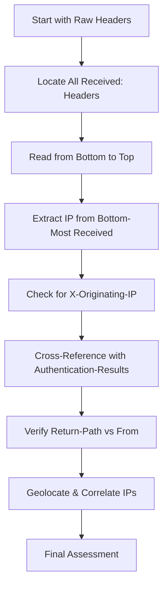
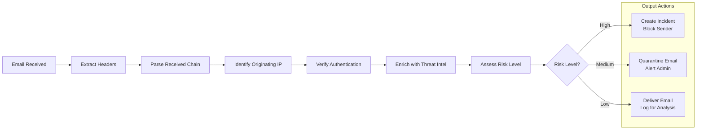

# 🔍 Full-Stack Lesson: Tracing the `Received:` Header Chain to the True Originating IP

## 📊 Executive Summary
Tracing the `Received:` header chain backward is the foundational technique for identifying the true source of an email, distinguishing between legitimate messages and sophisticated phishing or spam attacks. This lesson provides a full-stack approach, covering the theoretical understanding of email routing, the manual analysis process, programmatic parsing with Python, and integration into security workflows. You will learn to systematically extract, interpret, and verify the originating IP address and assess its reliability, even in the face of spoofed headers or anonymizing services.

```mermaid
flowchart LR
    A[Raw Email Headers] --> B[Extract Received Chain]
    B --> C[Parse Bottom-to-Top]
    C --> D[Identify Originating IP]
    D --> E[Verify & Enrich]
    E --> F[Assess Authenticity]
    
    subgraph B [Extraction Layer]
        B1[Manual Copy/Paste]
        B2[Python email module]
        B3[Specialized Parser]
    end
    
    subgraph E [Verification & Enrichment]
        E1[Reverse DNS Lookup]
        E2[Geolocation Check]
        E3[Threat Intel Correlation]
        E4[Authentication Results]
    end
    
    subgraph F [Final Assessment]
        F1[True Positive - Spoofed]
        F2[True Positive - Compromised]
        F3[Benign - Legitimate]
    end
```



## 🏗️ Phase 1: Understanding the `Received:` Header & Email Routing

### The Anatomy of an Email Journey
Every email accumulates a `Received:` header at each mail server (Mail Transfer Agent - MTA) it passes through. These headers form a traceable chain from the recipient back to the sender. According to RFC 5321, each MTA must prepend a `Received:` header when handling a message 【turn0search10】.

**Critical Rule**: `Received:` headers are read **from bottom to top**. The bottom-most (last added) `Received:` line is the closest to the original sender, while the top-most line is the last server before delivery to your inbox 【turn0search0】【turn0search2】.

### Structure of a `Received:` Header
A typical `Received:` header contains:
```
Received: from [sending_server] ([sending_ip]) by [receiving_server] ([receiving_ip]) with [protocol] id [message_id] for [recipient]; [timestamp]
```

**Key Elements**:
- **from**: The server claiming to send the message (can be forged)
- **by**: The server that received the message
- **with**: The protocol used (ESMTP, ESMTPS, etc.)
- **id**: Unique message identifier
- **for**: The intended recipient
- **timestamp**: When the server processed the message

> ⚠️ **Important**: The hostname in the `from` field is easily forged. The IP address in parentheses `[]` is the most reliable identifier of the sending server 【turn0search2】.

### The Complete Header Ecosystem
While `Received:` headers are crucial, they must be interpreted alongside other authentication headers:

| Header | Purpose | Reliability |
|--------|---------|-------------|
| **`Received:`** | Routing chain | Medium (IPs reliable, hostnames forgeable) |
| **`Authentication-Results:`** | SPF/DKIM/DMARC verdicts | High (when present) |
| **`Return-Path:`** | Actual bounce address | Medium (can differ from `From:`) |
| **`X-Originating-IP:`** | Sender's IP (webmail providers) | High (but often stripped) |
| **`DKIM-Signature:`** | Domain signature verification | High (cryptographic proof) |

## 🛠️ Phase 2: Manual Analysis - Reading the Chain Backward

### Step-by-Step Manual Tracing Process



#### Step 1: Extract Raw Headers
- **Gmail**: Click 3 dots → "Show original" 【turn0search1】【turn0search3】
- **Outlook**: File → Properties → Internet Headers 【turn0search3】
- **Apple Mail**: View → Message → Raw Source 【turn0search3】
- **Yahoo Mail**: Three-dot menu → View Raw Message 【turn0search3】

#### Step 2: Locate and List All `Received:` Headers
Copy all `Received:` headers, maintaining their order. They will appear in reverse chronological order (newest at top, oldest at bottom).

#### Step 3: Read Bottom-to-Top
Starting from the **last** `Received:` header (bottom-most), identify:
1. The IP address in the first `from` clause
2. The hostname associated with that IP
3. The timestamp of the hop

#### Step 4: Extract Originating IP
The IP in the bottom-most `Received:` header is the **originating IP**—the server that first introduced the message into the mail stream 【turn0search0】【turn0search4】.

> 💡 **Pro Tip**: Some webmail providers (Gmail, Outlook.com) strip the sender's IP for privacy. In these cases, you may only see their server IPs. Look for `X-Originating-IP:` headers, which some providers include 【turn0search0】【turn0search16】.

#### Step 5: Cross-Verify with Authentication Headers
Check `Authentication-Results:` for SPF, DKIM, and DMARC results 【turn0search0】【turn0search1】:
- **SPF pass**: The sending server is authorized by the domain owner
- **DKIM pass**: The message content hasn't been altered
- **DMARC pass**: The domain's policy is satisfied

A failure in any of these is a red flag for spoofing 【turn0search0】.

#### Step 6: Compare `From:` vs `Return-Path:`
The `From:` address is cosmetic and easily faked. The `Return-Path:` is where bounces are sent and is harder to forge. A mismatch often indicates spoofing 【turn0search0】【turn0search2】.

### Practical Example: Manual Tracing

### 📧 Sample Email Header Analysis

```
Received: from mail.example.com (203.0.113.5) by mx.google.com with ESMTPS id abc123 for <user@example.com>; Tue, 18 Feb 2026 09:14:32 -0500
Received: from smtp-relay.gmail.com (74.125.224.72) by mail.example.com with ESMTP id xyz789; Tue, 18 Feb 2026 09:14:28 -0500
Received: from [192.168.1.100] (c-73-162-45-118.hsd1.ca.comcast.net. [73.162.45.118]) by smtp.gmail.com with ESMTPSA id def456 for <recipient@example.net>; Tue, 18 Feb 2026 09:14:25 -0500
From: "John Smith" <john@company.com>
Return-Path: <bounce@cheap-mailer.xyz>
Authentication-Results: mx.google.com; spf=fail; dkim=fail; dmarc=fail
```

**Analysis**:
1. **Bottom-most Received**: `from [192.168.1.100]` with IP `73.162.45.118`
2. **Originating IP**: `73.162.45.118` (Comcast IP)
3. **Red Flags**:
   - SPF, DKIM, DMARC all fail
   - `From:` domain (`company.com`) ≠ `Return-Path:` domain (`cheap-mailer.xyz`)
   - Originating IP is residential (Comcast), not corporate
4. **Conclusion**: Likely spoofed email


## 🐍 Phase 3: Programmatic Parsing with Python

### Option 1: Python's Built-in `email` Module
The standard library provides comprehensive email parsing capabilities 【turn0search8】.

```python
import email
from email import policy
from email.message import EmailMessage
import re
from typing import List, Dict, Tuple, Optional
from datetime import datetime

class EmailHeaderAnalyzer:
    def __init__(self, raw_email: str):
        self.msg = email.message_from_string(raw_email, policy=policy.default)
        self.received_headers = self._extract_received_headers()
        
    def _extract_received_headers(self) -> List[str]:
        """Extract all Received headers in order they appear"""
        return self.msg.get_all('Received', [])
    
    def extract_ip_from_received(self, received_header: str) -> Optional[str]:
        """Extract IP address from a Received header"""
        # Pattern matches IP addresses in brackets []
        ip_pattern = r'\[([0-9]{1,3}\.[0-9]{1,3}\.[0-9]{1,3}\.[0-9]{1,3})\]'
        match = re.search(ip_pattern, received_header)
        return match.group(1) if match else None
    
    def trace_originating_ip(self) -> Tuple[Optional[str], List[str]]:
        """
        Trace the originating IP by reading Received headers bottom-to-top
        Returns: (originating_ip, chain_of_ips)
        """
        if not self.received_headers:
            return None, []
        
        # Read bottom-to-top (reverse order)
        received_chain = self.received_headers[::-1]
        chain_ips = []
        originating_ip = None
        
        for header in received_chain:
            ip = self.extract_ip_from_received(header)
            if ip:
                chain_ips.append(ip)
                if originating_ip is None:
                    originating_ip = ip
        
        return originating_ip, chain_ips
    
    def check_x_originating_ip(self) -> Optional[str]:
        """Check for X-Originating-IP header"""
        return self.msg.get('X-Originating-IP')
    
    def get_authentication_results(self) -> Dict[str, str]:
        """Parse Authentication-Results header"""
        auth_header = self.msg.get('Authentication-Results', '')
        results = {}
        
        # Simple parsing for common fields
        if 'spf=' in auth_header:
            results['spf'] = 'pass' if 'spf=pass' in auth_header else 'fail'
        if 'dkim=' in auth_header:
            results['dkim'] = 'pass' if 'dkim=pass' in auth_header else 'fail'
        if 'dmarc=' in auth_header:
            results['dmarc'] = 'pass' if 'dmarc=pass' in auth_header else 'fail'
        
        return results
    
    def compare_from_return_path(self) -> bool:
        """Check if From and Return-Path domains match"""
        from_addr = self.msg.get('From', '')
        return_path = self.msg.get('Return-Path', '')
        
        # Simple domain extraction
        from_domain = from_addr.split('@')[-1].strip('>') if '@' in from_addr else ''
        return_domain = return_path.split('@')[-1].strip('>') if '@' in return_path else ''
        
        return from_domain.lower() == return_domain.lower()
    
    def generate_trace_report(self) -> Dict:
        """Generate comprehensive trace report"""
        originating_ip, chain_ips = self.trace_originating_ip()
        x_originating = self.check_x_originating_ip()
        auth_results = self.get_authentication_results()
        from_return_match = self.compare_from_return_path()
        
        return {
            'originating_ip': originating_ip,
            'x_originating_ip': x_originating,
            'ip_chain': chain_ips,
            'authentication': auth_results,
            'from_return_path_match': from_return_match,
            'timestamp': datetime.now().isoformat(),
            'risk_indicators': self._assess_risks(
                originating_ip, auth_results, from_return_match
            )
        }
    
    def _assess_risks(
        self,
        originating_ip: Optional[str],
        auth_results: Dict[str, str],
        from_return_match: bool
    ) -> List[str]:
        """Assess risk indicators based on analysis"""
        risks = []
        
        if not originating_ip:
            risks.append("No originating IP found")
        
        if auth_results.get('spf') == 'fail':
            risks.append("SPF authentication failed")
        if auth_results.get('dkim') == 'fail':
            risks.append("DKIM authentication failed")
        if auth_results.get('dmarc') == 'fail':
            risks.append("DMARC authentication failed")
        
        if not from_return_match:
            risks.append("From/Return-Path domain mismatch")
        
        return risks

# Usage Example
def analyze_email_file(file_path: str) -> Dict:
    """Analyze email from .eml file"""
    with open(file_path, 'r', encoding='utf-8', errors='replace') as f:
        raw_email = f.read()
    
    analyzer = EmailHeaderAnalyzer(raw_email)
    return analyzer.generate_trace_report()
```

### Option 2: Specialized `mail-parser` Library
For production-grade analysis, consider the `mail-parser` library, which is battle-tested in security applications 【turn0search7】.

```python
# pip install mail-parser
from mail_parser import MailParser

def parse_with_mail_parser(file_path: str) -> Dict:
    """Parse email using mail-parser library"""
    parser = MailParser()
    parser.parse_from_file(file_path)
    
    # Extract Received headers
    received_headers = parser.received
    
    # The library provides structured access to various components
    return {
        'received_chain': received_headers,
        'from_ip': parser.from_ip,
        'to_ip': parser.to_ip,
        'authentication': parser.authentication,
        'attachments': parser.attachments,
        'body_plain': parser.body_plain,
        'body_html': parser.body_html
    }
```

### 🔧 Advanced: Batch Processing with Geolocation

```python
import geoip2.database
import geoip2.errors
from pathlib import Path
from typing import List, Dict, Any
import json

class EmailGeotracer:
    def __init__(self, geoip_db_path: str = None):
        self.geoip_db = None
        if geoip_db_path and Path(geoip_db_path).exists():
            try:
                self.geoip_db = geoip2.database.Reader(geoip_db_path)
            except Exception as e:
                print(f"Could not load GeoIP database: {e}")
    
    def geolocate_ip(self, ip: str) -> Dict[str, Any]:
        """Get geolocation data for an IP address"""
        if not self.geoip_db:
            return {'error': 'GeoIP database not available'}
        
        try:
            response = self.geoip_db.city(ip)
            return {
                'ip': ip,
                'country': response.country.name,
                'country_code': response.country.iso_code,
                'city': response.city.name,
                'latitude': response.location.latitude,
                'longitude': response.location.longitude,
                'isp': response.traits.isp,
                'organization': response.traits.organization,
                'is_anonymous_proxy': response.traits.is_anonymous_proxy,
                'is_satellite_provider': response.traits.is_satellite_provider
            }
        except geoip2.errors.AddressNotFoundError:
            return {'error': f'IP {ip} not found in database'}
        except Exception as e:
            return {'error': f'Geolocation failed: {str(e)}'}
    
    def trace_email_origin(
        self,
        email_path: str,
        include_geolocation: bool = True
    ) -> Dict[str, Any]:
        """Comprehensive email origin tracing with optional geolocation"""
        # Parse email
        report = analyze_email_file(email_path)
        
        # Add geolocation data if requested
        if include_geolocation and report['originating_ip']:
            report['geolocation'] = self.geolocate_ip(report['originating_ip'])
        
        # Add geolocation for all IPs in chain
        if include_geolocation and report['ip_chain']:
            report['chain_geolocation'] = [
                self.geolocate_ip(ip) for ip in report['ip_chain']
            ]
        
        return report
    
    def batch_process_directory(
        self,
        directory: str,
        output_file: str = 'email_traces.json',
        include_geolocation: bool = True
    ) -> List[Dict[str, Any]]:
        """Process all .eml files in a directory"""
        results = []
        dir_path = Path(directory)
        
        for eml_file in dir_path.glob('**/*.eml'):
            try:
                trace_result = self.trace_email_origin(
                    str(eml_file),
                    include_geolocation=include_geolocation
                )
                results.append(trace_result)
                print(f"Processed: {eml_file.name}")
            except Exception as e:
                print(f"Error processing {eml_file.name}: {e}")
                results.append({
                    'file': str(eml_file),
                    'error': str(e)
                })
        
        # Save results
        with open(output_file, 'w') as f:
            json.dump(results, f, indent=2, ensure_ascii=False)
        
        return results

# Usage
if __name__ == "__main__":
    # Initialize with GeoIP database (optional)
    tracer = EmailGeotracer('/path/to/GeoLite2-City.mmdb')
    
    # Process single email
    result = tracer.trace_email_origin('suspicious_email.eml')
    
    # Batch process directory
    all_results = tracer.batch_process_directory('/path/to/emails/')
```


## 🔍 Phase 4: Verification, Enrichment, and Security Analysis

### Step 1: Verify Originating IP Authenticity
Not all originating IPs are equal. Perform these checks:

### 🔍 IP Verification Checklist

## IP Verification Steps

### 1. Reverse DNS Lookup
- **Command**: `nslookup <IP>` or `dig -x <IP>`
- **Verify**: The hostname should match the claimed domain
- **Red Flag**: IP resolves to a different domain than expected

### 2. ASN and ISP Check
- Use WHOIS or IP lookup tools
- **Legitimate**: Corporate IP ranges, known mail providers
- **Suspicious**: Residential ISPs, data centers, VPN providers

### 3. Geolocation Consistency
- Check IP location vs. claimed sender location
- **Red Flag**: Email claims to be from US company but IP is in Eastern Europe

### 4. Threat Intelligence Correlation
- Check IP against threat feeds
- Look for reported malicious activity

### 5. Historical Data
- Check if IP has been used in previous spam/phishing campaigns


### Step 2: Correlate with Authentication Results
Cross-reference the originating IP with authentication headers:

| Authentication | What It Verifies | Red Flag If Fails |
|---------------|------------------|-------------------|
| **SPF** | Sending server IP is authorized by domain | IP not in domain's SPF record |
| **DKIM** | Message content hasn't been altered | Signature verification fails |
| **DMARC** | Domain's policy for authentication failures | Domain policy rejects message |

### Step 3: Detect Common Spoofing Techniques

| Technique | How It Appears | Detection Method |
|-----------|---------------|------------------|
| **Header Forging** | Mismatched `From:` and `Return-Path:` | Compare domains |
| **IP Spoofing** | Residential IP claiming to be corporate | ASN/ISP analysis |
| **Compromised Account** | Legitimate IP but malicious content | Behavioral analysis |
| **VPN/Proxy Use** | IP belongs to VPN provider | ASN/ISP reputation |

### Step 4: Limitations and Caveats
- **Webmail Providers**: Gmail, Outlook.com often strip sender IPs 【turn0search0】【turn0search15】
- **Anonymizing Services**: VPNs and proxies hide the true source 【turn0search3】
- **Compromised Systems**: Legitimate IPs may be used maliciously
- **Header Tampering**: Some malware can modify `Received:` headers

## 🚀 Phase 5: Automation and Integration

### Integration with Security Workflows

### 🔧 SOAR/SIEM Integration Example

```python
import requests
import json
from datetime import datetime

class EmailSecurityIntegration:
    def __init__(self, siem_url: str, api_key: str):
        self.siem_url = siem_url
        self.api_key = api_key
        self.headers = {
            'Authorization': f'Bearer {api_key}',
            'Content-Type': 'application/json'
        }
    
    def send_to_siem(self, trace_report: Dict) -> bool:
        """Send trace results to SIEM"""
        payload = {
            'event_type': 'email_trace',
            'timestamp': trace_report['timestamp'],
            'originating_ip': trace_report['originating_ip'],
            'indicators': trace_report['risk_indicators'],
            'authentication': trace_report['authentication'],
            'geolocation': trace_report.get('geolocation', {})
        }
        
        try:
            response = requests.post(
                f"{self.siem_url}/api/events",
                json=payload,
                headers=self.headers,
                timeout=10
            )
            return response.status_code == 200
        except Exception as e:
            print(f"SIEM integration error: {e}")
            return False
    
    def create_incident(
        self,
        trace_report: Dict,
        priority: str = 'medium'
    ) -> Optional[str]:
        """Create incident in ticketing system"""
        incident_data = {
            'title': f"Suspicious Email Origin: {trace_report['originating_ip']}",
            'description': f"Email trace analysis reveals potential spoofing:\n\n"
                          f"Originating IP: {trace_report['originating_ip']}\n"
                          f"Risk Indicators: {', '.join(trace_report['risk_indicators'])}\n"
                          f"Authentication: {json.dumps(trace_report['authentication'])}",
            'priority': priority,
            'indicators': {
                'ip': trace_report['originating_ip'],
                'domain': trace_report.get('from_domain', ''),
                'risk_score': len(trace_report['risk_indicators'])
            }
        }
        
        try:
            response = requests.post(
                f"{self.siem_url}/incidents",
                json=incident_data,
                headers=self.headers,
                timeout=10
            )
            if response.status_code == 201:
                return response.json().get('id')
        except Exception as e:
            print(f"Incident creation error: {e}")
        
        return None
```


### Building an Automated Pipeline



## 📝 Phase 6: Best Practices and Final Assessment

### Best Practices for Reliable Tracing

1. **Always Read Bottom-to-Top**: The oldest `Received:` header is the most reliable 【turn0search0】【turn0search2】
2. **Trust IPs Over Hostnames**: IP addresses in brackets `[]` are harder to forge than hostnames
3. **Cross-Reference Multiple Headers**: Don't rely on a single indicator
4. **Consider Context**: A residential IP isn't necessarily malicious (legitimate remote workers)
5. **Document Chain of Custody**: If investigating for legal purposes, preserve original headers

### Common Pitfalls to Avoid

| Pitfall | Consequence | Prevention |
|---------|-------------|------------|
| **Trusting `From:` field** | Misidentifying sender | Verify with `Return-Path:` and authentication |
| **Ignoring authentication** | Missing spoofing signs | Always check SPF/DKIM/DMARC |
| **Overlooking VPNs** | False attribution | Check ASN/ISP for anonymity services |
| **Assuming single hop** | Missing compromised intermediaries | Analyze entire chain |
| **Neglecting timestamps** | Missing delays or inconsistencies | Compare timestamp sequences |

### Final Assessment Framework

When completing your trace, use this framework to assess the email's authenticity:

```markdown
## Email Authenticity Assessment

### Originating IP Analysis
- [ ] IP address identified: _______________________
- [ ] Reverse DNS matches claimed domain: Yes/No
- [ ] ASN/ISP is consistent with sender: Yes/No
- [ ] Geolocation is plausible: Yes/No
- [ ] IP is on threat intelligence lists: Yes/No

### Authentication Verification
- [ ] SPF result: pass/fail/neutral
- [ ] DKIM result: pass/fail/neutral
- [ ] DMARC result: pass/fail/neutral
- [ ] From/Return-Path domains match: Yes/No

### Risk Assessment
- **High Risk**: Multiple authentication failures, IP mismatch, threat intel matches
- **Medium Risk**: Single authentication failure, unusual but plausible routing
- **Low Risk**: All authentications pass, consistent routing

### Conclusion
Based on analysis, this email is:
- [ ] Legitimate
- [ ] Suspicious - further investigation needed
- [ ] Malicious - likely phishing/spoofing
```

## 🎯 Conclusion

Tracing the `Received:` header chain backward is a critical skill for email security analysis, combining technical understanding with forensic methodology. By following this full-stack approach:

1. **Understand the foundation**: Email headers form an immutable trace from sender to recipient
2. **Master manual analysis**: Read headers bottom-to-top, extract IPs, and cross-verify with authentication
3. **Leverage programmatic tools**: Use Python's `email` module or specialized libraries for efficient, scalable analysis
4. **Verify and enrich**: Always cross-reference with authentication results, reverse DNS, and threat intelligence
5. **Automate and integrate**: Build pipelines that connect email analysis to your security infrastructure

Remember that while IP tracing provides valuable information, it's not infallible—especially with anonymizing services or compromised accounts. Always combine technical findings with contextual analysis for accurate assessments.