# 🔍 Full-Stack Lesson: Navigating a Cold SIEM Workspace to Locate Raw Log Tables

## 📊 Executive Summary
Navigating an unfamiliar SIEM (Security Information and Event Management) workspace "cold" to locate raw log tables is a critical skill for security analysts, threat hunters, and AI system builders. This lesson provides a structured, full-stack approach—from understanding SIEM architecture to creating an executable plan for another AI. You'll learn to systematically discover raw log storage, interpret schemas, and design automation workflows without manual hunting.

```mermaid
flowchart LR
    A[Start: Cold SIEM Navigation] --> B[Phase 1: Understand Architecture]
    B --> C[Phase 2: Locate Raw Log Storage]
    C --> D[Phase 3: Schema & Context Analysis]
    D --> E[Phase 4: Build AI Execution Plan]
    E --> F[Output: Actionable AI Plan]
    
    subgraph B [Phase 1: Architecture Discovery]
        B1[Identify SIEM Platform]
        B2[Understand Data Flow]
        B3[Map Key Components]
    end
    
    subgraph C [Phase 2: Storage Location]
        C1[Primary Data Lake]
        C2[Dedicated Log Databases]
        C3[Archive/Backup Stores]
    end
    
    subgraph D [Phase 3: Schema Analysis]
        D1[Identify Key Fields]
        D2[Understand Data Formats]
        D3[Map to Log Sources]
    end
    
    subgraph E [Phase 4: AI Plan Design]
        E1[Define Objectives]
        E2[Create Step-by-Step Logic]
        E3[Add Error Handling]
    end
```



## 🏗️ Phase 1: Understanding SIEM Architecture Fundamentals

### Core SIEM Components
A typical SIEM system consists of several interconnected layers that determine where raw logs are stored:

| Component | Function | Raw Log Storage Pattern |
|-----------|----------|-------------------------|
| **Data Collectors** | Ingest logs from sources | Temporary staging buffers |
| **Processing Engine** | Normalize, enrich, correlate | Intermediate storage (hot/warm) |
| **Data Lake** | Long-term raw log storage | Primary location for raw tables |
| **Analytics Platform** | Querying, alerting, dashboards | References raw tables via views |
| **Archive Storage** | Compliance, long-term retention | Compressed raw log backups |

> 💡 **Key Insight**: Raw logs in SIEMs typically follow a **lakehouse architecture**—raw data lands in a data lake (often in cloud storage like S3, ADLS, or GCS) and is then referenced by structured tables in the analytics layer.

### Common SIEM Platform Patterns
Different SIEM platforms have distinct approaches to raw log storage:

### 📖 Platform-Specific Storage Details

| SIEM Platform | Primary Raw Log Storage | Typical Table Naming Convention |
|---------------|-------------------------|--------------------------------|
| **Microsoft Sentinel** | Azure Data Explorer (ADX) clusters | `SecurityEvent`, `CommonSecurityLog`, `Syslog` |
| **Splunk** | Index clusters (hot/warm/cold) | `main`, `security`, `wineventlog` |
| **IBM QRadar** | PostgreSQL-based store | `events`, `flows`, `reference_data` |
| **Elastic SIEM** | Elasticsearch indices | `logs-*`, `metrics-*`, `traces-*` |
| **Google Chronicle** | BigQuery datasets | `log_type_*`, `export_*` |

## 🔎 Phase 2: Systematic Raw Log Table Location

### Step 1: Identify SIEM Platform & Version
This is the crucial first step that determines all subsequent navigation.

```bash
# Example platform identification approaches
1. **UI Inspection**: Look for logos, about pages, or help menus
2. **URL Patterns**: 
   - Sentinel: portal.azure.com/#view/sentinel
   - Splunk: splunk.com/en_us/software/splunk-enterprise
   - QRadar: qradar.ibm.com
3. **API Queries**: 
   - Sentinel: GET https://management.azure.com/providers/Microsoft.SecurityInsights/operations
   - Splunk: GET https://<host>:8089/services/server/info
```

### Step 2: Locate Data Lake/Storage Infrastructure
Raw logs typically reside in these primary locations:

| Storage Type | Common Location | Access Methods |
|--------------|-----------------|----------------|
| **Cloud Storage** | S3 buckets, ADLS containers, GCS buckets | CLI tools, SDKs, SIEM connectors |
| **Dedicated Databases** | ADX clusters, Elasticsearch indices, PostgreSQL | SQL/KQL queries, REST APIs |
| **File Systems** | HDFS, NFS shares, local storage | File system commands, mount points |

> ⚠️ **Critical Note**: Always verify you have appropriate permissions before accessing raw log storage. Production SIEM data often contains sensitive information and may require special access approvals.

### Step 3: Discover Raw Log Table Patterns
Use these systematic approaches to identify raw log tables:

```sql
-- Example: Finding tables in Azure Data Explorer (Sentinel)
.show tables
| where Name contains "Security" or Name contains "Log" or Name contains "Event"
| order by Name

-- Example: Elasticsearch index discovery
GET _cat/indices?v&h=index,docs.count,store.size,creation.date.string
```

**Common Raw Log Table Naming Patterns**:
- **Descriptive**: `WindowsSecurityEvent`, `LinuxSyslog`, `FirewallLogs`
- **Source-based**: `O365AuditLogs`, `AWSVpcFlowLogs`, `AzureADSignIns`
- **Time-partitioned**: `logs_20260101`, `events_2024_q1`