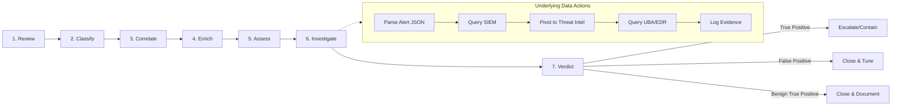

# 🚨 Full-Stack Lesson: End-to-End Alert Triage (The 7-Step Flow)

## 📊 Executive Summary
Alert triage is the core engine of the SOC. Moving an alert from raw noise to a validated verdict requires a disciplined, repeatable methodology. In this lesson, we will execute the **7-Step Triage Flow** (Review → Classify → Correlate → Enrich → Assess → Investigate → Verdict) end-to-end on a sample alert. We will approach this from a full-stack perspective: the analyst's thought process, the backend data queries, and the automated evidence logging required for the final report.



---

## 🎬 The Scenario: Our Sample Alert
Let's set the stage. The SIEM has fired an alert into our queue.

**Raw Alert Payload:**
```json
{
  "alert_id": "ALRT-90210",
  "rule_name": "Multiple Failed Logins followed by Success",
  "severity": "High",
  "source": "Azure AD / Entra ID",
  "entity": "admin@corp.com",
  "source_ip": "198.51.100.45",
  "timestamp": "2024-05-20T14:30:00Z",
  "raw_log_reference": "SignInLogs_DB | Job_ID_8832"
}
```

---

## 🏃‍♂️ Executing the 7-Step Flow

### Step 1: Review (Read the Alert)
**Objective:** Understand what fired, without making assumptions. Parse the raw data.

*   **Analyst Action:** Read the alert payload. Identify the key entities (User: `admin@corp.com`, IP: `198.51.100.45`).
*   **Data/Backend Action:** The SOAR platform or analyst extracts the observables to pass to the next steps.
*   **Evidence Log Entry:**
    > `[14:31:00Z] [OBSERVATION] @analyst - Alert ALRT-90210 received. Brute force rule triggered for admin@corp.com from 198.51.100.45.`

### Step 2: Classify (Initial Hypothesis)
**Objective:** Categorize the alert type to determine your investigation path.

*   **Analyst Action:** What kind of attack is this? It's a **Credential Compromise / Brute Force** attempt. Is it likely False Positive (FP), True Positive (TP), or Benign True Positive (BTP)? *Initial hypothesis: Likely TP or BTP (could be a misconfigured service or an actual attacker).*
*   **Data/Backend Action:** Tag the ticket with MITRE ATT&CK IDs (T1110.001 - Brute Force: Password Guessing).
*   **Evidence Log Entry:**
    > `[14:32:15Z] [RESULT] @analyst - Classified as Credential Compromise. MITRE T1110.001. Initial hypothesis: TP/BTP.`

### Step 3: Correlate (Contextualize in the SIEM)
**Objective:** Validate the alert logic. Did the SIEM see the whole picture? Look for surrounding events.

*   **Analyst Action:** The alert says "failed followed by success." I need to verify this timeline in the raw logs and see if this IP attacked other users.
*   **Data/Backend Action:** Query the SIEM raw log tables (from our previous lesson!).
    ```kql
    SignInLogs
    | where TimeGenerated between (datetime(2024-05-20T14:00:00Z) .. datetime(2024-05-20T14:35:00Z))
    | where IPAddress == "198.51.100.45"
    | summarize Count=count(), SuccessfulLogins=countif(ResultType==0) by UserPrincipalName, bin(TimeGenerated, 5m)
    ```
*   **Evidence Log Entry:**
    > `[14:34:10Z] [ACTION] @analyst - Queried SignInLogs for IP 198.51.100.45.`
  > `[14:34:22Z] [OBSERVATION] @analyst - Confirmed 48 failed logins, followed by 1 successful login for admin@corp.com at 14:30:00Z. No other users targeted by this IP.`

### Step 4: Enrich (Add External Context)
**Objective:** Add threat intel, geolocation, and asset context to the observables.

*   **Analyst Action:** Who owns `198.51.100.45`? Is it a known malicious IP? Is `admin@corp.com` a highly privileged account?
*   **Data/Backend Action:** API calls to Threat Intel (VirusTotal/AbuseIPDB) and Asset Database (CMDB).
    *   *GeoIP Check:* Lagos, Nigeria (Company HQ is in New York).
    *   *AbuseIPDB:* Confidence of abuse: 85%.
    *   *CMDB:* `admin@corp.com` is a Global Administrator in O365.
*   **Evidence Log Entry:**
    > `[14:36:05Z] [ACTION] @analyst - Enriched IP 198.51.100.45 and user admin@corp.com.`
  > `[14:36:12Z] [OBSERVATION] @analyst - IP is located in Lagos, Nigeria. High abuse score (85%). admin@corp.com is a Global Admin. User's usual login location is New York, US.`

### Step 5: Assess (Determine Impact & Severity)
**Objective:** Combine Correlate + Enrich to determine the *actual risk* right now.

*   **Analyst Action:** A Global Admin account was successfully brute-forced from a foreign, high-abuse IP. The severity is **Critical**. The network is likely compromised.
*   **Data/Backend Action:** Upgrade ticket severity from "High" to "Critical". Trigger automated playbooks (e.g., force password reset, revoke O365 tokens).
*   **Evidence Log Entry:**
  > `[14:38:00Z] [RESULT] @analyst - ASSESSMENT: Critical risk. Foreign brute force success on Global Admin account. Active compromise highly probable. Escalating severity.`

### Step 6: Investigate (Scope the Breach)
**Objective:** If compromised, what did the attacker do? Track lateral movement and actions on objectives.

*   **Analyst Action:** I need to check what the attacker did after logging in at 14:30 UTC. Did they change MFA? Did they access SharePoint? Did they add a forwarding rule?
*   **Data/Backend Action:** Pivot to O365 Unified Audit Log.
    ```kql
    OfficeActivity
    | where TimeGenerated > datetime(2024-05-20T14:30:00Z)
    | where UserId == "admin@corp.com"
    | project TimeGenerated, Operation, ClientIP, ObjectId
    ```
*   **Evidence Log Entry:**
  > `[14:42:30Z] [ACTION] @analyst - Queried O365 Audit Logs for admin@corp.com post-14:30Z.`
  > `[14:42:55Z] [OBSERVATION] @analyst - Attacker added an Authenticator app MFA method at 14:31Z and downloaded the "Q3_Financials.xlsx" file at 14:33Z.`

### Step 7: Verdict (Final Decision & Action)
**Objective:** Conclude the triage. Declare the final state and execute containment.

*   **Analyst Action:** This is a **True Positive (TP)**. We have an active breach. I must contain the account, notify the IR team, and close the loop.
*   **Data/Backend Action:** 
    1. Disable `admin@corp.com`.
    2. Revoke all active sessions.
    3. Assign ticket to Incident Response team.
*   **Evidence Log Entry:**
  > `[14:45:00Z] [RESULT] @analyst - VERDICT: True Positive. Active O365 compromise with data exfiltration.`
  > `[14:45:10Z] [ACTION] @analyst - Disabled user account via API. Revoked tokens. Escalated to IR Team (INC-9921).`

---

## 🏗️ The Full-Stack Architecture View

To execute this flow at scale (hundreds of alerts per hour), human clicks must be replaced by full-stack engineering. Here is how the architecture supports the 7 steps:

| Triage Step | Frontend (Analyst View) | Backend (Data/API Layer) | Automation Level |
|-------------|-------------------------|--------------------------|------------------|
| **1. Review** | SOAR Dashboard UI | Alert Webhook ingestion (JSON parsing) | **100% Auto** |
| **2. Classify** | Dropdown / Tag selection | MITRE ATT&CK mapping DB | **80% Auto** (ML classification) |
| **3. Correlate** | SIEM Timeline View | KQL/SPL Queries against Raw Log Tables | **50% Auto** (SOAR plays pre-defined queries) |
| **4. Enrich** | Side-panel widgets | API calls to VirusTotal, GeoIP, CMDB | **100% Auto** (Enrichment playbooks) |
| **5. Assess** | Risk score indicator | Scoring logic (e.g., `If Admin + Foreign IP = Critical`) | **80% Auto** (Rule-based risk scoring) |
| **6. Investigate** | Interactive Log Search | Dynamic EDR/Cloud Audit Queries | **10% Auto** (Requires human intuition for lateral movement) |
| **7. Verdict** | Close/Escalate Buttons | Ticketing API (Jira/ServiceNow) + Containment API | **50% Auto** (Auto-contain on high-confidence TP) |

### 💡 The AI Integration Point
Because we maintained our **Running Evidence Log** per ticket, feeding this triage into an AI for the final report is trivial. Your prompt to the AI simply becomes:

> *"You are an incident reporter. Review the Evidence Log for ticket ALRT-90210 and generate an executive summary, a timeline of events, and a list of compromised indicators (IOCs)."*

Because the log is structured with `[OBSERVATION]`, `[ACTION]`, and `[RESULT]` tags, the AI parses it flawlessly every time.