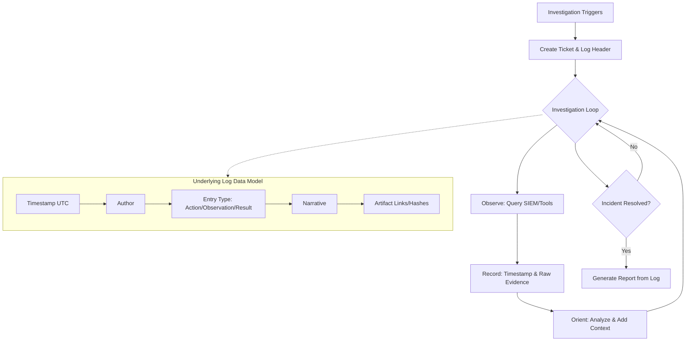

# 📓 Full-Stack Lesson: Setting Up a Running Evidence & Notes Log per Ticket

## 📊 Executive Summary
In security operations, incident response, and IT troubleshooting, the ticket log is the single source of truth. A poorly maintained log leads to duplicate work, lost forensic artifacts, failed handoffs, and weak final reports. A well-structured running log acts as an append-only ledger, capturing the *who, what, when, and why* of an investigation. 

This lesson covers the full stack of evidence logging: from the underlying data model and automation APIs to the analyst's markdown workflow and the final report generation.



## 🏗️ Phase 1: The Data Model & Architecture (The "Stack")

Before writing a single note, you must understand how evidence logs should be structured at the database level. Whether you are using Jira, ServiceNow, TheHive, or a custom Markdown vault, the relational architecture must support **immutability** and **auditability**.

### The Core Entities
| Entity | Purpose | Key Attributes |
|--------|---------|----------------|
| **Ticket/Case** | The overarching container | ID, Severity, Status, Assignees |
| **Log Entry** | The append-only timeline | Timestamp (UTC), Author, Entry Type |
| **Artifact/Evidence** | The raw data supporting the entry | File Hash, S3 URL, Raw Log ID, Screenshot Link |

> 💡 **Key Architecture Rule**: Log entries should be **append-only**. Never delete a previous note. If a conclusion was wrong, add a new entry correcting it (e.g., "Correction to 14:02 UTC entry: Malicious IP is actually a false positive because..."). This preserves the chain of thought for post-mortems.

## 🛠️ Phase 2: The Analyst Workflow (The "Application")

A running log must be low-friction. If logging evidence takes too long, analysts will skip it. Follow the **O-A-R** method for every entry:

1.  **Observation**: What did you see? (Raw evidence)
2.  **Action**: What did you do? (Queries run, systems isolated)
3.  **Result/Reasoning**: What does it mean? (Your analytical conclusion)

### The Markdown Template
Copy this template into the top of every new ticket. It forces structure and guarantees the final report writes itself.

```markdown
# 🎫 Ticket: [TICKET-ID] - [Brief Title]

## 📌 Metadata
- **Priority**: P1 / P2 / P3
- **Assignee**: @yourname
- **Start Time (UTC)**: YYYY-MM-DDTHH:MM:SSZ
- **Impacted Asset(s)**: 

---

## 🕒 Running Evidence Log
*Format: `[UTC TIMESTAMP] [TYPE] Author - Narrative + Evidence Link`*

### YYYY-MM-DD
- `[14:02:33Z] [ACTION] @analyst - Queried SIEM for failed RDP logins to WIN-DC01 in last 24hrs.`
  - **Evidence**: [Link to saved SIEM query / Job ID #12345]
- `[14:05:10Z] [OBSERVATION] @analyst - Found 4,521 failed logins from 192.168.1.50.`
  - **Evidence**: `Raw Log Snippet: EventID=4625, TargetUser=admin, SourceIP=192.168.1.50`
- `[14:08:45Z] [RESULT] @analyst - Assessed 192.168.1.50 as brute-forcing. Correlates with Threat Intel feed.`
  - **Evidence**: [Link to VirusTotal / TI Report]

---

## 🧩 Handoff Summary
*(Fill this out if shifting to another analyst)*
- **Current State**: Brute force identified, need to check if attacker gained access.
- **Next Steps**: Query SIEM for EventID=4624 (Success) from 192.168.1.50.
```

## 🔗 Phase 3: Evidence Handling & "Cold Storage"

Narratives mean nothing without the raw data to back them up. SIEM queries time out, dashboards reset, and memory buffers clear. You must freeze your evidence.

### The 3-Tier Evidence Storage Strategy
1.  **Tier 1: Inline Snippets** (In the ticket log)
    *   *What*: 5-10 lines of a log, a single IP, a hash.
    *   *How*: Code blocks directly in the markdown.
2.  **Tier 2: Object Storage** (S3, Azure Blob, GCS)
    *   *What*: PCAPs, massive CSV exports, memory dumps.
    *   *How*: Upload to a write-once bucket, paste the **S3 URI** into the ticket log. Do not attach 5GB files directly to Jira/ServiceNow.
3.  **Tier 3: SIEM Job IDs / Saved Searches**
    *   *What*: 500,000 row query results that live in the SIEM's cold storage.
    *   *How*: Save the search, grab the Job ID / Search ID, and link it in the log.

> ⚠️ **Chain of Custody**: If this is a forensics case (legal/HR), you MUST hash the evidence before uploading. `sha256sum evidence.pcap` -> Record the hash in the ticket log next to the file link.

## 🤖 Phase 4: Automating the Log (AI & API Integration)

Tying this back to your previous lesson on navigating a cold SIEM: you can instruct an AI agent to populate this evidence log automatically as it executes its playbook.

### API Payload Example
When your AI agent finds a raw table, it should push a note directly to the ticketing system (e.g., Jira API):

```json
POST /rest/api/2/issue/TICKET-123/comment
{
  "body": "[2024-05-20T14:02:00Z] [OBSERVATION] @AI-Agent - Successfully mapped raw log tables in SIEM.\n\n*Evidence:* Found `SecurityEvent` and `CommonSecurityLog`.\n*Schema Link:* [Link to ADX Schema Query Result]",
  "visibility": {
    "type": "role",
    "value": "Administrators"
  }
}
```

### Prompting AI to Maintain the Log
When giving an AI a task, mandate the logging format:
> *"Execute the SIEM mapping task. For every step you take, you must output a log entry using the format: `[UTC TIMESTAMP] [TYPE] - Narrative`. Save all raw outputs to an S3 bucket and include the URI in your log entry."*

## 📝 Phase 5: From Log to Report (The Payoff)

The entire reason we structure the log this way is so the final report takes 10 minutes instead of 2 hours.

### The Translation Matrix
| Running Log Component | Final Report Section |
|-----------------------|----------------------|
| **Metadata (Start time, Assets)** | Executive Summary |
| **OBSERVATION entries** | Indicators of Compromise (IOCs) / Timeline of Events |
| **ACTION entries** | Response Actions Taken |
| **RESULT entries** | Root Cause Analysis / Impact Assessment |
| **Evidence Links** | Appendices / Forensic Artifacts |

Because your log is chronologically sorted and typed, you can filter for `OBSERVATION` entries to instantly build the Timeline of Events, and filter for `ACTION` entries to document what the team did to resolve it.