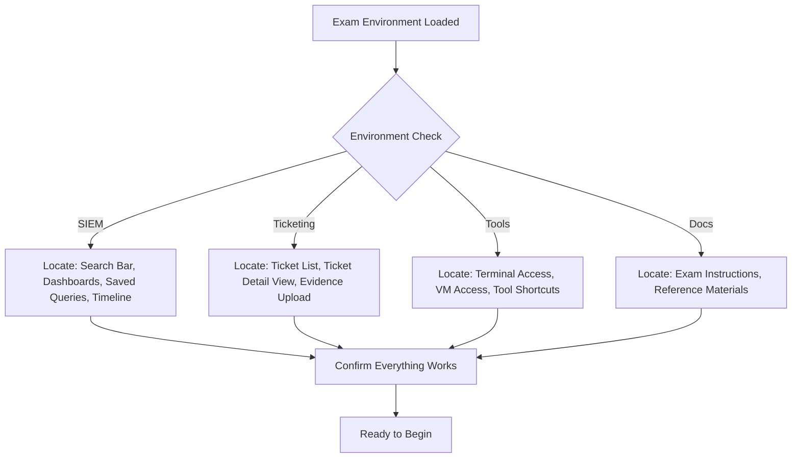
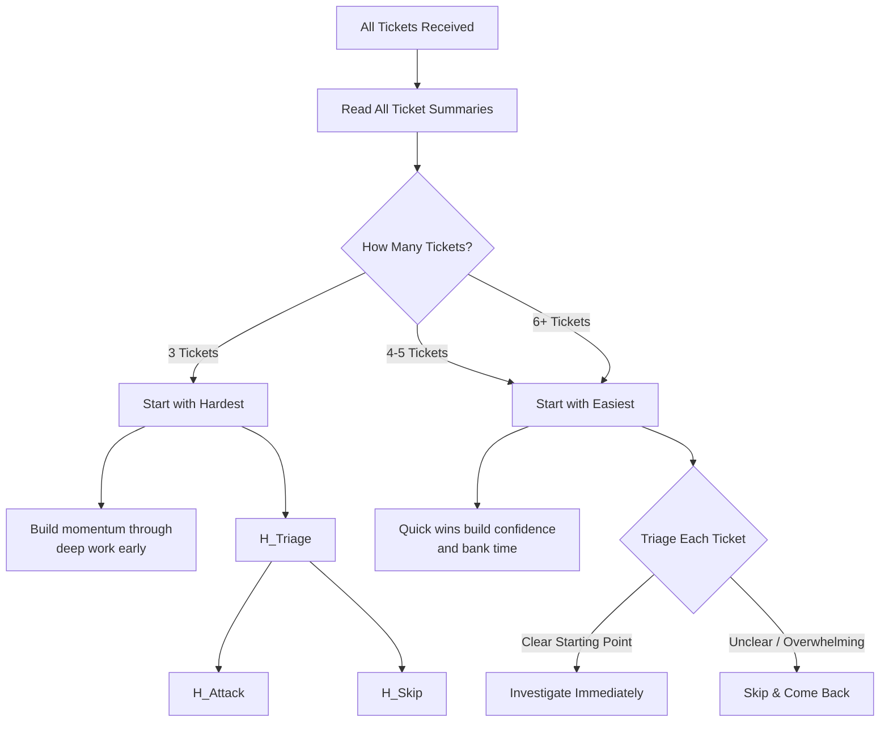
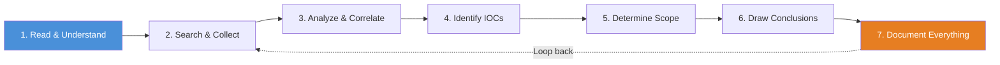
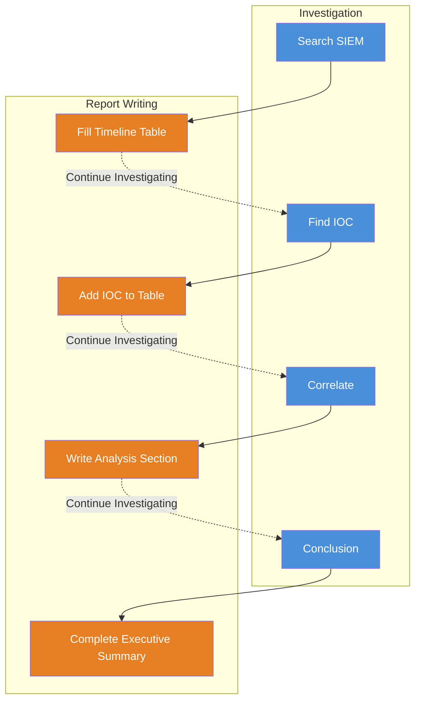
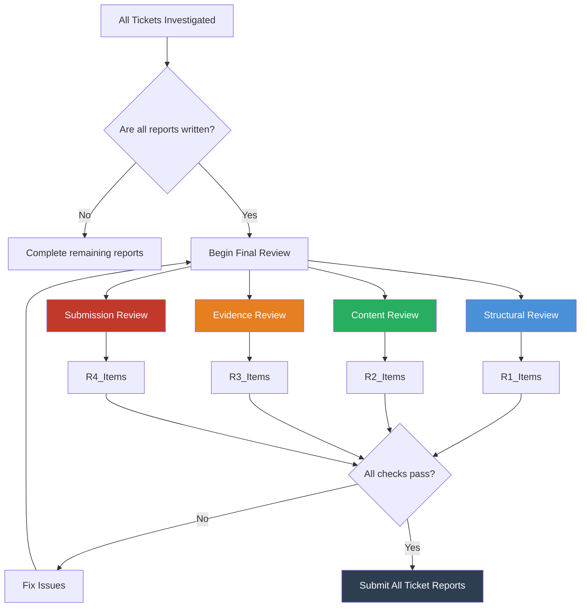

## ⏱️ Full-Stack Lesson: Exam-Day Practical Workflow — Strategy, Time Management & Execution

## 📊 Executive Summary

The PSAA practical exam is a 48-hour endurance test that demands more than technical skill — it requires ruthless time management, disciplined workflow control, and the ability to make rapid triage decisions under pressure. This guide provides a battle-tested framework for navigating the full exam lifecycle: pre-exam preparation, ticket prioritization, structured investigation, report construction, and final submission review. Master these phases, and you convert the 48-hour marathon into a repeatable, manageable process that maximizes your score while minimizing panic.

```mermaid
flowchart LR
    A[Pre-Exam Prep] --> B[Time-Boxing Strategy]
    B --> C[Ticket Order Decision]
    C --> D[Investigation Flow]
    D --> E[Report Construction]
    E --> F[Final Review & Submit]
    
    subgraph A [Phase 1: Preparation]
        A1[Environment Familiarity]
        A2[Template Prep]
        A3[Reference Organization]
    end
    
    subgraph C [Phase 3: Ticket Order]
        C1[Easy-First Approach]
        C2[Hardest-First Approach]
        C3[Triage Decision Matrix]
    end
    
    subgraph E [Phase 5: Report Writing]
        E1[Parallel Investigation & Report]
        E2[Template-Based Generation]
        E3[Final Polish]
    end
    
    subgraph F [Phase 6: Submission]
        F1[Verification Checklist]
        F2[Common Mistake Check]
        F3[Final Upload]
    end
```



---

## 🏗️ Phase 1: Pre-Exam Preparation

### Environment Familiarity

Before the exam clock starts, you must know exactly where everything lives. The exam environment typically includes a SIEM (Elastic/Kibana, Splunk, or similar), a ticketing system, and access to analysis tools. Spend your first 15 minutes orienting:



| Environment Element | What to Verify | Why It Matters |
|---------------------|----------------|----------------|
| **SIEM Layout** | Search bar location, time-range picker, saved searches | Wasted 5 minutes per search = 30+ minutes lost |
| **Dashboard Locations** | Pre-built dashboards, default visualizations | May contain direct answers or starting points |
| **Ticket Interface** | How to view details, attach evidence, change status | Submitting to wrong field = lost points |
| **Terminal/VM Access** | Verify credentials, sudo access, tool availability | Can't run tools = can't investigate |
| **File System** | Where logs, PCAPs, and artifacts live | Need to find data quickly |
| **Exam Instructions** | Scoring rubric, submission format, deadlines | Misreading instructions = automatic deductions |

### Template Preparation

Prepare these templates **before** the exam starts so you never write from scratch:

### 📋 Evidence Log Template

## Evidence Log — Ticket #[TICKET_ID]

### Investigation Summary
**Ticket Title**: [TITLE]
**Severity**: [CRITICAL/HIGH/MEDIUM/LOW]
**Time Spent**: [START] → [END] ([DURATION])

### Key Findings
1. [Finding 1]
2. [Finding 2]
3. [Finding 3]

### Timeline of Events
| Timestamp (UTC) | Event | Source |
|-----------------|-------|--------|
| [TIME] | [EVENT] | [LOG/TOOL] |
| [TIME] | [EVENT] | [LOG/TOOL] |

### Indicators of Compromise (IOCs)
- **IP Addresses**: [IP1], [IP2]
- **Domains**: [DOMAIN1]
- **Hashes**: [HASH1], [HASH2]
- **Files**: [FILE1], [FILE2]

### Affected Assets
- [HOST1] — [ROLE]
- [HOST2] — [ROLE]

### Analysis Details
**Investigation Steps Taken**:
- [ ] Step 1: [Description]
- [ ] Step 2: [Description]
- [ ] Step 3: [Description]

**Tools Used**: [TOOL1], [TOOL2]

### Conclusion
[Verdict and recommended response actions]


### 📋 Report Template

# Incident Investigation Report — [TICKET ID]

## 1. Executive Summary
[1-2 paragraph summary of the incident, findings, and recommended action]

## 2. Investigation Scope
- **Ticket ID**: [ID]
- **Date/Time of Analysis**: [DATE]
- **Analyst**: [NAME]
- **Assets Investigated**: [LIST]

## 3. Methodology
[Brief description of the investigative approach taken]

## 4. Findings

### 4.1 Initial Detection
[How the incident was first identified — alert, ticket, user report]

### 4.2 Timeline Analysis
| UTC Time | Event | Evidence |
|----------|-------|----------|
| [T1] | [Event] | [Source] |
| [T2] | [Event] | [Source] |

### 4.3 Technical Analysis
**Indicators Identified**:

| IOC Type | Value | Context |
|----------|-------|---------|
| IP | [IP] | C2 Communication |
| Domain | [Domain] | Payload Delivery |
| Hash | [Hash] | Malicious Binary |

**Affected Systems**: [List]

### 4.4 Root Cause Analysis
[What allowed this incident to occur]

## 5. Containment & Eradication
[Steps taken or recommended to contain and remove the threat]

## 6. Recommendations
- [REC1]
- [REC2]
- [REC3]

## 7. Evidence References
- [Link to evidence log]
- [Screenshots/key log entries]
- [External threat intel references]


### Reference Material Organization

| Resource | Where to Keep It | Purpose |
|----------|------------------|---------|
| **Cheat Sheets** (Linux, Splunk SPL, KQL, RegEx) | Local desktop + open tab | Quick syntax reference |
| **Threat Intel Bookmarks** | Browser bookmarks bar | IP/domain/hash lookups |
| **Tool Download Links** | Browser bookmark folder | Don't waste time googling tools |
| **Your Own Lab Notes** | Searchable document | Solutions to problems you've solved before |
| **Network Ranges/Context** | Sticky note / reference doc | Know the environment you're investigating |
| **Exam Scoring Rubric** | Printed or always-open tab | Know what earns points |

### Pre-Exam Checklist

> ✅ **Run this checklist before starting the exam clock**

- [ ] **SIEM Access**: Can I log in? Can I run a basic search?
- [ ] **Ticket System**: Can I view tickets? Upload files? Change status?
- [ ] **VM/Terminal**: Can I SSH/RDP into analysis VMs? Is my sudo working?
- [ ] **Tool Availability**: Are `wireshark`, `tcpdump`, `grep`, `jq`, `curl`, `python3` installed?
- [ ] **Evidence Log Template**: Open, saved, ready to paste into
- [ ] **Report Template**: Open, saved, ready to populate
- [ ] **Bookmarks**: Threat intel sites, sandbox services, hash lookup tools
- [ ] **Local Storage**: Confirm you have space for PCAPs/log downloads
- [ ] **Screenshots**: Confirm screenshot tool works (Greenshot, Snipping Tool, etc.)
- [ ] **Timer/Stopwatch**: Ready to track per-ticket time
- [ ] **Notepad**: Physical or digital for scratch notes
- [ ] **Exam Instructions**: Read twice before starting
- [ ] **Backup Power**: Laptop plugged in or fully charged
- [ ] **Internet**: Confirm connectivity (you'll need it for lookups)
- [ ] **Water/Snacks**: Within arm's reach — you won't want to step away mid-investigation

> ⚠️ **Critical**: Verify SIEM time zones before you start. Nothing wastes more time than searching the wrong time window. Most exam SIEMs use UTC — confirm this immediately.

---

## 🏗️ Phase 2: Time-Boxing Strategy

### The 48-Hour Allocation Framework

The 48-hour window is your total available time. You will not use all 48 hours — plan for **30-36 hours of actual work time** with the rest allocated to sleep, meals, and buffer.

```mermaid
gantt
    title Sample 48-Hour Exam Timeline
    dateFormat HH:mm
    axisFormat %H:%M
    
    section Phase 1: Prep
    Environment Setup & Orientation    :prep, 00:00, 1h
    Read All Tickets                   :read, after prep, 1h
    
    section Phase 2: Investigation
    Ticket 1 (Easy)                    :t1, after read, 4h
    Ticket 2 (Medium)                  :t2, after t1, 5h
    Ticket 3 (Hard)                    :t3, after t2, 6h
    Ticket 4 (Medium)                  :t4, after t3, 5h
    Ticket 5 (Easy)                    :t5, after t4, 3h
    
    section Phase 3: Breaks
    Sleep Night 1                      :sleep1, after t2, 6h
    Meal Breaks                        :meals, 24:00, 2h
    Sleep Night 2                      :sleep2, after t5, 6h
    
    section Phase 4: Reporting
    Report Drafting                    :report, after sleep2, 6h
    Review & Submit                    :review, after report, 2h
    
    section Buffer
    Buffer / Overflow                  :buffer, after review, 3h
```

> 💡 **Key Insight**: Block your sleep proactively. If you don't, you'll run 30+ hours straight, make mistakes on the last 5 tickets, and lose more points than that extra hour of work could ever earn.

### Time Allocation Tables

#### For 5 Tickets (Most Common):

| Ticket | Complexity | Time Budget | Investigation | Report Writing | Buffer |
|--------|-----------|-------------|---------------|----------------|--------|
| Ticket 1 | Easy | 4 hours | 2.5 hrs | 1 hr | 0.5 hr |
| Ticket 2 | Medium | 5 hours | 3.5 hrs | 1 hr | 0.5 hr |
| Ticket 3 | Hard | 6 hours | 4 hrs | 1.5 hrs | 0.5 hr |
| Ticket 4 | Medium | 5 hours | 3.5 hrs | 1 hr | 0.5 hr |
| Ticket 5 | Easy | 3 hours | 2 hrs | 0.75 hr | 0.25 hr |
| **Total** | | **23 hours** | **15.5 hrs** | **5.25 hrs** | **2.25 hrs** |

#### For 4 Tickets:

| Ticket | Complexity | Time Budget | Investigation | Report Writing | Buffer |
|--------|-----------|-------------|---------------|----------------|--------|
| Ticket 1 | Easy | 5 hours | 3.5 hrs | 1 hr | 0.5 hr |
| Ticket 2 | Medium | 6 hours | 4 hrs | 1.5 hrs | 0.5 hr |
| Ticket 3 | Hard | 7 hours | 5 hrs | 1.5 hrs | 0.5 hr |
| Ticket 4 | Medium | 6 hours | 4 hrs | 1.5 hrs | 0.5 hr |
| **Total** | | **24 hours** | **16.5 hrs** | **5.5 hrs** | **2 hrs** |

#### For 3 Tickets (If severely constrained):

| Ticket | Complexity | Time Budget | Investigation | Report Writing | Buffer |
|--------|-----------|-------------|---------------|----------------|--------|
| Ticket 1 | Medium | 7 hours | 5 hrs | 1.5 hrs | 0.5 hr |
| Ticket 2 | Hard | 9 hours | 6.5 hrs | 2 hrs | 0.5 hr |
| Ticket 3 | Medium | 7 hours | 5 hrs | 1.5 hrs | 0.5 hr |
| **Total** | | **23 hours** | **16.5 hrs** | **5 hrs** | **1.5 hrs** |

### Buffer Time Strategy

| Buffer Type | How Much | When to Use It |
|-------------|----------|----------------|
| **Per-Ticket Buffer** | 15-30 min per ticket | When a ticket runs over; small slippage |
| **End-of-Day Buffer** | 1-2 hours between major phases | Transition between investigation and report writing |
| **Emergency Buffer** | 2-3 hours in final 12 hours | SIEM slowdown, tool failures, re-doing work |
| **Sleep Buffer** | 30 min on each side of sleep | Wind-down and startup time |

### Timer and Milestone Strategy

- **Set a timer per ticket**: When the timer goes off, stop investigating and start writing what you have
- **Use milestones, not strict deadlines**: "Complete Ticket 1 findings by 10:00" not "10:00 sharp"
- **2-hour checkpoints**: Every 2 hours, ask: "Am I ahead, on track, or behind?"
- **The 80% rule**: When you have 80% confidence in your findings, stop investigating and write the report. The last 20% of investigation rarely changes the verdict and always consumes disproportionate time

> ⚠️ **Hard Rule**: If your timer expires and you don't have a clear verdict, document what you *do* know, flag it as inconclusive with supporting evidence, and move on. A partial answer with evidence is worth 60-70% of points. An unanswered ticket is worth 0%.

---

## 🏗️ Phase 3: Ticket Order Strategy

### Easy-First vs. Hardest-First



| Approach | Pros | Cons | Best For |
|----------|------|------|----------|
| **Easy-First** | Quick wins build confidence; bank time early; warm up investigative muscles; ensures you don't leave easy points on the table | May run out of time on hard ticket; hard ticket panic at the end | 4-5 ticket exams; less experienced exam takers |
| **Hardest-First** | Most points possible from hardest ticket; fresh mind on complex analysis; avoids time-crunch panic on high-value ticket | May burn time early; demoralizing if stuck; easy tickets get rushed | 3 ticket exams; confident, experienced exam takers |

### Triage Decision Matrix

Use this matrix when deciding which ticket to tackle first:

| Criterion | Weight | Easy Ticket (Score 3) | Medium Ticket (Score 2) | Hard Ticket (Score 1) |
|-----------|--------|----------------------|------------------------|----------------------|
| **Clear Starting Point** | 5 | Clear alert/log/indicator | Vague but investigable | "Investigate this host" |
| **Evidence Availability** | 4 | Logs readily available | Need some searching | PCAP analysis required |
| **Your Familiarity** | 3 | Done this before | Somewhat familiar | New technique/tool |
| **Time Required** | 3 | < 3 hours | 3-5 hours | 5+ hours |
| **Point Value** | 5 | Same as others | Same as others | Same as others |
| **Risk of Going Wrong** | 2 | Low | Medium | High |

**Scoring**: Multiply (Weight × Score) for each ticket, sum the total. Start with the **highest-scoring** ticket.

### Practical Decision Tree

> 💡 **The 15-Minute Rule**: If after 15 minutes of reading a ticket you don't have a clear first action, **skip it**. Come back after you've built momentum on tickets you understand.

```mermaid
flowchart TD
    Start[Read All Ticket Summaries] --> Q1{Do I immediately know<br/>the first step for any ticket?}
    Q1 -->|Yes, several| Q2{Are there 4+ tickets?}
    Q1 -->|No, none| Panic[Panic Stop. Take 5 minutes.<br/>Re-read instructions.<br/>Pick the shortest ticket.]
    
    Q2 -->|Yes| Q3{Is one ticket clearly<br/>easier than the rest?}
    Q2 -->|No (3 tickets)| HardFirst
    Q3 -->|Yes| EasyFirst[Start with the easiest<br/>ticket for quick win]
    Q3 -->|No| Q4{Are 2 tickets roughly<br/>equal in difficulty?}
    Q4 -->|Yes| PickFirst[Start with whichever has<br/>more log/data available]
    Q4 -->|No| Q5{Is there a ticket<br/>with a time constraint?}
    Q5 -->|Yes| TimedFirst[Prioritize timed ticket]
    Q5 -->|No| EasyFirst
    
    HardFirst --> HF_Reason[Highest point density<br/>requires freshest brain]
```

---

## 🏗️ Phase 4: The Investigation Flow

### The 7-Step Triage Flow (Exam Edition)



#### Step 1: Read & Understand (15 minutes)
- Read the full ticket description — twice
- Identify: What is the alert? What systems are involved? What is being asked?
- Highlight key terms: IPs, usernames, hostnames, timestamps
- **Do not start searching yet**. Understand first

#### Step 2: Search & Collect (30-60 minutes)
- Search SIEM for the alert's timeframe
- Pull logs from affected systems
- Collect PCAPs, event logs, authentication logs
- Save relevant raw data immediately (don't rely on memory)

#### Step 3: Analyze & Correlate (1-2 hours)
- Correlate across data sources (SIEM + PCAP + endpoint logs)
- Follow the attack chain: initial access → persistence → lateral movement → C2 → data exfiltration
- Verify timestamps across systems (time zone normalization)
- Use your cheat sheets for query syntax

#### Step 4: Identify IOCs (30 minutes)
| IOC Type | Examples | Where to Find |
|----------|----------|---------------|
| **Network IOCs** | C2 IPs, malicious domains, URL paths | PCAP, proxy logs, DNS logs |
| **Host IOCs** | File paths, registry keys, process names | Endpoint logs, Sysmon, EDR |
| **User IOCs** | Compromised accounts, anomalous logins | Authentication logs, VPN logs |
| **Behavioral IOCs** | Unusual time, unusual volume, lateral movement | Correlated across sources |

#### Step 5: Determine Scope (30 minutes)
- Which systems are affected?
- Which users are affected?
- What data was accessed/exfiltrated?
- What is the timeline of compromise?

#### Step 6: Draw Conclusions (30 minutes)
- What is the verdict? (True positive / False positive / Benign)
- What is the attack type? (Phishing, Ransomware, Data exfiltration, etc.)
- What is the root cause?
- What remediation is needed?

#### Step 7: Document Everything (Continuous)
- **This step is NOT last**. You document as you go, in parallel with every other step
- Every search result, every finding, every IOC gets recorded immediately

> ⚠️ **Critical Pitfall**: "I'll remember that and write it later." — No, you won't. In a 48-hour exam with 5 tickets and thousands of log lines, your memory is unreliable. Log everything the moment you find it.

### Common Time-Wasting Pitfalls

| Pitfall | Why It Happens | How to Avoid |
|---------|---------------|--------------|
| **Googling syntax** | You forgot the exact SPL/KQL command | Have cheat sheets open in a pinned tab |
| **Chasing false positives** | Log line looks suspicious but is benign | Set a 15-minute rule per rabbit hole |
| **Over-analysis** | You found the answer but keep verifying | 80% confidence rule — write and move on |
| **Tool hopping** | Switch between 5 tools without depth in any | Pick 2-3 tools and master them early |
| **Reading entire PCAPs** | Fear of missing something | Use filters, follow TCP streams, don't read raw bytes |
| **Unorganized screenshots** | Scattered across desktop with no context | Use a screenshot tool that auto-names with timestamps |
| **Perfectionist reporting** | Rewriting sentences 3 times for better wording | Write first, polish later |

### When to Stop Investigating

Ask yourself these questions:

- [ ] Do I have a clear answer to the ticket's core question?
- [ ] Can I list at least 3 supported IOCs with evidence?
- [ ] Do I understand the attack chain (even if incomplete)?
- [ ] Can I write a recommendation based on what I know?
- [ ] Have I spent more than 80% of my allocated time budget?

If you answered **Yes to 3 or more**, stop investigating and write the report.

---

## 🏗️ Phase 5: Report Construction Under Time Pressure

### Parallel Investigation & Report Building

**Do not wait until the investigation is "done" to start writing**. Build the report section by section as you investigate:



### Building the Report Section by Section

| Investigation Phase | Report Section to Write | How Much Detail |
|---------------------|------------------------|-----------------|
| After reading the ticket | Executive Summary draft (1-2 sentences) | Just the placeholder "Investigating alert X on host Y" |
| After each SIEM search | Timeline table rows | One row per finding with timestamp and source |
| After each IOC found | IOC table rows | Add each IP/domain/hash immediately |
| After correlation | Analysis section | Describe what you found in prose — one paragraph |
| After conclusion | Executive Summary finalize + Recommendation | Write the verdict and recommended actions |
| At the end | Final review and formatting | Read once, fix typos, ensure structure |

### Template-Based Report Generation

Fill this template for every ticket report. It's designed for speed:

## [TICKET ID] — [SHORT TITLE]

**Verdict**: [True Positive / False Positive / Benign]
**Attack Type**: [Phishing / Malware / Unauthorized Access / Data Exfiltration / Other]
**Severity**: [Critical / High / Medium / Low]

### Summary
[3-5 sentences: What happened, what was found, what to do]

### Timeline
| Timestamp (UTC) | Event | Evidence Location |
|-----------------|-------|-------------------|
| [T1] | [Event description] | [Log source + search query] |
| [T2] | [Event description] | [Log source + search query] |

### IOCs
| Type | Value | Context |
|------|-------|---------|
| IP | 10.x.x.x | [Description] |
| Domain | example.com | [Description] |
| Hash | abc123... | [Description] |
| Hostname | SRV-APP-01 | [Description] |

### Affected Assets
- [Hostname/IP] — [Role/Description]

### Analysis
[2-3 paragraphs describing the investigation process, key findings, and how they connect]

### Recommendations
1. [Action item 1]
2. [Action item 2]
3. [Action item 3]


### Efficient Report Writing Tips

- **Write in bullet points first**, convert to prose later if needed
- **Copy-paste evidence** (log snippets, screenshots) before writing analysis
- **Use consistent naming**: Always use the same format for IPs, timestamps, hostnames
- **Don't over-explain**: "The IP 10.0.0.5 connected to C2 server bad.xyz at 14:32 UTC" is enough
- **Write for the grader**: They know the answer. They're checking if YOU know the answer. State findings clearly
- **Screenshots are evidence**: A well-annotated screenshot is worth 100 words of description

> 💡 **Grader Psychology**: Graders read 50+ exams. Make their job easy. Use clear headings, tables, and bold key findings. A well-structured report with obvious markers for each scoring criterion gets the benefit of the doubt. A wall of text gets skimmed — and points get missed.

---

## 🏗️ Phase 6: Final Review & Submission

### The Final Review Process



### What to Check Before Submitting

#### Structure Check
- [ ] Every ticket has a report file attached
- [ ] Report files are named correctly (per exam instructions)
- [ ] Headings are consistent across all reports
- [ ] No placeholder text ("[TICKET ID]" or "TODO") remains
- [ ] Executive summary is present in every report

#### Content Check
- [ ] Every finding has supporting evidence (log line, screenshot, query result)
- [ ] Timelines are referenced with specific timestamps, not ranges
- [ ] Verdict is clearly stated (True Positive / False Positive / Benign)
- [ ] IOCs are properly categorized (IP, Domain, Hash, etc.)
- [ ] Affected assets are listed with hostnames/IPs
- [ ] Recommendations are actionable (not "improve security")

#### Evidence Check
- [ ] Screenshots are readable (not blurry, not too small)
- [ ] Log snippets include timestamps
- [ ] Queries used are documented (so grader can reproduce)
- [ ] Evidence is referenced in the report body (not just dumped at the end)
- [ ] No PII/credentials visible in screenshots (redact if needed)

#### Submission Check
- [ ] Files are in the correct format (PDF, DOCX, etc. — verify instructions)
- [ ] Files are uploaded to the correct submission portal
- [ ] Submission confirmation is received
- [ ] Submission deadline is confirmed (not past 48-hour mark)
- [ ] Take a screenshot of the submission confirmation

### Common Mistakes That Lose Points

| Mistake | Points Lost | Why It Happens | Prevention |
|---------|-------------|----------------|------------|
| **Missing verdict** | 10-20% | Assumed grader knows your conclusion | State verdict explicitly in the first paragraph |
| **No evidence for findings** | 20-30% | "I found it in the logs" without citing which logs | Every finding must cite its source |
| **Wrong time zone** | 10-15% | Local time vs UTC confusion | Confirm SIEM timezone in Phase 1; use UTC everywhere |
| **Generic recommendations** | 5-10% | "Patch all systems" instead of specific actions | "Block IP 10.0.0.5 at firewall" > "improve security" |
| **Missing affected assets** | 10-15% | Forgot to list all compromised hosts | Check each IOC's associated host |
| **Placeholder text left in** | 5-10% | Template not fully filled | Ctrl+F for brackets/bracketed text before submit |
| **File naming wrong** | 5-15% | Exam specified "T1_Report.pdf" and you named "report1.pdf" | Read submission format TWICE |
| **Incomplete timeline** | 15-20% | Found the attack but not when it started/ended | Always establish first and last malicious event |
| **No root cause analysis** | 10-15% | Described the attack but not how it happened | "User clicked phishing link" not "malware found" |

### Final Verification Checklist

> 🚨 **Run this 30 minutes before your final deadline**

- [ ] **All tickets submitted**: Check the ticket system — every ticket shows "Submitted" or equivalent
- [ ] **File attachments present**: Every ticket has the correct files attached
- [ ] **No expired links**: If you referenced external URLs in your report, they still work
- [ ] **Screenshots visible**: Open each screenshot to confirm it rendered correctly
- [ ] **Spell check**: Run your report through a spell checker (browser-based or tool)
- [ ] **Redact credentials**: Double-check screenshots for passwords, keys, or tokens
- [ ] **Backup copies**: Save a local copy of every report you submitted
- [ ] **Submission confirmation**: Screenshot the submission confirmation page
- [ ] **Notify proctor (if required)**: Some exams require a "work complete" notification

### What to Do If You Run Out of Time

| Scenario | Action | Points Salvaged |
|----------|--------|-----------------|
| 1 hour left, 2 tickets unfinished | Write executive summary + IOC list + verdict for each unfinished ticket | 40-50% |
| 30 minutes left, 1 ticket unfinished | Submit what you have with a note: "Analysis incomplete — see evidence log for findings to date" | 30-40% |
| 15 minutes left, report not written for a completed investigation | Paste your evidence log into the template — don't attempt to write prose | 50-60% |
| 5 minutes left, nothing submitted | Submit raw evidence log with the ticket — better than nothing | 20-30% |

> ⚠️ **Last Resort**: A partially completed report with real evidence always scores higher than a perfectly formatted empty report. When time is gone, submit the evidence you have.

---

## 📝 Exam-Day Quick Reference Card

```
┌─────────────────────────────────────────────────────┐
│                EXAM DAY CHEAT SHEET                  │
├─────────────────────────────────────────────────────┤
│                                                      │
│  ⏰ TIME MANAGEMENT                                  │
│  • 15 min: Environment check                         │
│  • 15 min: Read all tickets                          │
│  • XX hrs: Per ticket (set timer!)                   │
│  • 6-8 hrs: Sleep (mandatory)                        │
│  • 2 hrs: Buffer                                     │
│  • 30 min: Final review                              │
│                                                      │
│  🔍 INVESTIGATION FLOW                               │
│  1. Read & Understand (don't search yet!)            │
│  2. Search & Collect (save everything)               │
│  3. Analyze & Correlate (connect the dots)           │
│  4. Identify IOCs (log immediately)                  │
│  5. Determine Scope (who/what is affected)           │
│  6. Draw Conclusions (verdict + root cause)          │
│  7. Document Everything (as you go, not after)       │
│                                                      │
│  🚫 STOP INVESTIGATING WHEN:                         │
│  • You have 80% confidence in your answer            │
│  • Timer has expired                                 │
│  • You've gone down 3 rabbit holes                   │
│  • You can answer the ticket's core question         │
│                                                      │
│  ✅ SUBMIT CHECKLIST                                 │
│  • Verdict stated clearly                            │
│  • Evidence for every finding                        │
│  • IOCs listed with context                          │
│  • Timeline complete                                 │
│  • Affected assets listed                            │
│  • Recommendations specific                          │
│  • No placeholder text                               │
│  • Files named correctly                             │
│  • Submission confirmed                              │
│                                                      │
│  ⚠️ DON'T: Over-analyze, chase rabbit holes,         │
│     write reports from memory, panic                 │
│  ✅ DO: Log everything, use templates, take breaks,  │
│     eat, sleep, trust your training                  │
└─────────────────────────────────────────────────────┘
```

## 🎯 Conclusion

The PSAA practical exam tests your ability to **investigate efficiently under pressure** — not your ability to be perfect. The difference between passing and failing is rarely technical skill. It's almost always time management, workflow discipline, and the courage to stop investigating and start writing.

Internalize this workflow before exam day:
1. **Prepare properly** — environment check, templates ready, references organized
2. **Allocate time ruthlessly** — every ticket gets a budget; stick to it
3. **Tri intelligently** — easy-first for 4+ tickets, hardest-first for 3 tickets
4. **Investigate systematically** — the 7-step flow, document as you go
5. **Write in parallel** — build the report during the investigation, not after
6. **Review meticulously** — use the checklist, catch mistakes before the grader does

You've done the labs. You've studied the frameworks. You know the tools. On exam day, trust all of that — and trust this workflow to keep you organized, on time, and on target.
