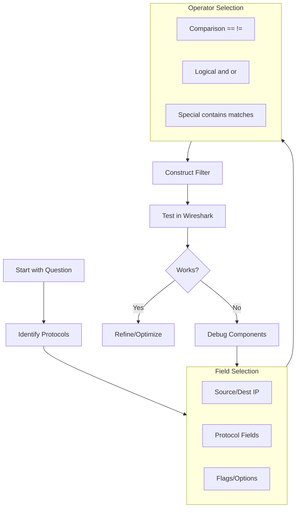

# 🎓 Full-Stack Lesson: Building Wireshark Display Filters from Scratch

## 📊 Executive Summary
Wireshark's display filter language is a powerful tool for isolating specific network traffic from packet captures. This lesson provides a structured approach to building filters from the ground up, focusing on the core primitives `ip.addr`, `http.request`, `dns`, and `tcp.flags`. You'll learn the syntax, operators, and logic needed to construct precise filters for troubleshooting, security analysis, and network investigation.

```mermaid
flowchart LR
    A[Raw Packet Capture] --> B[Apply Display Filter]
    B --> C{Filter Logic}
    
    C --> D[Protocol Existence<br/>dns, http]
    C --> E[Field Comparison<br/>ip.addr == x.x.x.x]
    C --> F[Flag Check<br/>tcp.flags.syn == 1]
    
    D --> G[Combine with Operators]
    E --> G
    F --> G
    
    G --> H[Complex Expression]
    H --> I[Filtered Packet View]
    
    subgraph C [Core Filter Types]
        D
        E
        F
    end
    
    subgraph G [Logical Operators]
        G1[AND / &&]
        G2[OR / ||]
        G3[NOT / !]
    end
```

## 🏗️ Phase 1: Display Filter Fundamentals

### Understanding Display vs. Capture Filters
Before building filters, it's crucial to understand the distinction:
- **Display Filters**: Applied to packets *already captured*; use Wireshark's full protocol dissectors and rich syntax 【turn0search1】
- **Capture Filters**: Applied *during capture*; use BPF syntax (e.g., `tcp port 80`) and are more limited 【turn0search4】

> ⚠️ **Critical Note**: Never confuse the two. `tcp.port == 80` is a display filter, while `tcp port 80` is a capture filter 【turn0search1】.

### Basic Syntax Structure
A display filter consists of:
1. **Protocol/Field**: The network element to examine (e.g., `ip.addr`, `tcp.flags`)
2. **Operator**: Comparison or logical operation (e.g., `==`, `and`, `contains`)
3. **Value**: The data to compare against (e.g., `192.168.1.1`, `0x02`)

### Comparison Operators
Wireshark supports both English and C-style operators 【turn0search0】【turn0search8】:

| English | C-like | Description | Example |
|---------|--------|-------------|---------|
| `eq` | `==` | Equal (any if multiple) | `ip.src == 10.0.0.5` |
| `ne` | `!=` | Not equal (all if multiple) | `ip.src != 10.0.0.5` |
| `gt` | `>` | Greater than | `frame.len > 10` |
| `lt` | `<` | Less than | `frame.len < 128` |
| `ge` | `>=` | Greater than or equal | `frame.len ge 0x100` |
| `le` | `<=` | Less than or equal | `frame.len <= 0x20` |
| `contains` | - | Contains value | `sip.To contains "a1762"` |
| `matches` | `~` | Matches regex (PCRE) | `http.host matches "acme\\.(org|com)"` |

### Logical Operators
Combine multiple conditions 【turn0search9】:

| English | C-like | Description | Example |
|---------|--------|-------------|---------|
| `and` | `&&` | Logical AND | `ip.src==10.0.0.5 and tcp.flags.fin` |
| `or` | `\|\|` | Logical OR | `ip.src==10.0.0.5 or ip.src==192.1.1.1` |
| `xor` | `^^` | Logical XOR | `tr.dst[0:3] == 0.6.29 xor tr.src[0:3] == 0.6.29` |
| `not` | `!` | Logical NOT | `not llc` |

## 🔍 Phase 2: Core Filter Primitives

### 1. `ip.addr` - IP Address Filtering
The `ip.addr` field matches both source and destination IP addresses 【turn0search1】.

**Basic Examples:**
```
ip.addr == 192.168.1.1
ip.src == 10.0.0.5
ip.dst == 172.16.0.0/16
```

**Important Gotcha:** 
`ip.addr == 10.43.54.65` is equivalent to `ip.src == 10.43.54.65 or ip.dst == 10.43.54.65` 【turn0search1】. This can be counterintuitive when trying to exclude traffic.

**Excluding an IP:**
To filter out all traffic to/from a specific IP, use:
```
not ip.addr == 192.168.1.1
```
Or more explicitly:
```
ip.src != 192.168.1.1 and ip.dst != 192.168.1.1
```

**CIDR Notation:**
```
ip.addr == 192.168.1.0/24  # Matches any IP in 192.168.1.0/24 subnet
ip.src == 10.0.0.0/8       # Private Class A network
```

### 2. `http.request` - HTTP Request Filtering
The `http.request` field filters for HTTP request methods (GET, POST, etc.) 【turn0search0】.

**Basic Examples:**
```
http.request              # Any HTTP request
http.request.method == "GET"  # Only GET requests
http.request.method == "POST" # Only POST requests
http.request.uri contains "login"  # Requests with "login" in URI
```

**Combining with Host:**
```
http.host == "example.com" and http.request
```

**Regular Expression Matching:**
```
http.request.uri matches "gl=se$"  # URI ends with "gl=se"
http.host matches "acme\\.(org|com|net)"  # Matches acme.org, acme.com, or acme.net
```

### 3. `dns` - DNS Protocol Filtering
The `dns` protocol filter shows all DNS traffic.

**Basic Examples:**
```
dns                       # All DNS packets
dns.qry.name == "example.com"  # DNS queries for example.com
dns.qry.type == 1         # DNS A record queries (IPv4)
dns.flags.response == 1   # DNS response packets
```

**Common DNS Types:**
| Type | Value | Description |
|------|-------|-------------|
| A | 1 | IPv4 address record |
| NS | 2 | Name server record |
| CNAME | 5 | Canonical name record |
| MX | 15 | Mail exchange record |
| TXT | 16 | Text record |
| AAAA | 28 | IPv6 address record |

**Filtering DNS Responses:**
```
dns.flags.response == 1 and dns.qry.name == "malware.example.com"
```

### 4. `tcp.flags` - TCP Flag Filtering
TCP flags control connection behavior. The `tcp.flags` field is a bitmask representing all flags 【turn0search0】.

**Individual Flags:**
```
tcp.flags.syn == 1        # SYN flag set
tcp.flags.ack == 1        # ACK flag set
tcp.flags.fin == 1        # FIN flag set
tcp.flags.reset == 1      # RST flag set
```

**Common Combinations:**
```
tcp.flags.syn == 1 and tcp.flags.ack == 0  # Initial SYN (connection establishment)
tcp.flags.reset == 1 and tcp.flags.ack == 0  # RST without ACK (connection abort)
tcp.window_size == 0 && tcp.flags.reset != 1  # TCP buffer full 
```

**Bitmask Operations:**
For advanced flag checking, use bitwise operations:
```
tcp.flags & 0x02 != 0     # SYN flag set (0x02 is SYN bitmask)
tcp.flags & 0x10 != 0     # ACK flag set (0x10 is ACK bitmask)
```

**TCP Flags Bitmask Reference:**
| Flag | Bitmask | Binary |
|------|---------|--------|
| FIN | 0x01 | 00000001 |
| SYN | 0x02 | 00000010 |
| RST | 0x04 | 00000100 |
| PSH | 0x08 | 00001000 |
| ACK | 0x10 | 00010000 |
| URG | 0x20 | 00100000 |

## 🧩 Phase 3: Combining Filters into Complex Expressions

### Building Multi-Condition Filters
Real-world analysis often requires combining multiple conditions.

**Example 1: Web Traffic to Specific Server**
```
ip.addr == 192.168.1.100 and http.request and tcp.port == 80
```

**Example 2: DNS Queries for Malicious Domains**
```
dns.qry.name contains "malware" or dns.qry.name contains "phishing"
```

**Example 3: Suspicious TCP Connections**
```
tcp.flags.syn == 1 and tcp.flags.ack == 0 and ip.src != 192.168.1.0/24
```

**Example 4: HTTP POST Requests to Login Pages**
```
http.request.method == "POST" and http.request.uri contains "login"
```

### Operator Precedence
Understanding operator precedence helps avoid logical errors:

1. Parentheses `()` - Highest precedence
2. `not` `!` - Unary operators
3. `and` `&&` - Logical AND
4. `or` `||` - Logical OR

**Example:**
```
ip.addr == 192.168.1.1 or ip.addr == 192.168.1.2 and http.request
```
This evaluates as:
```
ip.addr == 192.168.1.1 or (ip.addr == 192.168.1.2 and http.request)
```
To match HTTP traffic from either IP, use:
```
(ip.addr == 192.168.1.1 or ip.addr == 192.168.1.2) and http.request
```

## 🛠️ Phase 4: Advanced Techniques

### Slice Operator
Extract specific byte sequences from protocols 【turn0search9】.

**Syntax:**
```
protocol[offset:length]
```

**Examples:**
```
eth.src[0:3] == 00:00:83      # First 3 bytes of source MAC
tcp[12:1] & 0xf0 >> 2        # TCP header length calculation
udp[8:3]==81:60:03            # 3-byte sequence at offset 8 
```

**Practical Use: Filtering TCP SYN Packets**
```
tcp[13] & 0x02 != 0           # SYN flag set in TCP header
```

### Membership Operator
Test if a value exists in a set 【turn0search9】.

**Syntax:**
```
field in {value1, value2, value3}
```

**Examples:**
```
tcp.port in {80, 443, 8080}     # Common web ports
http.request.method in {"HEAD", "GET"}  # Safe HTTP methods
ip.addr in {192.168.1.0/24, 10.0.0.0/8}  # Multiple networks
```

**Range in Sets:**
```
tcp.port in {443, 4430..4434}   # Port 443 and range 4430-4434
```

### Functions
Wireshark provides built-in functions for filter expressions 【turn0search9】.

| Function | Description | Example |
|----------|-------------|---------|
| `upper()` | Convert string to uppercase | `upper(http.host) == "EXAMPLE.COM"` |
| `lower()` | Convert string to lowercase | `lower(dns.qry.name) == "example.com"` |
| `len()` | Byte length of field | `len(http.request.uri) > 100` |

**Practical Example: Case-Insensitive Host Matching**
```
lower(http.host) contains "example.com"
```

## 📋 Phase 5: Practical Exercises & Real-World Examples

### Exercise 1: Identify All HTTP Traffic
**Objective:** Show all HTTP traffic on common web ports.

**Solution:**
```
http or tcp.port in {80, 443, 8080, 8443}
```

**Explanation:** Catches both HTTP protocol traffic and any traffic on web ports, including HTTPS (which might not show as `http` due to encryption).

### Exercise 2: Detect Potential SQL Injection
**Objective:** Find HTTP requests with SQL keywords in URI.

**Solution:**
```
http.request.uri matches "(union|select|insert|update|delete|drop)"
```

**Explanation:** Uses regex to match common SQL injection patterns in HTTP URIs.

### Exercise 3: Find Failed DNS Lookups
**Objective:** Show DNS responses indicating failure.

**Solution:**
```
dns.flags.response == 1 and dns.flags.rcode != 0
```

**Explanation:** DNS responses with non-zero response code indicate errors (NXDOMAIN, SERVFAIL, etc.).

### Exercise 4: Track TCP Connection Establishment
**Objective:** Monitor TCP three-way handshake.

**Solution:**
```
tcp.flags.syn == 1 or (tcp.flags.syn == 1 and tcp.flags.ack == 1) or tcp.flags.ack == 1
```

**Better Approach (using tcp.stream):**
```
tcp.stream eq 0  # Tracks all packets in first TCP stream
```

### Exercise 5: Detect Port Scanning
**Objective:** Find SYN packets to multiple ports from same source.

**Solution:**
```
tcp.flags.syn == 1 and tcp.flags.ack == 0 and ip.src == 192.168.1.100
```

**Explanation:** SYN without ACK indicates connection attempt. Combine with threshold analysis in Wireshark's statistics.

## 🚀 Phase 6: Best Practices & Troubleshooting

### Filter Optimization Tips
1. **Start Simple**: Begin with basic protocol filters, then add complexity
2. **Use Parentheses**: Clarify logical precedence
3. **Test Incrementally**: Build filters step-by-step, verifying each addition
4. **Save Frequently Used**: Create filter buttons for common expressions
5. **Use Auto-Complete**: Wireshark suggests field names as you type

### Common Pitfalls & Solutions

| Pitfall | Symptom | Solution |
|---------|---------|----------|
| **Display vs. Capture Confusion** | Using `tcp.port == 80` in capture filter | Remember: Display uses `==`, capture uses `port` |
| **ip.addr Misunderstanding** | Unexpected traffic shown | `ip.addr == X` matches source OR destination |
| **Case Sensitivity** | Missing HTTP hosts | Use `lower()` or `upper()` for case-insensitive matching |
| **Regex Syntax** | Invalid regular expression | Use `matches` operator with PCRE syntax |
| **Field Name Typos** | Filter not working | Check field name in packet details, use autocomplete |

### Performance Considerations
- **Complex Filters**: May slow down display on large captures
- **Slice Operations**: Byte-level operations can be CPU-intensive
- **Regex Matching**: Regular expressions are slower than simple comparisons
- **Alternative Approaches**: Use capture filters when possible for initial filtering

### Debugging Filters
1. **Validate Syntax**: Wireshark shows syntax errors in filter bar
2. **Test Components**: Test each condition separately
3. **Use "Prepare as Filter"**: Right-click packet field to create filter
4. **Check Field Existence**: Some fields only appear in certain protocol contexts

## 📚 Phase 7: Reference & Quick Start Guide

### Essential Filter Cheat Sheet

```markdown
# Wireshark Display Filter Quick Reference

## Basic Protocols
dns                        # DNS traffic
http                       # HTTP traffic
tcp                        # TCP traffic
udp                        # UDP traffic
icmp                       # ICMP traffic

## IP Address Filters
ip.addr == 192.168.1.1     # Traffic to/from IP
ip.src == 192.168.1.1      # Traffic from IP
ip.dst == 192.168.1.1      # Traffic to IP
ip.addr != 192.168.1.1     # Exclude IP

## HTTP Filters
http.request               # All HTTP requests
http.request.method == "GET"  # GET requests
http.request.uri contains "login"  # URI contains "login"
http.host == "example.com" # Specific host

## DNS Filters
dns.qry.name == "example.com"  # Query for domain
dns.qry.type == 1          # A record queries
dns.flags.response == 1    # DNS responses

## TCP Flag Filters
tcp.flags.syn == 1         # SYN flag set
tcp.flags.ack == 1         # ACK flag set
tcp.flags.reset == 1       # RST flag set
tcp.flags.fin == 1         # FIN flag set

## Common Combinations
ip.addr == 192.168.1.1 and http.request  # Web traffic to/from IP
tcp.flags.syn == 1 and tcp.flags.ack == 0  # Initial SYN
dns.qry.name contains "malware"  # Suspicious DNS queries
```

### Building Filters Step-by-Step Workflow



### Additional Resources
1. **Wireshark Display Filter Reference**: Complete field list 【turn0search8】
2. **Wireshark Wiki DisplayFilters**: Community examples 【turn0search1】
3. **Protocol Reference**: Protocol-specific filter examples 【turn0search1】
4. **Cheat Sheets**: Printable quick references 【turn0search12】

## 🎯 Conclusion
Building Wireshark display filters from scratch requires understanding the syntax, operators, and available fields. By mastering the core primitives `ip.addr`, `http.request`, `dns`, and `tcp.flags`, you can construct precise filters for any network analysis task. Remember to:

1. **Start Simple**: Build filters incrementally
2. **Understand Operator Precedence**: Use parentheses to clarify logic
3. **Test Thoroughly**: Verify each component works as expected
4. **Document Your Filters**: Save complex filters for future use
5. **Practice Regularly**: Real-world captures provide the best learning

With these skills, you can efficiently isolate network issues, detect security incidents, and analyze complex traffic patterns with confidence.