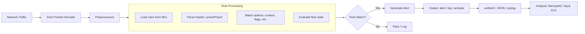

# 🛡️ Full-Stack Lesson: Build and Read Snort Rules

## 📊 Executive Summary

Snort is the industry-standard open-source Intrusion Detection System (IDS) / Intrusion Prevention System (IPS). Its detection engine is driven entirely by **rules**—text-based signatures that describe malicious or suspicious network activity. Each rule has two parts: the **header** (action, protocol, source/destination IPs and ports) and the **options** (payload matching, flow tracking, metadata). This lesson covers the anatomy of Snort rules, how to write detection logic from a description of an attack, how to correlate triggered alerts to specific packets in a PCAP, and practical rule-writing exercises for common attack scenarios.



## 🏗️ Phase 1: Snort Rule Anatomy

### Rule Structure

```
[action] [protocol] [src_ip] [src_port] -> [dst_ip] [dst_port] ([options])
```

**Example:**
```
alert tcp $EXTERNAL_NET any -> $HOME_NET 21 (msg:"FTP brute-force attempt"; flow:to_server,established; content:"USER"; nocase; threshold:type both, track by_src, count 5, seconds 30; sid:1000001; rev:1;)
```

### Rule Header Breakdown

| Field | Values | Meaning |
|-------|--------|---------|
| **Action** | `alert`, `log`, `pass`, `activate`, `dynamic`, `drop` (inline), `reject` (inline) | What to do on match |
| **Protocol** | `tcp`, `udp`, `icmp`, `ip` | Layer-4 protocol |
| **Src IP** | IP address, CIDR, variable (`$HOME_NET`) | Source address to match |
| **Src Port** | Port number, range, variable (`$HTTP_PORTS`) | Source port to match |
| **Direction** | `->`, `<>` (bidirectional) | Traffic direction |
| **Dst IP** | IP address, CIDR, variable | Destination address |
| **Dst Port** | Port number, range, variable | Destination port |

> 💡 **Rule Variables**: Variables like `$HOME_NET`, `$EXTERNAL_NET`, `$HTTP_PORTS` are defined in `snort.conf`. Always use variables for reusable rule sets.

### Rule Options Reference

Options are the heart of Snort's detection capability. They are enclosed in parentheses and separated by semicolons.

| Category | Option | Purpose | Example |
|----------|--------|---------|---------|
| **Metadata** | `msg:` | Alert message | `msg:"ET MALWARE Known Bad Payload"` |
| | `sid:` | Unique rule ID (< 1M = built-in, >= 1M = custom) | `sid:1000001` |
| | `rev:` | Rule revision number | `rev:2` |
| | `classtype:` | Attack classification | `classtype:trojan-activity` |
| | `priority:` | Priority level (1=high, 4=low) | `priority:1` |
| **Payload** | `content:"text"` | Match literal string in payload | `content:"GET /admin"` |
| | `content:\|hex\|` | Match hex bytes in payload | `content:"\|90 90 90\|"` |
| | `nocase` | Case-insensitive content match | `nocase;` |
| | `within:` | Match within N bytes of previous content | `within:10;` |
| | `distance:` | Skip N bytes from previous match | `distance:5;` |
| | `depth:` | Search first N bytes of payload | `depth:100;` |
| | `offset:` | Start search at byte offset | `offset:12;` |
| | `pcre:"/regex/"` | Perl-compatible regex match | `pcre:"/(cmd|exec)\s*\:/i"` |
| | `byte_test:` | Test numeric value at byte offset | `byte_test:4,>,1000,20,relative;` |
| **Flow** | `flow:` | Match on flow direction/state | `flow:to_server,established` |
| | `flowbits:` | Track state across packets | `flowbits:set,attack_detected` |
| **IP/TCP** | `sameip` | Source = destination IP | `sameip;` |
| | `flags:` | Match TCP flags | `flags:S,12;` |
| | `ack:` | Match TCP ACK value | `ack:0;` |
| | `seq:` | Match TCP sequence number | `seq:12345;` |
| | `ttl:` | Match IP TTL value | `ttl:<64;` |
| | `tos:` | Match IP type of service | `tos:8;` |
| | `id:` | Match IP ID field | `id:12345;` |
| | `itype:` | Match ICMP type | `itype:8;` |
| | `icode:` | Match ICMP code | `icode:0;` |
| **Detection** | `threshold:` | Rate-limit alerts | `threshold:type limit,track by_src,count 1,seconds 60` |
| | `tag:` | Tag subsequent packets to the alert | `tag:session,300,packets;` |
| **Response** | `resp:` | Active response (inline mode) | `resp:rst_all;` |
| | `react:` | Block HTTP requests | `react:block,msg;` |

### Predefined Rule Variables (in snort.conf)

```bash
# IP address variables
ipvar HOME_NET 10.0.0.0/24
ipvar EXTERNAL_NET !$HOME_NET

# Port variables
portvar HTTP_PORTS [80,8080,443,8443]
portvar SSH_PORTS 22
portvar DNS_PORTS 53

# Service-specific IP lists
ipvar DNS_SERVERS 10.0.0.1
ipvar SMTP_SERVERS 10.0.0.10
```

## 🔍 Phase 2: Writing Rules from Attack Descriptions

### Exercise 1: Detecting a Simple Port Scan

**Description**: A single external IP sends SYN packets (without ACK) to multiple destination ports on your internal network within a 5-second window.

**Rule:**
```
alert tcp $EXTERNAL_NET any -> $HOME_NET any (msg:"Port scan detected"; \
  flags:S,12; \
  threshold:type both, track by_src, count 20, seconds 5; \
  sid:1000002; rev:1; classtype:attempted-recon; priority:2;)
```

| Option | What it does |
|--------|-------------|
| `flags:S,12;` | Match only SYN packets (check bits 0-1, only SYN = 1) |
| `threshold:type both, track by_src, count 20, seconds 5;` | Alert only when 20+ SYN packets arrive from same source in 5 seconds |

### Exercise 2: Detecting SQL Injection in HTTP

**Description**: A web request contains common SQL injection patterns like `' OR 1=1--`, `UNION SELECT`, or `WAITFOR DELAY` in the URI or POST body.

**Rule:**
```
alert tcp $EXTERNAL_NET any -> $HTTP_SERVERS $HTTP_PORTS (msg:"SQL Injection - UNION SELECT"; \
  flow:to_server,established; \
  content:"UNION"; nocase; \
  content:"SELECT"; nocase; distance:1; within:15; \
  sid:1000003; rev:1; classtype:web-application-attack; priority:1;)
```

**More comprehensive version using PCRE:**
```
alert tcp $EXTERNAL_NET any -> $HTTP_SERVERS $HTTP_PORTS (msg:"SQL Injection - SQL keywords"; \
  flow:to_server,established; \
  pcre:"/(\%27|%22|'|\")\s*(OR|AND)\s+\d+\s*=\s*\d+/i"; \
  sid:1000004; rev:1; classtype:web-application-attack; priority:1;)
```

### Exercise 3: Detecting C2 Beaconing over HTTP

**Description**: A host on your internal network makes periodic HTTP GET requests to a known C2 endpoint. The URI path is a random-looking 8-character string.

**Rule:**
```
alert tcp $HOME_NET any -> $EXTERNAL_NET $HTTP_PORTS (msg:"Suspicious HTTP GET to C2 pattern"; \
  flow:to_server,established; \
  content:"GET /"; http_method; \
  pcre:"/GET\s+\/[a-z0-9]{8}\s+HTTP/i"; \
  classtype:trojan-activity; priority:1; \
  sid:1000005; rev:1;)
```

> ⚠️ **False Positive Warning**: This rule could match legitimate CDN or API calls. Tune with `content:` matching on specific User-Agent strings or known-bad IPs via `$EXTERNAL_NET`.

### Exercise 4: Detecting DNS Tunneling

**Description**: A DNS query with a name longer than 60 characters and more than 5 subdomain labels.

**Rule:**
```
alert udp $HOME_NET any -> $DNS_SERVERS 53 (msg:"DNS Tunneling - Long query name"; \
  dns_query_len:>60; \
  dns_query:; \
  byte_test:1,&,63,0,relative; \
  sid:1000006; rev:1; classtype:unknown; priority:1;)
```

**Simpler version (Snort 2.x compatible):**
```
alert udp $HOME_NET any -> $DNS_SERVERS 53 (msg:"DNS Tunneling - Long hostname"; \
  content:"\|01 00 00 01 00 00 00 00 00 00\|"; depth:12; \
  byte_test:1,>,60,-1,relative; \
  sid:1000007; rev:1; classtype:unknown; priority:1;)
```

### Exercise 5: Detecting Malicious Shellshock (CVE-2014-6271)

**Description**: HTTP request with `() { :; };` in the User-Agent header, exploiting the Shellshock bash vulnerability.

**Rule:**
```
alert tcp $EXTERNAL_NET any -> $HTTP_SERVERS $HTTP_PORTS (msg:"Shellshock exploit attempt"; \
  flow:to_server,established; \
  content:"() {"; \
  content:":;};"; within:10; \
  classtype:attempted-admin; priority:1; \
  sid:1000008; rev:1;)
```

## 🧪 Phase 3: Testing and Correlating Rules to PCAPs

### Workflow: Rule → Alert → Packet Verification

```bash
# Step 1: Run Snort against a PCAP with your custom rule
snort -r suspect_traffic.pcap -c /etc/snort/snort.conf -l /var/log/snort/ -N

# Step 2: Check the alert output
cat /var/log/snort/alert

# Step 3: Use tcpdump or tshark to find the matching packet
# Look for the timestamp, IPs, and port from the alert
tcpdump -r suspect_traffic.pcap -nn 'host 10.0.0.5 and host 51.15.43.214 and port 80'

# Step 4: Correlate the packet that triggered the rule
tshark -r suspect_traffic.pcap -Y 'ip.addr==10.0.0.5 && ip.addr==51.15.43.214 && tcp.port==80' -V
```

### Using Snort in Single-Packet Mode for Testing

```bash
# Test a single rule against a PCAP without loading 20K+ rules
snort -r capture.pcap -c /etc/snort/snort.conf \
  -S HOME_NET=10.0.0.0/24 -S EXTERNAL_NET=any \
  -N -l /tmp/snort_test \
  --include ./custom_rules.rules
```

### Rule Verification Table

| Alert Line | Fired At | Packet Data | Matched Content | Status |
|------------|----------|-------------|-----------------|--------|
| `[1:1000005:1]` | `12:01:00.123` | `GET /wQyZM HTTP/1.1` | `/ [a-z0-9]{8}` | ✅ True Positive |
| `[1:1000006:1]` | `12:01:05.456` | DNS qry: `rf9q2w5x...tunnel.example.com` | `dns_query_len:>60` | ✅ True Positive |
| `[1:1000002:1]` | `12:02:00.000` | `SYN` to 22,25,80,443,... | `flags:S,12` | ✅ True Positive |

### Python: Parse Snort Alerts and Correlate with PCAP

```python
import re
import subprocess
from datetime import datetime
from typing import List, Dict

class SnortAlertCorrelator:
    def __init__(self, alert_file: str, pcap_file: str):
        self.alert_file = alert_file
        self.pcap_file = pcap_file

    def parse_alerts(self) -> List[Dict]:
        """Parse Snort alert file into structured records."""
        alerts = []
        pattern = re.compile(
            r'^\[(\d+):(\d+):(\d+)\]\s+'  # gid:sid:rev
            r'(.+?)\s+'                    # classification
            r'\[\*\*\]\s+'                 # separator
            r'\[Priority:\s+(\d+)\]\s+'    # priority
            r'(\d+)/(\d+)-(\d+):(\d+):(\d+\.\d+)\s+'  # date/time
            r'(\d+\.\d+\.\d+\.\d+):(\d+)\s+->\s+'     # src_ip:port
            r'(\d+\.\d+\.\d+\.\d+):(\d+)'              # dst_ip:port
        )

        with open(self.alert_file, 'r') as f:
            for line in f:
                match = pattern.search(line)
                if match:
                    alerts.append({
                        'gid': int(match.group(1)),
                        'sid': int(match.group(2)),
                        'rev': int(match.group(3)),
                        'message': match.group(4).strip(),
                        'priority': int(match.group(5)),
                        'timestamp': f"{match.group(6)}/{match.group(7)}-{match.group(8)}:{match.group(9)}:{match.group(10)}",
                        'src_ip': match.group(11),
                        'src_port': match.group(12),
                        'dst_ip': match.group(13),
                        'dst_port': match.group(14),
                    })
        return alerts

    def extract_packet_context(self, alert: Dict) -> Dict:
        """Extract the triggering packet from PCAP using tshark."""
        filter_expr = (
            f"ip.src=={alert['src_ip']} and ip.dst=={alert['dst_ip']} "
            f"and tcp.srcport=={alert['src_port']} and tcp.dstport=={alert['dst_port']}"
        )

        cmd = [
            "tshark", "-r", self.pcap_file,
            "-Y", filter_expr,
            "-T", "fields",
            "-e", "frame.number",
            "-e", "tcp.payload",
            "-e", "http.request.uri",
            "-e", "http.user_agent",
            "-e", "dns.qry.name",
            "-e", "frame.len",
            "-E", "separator=|",
            "-c", "1"  # First matching packet
        ]

        result = subprocess.run(cmd, capture_output=True, text=True)
        if result.stdout.strip():
            fields = result.stdout.strip().split('|')
            context = {
                'frame': fields[0] if len(fields) > 0 else 'N/A',
                'tcp_payload': fields[1] if len(fields) > 1 else '',
                'http_uri': fields[2] if len(fields) > 2 else '',
                'user_agent': fields[3] if len(fields) > 3 else '',
                'dns_query': fields[4] if len(fields) > 4 else '',
                'frame_len': fields[5] if len(fields) > 5 else ''
            }
        else:
            context = {'error': 'No matching packet found'}

        return context

    def generate_report(self) -> Dict:
        """Full correlation report."""
        print(f"[*] Parsing alerts from {self.alert_file}...")
        alerts = self.parse_alerts()
        print(f"[*] Found {len(alerts)} alerts")

        enriched = []
        for alert in alerts[:20]:  # Limit for performance
            context = self.extract_packet_context(alert)
            enriched.append({**alert, 'packet_context': context})

        # Summary statistics
        sid_counts = {}
        for a in alerts:
            key = f"{a['message']} (sid:{a['sid']})"
            sid_counts[key] = sid_counts.get(key, 0) + 1

        top_alerts = sorted(sid_counts.items(), key=lambda x: x[1], reverse=True)[:10]

        return {
            'total_alerts': len(alerts),
            'unique_sids': len(sid_counts),
            'top_alerts': [{'rule': rule, 'count': count} for rule, count in top_alerts],
            'alert_details': enriched
        }

# Usage
correlator = SnortAlertCorrelator("/var/log/snort/alert", "capture.pcap")
report = correlator.generate_report()

print("\n=== TOP ALERTS ===")
for alert in report['top_alerts']:
    print(f"  {alert['rule']}: {alert['count']} times")

print("\n=== SAMPLE ALERT DETAILS ===")
for detail in report['alert_details'][:5]:
    print(f"  [{detail['message']}] {detail['src_ip']}:{detail['src_port']} -> "
          f"{detail['dst_ip']}:{detail['dst_port']}")
    ctx = detail['packet_context']
    if 'http_uri' in ctx:
        print(f"    URI: {ctx['http_uri']}")
    if 'dns_query' in ctx:
        print(f"    DNS: {ctx['dns_query']}")
    print()
```

## 🚀 Phase 4: Flowbits — Stateful Rule Writing

### What are Flowbits?

Flowbits allow rules to track state across multiple packets in a TCP session. A rule sets a flowbit, and a subsequent rule checks for it, enabling multi-packet attack detection.

```mermaid
flowchart TD
    A[Packet 1] --> B[Rule: Set flowbit "attack_phase1"]
    B --> C{flowbit set?}
    C -->|No| D[Ignore]
    C -->|Yes| E[Rule: Check "attack_phase1"]
    E --> F[Alert on Packet 2 content]
    
    G[Rule 1: detect phase1] --> H[flowbits:set,attack_phase1]
    I[Rule 2: detect phase2] --> J[flowbits:isset,attack_phase1]
    J --> K[Alert: Multi-stage attack]
```

### Example: Two-Step Exploit Detection

```bash
# Step 1: Detect first stage (e.g., directory traversal)
alert tcp $EXTERNAL_NET any -> $HTTP_SERVERS $HTTP_PORTS (
  msg:"Web Attack - Directory traversal detected";
  flow:to_server,established;
  content:"../"; nocase;
  flowbits:set,web_attack_stage1;
  flowbits:noalert;
  sid:1000010; rev:1;
)

# Step 2: Detect second stage (e.g., file read attempt)
alert tcp $EXTERNAL_NET any -> $HTTP_SERVERS $HTTP_PORTS (
  msg:"Web Attack - File read after traversal";
  flow:to_server,established;
  content:"/etc/passwd"; nocase;
  flowbits:isset,web_attack_stage1;
  sid:1000011; rev:1;
)
```

### Flowbit Operations

| Operation | Description | Example |
|-----------|-------------|---------|
| `flowbits:set,name;` | Set a flowbit on this flow | `flowbits:set,attack_detected;` |
| `flowbits:isset,name;` | Alert only if flowbit is set | `flowbits:isset,attack_stage1;` |
| `flowbits:unset,name;` | Clear a flowbit | `flowbits:unset,attack_stage1;` |
| `flowbits:toggle,name;` | Toggle a flowbit | `flowbits:toggle,debug_mode;` |
| `flowbits:noalert;` | Don't alert on this rule (set only) | `flowbits:noalert;` |

## 📊 Phase 5: Rule Management and Best Practices

### Rule Organisation

```
/etc/snort/rules/
├── local.rules          # Custom local rules (sid >= 1000000)
├── emerging-*.rules     # Emerging Threats (community ruleset)
├── deleted.rules        # Disabled/suppressed rules
├── snort.rules          # Registered Snort subscriber rules
├── so_rules/            # Shared object (compiled) rules
└── preprocessor_rules/  # Preprocessor-generated alerts
```

### Rule SID Allocation

| SID Range | Source | Use |
|-----------|--------|-----|
| 0 – 99 | Reserved | Internal Snort use |
| 100 – 999,999 | Snort VRT | Official Snort rules |
| 1,000,000 – 1,999,999 | Emerging Threats | Community ruleset |
| 2,000,000+ | Local | **Your custom rules go here** |

> ⚠️ **Always use SID >= 2,000,000 for custom rules** to avoid collisions with official and community rulesets.

### Performance Optimisation

```bash
# Order rule options for maximum performance:
# 1. Fast-pattern options first (content, flags)
# 2. Options with known values (port, IP)
# 3. PCRE last (most expensive)

# GOOD (fast path first):
content:"|00 01 00 00 01|"; depth:10; pcre:"/malicious_pattern/";

# BAD (PCRE evaluated for every packet):
pcre:"/complex_pattern/"; content:"specific_string";
```

### Rule Tuning and False Positive Reduction

### 🔧 False Positive Mitigation Techniques

**1. Whitelist with `not` in header:**
```
alert tcp $HOME_NET any -> !$DNS_SERVERS 53 (msg:"DNS from non-DNS server"; ...)
```

**2. Suppression in snort.conf:**
```
suppress gen_id 1, sig_id 1000005, track by_src, ip 10.0.0.50
```

**3. Threshold to limit alert volume:**
```
threshold:type both, track by_dst, count 1, seconds 60;
```

**4. Use `tag` to group related packets:**
```
tag:session,300,packets;
```

**5. Add `offset:` and `depth:` to reduce content matching scope:**
```
content:"login"; offset:0; depth:200;
```

## 🧩 Phase 6: Rule Writing Exercises

### Exercise: Write a Rule from a Description

### 📝 Scenario: EternalBlue SMB Exploit (MS17-010)

**Attack Description**: The EternalBlue exploit sends a crafted SMBv1 transaction request with a specific pattern in the Trans2 payload. The pattern includes a `\x00\x00\x00\x31\x00` magic value followed by a malformed SMB `Trans2_SECONDARY` request.

**Rule Requirements**:
- Detect SMB traffic to Windows hosts (ports 139, 445)
- Match the specific SMB payload pattern
- Alert with priority 1

**Your Rule:**
```
alert tcp $EXTERNAL_NET any -> $HOME_NET [139,445] (
  msg:"ET EXPLOIT Possible EternalBlue SMB Overflow Attempt";
  flow:to_server,established;
  content:"|ff|SMB|25 00 00 00 00 00 00 00 00 00 00 00 00 00 00 00 00 00 00 00 00 00 00 00 00 00 00 00 00 00 00 00 00 00 00 00 00 00 00 00 00 00 00 00 00 00 00 00 00 00 00 00 00 00 00 00 00 00 00 00 00 00 00 00 00 00 00 00 00 00 00 00 00 00 00 00 00 00 00 00 00 00 00 00 00 00 00 00 00 00 00 00 00 00 00 00 00 00 00 00 00 00 00 00 00 00 00 00 00 00 00 00 00 00 00 00 00 00 00 00 00 00 00 00 00 00 00 00 00 00 00 00 00 00 00 00 00 00 00 00 00 00 00 00 00 00 00 00 00 00 00 00 00 00 00 00 00 00 00 00 00 00 00|";
  byte_test:1,!,0,55,relative;
  classtype:attempted-admin;
  sid:2000001; rev:1;
)
```

### 📝 Scenario: HTTP POST with Data Exfiltration

**Attack Description**: An internal host is sending HTTP POST requests with unusually large payloads to a rare external domain. The Content-Length header exceeds 10,000 bytes and the domain was first seen less than 30 days ago.

**Rule Requirements**:
- Match HTTP POST to external hosts
- Content-Length > 10,000 bytes
- External domain not in whitelist
- Alert with priority 2

**Rule:**
```
alert tcp $HOME_NET any -> $EXTERNAL_NET $HTTP_PORTS (
  msg:"Data exfiltration - Large HTTP POST to external host";
  flow:to_server,established;
  content:"POST"; http_method;
  content:"Content-Length|3a 20|"; http_header;
  byte_test:4,>,10000,0,relative,string,dec;
  classtype:policy-violation;
  sid:2000002; rev:1;
)
```

## 📝 Phase 7: Conclusion & Mastery Checklist

### Key Takeaways

1. **Every Snort rule has two parts**: a header (who, what, where) and options (how to detect)
2. **Content matching is the primary detection mechanism**—use `nocase`, `offset`, `depth`, `within`, and `distance` to avoid false positives
3. **Flowbits enable multi-packet stateful detection** for attacks that span multiple requests
4. **Always test rules against PCAPs** before deploying to production—a rule that triggers too much is worse than no rule at all
5. **Use SID >= 2,000,000 for custom rules** to avoid collision with VRT and ET rulesets

### Mastery Checklist

## Snort Rule Writing Proficiency Checklist

### Rule Structure
- [ ] Write a complete rule header (action, proto, IPs, ports, direction)
- [ ] Use rule variables ($HOME_NET, $EXTERNAL_NET, $HTTP_PORTS)
- [ ] Understand action types (alert, log, pass, drop, reject)
- [ ] Define unique SID with proper range (>= 2,000,000 for custom)

### Content Matching
- [ ] Match literal text in payload with `content:`
- [ ] Match hex bytes with `content:\|hex\|`
- [ ] Use `nocase` for case-insensitive matching
- [ ] Scope matches with `offset:` and `depth:`
- [ ] Relate matches with `within:` and `distance:`
- [ ] Use PCRE for complex pattern matching
- [ ] Match HTTP fields (http_method, http_uri, http_header, etc.)

### Stateful Detection
- [ ] Set flowbits with `flowbits:set,name;`
- [ ] Check flowbits with `flowbits:isset,name;`
- [ ] Use `flowbits:noalert;` for intermediate rules
- [ ] Implement multi-rule attack chains

### Rule Management
- [ ] Organise rules into separate files by category
- [ ] Assign appropriate `classtype:` and `priority:`
- [ ] Use `threshold:` to rate-limit alert volume
- [ ] Test rules against known PCAPs before deployment
- [ ] Create suppression/exceptions for known false positives

### Advanced Techniques
- [ ] Use `byte_test:` for numeric field validation
- [ ] Use `flags:` for TCP flag matching (SYN, RST, FIN)
- [ ] Use `sameip` to detect IP spoofing
- [ ] Write PCRE with anchors and quantifiers
- [ ] Create compound rules with `flowbits` for multi-stage attacks
