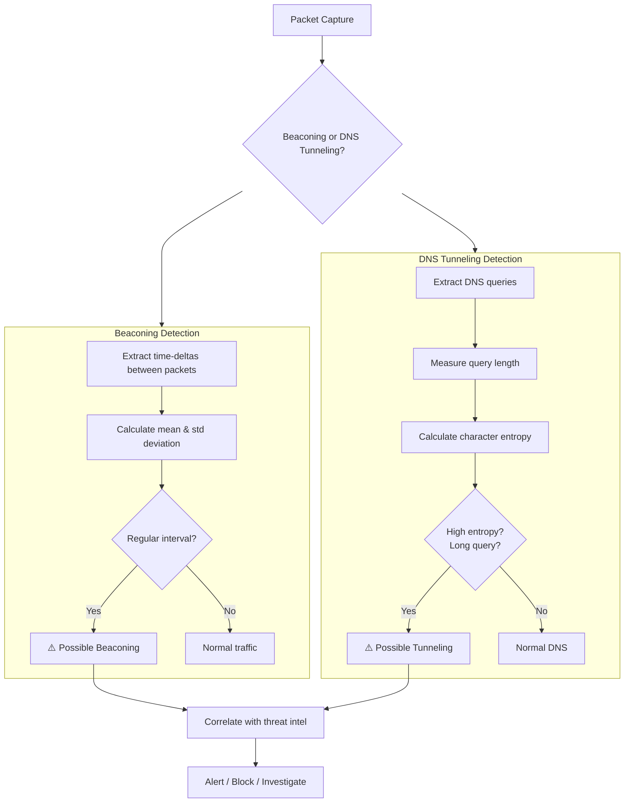
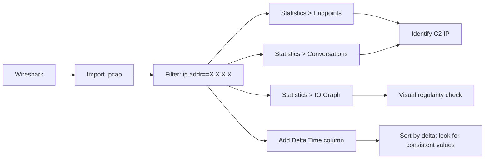

# 🕵️ Full-Stack Lesson: Identify Beaconing and DNS Tunneling

## 📊 Executive Summary

Beaconing is the periodic "check-in" traffic that malware uses to communicate with a Command & Control (C2) server. DNS tunneling abuses the DNS protocol to exfiltrate data or establish covert channels through firewalls that permit DNS traffic. Both techniques leave measurable artefacts in packet captures: beaconing produces consistent time-delta patterns between packets, while DNS tunneling generates high-entropy, unusually long domain names with aberrant query frequencies. This lesson covers manual detection in Wireshark, automated time-delta analysis with Python, entropy-based anomaly detection, and practical workflows for identifying both threats in real traffic.



## 🏗️ Phase 1: What Beaconing Looks Like

### The Beacon Pattern

C2 beaconing is characterised by **regular, periodic communication** between an infected host and a C2 server. The beacon interval is hard-coded in the malware but may include jitter (randomised delay) to evade detection.

| Characteristic | Benign Traffic | C2 Beaconing |
|----------------|---------------|--------------|
| **Time delta** | Irregular, bursty | Regular, predictable |
| **Payload size** | Variable | Often small & constant |
| **Packet count** | Sporadic | Consistent |
| **Destination** | Many different IPs | One (or few) IPs |
| **Protocol** | Varies | HTTP, HTTPS, or custom |
| **Periodicity** | None | 1s, 5s, 60s, 300s |

### Common Beacon Intervals

| Interval | Example Malware | Notes |
|----------|----------------|-------|
| **1 second** | Conficker, Sality | Aggressive, easy to detect |
| **60 seconds** | Cobalt Strike (default) | Common for interactive C2 |
| **300 seconds (5 min)** | TrickBot, Emotet | Slower, harder to detect |
| **3600 seconds (1 hr)** | APT groups | Low & slow, often uses jitter |

> 💡 **Jitter Evasion**: Modern malware adds ±30% jitter to the beacon interval. A 60s beacon with 30% jitter arrives between 42s and 78s. You must account for this in detection logic.

### Visual Beacon Pattern

```
Time:    0s     5s     10s    15s    20s    25s    30s
Normal:  ···    ·      ···    ··     ·      ···    ···
Beacon:  ·      ·      ·      ·      ·      ·      ·
          ^      ^      ^      ^      ^      ^      ^
         5.01s  4.99s  5.02s  4.98s  5.01s  5.00s  ← Δ = ~5s
```

## 🔍 Phase 2: Identifying Beaconing in Wireshark

### Manual Wireshark Analysis

1. **Apply a display filter** for the suspect host:
   ```
   ip.addr == 10.0.0.99
   ```

2. **Use Statistics → Endpoints** to see all IPs the host talks to

3. **Use Statistics → Conversations** to examine per-flow packet counts and durations

4. **Use Statistics → IO Graph** with a 1-second interval to visualise regularity:
   - Smooth, evenly-spaced bars = beaconing
   - Irregular, spiky bars = normal traffic

5. **Examine TCP stream** (right-click → Follow → TCP Stream) to check for small, repetitive payloads

### Time-Delta Column in Wireshark

1. Add the **Delta time** column:
   - Right-click any column header → **Column Preferences**
   - Click **+** → Type: `Delta time` (custom)
   - Field name: `frame.time_delta`

2. Sort by this column to see repeated small intervals

3. Pattern: Multiple rows with `0.999`, `1.002`, `0.998` = likely 1-second beacon



## 🐍 Phase 3: Automated Beaconing Analysis with Python

### Time-Delta Beacon Detector

```python
import subprocess
import re
from datetime import datetime
from collections import defaultdict
from statistics import mean, stdev
from typing import List, Dict, Tuple
import json

class BeaconDetector:
    def __init__(self, pcap_file: str, bpf_filter: str = ""):
        self.pcap_file = pcap_file
        self.bpf_filter = bpf_filter

    def extract_timestamps(self) -> List[Dict]:
        """Extract per-flow timestamps from pcap using tshark/tcpdump."""
        cmd = ["tshark", "-r", self.pcap_file, "-T", "fields",
               "-e", "frame.time_epoch", "-e", "ip.src", "-e", "ip.dst",
               "-e", "tcp.srcport", "-e", "tcp.dstport", "-e", "udp.srcport",
               "-e", "udp.dstport", "-e", "frame.len",
               "-E", "separator=|", "-Y", self.bpf_filter] if self.bpf_filter else \
              ["tshark", "-r", self.pcap_file, "-T", "fields",
               "-e", "frame.time_epoch", "-e", "ip.src", "-e", "ip.dst",
               "-e", "tcp.srcport", "-e", "tcp.dstport", "-e", "udp.srcport",
               "-e", "udp.dstport", "-e", "frame.len",
               "-E", "separator=|"]

        result = subprocess.run(cmd, capture_output=True, text=True)
        packets = []

        for line in result.stdout.strip().split('\n'):
            if not line or line.startswith('|'):
                continue
            fields = line.split('|')
            if len(fields) < 8:
                continue

            timestamp = float(fields[0])
            src_ip = fields[1]
            dst_ip = fields[2]
            src_port = fields[3] or fields[5] or "0"
            dst_port = fields[4] or fields[6] or "0"
            length = int(fields[7])

            packets.append({
                'timestamp': timestamp,
                'src_ip': src_ip,
                'dst_ip': dst_ip,
                'src_port': src_port,
                'dst_port': dst_port,
                'length': length
            })

        return packets

    def compute_flow_deltas(self, packets: List[Dict]) -> Dict[str, List[float]]:
        """Group packets by flow and compute inter-arrival deltas."""
        flows = defaultdict(list)

        for p in packets:
            flow_key = f"{p['src_ip']}:{p['src_port']} -> {p['dst_ip']}:{p['dst_port']}"
            flows[flow_key].append(p['timestamp'])

        flow_deltas = {}
        for flow, timestamps in flows.items():
            timestamps.sort()
            deltas = []
            for i in range(1, len(timestamps)):
                deltas.append(timestamps[i] - timestamps[i-1])
            flow_deltas[flow] = deltas

        return flow_deltas

    def detect_beacons(self, flow_deltas: Dict[str, List[float]],
                       max_jitter_ratio: float = 0.5,
                       min_packets: int = 5) -> List[Dict]:
        """Identify flows with regular time-delta patterns."""
        beacons = []

        for flow, deltas in flow_deltas.items():
            if len(deltas) < min_packets - 1:
                continue

            avg_delta = mean(deltas)
            if avg_delta < 0.1:
                continue  # Too fast, likely burst traffic

            try:
                delta_std = stdev(deltas)
            except Exception:
                delta_std = 0.0

            jitter_ratio = delta_std / avg_delta if avg_delta > 0 else 1.0

            # Coefficient of variation (CV) < max_jitter_ratio = regular
            if jitter_ratio < max_jitter_ratio:
                beacons.append({
                    'flow': flow,
                    'avg_delta_sec': round(avg_delta, 4),
                    'std_delta_sec': round(delta_std, 4),
                    'jitter_ratio': round(jitter_ratio, 4),
                    'packet_count': len(deltas) + 1,
                    'is_suspicious': self._assess_risk(avg_delta, jitter_ratio)
                })

        return sorted(beacons, key=lambda x: x['jitter_ratio'])

    def _assess_risk(self, avg_delta: float, jitter_ratio: float) -> str:
        """Classify beacon risk level."""
        if avg_delta <= 10 and jitter_ratio <= 0.2:
            return "CRITICAL"
        elif avg_delta <= 60 and jitter_ratio <= 0.3:
            return "HIGH"
        elif avg_delta <= 300 and jitter_ratio <= 0.4:
            return "MEDIUM"
        else:
            return "LOW"

    def find_symmetric_beacons(self, flow_deltas: Dict[str, List[float]],
                                threshold: float = 0.1) -> List[Dict]:
        """Detect beaconing with symmetric send/receive (e.g., DNS tunneling)."""
        pairs = defaultdict(list)
        for flow, deltas in flow_deltas.items():
            parts = flow.split(" -> ")
            if len(parts) == 2:
                reverse = f"{parts[1]} -> {parts[0]}"
                pairs[tuple(sorted([flow, reverse]))].append((flow, deltas))

        symmetric = []
        for _, flows in pairs.items():
            if len(flows) == 2:
                f1_deltas = flows[0][1]
                f2_deltas = flows[1][1]
                if len(f1_deltas) >= 3 and len(f2_deltas) >= 3:
                    combined = f1_deltas + f2_deltas
                    avg = mean(combined)
                    sd = stdev(combined) if len(combined) > 1 else 0
                    if sd < threshold * avg:
                        symmetric.append({
                            'flow_a': flows[0][0],
                            'flow_b': flows[1][0],
                            'avg_delta': round(avg, 4),
                            'std_delta': round(sd, 4),
                            'total_packets': len(combined) + 2
                        })

        return symmetric

    def generate_report(self, output_file: str = None) -> Dict:
        """Full analysis pipeline."""
        print(f"[*] Extracting packets from {self.pcap_file}...")
        packets = self.extract_timestamps()
        print(f"[*] Found {len(packets)} packets")

        print(f"[*] Computing flow time-deltas...")
        flow_deltas = self.compute_flow_deltas(packets)

        print(f"[*] Detecting beacon patterns...")
        beacons = self.detect_beacons(flow_deltas)
        print(f"[*] Found {len(beacons)} beacon candidates")

        symmetric = self.find_symmetric_beacons(flow_deltas)

        report = {
            'pcap': self.pcap_file,
            'total_packets': len(packets),
            'total_flows': len(flow_deltas),
            'beacon_candidates': beacons,
            'symmetric_beacons': symmetric,
            'summary': {
                'critical': len([b for b in beacons if b['is_suspicious'] == 'CRITICAL']),
                'high': len([b for b in beacons if b['is_suspicious'] == 'HIGH']),
                'medium': len([b for b in beacons if b['is_suspicious'] == 'MEDIUM']),
                'low': len([b for b in beacons if b['is_suspicious'] == 'LOW'])
            }
        }

        if output_file:
            with open(output_file, 'w') as f:
                json.dump(report, f, indent=2)
            print(f"[✓] Report saved to {output_file}")

        return report

# Usage
if __name__ == "__main__":
    detector = BeaconDetector("capture.pcap")
    report = detector.generate_report("beacon_report.json")

    print("\n=== BEACON CANDIDATES ===")
    for b in report['beacon_candidates'][:10]:
        print(f"  [{b['is_suspicious']}] {b['flow']}")
        print(f"       Δ={b['avg_delta_sec']}s  σ={b['std_delta_sec']}s  "
              f"jitter={b['jitter_ratio']}  pkts={b['packet_count']}")
```

## 🔬 Phase 4: DNS Tunneling Detection

### How DNS Tunneling Works

DNS tunneling encodes data in DNS queries and responses. Since DNS is almost always allowed through firewalls, it makes an ideal covert channel.

| Component | Normal DNS | Tunnelled DNS |
|-----------|------------|---------------|
| **Query length** | 10–40 chars | 50–255+ chars |
| **Subdomain count** | 1–3 | 5–20+ |
| **Character set** | Alphanumeric + hyphens | Full base64/base32/base16 |
| **Entropy** | Low (~2.5 bits/char) | High (~5.5+ bits/char) |
| **Query frequency** | Bursty, few queries | Continuous, high volume |
| **Record type** | A, AAAA, MX, NS | TXT (most common), A, CNAME |
| **Response size** | Small (~100 bytes) | Large (up to 4096 bytes in TXT) |

### DNS Tunneling Detection Pipeline

```
                          ┌─────────────────────┐
                          │  Raw DNS Capture     │
                          │  (udp port 53)       │
                          └──────────┬──────────┘
                                     ↓
                          ┌─────────────────────┐
                          │  Extract DNS Queries  │
                          │  (tshark / tcpdump)   │
                          └──────────┬──────────┘
                                     ↓
                    ┌────────────────┼────────────────┐
                    ↓                ↓                ↓
            ┌──────────────┐ ┌──────────────┐ ┌──────────────┐
            │Query Length  │ │  Entropy     │ │  Frequency   │
            │Check (>50)   │ │  Analysis    │ │  (>N/min)    │
            └──────┬───────┘ └──────┬───────┘ └──────┬───────┘
                    │               │                │
                    └───────────────┼────────────────┘
                                    ↓
                          ┌─────────────────────┐
                          │  Anomaly Score       │
                          │  (weighted sum)      │
                          └──────────┬──────────┘
                                     ↓
                          ┌─────────────────────┐
                          │  Alert / Investigate │
                          └─────────────────────┘
```

### Python DNS Tunneling Detector

```python
import subprocess
import math
import re
from collections import Counter, defaultdict
from typing import List, Dict, Tuple

class DNSTunnelingDetector:
    def __init__(self, pcap_file: str):
        self.pcap_file = pcap_file

    def extract_dns_queries(self) -> List[Dict]:
        """Extract DNS queries using tshark."""
        cmd = [
            "tshark", "-r", self.pcap_file,
            "-Y", "dns.flags.response == 0",
            "-T", "fields",
            "-e", "frame.time_epoch",
            "-e", "ip.src",
            "-e", "dns.qry.name",
            "-e", "dns.qry.type",
            "-e", "dns.qry.name.len",
            "-E", "separator=|"
        ]

        result = subprocess.run(cmd, capture_output=True, text=True)
        queries = []

        for line in result.stdout.strip().split('\n'):
            if not line:
                continue
            fields = line.split('|')
            if len(fields) < 5:
                continue

            queries.append({
                'timestamp': float(fields[0]),
                'src_ip': fields[1],
                'domain': fields[2].lower() if fields[2] else '',
                'qtype': fields[3],
                'length': int(fields[4]) if fields[4] else 0
            })

        return queries

    @staticmethod
    def calculate_entropy(data: str) -> float:
        """Shannon entropy of a string in bits per character."""
        if not data:
            return 0.0
        data = data.rstrip('.')  # Remove trailing dot
        # Remove TLD
        parts = data.split('.')
        if len(parts) >= 2:
            subdomain = '.'.join(parts[:-2])
        else:
            subdomain = data

        if not subdomain:
            return 0.0

        freq = Counter(subdomain)
        entropy = 0.0
        length = len(subdomain)
        for count in freq.values():
            p = count / length
            if p > 0:
                entropy -= p * math.log2(p)

        return entropy

    @staticmethod
    def longest_meaningful_word_ratio(domain: str) -> float:
        """Ratio of domain that looks like random chars vs dictionary words."""
        domain = domain.rstrip('.')
        parts = domain.split('.')
        if len(parts) >= 2:
            subdomain = '.'.join(parts[:-2])
        else:
            subdomain = parts[0] if parts else ''

        if not subdomain:
            return 0.0

        # Simple heuristic: count consecutive consonants as "random"
        consonant_runs = re.findall(r'[bcdfghjklmnpqrstvwxz]{4,}', subdomain, re.IGNORECASE)
        random_chars = sum(len(run) for run in consonant_runs)

        return random_chars / len(subdomain) if len(subdomain) > 0 else 0.0

    @staticmethod
    def count_labels(domain: str) -> int:
        """Count the number of labels in a domain."""
        domain = domain.rstrip('.')
        return len(domain.split('.'))

    def compute_scores(self, queries: List[Dict]) -> List[Dict]:
        """Compute anomaly scores for each query."""
        scored = []
        for q in queries:
            if not q['domain']:
                continue

            entropy = self.calculate_entropy(q['domain'])
            label_count = self.count_labels(q['domain'])
            random_ratio = self.longest_meaningful_word_ratio(q['domain'])

            # Simple heuristic scoring (0-1 scale)
            length_score = min(1.0, q['length'] / 100)
            entropy_score = min(1.0, entropy / 6.0)
            label_score = min(1.0, label_count / 10)
            random_score = min(1.0, random_ratio * 2)

            anomaly_score = (
                0.35 * length_score +
                0.35 * entropy_score +
                0.15 * label_score +
                0.15 * random_score
            )

            scored.append({
                **q,
                'entropy': round(entropy, 3),
                'label_count': label_count,
                'random_ratio': round(random_ratio, 3),
                'anomaly_score': round(anomaly_score, 3)
            })

        return scored

    def detect_tunneling(self, queries: List[Dict],
                         entropy_threshold: float = 4.5,
                         length_threshold: int = 50,
                         score_threshold: float = 0.5) -> Dict:
        """Main tunneling detection function."""
        scored = self.compute_scores(queries)

        flagged = [q for q in scored if q['anomaly_score'] >= score_threshold]
        high_entropy = [q for q in scored if q['entropy'] >= entropy_threshold]
        long_queries = [q for q in scored if q['length'] >= length_threshold]

        # Per-source analysis
        source_stats = defaultdict(lambda: {
            'total': 0, 'flagged': 0, 'avg_entropy': 0,
            'avg_length': 0, 'domains': set()
        })

        for q in scored:
            src = q['src_ip']
            source_stats[src]['total'] += 1
            source_stats[src]['domains'].add(q['domain'])
            source_stats[src]['avg_entropy'] += q['entropy']
            source_stats[src]['avg_length'] += q['length']

        for src, stats in source_stats.items():
            if stats['total'] > 0:
                stats['avg_entropy'] = round(stats['avg_entropy'] / stats['total'], 3)
                stats['avg_length'] = round(stats['avg_length'] / stats['total'], 1)
                stats['domain_count'] = len(stats['domains'])
                del stats['domains']

            stats['flagged'] = len([q for q in flagged if q['src_ip'] == src])

        return {
            'total_queries': len(queries),
            'flagged_queries': len(flagged),
            'high_entropy_queries': len(high_entropy),
            'long_queries': len(long_queries),
            'top_flagged': sorted(
                [q for q in flagged],
                key=lambda x: x['anomaly_score'],
                reverse=True
            )[:20],
            'suspicious_sources': sorted(
                [{'src': src, **stats}
                 for src, stats in source_stats.items()
                 if stats['flagged'] > 5 or stats['avg_entropy'] > 4.0],
                key=lambda x: x['flagged'],
                reverse=True
            ),
            'thresholds': {
                'entropy': entropy_threshold,
                'length': length_threshold,
                'score': score_threshold
            }
        }

    def detect_high_frequency_queries(self, queries: List[Dict],
                                       window_sec: int = 60) -> List[Dict]:
        """Detect sources with abnormally high DNS query frequency."""
        source_times = defaultdict(list)
        for q in queries:
            source_times[q['src_ip']].append(q['timestamp'])

        suspicious = []
        for src, times in source_times.items():
            times.sort()
            if len(times) < 10:
                continue

            # Count queries per sliding window
            freq = 0
            max_freq = 0
            window_start = times[0]

            for t in times:
                if t - window_start <= window_sec:
                    freq += 1
                else:
                    max_freq = max(max_freq, freq)
                    window_start = t
                    freq = 1

            max_freq = max(max_freq, freq)
            qps = max_freq / window_sec

            if qps > 5:  # More than 5 queries per second
                suspicious.append({
                    'src': src,
                    'max_qps': round(qps, 2),
                    'max_queries_in_window': max_freq,
                    'total_queries': len(times)
                })

        return sorted(suspicious, key=lambda x: x['max_qps'], reverse=True)

    def full_analysis(self) -> Dict:
        """Run full DNS tunneling detection pipeline."""
        print(f"[*] Extracting DNS queries from {self.pcap_file}...")
        queries = self.extract_dns_queries()
        print(f"[*] Found {len(queries)} DNS queries")

        print(f"[*] Computing anomaly scores...")
        tunneling = self.detect_tunneling(queries)

        print(f"[*] Detecting high-frequency sources...")
        freq_suspicious = self.detect_high_frequency_queries(queries)

        return {
            'dns_analysis': tunneling,
            'high_frequency_sources': freq_suspicious,
            'summary': {
                'total_queries': len(queries),
                'flagged': tunneling['flagged_queries'],
                'high_freq_sources': len(freq_suspicious)
            }
        }

# Usage
detector = DNSTunnelingDetector("dns_traffic.pcap")
results = detector.full_analysis()

print("\n=== TOP ANOMALOUS DNS QUERIES ===")
for q in results['dns_analysis']['top_flagged'][:10]:
    print(f"  [{q['anomaly_score']}] {q['domain']}")
    print(f"       len={q['length']}, entropy={q['entropy']}, "
          f"labels={q['label_count']}")

print("\n=== SUSPICIOUS SOURCES ===")
for src in results['dns_analysis']['suspicious_sources'][:5]:
    print(f"  {src['src']}: {src['flagged']} flagged / {src['total']} total, "
          f"avg_entropy={src['avg_entropy']}")
```

## 📊 Phase 5: Interpreting Results

### Beaconing Risk Matrix

| Average Delta | Jitter Ratio | Risk Level | Likely Activity |
|---------------|-------------|------------|-----------------|
| 1–10s | < 0.2 | **CRITICAL** | Aggressive C2 beacon, interactive shell |
| 10–60s | < 0.3 | **HIGH** | Standard C2 beacon (Cobalt Strike, Metasploit) |
| 60–300s | < 0.4 | **MEDIUM** | Low & slow beacon (TrickBot, APT) |
| 300–3600s | < 0.5 | **LOW** | Very slow beacon, potentially benign scheduler |

### DNS Tunneling Risk Matrix

| Entropy (bits/char) | Query Length | Labels | Risk | Example |
|---------------------|--------------|--------|------|---------|
| > 5.5 | > 100 | > 8 | **CRITICAL** | Base64-encoded data in subdomain |
| 4.5–5.5 | 50–100 | 5–8 | **HIGH** | Base32/hex encoding in subdomain |
| 3.5–4.5 | 30–50 | 3–5 | **MEDIUM** | Compressed or obfuscated text |
| < 3.5 | < 30 | < 3 | **LOW** | Normal DNS query |

> 💡 **False Positive Context**: A domain like `cdn.cloudflare.com` has entropy ~2.1 (normal), while `gzs6tb4xq7fuq2a3y5w8p1cd0m9rnjve.akamai.net` may have entropy > 5.0 (suspicious). Always check if the domain resolves to a known CDN before alerting.

### Real-World Examples

### 📦 Beaconing Example: Cobalt Strike HTTP Beacon

```
tcpdump output (filtered for C2 IP 51.15.43.214):

12:01:00.123 IP 10.0.0.5.49152 > 51.15.43.214.80: Flags [S], seq 100
12:01:00.456 IP 51.15.43.214.80 > 10.0.0.5.49152: Flags [S.], seq 200
12:01:00.789 IP 10.0.0.5.49152 > 51.15.43.214.80: Flags [A], seq 101
12:01:00.790 IP 10.0.0.5.49152 > 51.15.43.214.80: HTTP GET /wQyZM
12:01:01.200 IP 51.15.43.214.80 > 10.0.0.5.49152: HTTP 200 OK (small body)

--- 60 seconds later ---

12:02:00.123 IP 10.0.0.5.49153 > 51.15.43.214.80: Flags [S], seq 300
... (identical pattern repeats every ~60s)

Time deltas: 60.01, 59.98, 60.02, 60.00, 59.99
Jitter: 0.02% — extremely regular
```

### 📦 DNS Tunneling Example: Iodine / dnscat2

```
tunnelled.example.com:
rf9q2w5x7a3b8c0d1e4f6g9h2i5j7k0l1m3n6p8q2r4s7t9u1v3w5x8y0z2a4b7c9d

Characteristics:
  Length:      97 characters (vs normal ~25)
  Entropy:     5.72 bits/char (vs normal ~2.1)
  Labels:      9 (vs normal 2-3)
  Frequency:   23 queries in 5 seconds (vs normal 1-2/min)

Record type: TXT (most common for tunneling)
Response contains encoded data padded to 255 bytes

Detection flags: ALL CRITICAL
```

## 🛠️ Phase 6: Detection Evasion & Countermeasures

### How Attackers Evade Beacon Detection

| Evasion Technique | Description | Countermeasure |
|-------------------|-------------|---------------|
| **Jitter** | Randomised delay between beacons | Use wider detection window, CV < 0.5 |
| **Sleep** | Long intervals between check-ins | Long-duration captures (24h+) |
| **Mimicry** | Beacon in HTTP traffic to popular sites | Check beacon content, not just timing |
| **Decoy traffic** | Normal traffic interspersed with beaconing | Session-level analysis |
| **Protocol switching** | HTTP → HTTPS → DNS → ICMP | Multi-protocol correlation |

### How Attackers Evade DNS Detection

| Evasion Technique | Description | Countermeasure |
|-------------------|-------------|---------------|
| **Dictionary subdomains** | Use real words instead of random chars | Check entropy + frequency together |
| **Low throughput** | Few tunnelled queries per hour | Long-duration statistical baselines |
| **Legitimate TLDs** | Tunnel under com/net/org | Check against known-good domains |
| **DNS-over-HTTPS (DoH)** | Tunnel inside HTTPS to hide DNS entirely | Monitor DoH endpoints |
| **Domain fronting** | Use CDN domain for tunnel | TLS SNI analysis |

## 📝 Phase 7: Conclusion & Checklist

### Key Takeaways

1. **Beaconing is detectable by time-delta regularity**—low standard deviation between packet arrivals is a strong indicator regardless of encryption
2. **DNS tunnelling leaves three artefacts**: long query names, high character entropy, and abnormally high query frequency
3. **Always account for jitter** in beacon detection algorithms—a coefficient of variation (CV) < 0.5 is a reasonable detection threshold
4. **Combine multiple signals** for DNS tunnelling: a single long query may be a CDN; many long queries with high entropy from one source is tunneling

### Detection Checklist

## Beaconing & DNS Tunneling Detection Checklist

### Beaconing Detection
- [ ] Identify all external IPs the suspect host communicates with
- [ ] Calculate inter-arrival time deltas per flow
- [ ] Compute mean and standard deviation of deltas
- [ ] Flag flows with CV < 0.3 as HIGH, < 0.5 as MEDIUM
- [ ] Check payload sizes for consistency (small + constant = beacon)
- [ ] Verify beacon intervals against known malware patterns
- [ ] Look for symmetric beacon flows (bidirectional regularity)

### DNS Tunneling Detection
- [ ] Extract all DNS queries (filter: dns.flags.response == 0)
- [ ] Calculate query length anomalies (> 50 chars = suspicious)
- [ ] Calculate Shannon entropy per query (> 4.5 = suspicious)
- [ ] Count subdomain labels (> 5 = suspicious)
- [ ] Measure query frequency per source (> 5/s = anomalous)
- [ ] Identify non-standard record types (TXT with large payloads)
- [ ] Check for base64/hex encoding patterns in query names
- [ ] Cross-reference flagged domains with threat intelligence

### Investigation Workflow
- [ ] Export flagged flows to separate pcap for focused analysis
- [ ] Decode suspected tunnelled DNS TXT responses
- [ ] Check timestamps against known C2 infrastructure
- [ ] Correlate with other alerts (IDS, EDR, firewall logs)
- [ ] Determine scope: single host or network-wide infection
- [ ] Document findings with packet-level evidence
