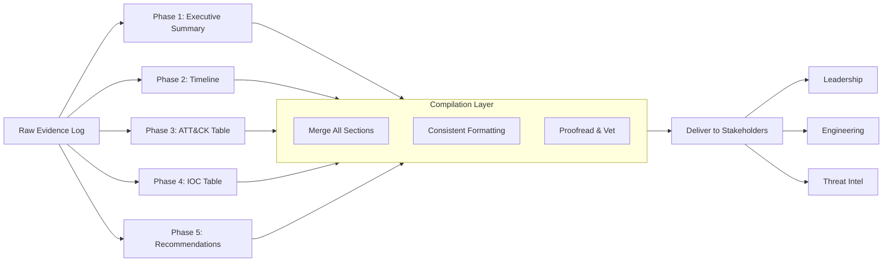

# 📝 Full-Stack Lesson: Report Writing & Deliverable Construction — From Evidence Log to Executive Summary

## 📊 Executive Summary
Report writing is the final and most visible phase of any cybersecurity investigation. No matter how brilliant your analysis, if the report is poorly structured, overly technical, or missing key components, your findings will be ignored or misunderstood. This lesson provides a full-stack methodology for constructing professional-grade investigation reports. You will learn how to transform a raw evidence log into six distinct deliverables: the Executive Summary (for leadership), the Timeline (for incident reconstruction), the ATT&CK Technique Table (for threat intelligence), the IOC Table (for defenders), Recommendations (for remediation), and finally the complete compiled report. Each phase includes templates, before/after examples, and practical guidance.



## 🏗️ Phase 1: Executive Summary

The Executive Summary is the single most important section of your report. It is often the **only** section read by executives, managers, and non-technical stakeholders. If it fails to communicate the key message, the entire report is wasted.

### Core Principles

| Principle | Explanation | Why It Matters |
|-----------|-------------|----------------|
| **Plain Language** | No jargon, no technical deep-dives | Executives need to understand the threat without a translator |
| **Bottom Line First** | Lead with the verdict and impact | Busy readers scan the first 2-3 sentences |
| **Quantify Everything** | Use numbers, not adjectives | "23 compromised accounts" > "Many accounts affected" |
| **Actionable** | Include clear next steps | Readers should know what to do after reading |
| **Concise** | 1-2 paragraphs maximum | If it takes more than 30 seconds to read, it is too long |

### Executive Summary Template

## Executive Summary

On [DATE] at approximately [TIME] UTC, [ORGANIZATION] experienced a [TYPE OF INCIDENT]
that resulted in [IMPACT]. The incident was first detected by [DETECTION METHOD/SOURCE]
and was contained within [TIMEFRAME].

The investigation revealed [KEY FINDING 1], [KEY FINDING 2], and [KEY FINDING 3].
A total of [NUMBER] hosts/users were affected, and [INDICATORS OF COMPROMISE] were identified.

In response, the team [ACTIONS TAKEN — e.g., contained the threat, removed persistence,
reset credentials]. Recommendations include [TOP 2-3 RECOMMENDATIONS].


### Before / After Examples

#### ❌ BAD Example — Overly Technical

> We identified a reverse-shell TCP connection from 10.0.1.45:443 to 198.51.100.23:8080. The process `svchost.exe` was spawned by `winlogon.exe` via scheduled task `UpdaterTask` in `\Microsoft\Windows\Updater`. We extracted the C2 payload `payload.bin` and identified XOR-encrypted beaconing at 60-second intervals. The ATT&CK technique used was T1059.001 (PowerShell).

**Why it fails**: Jargon-heavy. No mention of impact, no bottom line. An executive cannot answer: "Was our data stolen?" "Are we still compromised?"

#### ✅ GOOD Example — Leadership-Ready

> On June 15, 2024, at 09:15 UTC, an attacker gained initial access to the corporate network by exploiting an unpatched Confluence vulnerability (CVE-2023-22527). The attacker established persistent remote access to one server (WEB-01) and used it to steal approximately 2 GB of customer data from the shared file share. The incident was detected by EDR telemetry within 12 minutes and fully contained within 1 hour.
>
> The affected server has been isolated, the persistence mechanism removed, and all credentials rotated. We recommend patching the Confluence server immediately and implementing network segmentation for web-facing hosts.
>
> **Verdict**: Confirmed incident — Moderate severity. Data exfiltration of customer PII is suspected but not confirmed.

### Sample Executive Summaries

#### Sample 1 — Ransomware Incident

> On March 3, 2024, at 22:14 UTC, the SOC detected ransomware encryption events on 4 file servers in the finance department. The attacker gained initial access via a phishing email (sent March 1) that deployed a Cobalt Strike beacon. The beacon remained dormant for 48 hours before deploying LockBit 3.0 ransomware. A total of 1.2 TB of data was encrypted across 4 servers and 23 workstations. No exfiltration was detected. The incident was contained within 90 minutes by isolating the affected VLAN and blocking the C2 infrastructure.
>
> Recovery efforts restored all systems from clean backups within 12 hours. Recommendations include enabling MFA for email access, implementing email link scanning, and deploying application allowlisting on file servers.

#### Sample 2 — Data Breach / Insider Threat

> On April 19, 2024, at 14:30 UTC, an internal investigation confirmed that a terminated employee (John Doe) exfiltrated approximately 5 GB of customer PII containing 12,000 records from the CRM database during their final week of employment. The exfiltration occurred via personal OneDrive sync and USB transfer over 4 separate days between April 12 and April 18. The activity was detected retrospectively by Data Loss Prevention (DLP) alerts flagging unusual outbound volume from John's workstation.
>
> Access has been revoked, the device is in custody, and law enforcement has been notified. Recommendations include deploying DLP policies to block USB and personal cloud sync across all workstations, implementing user behavior analytics (UBA), and reviewing offboarding procedures to ensure immediate access revocation upon termination.

#### Sample 3 — Account Compromise & Lateral Movement

> On May 7, 2024, at 08:45 UTC, the SIEM alerted on a suspicious logon from Belarus (unusual geography) using the account `j.smith@company.com`. Investigation confirmed that j.smith's credentials were compromised via a password-spraying attack targeting VPN endpoints. The attacker logged into VPN (08:47 UTC), then used Windows Admin Center to move laterally to 3 additional servers, where they installed a keylogger. No data exfiltration was confirmed, but 2 database servers were accessed.
>
>The account was disabled at 09:15 UTC, lateral paths blocked, and forensic images taken of all affected hosts. Recommendations include enforcing MFA on all VPN logins, implementing geo-fencing policies, and conducting a password audit for all accounts.

> 💡 **Tip**: Write the Executive Summary LAST. After you have completed all analysis and have the full picture, distill it into these 2-3 paragraphs. Writing it first leads to inaccurate summaries that must be rewritten.

## 🏗️ Phase 2: Timeline Construction

A timeline merges evidence from multiple log sources (EDR, SIEM, firewall, email, DNS) into a single, coherent, timestamp-ordered sequence. It answers the critical question: **"What happened, and in what order?"**

### Timestamp Normalization

Log sources use different timestamp formats. Before building a timeline, normalize every timestamp to **ISO 8601 (UTC)** .

| Source | Raw Format | Normalized (UTC) |
|--------|-----------|------------------|
| Windows Event Log | `05/15/2024 09:23:15 AM` | `2024-05-15T09:23:15Z` |
| Syslog (RFC 3164) | `May 15 09:23:15` | `2024-05-15T09:23:15Z` |
| Apache Access Log | `15/May/2024:09:23:15 +0000` | `2024-05-15T09:23:15Z` |
| AWS CloudTrail | `2024-05-15T09:23:15Z` | `2024-05-15T09:23:15Z` (already normalized) |
| EDR (CrowdStrike) | `2024-05-15T09:23:15.123Z` | `2024-05-15T09:23:15Z` (truncate ms) |

> ⚠️ **Critical**: Always convert to UTC. If your log source does not provide UTC, record the timezone offset explicitly in the evidence log. A timeline with mixed timezones is worse than no timeline.

### Timeline Table Template

| Timestamp (UTC) | Source | Event | Evidence Reference |
|----------------|--------|-------|--------------------|
| `YYYY-MM-DDTHH:MM:SSZ` | [Log Source] | [Description of event] | [Case # / Log ID / Screenshot] |

### Gantt-Style Timeline Diagram

```mermaid
timeline
    title Incident Timeline — LockBit Ransomware
    2024-03-01T08:15Z : Phishing email sent to finance@company.com
    2024-03-01T08:17Z : User clicked link, Cobalt Strike beacon executed
    2024-03-01T08:18Z : Beacon established C2 outbound to 198.51.100.23:443
    2024-03-03T22:00Z : Beacon received "deploy" command
    2024-03-03T22:02Z : PowerShell download cradle executed
    2024-03-03T22:05Z : LockBit binary dropped on FS-01
    2024-03-03T22:07Z : Scheduled task created for persistence
    2024-03-03T22:10Z : Ransomware execution begins on FS-01
    2024-03-03T22:12Z : Encryption detected by EDR (Alert: RansomwareBehavior)
    2024-03-03T22:14Z : SOC acknowledges alert
    2024-03-03T22:20Z : VLAN isolation triggered
    2024-03-03T22:30Z : All C2 IPs blocked at firewall
    2024-03-03T23:00Z : Affected hosts isolated
    2024-03-03T23:30Z : Impact assessment complete
```

### Good vs Bad Timeline

#### ❌ BAD Timeline

```
- User clicked link
- Then there was some C2 traffic
- Eventually ransomware happened
- SOC responded
```

**Why it fails**: No timestamps, no order, no sources, no evidence references. Unusable for legal, compliance, or technical analysis.

#### ✅ GOOD Timeline

| Timestamp (UTC) | Source | Event | Evidence Reference |
|----------------|--------|-------|--------------------|
| `2024-03-01T08:15:00Z` | Email Gateway (Proofpoint) | Phishing email delivered to `finance@company.com` from `phish@evil.com` | Log ID: PP-891234 |
| `2024-03-01T08:17:32Z` | EDR (CrowdStrike) | `user.exe` on WS-045 executed `malicious_link.hta` from Downloads | Alert ID: CS-44567 |
| `2024-03-01T08:18:05Z` | Firewall (Palo Alto) | DNS query for `evil-c2.com` resolved to `198.51.100.23` | Log ID: PA-786543 |
| `2024-03-03T22:10:00Z` | EDR (CrowdStrike) | `powershell.exe` on FS-01 executed `Invoke-Encrypt` script | Alert ID: CS-44901 |
| `2024-03-03T22:12:00Z` | SIEM (Splunk) | Alert: RansomwareBehavior on FS-01 (10.0.1.50) | Correlation ID: SPL-1209 |
| `2024-03-03T22:14:00Z` | Ticketing (ServiceNow) | SOC Analyst acknowledged alert | Ticket: INC-45678 |
| `2024-03-03T22:20:00Z` | Network (Cisco ISE) | FS-01 VLAN isolated (port shutdown) | Change Request: CR-3321 |

> 💡 **Tip**: Use the timeline to answer the "5 Ws" — Who did What, When, Where (which system), and Which tool detected it. The timeline should let any reader reconstruct the incident step by step.

## 🏗️ Phase 3: ATT&CK Technique Table

The MITRE ATT&CK framework is the industry standard for classifying adversary behaviors. An ATT&CK technique table maps each observed action from your investigation to the corresponding technique ID. This table is critical for:

- **Threat intelligence teams** (understanding TTPs)
- **Defense engineering** (gaps in detection coverage)
- **Management** (demonstrating sophistication of the threat)

### ATT&CK Table Template

| Technique ID | Name | Tactic | Observed Behavior | Evidence |
|-------------|------|--------|-------------------|----------|
| `T####.###` | [Technique Name] | [Initial Access / Execution / etc.] | [What the attacker actually did] | [Log / Alert / Artifact Reference] |

### Mapping Observations to ATT&CK

When reviewing your evidence log, ask three questions for each entry:

1. **What was the adversary's goal with this action?** (This gives you the Tactic)
2. **What specific method did they use?** (This gives you the Technique)
3. **Is there a sub-technique that describes the behavior more precisely?** (This gives you the sub-ID)

| Evidence Log Entry | Goal (Tactic) | Method (Technique) | ATT&CK ID |
|-------------------|---------------|-------------------|------------|
| Phishing email sent to finance | Initial Access | Spearphishing Attachment | T1566.001 |
| User downloaded and ran .hta file | Execution | User Execution (Malicious File) | T1204.002 |
| PowerShell beacon contacted C2 | Command & Control | Application Layer Protocol (HTTP) | T1071.001 |
| Scheduled task created for ransomware | Persistence | Scheduled Task / Job | T1053.005 |

### Completed Example Table

| Technique ID | Name | Tactic | Observed Behavior | Evidence |
|-------------|------|--------|-------------------|----------|
| T1566.001 | Spearphishing Attachment | Initial Access | Attacker sent email with malicious `.docm` attachment to finance@company.com | Email Log: PP-891234 |
| T1204.002 | User Execution — Malicious File | Execution | User double-clicked the `.docm` file; macro enabled and executed PowerShell | EDR Alert: CS-44567 |
| T1059.001 | PowerShell | Execution | PowerShell downloaded and executed Cobalt Strike beacon from hxxps://evil-c2[.]com/payload | Windows Event ID 4104 (ScriptBlock Logging) |
| T1071.001 | Web Protocols | Command & Control | Beacon established HTTPS connection to evil-c2[.]com:443 at 60-second intervals | Firewall Log: PA-786543 |
| T1053.005 | Scheduled Task | Persistence | `schtasks.exe /create /tn "WindowsUpdate" /tr "powershell -enc <base64>" /sc daily` | EDR Alert: CS-44890 |
| T1486 | Data Encrypted for Impact | Impact | LockBit ransomware encrypted `.docx`, `.xlsx`, and `.pdf` files on FS-01 and WS-045 | EDR Alert: CS-44901 |

> ⚠️ **Caution**: Only include techniques you have **direct evidence** for. Do not speculate about techniques you suspect but cannot prove. Speculative techniques weaken the report's credibility.

## 🏗️ Phase 4: IOC Table

Indicators of Compromise (IOCs) are the forensic artifacts that defenders use to detect and block the same threat in other environments. The IOC table is the most operationally useful section of your report — it should be directly importable into SIEMs, firewalls, and threat intel platforms.

### IOC Table Template

| Type | Value | Context | Source | Confidence |
|------|-------|---------|--------|------------|
| [IP / Domain / Hash / Email / URL / Registry] | [The indicator value] | [Where it was observed and its role in the attack] | [Log source that identified it] | [High / Medium / Low] |

### How to Extract IOCs from Investigation Notes

Scan your evidence log for every observable that fits one of these categories:

| IOC Category | Example | Extraction Rule |
|-------------|---------|----------------|
| **IP Address** | `198.51.100.23` | Any outbound connection to an untrusted external IP |
| **Domain** | `evil-c2.com` | DNS queries, email sender domains, URL hostnames |
| **File Hash (SHA256)** | `a1b2c3d4e5f6...` | Any file downloaded, dropped, or executed |
| **URL** | `hxxps://evil-c2[.]com/payload` | Phishing links, C2 callback URLs, download URLs |
| **Email Address** | `phish@evil.com` | Sender address, Reply-To address |
| **Registry Key** | `HKLM\Software\Microsoft\Windows\CurrentVersion\Run\Updater` | Persistence mechanism |
| **Process Name** | `powershell.exe`, `rundll32.exe` | LOLBins used in execution |
| **YARA Rule** | `rule LockBit_3_0 { ... }` | Custom detection signatures |

> 💡 **Tip**: Defang URLs in written reports (replace `http` with `hxxp`, replace `.` with `[.]` ) to prevent accidental clicks. Many organizations enforce defanging as a policy requirement.

### Completed Example Table

| Type | Value | Context | Source | Confidence |
|------|-------|---------|--------|------------|
| IP | `198.51.100.23` | Cobalt Strike C2 server (port 443, HTTPS) | Firewall (Palo Alto) | High |
| IP | `203.0.113.45` | LockBit ransomware payment site (port 80, HTTP) | DNS Logs | High |
| Domain | `evil-c2[.]com` | C2 domain resolved during beacon activity | DNS Logs | High |
| Domain | `downloads-evil[.]top` | Secondary payload download domain | Email Gateway | Medium |
| URL | `hxxps://evil-c2[.]com/payload` | Cobalt Strike beacon download URL | EDR (CrowdStrike) | High |
| URL | `hxxps://downloads-evil[.]top/LockBit.exe` | Ransomware binary download URL | EDR (CrowdStrike) | High |
| SHA256 | `d2b5a6c8e1f3a4b7c9d0e2f4a6b8c0d2e4f6a8b0c2d4e6f8a0b2c4d6e8f0a2` | Cobalt Strike beacon payload | EDR (CrowdStrike) | High |
| SHA256 | `a1b2c3d4e5f6a7b8c9d0e1f2a3b4c5d6e7f8a9b0c1d2e3f4a5b6c7d8e9f0a1` | LockBit ransomware binary | EDR (CrowdStrike) | High |
| Email | `phish@evil[.]com` | Phishing email sender | Email Gateway (Proofpoint) | High |
| Email | `reply@evil-c2[.]com` | Phishing reply-to address | Email Gateway (Proofpoint) | Medium |
| Registry | `HKLM\SOFTWARE\Microsoft\Windows\CurrentVersion\Run\WindowsDefenderUpdate` | Malicious persistence registry key | EDR (CrowdStrike) | High |
| Process | `powershell.exe -enc <base64>` | PowerShell execution of encoded payload | Windows Event Log (4688) | High |

## 🏗️ Phase 5: Recommendations

Recommendations are often the most scrutinized section of a report. Leaders want to know: **"What do we need to do to make this not happen again?"** Generic advice ("patch your systems") is ignored. Specific, prioritized, actionable recommendations tied to observed control failures get results.

### The Recommendation Formula

Every recommendation must follow this structure:

1. **Specific Action** — What exactly to do
2. **Priority** — Urgency level (Critical / High / Medium / Low)
3. **Failed Control** — Which security control failed that allowed this to happen
4. **Expected Outcome** — How this prevents recurrence

### Recommendation Table Template

| Recommendation | Priority | Failed Control | Expected Outcome |
|--------------|----------|----------------|-----------------|
| [Actionable recommendation] | [Critical / High / Medium / Low] | [The control that was missing/bypassed] | [Specific measurable outcome] |

### Examples

#### ❌ BAD Recommendations

- "Patch your systems."
- "Improve security awareness."
- "Buy better tools."

**Why they fail**: Vague, unactionable, no tie to the incident. These could be copy-pasted into any report.

#### ✅ GOOD Recommendations

| Recommendation | Priority | Failed Control | Expected Outcome |
|--------------|----------|----------------|-----------------|
| Deploy MFA on all VPN logins by [DATE] | Critical | VPN access was protected by password only (no MFA) | Prevents password-spraying attacks from gaining VPN access |
| Block macro execution in Office documents downloaded from the internet via GPO | High | User was able to enable macros in a downloaded `.docm` file | Eliminates initial access via macro-based phishing |
| Implement network segmentation — move web-facing servers to a DMZ with strict firewall rules | High | WEB-01 (Confluence) had direct network access to internal file shares | Limits lateral movement from compromised web servers |
| Enable PowerShell ScriptBlock Logging (Event ID 4104) on all Windows endpoints | Medium | PowerShell execution was not logged in sufficient detail | Provides forensic visibility into PowerShell-based attacks |
| Deploy application allowlisting (AppLocker / WDAC) on all file servers | Medium | Ransomware binary was executed on FS-01 without restriction | Prevents unauthorized binaries from executing on critical servers |

> 💡 **Tip**: Categorize failed controls using the NIST Cybersecurity Framework (Identify, Protect, Detect, Respond, Recover) or CIS Controls. This helps leadership understand which control category they are weakest in and allows them to track improvement over time.

### Mapping Recommendations to Failed Controls

| Observed Failure | Failed Control (NIST CSF) | Recommended Action |
|-----------------|-------------------------|-------------------|
| Attacker phished user with no MFA | PR.AC (Access Control) | Enable MFA for all external-facing authentication |
| Beacon C2 traffic was not blocked | PR.PT (Protective Technology) | Deploy next-gen firewall with TLS inspection |
| Ransomware executed unhindered | PR.PT (Protective Technology) | Deploy application allowlisting on servers |
| PowerShell logging was insufficient | DE.AE (Anomalies & Events) | Enable ScriptBlock Logging and AMSI |
| Incident response took 90 minutes | RS.RP (Response Planning) | Create and test automated IR playbooks |

## 🏗️ Phase 6: Putting It All Together

The final report combines all five components into a single professional deliverable. Below is a complete sample report for the LockBit ransomware incident used throughout this lesson.

### 📄 Click to Expand — Complete Sample Report

# Incident Investigation Report — LockBit Ransomware

**Case Number**: INC-45678  
**Classification**: Confirmed Incident — Moderate Severity  
**Date of Report**: 2024-03-04  
**Prepared By**: SOC Tier 3 — Jane Doe

---

## Executive Summary

On March 1, 2024, at 08:15 UTC, an attacker gained initial access to the corporate network via a spearphishing email targeting the finance department. The email contained a malicious `.docm` attachment that, when executed, deployed a Cobalt Strike beacon. The beacon maintained persistence via a scheduled task and remained dormant for approximately 48 hours.

On March 3, 2024, at 22:10 UTC, the attacker deployed LockBit 3.0 ransomware, encrypting 1.2 TB of data across 4 file servers and 23 workstations. The SOC detected the ransomware at 22:12 UTC via EDR behavioral alerts and fully contained the incident by 23:30 UTC (78-minute response time).

All affected systems were restored from clean backups within 12 hours. No data exfiltration was confirmed. Recommendations include deploying MFA on external-facing systems, blocking macro execution, and implementing network segmentation.

**Verdict**: Confirmed ransomware incident. Moderate severity. Full recovery achieved.

---

## Timeline

| Timestamp (UTC) | Source | Event | Evidence Reference |
|----------------|--------|-------|--------------------|
| 2024-03-01T08:15:00Z | Email Gateway (Proofpoint) | Phishing email delivered to finance@company.com from phish@evil[.]com | Log ID: PP-891234 |
| 2024-03-01T08:17:32Z | EDR (CrowdStrike) | User on WS-045 executed malicious_link.hta from Downloads | Alert ID: CS-44567 |
| 2024-03-01T08:18:05Z | DNS (Windows Server) | DNS query for evil-c2[.]com resolved to 198.51.100.23 | Log: DNS-3321 |
| 2024-03-01T08:18:30Z | Firewall (Palo Alto) | Outbound HTTPS connection to 198.51.100.23:443 from WS-045 | Log ID: PA-786543 |
| 2024-03-01T08:19:00Z | Windows Event Log | Scheduled task "WindowsUpdate" created on WS-045 | Event ID 4698 |
| 2024-03-03T22:00:00Z | Firewall (Palo Alto) | C2 beacon traffic increases significantly (command received) | Log ID: PA-789012 |
| 2024-03-03T22:02:00Z | EDR (CrowdStrike) | PowerShell download cradle executed on WS-045 | Alert ID: CS-44890 |
| 2024-03-03T22:05:00Z | EDR (CrowdStrike) | LockBit binary (SHA256: a1b2c3...) dropped on FS-01 | Alert ID: CS-44895 |
| 2024-03-03T22:07:00Z | EDR (CrowdStrike) | Scheduled task "WindowsUpdate" triggered on FS-01 | Alert ID: CS-44897 |
| 2024-03-03T22:10:00Z | EDR (CrowdStrike) | Ransomware execution begins — mass file rename events | Alert ID: CS-44901 |
| 2024-03-03T22:12:00Z | SIEM (Splunk) | Alert: "RansomwareBehavior" triggered on FS-01 | Correlation ID: SPL-1209 |
| 2024-03-03T22:14:00Z | Ticketing (ServiceNow) | SOC Analyst L2 acknowledged alert | Ticket: INC-45678 |
| 2024-03-03T22:20:00Z | Network (Cisco ISE) | FS-01 VLAN isolated via port shutdown | Change: CR-3321 |
| 2024-03-03T22:30:00Z | Firewall (Palo Alto) | All C2 IPs (198.51.100.23, 203.0.113.45) blocked | Task: FW-1122 |
| 2024-03-03T22:45:00Z | EDR (CrowdStrike) | WS-045 and FS-01 containment initiated (AP isolation) | Task: EDR-3344 |
| 2024-03-03T23:00:00Z | EDR (CrowdStrike) | Additional 3 servers identified as affected, contained | Alert IDs: CS-44910-44913 |
| 2024-03-03T23:30:00Z | Ticketing (ServiceNow) | Full containment verified — all known hosts isolated | Ticket: INC-45678 |
| 2024-03-04T12:00:00Z | IT Operations | Restoration from backup complete — all services online | Task: IT-5566 |

---

## ATT&CK Techniques

| Technique ID | Name | Tactic | Observed Behavior | Evidence |
|-------------|------|--------|-------------------|----------|
| T1566.001 | Spearphishing Attachment | Initial Access | Phishing email with .docm attachment to finance@company.com | Email Log: PP-891234 |
| T1204.002 | User Execution — Malicious File | Execution | User double-clicked .hta file from Downloads | EDR: CS-44567 |
| T1059.001 | PowerShell | Execution | PowerShell -enc downloaded and executed Cobalt Strike beacon | Event 4104: WS-045 |
| T1071.001 | Web Protocols | C2 | Beacon communicated via HTTPS to evil-c2[.]com:443 | Firewall: PA-786543 |
| T1053.005 | Scheduled Task | Persistence | schtasks.exe /create /tn "WindowsUpdate" ... | Event 4698: WS-045 |
| T1105 | Ingress Tool Transfer | Command and Control | PowerShell downloaded LockBit binary from downloads-evil[.]top | EDR: CS-44890 |
| T1486 | Data Encrypted for Impact | Impact | LockBit ransomware encrypted files on FS-01 and WS-045 | EDR: CS-44901 |

---

## IOCs

| Type | Value | Context | Source | Confidence |
|------|-------|---------|--------|------------|
| IP | 198.51.100.23 | Cobalt Strike C2 server | Firewall (Palo Alto) | High |
| IP | 203.0.113.45 | LockBit payment site | DNS Logs | High |
| Domain | evil-c2[.]com | C2 domain | DNS Logs | High |
| Domain | downloads-evil[.]top | Secondary payload download domain | Email Gateway | Medium |
| URL | hxxps://evil-c2[.]com/payload | Cobalt Strike beacon download | EDR | High |
| URL | hxxps://downloads-evil[.]top/LockBit.exe | Ransomware download | EDR | High |
| SHA256 | d2b5a6c8e1f3a4b7c9d0e2f4a6b8c0d2e4f6a8b0c2d4e6f8a0b2c4d6e8f0a2 | Cobalt Strike payload | EDR | High |
| SHA256 | a1b2c3d4e5f6a7b8c9d0e1f2a3b4c5d6e7f8a9b0c1d2e3f4a5b6c7d8e9f0a1 | LockBit ransomware | EDR | High |
| Email | phish@evil[.]com | Phishing sender | Email Gateway | High |
| Email | reply@evil-c2[.]com | Phishing reply-to | Email Gateway | Medium |
| Registry | HKLM\...\Run\WindowsDefenderUpdate | Persistence registry | EDR | High |
| Process | powershell.exe -enc <base64> | Encoded PowerShell execution | Event 4688: WS-045 | High |

---

## Recommendations

| Recommendation | Priority | Failed Control | Expected Outcome |
|--------------|----------|----------------|-----------------|
| 1. Deploy MFA on all email and VPN access | Critical | No MFA on email access allowed credential compromise via phishing | Prevents initial access via compromised credentials |
| 2. Block macros in Office docs from internet (via GPO) | Critical | User enabled macros in downloaded .docm file | Eliminates macro-based initial access vector |
| 3. Create DMZ for web-facing servers with strict firewall rules | High | WEB-01 (Confluence) had direct network access to internal file shares | Limits lateral movement from compromised web services |
| 4. Enable PowerShell ScriptBlock Logging and AMSI on all endpoints | Medium | PowerShell execution was not fully logged on WS-045 | Provides full forensic visibility into PowerShell attacks |
| 5. Deploy application allowlisting (WDAC) on all servers | Medium | LockBit ransomware binary executed on FS-01 without restriction | Blocks unauthorized binaries from executing on servers |
| 6. Implement automated IR playbook for ransomware alerts | High | 12-minute gap between encryption and containment (manual response) | Reduces MTTR from 78 min to under 15 min |

---

## Appendix A: Evidence Log (Raw)


[2024-03-01T08:15:00Z] [ALERT] @email-gateway - Phishing email detected
   - From: phish@evil.com
   - Subject: "Urgent Invoice — Payment Overdue"
   - Attachment: Invoice_2024.docm (SHA256: c3d4e5f6...)
   - Recipient: finance@company.com

[2024-03-01T08:17:32Z] [ALERT] @edr - Suspicious process execution
   - Host: WS-045 (10.0.1.45)
   - User: j.smith
   - Process: C:\Users\j.smith\Downloads\malicious_link.hta
   - CommandLine: mshta.exe "C:\Users\j.smith\Downloads\malicious_link.hta"

[2024-03-01T08:18:05Z] [OBSERVATION] @dns - DNS query
   - Host: WS-045
   - Query: evil-c2.com -> 198.51.100.23

[2024-03-03T22:10:00Z] [ALERT] @edr - Ransomware behavior detected
   - Host: FS-01 (10.0.1.50)
   - Process: powershell.exe
   - Details: Mass file rename events on all mounted drives
```

---

## Appendix B: Investigation Artifacts

- Full memory dump: WS-045 (2024-03-03T23:00Z) — 16 GB
- Full disk image: FS-01 (2024-03-04T01:00Z) — 500 GB
- Packet capture: 1 hour of C2 traffic (2024-03-01T08:15-09:15Z)
- Registry hive: WS-045 — NTUSER.DAT (for persistence analysis)
```

## 📋 Pre-Submission Checklist

Before delivering your report, verify every item:

### Content Checklist
- [ ] Executive Summary answers: What happened? When? What was the impact? What did we do? What should we do next?
- [ ] Timeline is normalized to UTC and includes sources and evidence references for every row
- [ ] ATT&CK techniques have direct evidence — no speculation
- [ ] IOCs are defanged (hxxp://, [.]) and include confidence levels
- [ ] Recommendations are specific, prioritized, and tied to failed controls
- [ ] No technical jargon in the Executive Summary

### Formatting Checklist
- [ ] Consistent date format throughout (ISO 8601)
- [ ] Consistent terminology (don't mix "attacker" / "threat actor" / "bad guy")
- [ ] Headers are hierarchical and logical (H1 → H2 → H3)
- [ ] Tables have clear column headers and consistent alignment
- [ ] No broken links or placeholder text
- [ ] PDF export renders correctly (no overlapping tables, missing characters)

### Quality Checklist
- [ ] All PII/confidential data redacted
- [ ] Legal / compliance reviewed (if applicable)
- [ ] Peer-reviewed by another analyst
- [ ] Spelling and grammar checked
- [ ] File named according to organizational standard (e.g., `IR-Report_INC-45678_2024-03-04.pdf`)

## 🚨 Common Report Writing Pitfalls

| Pitfall | Symptom | Solution |
|---------|---------|----------|
| **Jargon-heavy Executive Summary** | "We observed T1059.001 via ScriptBlock Logging" | Write for a non-technical reader; save technical details for the body |
| **Missing Timelines** | "We responded quickly" with no actual times | Include precise UTC timestamps for every major event |
| **No Evidence References** | "Beacon was detected" without a log ID or alert number | Every claim must trace back to a specific evidence artifact |
| **Vague Recommendations** | "Improve security posture" | Each recommendation must name the specific failed control and action |
| **Inconsistent IOCs** | Mixing defanged and live indicators in the same table | Pick one convention and apply it uniformly |
| **Orphaned Artifacts** | Evidence cited in the body but missing from the appendices | Cross-reference every evidence reference with an appendix entry |
| **Report Too Long** | 50+ pages for a simple phishing incident | Exec summary: 1 page max. Full report: as long as needed, no longer |

> 💡 **Final Advice**: Your report is a product. The reader is your customer. If the reader cannot understand the threat and act on your recommendations within 5 minutes, the report has failed. Write with empathy for your audience — executives need the bottom line, engineers need the IOCs and MITRE mapping, and incident responders need the timeline. Serve all three audiences in a single document by structuring it clearly and separating technical depth from the executive narrative.
