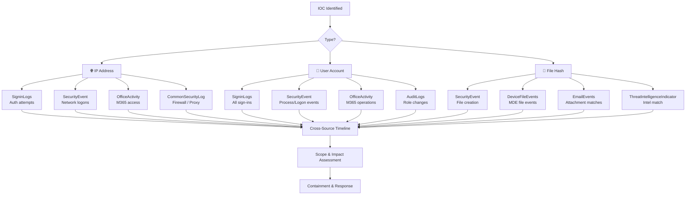
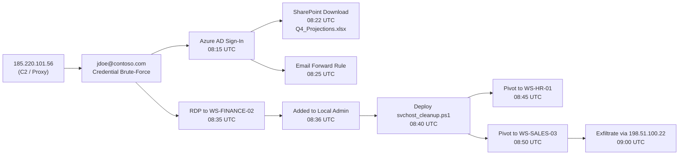

# 🔍 Full-Stack Lesson: Pivot a Single IOC Across Log Sources

## 📊 Executive Summary

When an incident responder discovers an Indicator of Compromise (IOC)—an IP address, a user account, or a file hash—the first step is to **pivot** that IOC across every log source to understand the full scope of the compromise. This lesson teaches a systematic methodology for pivoting a single IOC across `SigninLogs` (Azure AD), `SecurityEvent` (Windows), and `OfficeActivity` (M365) using KQL. You will learn cross-table **join patterns**, **union stacking**, and a **triage flow** that traces an attacker's entire kill chain.



## 🏗️ Phase 1: IOC Pivot Foundations

### What Is an IOC Pivot?

An **IOC pivot** takes a single known-bad indicator and searches every available log source for related activity. The goal is to answer:

- **Where else did this IP appear?** (Other users, other services, other times)
- **What else did this user do?** (Other IPs, other devices, sensitive actions)
- **Which other hosts have this file?** (Lateral movement, persistence)

### IOC Types and Source Tables

| IOC Type | Primary Tables | Key Columns |
|----------|---------------|-------------|
| **IP Address** | `SigninLogs.IPAddress`, `SecurityEvent.IpAddress`, `OfficeActivity.ClientIP`, `CommonSecurityLog.SourceIP`, `DeviceNetworkEvents.RemoteIP` | `IPAddress`, `ClientIP`, `SourceIP`, `RemoteIP` |
| **User Account** | `SigninLogs.UserPrincipalName`, `SecurityEvent.Account`, `OfficeActivity.UserId`, `AuditLogs.InitiatedBy` | `UserPrincipalName`, `Account`, `UserId`, `UPN` |
| **File Hash** | `SecurityEvent.ProcessHash`, `DeviceFileEvents.SHA1`, `EmailEvents.SHA256`, `ThreatIntelligenceIndicator` | `SHA1`, `SHA256`, `MD5`, `InitiatingProcessSHA1` |

> 💡 **Core Principle**: Always pivot in **time order** — find the earliest and latest sightings of the IOC to build a timeline. Attackers rarely use an IOC only once.

### KQL Reusable Functions

Define reusable KQL functions for quick pivoting:

```kusto
// Define once, reuse on every pivot
let PivotIP = (TargetIP:string) {
    union SignsFromIP(SigninLogs, TargetIP),
          NetworkEventsFromIP(SecurityEvent, TargetIP),
          M365FromIP(OfficeActivity, TargetIP)
};
```

## 🌐 Phase 2: IP Address Pivot

### Scenario

A firewall log shows an outbound connection to `185.220.101.56` (a known Cobalt Strike server). You need to find **every log entry** involving this IP across all data sources.

### Query 1: IP Pivot — SigninLogs (Azure AD)

```kusto
let MaliciousIP = "185.220.101.56";
SigninLogs
| where TimeGenerated > ago(30d)
| where IPAddress == MaliciousIP
| project TimeGenerated, UserPrincipalName, IPAddress, 
          AppDisplayName, Status = strcat(Status.errorCode, " - ", Status.failureReason),
          Location = strcat(Location.city, ", ", Location.countryOrRegion),
          RiskLevelDuringSignIn, AuthenticationRequirement
| order by TimeGenerated desc
```

### Query 2: IP Pivot — SecurityEvent (Windows Logons)

```kusto
let MaliciousIP = "185.220.101.56";
SecurityEvent
| where TimeGenerated > ago(30d)
| where IpAddress == MaliciousIP
| where EventID in (4624, 4625, 4648)  // Logon, failed logon, explicit credential
| project TimeGenerated, Account, Computer, IpAddress, 
          LogonType, EventID,
          ProcessName = Process, LogonProcess
| extend LogonTypeLabel = case(
    LogonType == 2, "Interactive",
    LogonType == 3, "Network",
    LogonType == 10, "RemoteInteractive",
    LogonType == 7, "Unlock",
    strcat("Type ", LogonType))
| order by TimeGenerated desc
```

### Query 3: IP Pivot — OfficeActivity (M365)

```kusto
let MaliciousIP = "185.220.101.56";
OfficeActivity
| where TimeGenerated > ago(30d)
| where ClientIP == MaliciousIP
| project TimeGenerated, UserId, ClientIP, Operation, 
          Item = ItemName, Workload, ResultStatus
| order by TimeGenerated desc
```

### Query 4: IP Pivot — All Sources Combined (Union)

```kusto
let MaliciousIP = "185.220.101.56";
// Azure AD Sign-ins
let IP_SigninLogs = SigninLogs
    | where TimeGenerated > ago(30d)
    | where IPAddress == MaliciousIP
    | project TimeGenerated, Source = "SigninLogs", User = UserPrincipalName, 
              IP = IPAddress, Action = AppDisplayName, Detail = Status.failureReason;
// Windows Security Events
let IP_SecurityEvent = SecurityEvent
    | where TimeGenerated > ago(30d)
    | where IpAddress == MaliciousIP
    | project TimeGenerated, Source = "SecurityEvent", User = Account, 
              IP = IpAddress, Action = strcat("EventID ", EventID), Detail = Computer;
// Office 365 Activity
let IP_OfficeActivity = OfficeActivity
    | where TimeGenerated > ago(30d)
    | where ClientIP == MaliciousIP
    | project TimeGenerated, Source = "OfficeActivity", User = UserId, 
              IP = ClientIP, Action = Operation, Detail = ItemName;
// Combine all
IP_SigninLogs
| union IP_SecurityEvent, IP_OfficeActivity
| order by TimeGenerated asc
| project TimeGenerated, Source, User, IP, Action, Detail
```

### What the Combined Pivot Reveals

| Timestamp | Source | User | Action | Detail |
|-----------|--------|------|--------|--------|
| 08:15 | SigninLogs | `jdoe@contoso.com` | Sign-in to Azure Portal | Success |
| 08:22 | OfficeActivity | `jdoe@contoso.com` | FileDownloaded | `financial_forecast.xlsx` |
| 08:35 | SecurityEvent | `jdoe` | Logon Type 10 (RDP) | `WS-FINANCE-02` |
| 08:41 | SecurityEvent | `jdoe` | EventID 4732 (Added to Admin) | `WS-FINANCE-02` |

> ⚠️ **Critical Finding**: The IP appears across **three different log sources**, indicating the attacker authenticated to Azure AD, downloaded sensitive files from SharePoint, RDP'd to a finance server, and escalated privileges — all within 26 minutes.

### Additional IP Pivot Sources

```kusto
// Firewall / Proxy logs (CommonSecurityLog)
CommonSecurityLog
| where TimeGenerated > ago(30d)
| where SourceIP == MaliciousIP or DestinationIP == MaliciousIP
| project TimeGenerated, DeviceVendor, DeviceAction, 
          SourceIP, DestinationIP, DestinationPort, BytesOut
| order by TimeGenerated desc;

// MDE Network Events
DeviceNetworkEvents
| where TimeGenerated > ago(30d)
| where RemoteIP == MaliciousIP
| project TimeGenerated, DeviceName, RemoteIP, RemotePort, 
          InitiatingProcessFileName, InitiatingProcessSHA1;
```

## 👤 Phase 3: User Account Pivot

### Scenario

An alert flags `jdoe@contoso.com` as compromised. You need to trace **everything this user did** across Azure AD, Windows endpoints, and M365 — including actions before the alert.

### Query 1: User Pivot — SigninLogs

```kusto
let TargetUser = "jdoe@contoso.com";
SigninLogs
| where TimeGenerated > ago(30d)
| where UserPrincipalName == TargetUser
| summarize SignInCount = count(), 
            UniqueIPs = dcount(IPAddress),
            FirstSignIn = min(TimeGenerated),
            LastSignIn = max(TimeGenerated),
            FailedCount = countif(Status.errorCode != 0),
            AppsUsed = make_set(AppDisplayName, 100)
            by UserPrincipalName
| project UserPrincipalName, SignInCount, UniqueIPs, FailedCount, 
          FirstSignIn, LastSignIn, AppsUsed
```

### Query 2: User Pivot — All Sign-Ins with Geolocation

```kusto
let TargetUser = "jdoe@contoso.com";
SigninLogs
| where TimeGenerated > ago(30d)
| where UserPrincipalName == TargetUser
| project TimeGenerated, UserPrincipalName, IPAddress, AppDisplayName,
          StatusCode = Status.errorCode, 
          City = Location.city, Country = Location.countryOrRegion,
          DeviceInfo = DeviceDetail.displayName, 
          IsInteractive = AuthenticationRequirement,
          RiskLevel = RiskLevelDuringSignIn
| order by TimeGenerated desc
```

### Query 3: User Pivot — OfficeActivity (Mail, SharePoint, Teams)

```kusto
let TargetUser = "jdoe@contoso.com";
OfficeActivity
| where TimeGenerated > ago(30d)
| where UserId == TargetUser
| summarize OperationCount = count() by Operation, Workload
| order by OperationCount desc
```

### Query 4: User Pivot — Full Cross-Source Timeline

```kusto
let TargetUser = "jdoe@contoso.com";
// Track sign-in activity
let User_Signins = SigninLogs
    | where TimeGenerated > ago(30d)
    | where UserPrincipalName == TargetUser
    | where Status.errorCode == 0
    | project TimeGenerated, Source = "Signin", 
              Detail = strcat("Signed in to ", AppDisplayName, " from ", IPAddress),
              IP = IPAddress;
// Track Office operations
let User_Office = OfficeActivity
    | where TimeGenerated > ago(30d)
    | where UserId == TargetUser
    | project TimeGenerated, Source = "Office365", 
              Detail = strcat(Workload, " - ", Operation, " - ", iff(isempty(ItemName), "N/A", ItemName)),
              IP = ClientIP;
// Track Windows logons
let User_Windows = SecurityEvent
    | where TimeGenerated > ago(30d)
    | where Account == TargetUser or Account == split(TargetUser, "@")[0]
    | where EventID in (4624, 4634, 4648)
    | extend LogonDesc = case(
        EventID == 4624, "Logon success",
        EventID == 4634, "Logoff",
        EventID == 4648, "Explicit credential", strcat("Event ", EventID))
    | project TimeGenerated, Source = "Windows", 
              Detail = strcat(LogonDesc, " on ", Computer, " Type ", LogonType, " from ", IpAddress),
              IP = IpAddress;
// Combine into one timeline
User_Signins
| union User_Office, User_Windows
| order by TimeGenerated asc
| project TimeGenerated, Source, Detail, IP
```

### What the User Pivot Reveals

| Signal | Finding | Severity |
|--------|---------|----------|
| Sign-in from unusual IP | `185.220.101.56` (never seen before) | 🔴 High |
| OfficeActivity FileDownloaded | 48 files in 10 minutes (baseline: 5/day) | 🔴 High |
| SharePoint access at 3 AM | Never before in 6-month history | 🟡 Medium |
| SecurityEvent RDP to HR server | User has no business need for HR data | 🔴 High |
| Email forwarded to Gmail | Rule created 2 hours after sign-in | 🔴 High |

> 💡 **Insight**: The user pivot often uncovers **actions the attacker took before the initial alert**. An attacker who compromises `jdoe` at 08:00 may have exfiltrated data at 08:15 — the sign-in at 08:00 and the download at 08:15 are part of the same timeline.

### User Pivot Checklist

- [ ] Query `SigninLogs` for all sign-ins (success and failure)
- [ ] Query `AuditLogs` for role/permission changes involving the user
- [ ] Query `OfficeActivity` for email, SharePoint, OneDrive, Teams ops
- [ ] Query `SecurityEvent` for logon/process events on endpoints
- [ ] Query `DeviceLogonEvents` (MDE) for additional endpoint logons
- [ ] Query `EmailEvents` for sent/received messages
- [ ] Query `AADNonInteractiveUserSignInLogs` for service-side auth
- [ ] Build a timeline sorted by `TimeGenerated asc`

## 🔑 Phase 4: File Hash Pivot

### Scenario

A detection rule catches a file with SHA256 `e3b0c44298fc1c149afbf4c8996fb92427ae41e4649b934ca495991b7852b855` (suspicious PowerShell dropper). You need to find **every host and every process** that encountered this file.

### Query 1: Hash Pivot — SecurityEvent (File Creation)

```kusto
let TargetHash = "e3b0c44298fc1c149afbf4c8996fb92427ae41e4649b934ca495991b7852b855";
SecurityEvent
| where TimeGenerated > ago(30d)
| where EventID == 4663  // Object access
| where ProcessName has_any (".exe", ".dll", ".ps1", ".vbs")
| extend FileHash = tostring(parse_json(EventData).Hash)
| where FileHash == TargetHash
| project TimeGenerated, Computer, Account, ProcessName, ObjectName
| order by TimeGenerated desc
```

### Query 2: Hash Pivot — DeviceFileEvents (MDE)

```kusto
let TargetHash = "e3b0c44298fc1c149afbf4c8996fb92427ae41e4649b934ca495991b7852b855";
DeviceFileEvents
| where TimeGenerated > ago(30d)
| where SHA256 == TargetHash or MD5 == TargetHash or SHA1 == TargetHash
| project TimeGenerated, DeviceName, FileName, FolderPath, 
          InitiatingProcessFileName, InitiatingProcessAccountName,
          SensitivityLabel, FileSize, ActionType
| order by TimeGenerated desc
```

### Query 3: Hash Pivot — Email Attachments

```kusto
let TargetHash = "e3b0c44298fc1c149afbf4c8996fb92427ae41e4649b934ca495991b7852b855";
EmailEvents
| where TimeGenerated > ago(30d)
| where AttachmentHash == TargetHash
| project TimeGenerated, SenderFromAddress, RecipientEmailAddress, 
          Subject, FileName = AttachmentInfo[0].fileName,
          ThreatTypes
| order by TimeGenerated desc
```

### Query 4: Hash Pivot — Cross-Source Summary

```kusto
let TargetHash = "e3b0c44298fc1c149afbf4c8996fb92427ae41e4649b934ca495991b7852b855";
// MDE file events
let Hash_MDE = DeviceFileEvents
    | where TimeGenerated > ago(30d)
    | where SHA256 == TargetHash
    | project TimeGenerated, Source = "DeviceFileEvents", 
              Computer = DeviceName, File = FileName, 
              User = InitiatingProcessAccountName, ActionType;
// Email events
let Hash_Email = EmailEvents
    | where TimeGenerated > ago(30d)
    | where AttachmentInfo[0].sha256 == TargetHash
    | project TimeGenerated, Source = "EmailEvents", 
              Computer = RecipientEmailAddress, 
              File = tostring(AttachmentInfo[0].fileName),
              User = SenderFromAddress, ActionType = "EmailAttachment";
// Security Events
let Hash_Security = SecurityEvent
    | where TimeGenerated > ago(30d)
    | extend FileHash = tostring(parse_json(EventData).Hash)
    | where FileHash == TargetHash
    | project TimeGenerated, Source = "SecurityEvent", 
              Computer, File = ObjectName, 
              User = Account, ActionType = "ObjectAccess";
// Combine
Hash_MDE
| union Hash_Email, Hash_Security
| order by TimeGenerated asc
```

### What the Hash Pivot Reveals

| Host | File | Action | User | Timestamp |
|------|------|--------|------|-----------|
| `WS-SALES-03` | `invoice.ps1` | FileCreated | `jdoe` | 08:01 |
| `WS-FINANCE-02` | `invoice.ps1` | FileCreated | `jdoe` | 08:35 |
| `jdoe@contoso.com` | `invoice.ps1` | EmailAttachment | `noreply@malicious.com` | 07:55 |
| `WS-SALES-03` | `invoice.ps1` | ProcessCreated | `SYSTEM` | 08:02 |

> ⚠️ **Pattern detected**: The file arrived via email → saved on `WS-SALES-03` → executed by SYSTEM → propagated to `WS-FINANCE-02` via lateral movement. The hash pivot reveals the **full infection chain**, not just the initial detection.

## 🔗 Phase 5: Cross-Table Join Patterns

### Inner Join — Correlate Sign-in with Office Activity

```kusto
let TargetUser = "jdoe@contoso.com";
SigninLogs
| where TimeGenerated > ago(7d)
| where UserPrincipalName == TargetUser
| where Status.errorCode == 0
| project SigninTime = TimeGenerated, UserPrincipalName, IPAddress
| join kind=inner (
    OfficeActivity
    | where TimeGenerated > ago(7d)
    | where UserId == TargetUser
    | project OfficeTime = TimeGenerated, UserId, ClientIP, Operation, ItemName
) on $left.IPAddress == $right.ClientIP
| where datetime_diff("second", OfficeTime, SigninTime) between (-300 .. 300)
| project SigninTime, OfficeTime, UserPrincipalName, IPAddress, Operation, ItemName
| order by SigninTime asc
```

### Left Anti-Join — Users Who Never Signed In

```kusto
let OnboardedUsers = SigninLogs
    | where TimeGenerated > ago(30d)
    | where Status.errorCode == 0
    | distinct UserPrincipalName;
OfficeActivity
| where TimeGenerated > ago(30d)
| where Operation == "FileDownloaded"
| distinct UserId
| join kind=leftanti OnboardedUsers on $left.UserId == $right.UserPrincipalName
```

### Lookup Join — Enrich with Threat Intelligence

```kusto
let ThreatIPs = ThreatIntelligenceIndicator
    | where TimeGenerated > ago(14d)
    | where Active == true
    | where NetworkIP != ""
    | project MaliciousIP = NetworkIP, ThreatType, Confidence, Description;
SigninLogs
| where TimeGenerated > ago(1d)
| where Status.errorCode == 0
| join kind=inner ThreatIPs on $left.IPAddress == $right.MaliciousIP
| project TimeGenerated, UserPrincipalName, IPAddress, ThreatType, 
          Confidence, Description, AppDisplayName
| order by Confidence desc
```

### Full Timeline Join Pattern (Reusable)

```kusto
let TargetIP = "185.220.101.56";
// Step 1: Normalize all sources into a common schema
let NormalizedLogs = union withsource=SourceTable
    (
        SigninLogs
        | where IPAddress == TargetIP
        | project Timestamp=TimeGenerated, Entity=UserPrincipalName, 
                  Action=AppDisplayName, Detail=IPAddress, SourceTable
    ),
    (
        SecurityEvent
        | where IpAddress == TargetIP
        | project Timestamp=TimeGenerated, Entity=Account, 
                  Action=strcat("EventID ", EventID), Detail=strcat(Computer, ":", IpAddress), SourceTable
    ),
    (
        OfficeActivity
        | where ClientIP == TargetIP
        | project Timestamp=TimeGenerated, Entity=UserId, 
                  Action=Operation, Detail=ClientIP, SourceTable
    );
// Step 2: Sort by time
NormalizedLogs
| order by Timestamp asc
| project Timestamp, SourceTable, Entity, Action, Detail
```

## 🖥️ Phase 6: Tracing an Attacker's Path (Full Example)

### Incident Scenario

A SOC analyst receives an alert: `jdoe@contoso.com` failed authentication 15 times from IP `185.220.101.56`. The analyst must **trace the full attack path** by pivoting all IOCs.

### Step 1: Pivot the Initial IP

```kusto
let InitialIP = "185.220.101.56";
SigninLogs
| where IPAddress == InitialIP
| where TimeGenerated > ago(48h)
| project TimeGenerated, User = UserPrincipalName, IP = IPAddress, 
          Status = Status.errorCode, App = AppDisplayName
| order by TimeGenerated asc
```

**Result**: IP accessed `jdoe@contoso.com` account. User is compromised.

### Step 2: Pivot the Compromised User

```kusto
let CompromisedUser = "jdoe@contoso.com";
OfficeActivity
| where TimeGenerated > ago(48h)
| where UserId == CompromisedUser
| where Operation in ("FileDownloaded", "MailboxFolderPermissionSet", 
                       "Set-Mailbox", "Add-MailboxPermission")
| project TimeGenerated, User = UserId, Operation, 
          Target = ItemName, IP = ClientIP
| order by TimeGenerated asc
```

**Result**: User downloaded `/finance/Q4_Projections.xlsx` and created an email forwarding rule.

### Step 3: Pivot New IPs Discovered

```kusto
// From step 2, a new IP is found: 198.51.100.22
let NewIP = "198.51.100.22";
SecurityEvent
| where TimeGenerated > ago(48h)
| where IpAddress == NewIP
| where EventID == 4624
| project TimeGenerated, Computer, Account, IpAddress, LogonType
| order by TimeGenerated asc
```

**Result**: IP `198.51.100.22` logged onto `WS-FINANCE-02` and `WS-HR-01`.

### Step 4: Pivot Files on Compromised Systems

```kusto
let CompromisedHosts = dynamic(["WS-FINANCE-02", "WS-HR-01"]);
DeviceFileEvents
| where TimeGenerated > ago(48h)
| where DeviceName in (CompromisedHosts)
| where ActionType == "FileCreated"
| where FileName has_any (".ps1", ".exe", ".dll", ".vbs", ".bat")
| project TimeGenerated, DeviceName, FileName, FolderPath, 
          SHA256, InitiatingProcessAccountName
| order by TimeGenerated asc
```

**Result**: PowerShell script `svchost_cleanup.ps1` created on both hosts.

### Step 5: Pivot the File Hash

```kusto
let MaliciousHash = "e3b0c44298fc1c149afbf4c8996fb92427ae41e4649b934ca495991b7852b855";
DeviceFileEvents
| where SHA256 == MaliciousHash
| project TimeGenerated, DeviceName, FileName, FolderPath, 
          InitiatingProcessAccountName, ActionType
| order by TimeGenerated asc
```

**Result**: Hash found on 3 additional hosts — lateral movement confirmed.

### Complete Attack Path Summary



> 💡 **Key Takeaway**: One IP address led to **five IOCs** (IP, user, two hostnames, file hash) and revealed the **entire kill chain** — initial access → lateral movement → privilege escalation → exfiltration.

### IOC Pivot Summary Table

| IOC Found | Source IOC | Log Source | Severity |
|-----------|------------|------------|----------|
| `jdoe@contoso.com` | `185.220.101.56` | SigninLogs | 🔴 Critical |
| `Q4_Projections.xlsx` | `jdoe@contoso.com` | OfficeActivity | 🔴 Critical |
| `198.51.100.22` | `jdoe@contoso.com` | OfficeActivity | 🟡 Medium |
| `WS-FINANCE-02` | `198.51.100.22` | SecurityEvent | 🔴 Critical |
| `WS-HR-01` | `198.51.100.22` | SecurityEvent | 🔴 Critical |
| `svchost_cleanup.ps1` | `WS-FINANCE-02` | DeviceFileEvents | 🔴 Critical |
| `e3b0c442...` (hash) | `svchost_cleanup.ps1` | DeviceFileEvents | 🔴 Critical |

## 🧪 Phase 7: Practical Exercises

### Exercise 1: IP Pivot Drill

You see this firewall alert: `Malicious outbound connection detected from 10.0.0.45 to 45.33.32.156:4444`.

Write KQL queries to:
- [ ] Find all `SigninLogs` entries from `45.33.32.156`
- [ ] Find all `SecurityEvent` logons from `45.33.32.156`
- [ ] Find all `OfficeActivity` access from `45.33.32.156`
- [ ] Build a unified timeline with `union`
- [ ] Identify which users and computers are affected

### Exercise 2: User Pivot Drill

A DLP alert fires: User `bob.smith@contoso.com` uploaded 2 GB to a personal OneDrive.

Write KQL queries to:
- [ ] List every app `bob.smith@contoso.com` signed into in the last 7 days
- [ ] Find all SharePoint/OneDrive files accessed 1 hour before the alert
- [ ] Check if `bob.smith` was added to any admin groups recently
- [ ] Build a timeline of his activity for the 24 hours surrounding the alert
- [ ] Determine if this is a true insider threat or false positive

### Exercise 3: Hash Pivot Drill

MDE detects `C:\Users\bob.smith\AppData\Local\Temp\update.ps1` with SHA256 `a665a45920422f9d417e4867efdc4fb8a04a1f3fff1fa07e998e86f7f7a27ae3`.

Write KQL queries to:
- [ ] Find every host where this hash was created
- [ ] Check if the hash arrived via email (EmailEvents)
- [ ] Identify the parent process that launched the file
- [ ] Find the user account that initiated the process
- [ ] Determine persistence mechanisms (scheduled tasks, services)

### Exercise 4: Full Attack Chain Reconstruction

Use these starting IOCs: IP `203.0.113.50`, user `admin@contoso.com`, time window `2026-06-28 06:00 UTC to 2026-06-29 06:00 UTC`.

- [ ] Pivot the IP across all sources
- [ ] Pivot the user across all sources
- [ ] Identify lateral movement targets
- [ ] Find data exfiltration evidence
- [ ] Document the full kill chain with timestamps
- [ ] Recommend containment actions

## 🚀 Phase 8: Automating IOC Pivots

### Creating a KQL Function for Rapid Pivots

```kusto
// Deploy this function in your Sentinel workspace for instant pivoting
let Fn_IP_Pivot = (TargetIP:string, Lookback:timespan) {
    union withsource=SourceTable
    (
        SigninLogs
        | where TimeGenerated > ago(Lookback)
        | where IPAddress == TargetIP
        | project Timestamp = TimeGenerated, EntityType = "User",
                  Entity = UserPrincipalName, Action = AppDisplayName,
                  Detail = strcat(IPAddress, " | ", Location.city)
    ),
    (
        SecurityEvent
        | where TimeGenerated > ago(Lookback)
        | where IpAddress == TargetIP
        | project Timestamp = TimeGenerated, EntityType = "Computer",
                  Entity = Computer, Action = strcat("EventID ", EventID),
                  Detail = strcat(Account, " | ", LogonTypeLabel)
    ),
    (
        OfficeActivity
        | where TimeGenerated > ago(Lookback)
        | where ClientIP == TargetIP
        | project Timestamp = TimeGenerated, EntityType = "User",
                  Entity = UserId, Action = Operation,
                  Detail = strcat(Workload, " | ", ItemName)
    )
};
// Usage:
Fn_IP_Pivot("185.220.101.56", 7d)
| order by Timestamp asc
```

### Building a Sentinel Hunting Book

| Bookmark | IOC | Query |
|----------|-----|-------|
| IP Pivot | `185.220.101.56` | `Fn_IP_Pivot("185.220.101.56", 7d)` |
| User Pivot | `jdoe@contoso.com` | Full timeline union (see Phase 3) |
| Hash Pivot | `e3b0c442...` | `DeviceFileEvents | where SHA256 == "..."` |
| Cross-Source | Any | Reusable normalized union pattern |

> 💡 **Pro Tip**: Save these queries as **Sentinel Hunting Bookmarks** with descriptions. When you encounter a new IOC during an investigation, you can rerun the bookmark with one parameter change.

## 🎯 Conclusion

Pivoting a single IOC across log sources is the **most productive investigation technique** in a SOC analyst's toolkit. This lesson covered:

1. **IP pivot** across `SigninLogs`, `SecurityEvent`, and `OfficeActivity` — one IP reveals users, apps, endpoints
2. **User pivot** across identity, endpoint, and cloud logs — one user reveals the full scope of compromise
3. **Hash pivot** across MDE, email, and security events — one hash reveals propagation and lateral movement
4. **Cross-table joins** — `inner`, `leftanti`, and `lookup` patterns for correlation and enrichment
5. **Full attack chain reconstruction** — tracing an attacker's path from initial access to exfiltration
6. **Automation** — reusable KQL functions and hunting bookmarks for rapid pivoting

The key principle: **never stop at the first IOC**. Every indicator leads to another — an IP leads to a user, a user leads to endpoints, endpoints lead to files, files lead to more IPs. Pivot until you reach the end of the chain.
