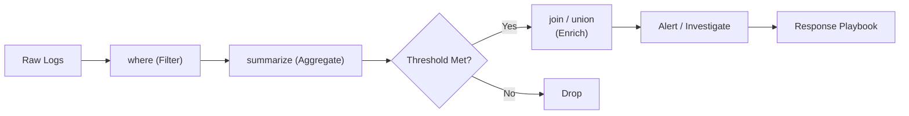
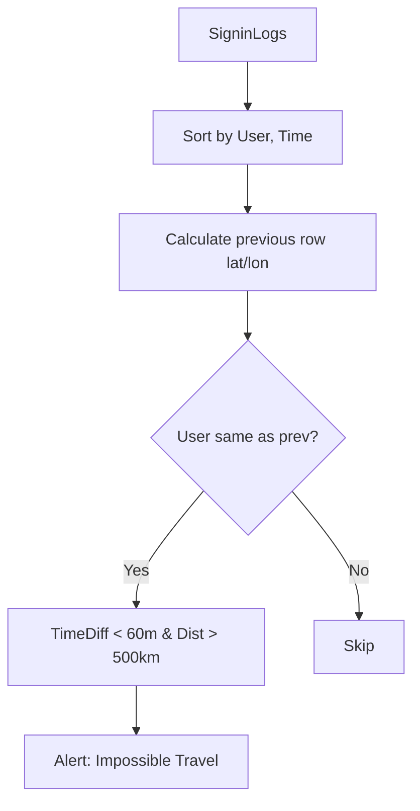
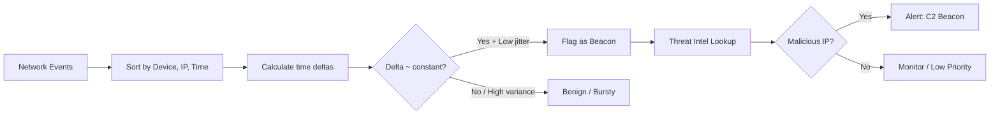

# 🕵️ Full-Stack Lesson: Seven SIEM Use Case Queries in KQL

## 📊 Executive Summary

Microsoft Sentinel (Azure Monitor Logs) uses the **Kusto Query Language (KQL)** to hunt, detect, and investigate threats. Writing effective SIEM queries means mastering `where` (filtering), `summarize` (aggregation), `join` (combining tables), and `union` (stacking tables). This lesson walks through **seven real-world detection use cases** with full, production-grade KQL queries, explaining the scenario, the detection logic, and false-positive pitfalls.



## 🏗️ Phase 1: KQL Foundations for SIEM

### Core Operators

| Operator | Purpose | Example |
|----------|---------|---------|
| `where` | Filter rows | `where EventID == 4625` |
| `summarize` | Aggregate groups | `summarize Count = count() by Account` |
| `join` | Combine tables (inner/left/outer) | `SigninLogs | join kind=inner SecurityEvent on Account` |
| `union` | Stack multiple tables | `union SigninLogs, OfficeActivity` |
| `extend` | Add computed columns | `extend Hour = datetime_format(TimeGenerated, "HH")` |
| `project` | Keep specific columns | `project TimeGenerated, Account, IPAddress` |
| `order by` | Sort results | `order by Count desc` |

> 💡 **Best Practice**: Always specify the time range in your query with `where TimeGenerated > ago(24h)` — this keeps queries fast and cost-efficient.

### Common Tables in Microsoft Sentinel

| Table Name | Source | Key Fields |
|------------|--------|------------|
| `SigninLogs` | Azure AD sign-ins | `UserPrincipalName`, `IPAddress`, `AppDisplayName`, `Status`, `AuthenticationRequirement` |
| `SecurityEvent` | Windows servers | `EventID`, `Account`, `Computer`, `Process`, `IpAddress` |
| `OfficeActivity` | M365 unified audit | `UserId`, `Operation`, `ClientIP`, `Item`, `Workload` |
| `CommonSecurityLog` | Syslog / CEF appliances | `SourceIP`, `DestinationIP`, `DeviceVendor`, `DeviceAction` |
| `DeviceNetworkEvents` | MDE network events | `RemoteIP`, `RemotePort`, `DeviceName`, `InitiatingProcessFileName` |

### KQL Query Best Practices Checklist

- [ ] Always filter by `TimeGenerated` first
- [ ] Use `project` to reduce columns early (faster joins)
- [ ] Use `take 100` while developing before running full queries
- [ ] Prefer `kind=leftanti` over `where not (subquery)` for anti-joins
- [ ] Use `let` statements for reusable parameters
- [ ] Add `//` comments for complex detection logic
- [ ] Test against known true positives before deploying

## ⚡ Phase 2: Use Case 1 — Brute-Force Detection

### Scenario

An attacker tries to guess passwords by repeatedly attempting to sign in to an Azure AD application or Windows server. The query counts failed authentication attempts (`EventID 4625` or `SigninLogs Status = "Failure"`) per account per time window and alerts when a threshold is exceeded.

### KQL Query (Azure AD Sign-In Logs)

```kusto
let Threshold = 10;
let TimeWindow = 5m;
SigninLogs
| where TimeGenerated > ago(1h)
| where Status.errorCode != 0
| summarize FailedAttempts = count() by UserPrincipalName, IPAddress, bin(TimeGenerated, TimeWindow)
| where FailedAttempts >= Threshold
| project TimeWindowStart = bin(TimeGenerated, TimeWindow), UserPrincipalName, IPAddress, FailedAttempts
| order by FailedAttempts desc
```

### What It Detects

- More than **10 failed logins** for the same user from the same IP in **5 minutes**
- Can be extended to track across different IPs if attacker rotates proxies

### Potential False Positives

| Scenario | Mitigation |
|----------|------------|
| Legacy app using wrong credentials | Whitelist service accounts by naming convention (`svc-*`) |
| User forgot password | Combine with `ResultType == 0` success after failure spike |
| VPN / NAT shared IP | Join with `RiskDetail` or `Location` fields |

> ⚠️ **Tuning Tip**: Raise the threshold for high-volume normal environments; lower it for privileged accounts (admins should never fail 3+ times).

### Windows Security Event Variant

```kusto
SecurityEvent
| where TimeGenerated > ago(1h)
| where EventID == 4625
| summarize FailedAttempts = count() by Account, IpAddress, bin(TimeGenerated, 5m)
| where FailedAttempts >= 10
| project TimeGenerated, Account, IpAddress, FailedAttempts
| order by FailedAttempts desc
```

## 🌍 Phase 3: Use Case 2 — Impossible Travel

### Scenario

A user authenticates from New York and then from London within 30 minutes — physically impossible. The query groups sign-ins by user, finds the earliest and latest sign-in in a short time window, calculates the geographic distance, and flags improbable movement.

### KQL Query

```kusto
SigninLogs
| where TimeGenerated > ago(1d)
| where Status.errorCode == 0
| where Location != ""
| project TimeGenerated, UserPrincipalName, IPAddress, City = Location.city, 
          State = Location.state, Country = Location.countryOrRegion,
          Latitude = Location.geoCoordinates.latitude, 
          Longitude = Location.geoCoordinates.longitude
| sort by UserPrincipalName asc, TimeGenerated asc
| extend PrevLat = prev(Latitude, 1), PrevLon = prev(Longitude, 1),
         PrevTime = prev(TimeGenerated, 1), PrevUser = prev(UserPrincipalName, 1)
| where UserPrincipalName == PrevUser
| extend TimeDiff = datetime_diff("second", TimeGenerated, PrevTime)
| extend Distance = geo_distance_in_meters(Longitude, Latitude, PrevLon, PrevLat)
| where TimeDiff between (60 .. 3600) and Distance > 500000
| project TimeGenerated, UserPrincipalName, IPAddress, 
          [From] = strcat(PrevLat, ",", PrevLon),
          [To] = strcat(Latitude, ",", Longitude),
          DistanceKm = round(Distance / 1000, 1), TimeDiffMin = TimeDiff / 60
| order by DistanceKm desc
```

### What It Detects

- Sign-ins from cities **> 500 km apart** within **1–60 minutes**
- Requires consistent GPS / location data (Azure AD Premium P1/P2)

### Potential False Positives

| Scenario | Mitigation |
|----------|------------|
| VPN gateway in different city | Check `IPAddress` against known VPN ranges |
| Mobile carrier NAT egress | Add exception for known cellular IP pools |
| Satellite ISP | Rare — cross-reference with `DeviceInfo` or `IsCompliant` |

> 💡 **Refinement**: Add `where RiskDetail !~ "none"` to focus on sign-ins Azure AD already considers risky.



## 📤 Phase 4: Use Case 3 — Data Exfiltration

### Scenario

An insider or compromised account transfers large volumes of data out of the organization — via email attachments, SharePoint downloads, Azure Storage egress, or network file transfers. The query monitors outbound traffic spikes and unusual file access patterns.

### KQL Query (OfficeActivity — SharePoint Download Spike)

```kusto
OfficeActivity
| where TimeGenerated > ago(1d)
| where Operation == "FileDownloaded"
| extend FileSizeMB = ItemSize / (1024 * 1024)
| summarize TotalDownloadedMB = sum(FileSizeMB), 
            FileCount = count() by UserId, ClientIP, bin(TimeGenerated, 1h)
| where TotalDownloadedMB > 500 or FileCount > 100
| project TimeGenerated, UserId, ClientIP, TotalDownloadedMB, FileCount
| order by TotalDownloadedMB desc
```

### KQL Query (Network — Large Outbound Data Transfer)

```kusto
DeviceNetworkEvents
| where TimeGenerated > ago(6h)
| where RemotePort in (80, 443)
| summarize TotalBytes = sum(TotalBytesSent + TotalBytesReceived) 
            by DeviceName, RemoteIP, bin(TimeGenerated, 15m)
| where TotalBytes > 100000000  // > 100 MB in 15 min
| project TimeGenerated, DeviceName, RemoteIP, TotalBytesMB = round(TotalBytes / 1e6, 1)
| order by TotalBytesMB desc
```

### What It Detects

- Single user downloading > 500 MB of SharePoint files in an hour
- Any device sending > 100 MB outbound in 15 minutes
- Unusual file types (`.zip`, `.7z`, `.sql`, `.pst`) sent as email attachments

### Potential False Positives

| Scenario | Mitigation |
|----------|------------|
| Legitimate backup tool | Exclude known backup server IPs or process names |
| DevOps build pipeline | Add application exception list |
| Large email attachment to known partner | Check recipient domain against approved partners |

## 👑 Phase 5: Use Case 4 — Privilege Escalation

### Scenario

A standard user account is added to a privileged group (e.g., Domain Admins, Global Admin) or assigned an elevated Azure AD role. This query monitors `SecurityEvent` (Windows) and `AuditLogs` (Azure AD) for group membership changes and role assignments.

### KQL Query (Windows — User Added to Admin Group)

```kusto
SecurityEvent
| where TimeGenerated > ago(7d)
| where EventID == 4732  // A member was added to a security-enabled local group
| where TargetAccount has_any ("Administrators", "Domain Admins", "Enterprise Admins", 
                                "Schema Admins", "Backup Operators")
| project TimeGenerated, Computer, SubjectAccount, TargetAccount, 
          MemberName = tostring(parse_json(EventData).MemberName),
          EventID
| extend NewAdmin = extract(@"CN=(.+?),", 1, MemberName)
| project-away MemberName
| order by TimeGenerated desc
```

### KQL Query (Azure AD — Privileged Role Assignment)

```kusto
AuditLogs
| where TimeGenerated > ago(7d)
| where OperationName == "Add member to role"
| where Result == "success"
| extend RoleName = tostring(parse_json(TargetResources)[0].displayName)
| extend TargetUser = tostring(parse_json(TargetResources)[0].userPrincipalName)
| where RoleName has_any ("Global Administrator", "Exchange Administrator", 
                          "SharePoint Administrator", "Application Administrator")
| project TimeGenerated, InitiatedBy = InitiatedBy.user.userPrincipalName, 
          TargetUser, RoleName, IPAddress = InitiatedBy.ipAddress
| order by TimeGenerated desc
```

### What It Detects

- **Windows**: EventID 4732 — adding members to built-in admin groups
- **Azure AD**: AuditLogs `OperationName == "Add member to role"` for privileged roles
- **Cross-platform**: Detects both on-prem and cloud privilege escalation

### Potential False Positives

| Scenario | Mitigation |
|----------|------------|
| IT helpdesk performing legitimate admin delegation | Correlate with IT ticketing system (e.g., Jira ticket ref in notes) |
| Automated onboarding tool | Create exception for known automation accounts |
| Emergency break-glass account | Set up a separate low-severity rule with high threshold |

> ⚠️ **Critical**: Privileged role changes should **always** trigger an alert — there is almost no legitimate reason to add a user to Global Admin daily.

### Privilege Escalation EventIDs (Windows Security Log)

| EventID | Description |
|---------|-------------|
| 4728 | Member added to security-enabled global group |
| 4732 | Member added to security-enabled local group |
| 4756 | Member added to security-enabled universal group |
| 4737 | Security-enabled group modified |
| 4761 | Member removed from security-enabled universal group |
| 4670 | Permissions on an object changed |

## 🚶 Phase 6: Use Case 5 — Lateral Movement

### Scenario

An attacker who compromised a non-admin workstation uses **RDP** (EventID 4624 LogonType 10) or **PsExec** (EventID 4624 LogonType 3 with PsExec service) to move laterally to other machines. The query detects remote logons originating from workstations that should not be initiating remote admin access.

### KQL Query (RDP from Non-Admin Workstation)

```kusto
let AdminWorkstations = datatable(Computer:string) [
    "IT-ADMIN-01", "IT-ADMIN-02", "SOC-WS-01"
];
SecurityEvent
| where TimeGenerated > ago(1d)
| where EventID == 4624
| where LogonType == 10  // RemoteInteractive (RDP)
| where IpAddress != "::1" and IpAddress != "127.0.0.1"
| extend SourceComputer = tostring(split(IpAddress, ".")[0])  // Approximate reverse lookup
| where SourceComputer !in (AdminWorkstations)
| project TimeGenerated, Account, Computer, SourceIP = IpAddress, 
          LogonType, ProcessName
| order by TimeGenerated desc
```

### KQL Query (PsExec / Service Creation)

```kusto
let SuspiciousServices = dynamic(["PSEXESVC", "PAExec", "PAExecSvc"]);
SecurityEvent
| where TimeGenerated > ago(1d)
| where EventID in (4697, 7045)  // Service install event
| where ServiceName has_any (SuspiciousServices) or 
        ImagePath has_any ("PSEXESVC", "psexec")
| project TimeGenerated, Computer, Account, ServiceName, ImagePath, EventID
| order by TimeGenerated desc
```

### What It Detects

- **RDP logins** (LogonType 10) from machines that are not authorized admin workstations
- **PsExec service** creation events (PSEXESVC) — a common lateral movement tool
- Can be extended to detect `schtasks` remote creation, WinRM, and WMI

### Potential False Positives

| Scenario | Mitigation |
|----------|------------|
| Legitimate remote support from helpdesk | Join against IT ticketing events |
| Administrator using personal workstation | Enforce dedicated admin workstations (PAW model) |
| Monitoring tools (e.g., RMM software) | Whitelist known monitoring IPs and process names |

> 💡 **Pro Tip**: Combine with `DeviceLogonEvents` (MDE) for process-level visibility — `| where LogonType == "RemoteInteractive" and InitiatingProcessFileName != "explorer.exe"` catches automated lateral movement.

## 📡 Phase 7: Use Case 6 — C2 Beaconing

### Scenario

Malware on an endpoint communicates with a command-and-control (C2) server at regular, periodic intervals. The query detects beaconing by analyzing the **time delta between outbound connections** to a given remote IP — legitimate traffic is typically bursty; C2 is often clockwork.

### KQL Query (DNS Beaconing Detection)

```kusto
let MinBeaconInterval = 5s;
let MaxBeaconInterval = 30m;
let BeaconJitter = 0.2;  // 20% jitter tolerance
let MinConnections = 10;
DeviceNetworkEvents
| where TimeGenerated > ago(1d)
| where RemotePort in (80, 443, 8080, 8443)
| order by DeviceName asc, RemoteIP asc, TimeGenerated asc
| extend PrevTime = prev(TimeGenerated, 1), 
         PrevDevice = prev(DeviceName, 1),
         PrevIP = prev(RemoteIP, 1)
| where DeviceName == PrevDevice and RemoteIP == PrevIP
| extend TimeDelta = datetime_diff("millisecond", TimeGenerated, PrevTime)
| where TimeDelta between (MinBeaconInterval .. MaxBeaconInterval)
| summarize BeaconCount = count(), AvgInterval = avg(TimeDelta) / 1000, 
            StdDevInterval = stdev(TimeDelta) / 1000,
            Devices = make_set(DeviceName)
            by RemoteIP, RemotePort
| where BeaconCount >= MinConnections
| extend JitterPct = StdDevInterval / AvgInterval
| where JitterPct < BeaconJitter  // Low variance = beaconing
| project RemoteIP, RemotePort, BeaconCount, AvgIntervalSec = round(AvgInterval, 1),
          JitterPct = round(JitterPct * 100, 1), Devices
| order by BeaconCount desc
```

### KQL Query (DNS Query Pattern — Domain Generation Algorithm)

```kusto
let SuspiciousTLDs = dynamic([".xyz", ".top", ".club", ".shop", ".gq", ".ml", ".tk"]);
DeviceEvents
| where TimeGenerated > ago(1d)
| where ActionType == "DnsQueryResponse"
| extend Domain = tostring(parse_json(AdditionalFields).QueryName)
| where Domain has_any (SuspiciousTLDs)
| extend DomainLength = strlen(Domain)
| where DomainLength > 20 or Domain matches regex @"^[a-z]{10,}\."
| summarize QueryCount = count() by DeviceName, Domain, bin(TimeGenerated, 20m)
| where QueryCount >= 5
| project TimeGenerated, DeviceName, Domain, QueryCount
| order by QueryCount desc
```

### What It Detects

- Outbound connections to a remote IP with **low time variance** (beaconing pattern)
- DNS queries to **suspicious TLDs** with long, random-looking subdomains
- Periodicity analysis reveals stealthy C2 even when the IP is not on a blocklist

### Potential False Positives

| Scenario | Mitigation |
|----------|------------|
| NTP time sync (periodic UDP) | Filter out `RemotePort 123` or known NTP servers |
| Software update checks | Compare with known update domains (Microsoft, Adobe, etc.) |
| Heartbeat/keepalive (legit SaaS) | Build an approved beaconing allowlist |

> ⚠️ **Warning**: C2 operators add random jitter (0–30%) to evade fixed-interval detection. The query above uses `JitterPct < 0.2` — tune this based on your environment.



## 🕵️ Phase 8: Use Case 7 — Insider Threat

### Scenario

A trusted employee accesses sensitive data outside business hours, or rapidly mass-accesses files before departure. The query identifies anomalous activity patterns — off-hours logins, mass file downloads, and abnormal SharePoint access.

### KQL Query (Off-Hours Access)

```kusto
let BusinessHours = dynamic(["09:00:00", "17:00:00"]);
let BusinessDays = dynamic(["Monday", "Tuesday", "Wednesday", "Thursday", "Friday"]);
SigninLogs
| where TimeGenerated > ago(14d)
| where Status.errorCode == 0
| extend Hour = datetime_format(TimeGenerated, "HH:mm:ss")
| extend DayOfWeek = datetime_format(TimeGenerated, "dddd")
| where DayOfWeek !in (BusinessDays) or Hour !between (BusinessHours[0] .. BusinessHours[1])
| summarize OffHoursSignIns = count() by UserPrincipalName, DayOfWeek
| where OffHoursSignIns > 5
| project UserPrincipalName, DayOfWeek, OffHoursSignIns
| order by OffHoursSignIns desc
```

### KQL Query (Mass File Access — SharePoint / OneDrive)

```kusto
OfficeActivity
| where TimeGenerated > ago(7d)
| where Operation in ("FileDownloaded", "FileAccessed", "FileViewed")
| summarize AccessCount = count(), UniqueFiles = dcount(ItemName)
            by UserId, bin(TimeGenerated, 1h)
| where AccessCount > 200
| extend AccessRate = AccessCount / 60  // Per minute
| project TimeGenerated, UserId, AccessCount, UniqueFiles, AccessRate
| order by AccessCount desc
```

### KQL Query (Data Staging — Files Copied to Removable Media)

```kusto
SecurityEvent
| where TimeGenerated > ago(30d)
| where EventID == 4663  // An attempt was made to access an object
| where ObjectName has_any (".zip", ".7z", ".rar", ".tar", ".sql", ".dmp")
| summarize FileCount = count(), UniquePaths = dcount(ObjectName)
            by Account, Computer, bin(TimeGenerated, 1h)
| where FileCount > 50
| extend SuspiciousStaging = iff(UniquePaths > 10, "High", "Medium")
| project TimeGenerated, Account, Computer, FileCount, UniquePaths, SuspiciousStaging
| order by FileCount desc
```

### What It Detects

- **Off-hours sign-ins**: Successful logins outside Mon–Fri 9am–5pm, repeated across 14 days
- **Mass file access**: > 200 file downloads/accesses in a single hour
- **Data staging**: Archives (`.zip`, `.7z`) created in bulk — often precedes exfiltration

### Potential False Positives

| Scenario | Mitigation |
|----------|------------|
| Night shift / on-call worker | Compare against HR on-call schedule |
| Automated backup job | Filter by process name or service account |
| System migration / project | Cross-reference with IT change management tickets |

> 💡 **Insight**: The **highest insider threat signal** is the combination of off-hours access + mass file download + unusual destination (personal cloud, USB). Correlate across `SigninLogs`, `OfficeActivity`, and `SecurityEvent` using a `join`.

### Insider Threat Risk Indicators Matrix

| Indicator | Weight | Log Source | Time Window |
|-----------|--------|------------|-------------|
| Off-hours access (3+ events) | Medium | `SigninLogs` | 7 days |
| Mass file download (> 200 files/hr) | High | `OfficeActivity` | 1 hour |
| USB device mount | Medium | `SecurityEvent` EventID 6416 | 24 hours |
| Email to personal domain | Medium | `OfficeActivity` | 7 days |
| Data archiving (> 50 compressed files) | High | `SecurityEvent` EventID 4663 | 1 hour |
| Resignation notice in HR system | Critical | HR Database (external) | 30 days |

## 📐 Phase 9: Bringing It All Together — Composite Detection

### Chaining Multiple Signals

The most powerful detections use **multiple data sources** combined with `union` and `join`. This composite query collects signals from all seven use cases into a single risk score:

```kusto
// Collect brute-force signals
let BruteForce = SigninLogs
    | where TimeGenerated > ago(1h)
    | where Status.errorCode != 0
    | summarize FailedLogins = count() by UserPrincipalName
    | where FailedLogins > 5;
// Collect impossible travel signals
let ImpossibleTravel = SigninLogos
    | where TimeGenerated > ago(1h)
    // ... impossible travel logic (abbreviated) ...
    | project UserPrincipalName, TravelScore = 10;
// Collect off-hours signals
let OffHours = SigninLogs
    | where TimeGenerated > ago(1h)
    // ... off-hours logic (abbreviated) ...
    | project UserPrincipalName, OffHoursScore = 5;
// Combine all signals
BruteForce
| union ImpossibleTravel, OffHours
| summarize RiskScore = sum(FailedLogins, TravelScore, OffHoursScore) 
    by UserPrincipalName
| where RiskScore >= 15
| order by RiskScore desc
```

> ⚠️ **Note**: The above is a conceptual example. In production, use `let` statements with standalone queries and `join` or `union` to aggregate scores.

## 🧠 Phase 10: Optimization & Operationalization

### Query Performance Tips

| Technique | Impact |
|-----------|--------|
| Filter `TimeGenerated` first | Reduces scanned data by 90%+ |
| Use `project` before `summarize` or `join` | Smaller memory footprint |
| Use `summarize` with `hint.shufflekey=<key>` for high-cardinality | Faster aggregation on large datasets |
| Avoid `extend` with complex string parsing in hot path | Reduce CPU overhead |
| Use `materialize()` for reused subqueries | Cache results, avoid re-scan |

### Alert Rules in Sentinel

```kusto
// Example: Scheduled alert rule query template
let Lookback = 1h;
let Threshold = 10;
SigninLogs
| where TimeGenerated > ago(Lookback)
| where Status.errorCode == 50126  // Invalid username/password
| summarize FailureCount = count() by UserPrincipalName, IPAddress
| where FailureCount >= Threshold
| extend Severity = "Medium", CustomEntity = UserPrincipalName
| project-rename AccountUPN = UserPrincipalName
```

### Deployment Checklist for SIEM Rules

- [ ] Test each query against historical data (true positive rate)
- [ ] Run in a sandbox Sentinel workspace before production
- [ ] Set severity based on impact (not volume)
- [ ] Configure incident grouping (group related alerts)
- [ ] Add suppression window for known benign noise
- [ ] Map to MITRE ATT&CK technique(s)
- [ ] Create automation playbook (e.g., Teams/SOAR notification)
- [ ] Monitor false positive rate weekly; tune threshold

## 🎯 Conclusion

Mastering these seven SIEM use case queries gives you a reusable detection library for the most common attack patterns:

1. **Brute-force** — `where` + `summarize` with threshold
2. **Impossible travel** — `extend` time/geo calculations
3. **Data exfiltration** — `summarize` volume by user/service
4. **Privilege escalation** — `join` between SecurityEvent and AuditLogs
5. **Lateral movement** — `where` LogonType + service creation
6. **C2 beaconing** — `prev()` time delta variance analysis
7. **Insider threat** — Multi-vector signal aggregation

Each query balances **detection efficacy** against **false positive noise** — and every environment requires tuning. Start with the queries above, adjust thresholds based on your baseline, and iterate.

> 💡 **Remember**: A SIEM query is only as good as the data feeding it. Ensure required logs (Azure AD P1/P2, Windows Security Auditing, MDE, M365 Audit) are connected to Sentinel before deploying these rules.
