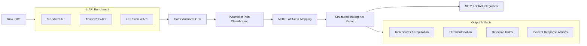
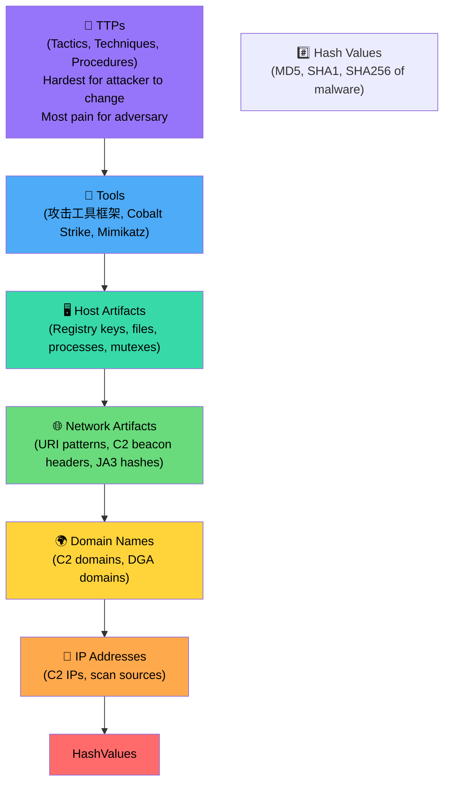
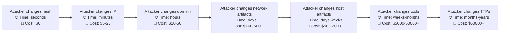
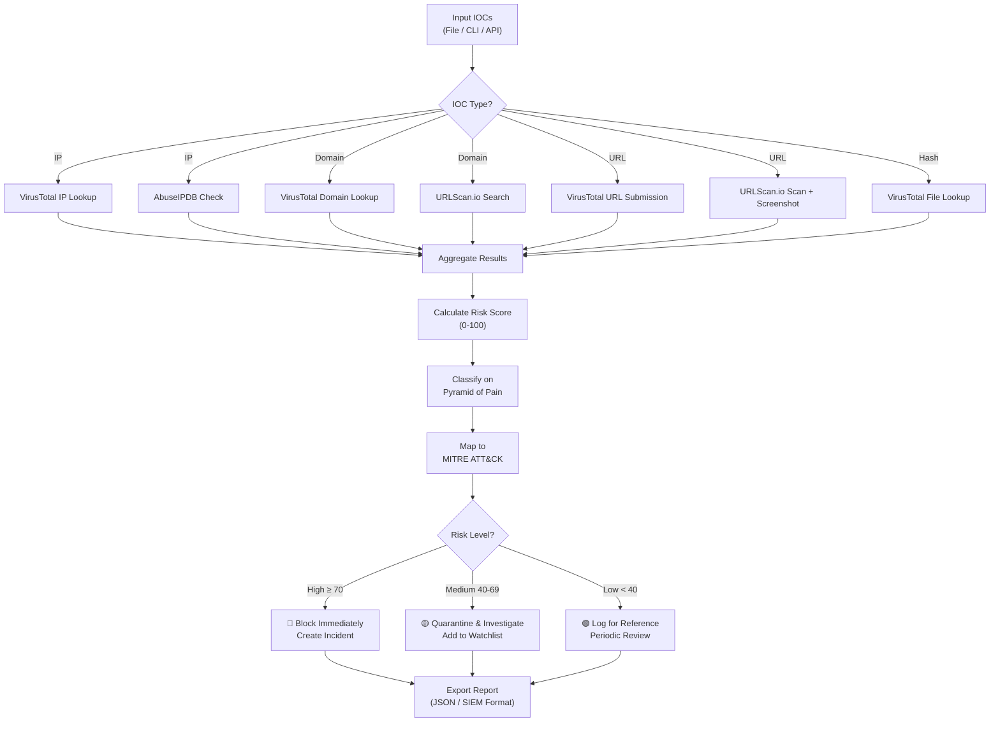

## 🕵️ Full-Stack Lesson: Threat Intelligence Enrichment — From IOCs to ATT&CK Mapping

## 📊 Executive Summary

Threat Intelligence Enrichment is the process of taking raw indicators of compromise (IOCs)—such as IP addresses, domains, URLs, file hashes, and email addresses—and augmenting them with contextual, behavioral, and reputational data from external threat intelligence platforms. This lesson provides a full-stack methodology covering API-based enrichment through VirusTotal, AbuseIPDB, and URLScan.io, the conceptual framework of the Pyramid of Pain, mapping observed behaviors to MITRE ATT&CK techniques, and finally automating the entire pipeline into a structured report suitable for SIEM/SOAR ingestion. You will learn to transform raw IOCs into actionable intelligence that drives detection, response, and threat hunting.



## 🏗️ Phase 1: Enriching IOCs Through APIs

### 1.1 VirusTotal API

VirusTotal aggregates detection results from over 70 antivirus engines and URL/domain scanners. It accepts IP addresses, domain names, URLs, and file hashes (MD5, SHA1, SHA256).

#### Python Class — VirusTotal Enricher

```python
import requests
import base64
import time
import json
from typing import Dict, Optional, List, Any

class VirusTotalEnricher:
    def __init__(self, api_key: str):
        self.api_key = api_key
        self.base_url = "https://www.virustotal.com/api/v3"
        self.headers = {"x-apikey": self.api_key, "Accept": "application/json"}

    def enrich_ip(self, ip: str) -> Dict[str, Any]:
        """Get IP address report from VirusTotal."""
        url = f"{self.base_url}/ip_addresses/{ip}"
        resp = requests.get(url, headers=self.headers)
        resp.raise_for_status()
        return self._parse_ip_report(resp.json())

    def enrich_domain(self, domain: str) -> Dict[str, Any]:
        """Get domain report from VirusTotal."""
        url = f"{self.base_url}/domains/{domain}"
        resp = requests.get(url, headers=self.headers)
        resp.raise_for_status()
        return self._parse_domain_report(resp.json())

    def enrich_hash(self, file_hash: str) -> Dict[str, Any]:
        """Get file hash (SHA256, MD5, SHA1) report from VirusTotal."""
        url = f"{self.base_url}/files/{file_hash}"
        resp = requests.get(url, headers=self.headers)
        if resp.status_code == 404:
            return {"found": False, "hash": file_hash, "message": "Hash not found in VirusTotal"}
        resp.raise_for_status()
        return self._parse_file_report(resp.json())

    def enrich_url(self, url: str) -> Dict[str, Any]:
        """Submit URL and retrieve analysis from VirusTotal."""
        # Submit URL for analysis
        submit_url = f"{self.base_url}/urls"
        submit_resp = requests.post(submit_url, headers=self.headers, data={"url": url})
        submit_resp.raise_for_status()
        
        # Get analysis results (VT v3 uses base64-encoded URL ID without padding)
        url_id = base64.urlsafe_b64encode(url.encode()).decode().strip("=")
        result_url = f"{self.base_url}/urls/{url_id}"
        result_resp = requests.get(result_url, headers=self.headers)
        result_resp.raise_for_status()
        return self._parse_url_report(result_resp.json())

    def _parse_ip_report(self, data: Dict) -> Dict[str, Any]:
        attrs = data.get("data", {}).get("attributes", {})
        stats = attrs.get("last_analysis_stats", {})
        return {
            "type": "ip",
            "value": data.get("data", {}).get("id"),
            "malicious": stats.get("malicious", 0),
            "suspicious": stats.get("suspicious", 0),
            "harmless": stats.get("harmless", 0),
            "undetected": stats.get("undetected", 0),
            "reputation": attrs.get("reputation", 0),
            "country": attrs.get("country", ""),
            "asn": attrs.get("asn", ""),
            "as_owner": attrs.get("as_owner", ""),
            "last_analysis_date": attrs.get("last_analysis_date"),
            "tags": attrs.get("tags", []),
            "categories": attrs.get("categories", {}),
            "found": True
        }

    def _parse_domain_report(self, data: Dict) -> Dict[str, Any]:
        attrs = data.get("data", {}).get("attributes", {})
        stats = attrs.get("last_analysis_stats", {})
        return {
            "type": "domain",
            "value": data.get("data", {}).get("id"),
            "malicious": stats.get("malicious", 0),
            "suspicious": stats.get("suspicious", 0),
            "harmless": stats.get("harmless", 0),
            "undetected": stats.get("undetected", 0),
            "reputation": attrs.get("reputation", 0),
            "registrar": attrs.get("registrar", ""),
            "creation_date": attrs.get("creation_date"),
            "last_dns_records": attrs.get("last_dns_records", []),
            "tags": attrs.get("tags", []),
            "found": True
        }

    def _parse_file_report(self, data: Dict) -> Dict[str, Any]:
        attrs = data.get("data", {}).get("attributes", {})
        stats = attrs.get("last_analysis_stats", {})
        return {
            "type": "file",
            "value": data.get("data", {}).get("id"),
            "malicious": stats.get("malicious", 0),
            "suspicious": stats.get("suspicious", 0),
            "harmless": stats.get("harmless", 0),
            "undetected": stats.get("undetected", 0),
            "type_description": attrs.get("type_description", ""),
            "names": attrs.get("names", []),
            "size": attrs.get("size", 0),
            "tlsh": attrs.get("tlsh", ""),
            "first_submission_date": attrs.get("first_submission_date"),
            "last_submission_date": attrs.get("last_submission_date"),
            "tags": attrs.get("tags", []),
            "found": True
        }

    def _parse_url_report(self, data: Dict) -> Dict[str, Any]:
        attrs = data.get("data", {}).get("attributes", {})
        stats = attrs.get("last_analysis_stats", {})
        return {
            "type": "url",
            "value": attrs.get("url", ""),
            "malicious": stats.get("malicious", 0),
            "suspicious": stats.get("suspicious", 0),
            "harmless": stats.get("harmless", 0),
            "undetected": stats.get("undetected", 0),
            "url_id": data.get("data", {}).get("id"),
            "categories": attrs.get("categories", {}),
            "last_final_url": attrs.get("last_final_url", ""),
            "found": True
        }

    def enrich(self, observable: str, obs_type: Optional[str] = None) -> Dict[str, Any]:
        """Auto-detect observable type and enrich."""
        if obs_type:
            handler = {
                "ip": self.enrich_ip,
                "domain": self.enrich_domain,
                "hash": self.enrich_hash,
                "url": self.enrich_url
            }.get(obs_type)
            if handler:
                return handler(observable)
        
        # Auto-detect
        import re
        ip_pattern = r"^\d{1,3}\.\d{1,3}\.\d{1,3}\.\d{1,3}$"
        if re.match(ip_pattern, observable):
            return self.enrich_ip(observable)
        if observable.startswith(("http://", "https://")):
            return self.enrich_url(observable)
        if len(observable) in (32, 40, 64) and all(c in "0123456789abcdef" for c in observable.lower()):
            return self.enrich_hash(observable)
        return self.enrich_domain(observable)
```

#### Bash curl Alternatives — VirusTotal

```bash
#!/bin/bash
# VirusTotal IP Lookup
API_KEY="YOUR_VT_API_KEY"

# IP Address Lookup
curl -s -H "x-apikey: $API_KEY" "https://www.virustotal.com/api/v3/ip_addresses/8.8.8.8" | jq .

# Domain Lookup
curl -s -H "x-apikey: $API_KEY" "https://www.virustotal.com/api/v3/domains/example.com" | jq .

# File Hash Lookup (SHA256)
curl -s -H "x-apikey: $API_KEY" "https://www.virustotal.com/api/v3/files/d41d8cd98f00b204e9800998ecf8427e" | jq .

# URL Submission
curl -s -X POST -H "x-apikey: $API_KEY" -d "url=https://malicious-site.com" \
  "https://www.virustotal.com/api/v3/urls" | jq .
```

#### Interpreting VirusTotal Results

| Field | What It Tells You | Analyst Action |
|-------|-------------------|----------------|
| `last_analysis_stats.malicious` | Number of engines flagging as malicious | ≥ 3 engines = high confidence malicious |
| `reputation` | Community reputation score (-100 to 100) | Negative score = historically reported |
| `as_owner` | Organization that owns the IP/ASN | Identifies hosting provider or ISP |
| `tags` | Labels applied by VT (e.g. "phishing") | Quick triage category |
| `last_dns_records` | Historical DNS resolutions | Shows infrastructure churn |
| `first_submission_date` | When the IOC was first seen | New = potentially more dangerous |
| `type_description` | File type (e.g. "PE32 executable") | Validates file type expectation |

> 💡 **Analyst Tip**: A single engine detection is often a false positive. Cross-reference with other services. If 5+ major engines (Microsoft, CrowdStrike, Sophos, McAfee, Kaspersky) agree, it is almost certainly malicious.

### 1.2 AbuseIPDB API

AbuseIPDB specializes in IP address reputation with an abuse confidence score (0-100). It is particularly effective for identifying scanning, brute force, and spam-sending IPs.

#### Python Class — AbuseIPDB Enricher

```python
class AbuseIPDBEnricher:
    def __init__(self, api_key: str):
        self.api_key = api_key
        self.base_url = "https://api.abuseipdb.com/api/v2"
        self.headers = {
            "Key": self.api_key,
            "Accept": "application/json"
        }

    def check_ip(self, ip: str, max_age_in_days: int = 30, verbose: bool = True) -> Dict[str, Any]:
        """Check IP reputation on AbuseIPDB.
        
        Args:
            ip: IPv4 or IPv6 address
            max_age_in_days: Maximum age of reports to consider (default 30)
            verbose: Include detailed category information
        """
        params = {
            "ipAddress": ip,
            "maxAgeInDays": max_age_in_days,
            "verbose": str(verbose).lower()
        }
        url = f"{self.base_url}/check"
        resp = requests.get(url, headers=self.headers, params=params)
        resp.raise_for_status()
        return self._parse_response(resp.json())

    def blacklist(self, confidence_minimum: int = 90, limit: int = 100) -> List[Dict]:
        """Retrieve the AbuseIPDB blacklist at or above a confidence level."""
        params = {
            "confidenceMinimum": confidence_minimum,
            "limit": limit
        }
        url = f"{self.base_url}/blacklist"
        resp = requests.get(url, headers=self.headers, params=params)
        resp.raise_for_status()
        data = resp.json()
        return data.get("data", [])

    def report_ip(self, ip: str, categories: List[int], comment: str = "") -> Dict:
        """Report an IP address to AbuseIPDB.
        
        Common categories:
            1: DNS Compromise, 2: DNS Poisoning, 3: Fraud Orders,
            4: DDoS Attack, 5: FTP Brute-Force, 6: Ping of Death,
            7: Phishing, 8: Fraud VoIP, 9: Open Proxy, 10: Web Spam,
            11: Email Spam, 12: Blog Spam, 13: VPN IP, 14: Port Scan,
            15: Hacking, 16: SQL Injection, 17: Spoofing, 18: Brute-Force,
            19: Bad Web Bot, 20: Exploited Host, 21: Web App Attack,
            22: SSH, 23: IoT Targeted
        """
        payload = {
            "ip": ip,
            "categories": ",".join(str(c) for c in categories),
            "comment": comment
        }
        url = f"{self.base_url}/report"
        resp = requests.post(url, headers=self.headers, data=payload)
        resp.raise_for_status()
        return resp.json()

    def _parse_response(self, data: Dict) -> Dict[str, Any]:
        attrs = data.get("data", {})
        return {
            "ip": attrs.get("ipAddress"),
            "is_public": attrs.get("isPublic"),
            "ip_version": attrs.get("ipVersion"),
            "is_whitelisted": attrs.get("isWhitelisted"),
            "abuse_confidence_score": attrs.get("abuseConfidenceScore"),
            "country_code": attrs.get("countryCode"),
            "country_name": attrs.get("countryName"),
            "isp": attrs.get("isp"),
            "domain": attrs.get("domain"),
            "hostnames": attrs.get("hostnames", []),
            "total_reports": attrs.get("totalReports"),
            "num_distinct_users": attrs.get("numDistinctUsers"),
            "last_reported_at": attrs.get("lastReportedAt"),
            "reports": attrs.get("reports", []),
            "categories": self._extract_categories(attrs.get("reports", [])),
            "found": True
        }

    def _extract_categories(self, reports: List[Dict]) -> Dict[str, int]:
        cats = {}
        for report in reports:
            for cat_id, cat_name in report.get("categories", {}).items():
                cats[cat_name] = cats.get(cat_name, 0) + 1
        return cats
```

#### Bash curl — AbuseIPDB

```bash
#!/bin/bash
API_KEY="YOUR_ABUSEIPDB_KEY"

# Check IP reputation
curl -s -G -H "Key: $API_KEY" -H "Accept: application/json" \
  --data-urlencode "ipAddress=8.8.8.8" \
  --data-urlencode "maxAgeInDays=30" \
  "https://api.abuseipdb.com/api/v2/check" | jq .

# Get blacklist (confidence >= 90)
curl -s -G -H "Key: $API_KEY" -H "Accept: application/json" \
  --data-urlencode "confidenceMinimum=90" \
  --data-urlencode "limit=50" \
  "https://api.abuseipdb.com/api/v2/blacklist" | jq .
```

#### Interpreting AbuseIPDB Results

| Score Range | Confidence Level | Recommended Action |
|-------------|------------------|--------------------|
| 0 — 25 | Low | Likely clean; investigate further if other signals present |
| 26 — 50 | Medium | Suspicious; may be shared hosting or dynamic IP |
| 51 — 75 | High | Probably malicious; block or monitor closely |
| 76 — 100 | Critical | Almost certainly malicious; block immediately |

| Data Field | What It Reveals | Use Case |
|------------|-----------------|----------|
| `abuseConfidenceScore` | 0–100 score of maliciousness | Primary triage metric |
| `totalReports` | How many users reported this IP | High + recent = active threat |
| `numDistinctUsers` | Unique reporters (prevents gaming) | > 3 distinct users = credible |
| `lastReportedAt` | Timestamp of most recent report | Recently active = urgent |
| `hostnames` | Reverse DNS / hostname bindings | Identifies hosting infrastructure |
| `reports[].categories` | Type of abuse reported (brute force, scan, etc.) | Maps to attack pattern |

> ⚠️ **Important**: AbuseIPDB is community-driven. An IP with few reports from few distinct users may be a false positive. Always cross-reference with other sources.

### 1.3 URLScan.io API

URLScan.io provides browser-based URL detonation with screenshots, DOM inspection, network request capture, and behavioral verdicts. It is essential for analyzing phishing URLs that evade signature-based detection.

#### Python Class — URLScan.io Enricher

```python
import time
from typing import Dict, Optional, Any, List

class URLScanEnricher:
    def __init__(self, api_key: str):
        self.api_key = api_key
        self.base_url = "https://urlscan.io/api/v1"
        self.headers = {
            "API-Key": self.api_key,
            "Content-Type": "application/json"
        }

    def scan_url(self, url: str, visibility: str = "public", 
                 tags: Optional[List[str]] = None) -> Dict[str, Any]:
        """Submit URL for scanning on URLScan.io.
        
        Args:
            url: The URL to scan
            visibility: "public", "unlisted", or "private"
            tags: Optional list of tags for categorization
        """
        payload = {"url": url, "visibility": visibility}
        if tags:
            payload["tags"] = tags
        
        resp = requests.post(f"{self.base_url}/scan/", headers=self.headers, json=payload)
        resp.raise_for_status()
        result = resp.json()
        
        # Poll for results
        uuid = result.get("uuid")
        if not uuid:
            return {"error": "No UUID returned from scan submission"}
        
        return self._poll_result(uuid)

    def _poll_result(self, uuid: str, max_retries: int = 15, 
                     poll_interval: int = 5) -> Dict[str, Any]:
        """Poll URLScan.io for completed scan results."""
        result_url = f"{self.base_url}/result/{uuid}/"
        
        for attempt in range(max_retries):
            resp = requests.get(result_url)
            if resp.status_code == 200:
                data = resp.json()
                return self._parse_scan_result(data, uuid)
            elif resp.status_code == 404:
                time.sleep(poll_interval)
            else:
                resp.raise_for_status()
        
        return {"error": f"Result not ready after {max_retries * poll_interval}s", "uuid": uuid}

    def search_previous(self, query: str, size: int = 10) -> List[Dict]:
        """Search previously scanned URLs.
        
        Query syntax: https://urlscan.io/docs/search/
        Example: "domain:example.com AND page.status:200"
        """
        params = {"q": query, "size": size}
        resp = requests.get(f"{self.base_url}/search/", headers=self.headers, params=params)
        resp.raise_for_status()
        return resp.json().get("results", [])

    def _parse_scan_result(self, data: Dict, uuid: str) -> Dict[str, Any]:
        page = data.get("page", {})
        verdicts = data.get("verdicts", {})
        overall = verdicts.get("overall", {})
        lists = data.get("lists", {})
        meta = data.get("meta", {})
        
        return {
            "uuid": uuid,
            "scan_url": f"https://urlscan.io/result/{uuid}/",
            "screenshot_url": f"https://urlscan.io/screenshots/{uuid}.png",
            "domain": page.get("domain"),
            "ip": page.get("ip"),
            "asn": page.get("asn"),
            "asn_name": page.get("asnname"),
            "country": page.get("country"),
            "server": page.get("server"),
            "status": page.get("status"),
            "title": page.get("title"),
            
            "verdict_malicious": overall.get("malicious", False),
            "verdict_score": overall.get("score", 0),
            "verdict_community": overall.get("community", None),
            
            "urls_found": lists.get("urls", []),
            "hashes_found": lists.get("hashes", []),
            "domains_found": lists.get("domains", []),
            "ips_found": lists.get("ips", []),
            "countries_found": lists.get("countries", []),
            
            "processors": meta.get("processors", {}),
            "date": data.get("task", {}).get("time"),
            "found": True
        }
```

#### Bash curl — URLScan.io

```bash
#!/bin/bash
API_KEY="YOUR_URLSCAN_KEY"

# Submit URL for scanning
UUID=$(curl -s -X POST -H "API-Key: $API_KEY" -H "Content-Type: application/json" \
  -d '{"url":"https://malicious-site.com","visibility":"public"}' \
  "https://urlscan.io/api/v1/scan/" | jq -r '.uuid')

echo "Scan UUID: $UUID"

# Poll for result (wait 15s for processing)
sleep 15
curl -s "https://urlscan.io/api/v1/result/$UUID/" | jq .

# Alternatively, get just the screenshot URL
echo "Screenshot: https://urlscan.io/screenshots/${UUID}.png"

# Search for previously scanned URLs
curl -s -H "API-Key: $API_KEY" \
  "https://urlscan.io/api/v1/search/?q=domain:example.com" | jq '.results[:3]'
```

#### Interpreting URLScan.io Results

| Artifact | Purpose | Analyst Use |
|----------|---------|-------------|
| `screenshot_url` | Visual snapshot of rendered page | Instantly identify phishing lookalikes |
| `verdicts.overall.malicious` | URLScan ML + community verdict | High confidence if True |
| `lists.urls` | All URLs loaded by the page | Identify redirect chains and exfiltration endpoints |
| `lists.hashes` | SHA256 hashes of loaded resources | Cross-reference with VT for infrastructure overlap |
| `page.ip` | Resolved IP of the domain | Bypasses CDN to reveal origin host |
| `page.server` | HTTP server header | Fingerprint hosting tech (nginx, Apache, Cloudflare) |
| `meta.processors` | TLS, DNS, HTTP processor data | Deep protocol-level analysis |

> 💡 **Pro Tip**: URLScan's screenshot is often the fastest way to confirm a phishing page. If the page asks for credentials and mimics a known brand (Microsoft 365, Google, PayPal, Docusign), it is almost certainly malicious — even if AV engines haven't flagged the domain yet.

### 🔧 Quick Comparison: When to Use Each API

| Scenario | Primary API | Secondary API | Why |
|----------|-------------|---------------|-----|
| Suspicious IP in firewall logs | AbuseIPDB | VirusTotal IP | AbuseIPDB gives abuse confidence + category |
| Unknown file hash from email attachment | VirusTotal Hash | — | Largest AV engine coverage |
| Phishing URL in user report | URLScan.io | VirusTotal URL | Screenshot catches what AV misses |
| Domain communicating with C2 | VirusTotal Domain | URLScan.io | Historical DNS + resolution mapping |
| Rapid triage of multiple IOCs | VirusTotal (all types) | AbuseIPDB (IPs) | Best single-source coverage |

## 🏗️ Phase 2: Pyramid of Pain

### 2.1 What Is the Pyramid of Pain?

The **Pyramid of Pain** is a conceptual framework developed by David Bianco (2013) that categorizes indicators of compromise by how difficult they are for an attacker to change. The higher the indicator sits on the pyramid, the more disruption its denial causes for the attacker — and the more "pain" the attacker experiences.



### 2.2 The Seven Levels

| Level | Type | Definition | Ease of Change | Example | Analyst Action |
|-------|------|------------|----------------|---------|----------------|
| 1 | **Hash Values** | Cryptographic hash of a malicious file (MD5, SHA1, SHA256) | Trivial — change one byte, recompile | `e99a18c428cb38d5f260853678922e03` | Block hash, but expect it to change quickly |
| 2 | **IP Addresses** | IPv4 or IPv6 address of C2, scanner, or phishing host | Easy — swap VPS, use CDN | `198.51.100.23` | Block at firewall, but expect rotation |
| 3 | **Domain Names** | Domain used for C2, phishing, or payload hosting | Moderate — requires registration cost | `evil-malware.xyz` | DNS sinkhole, domain block list |
| 4 | **Network Artifacts** | Protocol patterns, URI paths, user-agent strings, JA3 hashes | Moderate-Hard — requires code changes | `GET /gate.php?uid=`, custom TLS fingerprint | Network IDS/IPS signatures |
| 5 | **Host Artifacts** | Registry keys, file paths, mutex names, process names | Hard — requires recompilation or configuration change | `HKLM\Software\Microsoft\Malware`, `C:\Windows\svchost_.exe` | EDR detection rules |
| 6 | **Tools** | Entire malware families, frameworks, or utilities | Very Hard — requires new tooling | Cobalt Strike, Mimikatz, Metasploit | Tool behavior signatures |
| 7 | **TTPs** | Tactics, Techniques, and Procedures — the *how* of the attack | Extremely Hard — requires changing core methodology | Spear phishing → PowerShell → C2 via HTTPS | Process-level detection, behavioral analytics |

### 2.3 Why Higher = More Pain for Attackers



### 2.4 Placing IOCs on the Pyramid

```python
def classify_ioc_on_pyramid(ioc_type: str, ioc_value: str, context: Dict = None) -> str:
    """Classify an IOC to its Pyramid of Pain level."""
    
    pyramid_levels = {
        "hash": 1,
        "ip": 2,
        "domain": 3,
        "network_artifact": 4,
        "host_artifact": 5,
        "tool": 6,
        "ttp": 7
    }
    
    level_map = {
        "hash": "Hash Values",
        "ip": "IP Addresses",
        "domain": "Domain Names",
        "network_artifact": "Network Artifacts",
        "host_artifact": "Host Artifacts",
        "tools": "Tools",
        "ttp": "TTPs"
    }
    
    # Determine IOC type if not provided
    if not ioc_type:
        if len(ioc_value) in (32, 40, 64) and all(c in "0123456789abcdef" for c in ioc_value.lower()):
            ioc_type = "hash"
        elif "\\" in ioc_value or ioc_value.startswith("/"):
            ioc_type = "host_artifact"
        elif ioc_value.startswith(("http://", "https://")) or "/" in ioc_value:
            ioc_type = "network_artifact"
    
    level = pyramid_levels.get(ioc_type, 0)
    return level_map.get(ioc_type, "Unknown")

# Usage examples
iocs = [
    ("hash", "e99a18c428cb38d5f260853678922e03"),
    ("ip", "198.51.100.23"),
    ("domain", "evil-malware.xyz"),
    ("network_artifact", "GET /gate.php?id="),
    ("host_artifact", "C:\\Windows\\svchost_.exe"),
    ("tools", "Cobalt Strike"),
    ("ttp", "T1059.001 - PowerShell")
]

for ioc_type, value in iocs:
    level = classify_ioc_on_pyramid(ioc_type, value)
    print(f"[{level:20s}] {value}")
```

> ⚠️ **Operational Reality**: Most organizations operate primarily at Levels 1–3 (hashes, IPs, domains). This is effective for immediate blocking but forces defenders to constantly chase new indicators. Climbing the pyramid to detect at Levels 5–7 (host artifacts, tools, TTPs) provides durable, long-term detection that attackers cannot easily evade.

## 🏗️ Phase 3: MITRE ATT&CK Mapping

### 3.1 What Is MITRE ATT&CK?

MITRE ATT&CK (Adversarial Tactics, Techniques, and Common Knowledge) is a globally accessible knowledge base of adversary tactics and techniques based on real-world observations. The framework categorizes attacker behavior into tactics (the "why") and techniques (the "how"), providing a common language for cybersecurity professionals to describe, discuss, and defend against threats.

**Why ATT&CK Mapping Matters:**
- **Standardized Communication**: Analysts across organizations describe threats consistently
- **Gap Analysis**: Identify missing detection coverage across the attack lifecycle
- **Defense Prioritization**: Focus resources on techniques most relevant to your threat model
- **Threat Intelligence Sharing**: Publish and consume intel with precise technique IDs
- **Detection Engineering**: Build rules targeting specific technique behaviors

### 3.2 Mapping Observed Behaviors to Technique IDs

```mermaid
flowchart LR
    A[Observed IOC / Event] --> B[Identify Behavior]
    B --> C[Classify Tactic]
    C --> D[Match to Technique]
    D --> E[Confirm with Procedure]
    E --> F[Assign Technique ID]
    F --> G[Document in Report]
    
    subgraph B [1. Behavior Extraction]
        B1[Process created]
        B2[Network connection]
        B3[Registry modification]
        B4[File creation]
    end
    
    subgraph C [2. Tactic Classification]
        C1[Execution]
        C2[Persistence]
        C3[Defense Evasion]
        C4[Credential Access]
        C5[Command & Control]
    end
    
    subgraph D [3. Technique Matching]
        D1[T1059.001 - PowerShell]
        D2[T1053.005 - Scheduled Task]
        D3[T1003.001 - LSASS Memory]
        D4[T1071.001 - Web Protocols]
    end
```



### 3.3 Common ATT&CK Techniques Reference

| Technique ID | Name | Tactic | Description | Detection | Mitigation |
|-------------|------|--------|-------------|-----------|------------|
| **T1059.001** | Command and Scripting Interpreter: PowerShell | Execution | Adversaries use PowerShell for execution, often to run encoded commands or download payloads | Monitor process command-line for `powershell -enc`, script block logging (EtwEventId 4104) | Constrained language mode, AMSI enablement, execution policy restriction |
| **T1110** | Brute Force | Credential Access | Attempting many passwords against a user account | Monitor multiple failed logins within short timeframe, account lockout events | Account lockout policies, MFA, fail2ban, geo-IP blocking |
| **T1071.001** | Application Layer Protocol: Web Protocols | Command & Control | Using standard HTTP/HTTPS for C2 communication | Proxy logs with anomalous user-agent strings, beacon intervals, unusual POST sizes | Web proxy filtering, TLS inspection, allowlist known-good domains |
| **T1566** | Phishing | Initial Access | Targeted email or social media messages to deliver malware or harvest credentials | Email gateway detonation, URL reputation analysis, attachment sandboxing | Email security gateways, user awareness training, DMARC/DKIM/SPF |
| **T1053.005** | Scheduled Task/Job: Scheduled Task | Execution / Persistence | Using `schtasks` or Task Scheduler to execute code at a specific time | Monitor `svchost.exe -k netsvcs` and task creation events (Event ID 4698) | Restrict who can create scheduled tasks, monitor task creation |
| **T1021.001** | Remote Services: Remote Desktop Protocol | Lateral Movement | Using RDP to move laterally across a network | Monitor incoming RDP connections from unusual IPs, multiple RDP sessions | Network segmentation, RDP gateway, NLA enforcement, MFA for RDP |
| **T1003.001** | OS Credential Dumping: LSASS Memory | Credential Access | Dumping credentials from the Local Security Authority Subsystem Service | Monitor `procdump -ma lsass.exe`, `comsvcs.dll` usage, Event ID 4663 on lsass.exe | Enable LSA protection, restrict SeDebugPrivilege, Credential Guard |
| **T1049** | System Network Connections Discovery | Discovery | Enumerating network connections with `netstat`, `Get-NetTCPConnection` | Network connection enumeration commands, outbound connection scanning | Network segmentation, restrict administrative tool usage |
| **T1082** | System Information Discovery | Discovery | Gathering system info (OS version, hostname, architecture, installed patches) via `systeminfo`, `Get-ComputerInfo` | Command-line patterns for system enumeration | Application allowlisting, restrict who can run system info tools |
| **T1485** | Data Destruction | Impact | Overwriting or destroying data on target systems to disrupt availability | File deletion logs, `cipher /w`, `format` commands, disk wiping tools | Offline backups, immutable storage, least privilege access |

### 3.4 Automated ATT&CK Mapping Function

```python
import re
from typing import List, Dict, Tuple

ATTACK_DATABASE = {
    "powershell": {
        "technique_id": "T1059.001",
        "name": "Command and Scripting Interpreter: PowerShell",
        "tactic": "Execution",
        "indicators": [
            "powershell -enc", "powershell -e", "powershell -Command",
            "Invoke-Expression", "IEX", "Invoke-WebRequest", "IWR",
            "-WindowStyle Hidden", "FromBase64String", "Net.WebClient",
            "AMSI bypass", "Reflection.Assembly"
        ]
    },
    "brute_force": {
        "technique_id": "T1110",
        "name": "Brute Force",
        "tactic": "Credential Access",
        "indicators": [
            "multiple failed logins", "account lockout", "password spray",
            "kerberos AS-REP", "4771", "4625", "RDP brute force", "SSH brute force"
        ]
    },
    "web_c2": {
        "technique_id": "T1071.001",
        "name": "Application Layer Protocol: Web Protocols",
        "tactic": "Command and Control",
        "indicators": [
            "beacon interval", "https POST", "suspicious user-agent",
            "c2 callback", "http beacon", "dga domain"
        ]
    },
    "phishing": {
        "technique_id": "T1566",
        "name": "Phishing",
        "tactic": "Initial Access",
        "indicators": [
            "phishing email", "suspicious attachment", "malicious url",
            "credential harvesting page", "spear phishing", "spoofed domain"
        ]
    },
    "scheduled_task": {
        "technique_id": "T1053.005",
        "name": "Scheduled Task/Job: Scheduled Task",
        "tactic": "Execution / Persistence",
        "indicators": [
            "schtasks /create", "schtasks /run", "Task Scheduler",
            "event id 4698", "svchost netsvcs", "at.exe"
        ]
    },
    "rdp": {
        "technique_id": "T1021.001",
        "name": "Remote Services: Remote Desktop Protocol",
        "tactic": "Lateral Movement",
        "indicators": [
            "rdp connection", "mstsc", "3389", "remote desktop",
            "incoming rdp", "multiple rdp sessions"
        ]
    },
    "credential_dumping": {
        "technique_id": "T1003.001",
        "name": "OS Credential Dumping: LSASS Memory",
        "tactic": "Credential Access",
        "indicators": [
            "lsass dump", "procdump lsass", "comsvcs.dll",
            "mimikatz", "sekurlsa", "lsass memory",
            "event id 4663 lsass"
        ]
    },
    "network_discovery": {
        "technique_id": "T1049",
        "name": "System Network Connections Discovery",
        "tactic": "Discovery",
        "indicators": [
            "netstat -ano", "netstat -b", "Get-NetTCPConnection",
            "net use", "network connections"
        ]
    },
    "system_discovery": {
        "technique_id": "T1082",
        "name": "System Information Discovery",
        "tactic": "Discovery",
        "indicators": [
            "systeminfo", "Get-ComputerInfo", "hostname",
            "wmic os", "whoami", "ipconfig /all"
        ]
    },
    "data_destruction": {
        "technique_id": "T1485",
        "name": "Data Destruction",
        "tactic": "Impact",
        "indicators": [
            "cipher /w", "format", "diskpart clean", "sdelete",
            "mass file deletion", "shadow copy deletion"
        ]
    }
}

def map_ioc_to_attack(observable_type: str, observable_value: str, 
                       enrichment_data: Dict = None) -> List[Dict]:
    """Map an IOC or behavioral observation to MITRE ATT&CK techniques."""
    matches = []
    
    for key, technique in ATTACK_DATABASE.items():
        value_lower = observable_value.lower()
        for indicator in technique["indicators"]:
            if indicator.lower() in value_lower:
                matches.append({
                    "technique_id": technique["technique_id"],
                    "technique_name": technique["name"],
                    "tactic": technique["tactic"],
                    "matched_indicator": indicator,
                    "confidence": "high" if indicator in value_lower else "medium"
                })
                break
    
    # Use enrichment data to refine mapping
    if enrichment_data:
        for match in matches:
            tid = match["technique_id"]
            if tid == "T1059.001" and enrichment_data.get("vt_malicious", 0) > 10:
                match["confidence"] = "very_high"
            if tid == "T1071.001" and enrichment_data.get("urlscan_verdict", False):
                match["confidence"] = "very_high"
    
    return matches

# Example
log_entry = "Process created: powershell.exe -enc SQBFAFgAIABOAGUAdAAuAFcAZQBiAEMAbABpAGUAbgB0AA=="
techniques = map_ioc_to_attack("process", log_entry)
for t in techniques:
    print(f"{t['technique_id']} | {t['technique_name']} | "
          f"Tactic: {t['tactic']} | Confidence: {t['confidence']}")
```

### 📋 ATT&CK Mapping Decision Tree

```
Observed Event
├── Is a process executing?
│   ├── Is it powershell.exe?
│   │   ├── With -enc or -e? → T1059.001 (PowerShell)
│   │   ├── With -WindowStyle Hidden? → T1059.001 + T1564.003 (Hide Window)
│   │   └── Downloading from internet? → T1105 (Ingress Tool Transfer)
│   ├── Is it cmd.exe?
│   │   ├── schtasks /create? → T1053.005 (Scheduled Task)
│   │   └── netstat -ano? → T1049 (Network Connections Discovery)
│   └── Is it rundll32.exe?
│       ├── With .js? → T1218.011 (Rundll32)
│       └── With .dll from network? → T1105 (Ingress Tool Transfer)
│
├── Is a network connection occurring?
│   ├── HTTP/S to unknown domain? → T1071.001 (Web Protocols)
│   ├── DNS TXT queries to DGA domain? → T1568.002 (DNS Calculation)
│   └── RDP on port 3389 from unusual source? → T1021.001 (RDP)
│
├── Is a file being written?
│   ├── To C:\Windows\ with .exe? → T1505.001 (SQL Server Malware)
│   ├── To startup folder? → T1547.001 (Registry Run Keys)
│   └── Mimikatz output? → T1003.001 (LSASS Dumping)
│
└── Are multiple authentication failures occurring?
    └── From same IP across multiple accounts? → T1110.003 (Password Spray)
```

## 🏗️ Phase 4: Automated Intelligence Pipeline

### 4.1 End-to-End Enrichment Pipeline

This script takes raw IOCs, enriches them through all three services, classifies them on the Pyramid of Pain, maps behaviors to MITRE ATT&CK, and outputs a structured JSON report suitable for SIEM/SOAR ingestion.

```python
#!/usr/bin/env python3
"""
Threat Intelligence Enrichment Pipeline
Usage: python ti_enrichment.py --iocs iocs.txt --output report.json
"""

import argparse
import json
import os
import sys
from datetime import datetime
from typing import List, Dict, Any

# Import the enricher classes from Phase 1
# (In a real pipeline, these would be in separate modules)
# from virustotal_enricher import VirusTotalEnricher
# from abuseipdb_enricher import AbuseIPDBEnricher
# from urlscan_enricher import URLScanEnricher


class ThreatIntelligencePipeline:
    """Orchestrates multi-source IOC enrichment with ATT&CK mapping."""

    def __init__(self, vt_key: str, abuseipdb_key: str, urlscan_key: str):
        self.vt = VirusTotalEnricher(vt_key)
        self.abuse = AbuseIPDBEnricher(abuseipdb_key)
        self.urlscan = URLScanEnricher(urlscan_key)
        self.pipeline_name = "TI-Enrichment-Pipeline-v1"
        self.run_id = datetime.utcnow().strftime("%Y%m%d_%H%M%S")

    def enrich_ioc(self, ioc_value: str, ioc_type: str = None) -> Dict[str, Any]:
        """Enrich a single IOC across all applicable services."""
        result = {
            "ioc_value": ioc_value,
            "ioc_type": ioc_type or "auto",
            "enrichment_timestamp": datetime.utcnow().isoformat() + "Z",
            "sources": {},
            "pyramid_level": None,
            "attack_techniques": [],
            "risk_score": 0,
            "recommended_action": "monitor"
        }

        # Auto-detect type if not provided
        if not ioc_type:
            import re
            if re.match(r"^\d{1,3}\.\d{1,3}\.\d{1,3}\.\d{1,3}$", ioc_value):
                ioc_type = "ip"
            elif ioc_value.startswith(("http://", "https://")):
                ioc_type = "url"
            elif len(ioc_value) in (32, 40, 64) and all(
                c in "0123456789abcdef" for c in ioc_value.lower()
            ):
                ioc_type = "hash"
            else:
                ioc_type = "domain"

        result["ioc_type"] = ioc_type
        result["pyramid_level"] = classify_ioc_on_pyramid(ioc_type, ioc_value)

        try:
            if ioc_type == "ip":
                vt_data = self.vt.enrich_ip(ioc_value)
                result["sources"]["virustotal"] = vt_data
            elif ioc_type == "domain":
                vt_data = self.vt.enrich_domain(ioc_value)
                result["sources"]["virustotal"] = vt_data
            elif ioc_type == "hash":
                vt_data = self.vt.enrich_hash(ioc_value)
                result["sources"]["virustotal"] = vt_data
            elif ioc_type == "url":
                vt_data = self.vt.enrich_url(ioc_value)
                result["sources"]["virustotal"] = vt_data
        except Exception as e:
            result["sources"]["virustotal"] = {"error": str(e)}

        # AbuseIPDB for IP addresses
        if ioc_type == "ip":
            try:
                abuse_data = self.abuse.check_ip(ioc_value)
                result["sources"]["abuseipdb"] = abuse_data
            except Exception as e:
                result["sources"]["abuseipdb"] = {"error": str(e)}

        # URLScan.io for URLs and domains
        if ioc_type in ("url", "domain"):
            try:
                if ioc_type == "url":
                    urlscan_data = self.urlscan.scan_url(ioc_value, visibility="unlisted")
                else:
                    urlscan_data = self.urlscan.search_previous(f"domain:{ioc_value}", size=1)
                result["sources"]["urlscanio"] = urlscan_data
            except Exception as e:
                result["sources"]["urlscanio"] = {"error": str(e)}

        # Calculate risk score
        result["risk_score"] = self._calculate_risk_score(result["sources"])
        
        # Map to ATT&CK techniques
        attack_context = {}
        if "virustotal" in result["sources"]:
            attack_context["vt_malicious"] = result["sources"]["virustotal"].get("malicious", 0)
        if "urlscanio" in result["sources"]:
            attack_context["urlscan_verdict"] = result["sources"]["urlscanio"].get("verdict_malicious", False)
        
        result["attack_techniques"] = map_ioc_to_attack(
            ioc_type, ioc_value, attack_context
        )

        # Determine recommended action
        result["recommended_action"] = self._recommend_action(result)

        return result

    def _calculate_risk_score(self, sources: Dict[str, Any]) -> int:
        """Calculate composite risk score (0-100)."""
        score = 0

        # VirusTotal malicious detections
        vt = sources.get("virustotal", {})
        vt_mal = vt.get("malicious", 0) if isinstance(vt, dict) else 0
        if vt_mal >= 10:
            score += 40
        elif vt_mal >= 5:
            score += 30
        elif vt_mal >= 1:
            score += 15

        # AbuseIPDB confidence score
        abuse = sources.get("abuseipdb", {})
        abuse_conf = abuse.get("abuse_confidence_score", 0) if isinstance(abuse, dict) else 0
        if abuse_conf >= 75:
            score += 30
        elif abuse_conf >= 50:
            score += 20
        elif abuse_conf >= 25:
            score += 10

        # URLScan.io verdict
        us = sources.get("urlscanio", {})
        us_mal = us.get("verdict_malicious", False) if isinstance(us, dict) else False
        if us_mal:
            score += 30

        # Clamp to 0-100
        return min(score, 100)

    def _recommend_action(self, ioc_data: Dict[str, Any]) -> str:
        """Determine recommended action based on risk score and context."""
        score = ioc_data["risk_score"]
        
        if score >= 70:
            return "block_immediately"
        elif score >= 40:
            return "quarantine_and_investigate"
        elif score >= 15:
            return "monitor_and_alert"
        else:
            return "log_for_reference"

    def enrich_batch(self, iocs: List[str]) -> Dict[str, Any]:
        """Enrich a batch of IOCs and produce a structured report."""
        enriched = []
        
        for ioc in iocs:
            ioc = ioc.strip()
            if not ioc or ioc.startswith("#"):
                continue
            print(f"[*] Enriching: {ioc}")
            result = self.enrich_ioc(ioc)
            enriched.append(result)
        
        report = {
            "pipeline": self.pipeline_name,
            "run_id": self.run_id,
            "generated_at": datetime.utcnow().isoformat() + "Z",
            "total_iocs": len(enriched),
            "summary": self._generate_summary(enriched),
            "iocs": enriched
        }
        
        return report

    def _generate_summary(self, enriched: List[Dict]) -> Dict[str, Any]:
        """Generate summary statistics from enrichment results."""
        total = len(enriched)
        high_risk = sum(1 for i in enriched if i["risk_score"] >= 70)
        medium_risk = sum(1 for i in enriched if 40 <= i["risk_score"] < 70)
        low_risk = sum(1 for i in enriched if i["risk_score"] < 40)
        
        techniques_found = set()
        for ioc in enriched:
            for tech in ioc.get("attack_techniques", []):
                techniques_found.add(tech["technique_id"])
        
        pyramid_distribution = {}
        for ioc in enriched:
            level = ioc.get("pyramid_level", "Unknown")
            pyramid_distribution[level] = pyramid_distribution.get(level, 0) + 1
        
        return {
            "total_iocs": total,
            "high_risk": high_risk,
            "medium_risk": medium_risk,
            "low_risk": low_risk,
            "unique_attack_techniques": list(techniques_found),
            "pyramid_distribution": pyramid_distribution,
            "risk_score_avg": round(
                sum(i["risk_score"] for i in enriched) / total, 1
            ) if total > 0 else 0
        }

    def export_report(self, report: Dict[str, Any], output_path: str):
        """Export enrichment report to JSON file."""
        with open(output_path, "w") as f:
            json.dump(report, f, indent=2, default=str)
        print(f"[+] Report saved to: {output_path}")

    def export_siem_format(self, report: Dict[str, Any], output_path: str):
        """Export to SIEM-friendly format (CEF-like JSON for Splunk/ELK)."""
        siem_events = []
        for ioc in report["iocs"]:
            event = {
                "event_type": "threat_intel_enrichment",
                "pipeline": self.pipeline_name,
                "run_id": self.run_id,
                "timestamp": ioc["enrichment_timestamp"],
                "ioc_value": ioc["ioc_value"],
                "ioc_type": ioc["ioc_type"],
                "risk_score": ioc["risk_score"],
                "pyramid_level": ioc["pyramid_level"],
                "recommended_action": ioc["recommended_action"],
                "attack_techniques": [
                    t["technique_id"] for t in ioc.get("attack_techniques", [])
                ],
                "vt_malicious": ioc.get("sources", {}).get("virustotal", {}).get("malicious", 0),
                "abuse_confidence": ioc.get("sources", {}).get("abuseipdb", {}).get("abuse_confidence_score", 0),
                "urlscan_malicious": ioc.get("sources", {}).get("urlscanio", {}).get("verdict_malicious", False)
            }
            siem_events.append(event)
        
        with open(output_path, "w") as f:
            json.dump(siem_events, f, indent=2, default=str)
        print(f"[+] SIEM export saved to: {output_path}")


def load_iocs_from_file(filepath: str) -> List[str]:
    """Load IOCs from a text file (one IOC per line)."""
    with open(filepath, "r") as f:
        return [line.strip() for line in f if line.strip() and not line.startswith("#")]


def main():
    parser = argparse.ArgumentParser(description="Threat Intelligence Enrichment Pipeline")
    parser.add_argument("--iocs", type=str, help="File containing IOCs (one per line)")
    parser.add_argument("--ioc", type=str, help="Single IOC to enrich")
    parser.add_argument("--output", type=str, default="ti_report.json", help="Output JSON report path")
    parser.add_argument("--siem-output", type=str, help="SIEM export output path")
    parser.add_argument("--vt-key", type=str, default=os.environ.get("VT_API_KEY"), help="VirusTotal API key")
    parser.add_argument("--abuse-key", type=str, default=os.environ.get("ABUSEIPDB_API_KEY"), help="AbuseIPDB API key")
    parser.add_argument("--urlscan-key", type=str, default=os.environ.get("URLSCAN_API_KEY"), help="URLScan.io API key")
    
    args = parser.parse_args()
    
    # Validate API keys
    if not all([args.vt_key, args.abuse_key, args.urlscan_key]):
        print("[!] Error: API keys required. Set env vars or pass as arguments.")
        sys.exit(1)
    
    pipeline = ThreatIntelligencePipeline(args.vt_key, args.abuse_key, args.urlscan_key)
    
    if args.ioc:
        # Single IOC enrichment
        result = pipeline.enrich_ioc(args.ioc)
        print(json.dumps(result, indent=2, default=str))
        
        if args.output:
            with open(args.output, "w") as f:
                json.dump({"ioc": result}, f, indent=2, default=str)
    
    elif args.iocs:
        # Batch enrichment
        iocs = load_iocs_from_file(args.iocs)
        print(f"[*] Loading {len(iocs)} IOCs from {args.iocs}")
        
        report = pipeline.enrich_batch(iocs)
        pipeline.export_report(report, args.output)
        
        if args.siem_output:
            pipeline.export_siem_format(report, args.siem_output)
        
        # Print summary
        s = report["summary"]
        print(f"\n{'='*50}")
        print(f"📊 ENRICHMENT SUMMARY")
        print(f"{'='*50}")
        print(f"Total IOCs:       {s['total_iocs']}")
        print(f"High Risk:        {s['high_risk']} 🔴")
        print(f"Medium Risk:      {s['medium_risk']} 🟡")
        print(f"Low Risk:         {s['low_risk']} 🟢")
        print(f"Avg Risk Score:   {s['risk_score_avg']}")
        print(f"ATT&CK Techniques: {', '.join(s['unique_attack_techniques'])}")
        print(f"\nPyramid Distribution:")
        for level, count in s["pyramid_distribution"].items():
            print(f"  {level}: {count}")
    else:
        parser.print_help()
        sys.exit(1)


if __name__ == "__main__":
    main()
```

### 4.2 Example IOC Input File

```text
# IOCs for batch enrichment
# Malicious IPs
198.51.100.23
203.0.113.45
192.0.2.100

# Malicious domains
evil-malware.xyz
phishing-login.space

# Malicious URLs
https://evil-malware.xyz/gate.php
https://phishing-login.space/login

# File hashes
e99a18c428cb38d5f260853678922e03
d41d8cd98f00b204e9800998ecf8427e
```

### 4.3 Example Output Report (Structured JSON)

```json
{
  "pipeline": "TI-Enrichment-Pipeline-v1",
  "run_id": "20260315_143022",
  "generated_at": "2026-03-15T14:30:22Z",
  "total_iocs": 7,
  "summary": {
    "total_iocs": 7,
    "high_risk": 3,
    "medium_risk": 2,
    "low_risk": 2,
    "unique_attack_techniques": ["T1071.001", "T1566", "T1059.001"],
    "pyramid_distribution": {
      "IP Addresses": 3,
      "Domain Names": 2,
      "Network Artifacts": 2
    },
    "risk_score_avg": 52.3
  },
  "iocs": [
    {
      "ioc_value": "198.51.100.23",
      "ioc_type": "ip",
      "enrichment_timestamp": "2026-03-15T14:30:22Z",
      "sources": {
        "virustotal": {
          "type": "ip",
          "value": "198.51.100.23",
          "malicious": 12,
          "suspicious": 3,
          "harmless": 8,
          "undetected": 47,
          "reputation": -15,
          "country": "RU",
          "asn": "AS12345",
          "as_owner": "Malicious-Hosting-LLC",
          "tags": ["malware", "c2"]
        },
        "abuseipdb": {
          "ip": "198.51.100.23",
          "abuse_confidence_score": 92,
          "total_reports": 145,
          "num_distinct_users": 38,
          "last_reported_at": "2026-03-14T20:11:00Z",
          "country_name": "Russia",
          "isp": "Bad Hosting Provider"
        }
      },
      "pyramid_level": "IP Addresses",
      "attack_techniques": [
        {
          "technique_id": "T1071.001",
          "technique_name": "Application Layer Protocol: Web Protocols",
          "tactic": "Command and Control",
          "matched_indicator": "c2 callback",
          "confidence": "very_high"
        }
      ],
      "risk_score": 85,
      "recommended_action": "block_immediately"
    }
  ]
}
```

### 🔧 SIEM/SOAR Integration Concepts

### Integration with SIEM

The pipeline output is designed for direct ingestion into major SIEM platforms:

| SIEM Platform | Method | Action |
|---------------|--------|--------|
| **Splunk** | HEC (HTTP Event Collector) | POST JSON events to `/services/collector` |
| **Elastic (ELK)** | Filebeat / Logstash | Write JSON to log directory monitored by Filebeat |
| **Microsoft Sentinel** | Log Analytics API | POST to `/api/logs?api-version=2016-04-01` |
| **QRadar** | Universal CEFFormat | Export as CEF syslog to QRadar collector |

### SOAR Playbook Triggers

```python
def soar_playbook_trigger(ioc_report: Dict) -> None:
    """Example SOAR playbook logic based on pipeline output."""
    
    action = ioc_report.get("recommended_action", "log_for_reference")
    
    if action == "block_immediately":
        # Trigger firewall block playbook
        block_on_firewall(ioc_report["ioc_value"])
        # Create high-priority incident
        create_incident(
            title=f"Malicious IOC Blocked: {ioc_report['ioc_value']}",
            severity=3,  # High
            artifacts=ioc_report
        )
        
    elif action == "quarantine_and_investigate":
        # Create medium-priority incident for analyst review
        create_incident(
            title=f"Suspicious IOC: {ioc_report['ioc_value']}",
            severity=2,  # Medium
            artifacts=ioc_report
        )
        
    elif action == "monitor_and_alert":
        # Add to watchlist, send alert to SOC channel
        add_to_watchlist(ioc_report["ioc_value"], ioc_report["risk_score"])
        send_slack_alert(
            channel="#soc-alerts",
            message=f"[{ioc_report['ioc_type'].upper()}] New IOC detected: "
                    f"{ioc_report['ioc_value']} (Score: {ioc_report['risk_score']})"
        )
```

### 4.4 Pipeline Execution Workflow



## 📝 Best Practices & Operational Considerations

### API Key Security

```bash
# NEVER hardcode API keys in scripts
# Instead, use environment variables

# Windows PowerShell
$env:VT_API_KEY = "your-api-key-here"
$env:ABUSEIPDB_API_KEY = "your-api-key-here"
$env:URLSCAN_API_KEY = "your-api-key-here"

# Linux/Mac
export VT_API_KEY="your-api-key-here"
export ABUSEIPDB_API_KEY="your-api-key-here"
export URLSCAN_API_KEY="your-api-key-here"

# Or use a .env file (with python-dotenv)
# .env
# VT_API_KEY=your-api-key-here
# ABUSEIPDB_API_KEY=your-api-key-here
# URLSCAN_API_KEY=your-api-key-here
```

### Rate Limiting & Backoff

| Service | Free Tier Limit | Paid Tier Limit | Backoff Strategy |
|---------|----------------|-----------------|------------------|
| **VirusTotal** | 4 requests/min | 10-100 req/min | Exponential backoff starting at 15s |
| **AbuseIPDB** | 1000 requests/day | 5000+ req/day | 1s delay between requests |
| **URLScan.io** | 50 requests/month | 5000 req/month | 5s delay between scans |

### IOC Quality Checklist

## IOC Quality Checklist

Before enriching, validate each IOC:

### IP Addresses
- [ ] IPv4 or IPv6 format is valid
- [ ] Not a private/reserved range (10.x.x.x, 192.168.x.x, 172.16-31.x.x)
- [ ] Not a multicast, broadcast, or loopback address

### Domain Names
- [ ] Valid FQDN format (e.g., example.com not just "example")
- [ ] TLD exists and is valid
- [ ] Non-expired (check WHOIS if needed)

### URLs
- [ ] Contains valid protocol (http:// or https://)
- [ ] Fully qualified (not relative paths)
- [ ] Decode URL-encoded characters before enrichment

### File Hashes
- [ ] Hash length matches expected type (MD5=32, SHA1=40, SHA256=64)
- [ ] All characters are valid hex (0-9, a-f)
- [ ] Hash is lowercase (VirusTotal is case-sensitive)


### False Positive Reduction Strategies

1. **Cross-Reference Multiple Sources**: Never trust a single source. If VirusTotal shows 1 detection, check AbuseIPDB or URLScan before acting.
2. **Context Window Analysis**: Enrich IOCs alongside their context. An IP scanning port 22 (SSH) is different from an IP scanning port 445 (SMB) — they may map to different ATT&CK techniques.
3. **Time Decay**: Older IOCs (90+ days without updates) should be deprioritized. Use the `maxAgeInDays` parameter in AbuseIPDB and check `last_analysis_date` in VirusTotal.
4. **Whitelist Management**: Maintain an organization whitelist of known-good IPs, domains, and hashes (SaaS providers, CDNs, update servers) to automatically exclude from enrichment.

## 🎯 Conclusion

Threat Intelligence Enrichment transforms raw IOCs into contextual, actionable intelligence. By following this full-stack approach:

1. **Phase 1 — API Enrichment**: Leverage VirusTotal, AbuseIPDB, and URLScan.io to gather reputation, behavioral, and infrastructure data for IPs, domains, URLs, and file hashes
2. **Phase 2 — Pyramid of Pain**: Classify indicators by how painful they are for adversaries to change, pushing detection strategy up the pyramid for durable defenses
3. **Phase 3 — MITRE ATT&CK Mapping**: Map observed behaviors to standardized technique IDs for consistent threat communication, gap analysis, and detection engineering
4. **Phase 4 — Automated Pipeline**: Orchestrate enrichment across all sources, calculate composite risk scores, and output structured reports ready for SIEM/SOAR ingestion

The automated pipeline collapses the enrichment phase from minutes of manual API lookups to seconds of compute time, allowing analysts to focus on higher-value activities — threat hunting, incident response, and strategic defense improvements.
