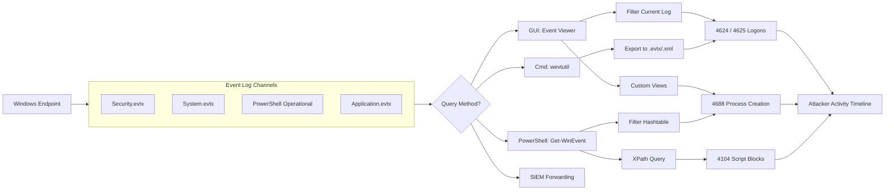

# 🪟 Full-Stack Lesson: Filter Event Viewer and Read Critical Event IDs

## 📊 Executive Summary

Windows Event Viewer is the primary logging subsystem on any Windows endpoint. During an investigation, the ability to rapidly filter, export, and parse Security, System, and PowerShell operational logs for critical Event IDs is essential for reconstructing attacker activity. This lesson covers the four most important Event IDs—4624 (successful logon), 4625 (failed logon), 4688 (process creation), and 4104 (PowerShell script block logging)—and provides a full-stack methodology to query them using the GUI, `wevtutil`, and PowerShell.



## 🏗️ Phase 1: Critical Event ID Reference Table

| Event ID | Log Source | Event Type | What It Reveals | Attacker Relevance |
|----------|-----------|------------|-----------------|-------------------|
| **4624** | Security | Logon | Successful authentication event with logon type, account, source IP | Lateral movement, privilege escalation, remote access |
| **4625** | Security | Logon | Failed authentication attempt with account, source IP, failure code | Password spraying, brute-force attacks, credential stuffing |
| **4688** | Security | Process Creation | New process started with parent PID, command line, user | Malware execution, LOLBins, reconnaissance commands |
| **4104** | PowerShell Operational | Script Block Logging | Full script block content when Script Block Logging is enabled | PowerShell-based attacks, in-memory execution, C2 staging |
| **4648** | Security | Logon | Explicit credential usage (RunAs) | Pass-the-hash, credential theft, lateral movement |
| **4672** | Security | Special Logon | Admin privileges assigned to logon | Privilege escalation, admin misuse |
| **1102** | Security | Audit Log Cleared | Security log was cleared | Anti-forensics, covering tracks |
| **7045** | System | Service Creation | New service installed | Persistence, service-based malware |
| **4698** | Security | Scheduled Task Created | New scheduled task registered | Persistence, lateral movement |
| **5156** | Security | Connection | Windows Filtering Platform allowed connection | Network connections from compromised process |

> 💡 **Key Insight**: Event ID 4688 only captures command lines if **Command Line Process Auditing** (GPO: `Administrative Templates\System\Audit Process Creation\Include command line in process creation events`) is enabled. Always verify this GPO is applied to endpoints.

## 🛠️ Phase 2: Filtering Events in Event Viewer GUI

### Creating a Custom View for Critical EIDs

1. Open **Event Viewer** (`eventvwr.msc`)
2. Right-click **Custom Views** → **Create Custom View**
3. Under **Event IDs**, enter: `4624,4625,4688,4104`
4. Select **Event Logs** → `Security`, `Microsoft-Windows-PowerShell/Operational`
5. Name the view: `Critical Security Events`

> ⚠️ **Note**: The `PowerShell Operational` log is under `Applications and Services Logs\Microsoft\Windows\PowerShell\Operational`, not in the standard Windows Logs folder.

### Applying Quick Filters

| Filter Goal | Action |
|-------------|--------|
| Filter by Event ID | Right-click log → **Filter Current Log** → Enter EID |
| Filter by Time | Right-click log → **Filter Current Log** → Specify date range |
| Filter by User | Use **XML** tab in filter → Add `<Select Path="Security">*[EventData[Data[@Name='TargetUserName']='Administrator']]</Select>` |
| Find specific text | Right-click log → **Find** → Type keyword (slow for large logs) |

## 📦 Phase 3: Exporting Logs with Wevtutil

### Export Entire Security Log

```cmd
wevtutil epl Security D:\case_123\exported_security.evtx
```

### Export with Time-Based Filter

```cmd
wevtutil epl Security D:\case_123\security_past_24h.evtx /q:"*[System[TimeCreated[timediff(@SystemTime) <= 86400000]]]"
```

### Export Specific Event IDs Only

```cmd
wevtutil epl Security D:\case_123\4624_4625_only.evtx /q:"*[System[(EventID=4624 or EventID=4625)]]"
```

### Export to Readable XML

```cmd
wevtutil qe Security /q:"*[System[EventID=4688]]" /f:xml /c:50 > D:\case_123\process_creation_50.xml
```

### Wevtutil Command Reference

```cmd
wevtutil epl <log> <exportfile> [/q:<query>]  # Export log to .evtx
wevtutil qe <log> [/q:<query>] [/f:<format>] [/c:<count>]  # Query events
wevtutil gl <log>  # Get log metadata (size, retention, etc.)
wevtutil el  # List all available log names
```

> 💡 The `/c:<count>` parameter limits output. Remove it when you need all results. For large exports, always use `.evtx` format (binary) for portability; use XML only for specific small queries.

## 🔍 Phase 4: PowerShell Querying with Get-WinEvent

### Basic Filtering by Event ID

```powershell
# Query Security log for 4624 (successful logons)
Get-WinEvent -LogName Security | Where-Object { $_.Id -eq 4624 } | Select-Object -First 10

# Better: use FilterHashtable for performance (filters server-side)
$logons = Get-WinEvent -FilterHashtable @{
    LogName   = 'Security'
    ID        = 4624, 4625
    StartTime = (Get-Date).AddHours(-24)
}
```

### Filtering with XML Path Queries

```powershell
# XPath query for 4688 with specific user
$xpath = @"
*[System[EventID=4688]]
  and *[EventData[Data[@Name='SubjectUserName']='jdoe']]
"@

$processEvents = Get-WinEvent -LogName Security -FilterXPath $xpath
```

### Parsing 4624 for Lateral Movement (Logon Type 3 - Network)

```powershell
$networkLogons = Get-WinEvent -FilterHashtable @{
    LogName = 'Security'
    ID      = 4624
} | ForEach-Object {
    $xml = [xml]$_.ToXml()
    $event = $xml.Event
    [PSCustomObject]@{
        TimeCreated = $_.TimeCreated
        LogonType   = $event.EventData.Data | Where-Object { $_.Name -eq 'LogonType' } | Select-Object -ExpandProperty '#text'
        Account     = $event.EventData.Data | Where-Object { $_.Name -eq 'TargetUserName' } | Select-Object -ExpandProperty '#text'
        SourceIP    = $event.EventData.Data | Where-Object { $_.Name -eq 'IpAddress' } | Select-Object -ExpandProperty '#text'
        ProcessID   = $event.EventData.Data | Where-Object { $_.Name -eq 'ProcessId' } | Select-Object -ExpandProperty '#text'
    }
} | Where-Object { $_.LogonType -eq 3 }

$networkLogons | Format-Table -AutoSize
```

### Querying 4688 for Suspicious Process Execution

```powershell
# Detect common LOLBin abuse via 4688
$suspicious = @('powershell', 'cmd', 'wscript', 'cscript', 'mshta', 'rundll32', 'regsvr32', 'wmic', 'certutil')

$events = Get-WinEvent -FilterHashtable @{
    LogName   = 'Security'
    ID        = 4688
    StartTime = (Get-Date).AddHours(-48)
} | ForEach-Object {
    $xml = [xml]$_.ToXml()
    $event = $xml.Event
    $cmdLine = ($event.EventData.Data | Where-Object { $_.Name -eq 'CommandLine' }).'#text'
    $procName = ($event.EventData.Data | Where-Object { $_.Name -eq 'NewProcessName' }).'#text'
    
    [PSCustomObject]@{
        Time         = $_.TimeCreated
        Process      = $procName
        CommandLine  = $cmdLine
        User         = ($event.EventData.Data | Where-Object { $_.Name -eq 'SubjectUserName' }).'#text'
        ParentPID    = ($event.EventData.Data | Where-Object { $_.Name -eq 'ProcessId' }).'#text'
    }
} | Where-Object {
    $suspicious -contains [System.IO.Path]::GetFileNameWithoutExtension($_.Process)
}

$events | Format-Table -AutoSize -Wrap
```

### Querying 4104 for Malicious PowerShell

```powershell
# PowerShell Script Block Logging (4104) captures deobfuscated script blocks
$psScriptBlocks = Get-WinEvent -FilterHashtable @{
    LogName   = 'Microsoft-Windows-PowerShell/Operational'
    ID        = 4104
    StartTime = (Get-Date).AddDays(-7)
} | ForEach-Object {
    [PSCustomObject]@{
        Time        = $_.TimeCreated
        ScriptBlock = $_.Message -replace 'Creating Scriptblock.*\n' , ''
        User        = $_.UserId
    }
}

# Search for common malicious patterns
$maliciousPatterns = @('Invoke-Expression', 'IEX', 'DownloadString', 
                        'Start-Process -WindowStyle Hidden', 'FromBase64String',
                        'System.Reflection.Assembly', 'Win32_Process')

foreach ($pattern in $maliciousPatterns) {
    $matches = $psScriptBlocks | Where-Object { $_.ScriptBlock -match $pattern }
    if ($matches) {
        Write-Host "Found $($matches.Count) matches for: $pattern" -ForegroundColor Red
        $matches | Format-Table -AutoSize
    }
}
```

### 📦 Complete PowerShell Investigation Script
# Invoke-EndpointForensics.ps1
# Collects critical Event ID data for triage

param(
    [Parameter(Mandatory)]
    [string]$OutputDir = ".\forensics_collection",
    
    [Parameter()]
    [int]$HoursBack = 48
)

$startTime = (Get-Date).AddHours(-$HoursBack)
New-Item -ItemType Directory -Path $OutputDir -Force | Out-Null

function Export-EventsToCsv($logName, $id, $path) {
    $events = Get-WinEvent -FilterHashtable @{
        LogName   = $logName
        ID        = $id
        StartTime = $startTime
    } -ErrorAction SilentlyContinue
    
    if ($events) {
        $events | Export-Csv -Path $path -NoTypeInformation
        Write-Host "[+] Exported $($events.Count) EID $id events to $path"
    } else {
        Write-Host "[-] No EID $id events found in $logName"
    }
}

# Security Events
Export-EventsToCsv 'Security' 4624 "$OutputDir\eid_4624_logons.csv"
Export-EventsToCsv 'Security' 4625 "$OutputDir\eid_4625_failed_logons.csv"
Export-EventsToCsv 'Security' 4688 "$OutputDir\eid_4688_process_creation.csv"
Export-EventsToCsv 'Security' 4648 "$OutputDir\eid_4648_explicit_creds.csv"
Export-EventsToCsv 'Security' 4698 "$OutputDir\eid_4698_scheduled_tasks.csv"

# PowerShell Events (4104 requires Script Block Logging enabled)
Export-EventsToCsv 'Microsoft-Windows-PowerShell/Operational' 4104 "$OutputDir\eid_4104_scriptblocks.csv"

# System Events
Export-EventsToCsv 'System' 7045 "$OutputDir\eid_7045_service_install.csv"

Write-Host "[*] Collection complete. Files saved to: $OutputDir"


## 🧠 Phase 5: Interpreting Event Details

### 4624 Logon Types Reference

| Logon Type | Code | Typical Use Case | Attacker Relevance |
|------------|------|-----------------|-------------------|
| Interactive | 2 | Local console / RDP | Direct access, often initial compromise |
| Network | 3 | SMB, NetLogon, IIS | Lateral movement over network shares |
| Batch | 4 | Scheduled Tasks | Persistence via scheduled tasks |
| Service | 5 | Windows Services | Persistence via service install |
| Unlock | 7 | Screen unlock | User was away from desk (insider threat) |
| NetworkCleartext | 8 | IIS Basic Auth, Exchange | Credential exposure over the wire |
| NewCredentials | 9 | RunAs with /netonly | Pass-the-hash, credential delegation |
| RemoteInteractive | 10 | RDP (modern) | Remote access, beachhead |
| CachedInteractive | 11 | Domain credentials used offline | Offline credential use (forensic value) |

### 4625 Failure Codes

| Failure Status | Meaning | Likely Cause |
|----------------|---------|-------------|
| `0xC000006D` | Bad username or password | The most common—wrong password or typo |
| `0xC000006F` | Account disabled, expired, or locked out | Targeted account lockout reconnaissance |
| `0xC0000070` | Logon outside allowed hours | Policy violation or timezone misconfiguration |
| `0xC0000072` | Account disabled | Attacker targeting disabled accounts |
| `0xC0000193` | Account expired | Expired service account |
| `0xC000015B` | Logon type not granted | Missing "Log on as service/batch" rights |
| `0xC0000413` | Logon failure from untrusted domain | Cross-domain lateral movement |

## 🔗 Phase 6: Correlation Across Event IDs

### Timeline Reconstruction Example

```powershell
# Build a unified timeline from multiple EIDs
$timeline = @()

# 4625 → Failed logons (password spray)
$timeline += Get-WinEvent -FilterHashtable @{
    LogName = 'Security'; ID = 4625; StartTime = $startTime
} | ForEach-Object {
    [PSCustomObject]@{ Time = $_.TimeCreated; Type = '4625_FAILED_LOGON'; Detail = $_.Message.Substring(0,100) }
}

# 4624 → Successful logons (successful spray guess)
$timeline += Get-WinEvent -FilterHashtable @{
    LogName = 'Security'; ID = 4624; StartTime = $startTime
} | ForEach-Object {
    [PSCustomObject]@{ Time = $_.TimeCreated; Type = '4624_SUCCESS_LOGON'; Detail = $_.Message.Substring(0,100) }
}

# 4688 → Process execution after compromise
$timeline += Get-WinEvent -FilterHashtable @{
    LogName = 'Security'; ID = 4688; StartTime = $startTime
} | ForEach-Object {
    [PSCustomObject]@{ Time = $_.TimeCreated; Type = '4688_PROCESS'; Detail = $_.Message.Substring(0,100) }
}

$timeline | Sort-Object Time | Format-Table -AutoSize
```

## 📝 Phase 7: Best Practices

| Practice | Why It Matters |
|----------|---------------|
| ⬆️ **Increase log size** | Default 20MB Security log wraps in hours on busy DCs. Set to 1GB+. |
| 🛡️ **Enable Command Line Auditing** | Without it, 4688 captures only the process name, not the arguments. |
| 🔌 **Enable PowerShell Script Block Logging** | EID 4104 is disabled by default. Enable via GPO: `Turn on PowerShell Script Block Logging`. |
| ⏰ **Sync system clocks** | Inconsistent timestamps break timeline reconstruction. Use NTP. |
| 📦 **Archive regularly** | Export logs to centralized storage before the circular log overwrites them. |
| 🔍 **Never trust a single EID** | Always correlate 4624+4688+4104 to build the full story. |

### ⚙️ GPO Settings for Maximum Visibility

| Policy Path | Setting | Relevant EID |
|-------------|---------|-------------|
| `Computer Configuration\Windows Settings\Security Settings\Advanced Audit Policy\Detailed Tracking\Audit Process Creation` | Enable Success | 4688 |
| `Administrative Templates\System\Audit Process Creation\Include command line in process creation events` | Enabled | 4688 (command line) |
| `Administrative Templates\Windows Components\Windows PowerShell\Turn on PowerShell Script Block Logging` | Enabled | 4104 |
| `Administrative Templates\Windows Components\Windows PowerShell\Turn on PowerShell Transcription` | Enabled | Captures full console output |
| `Computer Configuration\Windows Settings\Security Settings\Advanced Audit Policy\Logon/Logoff\Audit Logon` | Success + Failure | 4624, 4625 |

## 🎯 Conclusion

Mastering Event Viewer filtering and Event ID correlation is the foundation of Windows endpoint forensics. By focusing on 4624 (logon success), 4625 (logon failure), 4688 (process creation), and 4104 (PowerShell script blocks), an analyst can reconstruct the full attack chain—from initial access through privilege escalation, lateral movement, and payload execution. Always filter server-side (via `FilterHashtable` or XPath), export to `.evtx` for portability, and correlate across multiple EIDs to build an evidence-backed timeline.
