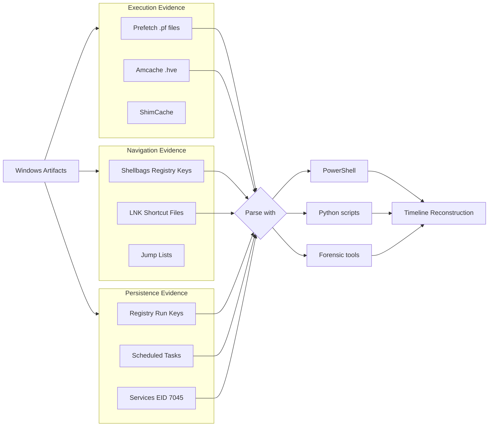

# 🗺️ Full-Stack Lesson: Locate Prefetch, Amcache, Shellbags, LNK, and Registry Persistence

## 📊 Executive Summary

Windows artifacts tell the story of everything that happened on a system. Prefetch reveals program execution history, Amcache catalogs application compatibility data, Shellbags records folder navigation, and LNK files capture shortcut access patterns. Registry persistence—through Run keys, Scheduled Tasks, and Services—shows how attackers maintained access. Each artifact alone provides a clue; together they reconstruct the full timeline of compromise. This lesson covers where each artifact lives, how to parse it, and what it reveals about attacker activity.



## 🏗️ Phase 1: Locating and Parsing Prefetch Files

### What Prefetch Is
Windows Prefetch (`.pf` files) stores metadata about application launches: the executable path, run count, last run time, and a list of DLLs loaded during the first 10 seconds of execution. Attackers running tools like `mimikatz.exe`, `procdump.exe`, or even `powershell.exe` leave behind Prefetch artifacts.

### Storage Location
```
C:\Windows\Prefetch\*.pf
```

### Key Prefetch File Details
| Field | Description | Forensic Value |
|-------|-------------|---------------|
| **File name** | `<EXENAME>-<HASH>.pf` | Directly reveals the executable name |
| **Run count** | Number of times the program was executed | Indicates frequency of use |
| **Last run time** | Timestamp of most recent execution | Crucial for timeline |
| **Resource list** | DLLs and files loaded | Can reveal injected modules |
| **Volume path** | Full path of the executable | Confirms where the binary ran from |

### Parsing with PowerShell

```powershell
# Parse Prefetch directory - list all executables that were run
$prefetchDir = "C:\Windows\Prefetch"
$prefetchFiles = Get-ChildItem -Path $prefetchDir -Filter "*.pf"

$prefetchFiles | ForEach-Object {
    $nameParts = $_.BaseName -split '-'
    $exeName = $nameParts[0]
    $hash = $nameParts[1]
    
    [PSCustomObject]@{
        FileName      = $_.Name
        Executable    = $exeName
        Hash          = $hash
        LastModified  = $_.LastWriteTime
        SizeKB        = [math]::Round($_.Length / 1KB, 1)
    }
} | Sort-Object LastModified -Descending | Format-Table -AutoSize
```

> 💡 **Key Insight**: Prefetch is enabled by default on Windows desktop editions but disabled on most Windows Server versions. On a server, lack of Prefetch is normal—but on a workstation or admin jump box, it is a critical source of evidence.

### Python Parsing with `libscca`

```python
import struct
import os
from datetime import datetime, timezone, timedelta

def parse_prefetch(filepath):
    with open(filepath, 'rb') as f:
        data = f.read()
    
    # Find executable name (stored as Unicode at offset 0x10 in Win10)
    name_start = 0x10
    name_end = data.find(b'\x00\x00', name_start)
    exe_name = data[name_start:name_end].decode('utf-16le', errors='replace')
    
    # Run count at offset 0xD8 in Win10 1809+
    run_count = struct.unpack_from('<I', data, 0xD8)[0]
    
    # Last run time (FILETIME) at offset 0x80 (Win10)
    last_run_filetime = struct.unpack_from('<Q', data, 0x80)[0]
    last_run = datetime.fromtimestamp(
        (last_run_filetime - 116444736000000000) / 10000000,
        tz=timezone.utc
    ) if last_run_filetime else None
    
    return {
        'executable': exe_name,
        'run_count': run_count,
        'last_run': last_run.isoformat() if last_run else 'N/A'
    }

# Usage
# for pf in os.listdir('C:\\Windows\\Prefetch'):
#     if pf.endswith('.pf'):
#         info = parse_prefetch(os.path.join('C:\\Windows\\Prefetch', pf))
#         print(f"{info['executable']} - Ran {info['run_count']}x - Last: {info['last_run']}")
```

## 🔍 Phase 2: Locating and Parsing Amcache

### What Amcache Is
Amcache (`.hve` hive file) stores program execution and application compatibility data. It records every executable that has ever run on the system, including portable executables (`.exe`, `.dll`, `.sys`, `.msi`) regardless of where they executed from. Unlike Prefetch, Amcache captures **all** executions, including one-off runs and short-lived processes.

### Storage Location
```
C:\Windows\appcompat\Programs\Amcache.hve
```

### Key Amcache Fields
| Field | Description | Forensic Value |
|-------|-------------|---------------|
| **Program ID** | Unique GUID for each executable | Allows deduplication |
| **File Name** | Full path to the executable | Reveals execution location |
| **File Size** | Size of the binary | Cross-reference with known tools |
| **Compile Time** | PE compile timestamp | Identifies custom/packed malware |
| **SHA1 Hash** | Hash of the binary | IoC matching |
| **Last Modified Time** | Last modification timestamp | Indicates recent execution |
| **Product Name** | Product metadata | Identifies legitimate vs. suspicious binaries |

### Parsing with PowerShell (via Registry)

```powershell
# Amcache is accessible via the Registry provider (must be loaded)
# In a live system:
$amcachePath = "HKLM:\SYSTEM\CurrentControlSet\Control\Session Manager\AppCompatCache"
$appCompatData = Get-ItemProperty -Path $amcachePath

# For offline analysis, load the hive:
# reg load HKLM\AMCACHE C:\Windows\appcompat\Programs\Amcache.hve

# Query Amcache for all executed programs
$amcacheKey = "HKLM:\AMCACHE\Root\File"  # After hive loading

# List all entries that are executables
Get-ChildItem -Path $amcacheKey -ErrorAction SilentlyContinue | ForEach-Object {
    $props = Get-ItemProperty -Path $_.PSPath
    
    [PSCustomObject]@{
        FileName    = $props.LongName
        Path        = $props.LongNameHash
        Size        = $props.FileSize
        LastRun     = $props.LastModifiedTime
        CompileTime = $props.CompileTime
        SHA1        = $props.SHA1Hash
    }
} | Where-Object { $_.FileName -match '\.exe$' } | Sort-Object LastRun -Descending | Format-Table -AutoSize
```

> ⚠️ **Note**: Amcache is a binary registry hive file. Loading it as a registry hive requires administrative privileges on a live system or offline forensic tool (Registry Explorer, EZTools from Eric Zimmerman). The hive cannot be parsed as plain text.

## 🗂️ Phase 3: Locating and Parsing Shellbags

### What Shellbags Are
Shellbags track user folder navigation in Windows Explorer. Every time a user opens, resizes, or modifies a folder view, Windows stores the bag MRU (Most Recently Used) data. Shellbags persist even if the folder itself is deleted, making them invaluable for identifying directories that the user (or attacker) browsed.

### Storage Locations
```
HKCU:\Software\Microsoft\Windows\Shell\BagMRU
HKCU:\Software\Microsoft\Windows\Shell\Bags
HKCU:\Software\Classes\Local Settings\Software\Microsoft\Windows\Shell\BagMRU
HKCU:\Software\Classes\Local Settings\Software\Microsoft\Windows\Shell\Bags
```

### Parsing with PowerShell

```powershell
# Enumerate Shellbags from the current user's registry
$bagMRU = Get-ChildItem -Path "HKCU:\Software\Classes\Local Settings\Software\Microsoft\Windows\Shell\BagMRU"

function Get-BagPath($key, $depth=0) {
    $props = Get-ItemProperty -Path $key.PSPath
    $name = $props.'(default)' -replace '.*\\\\', ''
    
    $result = [PSCustomObject]@{
        Depth     = $depth
        Key       = $key.PSChildName
        Name      = $name
        Path      = $key.PSPath
    }
    
    Write-Output $result
    
    foreach ($subKey in $key.GetSubKeyNames()) {
        $subPath = Join-Path $key.PSPath $subKey
        Get-BagPath (Get-Item -Path $subPath) ($depth + 1)
    }
}

$shellbags = Get-BagPath $bagMRU
$shellbags | Where-Object { $_.Name -ne '' } | Format-Table -AutoSize
```

> 💡 **Key Insight**: Shellbags reveal folders that no longer exist on disk. An attacker who downloaded tools to `C:\Users\jdoe\Tools\` and then deleted them will still leave Shellbag entries showing that folder was opened in Explorer during the compromise window.

## 📎 Phase 4: Locating and Parsing LNK Files

### What LNK Files Are
Windows LNK (shortcut) files contain metadata about the target file or application, including the original file path, size, modification timestamps, and the drive serial number. When a user opens a document, runs a program from Explorer, or accesses a network share, a LNK file may be created or modified.

### Storage Locations
```
C:\Users\<user>\AppData\Roaming\Microsoft\Windows\Recent\*.lnk
C:\Users\<user>\Desktop\*.lnk
C:\Users\<user>\AppData\Roaming\Microsoft\Windows\Start Menu\*.lnk
C:\Users\Public\Desktop\*.lnk
```

### Parsing LNK Metadata with PowerShell

```powershell
# Parse LNK files for target information
$lnkDir = "$env:USERPROFILE\AppData\Roaming\Microsoft\Windows\Recent"
$lnkFiles = Get-ChildItem -Path $lnkDir -Filter "*.lnk" -ErrorAction SilentlyContinue

# Use the Windows Shell.Application COM object to extract metadata
$shell = New-Object -ComObject Shell.Application

$lnkFiles | ForEach-Object {
    $folder = $shell.Namespace($_.DirectoryName)
    $file = $folder.ParseName($_.Name)
    
    [PSCustomObject]@{
        FileName       = $_.Name
        TargetPath     = $folder.GetDetailsOf($file, 10)  # Target path detail
        DateModified   = $_.LastWriteTime
        DateAccessed   = $_.LastAccessTime
        DateCreated    = $_.CreationTime
        SizeBytes      = $_.Length
    }
} | Sort-Object DateModified -Descending | Format-Table -AutoSize
```

### Python LNK Parsing

```python
import struct
import os

def parse_lnk(filepath):
    with open(filepath, 'rb') as f:
        data = f.read()
    
    if data[0:4] != b'\x4c\x00\x00\x00':
        return {'error': 'Not a valid LNK file'}
    
    info = {}
    
    # Locate the LinkTargetIDList
    flags = struct.unpack_from('<I', data, 0x14)[0]
    
    if flags & 0x01:  # Has LinkTargetIDList
        idlist_size = struct.unpack_from('<H', data, 0x4C)[0]
        idlist_start = 0x4E
        
        # Parse Shell Item IDs
        offset = idlist_start
        items = []
        while offset < idlist_start + idlist_size:
            item_size = struct.unpack_from('<H', data, offset)[0]
            if item_size == 0:
                break
            item_data = data[offset:offset+item_size]
            
            # Extension block detection
            if item_data[2:4] == b'\x1f\x00':  # Root folder
                items.append({'type': 'root'})
            elif item_data[2:4] == b'\x31\x00':  # Volume
                items.append({'type': 'volume'})
            elif item_data[2:4] == b'\x32\x00':  # File or folder
                name_len = item_data[0x0A]
                name = item_data[0x0B:0x0B+name_len].decode('utf-16le', errors='replace')
                items.append({'type': 'file', 'name': name})
            
            offset += item_size
        
        info['shell_items'] = items
        if items:
            info['target'] = ' > '.join([i.get('name', '') for i in items if 'name' in i])
    
    # Parse StringData (description, relative path, working directory, command line)
    if flags & 0x04:  # Has Description
        desc_offset = struct.unpack_from('<I', data, 0x08)[0] + 0x4C
        # Parse description string
    
    return info

# Usage
# for lnk in os.listdir('C:\\Users\\jdoe\\Recent'):
#     if lnk.endswith('.lnk'):
#         info = parse_lnk(os.path.join('C:\\Users\\jdoe\\Recent', lnk))
#         print(f"{lnk}: {info.get('target', 'N/A')}")
```

## 🔑 Phase 5: Registry Persistence Locations

### Common Run and Startup Keys

| Registry Path | Description | Typical Abuse |
|--------------|-------------|---------------|
| `HKLM\SOFTWARE\Microsoft\Windows\CurrentVersion\Run` | System-wide auto-start | Malware persistence at boot |
| `HKLM\SOFTWARE\Microsoft\Windows\CurrentVersion\RunOnce` | One-time auto-start (cleared after execution) | Installer cleanup, then self-deletes |
| `HKCU\SOFTWARE\Microsoft\Windows\CurrentVersion\Run` | Current user auto-start | User-level persistence |
| `HKLM\SOFTWARE\Microsoft\Windows\CurrentVersion\RunOnceEx` | Extended one-time auto-start | Installer persistence |
| `HKLM\SOFTWARE\WOW6432Node\Microsoft\Windows\CurrentVersion\Run` | 32-bit app auto-start on 64-bit systems | 32-bit malware persistence |
| `HKLM\SOFTWARE\Microsoft\Windows NT\CurrentVersion\Winlogon\Userinit` | Userinit process (runs at logon) | Replaces legitimate binary |
| `HKLM\SOFTWARE\Microsoft\Windows NT\CurrentVersion\Winlogon\Shell` | Shell replacement (Explorer) | GUI-less C2, no desktop |
| `HKLM\SYSTEM\CurrentControlSet\Services` | Windows Services | Service-based persistence |
| `HKCU\Software\Microsoft\Windows\CurrentVersion\Explorer\User Shell Folders\Startup` | User Startup folder | Classic startup folder malware |

### Querying Run Keys with PowerShell

```powershell
# Enumerate all common Run/RunOnce keys
$runKeys = @(
    'HKLM:\SOFTWARE\Microsoft\Windows\CurrentVersion\Run',
    'HKLM:\SOFTWARE\Microsoft\Windows\CurrentVersion\RunOnce',
    'HKCU:\Software\Microsoft\Windows\CurrentVersion\Run',
    'HKCU:\Software\Microsoft\Windows\CurrentVersion\RunOnce',
    'HKLM:\SOFTWARE\WOW6432Node\Microsoft\Windows\CurrentVersion\Run',
    'HKLM:\SOFTWARE\Microsoft\Windows NT\CurrentVersion\Winlogon'
)

$runKeys | ForEach-Object {
    $path = $_
    if (Test-Path $path) {
        $props = Get-ItemProperty -Path $path
        $props.PSObject.Properties | Where-Object {
            $_.Name -notin @('PSPath', 'PSParentPath', 'PSChildName', 'PSDrive', 'PSProvider')
        } | ForEach-Object {
            [PSCustomObject]@{
                KeyPath   = $path
                ValueName = $_.Name
                ValueData = $_.Value
            }
        }
    }
} | Format-Table -AutoSize
```

### Detecting Abnormally Named Services (EID 7045)

```powershell
# Query System log for service installation events
Get-WinEvent -FilterHashtable @{
    LogName   = 'System'
    ID        = 7045
    StartTime = (Get-Date).AddDays(-30)
} | ForEach-Object {
    $xml = [xml]$_.ToXml()
    $event = $xml.Event
    
    [PSCustomObject]@{
        Time        = $_.TimeCreated
        ServiceName = ($event.EventData.Data | Where-Object { $_.Name -eq 'ServiceName' }).'#text'
        ImagePath   = ($event.EventData.Data | Where-Object { $_.Name -eq 'ImagePath' }).'#text'
        StartType   = ($event.EventData.Data | Where-Object { $_.Name -eq 'StartType' }).'#text'
        ServiceType = ($event.EventData.Data | Where-Object { $_.Name -eq 'ServiceType' }).'#text'
        Account     = ($event.EventData.Data | Where-Object { $_.Name -eq 'AccountName' }).'#text'
    }
} | Where-Object {
    # Flag suspicious patterns
    $_.ImagePath -match 'Temp|Users|AppData|ProgramData' -or
    $_.ServiceName -notmatch '^\w+$' -or
    $_.ImagePath -match 'powershell|cmd|rundll32|mshta'
} | Format-Table -AutoSize -Wrap
```

## ⏰ Phase 6: Scheduled Task Persistence

### Where Scheduled Tasks Are Stored
```
C:\Windows\System32\Tasks\*.job
C:\Windows\Tasks\*.job
C:\Windows\System32\Tasks\Microsoft\Windows\*
```

### Parsing with PowerShell

```powershell
# List all scheduled tasks with their actions and triggers
$tasks = Get-ScheduledTask | Where-Object {
    $_.State -ne 'Disabled'
}

$tasks | ForEach-Object {
    $actions = $_.Actions | ForEach-Object { "$($_.Execute) $($_.Arguments)" } | Out-String
    $triggers = $_.Triggers | ForEach-Object { "$($_.StartBoundary) $($_.Repetition.Interval)" } | Out-String
    
    [PSCustomObject]@{
        Name        = $_.TaskName
        Path        = $_.TaskPath
        State       = $_.State
        Actions     = $actions.Trim()
        Triggers    = $triggers.Trim()
        Author      = $_.Author
        RunAsUser   = $_.Principal.UserId
    }
} | Where-Object {
    # Flag tasks running from suspicious locations
    $_.Actions -match 'Temp|AppData|Users\\Public|powershell|rundll32|mshta' -or
    $_.Author -eq $null -or
    $_.Path -notmatch '^\\Microsoft'
} | Format-Table -AutoSize -Wrap
```

## 🧠 Phase 7: Artifact Correlation — Building the Timeline

The true power of these artifacts comes from correlating them into a single timeline:

```powershell
# Unified artifact timeline
$timeline = @()

# 1. Prefetch → program execution
$pfDir = "C:\Windows\Prefetch"
if (Test-Path $pfDir) {
    Get-ChildItem $pfDir -Filter "*.pf" | ForEach-Object {
        $exe = ($_.BaseName -split '-')[0]
        $timeline += [PSCustomObject]@{
            Timestamp  = $_.LastWriteTime
            Source     = 'Prefetch'
            Detail     = "Executed: $exe"
        }
    }
}

# 2. LNK files → file access
$recentDir = "$env:USERPROFILE\AppData\Roaming\Microsoft\Windows\Recent"
if (Test-Path $recentDir) {
    Get-ChildItem $recentDir -Filter "*.lnk" | ForEach-Object {
        $timeline += [PSCustomObject]@{
            Timestamp  = $_.LastWriteTime
            Source     = 'LNK File'
            Detail     = "Accessed shortcut: $($_.BaseName)"
        }
    }
}

# 3. Registry Run keys → persistence
$runPaths = @(
    'HKLM:\SOFTWARE\Microsoft\Windows\CurrentVersion\Run',
    'HKCU:\Software\Microsoft\Windows\CurrentVersion\Run'
)
foreach ($path in $runPaths) {
    if (Test-Path $path) {
        $props = Get-ItemProperty $path
        $props.PSObject.Properties | Where-Object Name -notmatch '^PS' | ForEach-Object {
            $timeline += [PSCustomObject]@{
                Timestamp = (Get-Item $path).LastWriteTime
                Source    = 'Registry Run Key'
                Detail    = "$($_.Name) → $($_.Value)"
            }
        }
    }
}

# 4. Service creation (EID 7045)
$svcEvents = Get-WinEvent -FilterHashtable @{
    LogName = 'System'; ID = 7045; StartTime = (Get-Date).AddDays(-90)
} -ErrorAction SilentlyContinue
$svcEvents | ForEach-Object {
    $timeline += [PSCustomObject]@{
        Timestamp = $_.TimeCreated
        Source    = 'Service Install (EID 7045)'
        Detail    = $_.Message.Substring(0, 100)
    }
}

# Sort and display
$timeline | Sort-Object Timestamp | Format-Table -AutoSize
```

### 🔧 Complete Python Artifact Parser

```python
#!/usr/bin/env python3
import os
import struct
import json
from datetime import datetime, timezone

class WindowsArtifactParser:
    def __init__(self, output_dir="artifact_output"):
        self.output_dir = output_dir
        os.makedirs(output_dir, exist_ok=True)
        self.timeline = []
    
    def parse_prefetch_dir(self, pf_path):
        for pf in os.listdir(pf_path):
            if not pf.endswith('.pf'):
                continue
            full_path = os.path.join(pf_path, pf)
            mtime = datetime.fromtimestamp(os.path.getmtime(full_path), tz=timezone.utc)
            exe_name = pf.split('-')[0]
            
            self.timeline.append({
                'timestamp': mtime.isoformat(),
                'source': 'Prefetch',
                'artifact': pf,
                'detail': f"Executed: {exe_name}"
            })
    
    def parse_lnk_directory(self, lnk_path):
        for lnk in os.listdir(lnk_path):
            if not lnk.endswith('.lnk'):
                continue
            full_path = os.path.join(lnk_path, lnk)
            mtime = datetime.fromtimestamp(os.path.getmtime(full_path), tz=timezone.utc)
            
            self.timeline.append({
                'timestamp': mtime.isoformat(),
                'source': 'LNK File',
                'artifact': lnk,
                'detail': f"Accessed: {lnk.replace('.lnk', '')}"
            })
    
    def export_timeline(self, filename="artifact_timeline.json"):
        self.timeline.sort(key=lambda x: x['timestamp'])
        output_path = os.path.join(self.output_dir, filename)
        with open(output_path, 'w') as f:
            json.dump(self.timeline, f, indent=2, ensure_ascii=False)
        print(f"[+] Timeline exported to {output_path}")
        return output_path

# Usage
# parser = WindowsArtifactParser("case_123_artifacts")
# parser.parse_prefetch_dir("C:\\Windows\\Prefetch")
# parser.parse_lnk_directory(os.path.expanduser("~\\AppData\\Roaming\\Microsoft\\Windows\\Recent"))
# parser.export_timeline()
```

## 📝 Phase 8: Best Practices & Artifact Handling

| Practice | Why |
|----------|-----|
| 🧊 **Image the disk first** | Artifacts (especially Prefetch and Amcache) are fragile. Always acquire a write-blocked image before parsing |
| ⏰ **Record system time offset** | Artifact timestamps are local time. Record the timezone offset for accurate timeline correlation |
| 🔗 **Cross-reference artifacts** | A Prefetch entry + LNK creation + Registry Run key for the same binary is a much higher confidence indicator than any single artifact |
| 🧹 **Parse offline, never on live system** | Even read-only parsing on a live system updates Last Access timestamps on NTFS. Boot from a forensic USB or analyze the image |
| 📊 **Export to timeline format** | Convert all artifact timestamps to UTC and sort for a unified view. JSON/CSV works; CSV for SIEM ingestion |
| 🛡️ **Beware of anti-forensics** | Attackers may disable Prefetch (`NtfsDisableLastAccessUpdate`), clear Recent docs, or delete Registry keys. Missing artifacts are themselves a signal |

## 🎯 Conclusion

Prefetch, Amcache, Shellbags, LNK files, and Registry persistence keys form the foundation of Windows forensic analysis. Prefetch and Amcache answer **what ran**, LNK files and Shellbags answer **what was accessed**, and Registry Run keys and Services answer **what persists**. No single artifact tells the whole story—an attacker executing a file from a temp directory, browsing to a network share, and installing a service will leave traces across all five categories. The skilled analyst correlates these artifacts into a unified timeline to reconstruct the full attack narrative with high confidence.
