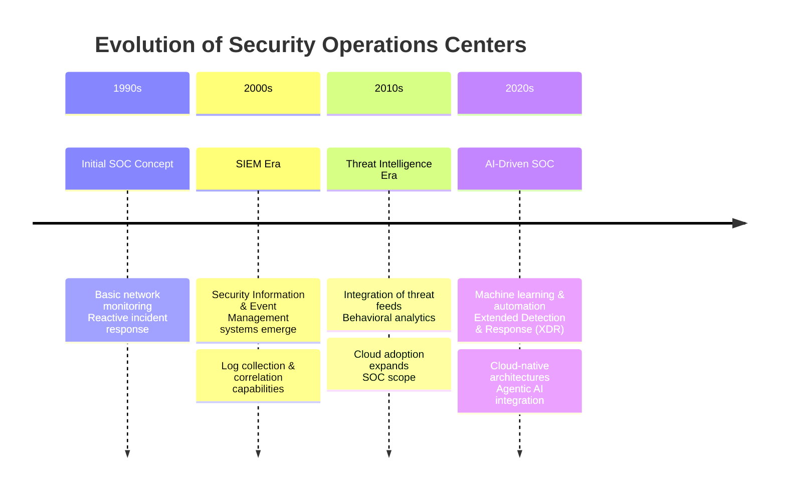
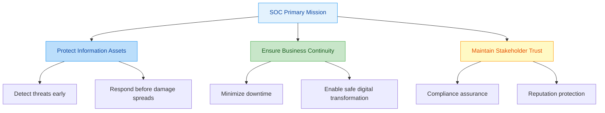
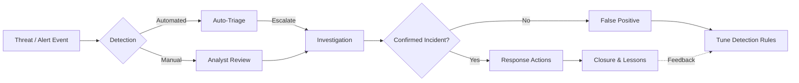
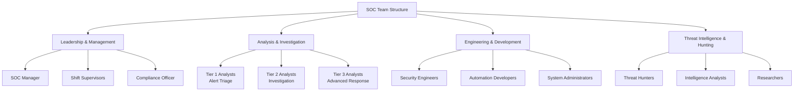

# Comprehensive Full-Stack Lesson: Purpose and Objectives of a Security Operations Center (SOC)

## TCM Exam Objectives

- **Define the SOC's primary mission** � Articulate how a SOC reduces organizational risk through continuous monitoring, detection, and response. Be able to contrast this with traditional IT security approaches.
- **Identify the core operational objectives** � List and explain continuous monitoring, incident response, threat hunting, vulnerability management, and security optimization as key SOC functions.
- **Explain the People-Process-Technology framework** � Describe how these three pillars interrelate and why each is critical for SOC effectiveness.
- **Map SOC objectives to business outcomes** � Understand how detection coverage, MTTD/MTTR reduction, risk quantification, and compliance adherence translate to organizational value.
- **Recognize the SOC-CMM maturity model** � Know the six levels (0�5) and the five assessment domains (Strategy, People, Process, Technology, Services).
- **Distinguish proactive vs. reactive operations** � Differentiate between threat hunting, detection engineering, and tabletop exercises (proactive) versus incident response and forensic analysis (reactive).
- **Understand the strategic role of the SOC** � Explain how SOC objectives align with GRC, business enablement, and regulatory compliance (GDPR, HIPAA, PCI-DSS).
- **Identify key metrics** � Define MTTD, MTTR, MTTA, false positive rate, and detection coverage, and know what healthy benchmarks look like.

# Comprehensive Full-Stack Lesson: Purpose and Objectives of a Security Operations Center (SOC)

?? **Exam Tip:** The PSAA exam frequently asks you to distinguish the SOC's purpose from that of traditional IT security. Remember the key contrast: SOC is **detective + responsive + preventive** (continuous lifecycle), while traditional IT security is primarily **preventive** (point solutions). A scenario question may describe a company that only uses firewalls and antivirus � that's NOT a SOC.

## 1 Introduction to Security Operations Centers

### 1.1 Definition and Core Concept

A **Security Operations Center (SOC)** is a centralized function within an organization employing people, processes, and technology to continuously monitor and improve an organization's security posture while preventing, detecting, analyzing, and responding to cybersecurity incidents ?turn0search3??turn0search4?. The SOC serves as the **command center** for an organization's cybersecurity defense, operating 24/7/365 to identify and mitigate threats before they can impact business operations. Unlike traditional IT security approaches that focus primarily on prevention, modern SOCs embrace a **comprehensive lifecycle** approach that includes continuous monitoring, threat detection, incident response, and recovery ?turn0search11??turn0search12?.

The fundamental purpose of a SOC is to **reduce organizational risk** by minimizing the impact of security incidents through rapid detection and response capabilities. This is achieved through the coordination of all cybersecurity technologies and operations across the organization, creating a unified defense mechanism rather than isolated security solutions ?turn0search4?. The SOC team acts as the "always-on" defenders of an organization's digital assets, constantly watching for signs of compromise and taking immediate action when threats are identified.

### 1.2 Evolution of the SOC

The concept of a SOC has evolved significantly in response to the changing threat landscape and technological advancements:

This evolution reflects the shift from **reactive security** measures to **proactive and predictive** approaches that leverage advanced technologies like artificial intelligence and machine learning to anticipate and prevent attacks before they occur ?turn0search9??turn0search13?. Modern SOCs are no longer just monitoring centers but strategic assets that contribute to business resilience and competitive advantage.

## 2 Core Purposes of a Security Operations Center

### 2.1 Primary Mission and Value Proposition

The **overarching purpose** of a SOC is to protect the organization's information assets, ensure business continuity, and maintain stakeholder trust by preventing, detecting, and responding to cyber threats effectively. This mission is accomplished through several key value propositions:

- **Risk Reduction**: By continuously monitoring for threats and vulnerabilities, the SOC significantly reduces the organization's attack surface and minimizes the potential impact of security incidents ?turn0search4?. This proactive approach addresses the **window of exposure** between when a vulnerability is introduced and when it can be patched.

- **Threat Detection and Response**: The SOC serves as the organization's early warning system, identifying potential security incidents in their earliest stages when they are most containable. The **median time** for ransomware operators to achieve their objectives is just under 24 hours, making rapid detection and response critical ?turn0search13?.

- **Regulatory Compliance**: Many industries have mandatory security monitoring requirements that SOCs fulfill, such as PCI-DSS for payment processing, HIPAA for healthcare, and GDPR for data protection ?turn0search3?. The SOC ensures continuous compliance through monitoring, reporting, and audit trail capabilities.

- **Business Enablement**: By ensuring secure operations, the SOC enables the organization to safely adopt new technologies, enter new markets, and pursue digital transformation initiatives without unacceptable risk ?turn0search11?. This transforms security from a business inhibitor to a **business enabler**.

### 2.2 The SOC in the Organizational Context

The SOC operates at the intersection of technology, process, and people, serving as the **integration point** for all security functions within an organization. It provides visibility across the entire IT infrastructure, including networks, endpoints, cloud services, applications, and data repositories ?turn0search3??turn0search9?. This comprehensive visibility allows the SOC to identify patterns and correlations that might be missed by individual security tools operating in isolation.

?? Deep Dive: SOC vs. Traditional IT Security

Traditional IT security often operates in silos, with separate teams managing firewalls, antivirus, intrusion detection systems, and other security controls. This fragmented approach creates **visibility gaps** and slows incident response. The SOC model centralizes these functions into a cohesive unit with shared visibility and coordinated response capabilities.

Key differences include:
- **Scope**: Traditional security focuses on point solutions; SOC has holistic visibility
- **Approach**: Traditional is preventive; SOC is detective, responsive, and preventive
- **Operations**: Traditional is often periodic; SOC is continuous (24/7)
- **Integration**: Traditional tools operate independently; SOC tools are integrated
- **Metrics**: Traditional measures tool effectiveness; SOC measures business risk reduction

### Proactive vs. Reactive SOC Operations Comparison

| **Aspect** | **Proactive Operations** | **Reactive Operations** |
|------------|-------------------------|------------------------|
| **Activities** | Threat hunting, detection engineering, tabletop exercises, vulnerability assessments | Incident response, forensic analysis, malware containment |
| **Timing** | Before an incident occurs | After an alert or breach is confirmed |
| **Mindset** | "Find it before it finds us" | "Stop the bleeding and restore" |
| **Tools Used** | SIEM correlation rules, UEBA, deception tech, purple team frameworks | EDR isolation, SOAR playbooks, DFIR suites |
| **Resource Investment** | Detection engineering time, R&D, continuous tuning | On-call rotations, emergency response, after-hours work |
| **Exam Focus** | Know that threat hunting and purple teaming are PROACTIVE; incident response is REACTIVE |

?? **Exam Tip:** The PSAA exam will test whether you can classify SOC activities as proactive vs. reactive. If a question describes "proactively searching for undetected threats," that's threat hunting (proactive). If it describes "responding to a confirmed ransomware outbreak," that's reactive incident response.

> **SOC Analyst Perspective:** "In my first year as a Tier 1 analyst, I spent 80% of my time on reactive triage. It wasn't until our SOC matured to Level 3 on the SOC-CMM that we dedicated time each week to proactive threat hunting. That shift cut our MTTD from 48 hours to under 6. Don't underestimate how much proactive work reduces your reactive burden."

## 3 Operational Objectives of a SOC

### 3.1 Continuous Monitoring and Threat Detection

The **primary operational objective** of a SOC is to maintain continuous visibility across the organization's digital environment to identify potential security threats in real-time. This involves:

- **Asset Discovery and Inventory**: Maintaining an up-to-date inventory of all hardware, software, data, and services across the organization, including cloud environments and remote assets ?turn0search3?. This knowledge is fundamental to understanding what needs to be protected and identifying unauthorized assets that may appear on the network.

- **Event Collection and Correlation**: Aggregating security events from across the infrastructure�including network devices, servers, endpoints, applications, and cloud services�and correlating them to identify patterns that may indicate malicious activity ?turn0search9?. This typically involves a **Security Information and Event Management (SIEM)** system that serves as the central nervous system of the SOC.

- **Behavioral Analytics**: Establishing baseline behavior for users, devices, and systems and then monitoring for deviations that may indicate compromise ?turn0search3?. This approach is particularly effective for detecting **insider threats** and advanced persistent threats that may evade traditional signature-based detection methods.

- **Threat Intelligence Integration**: Incorporating external threat intelligence feeds to enhance detection capabilities with information about known malicious IPs, domains, file hashes, and tactics, techniques, and procedures (TTPs) used by threat actors ?turn0search2??turn0search9?. This contextual information helps prioritize alerts and reduce false positives.

### 3.2 Incident Response and Recovery

When a security incident is detected, the SOC executes a structured response process with the following objectives:

- **Rapid Containment**: Taking immediate action to limit the scope and impact of an incident, such as isolating affected systems, blocking malicious traffic, or disabling compromised accounts ?turn0search12?. The goal is to prevent lateral movement and further damage while preserving forensic evidence.

- **Investigation and Analysis**: Conducting thorough forensic analysis to understand the attack vector, extent of compromise, data exfiltration, and other impacts ?turn0search2??turn0search9?. This involves examining system logs, memory dumps, network traffic captures, and other artifacts to reconstruct the attack timeline.

- **Eradication and Recovery**: Removing malware, closing vulnerabilities, and restoring systems from clean backups to return the organization to normal operations ?turn0search3?. This phase may involve rebuilding systems, applying patches, and implementing additional controls to prevent similar incidents.

- **Lessons Learned**: Conducting post-incident reviews to identify what worked well and what could be improved in the detection and response process ?turn0search3?. These insights are used to update detection rules, response procedures, and security controls to strengthen the organization's defenses.

### 3.3 Proactive Security Operations

Beyond reactive incident response, modern SOCs increasingly engage in **proactive security operations** to identify and address vulnerabilities before they can be exploited:

- **Vulnerability Management**: Continuously scanning for and assessing vulnerabilities in systems and applications, prioritizing remediation based on risk severity and exploitability ?turn0search9?. The SOC may coordinate with IT operations to ensure timely patching and configuration management.

- **Threat Hunting**: Proactively searching for indicators of compromise that may have evaded automated detection mechanisms ?turn0search9??turn0search13?. This involves using hypothesis-based investigations to look for subtle patterns that may indicate an advanced threat actor is operating in the environment.

- **Security Optimization**: Continuously tuning and optimizing security controls to reduce false positives, improve detection accuracy, and enhance operational efficiency ?turn0search3??turn0search13?. This includes adjusting detection rules, refining correlation logic, and optimizing alert thresholds.

- **Tabletop Exercises and Simulations**: Conducting regular exercises to test incident response procedures, identify gaps, and train team members on responding to various types of incidents ?turn0search2?. These simulations help ensure that when a real incident occurs, the response is coordinated and effective.

## 4 Strategic Objectives of a SOC

### 4.1 Alignment with Business Goals

The most effective SOCs are those that **align their operations** with the broader business objectives of the organization. This strategic alignment ensures that security investments are directed toward protecting the most critical assets and enabling business initiatives rather than simply implementing technical controls.

- **Asset Criticality Assessment**: Identifying and prioritizing protection based on business-critical assets, including customer data, intellectual property, financial systems, and operational technology ?turn0search3?. This ensures that security resources are allocated proportionally to business risk.

- **Risk-Based Prioritization**: Focusing monitoring and response efforts on threats that pose the greatest risk to business operations, reputation, and compliance posture ?turn0search4?. This approach acknowledges that not all threats require the same level of response and that resources should be directed where they can have the greatest impact.

- **Business Context Integration**: Incorporating business context into security operations, such as understanding which applications are critical for revenue generation, which data is subject to regulatory protection, and which systems support key business processes ?turn0search11?. This context helps prioritize alerts and guide response decisions.

- **Strategic Security Planning**: Contributing to the development of the organization's security strategy by providing insights into the threat landscape, effectiveness of existing controls, and emerging risks ?turn0search3?. The SOC's unique perspective on current threats and vulnerabilities makes it a valuable contributor to strategic planning.

### 4.2 Risk Management and Reduction

A fundamental objective of the SOC is to **quantify and reduce** cybersecurity risk to acceptable levels aligned with the organization's risk appetite. This involves:

- **Risk Identification**: Continuously identifying and assessing risks across the organization's digital environment, including risks from external threats, internal vulnerabilities, and third-party dependencies ?turn0search4?. This provides a comprehensive view of the risk landscape.

- **Risk Quantification**: Assigning measurable values to risks based on likelihood and potential impact, enabling prioritization and resource allocation ?turn0search7?. This may involve frameworks like FAIR (Factor Analysis of Information Risk) or other quantitative risk models.

- **Risk Mitigation**: Implementing controls and processes to reduce identified risks to acceptable levels, whether through technical safeguards, policy changes, or risk transfer mechanisms like cybersecurity insurance ?turn0search3?. The SOC plays a key role in implementing and monitoring these mitigations.

- **Risk Reporting**: Providing regular risk assessments and metrics to executive leadership and the board, enabling informed decision-making about security investments and risk acceptance ?turn0search7?. This reporting helps demonstrate the value of the SOC and the effectiveness of security investments.

### 4.3 Compliance and Regulatory Adherence

For many organizations, maintaining compliance with industry regulations and standards is a critical objective of the SOC. This involves:

- **Continuous Compliance Monitoring**: Implementing controls and monitoring processes to ensure ongoing compliance with requirements such as GDPR, HIPAA, PCI-DSS, CCPA, and others ?turn0search3?. The SOC provides the visibility and evidence needed to demonstrate compliance during audits.

- **Audit Support**: Maintaining comprehensive logs and documentation of security events, incidents, and responses to support internal and external audits ?turn0search3?. This includes ensuring that audit trails are complete, accurate, and tamper-proof.

- **Policy Enforcement**: Monitoring for violations of security policies and procedures and taking appropriate action when violations are detected ?turn0search3?. This helps ensure that security policies are not just documented but actually enforced in daily operations.

- **Regulatory Change Management**: Staying abreast of changes in regulatory requirements and adjusting monitoring and response processes accordingly to maintain continuous compliance ?turn0search7?. This is particularly important in highly regulated industries like finance and healthcare.

## 5 The People-Process-Technology Framework

### 5.1 People: The Human Element of SOC Operations

The effectiveness of a SOC depends largely on the **skills, experience, and organization** of its personnel. Building and maintaining a capable team is one of the most challenging aspects of SOC operations.

**Key roles and responsibilities** within a SOC include:

- **SOC Manager**: Provides leadership, sets strategic direction, manages resources, and ensures alignment with business objectives ?turn0search2?. This role is responsible for overall SOC performance and communication with executive leadership.

- **Tier 1 Analysts**: Monitor alerts, perform initial triage, and escalate potential incidents ?turn0search2?. These are often entry-level positions that serve as a training ground for more advanced roles.

- **Tier 2 Analysts**: Investigate escalated incidents, perform deeper analysis, and coordinate response activities ?turn0search2?. They typically have more experience and specialized skills in areas like network analysis, memory forensics, or malware analysis.

- **Tier 3 Analysts**: Handle the most complex incidents, perform advanced forensic analysis, and develop new detection capabilities ?turn0search2?. These are senior security experts with deep technical skills and experience.

- **Security Engineers**: Maintain and optimize SOC tools, develop new detection content, and integrate technologies ?turn0search9?. They ensure that the SOC's technical infrastructure remains effective and efficient.

- **Threat Hunters**: Proactively search for indicators of compromise that may have evaded automated detection ?turn0search9??turn0search13?. They use hypothesis-driven approaches to identify advanced threats.

**Critical skills** for SOC personnel include:
- **Technical skills**: Network analysis, system administration, malware analysis, scripting, and familiarity with security tools
- **Analytical skills**: Pattern recognition, critical thinking, problem-solving, and attention to detail
- **Communication skills**: Ability to explain technical concepts to non-technical audiences, documentation, and teamwork
- **Business acumen**: Understanding of how security impacts business operations and objectives

### 5.2 Process: Structuring SOC Operations

Well-defined **processes and procedures** are essential for consistent, effective SOC operations. They ensure that activities are performed repeatably, reliably, and in accordance with organizational policies and best practices.

?? Core SOC Processes

- **Alert Triage Process**: Systematic approach to evaluating alerts to determine their legitimacy and severity. This includes:
  - Alert reception and logging
  - Initial assessment and prioritization
  - Context gathering and enrichment
  - Disposition (true positive, false positive, or benign true positive)
  - Escalation or closure

- **Incident Response Process**: Structured approach to handling security incidents from declaration to closure. This typically includes:
  - Preparation (maintaining tools, contacts, and procedures)
  - Identification (confirming an incident has occurred)
  - Containment (limiting scope and impact)
  - Eradication (removing threat)
  - Recovery (restoring systems)
  - Lessons learned (post-incident review)

- **Vulnerability Management Process**: Systematic approach to identifying, assessing, and mitigating vulnerabilities:
  - Discovery (continuous asset and vulnerability scanning)
  - Assessment (evaluating risk and exploitability)
  - Prioritization (based on business risk and available patches)
  - Remediation (applying patches or compensating controls)
  - Verification (confirming remediation effectiveness)

- **Th Hunting Process**: Methodical approach to proactively identifying threats:
  - Hypothesis development (based on threat intelligence or anomalies)
  - Data collection (gathering relevant logs and telemetry)
  - Analysis (looking for indicators of compromise)
  - Validation (confirming findings through additional evidence)
  - Response (containing and eradicating threats if found)

- **Continuous Improvement Process**: Ongoing enhancement of SOC capabilities:
  - Performance measurement (tracking metrics and KPIs)
  - Gap analysis (identifying areas for improvement)
  - Solution development (implementing changes)
  - Effectiveness evaluation (measuring impact of changes)

### 5.3 Technology: Enabling SOC Operations

The **technology stack** of a modern SOC is extensive and integrated, providing the visibility, detection, response, and automation capabilities needed to defend against evolving threats.

| **Technology Category** | **Key Solutions** | **Purpose** | **Examples** |
| :--- | :--- | :--- | :--- |
| **Security Information & Event Management (SIEM)** | Centralized log management, correlation, alerting | Aggregates and correlates security events from across the organization | Splunk, IBM QRadar, LogRhythm |
| **Security Orchestration, Automation & Response (SOAR)** | Incident response workflow, automation, case management | Automates repetitive tasks and coordinates response activities | Palo Alto Cortex XSOAR, IBM Resilient, Swimlane |
| **Endpoint Detection & Response (EDR)** | Endpoint monitoring, threat detection, response capabilities | Provides visibility and control at the endpoint level | CrowdStrike, SentinelOne, Microsoft Defender for Endpoint |
| **Network Detection & Response (NDR)** | Network traffic analysis, anomaly detection | Monitors network traffic for malicious patterns | Darktrace, ExtraHop, Vectra |
| **Extended Detection & Response (XDR)** | Integrated detection and response across multiple layers | Breaks down silos between security domains | Palo Alto Cortex XDR, Microsoft XDR, Trend Micro |
| **Threat Intelligence Platforms (TIP)** | Aggregation, analysis, and dissemination of threat intel | Provides context about threats and indicators | Anomali ThreatStream, Recorded Future, ThreatConnect |
| **Vulnerability Management** | Asset discovery, vulnerability scanning, prioritization | Identifies and assesses vulnerabilities across the environment | Tenable, Qualys, Rapid7 |
| **Cloud Security Posture Management (CSPM)** | Cloud environment monitoring, compliance checking | Ensures secure configuration and compliance in cloud environments | Palo Alto Prisma Cloud, Check Point CloudGuard, Wiz |

**Emerging technologies** are transforming SOC capabilities:

- **Artificial Intelligence and Machine Learning**: Enhancing detection accuracy, reducing false positives, and enabling predictive analytics ?turn0search9??turn0search13?. AI is increasingly used for alert triage, anomaly detection, and automated response.

- **Automation and Orchestration**: Streamlining repetitive tasks and accelerating response times ?turn0search9?. This includes automating containment actions, evidence collection, and notification procedures.

- **Cloud-Native Architectures**: Providing scalable, flexible infrastructure that can adapt to changing workloads and cloud environments ?turn0search9?. This enables SOCs to effectively monitor and protect cloud-based assets.

- **Extended Detection and Response (XDR)**: Integrating detection and response capabilities across multiple security layers (endpoint, network, cloud, email) for more comprehensive protection ?turn0search9?. This provides a unified view of threats across the environment.

## 6 Metrics and Maturity Models for SOC Assessment

### 6.1 Key Performance Indicators (KPIs) for SOC Effectiveness

Measuring SOC performance is essential for demonstrating value, identifying improvement opportunities, and justifying resource investments. The most effective metrics focus on **business outcomes** rather than simply measuring activity.

**Critical metrics** for assessing SOC performance include:

- **Mean Time to Detect (MTTD)**: The average time it takes for the SOC to identify a security incident from when it first occurs ?turn0search14??turn0search17?. Lower MTTD indicates more effective monitoring and detection capabilities.

- **Mean Time to Respond (MTTR)**: The average time it takes to contain and eradicate a threat once detected ?turn0search14??turn0search17?. This measures the efficiency of response processes and procedures.

- **Mean Time to Acknowledge (MTTA)**: The average time it takes for an analyst to begin investigating an alert after it's generated ?turn0search16?. This helps assess staffing levels and alert prioritization effectiveness.

- **Detection Coverage**: The percentage of MITRE ATT&CK techniques or other framework elements for which the SOC has implemented and tested detections ?turn0search13?. This measures the comprehensiveness of detection capabilities.

- **False Positive Rate**: The percentage of alerts that do not represent actual security incidents ?turn0search17?. Lower rates indicate more effective alert tuning and correlation logic.

- **Alert Volume**: The number of alerts generated per day/week, which helps assess staffing needs and tuning effectiveness ?turn0search16?. Unusually high volumes may indicate tuning issues or increased threat activity.

- **Incident Closure Rate**: The percentage of incidents closed within defined timeframes, which measures the efficiency of the incident response process ?turn0search16?.

### 6.2 SOC Capability Maturity Model (SOC-CMM)

The **SOC-CMM** is a capability maturity model and self-assessment tool specifically designed for Security Operations Centers ?turn0search18??turn0search20?. It provides a framework for assessing and improving SOC capabilities across multiple domains.

The model defines **six maturity levels** from 0 to 5 ?turn0search19?:

| **Maturity Level** | **Description** | **Characteristics** |
| :--- | :--- | :--- |
| **0 - Non-existent** | The capability is not present | No formal processes or technologies in place |
| **1 - Initial** | The capability is delivered in an ad hoc manner | Inconsistent approaches, dependence on individuals |
| **2 - Repeatable** | The capability is performed in a consistent manner | Basic processes established but may not be documented |
| **3 - Defined** | The capability is standardized and documented | Processes are defined, documented, and integrated |
| **4 - Managed** | The capability is quantitatively managed | Metrics are used to control and improve processes |
| **5 - Optimizing** | The capability is continuously improved | Focus on process optimization and innovation |

The SOC-CMM assessment evaluates capabilities across **five domains** ?turn0search20?:
1. **Strategy & Governance**: Alignment with business objectives, risk management, and strategic planning
2. **People**: Skills, training, organization, and career development
3. **Process**: Definition, implementation, and continuous improvement of processes
4. **Technology**: Selection, implementation, and integration of technologies
5. **Services**: Monitoring, detection, response, and other services provided by the SOC

Organizations can use the SOC-CMM to **identify strengths and weaknesses**, benchmark against industry peers, and prioritize improvement initiatives ?turn0search21?. The model provides a structured approach to maturing SOC capabilities in a way that aligns with business needs and risk tolerance.

## 7 Implementing and Optimizing a SOC

### 7.1 Building a SOC from the Ground Up

Establishing a new SOC requires careful planning and execution to ensure it meets the organization's needs and provides value from day one. The implementation process should follow a structured approach:

**Key considerations** during implementation include:

- **Scope Definition**: Clearly defining what assets and systems the SOC will monitor and protect, which may be phased in over time ?turn0search3?. Starting with critical assets and expanding coverage gradually is often more successful than trying to monitor everything at once.

- **Build vs. Buy Decision**: Determining whether to build an in-house SOC, use a managed security service provider (MSSP), or adopt a hybrid approach ?turn0search9?. This decision should be based on available expertise, budget, and the organization's strategic priorities.

- **Technology Selection**: Choosing appropriate tools that integrate well and provide the necessary visibility and response capabilities ?turn0search9?. Avoiding tool sprawl is important for effective operations and cost management.

- **Staffing Model**: Determining the appropriate mix of skills and experience levels, and developing career paths to retain talent ?turn0search2?. Given the high demand for security professionals, retention strategies are particularly important.

- **Process Development**: Creating documented procedures for common scenarios while maintaining flexibility to handle novel situations ?turn0search3?. Processes should be living documents that evolve with the threat landscape and organizational changes.

### 7.2 Optimizing Existing SOC Operations

For organizations with established SOCs, continuous optimization is essential to keep pace with evolving threats and business needs. Key optimization strategies include:

- **Automation and Orchestration**: Identifying repetitive tasks that can be automated to free up analyst time for more complex investigations ?turn0search9?. This includes automating alert enrichment, initial triage, and containment actions for common scenarios.

- **Detection Engineering**: Continuously refining and expanding detection capabilities to improve coverage and reduce false positives ?turn0search13?. This involves developing new use cases based on threat intelligence and lessons learned from past incidents.

- **Team Development**: Investing in ongoing training and professional development to keep skills current with emerging threats and technologies ?turn0search2?. This includes both technical skills and soft skills like communication and problem-solving.

- **Technology Refresh**: Regularly evaluating new technologies and upgrading or replacing tools that no longer meet needs ?turn0search9?. This may involve migrating to cloud-based solutions or adopting newer platforms with better integration capabilities.

- **Metrics-Driven Improvement**: Using performance metrics to identify bottlenecks and inefficiencies, then implementing targeted improvements ?turn0search13??turn0search17?. This creates a culture of continuous improvement based on data rather than intuition.

?? SOC Optimization Framework

A structured approach to optimizing SOC operations involves:

1. **Assessment**: Conduct a comprehensive assessment using tools like SOC-CMM to identify current capabilities and gaps ?turn0search20??turn0search21?
2. **Prioritization**: Rank improvement opportunities based on potential impact and effort required
3. **Planning**: Develop detailed plans for highest-priority improvements, including resource requirements and timelines
4. **Implementation**: Execute improvement initiatives, ensuring adequate change management and communication
5. **Measurement**: Track metrics to assess the effectiveness of implemented changes
6. **Iteration**: Continuously cycle through this process to drive ongoing improvement

This framework ensures that optimization efforts are systematic rather than ad hoc, and that resources are directed toward initiatives with the greatest potential impact on SOC effectiveness.

## 8 Future Trends and Evolution of the SOC

### 8.1 Emerging Technologies and Methodologies

The SOC landscape is evolving rapidly in response to technological advancements and changing threat patterns. Several key trends are shaping the future of security operations:

- **AI-Driven Automation**: Artificial intelligence and machine learning are increasingly being used to augment human analysts, automate routine tasks, and enhance detection capabilities ?turn0search9??turn0search13?. This includes AI-powered alert triage, automated investigation, and even autonomous response for certain types of incidents.

- **Cloud-Native Security**: As organizations continue to adopt cloud services, SOCs are evolving to provide comprehensive visibility and protection across hybrid and multi-cloud environments ?turn0search9?. This includes cloud security posture management, cloud workload protection, and integration with cloud service provider security tools.

- **Extended Detection and Response (XDR)**: XDR platforms are breaking down traditional security silos by integrating detection and response capabilities across endpoints, networks, cloud, and email ?turn0search9?. This provides more comprehensive visibility and context for investigating incidents.

- **Zero Trust Architecture**: SOCs are increasingly supporting zero trust initiatives by providing continuous verification and validation of access requests and activities ?turn0search2?. This involves monitoring for anomalous behavior that may indicate compromised credentials or insider threats.

- **DevSecOps Integration**: Security is being integrated earlier in the development lifecycle, with SOCs providing feedback and guidance to development teams ?turn0search9?. This shift-left approach aims to identify and remediate vulnerabilities before they reach production environments.

### 8.2 The Evolving Role of the SOC

The role of the SOC is expanding beyond traditional security monitoring to become a more strategic function within the organization:

- **Business Risk Intelligence**: Providing business leaders with insights about cyber risks and their potential impact on business operations and objectives ?turn0search7?. This helps inform strategic decisions about risk acceptance, mitigation, and transfer.

- **Security as a Service**: Internal SOCs are increasingly operating as service providers to the business, offering security services to different departments and business units ?turn0search9?. This includes providing specialized expertise and capabilities that may be difficult for individual business units to maintain.

- **Threat Intelligence Production**: Rather than just consuming threat intelligence, mature SOCs are producing their own intelligence based on the threats they observe and the attacks they defend against ?turn0search2?. This intelligence can be shared with industry peers and used to enhance defensive capabilities.

- **Resilience Engineering**: Moving beyond incident response to focus on organizational resilience�the ability to anticipate, withstand, recover from, and adapt to adverse events ?turn0search11?. This involves understanding dependencies, single points of failure, and recovery capabilities across the organization.

## 9 Conclusion: The Strategic Value of the SOC

The Security Operations Center has evolved from a tactical security monitoring function to a **strategic business asset** that enables digital transformation, protects organizational reputation, and ensures regulatory compliance. As cyber threats continue to increase in sophistication and impact, the SOC's role in defending organizational assets becomes increasingly critical.

The most effective SOCs are those that align with business objectives, leverage advanced technologies judiciously, invest in their people, and continuously improve their processes and capabilities. By focusing on both operational excellence and strategic alignment, SOCs can provide significant value beyond traditional security functions, contributing to business resilience and competitive advantage.

As organizations continue to digitize their operations and adopt new technologies, the SOC will remain a cornerstone of effective cybersecurity strategy�providing the visibility, detection, and response capabilities needed to navigate an increasingly complex threat landscape. The investment in building and maintaining a mature SOC is not merely a cost of doing business but a strategic investment in the organization's future.
