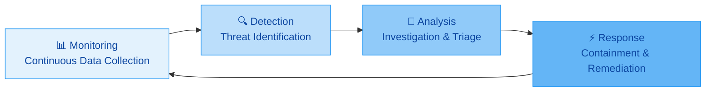
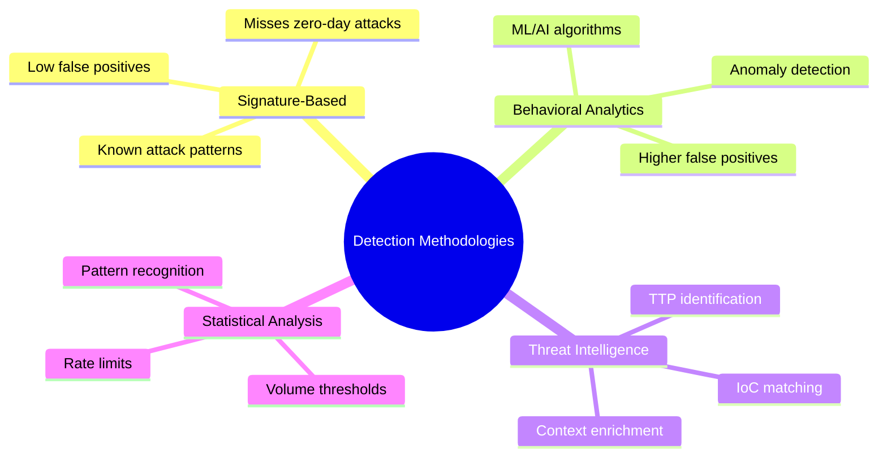
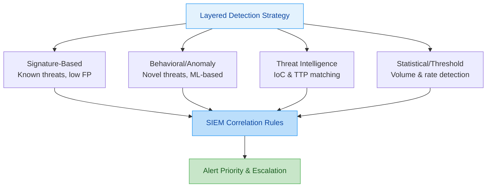
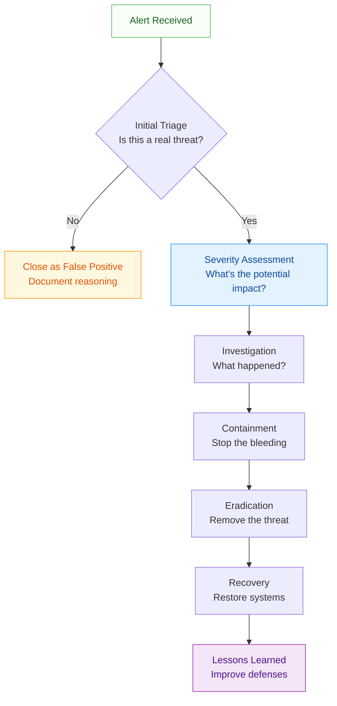
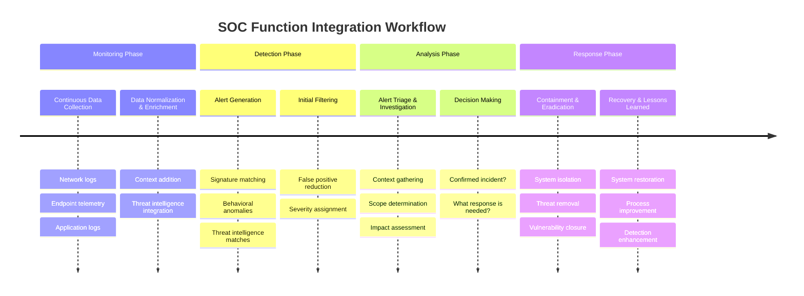

---
tags: [soc]
---
# Comprehensive Full-Stack Lesson: SOC Functions - Monitoring, Detection, Analysis & Response


## TCM Exam Objectives

- **Differentiate the four core SOC functions** – Clearly distinguish Monitoring, Detection, Analysis, and Response. Know the order and what each entails.
- **Explain the Monitoring function** – Describe continuous data collection, data normalization, baseline establishment, and the difference between data quality and data quantity.
- **Understand Detection methodologies** – Compare signature-based, behavioral/anomaly-based, threat intelligence-driven, and statistical detection approaches.
- **Master the Analysis workflow** – Walk through alert triage, severity assessment, investigation techniques, and the decision to escalate or close.
- **Articulate the Response lifecycle** – List the phases: preparation, detection, containment, eradication, recovery, and lessons learned per NIST SP 800-61.
- **Identify key metrics for each function** – Know MTTD (Detection), MTTR (Response), false positive rate (Detection), detection coverage (Detection), and alert volume (Monitoring).
- **Map SOC maturity levels to functions** – Understand how Monitoring/Detection/Analysis/Response capabilities evolve from Level 1 (Initial) to Level 5 (Optimizing).
- **Understand integration and tooling** – Explain how SIEM, EDR, NDR, and SOAR enable the four functions and how data flows between them.

# Comprehensive Full-Stack Lesson: SOC Functions - Monitoring, Detection, Analysis & Response

## 🎯 Lesson Overview
This lesson provides an in-depth exploration of the four core functions of a Security Operations Center (SOC): **Monitoring, Detection, Analysis, and Response**. You'll learn how these functions interconnect to form a comprehensive security operations framework, the technologies and processes that enable them, and the metrics that measure their effectiveness.



📌 **Exam Tip:** The PSAA exam tests the **order** of SOC functions: Monitoring → Detection → Analysis → Response. This is a circular, continuous process — not a linear one. A common exam trap is presenting them out of order (e.g., "Analysis before Detection"). Remember: you can't detect what you aren't monitoring, and you can't analyze what you haven't detected.

## 1. 📊 Monitoring: The Foundation of SOC Operations

### 1.1 Definition and Purpose
**Monitoring** is the continuous, systematic collection and observation of security-relevant data from across an organization's IT infrastructure. It serves as the foundational layer upon which all other SOC functions operate, providing the visibility necessary to detect potential threats and vulnerabilities 【turn0search1】【turn0search4】.

### 1.2 Key Monitoring Components

<details>
<summary>🔧 Core Monitoring Technologies & Data Sources</summary>

| **Monitoring Domain** | **Key Technologies** | **Data Sources** | **Purpose** |
|----------------------|---------------------|-----------------|-------------|
| **Network Monitoring** | Network Detection & Response (NDR), NetFlow analyzers | Firewalls, routers, switches, wireless APs | Detect network-based attacks, anomalous traffic patterns, and data exfiltration |
| **Endpoint Monitoring** | Endpoint Detection & Response (EDR), XDR | Workstations, servers, mobile devices | Monitor process execution, file changes, and system behavior |
| **Application Monitoring** | Web Application Firewalls (WAF), RASP | Application logs, API gateways | Detect application-layer attacks and business logic abuse |
| **Cloud Monitoring** | Cloud Security Posture Management (CSPM), CloudTrail | AWS, Azure, GCP services | Ensure secure configurations and monitor for unauthorized access |
| **Identity Monitoring** | User and Entity Behavior Analytics (UEBA) | Active Directory, authentication systems | Detect compromised credentials and insider threats |

</details>

### 1.3 Monitoring Best Practices

- **24/7/365 Coverage**: Cyber threats don't adhere to business hours, requiring continuous monitoring operations 【turn0search1】
- **Data Normalization**: Transform heterogeneous data into standardized formats for effective correlation
- **Contextualization**: Enrich raw data with asset criticality, user roles, and threat intelligence
- **Baseline Establishment**: Define "normal" behavior for users, systems, and networks to identify anomalies
- **Coverage Validation**: Regularly test monitoring effectiveness through purple team exercises and breach simulations

> 💡 **Pro Tip**: Effective monitoring isn't about collecting more data—it's about collecting the *right* data with appropriate context. Focus on quality over quantity to avoid alert fatigue and improve detection accuracy.

## 2. 🔍 Detection: Identifying Potential Threats

### 2.1 Detection Methodologies
Modern SOCs employ multiple detection approaches in a layered defense strategy:

| **Methodology** | **How It Works** | **Strengths** | **Weaknesses** | **PSAA Exam Focus** |
|-----------------|-----------------|---------------|----------------|---------------------|
| **Signature-Based** | Matches known attack patterns (hashes, strings, rules) | Low false positives, fast, well-understood | Misses zero-day / polymorphic attacks | Classic antivirus approach |
| **Behavioral/Anomaly** | ML/AI establishes baselines, flags deviations | Detects novel attacks, insider threats | Higher false positives, needs baseline period | Key for UEBA and modern SOC |
| **Threat Intelligence-Driven** | Compares events against known IOCs and TTPs | Provides context, reduces investigation time | Limited by feed quality and freshness | IoC matching via TIP feeds |
| **Statistical/Threshold** | Volume thresholds, rate limiting, pattern recognition | Simple to implement, good for brute-force detection | Can't detect slow, low-and-slow attacks | Common for login failures, DDoS |

> **SOC Analyst Perspective:** "In practice, we layer all four detection methodologies. Signature-based catches the known stuff, behavioral catches the weird stuff, threat intel provides context, and thresholds catch brute-force attempts. The art is tuning them so they don't drown you in false positives. When I started, our false positive rate was 35%. After a year of tuning, we got it under 8%."





📌 **Exam Tip:** The PSAA exam expects you to know which detection methodology is best for different scenarios. Signature-based is best for known malware (low FP). Behavioral is best for insider threats and zero-days (higher FP). Statistical is best for brute-force and DDoS.

### 2.2 Detection Engineering Framework
Effective detection requires a structured approach to developing, testing, and maintaining detection rules:

<details>
<summary>📖 Deep Dive: Detection Engineering Lifecycle</summary>

1. **Hypothesis Development**: Based on threat intelligence, vulnerability assessments, or business risks
   - Example: "We should detect PowerShell execution from Word documents"
   
2. **Rule Development**: Create detection logic in appropriate tools (SIEM, EDR, NDR)
   - Example: `process_name:powershell.exe AND parent_process:winword.exe`

3. **Testing & Validation**: Test against known good and bad samples
   - False positive testing: Run on typical business documents
   - True positive testing: Test with malicious macro documents

4. **Deployment & Monitoring**: Deploy to production and monitor performance
   - Track alert volume, false positive rate, and detection accuracy

5. **Tuning & Optimization**: Refine based on operational feedback
   - Adjust thresholds, add exceptions, improve context

6. **Documentation**: Document detection logic, rationale, and maintenance requirements
</details>

### 2.3 Detection Metrics & KPIs

| **Metric** | **Definition** | **Target** | **Industry Benchmark** |
|-----------|---------------|------------|----------------------|
| **Detection Coverage** | Percentage of MITRE ATT&CK techniques covered by detections | 60-70% | Varies by industry |
| **False Positive Rate** | Percentage of alerts that don't represent actual threats | <5% | 10-30% typical |
| **Detection Latency** | Time from event occurrence to alert generation | <5 minutes | 15-30 minutes |
| **Alert Volume per Analyst** | Number of alerts handled per analyst per shift | 20-30 | 50-100 (overloaded) |

> ⚠️ **Note**: While 100% detection coverage sounds ideal, it's often unachievable and unnecessary. Focus on covering techniques most relevant to your organization's threat profile and business risks 【turn0search19】.

## 3. 🔬 Analysis: Investigating and Triaging Alerts

### 3.1 The Analysis Workflow
Once an alert is generated, SOC analysts follow a structured investigation process:



### 3.2 Investigation Techniques and Tools

<details>
<summary>🛠️ Essential Analysis Tools & Techniques</summary>

**Network Analysis Tools**:
- **Wireshark**: Deep packet inspection and protocol analysis
- **NetworkMiner**: Network forensics and artifact extraction
- **Zeek (formerly Bro)**: Network behavior analysis and logging

**Endpoint Analysis Tools**:
- **Process Monitor**: Real-time file system, registry, and process/thread activity
- **Autoruns**: Identify malware persistence mechanisms
- **Memory Forensics (Volatility)**: Analyze RAM for malicious artifacts

**Log Analysis Platforms**:
- **SIEM (Splunk, QRadar, Sentinel)**: Centralized log correlation and search
- **ELK Stack (Elasticsearch, Logstash, Kibana)**: Flexible log analysis and visualization
- **Graylog**: Open-source log management with analysis capabilities

**Threat Intelligence Platforms**:
- **MISP (Malware Information Sharing Platform)**: Open-source threat intelligence sharing
- **Commercial TI Feeds**: Recorded Future, Anomali, ThreatConnect
- **STIX/TAXII**: Standardized threat intelligence sharing protocols

**Analysis Techniques**:
- **Timeline Analysis**: Reconstruct attack sequence using timestamps from multiple sources
- **Pattern Recognition**: Identify similar tactics across different incidents
- **Anomaly Detection**: Identify deviations from established baselines
- **Hypothesis Testing**: Formulate and test theories about attack methods
</details>

### 3.3 Triage and Prioritization Framework
Not all alerts require equal attention. SOC analysts use structured triage frameworks:

**Severity Assessment Criteria**:
- **Critical**: Active exploitation with data exfiltration or system compromise
- **High**: Confirmed malware infection or unauthorized access to sensitive systems
- **Medium**: Suspicious activity requiring investigation but no confirmed compromise
- **Low**: Potential policy violation or minor anomaly

**Triage Questions**:
1. Is this activity expected based on business processes?
2. Does this match known attack patterns or threat intelligence?
3. What is the potential business impact if this is a real threat?
4. What is the scope of potentially affected systems or data?

## 4. ⚡ Response: Containing and Remediating Threats

### 4.1 Incident Response Lifecycle
The response function follows a structured lifecycle, often aligned with NIST SP 800-61 【turn0search14】:

<details>
<summary>🔄 Detailed Incident Response Phases</summary>

**1. Preparation (Pre-Incident)**
- Develop and maintain incident response plans
- Establish communication channels and escalation procedures
- Conduct regular training and tabletop exercises
- Pre-deploy tools and access for rapid response

**2. Detection & Analysis (Covered in Previous Sections)**
- Identify and validate security incidents
- Determine scope and impact
- Classify incident severity

**3. Containment**
- **Short-term containment**: Isolate affected systems to prevent spread
  - Examples: Disable compromised accounts, block malicious IPs, quarantine endpoints
- **System backup**: Preserve evidence for forensic analysis
- **Long-term containment**: Apply temporary fixes while planning eradication

**4. Eradication**
- Remove malware, unauthorized access, and malicious artifacts
- Close vulnerabilities that were exploited
- Rebuild compromised systems from known-good images
- Apply patches and configuration changes

**5. Recovery**
- Restore systems from clean backups
- Validate system integrity and security
- Monitor for signs of reinfection or attacker return
- Gradually return systems to normal operation

**6. Lessons Learned**
- Conduct post-incident review within 1-2 weeks
- Document timeline, findings, and recommendations
- Update detection rules, playbooks, and security controls
- Share findings with relevant stakeholders (anonymized as appropriate)
</details>

### 4.2 Response Playbooks and Automation
Standardized playbooks ensure consistent, rapid response to common incident types:

| **Incident Type** | **Playbook Focus** | **Automation Opportunities** |
|-------------------|-------------------|----------------------------|
| **Malware Infection** | Endpoint isolation, malware removal, system rebuild | Auto-quarantine endpoints, trigger AV scans |
| **Phishing Attack** | Account compromise check, email removal, user notification | Auto-delete phishing emails, reset compromised passwords |
| **Unauthorized Access** | Access revocation, log review, privilege review | Auto-disable accounts, review recent access changes |
| **Data Exfiltration** | Identify data lost, block exfiltration channels, assess impact | Auto-block suspicious network connections, alert data owners |
| **Ransomware** | Isolate affected systems, assess backup status, engage IR team | Auto-isolate infected endpoints, trigger backup verification |

<details>
<summary>💻 Example: Malware Response Playbook (Simplified)</summary>

```yaml
incident_type: malware_infection
severity: high
initial_response:
  - step: Identify affected endpoints
    action: Query EDR for malware detections
    automation: SOAR playbook can query EDR API
  - step: Isolate affected endpoints
    action: Trigger endpoint isolation via EDR
    automation: SOAR playbook can isolate via EDR API
  - step: Block malicious indicators
    action: Add hashes to blocklist, block C2 domains
    automation: SOAR can update firewall rules
investigation:
  - step: Identify patient zero
    action: Trace infection vector via email/web logs
  - step: Determine scope
    action: Search for similar indicators across environment
  - step: Assess data impact
    action: Review file access logs and data exfiltration attempts
eradication:
  - step: Remove malware
    action: Deploy AV signatures, run full scans
  - step: Close vulnerability
    action: Patch affected software, disable vulnerable services
recovery:
  - step: Rebuild systems
    action: Restore from clean backups or gold images
  - step: Monitor for reinfection
    action: Enhanced monitoring for 7-14 days post-incident
lessons_learned:
  - step: Document findings
    action: Update playbook with new indicators and techniques
  - step: Improve detections
    action: Add new detection rules for identified attack patterns
```
</details>

### 4.3 Response Metrics and Performance Measurement

| **Metric** | **Definition** | **Calculation** | **Target** |
|-----------|---------------|----------------|------------|
| **Mean Time to Detect (MTTD)** | Average time from threat occurrence to detection | `(Detection Time - Occurrence Time) / Number of Incidents` | <24 hours |
| **Mean Time to Respond (MTTR)** | Average time from detection to initial response | `(Response Time - Detection Time) / Number of Incidents` | <1 hour |
| **Mean Time to Recovery (MTTR)** | Average time to fully recover from incident | `(Recovery Time - Detection Time) / Number of Incidents` | <24 hours |
| **Incident Closure Rate** | Percentage of incidents closed within target time | `(Incidents Closed on Time / Total Incidents) * 100` | >90% |
| **Escalation Rate** | Percentage of incidents requiring escalation | `(Escalated Incidents / Total Incidents) * 100` | <20% |

> 💡 **Advanced Metric**: **Mean Time to Conclusion (MTTC)** measures the full alert lifecycle from detection to final disposition, providing a more complete picture of SOC efficiency than MTTD or MTTR alone 【turn0search22】.

## 5. 🔗 Integration and Interdependencies

### 5.1 The SOC Function Workflow
The four functions don't operate in isolation—they form a continuous, interdependent workflow:



### 5.2 Tool Integration Architecture
Modern SOC tools must integrate seamlessly to support this workflow:

<details>
<summary>🏗️ SOC Tool Integration Architecture</summary>

```
┌─────────────────┐    ┌─────────────────┐    ┌─────────────────┐
│   Data Sources   │    │  Detection Tools │    │  Response Tools │
└────────┬────────┘    └────────┬────────┘    └────────┬────────┘
         │                      │                      │
         └──────────────────────┼──────────────────────┘
                                │
                    ┌───────────┴───────────┐
                    │   Integration Layer   │
                    │   (APIs, Webhooks,    │
                    │   Message Queues)     │
                    └───────────┬───────────┘
                                │
                    ┌───────────┴───────────┐
                    │   Orchestration &     │
                    │   Automation Platform  │
                    │       (SOAR)          │
                    └───────────┬───────────┘
                                │
                    ┌───────────┴───────────┐
                    │   Analyst Interface   │
                    │   (SIEM, Case         │
                    │   Management, Chat)   │
                    └───────────────────────┘
```

**Key Integration Points**:
1. **Data Ingestion**: SIEM collects logs from all sources
2. **Alert Forwarding**: Detection tools send alerts to SOAR for orchestration
3. **Bi-directional Communication**: Tools communicate for context enrichment
4. **Unified Case Management**: All alerts and incidents tracked in single system
5. **Automated Workflows**: SOAR triggers actions across multiple tools
</details>

## 6. 📈 Measuring SOC Effectiveness

### 6.1 Key Performance Indicators (KPIs)

<details>
<summary>📊 Comprehensive SOC Metrics Framework</summary>

**Detection Effectiveness**:
- **Detection Coverage**: % of MITRE ATT&CK techniques with detections 【turn0search19】
- **False Positive Rate**: % of alerts that aren't real threats
- **Detection Latency**: Time from event to alert generation
- **Mean Time to Detect (MTTD)**: Average detection time across incidents

**Response Efficiency**:
- **Mean Time to Respond (MTTR)**: Average time to initial response 【turn0search20】【turn0search21】
- **Mean Time to Containment**: Average time to stop threat spread
- **Mean Time to Recovery**: Average time to full recovery
- **First-Call Resolution Rate**: % incidents resolved at Tier 1

**Operational Efficiency**:
- **Alerts per Analyst per Shift**: Workload indicator
- **Incident Escalation Rate**: % incidents requiring higher-tier support
- **Incident Closure Rate**: % incidents closed within target time
- **Reopen Rate**: % incidents that require reopening after closure

**Business Impact**:
- **Risk Reduction**: Quantified reduction in organizational risk
- **Cost per Incident**: Total cost of incident response activities
- **Business Downtime**: Reduction in system unavailability
- **Compliance Metrics**: Adherence to regulatory requirements
</details>

### 6.2 Maturity Assessment
Use the SOC Capability Maturity Model (SOC-CMM) to assess maturity across functions 【turn0search18】【turn0search19】:

| **Maturity Level** | **Monitoring** | **Detection** | **Analysis** | **Response** |
|-------------------|---------------|---------------|--------------|--------------|
| **1 - Initial** | Ad-hoc, tool-centric | Signature-based only | Manual, reactive | Unstructured, documented |
| **2 - Repeatable** | Basic 24/7 coverage | Some behavioral detection | Standardized triage | Documented procedures |
| **3 - Defined** | Integrated visibility | Multi-layered detection | Structured investigation | Playbook-driven response |
| **4 - Managed** | Metrics-optimized | ML/AI-enhanced | Automated enrichment | Orchestration & automation |
| **5 - Optimizing** | Predictive monitoring | Threat hunting | Automated triage | Self-healing systems |

## 7. 🚀 Implementation Roadmap

### 7.1 Building SOC Functions from Scratch

<details>
<summary>🗺️ 12-Month SOC Implementation Plan</summary>

**Months 1-3: Foundation Building**
- Define SOC mission, scope, and governance
- Establish basic monitoring (SIEM, essential log sources)
- Develop initial detection rules (signature-based)
- Create basic incident response procedures
- Hire core team (SOC Manager, 2-3 analysts)

**Months 4-6: Capability Development**
- Expand monitoring coverage (EDR, NDR deployment)
- Implement behavioral analytics
- Develop investigation playbooks
- Establish threat intelligence integration
- Implement SOAR for basic automation

**Months 7-9: Optimization & Integration**
- Tune detection rules (reduce false positives)
- Implement advanced analysis techniques
- Develop comprehensive response playbooks
- Establish metrics and KPIs
- Conduct first purple team exercise

**Months 10-12: Maturation & Enhancement**
- Implement threat hunting program
- Deploy automated response playbooks
- Establish formal lessons learned process
- Begin maturity assessment (SOC-CMM)
- Plan for Year 2 enhancements
</details>

### 7.2 Enhancing Existing SOC Functions

**Quick Wins for Immediate Improvement**:
1. **Reduce False Positives**: Implement alert tuning and context enrichment
2. **Automate Triage**: Use SOAR for initial alert enrichment and routing
3. **Standardize Playbooks**: Develop playbooks for top 5 incident types
4. **Implement Metrics**: Start tracking MTTD and MTTR weekly
5. **Cross-Train Analysts**: Ensure coverage across detection and response

**Strategic Initiatives for Long-term Maturity**:
1. **Threat Hunting Program**: Proactively search for undetected threats
2. **AI/ML Integration**: Enhance detection with machine learning
3. **Cloud Security Monitoring**: Expand visibility to cloud environments
4. **Red/Blue/Purple Teaming**: Regular adversarial testing
5. **Automation & Orchestration**: Expand SOAR use cases for efficiency

## 8. 🔮 Future Trends and Evolution

### 8.1 Emerging Technologies Impacting SOC Functions

| **Technology** | **Impact on Monitoring** | **Impact on Detection** | **Impact on Analysis** | **Impact on Response** |
|----------------|-------------------------|-------------------------|------------------------|------------------------|
| **AI/ML** | Predictive analytics, anomaly detection | Autonomous detection, reduced false positives | Automated triage, pattern recognition | Automated containment, self-healing |
| **Cloud-Native** | Cloud-native monitoring tools | Cloud-specific detection rules | Cloud context enrichment | Cloud-native response actions |
| **XDR** | Integrated visibility across layers | Cross-layer correlation | Unified investigation workspace | Coordinated response across domains |
| **Zero Trust** | Continuous verification monitoring | Identity-centric detection | Context-rich analysis | Automated policy enforcement |
| **Automation** | Continuous data validation | Automated rule deployment | Automated evidence collection | Orchestrated response workflows |

### 8.2 The Evolving SOC Analyst Role
As automation handles routine tasks, analyst roles are evolving:

- **From Alert Responders to Threat Hunters**: Proactively searching for threats
- **From Tool Operators to Automation Engineers**: Building and tuning automated workflows
- **From Incident Responders to Risk Managers**: Focusing on business risk reduction
- **From Technical Specialists to Business Translators**: Communicating security in business terms

## 9. 📚 Lesson Summary and Key Takeaways

### 9.1 Core Concepts Recap

1. **Monitoring is the Foundation**: Without comprehensive visibility, detection, analysis, and response are impossible. Focus on data quality and context.

2. **Detection Requires Multi-Layered Approaches**: Combine signature-based, behavioral, and intelligence-driven detection for comprehensive coverage.

3. **Analysis is the Human Element**: While tools can process data, human analysts provide context, judgment, and creative problem-solving.

4. **Response Must Be Structured and Practiced**: Playbooks ensure consistent, rapid response. Regular exercises validate effectiveness.

5. **Integration is Critical**: The four functions must work as an integrated workflow, not siloed activities.

6. **Metrics Drive Improvement**: What gets measured gets improved. Focus on meaningful metrics that reflect business risk reduction.

7. **Maturity is a Journey**: SOC capabilities evolve through stages. Assess current maturity and plan deliberate improvements.

### 9.2 Practical Application Checklist

<details>
<summary>✅ SOC Function Implementation Checklist</summary>

**Monitoring Checklist**:
- [ ] Defined monitoring scope and requirements
- [ ] 24/7 monitoring coverage established
- [ ] Data normalization and enrichment processes
- [ ] Baseline behavior established for critical assets
- [ ] Regular coverage testing and validation

**Detection Checklist**:
- [ ] Multi-layered detection strategy deployed
- [ ] Detection rules documented and maintained
- [ ] False positive rate monitored and optimized
- [ ] Detection coverage mapped to threat frameworks
- [ ] Regular detection testing and tuning

**Analysis Checklist**:
- [ ] Standardized triage procedures
- [ ] Investigation playbooks for common incident types
- [ ] Access to necessary analysis tools and data
- [ ] Contextual information readily available
- [ ] Collaboration tools for team investigation

**Response Checklist**:
- [ ] Documented incident response plans
- [ ] Playbooks for top incident types
- [ ] Defined escalation procedures
- [ ] Regular tabletop exercises conducted
- [ ] Post-incident review process established
</details>

## 10. 📖 Additional Resources and Next Steps

### 10.1 Recommended Reading and Resources

- **NIST Cybersecurity Framework 2.0**: Provides structured approach to cybersecurity risk management 【turn0search9】【turn0search10】【turn0search12】
- **NIST SP 800-61**: Computer Security Incident Handling Guide 【turn0search14】
- **MITRE ATT&CK Framework**: Knowledge base of adversary tactics and techniques
- **SOC-CMM Model**: Capability maturity assessment for SOCs 【turn0search18】【turn0search19】
- **SANS SOC Survey**: Annual survey of SOC trends and challenges

### 10.2 Hands-On Practice Recommendations

1. **Set up a Home Lab**: Practice monitoring and detection with tools like Splunk Free, ELK Stack, or Wazuh
2. **Participate in Cyber Threat Intelligence**: Contribute to and consume from MISP communities
3. **Join SOC Communities**: Engage with peers in Reddit's r/cybersecurity, SANS SOC Forum
4. **Complete Training Courses**: Consider SANS SEC504, SEC555, or equivalent SOC training
5. **Practice with RangeForce or CyberRange**: Hands-on SOC simulation environments

### 10.3 Certification Pathways

- **CompTIA Security+**: Foundational security knowledge
- **CompTIA CySA+**: Cybersecurity analyst focus
- **EC-Council CEH**: Ethical hacking perspective
- **SANS GIAC GCIA**: Intrusion analyst certification
- **SANS GIAC GCIH**: Incident handler certification

---

> 🎓 **Final Thought**: The most effective SOCs balance technology, process, and people. While tools provide capabilities, it's the well-trained analysts using structured processes that ultimately protect the organization. Continuously invest in your team's skills and your processes' refinement alongside technology adoption.

This comprehensive lesson has covered the full stack of SOC functions from foundational concepts to practical implementation. By understanding how monitoring, detection, analysis, and response interconnect and support each other, you're now equipped to build, improve, or manage more effective security operations capabilities.