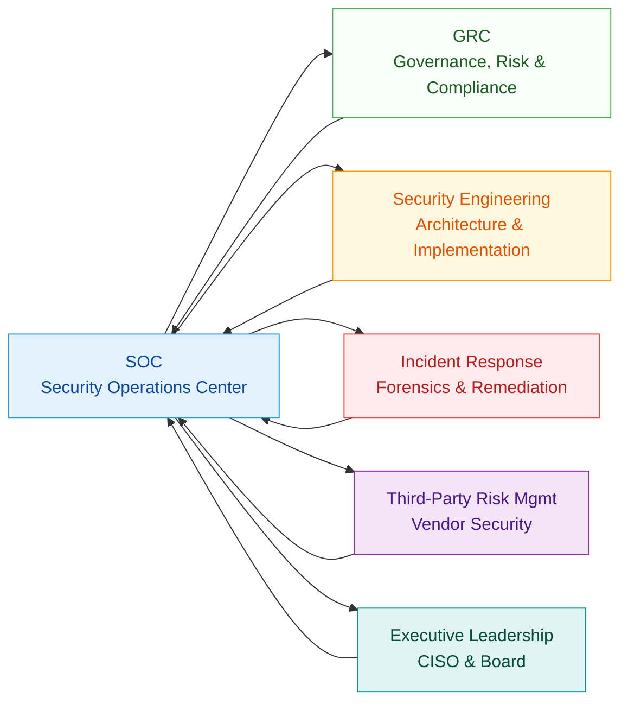
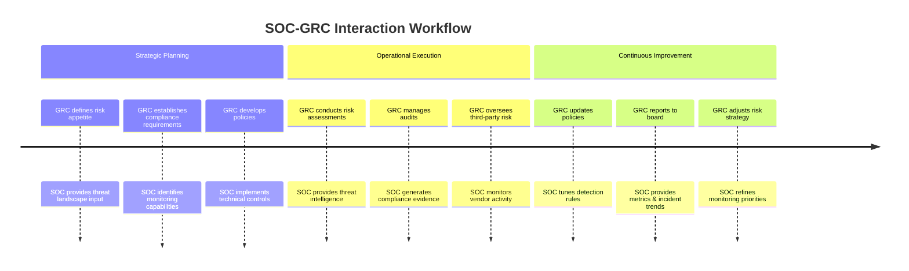
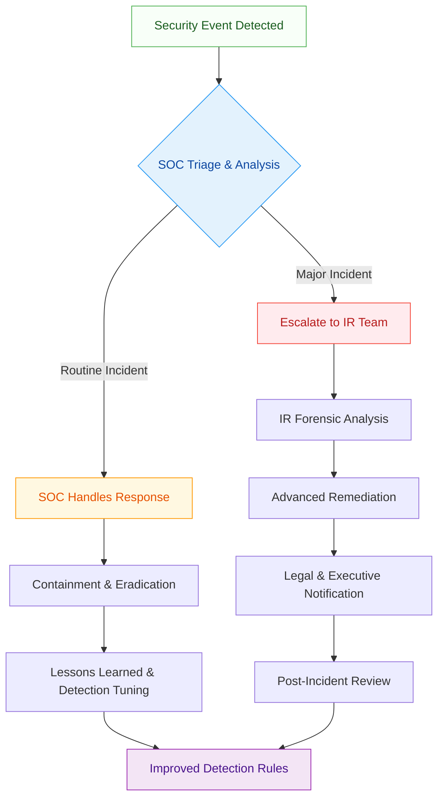
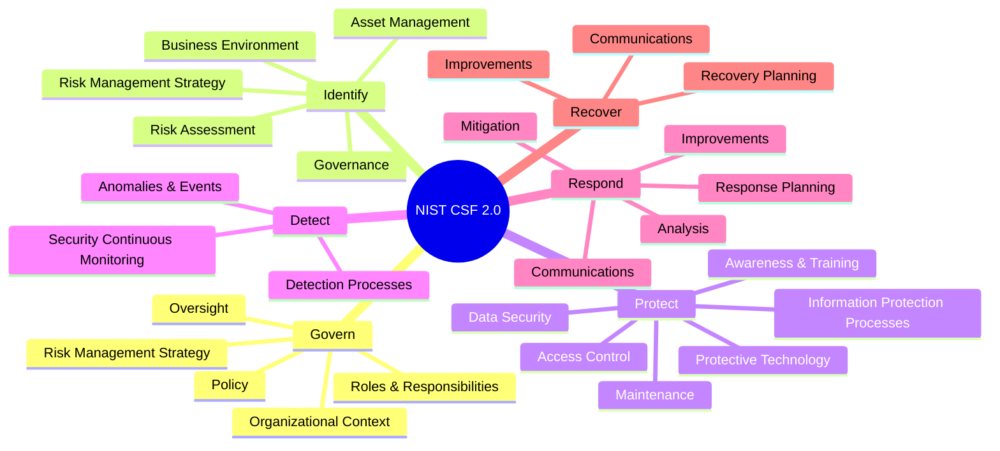
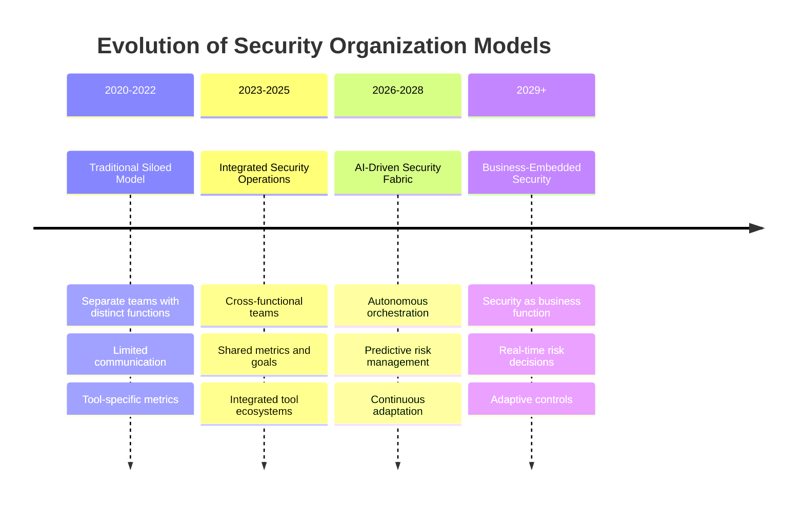

---
tags: [soc]
---
# The SOC's Role in the Broader Security Organization: A Full-Stack Lesson


## TCM Exam Objectives

- **Describe the SOC as the operational hub** – Explain how the SOC integrates with GRC, Security Engineering, Incident Response, Third-Party Risk Management, and Executive Leadership.
- **Understand the SOC-GRC relationship** – Articulate how GRC provides policy/risk direction and SOC delivers operational execution and compliance evidence.
- **Explain the SOC–Security Engineering feedback loop** – Describe how Engineering builds/ tunes tools and SOC provides operational requirements and detection feedback.
- **Map escalation between SOC and Incident Response** – Know the tiered response model: SOC handles routine incidents, IR handles major breaches.
- **Identify common SOC organizational models** – Compare centralized, distributed, hybrid, outsourced (MSSP), and virtual SOC models and their reporting structures.
- **Understand the CISO–SOC Manager relationship** – Know how SOC Manager reports to CISO and what each party provides (strategic direction vs. operational metrics).
- **Align SOC operations with NIST CSF 2.0** – Map SOC activities to the six CSF functions: Govern, Identify, Protect, Detect, Respond, Recover.
- **Recognize compliance frameworks** – Know SOC's role in SOC 2, PCI DSS, ISO 27001, HIPAA, GDPR, and NIST CSF compliance evidence.

# The SOC's Role in the Broader Security Organization: A Full-Stack Lesson

## 🎯 Lesson Overview
This lesson explores how the Security Operations Center (SOC) functions as the operational heart of an organization's security ecosystem, interacting with and enabling other critical security functions. We'll examine the SOC's strategic positioning, its relationships with governance, engineering, and compliance teams, and how it drives overall security effectiveness.



📌 **Exam Tip:** The PSAA exam frequently tests the concept that the SOC is the **operational hub** connecting all security functions. A common question presents a scenario where a security function operates in isolation — the correct answer identifies the need for SOC integration. Know that the SOC is NOT just a monitoring team; it's the central nervous system of security operations.

## 1. 🏗️ SOC Positioning in the Security Ecosystem

### 1.1 The SOC as the Operational Hub
The Security Operations Center serves as the **central nervous system** of an organization's security infrastructure. Unlike other security functions that may focus on specific domains (e.g., compliance, architecture), the SOC has **end-to-end visibility** and responsibility for detecting and responding to threats across the entire IT environment 【turn0search11】. This positions the SOC as the critical bridge between strategic security initiatives and operational execution.

### 1.2 Core Relationships in the Security Organization
The SOC doesn't operate in isolation—it functions as part of an interconnected security ecosystem with several key relationships:

<details>
<summary>📊 Detailed Security Function Interaction Map</summary>

| **Security Function** | **Primary Responsibility** | **Interaction with SOC** | **Key Deliverables to SOC** |
|----------------------|---------------------------|-------------------------|----------------------------|
| **Governance, Risk & Compliance (GRC)** | Establish policies, manage risk, ensure compliance | Provides regulatory requirements, risk assessments, compliance mandates | Compliance reports, risk registers, audit requirements |
| **Security Engineering** | Design, implement, maintain security controls | Deploys and configures security tools, provides technical expertise | Architecture diagrams, tool configurations, vulnerability insights |
| **Incident Response (IR)** | Manage severe incidents, forensics | Handles escalated incidents, provides forensic analysis | Incident reports, forensic findings, remediation guidance |
| **Third-Party Risk Management** | Assess and monitor vendor security | Provides vendor risk context, alerts on third-party incidents | Vendor risk assessments, supply chain threat intel |
| **Executive Leadership (CISO)** | Strategic direction, resource allocation | Provides strategic priorities, funding, executive support | Strategic objectives, budget approvals, organizational context |
| **Legal & Privacy** | Regulatory interpretation, legal counsel | Provides legal requirements, notifies of regulatory obligations | Legal hold instructions, privacy impact assessments |
| **IT Operations** | System administration, network management | Provides system access, implements SOC recommendations | System logs, access credentials, change notifications |
| **Human Resources** | Employee lifecycle management | Provides employee context, assists with insider threat investigations | Employee data, termination notices, training records |

</details>

## 2. 🤝 SOC Interactions with Key Security Functions

### 2.1 SOC and Governance, Risk & Compliance (GRC)

#### The Strategic Partnership
The SOC and GRC functions form a **critical strategic partnership** where GRC provides the framework and direction, while the SOC delivers operational execution and feedback 【turn0search6】【turn0search8】. This relationship ensures security operations align with business objectives and regulatory requirements.



#### Key Integration Points
- **Policy Translation**: GRC develops high-level policies; SOC translates these into **technical detection rules** and **monitoring configurations** 【turn0search6】
- **Compliance Monitoring**: GRC defines compliance requirements; SOC implements **continuous monitoring** to ensure adherence 【turn0search7】
- **Risk-Based Prioritization**: GRC maintains the **risk register**; SOC prioritizes alerts and investigations based on business risk 【turn0search6】
- **Audit Support**: GRC manages audits; SOC provides **evidence collection** and **incident documentation** 【turn0search7】

<details>
<summary>🔧 Technical Implementation: GRC-SOC Integration</summary>

**Example Integration Architecture:**
```
┌─────────────────┐    ┌─────────────────┐    ┌─────────────────┐
│   GRC Platform   │    │  SOC SIEM/SOAR  │    │   Ticketing     │
│  (Risk Register, │◄──►│  (Alerts,       │◄──►│   System        │
│   Compliance)    │    │   Incidents)    │    │  (Change Mgmt)  │
└────────┬────────┘    └────────┬────────┘    └────────┬────────┘
         │                      │                      │
         └──────────────────────┼──────────────────────┘
                                │
                    ┌───────────┴───────────┐
                    │   Integration Layer   │
                    │   (APIs, Webhooks,    │
                    │   Data Synchronization)│
                    └───────────────────────┘
```

**Key Integration Capabilities:**
- **Risk-based alerting**: SIEM queries GRC risk register to prioritize alerts
- **Compliance dashboards**: SOC tools push compliance metrics to GRC dashboards
- **Automated evidence collection**: SOAR playbooks gather audit evidence
- **Change ticket integration**: Security changes automatically update GRC system
</details>

### 2.2 SOC and Security Engineering

#### The Build-Operate Collaborative Model
Security Engineering designs and implements the security architecture, while the SOC operates and monitors it. This creates a **continuous feedback loop** where engineering provides tools and configurations, and SOC provides operational insights and tuning recommendations 【turn0search11】【turn0search21】.

#### Collaboration Areas
1. **Tool Deployment & Configuration**: Engineering selects and deploys security tools; SOC provides **operational requirements** and **tuning feedback** 【turn0search21】
2. **Detection Engineering**: Engineering develops detection rules; SOC provides **threat intelligence** and **false positive feedback** 【turn0search11】
3. **Vulnerability Management**: Engineering identifies and patches vulnerabilities; SOC provides **exploitation intelligence** and **monitoring coverage** 【turn0search11】
4. **Architecture Review**: Engineering designs new systems; SOC provides **monitoring requirements** and **security considerations** 【turn0search21】

> 💡 **Best Practice**: Establish a **joint engineering-SOC working group** that meets biweekly to review tool performance, discuss detection gaps, and plan improvements. This ensures operational insights inform architectural decisions.

### 2.3 SOC and Incident Response

#### The Escalation and Support Partnership
While the SOC handles **routine incidents** and **monitoring**, the Incident Response team manages **severe breaches** requiring specialized skills. This creates a tiered response model where the SOC serves as the **first line of defense** and IR as the **specialized escalation point** 【turn0search0】【turn0search11】.



#### Key Coordination Points
- **Escalation Criteria**: Define clear thresholds for when incidents move from SOC to IR 【turn0search0】
- **Forensic Support**: SOC preserves evidence; IR conducts **deep forensic analysis** 【turn0search11】
- **Communication Protocols**: Establish **notification chains** for major incidents 【turn0search11】
- **Post-Incident Integration**: Both teams participate in **lessons learned** sessions to improve future response 【turn0search11】

## 3. 🏢 Organizational Structures and Reporting Lines

### 3.1 Common SOC Organizational Models

| **Model** | **Reporting Structure** | **Advantages** | **Disadvantages** | **Best For** | **PSAA Exam Tip** |
|-----------|-------------------------|---------------|------------------|--------------|-------------------|
| **Centralized SOC** | Reports to CISO | Clear accountability, standardized processes, resource efficiency | May lack business context, slower response to local issues | Large enterprises with homogeneous environments | Most common model tested |
| **Distributed SOC** | Reports to regional IT leaders | Better business alignment, faster local response | Inconsistent practices, higher costs, coordination challenges | Global organizations with diverse operations | Know the trade-off: speed vs. consistency |
| **Hybrid SOC** | Core team reports to CISO, regional teams to local leaders | Balances standardization with local responsiveness | Complex governance, potential conflicts | Large organizations with both global and regional needs | Most balanced model |
| **Outsourced SOC (MSSP)** | Reports to vendor, relationship managed by internal security team | 24/7 coverage, access to expertise, predictable costs | Less control, potential communication gaps, vendor lock-in | Organizations lacking internal resources or needing specialized skills | Cost-effective but less control |
| **Virtual SOC** | Matrixed from various teams, coordinated by security lead | Cost-effective, leverages existing expertise | Coordination challenges, unclear authority | Smaller organizations or those with mature security teams | Least formal, highest flexibility |

📌 **Exam Tip:** The PSAA exam will ask you to match SOC models to organizational needs. Remember: Centralized = consistent but slow locally. Distributed = fast locally but inconsistent. Hybrid = balanced. Outsourced = cost-effective but less control. Virtual = flexible but coordination-heavy.

<details>
<summary>📊 Comparison of SOC Organizational Models</summary>

| **Model** | **Reporting Structure** | **Advantages** | **Disadvantages** | **Best For** |
|-----------|-------------------------|---------------|------------------|--------------|
| **Centralized SOC** | Reports to CISO | Clear accountability, standardized processes, resource efficiency | May lack business context, slower response to local issues | Large enterprises with homogeneous environments |
| **Distributed SOC** | Reports to regional IT leaders | Better business alignment, faster local response | Inconsistent practices, higher costs, coordination challenges | Global organizations with diverse operations |
| **Hybrid SOC** | Core team reports to CISO, regional teams to local leaders | Balances standardization with local responsiveness | Complex governance, potential conflicts | Large organizations with both global and regional needs |
| **Outsourced SOC (MSSP)** | Reports to vendor, relationship managed by internal security team | 24/7 coverage, access to expertise, predictable costs | Less control, potential communication gaps, vendor lock-in | Organizations lacking internal resources or needing specialized skills |
| **Virtual SOC** | Matrixed from various teams, coordinated by security lead | Cost-effective, leverages existing expertise | Coordination challenges, unclear authority | Smaller organizations or those with mature security teams |

</details>

### 3.2 The CISO-SOC Manager Relationship
The SOC Manager typically reports directly to the **Chief Information Security Officer (CISO)**, creating a direct line between strategic security leadership and operational execution 【turn0search12】. This relationship is critical for:

- **Strategic Alignment**: Ensuring SOC operations support CISO's strategic objectives 【turn0search13】
- **Resource Advocacy**: SOC Manager communicates resource needs to CISO for budget allocations 【turn0search14】
- **Performance Reporting**: SOC provides metrics and incident trends to inform CISO's executive reporting 【turn0search13】
- **Risk Communication**: SOC alerts CISO to emerging threats and operational risks 【turn0search11】

<details>
<summary>🔧 Sample SOC Organizational Structure</summary>

```
Chief Information Security Officer (CISO)
│
├── Security Operations Center (SOC)
│   ├── SOC Manager
│   │   ├── Shift Supervisors (24/7 coverage)
│   │   ├── Tier 1 Analysts (Alert Triage)
│   │   ├── Tier 2 Analysts (Investigation)
│   │   ├── Tier 3 Analysts (Advanced Response)
│   │   ├── Detection Engineers
│   │   └── Threat Hunters
│   │
│   └── Security Engineering
│       ├── Security Architects
│       ├── Tool Administrators
│       └── Vulnerability Management
│
├── Governance, Risk & Compliance (GRC)
│   ├── Compliance Managers
│   ├── Risk Analysts
│   └── Policy Specialists
│
├── Incident Response (IR)
│   ├── IR Lead
│   ├── Forensic Analysts
│   └── Crisis Management
│
└── Other Security Functions
    ├── Third-Party Risk Management
    ├── Security Awareness Training
    └── Physical Security
```

**Key Considerations:**
- **Clear Role Delineation**: Avoid overlap between SOC and IR responsibilities
- **Career Pathways**: Establish progression from Tier 1 to Tier 3 and into specialized roles
- **Cross-Training**: Ensure analysts understand multiple technologies and threat vectors
- **Succession Planning**: Develop future SOC leaders through mentoring and rotation programs
</details>

## 4. 📋 Governance Framework Alignment

### 4.1 NIST CSF 2.0 and the SOC

The **NIST Cybersecurity Framework 2.0** introduces the **Govern function**, explicitly recognizing the importance of organizational governance in cybersecurity 【turn0search16】【turn0search17】. This has significant implications for how the SOC operates within the broader security organization.



#### SOC's Role in CSF Functions
- **Govern**: SOC provides **operational data** to inform governance decisions 【turn0search16】
- **Identify**: SOC maintains **asset inventories** and identifies critical systems 【turn0search11】
- **Protect**: SOC implements and monitors **protective controls** 【turn0search11】
- **Detect**: SOC performs **continuous monitoring** and threat detection 【turn0search11】
- **Respond**: SOC executes **incident response** and containment 【turn0search11】
- **Recover**: SOC supports **system restoration** and lessons learned 【turn0search11】

### 4.2 Compliance and the SOC

The SOC plays a crucial role in demonstrating compliance with various regulatory frameworks:

<details>
<summary>📊 SOC's Role in Common Compliance Frameworks</summary>

| **Framework** | **SOC's Primary Role** | **Key Activities** | **Deliverables** |
|---------------|------------------------|-------------------|------------------|
| **SOC 2** | Security monitoring & incident response | Monitor controls, respond to incidents, maintain evidence | Incident reports, monitoring logs, evidence packages |
| **PCI DSS** | Payment card environment monitoring | Monitor cardholder data environment, detect unauthorized access | Access logs, intrusion detection records, incident reports |
| **ISO 27001** | ISMS monitoring & measurement | Monitor security controls, measure effectiveness, identify incidents | Performance metrics, incident records, corrective actions |
| **HIPAA** | ePHI monitoring & breach notification | Monitor access to ePHI, detect potential breaches, support notifications | Access logs, breach assessment reports, mitigation documentation |
| **GDPR** | Personal data monitoring & breach response | Monitor processing of personal data, detect breaches, support notifications | Data processing records, breach notifications, impact assessments |
| **NIST CSF** | Framework implementation & measurement | Implement CSF controls, measure effectiveness, report on posture | Implementation status, effectiveness metrics, improvement plans |

</details>

## 5. 🔄 Operational Integration and Communication

### 5.1 Daily Operational Interactions

The SOC maintains **continuous operational interactions** with multiple security functions to ensure coordinated protection:

- **Morning Briefings**: SOC shares overnight incidents with GRC, engineering, and IR teams 【turn0search11】
- **Change Coordination**: SOC reviews scheduled changes with engineering to assess security impact 【turn0search21】
- **Threat Intelligence Sharing**: SOC distributes relevant threat intel to appropriate teams 【turn0search11】
- **Vendor Coordination**: SOC coordinates with third-party risk management on vendor-related threats 【turn0search11】
- **Executive Updates**: SOC provides regular metrics and incident summaries to CISO 【turn0search13】

### 5.2 Communication Protocols and Tools

<details>
<summary>🛠️ Effective Communication Architecture</summary>

**Primary Communication Channels:**
1. **SIEM Platform**: Central hub for security alerts and incidents
2. **Ticketing System**: Tracks all security requests and incidents
3. **ChatOps Platform**: Real-time communication for incident response
4. **Documentation Repository**: Stores policies, procedures, and lessons learned
5. **Reporting Dashboards**: Provide visibility into metrics and KPIs

**Communication Protocols by Incident Severity:**
- **Critical Incidents**: Immediate phone notification to CISO, IR Lead, Legal
- **High Severity**: Immediate chat notification to relevant teams, hourly updates
- **Medium Severity**: Daily summary to management, ticket updates
- **Low Severity**: Weekly trend report, monthly metrics summary

**Key Communication Success Factors:**
- **Clear Escalation Paths**: Defined who to contact for different incident types
- **Regular Synchronization**: Daily stand-ups, weekly status meetings
- **Shared Documentation**: Common repositories for procedures and evidence
- **Cross-Training**: Teams understand each other's capabilities and constraints
</details>

## 6. 📈 Measuring SOC Effectiveness in the Broader Context

### 6.1 Metrics That Demonstrate Organizational Value

The SOC's effectiveness should be measured not just by operational metrics, but by its contribution to **organizational security posture** and **business objectives**:

<details>
<summary>📊 Comprehensive SOC Metrics Framework</summary>

| **Metric Category** | **Specific Metrics** | **Business Value** | **Target Benchmark** |
|---------------------|----------------------|-------------------|----------------------|
| **Detection Effectiveness** | MTTD, Detection Coverage, False Positive Rate | Reduced exposure window, improved threat visibility | MTTD < 24 hours, Coverage > 65% |
| **Response Efficiency** | MTTR, Containment Time, Recovery Time | Minimized business impact, faster restoration | MTTR < 4 hours, Containment < 1 hour |
| **Operational Efficiency** | Alerts per Analyst, Analyst Utilization, Tool ROI | Cost-effective operations, resource optimization | 20-30 alerts/analyst/shift, >70% utilization |
| **Business Alignment** | Incident Recurrence Rate, Risk Reduction %, Compliance Score | Direct contribution to business risk reduction | Recurrence < 5%, Risk reduction > 20% annually |
| **Cross-Functional Integration** | Joint Exercises, Shared Intelligence, Coordinated Responses | Improved organizational security coordination | Quarterly joint exercises, monthly intel sharing |

</details>

### 6.2 Reporting to Executive Leadership

The SOC must communicate its value in business terms to executive leadership:

```mermaid
flowchart LR
    A[SOC Operational Metrics] --> B[Security Risk Reduction]
    B --> C[Business Impact]
    C --> D[Executive Dashboard]
    
    subgraph A [Operational Layer]
        A1[MTTD/MTTR]
        A2[Alert Volume]
        A3[Tool Performance]
    end
    
    subgraph B [Risk Layer]
        B1[Threat Mitigation]
        B2[Vulnerability Reduction]
        B3[Compliance Adherence]
    end
    
    subgraph C [Business Layer]
        C1[Financial Impact]
        C2[Operational Continuity]
        C3[Reputation Protection]
    end
    
    subgraph D [Executive View]
        D1[Risk Posture]
        D2[Resource Allocation]
        D3[Strategic Decision Support]
    end
    
    style A fill:#e3f2fd,stroke:#2196f3,color:#0d47a1
    style B fill:#f8fff8,stroke:#4caf50,color:#1b5e20
    style C fill:#fff8e1,stroke:#ff9800,color:#e65100
    style D fill:#e0f2f1,stroke:#009688,color:#004d40
```



## 7. 🚀 Building an Integrated Security Organization

### 7.1 Implementation Roadmap

<details>
<summary>🗺️ 12-Month Integration Plan</summary>

**Months 1-3: Foundation Building**
- Establish clear roles and responsibilities across security functions
- Implement integrated ticketing and documentation systems
- Develop communication protocols and escalation procedures
- Conduct cross-training between SOC, GRC, and engineering teams

**Months 4-6: Process Integration**
- Implement risk-based prioritization for SOC alerts using GRC risk register
- Establish joint engineering-SOC working groups for tool optimization
- Develop integrated incident response procedures with clear handoffs
- Begin regular threat intelligence sharing across all security functions

**Months 7-9: Technology Integration**
- Integrate GRC platform with SOC tools for automated evidence collection
- Implement ChatOps for real-time collaboration during incidents
- Deploy unified dashboards providing cross-functional visibility
- Establish automated workflows between security functions

**Months 10-12: Maturation & Optimization**
- Conduct comprehensive joint exercises simulating major incidents
- Implement continuous improvement processes based on lessons learned
- Develop metrics demonstrating cross-functional effectiveness
- Begin advanced integration projects (AI/ML, automation expansion)
</details>

### 7.2 Overcoming Common Challenges

| **Challenge** | **Impact** | **Mitigation Strategy** |
|---------------|------------|-------------------------|
| **Siloed Operations** | Inconsistent security postures, gaps in coverage | Establish cross-functional teams, shared metrics, integrated tools |
| **Communication Gaps** | Delayed response, duplicated efforts | Implement clear protocols, regular syncs, ChatOps platforms |
| **Competing Priorities** | Resource conflicts, delayed initiatives | Executive sponsorship, clear prioritization framework, regular alignment meetings |
| **Tool Integration Issues** | Data silos, manual processes | API-first architecture, middleware platforms, phased integration approach |
| **Skills Gaps** | Limited cross-functional expertise | Cross-training programs, job rotations, collaborative exercises |

> ⚠️ **Critical Success Factor**: Executive sponsorship is essential for successful integration. The CISO must actively champion cross-functional collaboration and allocate resources to support integration initiatives 【turn0search13】【turn0search14】.

## 8. 🔮 Future Trends in Security Organization Integration

### 8.1 Emerging Organizational Models



### 8.2 Technology Enablers for Better Integration

<details>
<summary>🚀 Emerging Technologies Enhancing Integration</summary>

1. **AI-Powered Security Orchestration**
   - Automates cross-functional workflows
   - Provides predictive recommendations
   - Enables autonomous response for routine incidents

2. **Extended Detection and Response (XDR)**
   - Breaks down traditional security silos
   - Provides unified visibility across layers
   - Simplifies cross-tool investigations

3. **Cloud-Based Security Platforms**
   - Enable shared data lakes
   - Provide scalable integration capabilities
   - Support distributed teams

4. **Zero Trust Architecture**
   - Requires continuous verification across all functions
   - Drives integration of identity, network, and application security
   - Creates common policy framework

5. **Security Data Fabrics**
   - Unify data across security tools
   - Enable advanced analytics and ML
   - Provide consistent data across functions
</details>

## 9. 📚 Lesson Summary and Key Takeaways

### 9.1 Core Concepts Recap

1. **SOC as Operational Hub**: The SOC serves as the central operational function that coordinates and executes security monitoring, detection, and response across the organization 【turn0search11】.

2. **Critical Interdependencies**: The SOC's effectiveness depends on strong relationships with GRC (for direction), engineering (for tools), IR (for escalation), and executive leadership (for support) 【turn0search6】【turn0search11】【turn0search13】.

3. **Governance Alignment**: The SOC must align with organizational governance frameworks, particularly NIST CSF 2.0's Govern function, to ensure operations support business objectives 【turn0search16】【turn0search17】.

4. **Communication is Key**: Effective communication protocols and tools are essential for coordinating across security functions and ensuring rapid response to incidents 【turn0search11】.

5. **Metrics Matter**: The SOC should measure not just operational metrics, but its contribution to organizational risk reduction and business objectives 【turn0search13】.

6. **Integration is Ongoing**: Building an integrated security organization is a journey, not a destination, requiring continuous improvement and adaptation to evolving threats and business needs 【turn0search21】.

### 9.2 Practical Application Checklist

<details>
<summary>✅ Integration Implementation Checklist</summary>

**Governance & Alignment**
- [ ] Clear roles and responsibilities defined across all security functions
- [ ] Regular alignment meetings between SOC, GRC, engineering, and IR
- [ ] Shared metrics and KPIs that demonstrate cross-functional effectiveness
- [ ] Executive sponsorship for integration initiatives

**Process Integration**
- [ ] Integrated incident response procedures with clear handoffs
- [ ] Risk-based prioritization using GRC risk register
- [ ] Joint investigation procedures for complex incidents
- [ ] Coordinated vulnerability management processes

**Technology Integration**
- [ ] Integrated ticketing system spanning all security functions
- [ ] API connections between GRC, SOC, and engineering tools
- [ ] Shared documentation repository with version control
- [ ] ChatOps platform for real-time collaboration

**People & Culture**
- [ ] Cross-training programs between security functions
- [ ] Joint exercises and simulations
- [ ] Career pathways that encourage cross-functional experience
- [ ] Regular knowledge sharing sessions

**Measurement & Improvement**
- [ ] Metrics that measure organizational, not just functional, effectiveness
- [ ] Regular reviews of integration effectiveness
- [ ] Continuous improvement process based on lessons learned
- [ ] Regular benchmarking against industry best practices
</details>

## 10. 📖 Additional Resources and Next Steps

### 10.1 Recommended Reading and Resources

- **NIST Cybersecurity Framework 2.0**: Provides the governance foundation for integrated security operations 【turn0search16】【turn0search18】
- **SOC-CMM Model**: Capability maturity model specifically for assessing SOC effectiveness 【turn0search21】
- **ITIL Security Management**: Framework for integrating security with IT service management
- **ISO 27001**: International standard for information security management systems
- **MITRE ATT&CK Framework**: Knowledge base for adversary tactics and techniques

### 10.2 Hands-On Practice Recommendations

1. **Conduct a Integration Assessment**: Evaluate your organization's current state of security function integration using the checklist above
2. **Develop a Cross-Functional Exercise**: Design and conduct a simulation that requires coordination between SOC, GRC, engineering, and IR teams
3. **Create a Communication Protocol**: Document and implement communication protocols for different incident scenarios
4. **Implement One Integration Improvement**: Identify and implement one specific improvement to enhance integration between security functions
5. **Establish Shared Metrics**: Develop metrics that measure cross-functional effectiveness and begin tracking them

### 10.3 Certification and Professional Development

- **Certified Information Security Manager (CISM)**: Focuses on management and governance
- **Certified Information Systems Security Professional (CISSP)**: Broad security management certification
- **Certified in Risk and Information Systems Control (CRISC)**: Risk management focus
- **SOC-CMM Assessor Certification**: For assessing SOC maturity
- **ITIL 4 Strategic Leader**: For aligning security with IT service management

---

> 🎓 **Final Thought**: The SOC's role in the broader security organization is not just about operational excellence, but about **strategic integration**. The most effective security organizations are those where the SOC serves as the operational hub that connects and enables all other security functions, creating a unified defense that is greater than the sum of its parts. By understanding these relationships and actively working to strengthen them, security professionals can build more resilient organizations capable of defending against evolving cyber threats.

This comprehensive lesson has explored the multifaceted role of the SOC within the broader security ecosystem. By applying these concepts and continuously working to improve integration across security functions, organizations can build more effective and efficient security programs that truly protect their business objectives.