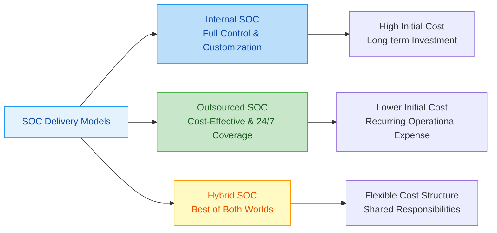
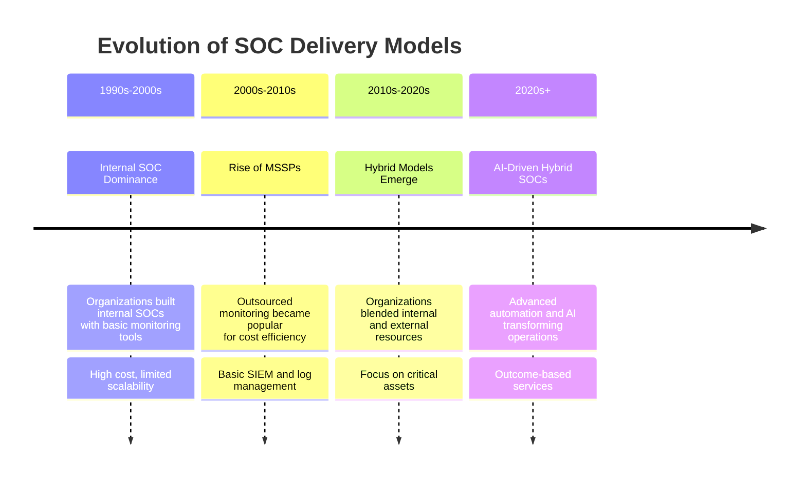
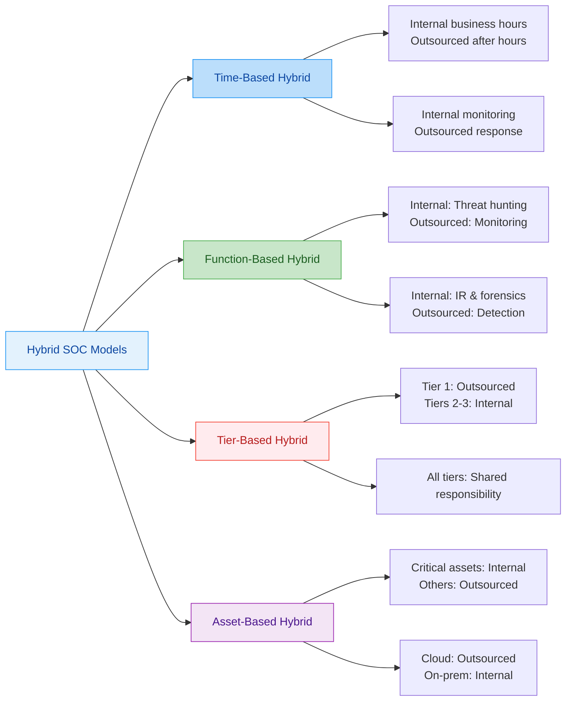
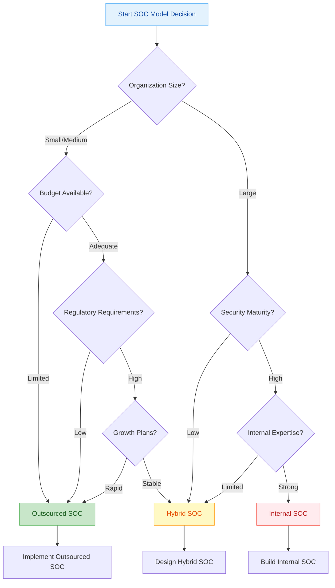
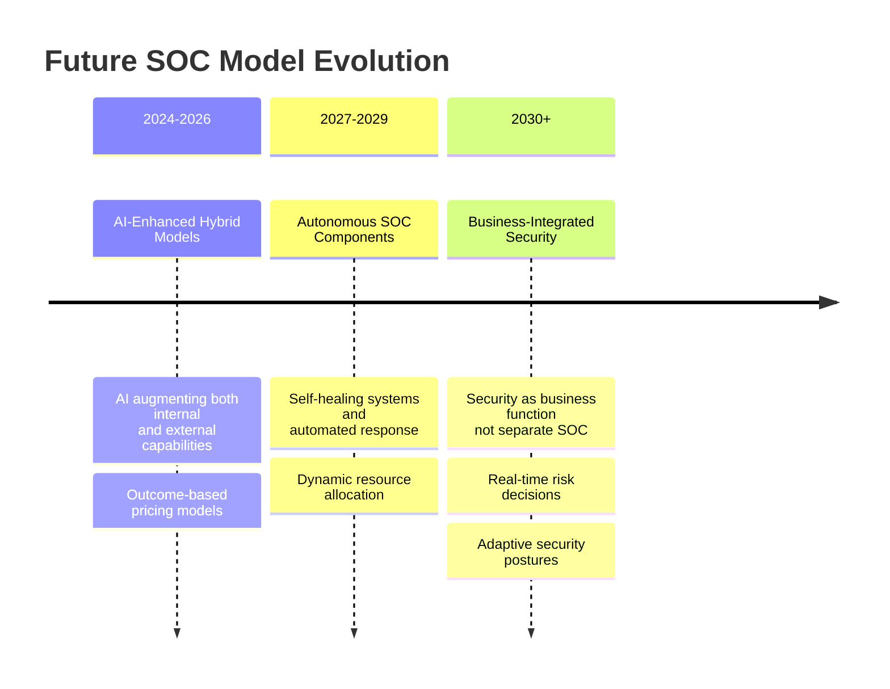

---
tags: [soc]
---
# Comprehensive Full-Stack Lesson: Internal, Outsourced, and Hybrid SOC Models

## TCM Exam Objectives

- **Compare Internal, Outsourced, and Hybrid SOC models** – Know the characteristics, initial cost, operational cost, setup time, control level, and 24/7 coverage for each.
- **Understand cost structures** – Know approximate ranges: Internal SOC ($500K-$2M+ initial, $1M-$3M+ annual), Outsourced ($10K-$50K setup, $5K-$50K+/month), Hybrid ($200K-$800K initial, $500K-$1.8M annual).
- **Identify advantages and challenges of each model** – For Internal: full control but high cost. For Outsourced: 24/7 coverage but less control. For Hybrid: balanced but complex.
- **Recognize hybrid SOC architectures** – Understand time-based, function-based, tier-based, and asset-based hybrid models.
- **Apply the SOC model decision framework** – Use organizational size, budget, security maturity, regulatory requirements, and risk tolerance to recommend a model.
- **Understand MSSP vs. MDR** – Distinguish Managed Security Service Provider (monitoring/log management) from Managed Detection and Response (active threat hunting and response).
- **Interpret the 5-year TCO comparison** – Know that Internal SOC costs ~$11.5M, Outsourced ~$1.83M, Hybrid ~$6.6M over 5 years for typical mid-size organizations.
- **Identify maturity levels by delivery type** – Know how each model progresses from Level 1 (Initial) to Level 5 (Optimizing).

# Comprehensive Full-Stack Lesson: Internal, Outsourced, and Hybrid SOC Models

## 🎯 Lesson Overview
This lesson provides an in-depth exploration of the three primary Security Operations Center (SOC) delivery models: **Internal (In-House)**, **Outsourced (MSSP/MDR)**, and **Hybrid**. You'll learn about their architectures, cost structures, operational implications, and how to strategically select and implement the right model for your organization's specific needs.

📌 **Exam Tip:** The PSAA exam frequently asks you to recommend a SOC model based on a scenario. For a "small organization with limited budget" → Outsourced/MSSP. For a "large bank with strict regulatory requirements" → Internal SOC. For a "mid-size company that wants 24/7 coverage but maintains internal expertise" → Hybrid. Memorize the cost ranges — they're testable numbers.

## 1. 📊 SOC Model Fundamentals

### 1.1 Defining the SOC Models

**Internal (In-House) SOC**:
A fully internal security operations center where the organization builds, staffs, and operates its own SOC using its own resources, infrastructure, and personnel. The organization maintains complete control over all aspects of security operations 【turn0search0】【turn0search3】.

**Outsourced SOC (MSSP/MDR)**:
A model where an organization engages a third-party Managed Security Service Provider (MSSP) or Managed Detection and Response (MDR) provider to monitor, detect, and respond to security incidents on their behalf. The provider assumes responsibility for security operations based on a service level agreement (SLA) 【turn0search4】【turn0search8】.

**Hybrid SOC**:
A collaborative model that combines elements of both internal and outsourced SOCs. Organizations maintain some security functions in-house while outsourcing others to a third-party provider, creating a tailored approach that leverages the strengths of both models 【turn0search14】【turn0search17】.

### 1.2 Historical Evolution of SOC Models

## 2. 🔍 Detailed Model Comparison

### 2.1 Comprehensive Feature Comparison

📊 Detailed SOC Model Comparison Matrix

| **Characteristic** | **Internal SOC** | **Outsourced SOC (MSSP/MDR)** | **Hybrid SOC** |
|-------------------|------------------|-------------------------------|----------------|
| **Initial Cost** | Very High ($500K-$2M+) 【turn0search12】 | Low to Medium (Setup fees) | Medium (Shared investment) |
| **Operational Cost** | High (Salaries, infrastructure, tools) | Medium (Recurring monthly fees) | Medium-High (Internal + external costs) |
| **Setup Time** | 6-18 months 【turn0search3】 | 2-8 weeks | 3-9 months |
| **Control Level** | Complete control | Limited control (SLA-dependent) | Shared control with defined boundaries |
| **Customization** | Fully customizable | Limited to provider's capabilities | Highly customizable in retained areas |
| **24/7 Coverage** | Challenging (staffing) | Included in service | Achievable through smart division |
| **Expertise Access** | Limited to hired staff | Broad expertise across industries | Best of both worlds |
| **Scalability** | Slow and expensive | Fast and flexible | Moderate (depends on model) |
| **Regulatory Compliance** | Full control over evidence | Provider manages compliance | Shared responsibility |
| **Incident Response** | Internal team handles | Provider handles per SLA | Defined escalation paths |
| **Technology Stack** | Fully owned and operated | Provider's platform | Integrated internal and external tools |
| **Knowledge Retention** | High (institutional knowledge) | Low (provider turnover) | Medium (depends on structure) |

### 2.2 Cost Structure Analysis

#### Internal SOC Cost Breakdown
- **Initial Investment**: $500,000 - $2,000,000+ 【turn0search12】
  - SIEM platform: $100,000 - $500,000
  - Security tools (EDR, NDR, etc.): $200,000 - $800,000
  - Infrastructure (servers, storage, networking): $100,000 - $300,000
  - Facility and operations center setup: $50,000 - $200,000

- **Annual Operational Costs**: $1,000,000 - $3,000,000+
  - Staffing (15-25 personnel): $800,000 - $2,500,000
  - Tool licensing and maintenance: $200,000 - $500,000
  - Training and certification: $50,000 - $100,000
  - Infrastructure and facilities: $100,000 - $300,000

#### Outsourced SOC Cost Structure
- **Initial Setup**: $10,000 - $50,000 (onboarding and configuration)
- **Monthly Recurring Costs**: $5,000 - $50,000+ depending on services
  - Basic monitoring: $5,000 - $15,000/month
  - Advanced detection & response: $15,000 - $35,000/month
  - Full MDR with threat hunting: $25,000 - $50,000+/month

#### Hybrid SOC Cost Model
- **Initial Investment**: $200,000 - $800,000 (internal infrastructure + setup)
- **Annual Operational Costs**: $500,000 - $1,800,000
  - Internal team (5-10 personnel): $400,000 - $1,200,000
  - Outsourced services: $100,000 - $600,000 annually
  - Technology integration: $50,000 - $200,000

## 3. 🏗️ Internal SOC: Comprehensive Analysis

### 3.1 Architecture and Components

```mermaid
flowchart TD
    A[Internal SOC Architecture] --> B[Data Collection Layer]
    A --> C[Analysis & Detection Layer]
    A --> D[Response & Recovery Layer]
    A --> E[Management & Reporting Layer]
    
    B --> B1[Network Sensors<br>IDS/IPS, NetFlow]
    B --> B2[Endpoint Agents<br>EDR, Syslog]
    B --> B3[Cloud Connectors<br>API integrations]
    B --> B4[Application Logs<br>WAF, Database]
    
    C --> C1[SIEM Platform<br>Correlation & rules]
    C --> C2[UEBA<br>Behavioral analytics]
    C --> C3[Threat Intelligence<br>Feeds & platforms]
    C --> C4[SOAR<br>Automation & orchestration]
    
    D --> D1[Incident Response<br>Playbooks & runbooks]
    D --> D2[Forensic Tools<br>Memory & disk analysis]
    D --> D3[Containment<br>Network & endpoint isolation]
    D --> D4[Recovery<br>System restoration]
    
    E --> E1[Case Management<br>Ticketing & tracking]
    E --> E2[Reporting Dashboards<br>Metrics & KPIs]
    E --> E3[Compliance<br>Audit & evidence]
    E --> E4[Knowledge Management<br>Lessons learned]
    
    style A fill:#e3f2fd,stroke:#2196f3,color:#0d47a1
    style B fill:#bbdefb,stroke:#2196f3,color:#0d47a1
    style C fill:#c8e6c9,stroke:#4caf50,color:#1b5e20
    style D fill:#ffebee,stroke:#f44336,color:#b71c1c
    style E fill:#f3e5f5,stroke:#9c27b0,color:#4a148c
```

🔧 Internal SOC Technical Architecture

**Key Components:**
1. **Security Information and Event Management (SIEM)**: Central platform for log aggregation, correlation, and alerting
2. **User and Entity Behavior Analytics (UEBA)**: Machine learning-based anomaly detection
3. **Security Orchestration, Automation, and Response (SOAR)**: Workflow automation and incident response
4. **Endpoint Detection and Response (EDR)**: Advanced endpoint monitoring and response
5. **Network Detection and Response (NDR)**: Network traffic analysis and threat detection
6. **Threat Intelligence Platform (TIP)**: Aggregation and management of threat intelligence
7. **Case Management System**: Incident tracking and workflow management
8. **Reporting and Analytics Dashboards**: Performance metrics and executive reporting

### 3.2 Advantages and Challenges

#### **Advantages of Internal SOC** 【turn0search0】【turn0search3】:
- **Complete Control**: Full authority over security operations, priorities, and technologies
- **Deep Organizational Knowledge**: Intimate understanding of business context, systems, and data flows
- **Customization**: Tailored security controls and detection logic specific to organizational needs
- **Regulatory Compliance**: Direct control over evidence collection and audit processes
- **Intellectual Property Protection**: Sensitive security data remains within organizational boundaries
- **Integration**: Seamless integration with existing IT and security infrastructure
- **Long-term Cost Efficiency**: Potential for lower total cost of ownership over many years

#### **Challenges of Internal SOC** 【turn0search3】【turn0search11】:
- **High Initial Investment**: Significant upfront costs for technology, infrastructure, and facility setup
- **Staffing Difficulties**: Challenges in recruiting, training, and retaining skilled security professionals
- **24/7 Coverage**: Difficulty maintaining round-the-clock monitoring with internal staff
- **Technology Refresh**: Continuous need to update and maintain security tools and infrastructure
- **Scalability**: Challenges in quickly scaling operations to meet growing organizational needs
- **Expertise Gaps**: Limited access to specialized expertise across all security domains
- **Burnout Risk**: High-stress environment with potential for analyst burnout and turnover

### 3.3 Implementation Roadmap

🗺️ 18-Month Internal SOC Implementation Plan

**Phase 1: Foundation (Months 1-4)**
- Define SOC mission, scope, and governance structure
- Develop business case and secure budget approval
- Design SOC architecture and technology stack
- Establish facility and operational infrastructure
- Hire SOC Manager and core team members

**Phase 2: Technology Deployment (Months 5-9)**
- Implement SIEM platform and data collection infrastructure
- Deploy endpoint and network detection tools
- Integrate threat intelligence feeds
- Develop initial detection use cases and correlation rules
- Establish case management and reporting systems

**Phase 3: Operations Development (Months 10-13)**
- Develop incident response playbooks and procedures
- Create alert triage and escalation workflows
- Establish metrics and KPIs for performance measurement
- Conduct initial training and cross-training of staff
- Perform beta testing and tuning of detection systems

**Phase 4: Optimization and Maturity (Months 14-18)**
- Implement SOAR for automation and orchestration
- Develop threat hunting program
- Establish formal lessons learned process
- Conduct first purple team exercise
- Begin continuous improvement cycle

## 4. 🤝 Outsourced SOC: Comprehensive Analysis

### 4.1 Service Models and Offerings

📊 Outsourced SOC Service Tier Comparison

| **Service Tier** | **Basic Monitoring** | **Advanced MDR** | **Full-Spectrum MDR** |
|------------------|---------------------|------------------|----------------------|
| **Monitoring Coverage** | 24/7 log monitoring | 24/7 monitoring + response | 24/7 monitoring + response + hunting |
| **Detection Methods** | Signature-based | Behavioral analytics | AI/ML + behavioral + threat intelligence |
| **Response Capability** | Alerting only | Automated response + guidance | Full incident response + remediation |
| **Threat Intelligence** | Basic feeds | Curated intelligence | Custom intelligence + hunting |
| **Reporting** | Basic alerts | Regular reports + metrics | Real-time dashboards + executive reports |
| **Compliance Support** | Basic logging | Compliance reporting | Full audit support + evidence |
| **Cost Range** | $5K-$15K/month | $15K-$35K/month | $25K-$50K+/month |
| **Best For** | Compliance requirements | Growing organizations | Enterprises with mature security needs |

### 4.2 Outsourced SOC Advantages and Challenges

#### **Advantages of Outsourced SOC** 【turn0search4】【turn0search8】:
- **Cost Predictability**: Clear monthly costs without large capital investments
- **24/7 Coverage**: Immediate access to round-the-clock monitoring and response
- **Expertise Access**: Leverage provider's specialized skills and experience across industries
- **Faster Deployment**: Rapid implementation compared to building internal SOC
- **Scalability**: Easy to scale services up or down based on organizational needs
- **Advanced Technology**: Access to enterprise-class security tools without upfront costs
- **Reduced Management Overhead**: No need to manage security personnel or infrastructure
- **Focus on Core Business**: Allows organization to focus on primary business objectives

#### **Challenges of Outsourced SOC** 【turn0search0】【turn0search3】:
- **Loss of Control**: Limited control over security operations and priorities
- **Knowledge Transfer**: Provider may not fully understand organizational context
- **Communication Challenges**: Potential delays in communication and decision-making
- **Vendor Lock-in**: Difficulty switching providers due to integration and data migration
- **Customization Limitations**: Restricted to provider's standard offerings and workflows
- **Data Sensitivity**: Concerns about sharing sensitive security data with third parties
- **Response Time Variability**: Response times may vary based on SLA and provider workload
- **Quality Variability**: Service quality may vary across different provider personnel

### 4.3 Selecting an Outsourced SOC Provider

🔍 Provider Evaluation Framework

**Technical Capabilities (40%)**
- Detection technology sophistication (AI/ML, behavioral analytics)
- Response capability breadth (automation, orchestration, remediation)
- Threat intelligence quality and sources
- Integration capabilities with existing systems
- Scalability and performance of infrastructure

**Operational Excellence (30%)**
- 24/7/365 monitoring and response coverage
- Mean Time to Detect (MTTD) and Mean Time to Respond (MTTR) performance
- Incident response process maturity
- Staff qualifications and certifications
- Continuous improvement processes

**Business Alignment (20%)**
- Industry expertise and regulatory knowledge
- Flexibility in service offerings and customization
- Transparency in reporting and communication
- Contract terms and SLA flexibility
- Pricing structure and value for money

**Security and Compliance (10%)**
- Provider's own security posture and certifications
- Data handling and protection practices
- Compliance with relevant regulations (GDPR, HIPAA, etc.)
- Audit support and evidence collection capabilities
- Incident notification and communication protocols

## 5. ⚖️ Hybrid SOC: The Balanced Approach

### 5.1 Hybrid Model Architectures

🔧 Hybrid SOC Implementation Models

**Primary Hybrid Models:**

1. **Time-Based Hybrid**: Internal team handles business hours, outsourced team covers nights/weekends
2. **Function-Based Hybrid**: Internal team focuses on threat hunting and incident response, outsourced team handles monitoring and initial triage
3. **Tier-Based Hybrid**: Outsourced team handles Tier 1 alerts, internal team handles Tiers 2 and 3
4. **Asset-Based Hybrid**: Internal team monitors critical assets, outsourced team monitors other systems
5. **Technology-Based Hybrid**: Internal team owns and operates SIEM, outsourced team provides SOAR and response capabilities

### 5.2 Designing an Effective Hybrid SOC

🛠️ Hybrid SOC Design Framework

**Step 1: Define Responsibilities**
- Identify which security functions are core to the organization
- Determine which functions require deep organizational knowledge
- Decide which functions can be effectively outsourced
- Establish clear boundaries and handoff points

**Step 2: Select Hybrid Model**
- Choose primary hybrid architecture (time, function, tier, asset)
- Define escalation and de-escalation procedures
- Establish communication protocols and frequency
- Design integration points between internal and external teams

**Step 3: Technology Integration**
- Implement unified case management system
- Establish shared threat intelligence platform
- Integrate SOAR for workflow automation across teams
- Develop consistent reporting and metrics framework

**Step 4: Operational Procedures**
- Develop joint incident response playbooks
- Establish change management and communication protocols
- Define performance metrics and KPIs for both teams
- Create regular sync meetings and review processes

**Step 5: Governance and Oversight**
- Establish joint governance committee
- Define decision-making authority and escalation paths
- Implement regular performance reviews and optimization
- Plan for periodic reassessment of hybrid model effectiveness

### 5.3 Hybrid SOC Advantages and Challenges

#### **Advantages of Hybrid SOC** 【turn0search14】【turn0search17】:
- **Balanced Approach**: Combines strengths of both internal and outsourced models
- **Cost Optimization**: More cost-effective than fully internal, more control than fully outsourced
- **Flexibility**: Can adapt to changing organizational needs and threat landscapes
- **Knowledge Retention**: Maintains internal expertise while accessing external skills
- **24/7 Coverage**: Achieves round-the-clock monitoring without full internal staffing
- **Risk Mitigation**: Diversifies operational risk across internal and external teams
- **Scalability**: Can scale internal capabilities while leveraging external resources
- **Customization**: Tailored approach based on specific organizational needs

#### **Challenges of Hybrid SOC** 【turn0search14】【turn0search15】:
- **Complexity**: More complex to manage and coordinate than single models
- **Integration Challenges**: Requires seamless integration between internal and external teams
- **Cultural Alignment**: Need to align different organizational cultures and working styles
- **Communication Overhead**: Increased communication and coordination requirements
- **Accountability**: Potential ambiguity in responsibility and accountability
- **Technology Compatibility**: Ensuring compatible tools and workflows between teams
- **Governance Complexity**: More complex governance and decision-making processes

## 6. 📈 Decision Framework: Choosing the Right Model

### 6.1 Organizational Assessment Criteria

📊 SOC Model Selection Decision Matrix

| **Evaluation Criteria** | **Internal SOC** | **Outsourced SOC** | **Hybrid SOC** |
|-------------------------|------------------|-------------------|----------------|
| **Organization Size** | Large enterprises (>1000 employees) | SMEs to large enterprises | Mid to large enterprises |
| **Budget Availability** | High initial budget | Limited initial budget | Medium initial budget |
| **Security Maturity** | High maturity needed | Low to medium maturity | Medium to high maturity |
| **Regulatory Requirements** | High compliance burden | Moderate compliance | Mixed compliance needs |
| **Threat Landscape** | High-risk, targeted threats | General threat landscape | Mixed threat environment |
| **IT Complexity** | Highly complex environment | Standardized environment | Mixed complexity |
| **Internal Expertise** | Strong security team available | Limited security expertise | Some internal expertise |
| **Growth Plans** | Stable workforce | Rapid growth/scaling | Moderate growth expected |
| **Risk Tolerance** | Low risk tolerance | Medium risk tolerance | Balanced risk approach |

**Scoring Guide:**
- Rate each criterion 1-5 based on organizational fit
- Weight criteria based on organizational priorities
- Total scores indicate recommended model
- Hybrid model often scores well across diverse criteria

### 6.2 Decision Flowchart

### 6.3 Cost-Benefit Analysis Framework

💰 5-Year Total Cost of Ownership Analysis

| **Cost Component** | **Internal SOC** | **Outsourced SOC** | **Hybrid SOC** |
|-------------------|------------------|-------------------|----------------|
| **Initial Investment** | $1,500,000 | $30,000 | $600,000 |
| **Annual Operational Cost** | $2,000,000 | $360,000 | $1,200,000 |
| **5-Year Total Cost** | $11,500,000 | $1,830,000 | $6,600,000 |
| **Cost per Employee/Year** | $23,000 | $3,660 | $13,200 |
| **Value Derived** | High control, customization | 24/7 coverage, expertise | Balanced approach |
| **Risk Mitigation** | High (internal control) | Medium (provider dependency) | Medium-High (shared risk) |
| **Scalability Cost** | Very high (new hires, infrastructure) | Low (service adjustment) | Medium (internal scaling needed) |
| **Technology Refresh** | Included in operational costs | Provider responsibility | Shared responsibility |

**Key Insights:**
- Internal SOC has highest initial and operational costs but greatest long-term value
- Outsourced SOC offers lowest upfront costs but potential for increasing fees over time
- Hybrid SOC provides middle-ground cost structure with balanced benefits
- Total Cost of Ownership (TCO) should include indirect costs like management overhead and risk mitigation

## 7. 🚀 Implementation Best Practices

### 7.1 Common Implementation Pitfalls

⚠️ Top Implementation Mistakes and Mitigation Strategies

| **Common Mistake** | **Impact** | **Mitigation Strategy** |
|-------------------|------------|-------------------------|
| **Unclear Requirements** | Poor model fit, budget overruns | Conduct thorough needs assessment before selection |
| **Underestimating Costs** | Budget shortfalls, incomplete implementation | Include 20-30% contingency in budget planning |
| **Inadequate Staffing** | Burnout, high turnover, coverage gaps | Plan for adequate staffing with competitive compensation |
| **Poor Integration** | Data silos, inefficient operations | Prioritize integration capabilities in selection process |
| **Unrealistic Expectations** | Disappointment, premature abandonment | Set realistic timelines and success metrics |
| **Inadequate Training** | Poor performance, security gaps | Develop comprehensive training programs for all staff |
| **No Governance Structure** | Decision paralysis, conflict | Establish clear governance and decision-making processes |
| **Technology-First Approach** | Tools without processes, wasted investment | Start with outcomes and processes, then select technology |
| **Ignoring Cultural Fit** | Poor collaboration, low morale | Assess cultural compatibility in provider selection |
| **No Performance Metrics** | No accountability, continuous improvement | Establish clear KPIs and regular performance reviews |

### 7.2 Critical Success Factors

✅ Essential Success Factors for Each SOC Model

**Internal SOC Success Factors:**
- Strong executive sponsorship and funding commitment
- Clear career paths and competitive compensation for staff
- Investment in continuous training and certification
- Well-defined processes and playbooks
- Regular purple team exercises and improvements
- Robust knowledge management and documentation
- Healthy work-life balance to prevent burnout

**Outsourced SOC Success Factors:**
- Clear service level agreements with defined metrics
- Regular performance reviews and optimization
- Strong communication channels and relationship management
- Understanding of provider's escalation procedures
- Regular security assessments of provider's operations
- Clear exit strategy and data portability provisions
- Integration with internal IT and security processes

**Hybrid SOC Success Factors:**
- Clear delineation of responsibilities and boundaries
- Unified case management and workflow systems
- Regular joint training and exercises
- Cultural alignment between internal and external teams
- Shared metrics and performance goals
- Regular governance meetings and decision-making processes
- Investment in relationship management and communication

## 8. 📊 Performance Metrics and KPIs

### 8.1 Model-Specific Performance Indicators

📊 SOC Model Performance Metrics Comparison

| **Metric Category** | **Internal SOC** | **Outsourced SOC** | **Hybrid SOC** |
|---------------------|------------------|-------------------|----------------|
| **Detection Performance** | MTTD, detection coverage, false positive rate | MTTD per SLA, alert volume, escalation rate | Combined MTTD, internal vs external detection rates |
| **Response Effectiveness** | MTTR, containment time, recovery time | MTTR per SLA, response time adherence, resolution rate | Escalation time, handoff efficiency, joint MTTR |
| **Operational Efficiency** | Alerts per analyst, analyst utilization, tool ROI | Service utilization, cost per alert, efficiency gains | Integration efficiency, communication overhead, coordination cost |
| **Business Alignment** | Incident recurrence, risk reduction, compliance | SLA adherence, business impact, satisfaction scores | Balanced scorecard, internal vs external contribution |
| **Strategic Value** | Threat intelligence quality, hunting success | Innovation adoption, best practice sharing | Knowledge transfer, capability building, strategic alignment |

**Key Insights:**
- Internal SOCs should focus on long-term capability building and risk reduction
- Outsourced SOCs should emphasize SLA adherence and cost efficiency
- Hybrid SOCs should measure integration effectiveness and balanced performance
- All models should track business impact and alignment with organizational objectives

### 8.2 Benchmarking and Maturity Assessment

📈 SOC Maturity Model by Delivery Type

| **Maturity Level** | **Internal SOC** | **Outsourced SOC** | **Hybrid SOC** |
|-------------------|------------------|-------------------|----------------|
| **Level 1: Initial** | Basic monitoring, reactive response | Basic MSSP services, limited customization | Ad hoc outsourcing, unclear boundaries |
| **Level 2: Repeatable** | Defined processes, some automation | Standard MDR services, regular reporting | Defined hybrid model, basic integration |
| **Level 3: Defined** | Integrated operations, proactive hunting | Advanced MDR, threat intelligence, custom rules | Mature hybrid, joint processes, unified metrics |
| **Level 4: Managed** | Metrics-driven, continuous improvement | Outcome-based services, innovation partnership | Optimized hybrid, seamless integration, shared goals |
| **Level 5: Optimizing** | Industry-leading, AI-driven, predictive | Strategic partnership, co-innovation, adaptive services | Adaptive hybrid, dynamic resource allocation, strategic value |

**Assessment Tools:**
- SOC-CMM (Capability Maturity Model for SOCs) 【turn0search18】
- NIST Cybersecurity Framework alignment
- Internal capability assessments
- Provider performance evaluations
- Business impact analyses

## 9. 🔮 Future Trends and Evolution

### 9.1 Emerging SOC Model Innovations

🚀 Future SOC Delivery Model Trends

**Key Trends:**
1. **AI-Driven Automation**: Both internal and outsourced models increasingly leveraging AI for detection and response
2. **Outcome-Based Services**: Movement from activity-based to outcome-based pricing models
3. **Dynamic Resource Allocation**: Hybrid models with flexible resource sharing based on threat levels
4. **Integrated Security Platforms**: Convergence of SOC functions with broader security platforms
5. **Business-Embedded Security**: Security becoming embedded in business processes rather than separate function
6. **Quantum-Resistant Security**: Preparation for quantum computing threats across all models
7. **Regulatory Technology**: Automated compliance and reporting across all SOC models

### 9.2 Technology Impact on SOC Models

🔮 Technology Influence on SOC Delivery Models

| **Technology** | **Internal SOC Impact** | **Outsourced SOC Impact** | **Hybrid SOC Impact** |
|----------------|-------------------------|---------------------------|----------------------|
| **AI/ML** | Enhanced detection, reduced workload | More advanced services, better accuracy | Improved integration, shared AI models |
| **XDR** | Better integrated detection | Expanded service offerings | Unified visibility across internal/external |
| **Cloud Security** | New skills needed, architecture changes | Cloud-native services, scalable infrastructure | Hybrid cloud expertise required |
| **Zero Trust** | Architecture redesign, new controls | Updated service models, focus on identity | Integrated identity and access management |
| **Automation** | Reduced manual tasks, higher efficiency | More services per analyst, lower costs | Coordinated automation across boundaries |
| **Threat Intelligence** | Better context, proactive hunting | Enhanced services, predictive capabilities | Shared intelligence, joint hunting |
| **Security Analytics** | Advanced analytics, behavioral detection | New service offerings, better insights | Integrated analytics, unified metrics |

**Future Predictions:**
- Internal SOCs will become smaller but more specialized
- Outsourced SOCs will offer more strategic, outcome-based services
- Hybrid SOCs will become the default model for most organizations
- All models will converge toward integrated security platforms rather than separate functions

## 10. 📚 Lesson Summary and Implementation Guide

### 10.1 Key Takeaways

1. **No One-Size-Fits-All Solution**: The best SOC model depends on organizational size, budget, risk tolerance, and strategic objectives 【turn0search5】【turn0search16】.

2. **Internal SOCs** provide maximum control and customization but require significant investment in technology and personnel 【turn0search3】【turn0search11】.

3. **Outsourced SOCs** offer cost-effective 24/7 coverage and access to expertise but involve giving up some control and customization 【turn0search4】【turn0search8】.

4. **Hybrid SOCs** balance control and cost but require careful planning and integration to be effective 【turn0search14】【turn0search17】.

5. **Success Depends on Implementation**: Regardless of model chosen, success depends on clear requirements, adequate resources, and effective governance.

6. **Evolution is Inevitable**: Organizations should regularly reassess their SOC model as their needs, technologies, and threat landscapes evolve.

### 10.2 Implementation Action Plan

📋 90-Day Implementation Roadmap

**Days 1-30: Assessment and Planning**
- Conduct organizational security needs assessment
- Evaluate current security posture and gaps
- Define required outcomes and success metrics
- Develop preliminary budget and resource plan
- Identify potential internal and external partners

**Days 31-60: Model Selection and Design**
- Complete detailed cost-benefit analysis for each model
- Select primary SOC delivery model based on assessment
- Design detailed architecture and operational model
- Develop implementation timeline and milestones
- Create governance and oversight structure

**Days 61-90: Initial Implementation**
- For Internal: Begin facility setup and technology procurement
- For Outsourced: Select provider and negotiate contract
- For Hybrid: Define responsibilities and select partner(s)
- Establish project management and communication processes
- Begin developing initial processes and procedures

### 10.3 Final Recommendations

💡 Strategic Recommendations by Organization Type

**For Small Organizations (<500 employees):**
- **Recommendation**: Outsourced SOC (MDR service)
- **Rationale**: Cost-effective, 24/7 coverage, access to expertise
- **Key Consideration**: Choose provider with good communication and reporting

**For Medium Organizations (500-1000 employees):**
- **Recommendation**: Hybrid SOC (internal monitoring + outsourced response)
- **Rationale**: Balance of control and cost, scalable approach
- **Key Consideration**: Clear boundaries and integration points

**For Large Enterprises (>1000 employees):**
- **Recommendation**: Internal SOC with specialized outsourcing
- **Rationale**: Maximum control, customization, and long-term value
- **Key Consideration**: Investment in staff and continuous improvement

**For High-Security Organizations (Government, Finance, Healthcare):**
- **Recommendation**: Internal SOC with hybrid elements for specialized functions
- **Rationale**: Regulatory requirements, sensitive data, need for control
- **Key Consideration**: Compliance support and audit capabilities

## 🎓 Conclusion

The choice between Internal, Outsourced, and Hybrid SOC models represents one of the most strategic decisions in cybersecurity program design. Each model offers distinct advantages and challenges, and the optimal choice depends on a careful analysis of organizational needs, constraints, and objectives.

The trend toward **Hybrid SOC models** reflects the recognition that no single approach meets all needs, and that combining internal expertise with external capabilities often provides the best balance of control, cost, and coverage 【turn0search14】【turn0search17】. However, successful implementation requires careful planning, clear governance, and effective integration between internal and external teams.

As technology continues to evolve, with AI, automation, and cloud transforming security operations, all SOC models will need to adapt. Organizations should regularly reassess their SOC delivery model to ensure it continues to meet their evolving security needs and business objectives.

> **Final Thought**: The most effective SOC is not necessarily the one with the most advanced technology or largest team, but the one that best aligns with your organization's risk profile, business objectives, and operational constraints. Choose wisely, implement thoughtfully, and continuously evolve your approach as your organization and the threat landscape change.