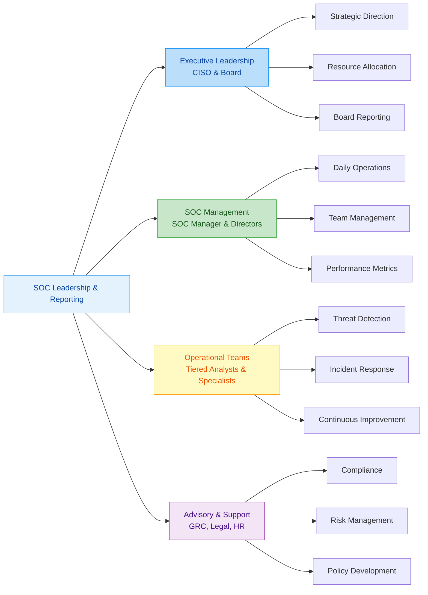
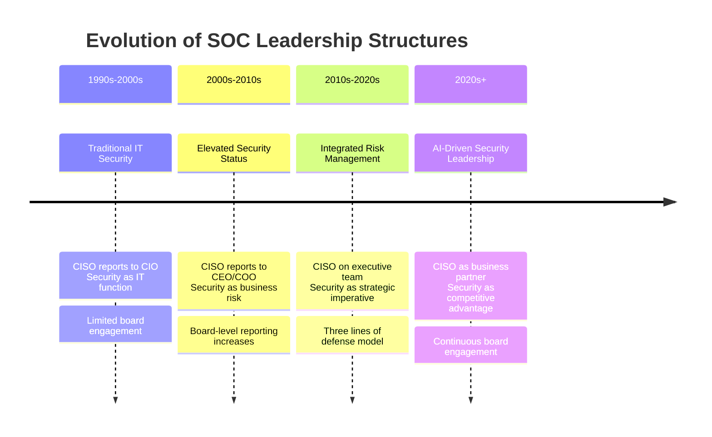
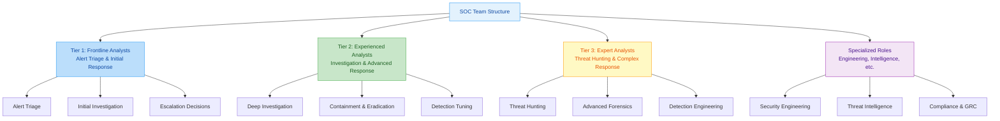
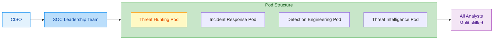
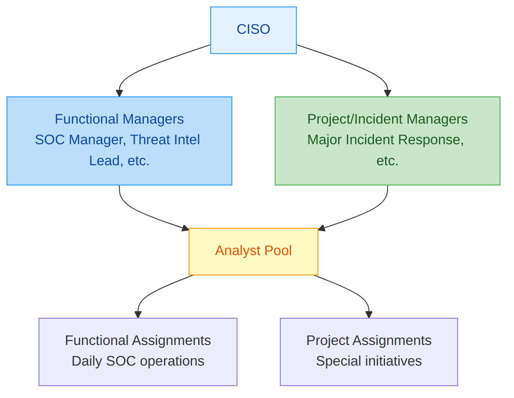
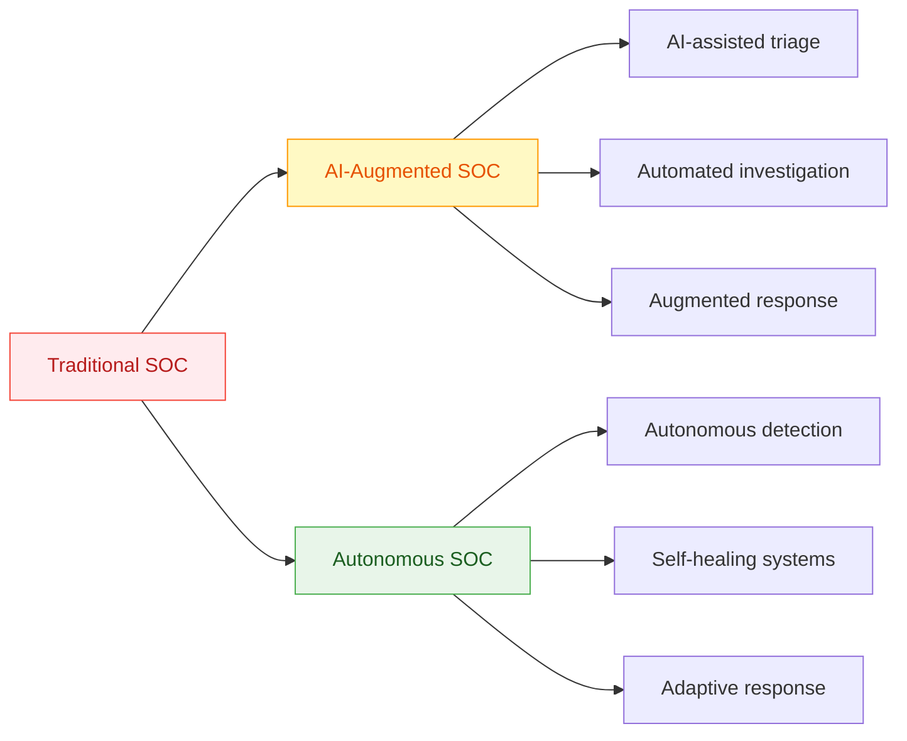
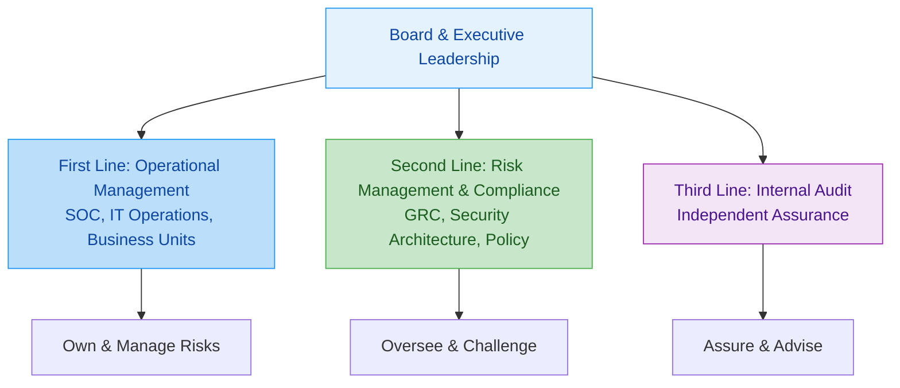
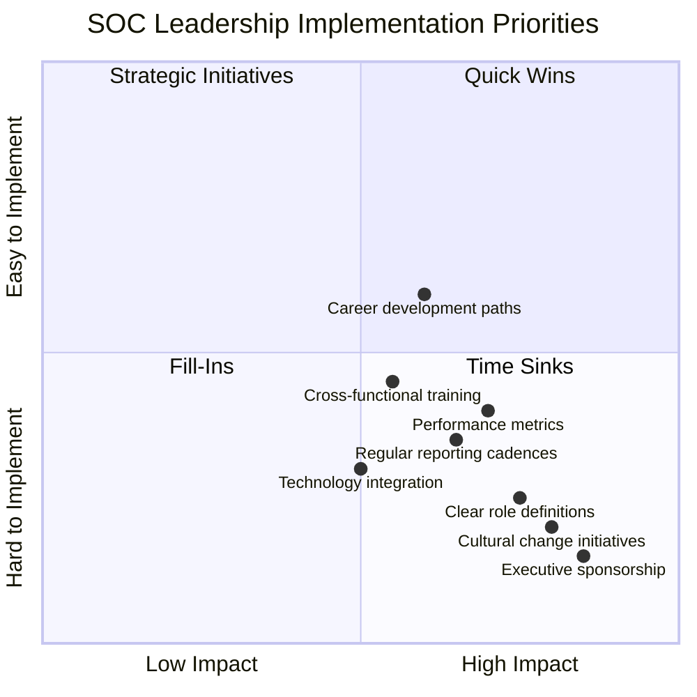

---
tags: [soc]
---
# 🎓 Comprehensive Full-Stack Lesson: SOC Leadership and Reporting Structures


## TCM Exam Objectives

- **Describe the CISO role and reporting structures** – Know the advantages and disadvantages of the CISO reporting to CEO, Board, CIO, COO, CFO, or Legal. Understand the industry trend toward CEO/Board reporting.
- **Distinguish SOC Manager vs. Information Security Manager vs. CISO** – Compare their primary focus, time horizon, technical depth, team size, and success metrics.
- **Explain the tiered SOC team structure** – Detail Tier 1 (alert triage), Tier 2 (investigation), Tier 3 (hunting/forensics) and specialized roles (engineering, threat intel).
- **Compare organizational models** – Understand traditional hierarchical, flat/pod-based, and matrix reporting structures, including pros and cons of each.
- **Understand the Three Lines of Defense model** – Know how it applies to cybersecurity: First Line (operations), Second Line (risk/compliance), Third Line (internal audit).
- **Identify key performance metrics by leadership level** – Know what metrics matter at executive (risk posture, dwell time), SOC Manager (MTTD, MTTR, analyst utilization), and analyst (alerts handled, accuracy) levels.
- **Recognize how AI transforms SOC leadership** – Understand how AI flattens hierarchies, creates new roles (AI ethicist, automation engineer), and changes skill requirements.
- **Describe the CISO board report structure** – Know the components: executive summary, risk metrics, incident overview, program status, resource needs, strategic recommendations.

# 🎓 Comprehensive Full-Stack Lesson: SOC Leadership and Reporting Structures

## 📋 Lesson Overview
This lesson provides an in-depth exploration of the leadership frameworks, organizational hierarchies, and reporting structures that govern Security Operations Centers (SOCs). You'll learn about the roles, responsibilities, and reporting lines that ensure effective security operations, from the CISO down to frontline analysts, and understand how to design and optimize these structures for organizational success.



📌 **Exam Tip:** The PSAA exam heavily tests CISO reporting structures. Remember the trend: CISO reporting to CIO is **decreasing** (from 70% to ~40%), while CISO reporting to CEO/Board is **increasing** (now ~60% of large enterprises). Questions often present scenarios where the CISO reports to the CIO and security initiatives are deprioritized — that's the conflict-of-interest problem.

## 1. 🏛️ Foundations of SOC Leadership

### 1.1 The Strategic Importance of SOC Leadership

Effective SOC leadership is the **cornerstone of organizational cybersecurity resilience**. The leadership structure determines how security priorities are set, how resources are allocated, and how effectively the organization can detect, respond to, and recover from cyber threats 【turn0search8】. Unlike traditional IT functions, SOC leadership requires a unique blend of technical expertise, strategic vision, and crisis management capabilities.

The **reporting structure** within a SOC directly influences its effectiveness. When security leaders have direct access to executive leadership and the board, security initiatives receive the necessary visibility, authority, and funding 【turn0search0】【turn0search3】. Conversely, when CISOs report through layers of management, security decisions can be delayed or diluted by competing priorities.

### 1.2 Evolution of SOC Leadership Models



## 2. 🎯 Executive Leadership: The CISO Role

### 2.1 Chief Information Security Officer (CISO) Responsibilities

The CISO serves as the **top security executive** responsible for establishing and maintaining the enterprise vision, strategy, and programs to ensure information assets and technologies are adequately protected 【turn0search2】. The CISO's responsibilities encompass:

- **Strategic Leadership**: Developing and executing security strategies aligned with business objectives
- **Risk Management**: Identifying, assessing, and mitigating cybersecurity risks across the organization
- **Program Development**: Designing and implementing comprehensive security programs
- **Executive Communication**: Reporting to the board and executive leadership on security posture
- **Resource Management**: Budgeting and allocating resources for security initiatives
- **Incident Oversight**: Leading major incident response efforts and post-incident reviews
- **Compliance**: Ensuring adherence to regulatory requirements and industry standards
- **Team Building**: Recruiting, developing, and retaining security talent

### 2.2 CISO Reporting Structures: Options and Implications

<details>
<summary>📊 Detailed CISO Reporting Structure Analysis</summary>

| **Reporting Line** | **Advantages** | **Disadvantages** | **Best For** | **Industry Trend** |
|-------------------|---------------|------------------|--------------|-------------------|
| **CEO** | Maximum authority & visibility<br>Direct business alignment<br>Strategic influence | Potential isolation from IT operations<br>May lack technical depth | Organizations treating security as strategic imperative<br>High-risk industries | **Increasing** (60% of large enterprises) |
| **Board of Directors** | Highest level of oversight<br>Direct accountability to shareholders<br>Strategic governance | Distance from operational realities<br>May require translation of technical issues | Financial services<br>Public companies<br>Highly regulated industries | **Growing** (especially in regulated sectors) |
| **CIO** | Close alignment with IT operations<br>Technical understanding<br>Integrated IT-security strategy | Potential conflict of interest<br>Security may be secondary to IT priorities<br>Limited executive influence | Organizations with IT-centric security view<br>Smaller enterprises | **Decreasing** (from 70% to 40% historically) |
| **COO/Operations** | Business process integration<br>Operational risk focus<br>Enterprise-wide perspective | May lack technical depth<br>Operations vs. security priorities | Organizations with operational risk focus<br>Manufacturing & logistics | **Stable** (15-20% of organizations) |
| **CFO/Finance** | Financial risk perspective<br>Budget oversight alignment<br>Cost-benefit analysis | May prioritize cost over security<br>Limited technical understanding | Organizations with financial risk focus<br>Cost-sensitive industries | **Limited** (5-10% of organizations) |
| **Legal/Compliance** | Regulatory expertise<br>Legal risk management<br>Compliance focus | May lack operational understanding<br>Legal vs. security priorities | Highly regulated industries<br>Legal-centric organizations | **Niche** (5-10% of organizations) |

**Key Insight**: The trend is clearly moving toward CISOs reporting directly to the CEO or Board, with 60-70% of large enterprises now adopting this structure 【turn0search2】【turn0search3】. This reflects the growing recognition of cybersecurity as a business risk rather than just an IT issue.
</details>

### 2.3 The CISO Board Report: Strategic Communication

The **CISO board report** is a critical communication tool that bridges the gap between technical security operations and executive decision-making 【turn0search15】. An effective board report should include:

- **Executive Summary**: High-level overview of current security posture and key risks
- **Risk Metrics**: Quantified risk measurements aligned with business objectives
- **Incident Overview**: Summary of significant security incidents and lessons learned
- **Program Status**: Progress on key security initiatives and maturity assessments
- **Resource Needs**: Budget requests and resource requirements
- **Strategic Recommendations**: Forward-looking security strategy and investments
- **Compliance Status**: Regulatory compliance posture and audit findings
- **Emerging Threats**: Analysis of evolving threat landscape and implications

<details>
<summary>🔧 Sample CISO Board Report Structure</summary>

```markdown
# Quarterly Cybersecurity Board Report

## Executive Summary
- Overall risk level: Moderate (decreased from previous quarter)
- Major incidents: 2 (both contained with minimal impact)
- Key achievements: SOC 2 Type II certification achieved, zero-day vulnerability response time improved by 40%

## Risk Metrics Dashboard
| Risk Category | Current Level | Trend | Target | Status |
|---------------|---------------|-------|--------|--------|
| External Threats | Medium | ↓ | Low | On Track |
| Insider Threats | Low | → | Low | Maintained |
| Compliance Risk | Low | ↓ | Low | On Track |
| Operational Risk | Medium | ↓ | Low | Improving |
| Third-Party Risk | Medium | ↑ | Low | At Risk |

## Major Incidents (Quarter)
1. **Ransomware Attempt (Month 2)**: Detected and blocked at perimeter. No systems compromised. Lessons learned: Enhanced email filtering needed.
2. **Data Exfiltration Attempt (Month 3)**: Insider threat detected and prevented. Investigation ongoing. Improved monitoring implemented.

## Strategic Initiatives Update
- Cloud Security Program: 70% complete, on budget
- Zero Trust Architecture: Design phase, pilot Q3
- Security Awareness Training: 95% completion rate, phishing simulation results improved

## Budget & Resources
- Q2 spending: 45% of annual budget (on track)
- Additional funding needed: $250K for enhanced endpoint protection
- Resource gaps: 2 SOC analyst positions open

## Strategic Recommendations
1. Approve additional $250K for endpoint protection
2. Prioritize Zero Trust initiative for Q4
3. Invest in threat hunting capabilities (2 FTEs)
4. Enhanced board cybersecurity training recommended

## Emerging Threats
- AI-powered attacks increasing (30% rise in Q2)
- Supply chain attacks targeting software providers
- Regulatory changes: New SEC disclosure requirements effective Q3
```
</details>

## 3. 🏢 SOC Management: The SOC Manager Role

### 3.1 SOC Manager Responsibilities and Position

The **SOC Manager** serves as the critical link between executive security leadership and frontline operations 【turn0search6】【turn0search21】. This role typically reports to the CISO (or equivalent) and is responsible for:

- **Daily Operations**: Overseeing 24/7 security monitoring and incident response
- **Team Management**: Leading, developing, and retaining SOC analysts
- **Performance Management**: Establishing and tracking key metrics (MTTD, MTTR, etc.)
- **Process Optimization**: Developing and refining incident response playbooks
- **Technology Management**: Selecting, implementing, and optimizing SOC tools
- **Cross-functional Coordination**: Collaborating with IT, legal, HR, and other departments
- **Budget Management**: Managing SOC operational budget and resources
- **Continuous Improvement**: Implementing lessons learned and enhancing capabilities

### 3.2 SOC Manager vs. Information Security Manager

<details>
<summary>📊 Distinguishing Security Leadership Roles</summary>

| **Aspect** | **SOC Manager** | **Information Security Manager** | **CISO** |
|-----------|----------------|----------------------------------|----------|
| **Primary Focus** | Operational security monitoring & response | Strategic security program management | Enterprise-wide security leadership |
| **Key Responsibilities** | Incident detection & response, team management | Policy development, risk management, compliance | Strategy, executive communication, board reporting |
| **Time Horizon** | Immediate (real-time to days) | Tactical (weeks to months) | Strategic (months to years) |
| **Technical Depth** | Deep technical expertise required | Broad technical understanding | Strategic technical vision |
| **Team Size** | Leads SOC team (10-50+ analysts) | Manages security team (5-20 specialists) | Oversees entire security organization |
| **Budget Authority** | SOC operational budget | Security program budget | Enterprise security budget |
| **Success Metrics** | MTTD, MTTR, alert volume, false positive rate | Policy compliance, risk reduction, audit findings | Business alignment, risk reduction, program maturity |
| **Reports To** | CISO or Director of Security | CISO | CEO or Board |

**Career Progression**: The typical path is SOC Analyst → SOC Manager → Information Security Manager → CISO, with each role requiring different skill sets and perspectives 【turn0search19】.
</details>

### 3.3 SOC Team Structure and Tiered Model

The traditional SOC team is organized in a **tiered structure** based on experience and responsibilities 【turn0search6】【turn0search11】【turn0search13】:



<details>
<summary>👥 Detailed SOC Tier Responsibilities</summary>

#### **Tier 1 Analysts: Frontline Defenders**
- **Primary Role**: Initial triage and response to security alerts
- **Key Responsibilities**:
  - Monitor security alerts from SIEM and other tools
  - Perform initial investigation of potential incidents
  - Escalate significant events to Tier 2
  - Document actions and findings in case management system
  - Monitor basic security controls (antivirus, firewall logs)
- **Skills Required**: Basic networking, operating systems, security fundamentals
- **Experience Level**: Entry-level (0-2 years)
- **Typical Metrics**: Alerts handled per shift, escalation accuracy, documentation quality

#### **Tier 2 Analysts: Experienced Investigators**
- **Primary Role**: Advanced investigation and response coordination
- **Key Responsibilities**:
  - Conduct in-depth analysis of escalated incidents
  - Perform forensic analysis and evidence collection
  - Coordinate response activities across IT and security teams
  - Develop and refine detection rules
  - Mentor Tier 1 analysts
- **Skills Required**: Advanced networking, malware analysis, incident response
- **Experience Level**: Mid-level (2-5 years)
- **Typical Metrics**: Investigation thoroughness, response time, detection effectiveness

#### **Tier 3 Analysts: Expert Threat Hunters**
- **Primary Role**: Proactive threat hunting and complex response
- **Key Responsibilities**:
  - Proactively search for undetected threats
  - Lead major incident response efforts
  - Perform advanced forensic analysis
  - Develop new detection methodologies
  - Provide expert guidance to Tier 1 and 2 analysts
- **Skills Required**: Deep technical expertise, threat intelligence analysis, advanced forensics
- **Experience Level**: Senior-level (5+ years)
- **Typical Metrics**: Threat hunting discoveries, major incident leadership, detection innovation

#### **Specialized Roles**
- **Security Engineer**: Tool deployment, integration, and maintenance
- **Threat Intelligence Analyst**: Threat research and intelligence integration
- **Detection Engineer**: Rule development and tuning
- **Compliance Analyst**: Regulatory mapping and audit support
- **Security Architect**: Solution design and architecture
</details>

## 4. 🔄 Reporting Lines and Organizational Models

### 4.1 Traditional Hierarchical Model

The **traditional hierarchical model** follows clear lines of authority from the board through the CISO to frontline analysts 【turn0search6】【turn0search8】:

```mermaid
orgchart
    Board of Directors
    │
    CEO
    │
    CISO
    │
    Director of Security Operations
    │
    SOC Manager
    │
    Shift Supervisors
    │
    Tier 3 Analysts
    │
    Tier 2 Analysts
    │
    Tier 1 Analysts
```

**Advantages**:
- Clear authority and accountability
- Well-defined career progression
- Specialized skill development
- Consistent processes and standards

**Challenges**:
- Communication bottlenecks
- Slow decision-making
- Silos between tiers
- Limited cross-training

### 4.2 Flat Organizational Model

The **flat model** reduces hierarchical layers and promotes collaboration across roles 【turn0search13】:



**Key Features**:
- **Pod-based structure**: Cross-functional teams with diverse skills
- **Flatter hierarchy**: Fewer management layers
- **Multi-skilled analysts**: Broader responsibilities across tiers
- **Collaborative approach**: Shared ownership of outcomes

**Advantages**:
- Faster decision-making
- Better communication
- Cross-training opportunities
- More engaging work environment

**Challenges**:
- Less specialized expertise
- Harder to maintain consistency
- Requires cultural change
- More complex coordination

### 4.3 Matrix Organizational Model

The **matrix model** combines functional and project-based reporting lines 【turn0search10】:



**Implementation Considerations**:
- Clear role definitions to avoid confusion
- Strong communication protocols
- Balanced performance metrics
- Conflict resolution mechanisms

## 5. 📊 Performance Metrics and Reporting

### 5.1 Key Performance Indicators (KPIs) for SOC Leadership

<details>
<summary>📈 Comprehensive SOC Leadership Metrics Framework</summary>

| **Metric Category** | **Specific Metrics** | **Target/Benchmark** | **Reporting Frequency** | **Leadership Use** |
|---------------------|----------------------|----------------------|-------------------------|-------------------|
| **Detection Effectiveness** | Mean Time to Detect (MTTD)<br>Detection coverage<br>False positive rate | MTTD < 24 hours<br>>65% MITRE ATT&CK coverage<br><5% false positives | Weekly | Resource allocation<br>Tool tuning |
| **Response Efficiency** | Mean Time to Respond (MTTR)<br>Containment time<br>Recovery time | MTTR < 4 hours<br>Containment < 1 hour<br>Recovery < 24 hours | Weekly | Process improvement<br>Staffing adjustments |
| **Operational Efficiency** | Alerts per analyst<br>Analyst utilization<br>Tool ROI | 20-30 alerts/analyst/shift<br>70-80% utilization<br>>3:1 ROI ratio | Monthly | Productivity assessment<br>Tool investment |
| **Team Health** | Employee satisfaction<br>Turnover rate<br>Training completion | >4.0/5 satisfaction<br><15% annual turnover<br>>95% completion | Quarterly | Retention strategies<br>Professional development |
| **Business Alignment** | Incident recurrence rate<br>Risk reduction %<br>Compliance score | <5% recurrence<br>>20% annual reduction<br>>95% compliance | Monthly | Strategic planning<br>Resource justification |
| **Strategic Value** | Threat intelligence utilization<br>Hunting discoveries<br>Automation rate | >80% utilization<br>>2 major discoveries/quarter<br>>40% automation | Quarterly | Strategic direction<br>Technology investment |

**Leadership Dashboard Example**:

</details>

### 5.2 Reporting Frameworks and Cadences

<details>
<summary>📅 Multi-level Reporting Framework</summary>

#### **Executive Leadership (Board/C-Suite)**
- **Frequency**: Monthly/Quarterly
- **Content**: Strategic risk posture, major initiatives, resource needs, compliance status
- **Format**: Executive dashboard with 5-7 key metrics, narrative summary, strategic recommendations
- **Audience**: Board, CEO, executive committee
- **Purpose**: Strategic decision-making, resource allocation, risk oversight

#### **CISO/Director Level**
- **Frequency**: Weekly/Bi-weekly
- **Content**: Operational metrics, incident trends, team performance, project status
- **Format**: Detailed dashboard with 15-20 metrics, trend analysis, operational insights
- **Audience**: CISO, security directors, key stakeholders
- **Purpose**: Operational oversight, performance management, tactical adjustments

#### **SOC Manager Level**
- **Frequency**: Daily/Weekly
- **Content**: Shift performance, alert volumes, incident details, staffing metrics
- **Format**: Operational dashboard with real-time metrics, shift reports, incident summaries
- **Audience**: SOC manager, shift supervisors, team leads
- **Purpose**: Daily operations management, staffing optimization, immediate issue resolution

#### **Analyst Level**
- **Frequency**: Real-time/Shift
- **Content**: Individual performance metrics, alert handling statistics, quality scores
- **Format**: Personal dashboard with individual metrics, feedback, development plans
- **Audience**: Individual analysts, team leads
- **Purpose**: Performance feedback, professional development, workload management

**Key Reporting Principles**:
1. **Tailored Content**: Each level receives information appropriate to their role and responsibilities
2. **Actionable Insights**: Reports drive decisions and actions, not just information sharing
3. **Trend Analysis**: Focus on trends over time rather than point-in-time metrics
4. **Contextual Data**: Metrics presented with business context and implications
5. **Forward-looking**: Include predictions and recommendations, not just historical data
</details>

## 6. 🚀 Modern Trends and Future Directions

### 6.1 AI-Driven SOC Transformation

Artificial Intelligence is fundamentally changing SOC leadership and reporting structures 【turn0search13】:



**Impact on Leadership Structures**:
- **Flatter hierarchies**: AI handles routine tasks, reducing need for tiered structure
- **New specialized roles**: AI ethicists, automation engineers, threat hunters
- **Changed skill requirements**: Less repetitive monitoring, more strategic analysis
- **Enhanced decision-making**: AI-driven insights improve leadership effectiveness

### 6.2 Integration with Broader Risk Management

Modern SOC leadership increasingly integrates with **enterprise risk management** frameworks 【turn0search14】:

<details>
<summary>🔐 Three Lines of Defense Model for Cybersecurity</summary>



**First Line (Operational Management)**:
- SOC team and IT operations
- Own and manage risks in day-to-day operations
- Implement controls and respond to incidents
- Report to second line on risk status

**Second Line (Risk Management & Compliance)**:
- GRC team, security architecture, policy
- Oversee and challenge first line activities
- Set risk appetite and tolerance levels
- Provide frameworks and guidance

**Third Line (Internal Audit)**:
- Independent assurance function
- Evaluate effectiveness of first and second lines
- Report directly to board audit committee
- Provide objective assessment of risk management

**CISO Position**: In this model, the CISO typically sits in the **second line** (risk management) rather than the first line (operations), providing oversight and challenge to operational teams while maintaining independence for effective risk management 【turn0search14】.
</details>

### 6.3 Emerging Reporting Structures

<details>
<summary>🔮 Future SOC Leadership Models</summary>

#### **Distributed Leadership Model**
- **Structure**: Multiple leaders for different domains (threat hunting, incident response, engineering)
- **Advantages**: Specialized expertise, distributed workload, diverse perspectives
- **Challenges**: Coordination complexity, potential inconsistencies
- **Best For**: Large enterprises with diverse security needs

#### **Virtual SOC Model**
- **Structure**: Geographically distributed team with centralized leadership
- **Advantages**: 24/7 coverage, talent access, business continuity
- **Challenges**: Communication barriers, cultural differences, management complexity
- **Best For**: Global organizations, remote-first companies

#### **Federated SOC Model**
- **Structure**: Centralized leadership with distributed operational teams
- **Advantages**: Balance of consistency and local autonomy, scalable
- **Challenges**: Governance complexity, standardization vs. flexibility
- **Best For**: Large enterprises with multiple business units

#### **Hybrid Outsourcing Model**
- **Structure**: Internal leadership with outsourced operational elements
- **Advantages**: Cost efficiency, 24/7 coverage, access to expertise
- **Challenges**: Vendor management, integration complexity, potential cultural misalignment
- **Best For**: Mid-sized organizations, specialized skill needs
</details>

## 7. 🛠️ Implementation Best Practices

### 7.1 Designing Effective Reporting Structures

<details>
<summary>📋 SOC Reporting Structure Design Checklist</summary>

#### **Strategic Alignment**
- [ ] Align reporting structure with organizational culture and risk appetite
- [ ] Ensure security leadership has appropriate authority and visibility
- [ ] Define clear lines of accountability and decision-making authority
- [ ] Establish communication protocols with executive leadership and board

#### **Operational Effectiveness**
- [ ] Design tier structure appropriate to organization size and complexity
- [ ] Define clear roles and responsibilities for each position
- [ ] Establish performance metrics and KPIs for each level
- [ ] Create career progression paths and development opportunities

#### **Communication & Coordination**
- [ ] Implement regular reporting cadences at all levels
- [ ] Establish escalation paths and protocols
- [ ] Create cross-functional coordination mechanisms
- [ ] Develop communication templates and standards

#### **Governance & Oversight**
- [ ] Define governance structure for security decisions
- [ ] Establish oversight mechanisms for third-party risks
- [ ] Create documentation standards and requirements
- [ ] Implement regular assessment and improvement processes

#### **Technology & Tools**
- [ ] Select appropriate tools for each role and responsibility
- [ ] Implement integrated case management and reporting
- [ ] Establish data sharing and collaboration platforms
- [ ] Provide appropriate access to information systems

#### **People & Culture**
- [ ] Define hiring criteria and skill requirements for each role
- [ ] Establish training and professional development programs
- [ ] Create performance evaluation and feedback mechanisms
- [ ] Foster culture of collaboration and continuous improvement
</details>

### 7.2 Common Challenges and Mitigation Strategies

<details>
<summary>⚠️ SOC Leadership Challenges and Solutions</summary>

| **Challenge** | **Impact** | **Mitigation Strategy** | **Success Metric** |
|---------------|------------|-------------------------|-------------------|
| **Communication Gaps** | Delayed decisions, duplicated efforts, missed insights | Implement regular sync meetings, shared documentation, clear escalation paths | Decision time reduced by 30% |
| **Role Confusion** | Overlapping responsibilities, accountability gaps, conflict | Clearly defined job descriptions, RACI charts, regular role reviews | 90% role clarity in annual survey |
| **Burnout & Turnover** | Loss of institutional knowledge, decreased morale, recruitment costs | Competitive compensation, rotation programs, mental health support, career development | <15% annual turnover rate |
| **Skill Gaps** | Reduced effectiveness, slower response, missed threats | Training programs, certification support, knowledge sharing, strategic hiring | 80% skill coverage assessment |
| **Resource Constraints** | Overworked team, delayed initiatives, reduced effectiveness | Prioritization framework, business case development, efficiency improvements | 95% of critical initiatives resourced |
| **Technology Integration** | Siloed tools, data gaps, inefficient workflows | Integration strategy, API-first approach, regular tool audits | 80% tool integration rate |
| **Executive Buy-in** | Limited resources, strategic misalignment, reduced effectiveness | Regular executive briefings, business-aligned metrics, strategic planning | 100% executive support for initiatives |
| **Regulatory Compliance** | Audit findings, fines, reputational damage | Compliance mapping, regular assessments, documentation standards | 100% compliance with key regulations |

**Implementation Roadmap**:
1. **Assess Current State** (Months 1-2): Evaluate existing structure, identify gaps
2. **Design Future State** (Months 3-4): Define ideal structure, develop implementation plan
3. **Pilot Changes** (Months 5-8): Test new structure with select teams or functions
4. **Full Implementation** (Months 9-12): Roll out across organization, provide training
5. **Optimization** (Ongoing): Regular assessment and refinement based on feedback
</details>

## 8. 📚 Case Studies and Examples

### 8.1 Financial Services Organization Case Study

<details>
<summary>🏦 Large Bank SOC Transformation</summary>

**Initial Situation**:
- CISO reported to CIO, limited board visibility
- SOC team of 45 with traditional tiered structure
- High turnover (25% annually), slow response times
- Limited business alignment, technical focus

**Challenges**:
- Regulatory pressure for improved oversight
- Increasing sophisticated cyber threats
- Budget constraints and resource limitations
- Cultural resistance to change

**Transformation Approach**:
1. **Reporting Structure Change**: CISO began reporting directly to CEO
2. **Board Engagement**: Quarterly cybersecurity board presentations
3. **SOC Reorganization**: Flatter structure with specialized pods
4. **Technology Investment**: AI-assisted triage and investigation
5. **Professional Development**: Career paths and certification programs

**Results** (18 months):
- Turnover reduced to 12% annually
- MTTD improved from 48 to 18 hours
- MTTR reduced from 8 to 3 hours
- Board engagement increased significantly
- Budget approved for major initiatives

**Key Lessons**:
- Executive sponsorship critical for success
- Cultural change takes time and consistent effort
- Technology enables but doesn't replace human expertise
- Business alignment essential for resource justification
</details>

### 8.2 Technology Company Case Study

<details>
<summary>💻 SaaS Company Hybrid SOC Model</summary>

**Organization Profile**:
- 5,000 employees, global operations
- Rapid growth through acquisitions
- Diverse IT environment, multiple cloud platforms
- Limited security resources, high risk tolerance

**SOC Model**:
- **Internal Leadership**: CISO with small strategic team
- **Hybrid Operations**: Internal Tier 3, outsourced Tier 1 & 2
- **Distributed Coverage**: Regional hubs for 24/7 coverage
- **Integrated Technology**: Unified platform across all teams

**Reporting Structure**:
- CISO reports to CEO
- SOC Director reports to CISO
- Regional SOC leads report to SOC Director
- Matrix reporting for specialized functions

**Success Factors**:
- Clear delineation of responsibilities
- Strong vendor management practices
- Integrated technology platform
- Regular cross-team training and exercises

**Challenges Overcome**:
- Cultural integration across regions
- Consistency in processes and standards
- Communication across time zones
- Vendor performance management
</details>

## 9. 🔮 Future Trends and Recommendations

### 9.1 Emerging Trends in SOC Leadership

<details>
<summary>🚀 Future Directions for SOC Leadership</summary>

#### **AI-Enhanced Decision Making**
- **Trend**: AI providing predictive insights and recommendations
- **Impact**: Faster, more accurate decisions; reduced cognitive load
- **Timeline**: 2-3 years for mainstream adoption
- **Preparation**: Develop AI governance frameworks, invest in data quality

#### **Increased Board Engagement**
- **Trend**: Boards requiring more frequent, detailed cybersecurity reporting
- **Impact**: Greater scrutiny, accountability, and resource allocation
- **Timeline**: Already occurring, accelerating with regulations
- **Preparation**: Develop board-friendly metrics, regular education

#### **Integration with Business Operations**
- **Trend**: Security becoming embedded in business processes rather than separate function
- **Impact**: Security considerations in all business decisions
- **Timeline**: 3-5 years for full integration
- **Preparation**: Cross-functional teams, business-aligned metrics

#### **Distributed Leadership Models**
- **Trend**: Moving from single leader to distributed leadership teams
- **Impact**: More resilient, diverse perspectives, better coverage
- **Timeline**: 2-4 years for adoption
- **Preparation**: Develop leadership pipeline, collaborative culture

#### **Continuous Regulatory Evolution**
- **Trend**: Increasing regulatory requirements for cybersecurity governance
- **Impact**: More formal reporting structures, accountability
- **Timeline**: Ongoing, accelerating
- **Preparation**: Regulatory tracking, compliance automation
</details>

### 9.2 Strategic Recommendations for Organizations

<details>
<summary>💡 Actionable Recommendations for SOC Leadership</summary>

#### **For Executive Leadership**
1. **Elevate CISO Role**: Ensure CISO reports directly to CEO or Board
2. **Establish Board Oversight**: Create cybersecurity committee or regular reporting
3. **Allocate Adequate Resources**: Fund security initiatives based on risk, not just cost
4. **Foster Culture of Security**: Demonstrate commitment from top, integrate into business

#### **For CISOs**
1. **Develop Business Acumen**: Understand business strategy, communicate in business terms
2. **Build Strong Team**: Invest in people, provide development opportunities
3. **Implement Metrics-Driven Management**: Use data for decisions, demonstrate value
4. **Foster Collaboration**: Break down silos, build relationships across organization

#### **For SOC Managers**
1. **Focus on Team Development**: Build skills, provide growth paths, prevent burnout
2. **Optimize Operations**: Continuously improve processes, leverage automation
3. **Enhance Communication**: Develop clear reporting, tailor to audiences
4. **Embrace Innovation**: Pilot new technologies, stay current with trends

#### **For SOC Analysts**
1. **Develop Broad Skills**: Understand business context, not just technology
2. **Embrace Continuous Learning**: Stay current with threats and technologies
3. **Provide Feedback**: Share insights from frontline, suggest improvements
4. **Build Relationships**: Collaborate across teams, share knowledge

**Implementation Priority Matrix**:

</details>

## 10. 📖 Lesson Summary and Key Takeaways

### 10.1 Core Concepts Recap

1. **Leadership Determines Effectiveness**: SOC reporting structure significantly influences security effectiveness, with CISOs reporting directly to CEO/Board showing best outcomes 【turn0search0】【turn0search3】.

2. **Multiple Valid Models Exist**: No single "best" structure—optimal design depends on organizational size, culture, risk profile, and industry requirements 【turn0search2】【turn0search4】.

3. **Tiered Model Remains Relevant**: While evolving, the tiered analyst structure (Tier 1, 2, 3) provides clear career paths and skill development 【turn0search6】【turn0search11】【turn0search13】.

4. **Metrics Drive Improvement**: Effective leadership requires data-driven decision making with metrics tailored to each organizational level 【turn0search15】.

5. **AI Transforming Leadership**: Artificial intelligence is enabling flatter structures, new roles, and enhanced decision-making capabilities 【turn0search13】.

6. **Business Alignment Critical**: Security leadership must understand and align with business objectives to be effective and secure resources 【turn0search20】.

7. **Communication is Key**: Tailored reporting at all levels ensures appropriate information flow and decision-making 【turn0search15】.

8. **People Are Foundation**: Effective leadership invests in team development, career paths, and culture to build sustainable capabilities 【turn0search19】.

### 10.2 Practical Application Framework

<details>
<summary>🎯 SOC Leadership Assessment and Improvement Framework</summary>

#### **Step 1: Assess Current State**
- Document current reporting structure and roles
- Identify pain points and improvement opportunities
- Evaluate effectiveness through metrics and feedback
- Benchmark against industry standards and peers

#### **Step 2: Define Future State**
- Identify desired outcomes and success metrics
- Design optimal reporting structure for organization
- Define roles, responsibilities, and career paths
- Develop implementation roadmap

#### **Step 3: Build Business Case**
- Quantify benefits and ROI of changes
- Align with strategic business objectives
- Identify resource requirements and constraints
- Secure executive sponsorship and support

#### **Step 4: Implement Changes**
- Communicate changes and rationale to all stakeholders
- Provide training and development for new roles
- Implement in phases to manage disruption
- Monitor progress and adjust as needed

#### **Step 5: Optimize and Sustain**
- Regularly assess effectiveness through metrics
- Continuously improve based on feedback and results
- Stay current with evolving trends and technologies
- Invest in ongoing development and innovation

**Success Factors**:
- Strong executive sponsorship
- Clear communication throughout
- Adequate resources and time
- Metrics-driven approach
- Cultural readiness for change
</details>

## 🎓 Conclusion

Effective SOC leadership and reporting structures form the foundation of organizational cybersecurity resilience. The most successful organizations treat security as a strategic business function, with leadership that has appropriate authority, visibility, and resources. While specific structures vary based on organizational needs, the principles remain constant: clear accountability, effective communication, metrics-driven management, and investment in people.

As cyber threats continue to evolve, SOC leadership must also transform—embracing new technologies, adapting to regulatory changes, and aligning closely with business objectives. The future belongs to organizations that can build agile, effective security leadership structures that protect while enabling business growth and innovation.

> **Final Thought**: The most sophisticated security technology cannot compensate for poor leadership and reporting structures. Invest in building the right leadership framework first, and the rest will follow.