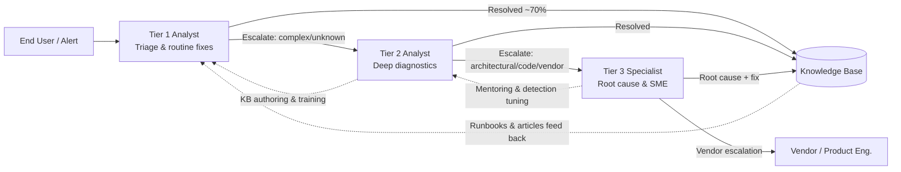
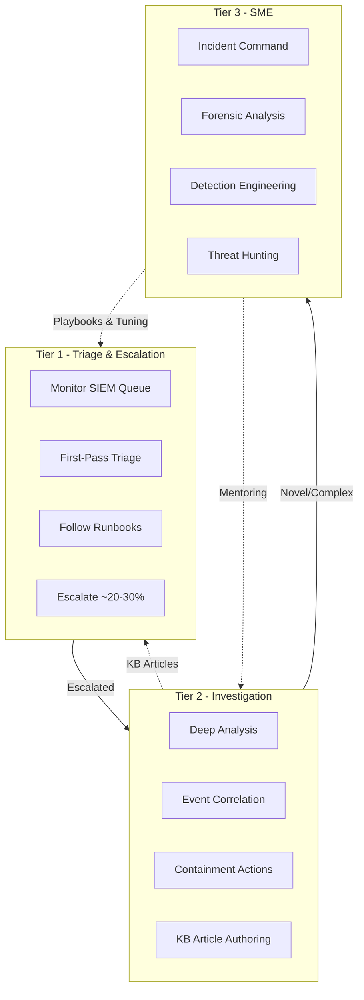
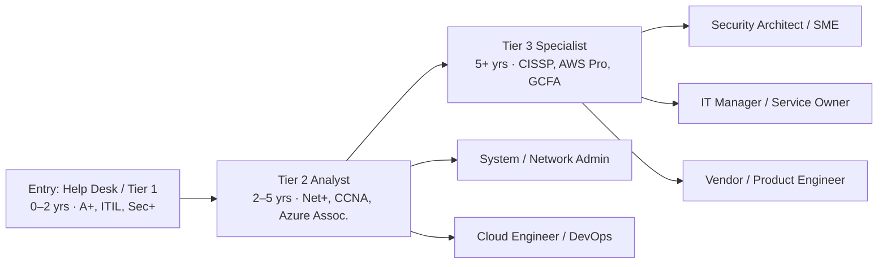

# Tier 1, Tier 2, and Tier 3 Analyst Roles and Responsibilities
## TCM Exam Objectives

- **Compare Tier 1, 2, and 3 analyst responsibilities** – Know the percentage of tickets each tier handles (60-80% / 18-20% / 2-5%), typical time per ticket, and complexity level.
- **Describe the escalation flow between tiers** – Understand when and why an issue moves from Tier 1 → Tier 2 → Tier 3, including the feedback loop (KB articles flow back down).
- **List Tier 1 SOC analyst duties** – SIEM alert queue monitoring, first-pass triage, IOC enrichment, escalation of suspicious activity. Know expected certs (Security+, CySA+).
- **List Tier 2 SOC analyst duties** – Deep investigation, event correlation across sources, incident timeline reconstruction, containment actions. Know expected certs (GCIH, CySA+).
- **List Tier 3 SOC analyst duties** – Major incident response leadership, forensic investigations, threat hunting, detection engineering. Know expected certs (OSCP, GCFA, GREM, CISSP).
- **Understand the SOC variant of the tier model** – Explain how the ITIL service desk tier model maps to SOC security operations with the same escalation logic.
- **Recognize the impact of AI on tier structures** – Know that AI-augmented SOCs compress the distance between tiers, with agentic AI handling much of Tier 1's investigative chain.
- **Identify career progression paths** – Describe the typical path: Tier 1 (0-2 yrs) → Tier 2 (2-5 yrs) → Tier 3 (5+ yrs) or lateral moves into admin/engineering roles.

Tier 1 handles first-contact triage and routine fixes (≈60–80% of tickets), Tier 2 takes escalated issues needing deeper technical diagnosis (≈18–20%), and Tier 3 owns the most complex, architecture-level problems and root-cause analysis (≈2–5%). The three-tier model is borrowed from ITIL service management and is used both in IT service desks and in Security Operations Centers (SOCs), with the same escalation logic adapted to each domain.【turn1fetch1】【turn3fetch0】

📌 **Exam Tip:** The PSAA exam tests the tier model heavily. Memorize the percentages (60-80% / 18-20% / 2-5%) and the key differentiator: **Tier 1 follows runbooks, Tier 2 creates solutions, Tier 3 redesigns systems.** A scenario question might describe an analyst who "creates new detection rules and leads incident response" — that's Tier 3, not Tier 2.

## The Full Stack at a Glance

| Dimension | Tier 1 Analyst | Tier 2 Analyst | Tier 3 Analyst |
|---|---|---|---|
| **Primary role** | First point of contact / triage | Advanced troubleshooting / escalation | Subject matter expert / deepest fix |
| **Share of tickets** | ~60–80% | ~18–20% | ~2–5% (often 5–10%) |
| **Avg. time per ticket** | Minutes | 2–4 hours | Days to weeks |
| **Issue complexity** | Known issues with documented solutions | Problems requiring analysis, not yet in KB | Architecture/code-level, novel, or vendor-dependent |
| **System access** | Standard user-level + remote tools | Elevated/admin access, advanced diagnostics | Root-level, source code, vendor back-channels |
| **Authority** | Follows runbooks, minimal deviation | Can make config changes, system modifications | Can redesign systems, patch code, engage vendors |
| **Typical certifications** | CompTIA A+, ITIL Foundation, Security+ (SOC) | Network+, CCNA, Microsoft 365/Azure assoc., CySA+/GCIH (SOC) | CISSP, AWS Solutions Architect Pro, GCFA/GREM/OSCP (SOC) |
| **US salary range (2026)** | ~$35K–$55K | ~$50K–$75K | ~$60K–$82K+ (Robert Half lists Tier 3 at $59,750–$81,750) |

Sources: 【turn1fetch0】【turn5fetch0】【turn0search5】【turn0search8】

## How Escalation Actually Flows

The tier model is essentially a triage system — like a hospital, where not every patient needs a surgeon. Simple issues get resolved fast at the first level, while complex problems move up to specialists, with knowledge flowing back down through KB articles and mentoring.【turn1fetch0】

The feedback loops (dotted lines) matter as much as the upward escalation — without knowledge flowing back down, Tier 1 keeps re-escalating the same issues and the model breaks down.【turn0search3】

---

## Tier 1 Analyst — The First Line of Defense

**Tier 1 is the initial point of contact; its mission is to solve common problems quickly and route the rest.** A typical technician here handles 30–50 tickets per day and resolves 60–70% of incoming requests without escalation, relying heavily on documented procedures and knowledge base articles to maintain speed.【turn5fetch0】

### Core responsibilities

- Password resets and account unlocks (~30% of all tickets)
- Basic hardware troubleshooting and "power-cycle" diagnostics
- Email configuration (Outlook/mobile sync issues)
- Printer setup and connectivity
- VPN connection problems (critical in hybrid work)
- Software installation for approved applications
- Basic network connectivity checks
- Mobile device / MDM enrollment
- Accurate ticket logging, categorization, and routing for anything they can't resolve
- Remote desktop support as the daily bread-and-butter【turn5fetch0】

### Skills, tools, and environment

- **Soft skills dominate:** patience, active listening, jargon-free communication, and the judgment to know when to escalate versus push further
- **Hard skills:** working knowledge of Windows/macOS, Office 365, Active Directory user objects, basic TCP/IP
- **Toolset:** ticketing system (ServiceNow, Jira Service Management, Zendesk, Freshservice), remote support tool (TeamViewer, AnyDesk, ConnectWise ScreenConnect), RMM agent, KB portal, password vault
- **Certifications:** CompTIA A+, ITIL 4 Foundation, Microsoft 365 Fundamentals; for SOC Tier 1, CompTIA Security+ or CySA+【turn2search10】【turn3fetch0】

### Daily routine (illustrative)

Arrive → check the queue and SLA-breaching tickets → work inbound calls/chats → triage new tickets, resolve the quick wins, escalate the rest with good notes → update KB when you discover a repeatable fix → hand off open items at shift end.

### Real-world example

A user reports "Outlook won't connect." Tier 1 checks the user's network, rebuilds the Outlook profile, tests OWA — if it works, ticket closed. If mailflow still fails after profile rebuild and the issue appears server-side, Tier 1 escalates to Tier 2 with full diagnostic notes.

> **SOC Analyst Perspective:** "When I started as Tier 1, I thought Tier 2 just knew more commands. The real difference is that Tier 2 doesn't follow a script — they build the script. My job was pattern-matching against known issues. Their job was figuring out what's actually broken and why. And Tier 3? They own the whole architecture."

📌 **Exam Tip:** The PSAA exam loves to ask: "An analyst receives an alert, performs initial triage, and escalates with full diagnostic notes. What tier is this?" Answer: Tier 1. If the question says "investigates the root cause and writes new detection rules," that's Tier 3.

---

## Tier 2 Analyst — The Problem-Solving Powerhouse

**Tier 2 takes the issues Tier 1 couldn't crack — these aren't cookbook problems; they need analysis and on-the-fly solution building.** Engineers here typically spend 2–4 hours per ticket and have elevated system access, advanced diagnostic tools, and authority to make configuration changes Tier 1 can't touch.【turn5fetch0】

### Core responsibilities

- Advanced diagnostics for recurring or complex issues
- Network problems: routing, DNS configuration, firewall rules
- Server performance investigation
- Active Directory management: permissions, Group Policy, domain controller issues
- Application troubleshooting (crashes, unexpected behavior)
- Database connectivity problems
- Patch management and pre-deployment testing
- System performance tuning and optimization
- Backup and recovery operations
- Integration issues between business systems
- Authoring knowledge base articles so Tier 1 can resolve similar issues next time【turn5fetch0】

### The Tier 1 vs. Tier 2 distinction

- **Complexity:** Tier 1 follows recipes; Tier 2 creates solutions
- **Time:** Tier 1 targets minutes; Tier 2 may need hours or a full day
- **Tools:** Tier 1 uses standard remote utilities; Tier 2 has system-level access, network monitoring, and database query capability
- **Expertise:** Tier 1 knows how systems work from a user perspective; Tier 2 understands *why* they work (or don't) from an architectural standpoint
- **Authority:** Tier 1 follows procedure; Tier 2 can modify configurations【turn5fetch0】

### Skills, tools, and certifications

- **Technical depth:** networking fundamentals, Active Directory/Entra ID, PowerShell scripting basics, virtualization (Hyper-V/VMware), SQL query literacy
- **Tools:** Wireshark, PowerShell ISE, ADUC/ADAC, Group Policy Management, server monitoring (PRTG, Nagios, Datadog), MECM/SCCM
- **Certifications:** CompTIA Network+, Cisco CCNA, Microsoft 365 Administrator Associate, Azure Administrator Associate, ITIL 4 Specialist【turn5fetch0】【turn2search13】

### Real-world example

Tier 1 escalates "Outlook won't connect for an entire department." Tier 2 checks Exchange transport rules, mail-flow connectors, and DNS MX records, finds a stale connector after a tenant migration, removes it, and verifies mailflow restored. They then write a KB article and brief Tier 1 on the symptoms so it's caught at first contact next time.

---

## Tier 3 Analyst — The Expert Level

**Tier 3 specialists are the subject matter experts — the people who architected the systems, wrote custom code, or own a specialized domain.** Only about 5–10% of tickets reach this tier, but they're often the most critical, capable of shutting down operations if mishandled. A single issue can occupy a Tier 3 engineer for days or weeks, because they're often redesigning systems, patching vulnerabilities, or building solutions that don't exist off-the-shelf.【turn5fetch0】

### Core responsibilities

- Architecture-level problems (fundamental design issues affecting everything)
- Code-level debugging (application bugs, vulnerabilities, performance)
- Database administration (tuning, corruption recovery, replication, query optimization)
- Security incident response (breaches, ransomware, vulnerability mitigation)
- Infrastructure optimization for performance, scalability, reliability
- Vendor escalations — working directly with software/hardware manufacturers on product bugs
- Custom development when no off-the-shelf solution exists
- Disaster recovery planning and execution
- Complex integration projects between disparate systems
- Root cause analysis that reveals and addresses design flaws【turn5fetch0】

### When does an issue reach Tier 3?

An escalation is warranted when Tier 2 has exhausted standard troubleshooting, the problem affects critical business systems (downtime cost in thousands per hour), a security vulnerability exposes sensitive data, multiple systems are simultaneously impacted, custom code or specialized configs are involved, vendor/source-code access is required, or RCA surfaces a fundamental design flaw.【turn5fetch0】

### Skills, tools, and certifications

- **Deep specialization:** one or more of networking, cybersecurity, cloud infrastructure, database engineering, or software development
- **Tools:** IDEs and debuggers, IaC (Terraform, Ansible), cloud consoles (AWS/Azure/GCP admin), forensics suites, vendor support portals
- **Certifications:** CISSP, AWS Solutions Architect Professional, CCNP/CCIE, vendor-specific professional credentials; in SOC Tier 3, OSCP, GCFA, GREM, CISSP are common【turn5fetch0】【turn4fetch0】

### Real-world example

After a ransomware outbreak, Tier 3 leads the response: isolates affected segments, engages the backup vendor for clean restores, performs forensic timeline analysis to identify the initial access vector, coordinates with legal/comms, works with the EDR vendor on a custom detection rule, and redesigns the identity architecture to close the gap — then documents lessons learned for the whole support org.

---

## Career Progression Path

Movement between tiers is typically driven by **demonstrated experience plus targeted certification**, not certs alone — Reddit/Spiceworks discussions consistently note you reach Tier 2/3 through promotion or a job change backed by hands-on time, not by stacking certificates.【turn2search12】

Common lateral and upward moves from Tier 2 include systems administration, network engineering, cloud/DevOps, or specialization into cybersecurity (SOC). From Tier 3, paths diverge into architecture, management, or deep SME/consulting tracks.【turn0search7】【turn2search14】

---

## The SOC Variant — Same Tiers, Different Work

Because "analyst" is heavily used in cybersecurity, it's worth noting how the same three-tier logic applies inside a Security Operations Center. The model is borrowed directly from IT service management, but the work shifts from user-support tickets to security alerts.【turn3fetch0】

- **Tier 1 SOC Analyst** — monitors the SIEM alert queue, performs first-pass triage, checks IOCs against threat intel, enriches alerts with EDR/identity/network context, and escalates suspicious activity. The bottleneck is volume: hundreds to thousands of alerts/day with 30–70 minutes mean time to investigate. Expected certs: Security+ or CySA+.【turn3fetch0】【turn2search7】
- **Tier 2 SOC Analyst** — receives escalations and asks "what happened, how far did it get, what do we do?" They correlate events across data sources, build incident timelines, map behavior to MITRE ATT&CK, and are authorized to take containment actions (isolating endpoints, blocking IPs, disabling accounts). Typical background: 2–5 years SOC experience, GCIH/ECIH/CySA+.【turn4fetch0】
- **Tier 3 SOC Analyst** — leads major-incident response, forensic investigations, threat hunting, and detection engineering. They reconstruct multi-stage intrusions, reverse-engineer malware, tune detection logic, run red/purple team exercises, and mentor juniors. Usually 5+ years with OSCP, GCFA, GREM, or CISSP. They're also the scarcest and most expensive, which makes the tier fragile when one leaves.【turn4fetch0】

A note on the evolving landscape: AI-augmented SOCs are compressing the distance between tiers — agentic AI now handles much of Tier 1's investigative chain, Tier 2 spends less time on routine correlation and more on novel/multi-domain incidents, and Tier 3 gains AI-driven hunting and detection-engineering assistance. The tiered model isn't disappearing, but strict sequential escalation is giving way to more fluid, AI-assisted workflows.【turn4fetch0】

---

## Bottom Line

The tiered model is fundamentally a **resource-allocation and expertise-routing system**: it reserves expensive, scarce specialists for the small fraction of work that genuinely needs them, while letting frontline analysts clear the bulk of volume quickly. Whether applied to a service desk or a SOC, success depends on three things — clear escalation criteria, strong documentation so knowledge flows back down, and realistic career paths so analysts don't stall and churn at Tier 1.【turn1fetch0】【turn4fetch0】