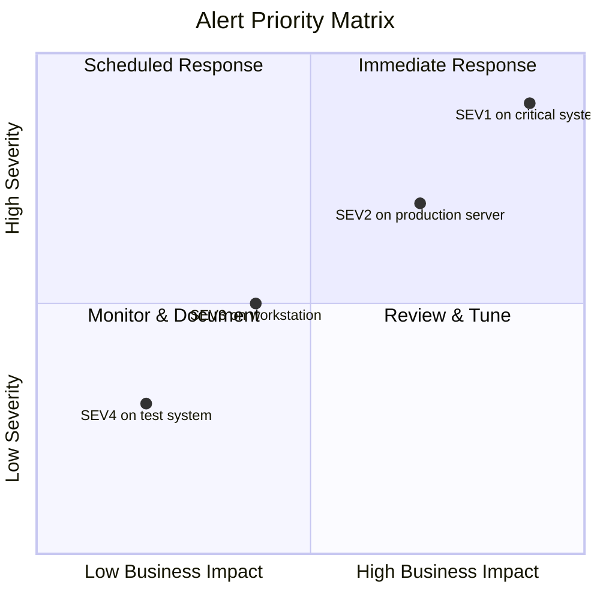
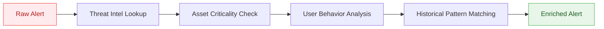
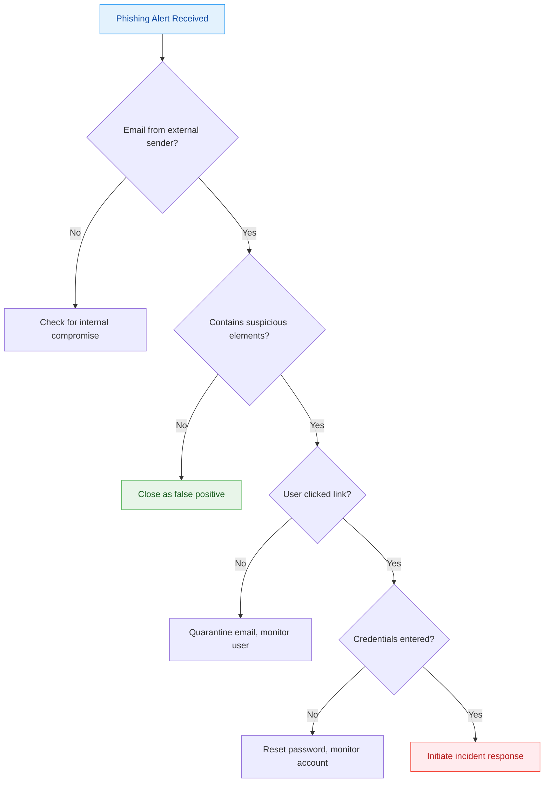
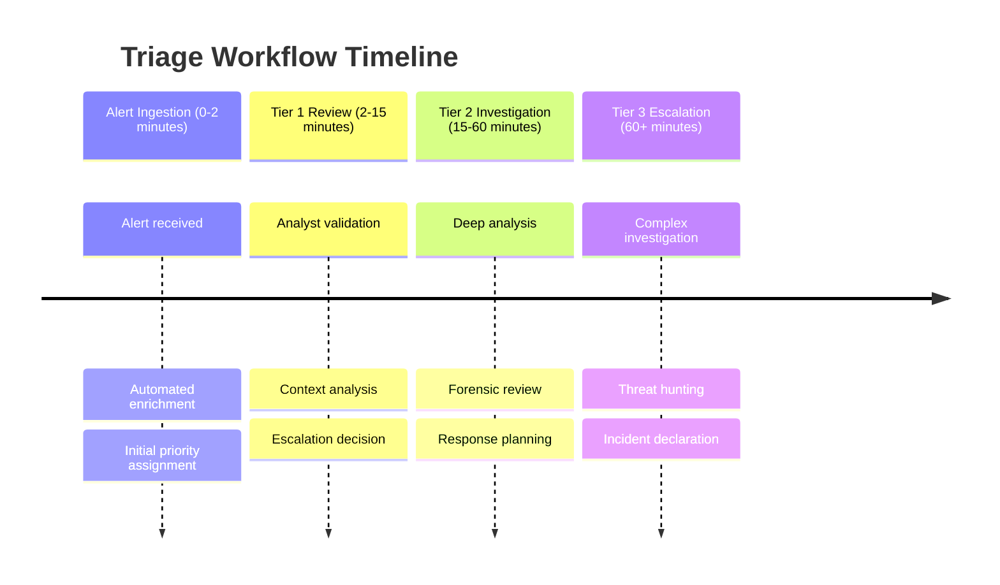

---
tags: [soc]
---
# 🚨 Comprehensive Full-Stack Lesson: Alert Triage and Prioritization in Cybersecurity


## TCM Exam Objectives

- **Define alert triage and its purpose** – Explain how triage filters false positives from genuine threats, prioritizes based on severity and business impact, and routes alerts to appropriate analyst tiers.
- **Walk through the full triage workflow** – List the six steps: ingestion, initial validation/ filtering, context enrichment, priority assessment, decision/disposition, response initiation.
- **Distinguish Severity vs. Priority vs. Urgency** – Know that Severity = technical impact, Priority = business importance, Urgency = time sensitivity.
- **Memorize the SEV1–SEV5 severity scale** – Know definitions, examples, response times (15 min for SEV1, 30 min for SEV2, 2h for SEV3, 8h for SEV4), and escalation paths.
- **Interpret the Priority Matrix** – Understand how severity × business impact determines response priority in a quadrant chart.
- **Identify AI/automation roles in triage** – Automated enrichment, ML classification, NLP for summarization, and autonomous decision-making for common false positives.
- **Understand alert fatigue as a failure mode** – Explain how excessive alerts lead to desensitization, missed threats, and analyst burnout. Know mitigation strategies.
- **List key triage metrics** – Know targets for false positive rate (<5%), MTTD (<24h), triage time (<30 min), escalation rate (15-20%), and alerts per analyst per shift (20-30).

# 🚨 Comprehensive Full-Stack Lesson: Alert Triage and Prioritization in Cybersecurity

## 🎯 Lesson Overview
This lesson provides an in-depth exploration of alert triage and prioritization in Security Operations Centers (SOCs). You'll learn the complete workflow from alert ingestion to disposition, including prioritization frameworks, automation strategies, metrics for measurement, and best practices for optimizing this critical security function.


📌 **Exam Tip:** The PSAA exam tests the SEV1–SEV5 severity levels. Memorize the response times: SEV1 = 15 min (immediate), SEV2 = 30 min, SEV3 = 2 hours, SEV4 = 8 hours, SEV5 = next business day. A scenario question might describe a "ransomware outbreak on a domain controller" — that's SEV1 (critical). "Phishing email reported by user" — that's SEV4 (low).

## 1. 🔍 Introduction to Alert Triage

### 1.1 What is Alert Triage?

Alert triage is the **systematic process** of receiving, categorizing, and prioritizing security signals to identify which require immediate intervention and which can be safely ignored or investigated later 【turn0search0】. It serves as the critical first step in incident response, filtering the massive volume of alerts generated by security tools to focus analyst attention on genuine threats.

The primary goal of triage is to **filter out false positives** and prioritize genuine threats that require immediate attention 【turn0search3】. This process is essential because modern SOCs face an overwhelming volume of alerts—often thousands per day—making it impossible to investigate each one manually.

### 1.2 The Alert Triage Process: Step-by-Step

<details>
<summary>📊 Detailed Alert Triage Workflow</summary>

#### **Step 1: Alert Ingestion & Collection**
Alerts are ingested from various security tools including:
- Security Information and Event Management (SIEM) systems
- Endpoint Detection and Response (EDR) solutions
- Network Detection and Response (NDR) platforms
- Intrusion Detection/Prevention Systems (IDS/IPS)
- Web Application Firewalls (WAF)
- Cloud security platforms

#### **Step 2: Initial Validation & Filtering**
- **Deduplication**: Remove duplicate alerts from the same event
- **Basic filtering**: Exclude alerts from known-good sources or maintenance activities
- **Rule-based validation**: Apply predefined criteria to filter obvious false positives

#### **Step 3: Context Enrichment**
- **Asset criticality**: Determine if the affected asset is critical (e.g., domain controller, financial database)
- **User context**: Identify user roles, privileges, and historical behavior
- **Threat intelligence**: Check IPs, domains, URLs, and file hashes against threat intel feeds
- **Vulnerability data**: Cross-reference with known vulnerabilities (CVEs)
- **Geographic context**: Determine if connections are from expected locations

#### **Step 4: Priority and Severity Assessment**
- **Business impact**: Assess potential impact on business operations
- **Urgency**: Determine time-sensitivity of response
- **Scope**: Evaluate potential spread across network
- **Confidence level**: Assess reliability of the alert source

#### **Step 5: Decision and Disposition**
- **True positive**: Confirmed security incident requiring response
- **False positive**: Benign activity incorrectly flagged
- **Benign true positive**: Intentional but non-malicious activity (e.g., authorized penetration test)
- **Needs further investigation**: Insufficient information for disposition

#### **Step 6: Response Initiation**
- For true positives: Initiate incident response playbook
- For false positives: Tune detection rules to prevent future occurrences
- For all dispositions: Document findings and update knowledge base
</details>

## 2. 📊 Alert Prioritization Frameworks

### 2.1 Priority vs. Severity vs. Urgency

Understanding the distinction between these concepts is crucial for effective triage:

| **Concept** | **Definition** | **Example** |
|-------------|---------------|-------------|
| **Severity** | Technical impact of the incident | "Critical" - complete system compromise |
| **Priority** | Business importance of resolving | "High" - affects production financial system |
| **Urgency** | Time sensitivity of response | "Immediate" - active data exfiltration |

### 2.2 Severity Level Classification

Most organizations use a **5-level severity scale** (SEV1-SEV5) 【turn0search15】【turn0search16】:

<details>
<summary>🔧 Detailed Severity Level Matrix</summary>

| **Severity Level** | **Definition** | **Examples** | **Response Time** | **Escalation Path** |
|-------------------|---------------|--------------|-------------------|-------------------|
| **SEV1 - Critical** | Severe business impact; complete loss of critical services | - Active ransomware deployment on critical systems<br>- Data exfiltration from financial database<br>- Domain controller compromise | **Immediate** (15 min) | CISO, IR Team, Legal, Executive Management |
| **SEV2 - High** | Significant business impact; partial loss of critical services | - Malware infection on production server<br>- Privileged account compromise<br>- DDoS attack affecting customer portal | **30 minutes** | SOC Manager, IR Team, IT Operations |
| **SEV3 - Medium** | Moderate business impact; non-critical systems affected | - Malware on workstation<br>- Unauthorized access attempt to internal wiki<br>- Policy violation by standard user | **2 hours** | SOC Analyst (Tier 2), IT Support |
| **SEV4 - Low** | Minimal business impact; isolated incidents | - Phishing email reported by user<br>- Failed login attempts on VPN<br>- Non-critical system patch missing | **8 hours** | SOC Analyst (Tier 1), End-user support |
| **SEV5 - Informational** | No business impact; informational only | - Successful backup completion<br>- User account locked due to forgot password<br>- System health check passed | **Next business day** | Automated handling, no human action |

**Key Considerations**:
- Severity levels should be **consistent across the organization** to avoid confusion
- Levels should be **documented with specific examples** for each category
- **Regular review** of severity classifications based on threat landscape evolution
</details>

### 2.3 Priority Matrix Implementation

A **priority matrix** combines severity and business impact to determine response priority 【turn0search19】:



## 3. 🤖 Automation and AI in Alert Triage

### 3.1 The Role of Automation in Triage

Automation addresses several critical challenges in alert triage 【turn0search5】【turn0search10】:
- **Alert fatigue**: Reduces manual analysis of low-value alerts
- **Consistency**: Ensures uniform application of triage criteria
- **Speed**: Accelerates context enrichment and initial assessment
- **Scalability**: Handles increasing alert volumes without proportional staff increases

### 3.2 AI-Enabled Triage Capabilities

<details>
<summary>🤖 AI-Powered Triage Workflow</summary>

#### **1. Automated Alert Enrichment**


#### **2. Machine Learning Classification**
- **Anomaly detection**: Identifies deviations from established baselines
- **Clustering**: Groups similar alerts to identify campaign-level attacks
- **Predictive analytics**: Forecasts potential impact based on historical patterns

#### **3. Natural Language Processing**
- **Alert summarization**: Condenses lengthy alert details into actionable summaries
- **Intent recognition**: Determines attacker objectives from attack patterns
- **Contextual understanding**: Analyzes alert text for business relevance

#### **4. Autonomous Decision Making**
- **False positive prediction**: Identifies likely false positives before human review
- **Priority recommendation**: Suggests priority level based on multiple factors
- **Response recommendation**: Proposes initial response actions based on playbook
</details>

### 3.3 Implementing AI Triage: Practical Approach

<details>
<summary>⚙️ AI Triage Implementation Framework</summary>

#### **Phase 1: Foundation (Weeks 1-4)**
- **Data collection**: Gather historical alert data with dispositions
- **Feature engineering**: Identify key alert attributes for ML models
- **Baseline establishment**: Define current performance metrics (MTTD, MTTR, false positive rate)

#### **Phase 2: Model Development (Weeks 5-8)**
- **Algorithm selection**: Choose appropriate ML algorithms (random forest, neural networks, etc.)
- **Training & validation**: Train models on historical data
- **Testing**: Evaluate model performance on holdout dataset

#### **Phase 3: Integration (Weeks 9-12)**
- **API development**: Create interfaces for alert ingestion and enrichment
- **Workflow integration**: Incorporate AI predictions into existing triage workflow
- **Human-in-the-loop**: Ensure analysts can override AI recommendations

#### **Phase 4: Optimization (Ongoing)**
- **Continuous learning**: Update models with new alert dispositions
- **Performance monitoring**: Track AI accuracy and impact on metrics
- **Feedback loop**: Implement mechanism for analyst feedback to improve models

**Key Success Factors**:
- **Quality data**: AI models require accurate, labeled training data
- **Incremental implementation**: Start with specific alert types rather than all alerts
- **Transparency**: Ensure AI recommendations are explainable to analysts
- **Fallback mechanisms**: Always maintain human oversight for critical decisions
</details>

## 4. 📈 Triage Metrics and KPIs

### 4.1 Key Performance Indicators for Triage

<details>
<summary>📊 Comprehensive Triage Metrics Dashboard</summary>

| **Metric Category** | **Specific Metrics** | **Target** | **Industry Benchmark** | **Business Value** |
|---------------------|----------------------|------------|------------------------|-------------------|
| **Volume Metrics** | Alerts per day/week<br>Alerts per analyst | Varies by org size | 50-100 alerts/analyst/day | Resource planning, capacity management |
| **Quality Metrics** | False positive rate<br>True positive rate | <5% false positives | 10-30% false positives | Analyst efficiency, alert quality |
| **Speed Metrics** | Mean Time to Detect (MTTD)<br>Mean Time to Triage (MTTT) | MTTD <24 hours<br>MTTT <30 minutes | MTTD 24-48 hours<br>MTTT 30-60 minutes | Threat containment, risk reduction |
| **Outcome Metrics** | Incident escalation rate<br>Containment time | 15-20% escalation<br><2 hours containment | 20-30% escalation<br>2-4 hours containment | Business impact, operational efficiency |
| **Analyst Metrics** | Alerts handled per hour<br>Analyst satisfaction | 5-10 alerts/hour<br>>4.0/5 satisfaction | 3-5 alerts/hour<br>3.5-4.0/5 satisfaction | Workforce management, burnout prevention |
| **Business Metrics** | Risk reduction %<br>Compliance adherence | >20% annual reduction<br>100% compliance | 10-15% annual reduction<br>95% compliance | Security ROI, regulatory compliance |

**Advanced Metrics**:
- **Triage accuracy**: % of alerts correctly dispositioned on first review
- **Escalation efficiency**: Time from triage to incident declaration
- **Context hit rate**: % of alerts successfully enriched with additional context
- **Automation rate**: % of alerts handled without human intervention
</details>

### 4.2 Measuring Triage Effectiveness


## 5. ⚠️ Common Challenges and Solutions

### 5.1 Alert Fatigue and False Positives

**Challenge**: Analysts become overwhelmed by excessive alerts, leading to missed critical threats 【turn0search3】【turn0search10】.

<details>
<summary>🛡️ False Positive Reduction Strategy</summary>

#### **1. Alert Tuning & Optimization**
- **Rule refinement**: Adjust detection thresholds based on false positive patterns
- **Exception handling**: Create allowlists for known-good activities that trigger alerts
- **Correlation logic**: Improve correlation rules to reduce single-event false positives

#### **2. Context-Aware Alerting**
- **Asset criticality**: Only alert for critical assets when possible
- **User risk scoring**: Weight alerts based on user risk profile
- **Environmental baselines**: Establish normal behavior patterns per environment

#### **3. Feedback Loop Implementation**
- **Disposition tracking**: Record false positive reasons for future tuning
- **Regular review**: Weekly/monthly review of top false positive sources
- **Automated learning**: Use ML to identify false positive patterns

#### **4. Risk-Based Alerting**
- **Impact assessment**: Prioritize alerts based on potential business impact
- **Threat likelihood**: Weight alerts based on threat intelligence relevance
- **Vulnerability exploitation**: Prioritize alerts involving exploitable vulnerabilities

**Implementation Example**:
```python
# Pseudo-code for risk-based alert scoring
def calculate_alert_risk(alert):
    asset_criticality = get_asset_criticality(alert.affected_asset)  # 1-10 scale
    threat_likelihood = get_threat_likelihood(alert.threat_type)  # 1-10 scale
    vulnerability_score = get_vulnerability_score(alert.cve)  # 1-10 scale
    business_impact = get_business_impact(alert.business_unit)  # 1-10 scale
    
    risk_score = (asset_criticality * 0.4) + (threat_likelihood * 0.3) + \
                 (vulnerability_score * 0.2) + (business_impact * 0.1)
    
    return risk_score
```
</details>

### 5.2 Skills Gap and Analyst Burnout

**Challenge**: Triage requires specialized skills, and high alert volumes lead to burnout 【turn0search5】.

**Solutions**:
1. **Tiered analyst structure**: Implement Tier 1 (triage), Tier 2 (investigation), Tier 3 (hunting) roles
2. **Cross-training programs**: Develop broad skills across team members
3. **Rotation programs**: Rotate analysts through different roles to prevent burnout
4. **Automation offloading**: Use automation for repetitive tasks, freeing analysts for complex work

### 5.3 Tool Integration and Data Overload

**Challenge**: Multiple tools generate alerts with different formats, making correlation difficult 【turn0search2】【turn0search5】.

**Solutions**:
1. **Unified alert platform**: Implement SIEM or SOAR for centralized alert management
2. **Standardized data models**: Use common schemas for alert normalization
3. **API integration**: Ensure seamless data flow between tools
4. **Data prioritization**: Focus on high-fidelity, high-value data sources

## 6. 🚀 Best Practices for Effective Triage

### 6.1 Triage Playbook Development

<details>
<summary>📖 SOC Playbook Development Guide</summary>

#### **1. Identify Critical Alert Types**
- **Phishing alerts**: Email-based attacks, credential harvesting
- **Malware alerts**: Endpoint detections, malicious file executions
- **Network anomalies**: Unusual traffic patterns, data exfiltration
- **Identity alerts**: Account compromise, privilege escalation
- **Cloud security alerts**: Misconfigurations, unauthorized access

#### **2. Define Triage Procedures**
For each alert type, document:
- **Initial validation steps**: How to confirm alert legitimacy
- **Context enrichment requirements**: What additional data to gather
- **Priority assessment criteria**: How to assign severity and priority
- **Escalation thresholds**: When to involve senior analysts or IR teams
- **Initial response actions**: First steps for confirmed incidents

#### **3. Create Decision Trees**


#### **4. Implement Automation Hooks**
- **Threat intel lookups**: Automate IP/domain/hash reputation checks
- **Asset enrichment**: Automatically retrieve asset criticality and ownership
- **User context**: Pull user role, department, and recent activity
- **Ticket creation**: Automatically create tickets for tracking

#### **5. Regular Review and Update**
- **Monthly playbook reviews**: Incorporate new threat intelligence
- **Post-incident updates**: Revise playbooks based on lessons learned
- **Analyst feedback**: Gather input from triage team for improvements
- **Performance metrics**: Use data to identify playbook gaps
</details>

### 6.2 Triage Team Structure and Workflow

<details>
<summary>👥 Optimal Triage Team Structure</summary>

#### **Tier 1: Triage Analysts (Frontline)**
- **Role**: Initial alert validation and prioritization
- **Responsibilities**:
  - Review incoming alerts for obvious false positives
  - Perform basic context enrichment
  - Assign initial priority levels
  - Escalate suspicious alerts to Tier 2
- **Skills**: Basic security knowledge, familiarity with tools, attention to detail
- **Tools**: SIEM, ticketing system, threat intel platforms

#### **Tier 2: Investigation Analysts**
- **Role**: In-depth analysis of escalated alerts
- **Responsibilities**:
  - Conduct detailed investigation of suspicious alerts
  - Perform forensic analysis when needed
  - Determine appropriate response actions
  - Document findings and recommendations
- **Skills**: Advanced security analysis, forensic techniques, threat hunting
- **Tools**: EDR, NDR, sandbox environments, forensic tools

#### **Tier 3: Threat Hunters & Specialists**
- **Role**: Proactive threat hunting and complex incident handling
- **Responsibilities**:
  - Proactively search for undetected threats
  - Handle complex, multi-stage incidents
  - Develop new detection methodologies
  - Provide expert guidance to Tier 1 & 2
- **Skills**: Deep technical expertise, threat intelligence analysis, advanced forensics
- **Tools**: Advanced analytics platforms, custom scripts, research tools

**Workflow Example**:

</details>

### 6.3 Continuous Improvement Framework

<details>
<summary>🔄 Triage Optimization Cycle</summary>

#### **1. Measure Current Performance**
- Establish baseline metrics (MTTD, MTTR, false positive rate)
- Conduct time studies for triage activities
- Survey analysts for pain points and suggestions

#### **2. Identify Improvement Opportunities**
- Analyze metrics for bottlenecks and inefficiencies
- Review common false positive patterns
- Identify automation opportunities
- Gather analyst feedback on workflow

#### **3. Implement Changes**
- Prioritize improvements based on impact and effort
- Pilot changes with small alert subset
- Train analysts on new procedures
- Update documentation and playbooks

#### **4. Evaluate Results**
- Compare post-implementation metrics to baseline
- Gather analyst feedback on effectiveness
- Document lessons learned
- Identify next improvement cycle

**Improvement Backlog Example**:
| **Improvement Idea** | **Impact** | **Effort** | **Priority** | **Status** |
|---------------------|------------|------------|--------------|------------|
| Implement AI for initial triage | High | High | High | Planning |
| Automate threat intel lookups | Medium | Low | Medium | In Progress |
| Revise phishing playbook | High | Medium | High | Completed |
| Create alert tuning process | Medium | Medium | Medium | Backlog |

</details>

## 7. 🔮 Future Trends in Alert Triage

### 7.1 AI-Driven Autonomous Triage

The future of triage is moving toward **autonomous systems** that can handle the majority of alerts without human intervention 【turn0search11】【turn0search12】【turn0search13】. These systems will:

- **Understand business context**: Incorporate business impact into triage decisions
- **Learn from feedback**: Continuously improve based on analyst corrections
- **Handle novel threats**: Use generative AI to assess new types of attacks
- **Coordinate response**: Orchestrate multi-step responses across security tools

### 7.2 Integration with Broader Security Ecosystem

Future triage systems will be **deeply integrated** with:
- **Security Orchestration, Automation, and Response (SOAR)** platforms
- **Extended Detection and Response (XDR)** solutions
- **Cloud Security Posture Management (CSPM)** tools
- **Security Information and Event Management (SIEM)** systems

This integration will enable **end-to-end automation** from detection to response.

### 7.3 Predictive Triage and Proactive Defense

Advanced analytics will enable **predictive triage** that:
- **Forecasts attack patterns**: Identifies likely attack vectors based on threat intelligence
- **Pre-positions defenses**: Adjusts security controls based on predicted threats
- **Optimizes resource allocation**: Positions analysts where attacks are most likely to occur
- **Reduces alert volume**: Prevents alerts by addressing vulnerabilities before exploitation

## 8. 📚 Lesson Summary and Implementation Guide

### 8.1 Key Takeaways

1. **Triage is the critical first step** in incident response, filtering noise to identify genuine threats 【turn0search0】【turn0search21】
2. **Effective prioritization requires** understanding the difference between severity, priority, and urgency 【turn0search15】【turn0search16】
3. **Automation and AI are essential** for handling modern alert volumes and reducing analyst burnout 【turn0search10】【turn0search13】
4. **Metrics-driven improvement** is necessary for continuous optimization of triage processes
5. **Playbooks provide consistency** but require regular updates to remain effective 【turn0search5】
6. **Team structure impacts effectiveness**—tiered models with clear responsibilities work best
7. **False positive reduction** is an ongoing process requiring tuning, feedback, and context

### 8.2 Implementation Roadmap

<details>
<summary>🗺️ 90-Day Triage Optimization Plan</summary>

#### **Days 1-30: Assessment and Foundation**
- **Week 1**: Document current triage process and metrics
- **Week 2**: Analyze alert sources and volumes
- **Week 3**: Identify top false positive patterns
- **Week 4**: Establish baseline performance metrics

#### **Days 31-60: Quick Wins and Process Improvement**
- **Week 5-6**: Implement quick wins (alert tuning, basic automation)
- **Week 7-8**: Develop or revise triage playbooks for top alert types

#### **Days 61-90: Advanced Implementation**
- **Week 9-10**: Implement AI-assisted triage for specific alert types
- **Week 11-12**: Establish metrics dashboard and regular review processes
- **Week 13**: Begin continuous improvement cycle

**Success Metrics for 90-Day Plan**:
- 25% reduction in false positive rate
- 30% reduction in average triage time
- 15% improvement in analyst satisfaction
- 100% of critical alerts reviewed within SLA

</details>

### 8.3 Final Recommendations

1. **Start with the basics**: Ensure solid triage process before advanced automation
2. **Measure relentlessly**: You can't improve what you don't measure
3. **Invest in your team**: Well-trained analysts are your best triage tool
4. **Embrace automation strategically**: Automate repetitive tasks, preserve human judgment
5. **Maintain business focus**: Always consider business impact in triage decisions
6. **Plan for evolution**: Threats change, so your triage process must evolve too

> **Final Thought**: Effective alert triage is not about processing every alert—it's about **identifying and responding to the right alerts** at the right time with the right resources. By implementing a structured, metrics-driven approach with appropriate automation, SOCs can transform alert triage from a cost center into a strategic security advantage.

## 📖 Additional Resources

- **NIST SP 800-61**: Computer Security Incident Handling Guide
- **MITRE ATT&CK Framework**: For understanding attack patterns and behaviors
- **SOC-CMM**: Security Operations Center Capability Maturity Model
- **Vendor Documentation**: Specific implementation guides for SIEM/SOAR platforms
- **Industry Forums**: Reddit r/cybersecurity, SOC Focus group for practitioner insights

This comprehensive lesson provides the foundation for understanding and optimizing alert triage and prioritization in modern security operations. By applying these concepts and continuously refining your approach, you can build a triage capability that effectively protects your organization while maximizing analyst efficiency.