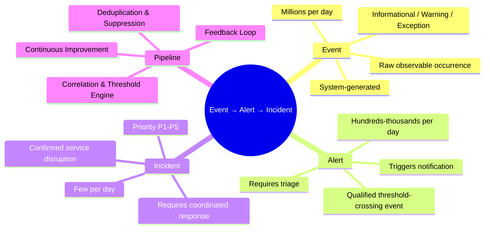
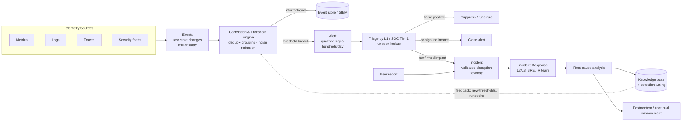

# Events, Alerts, and Incidents Definitions and Distinctions
## TCM Exam Objectives

- **Define and distinguish Event, Alert, and Incident** – Know the ITIL 4 definitions: Event (any change of state), Alert (notification that a threshold/rule was triggered), Incident (unplanned interruption or reduction in service quality).
- **Explain the Event → Alert → Incident pipeline** – Describe how events are raw signals, alerts are filtered/threshold-crossing signals, and incidents are validated disruptions.
- **Understand volume relationships** – Know that events = millions/day, alerts = hundreds-thousands/day, incidents = few/day.
- **Classify events using the traffic-light model** – Distinguish Informational (🟢), Warning (🟡), and Exception (🔴) events.
- **Know the alert-to-incident promotion logic** – Explain how an alert is validated, enriched, and escalated to an incident based on confirmed service impact.
- **Identify common pitfalls** – Alert fatigue, confusing events with incidents, alert storms, and false positives. Know mitigation strategies for each.
- **Understand the correlation engine's role** – Explain how correlation, deduplication, and suppression transform raw events into actionable alerts.
- **Apply these concepts across domains** – Understand how Event/Alert/Incident definitions shift between ITSM/ITIL, SOC/security operations, and Observability/SRE contexts.

An **event** is any observable system occurrence, an **alert** is a qualified event that crosses a threshold and demands human attention, and an **incident** is a confirmed disruption (or imminent disruption) to a service that requires a coordinated response to restore normal operations. The three form a pipeline: events are raw signals, alerts are filtered signals that pass through correlation/threshold logic, and incidents are the validated subset that actually impact service and trigger the response workflow.【turn1fetch0】【turn5fetch1】

📌 **Exam Tip:** The PSAA exam WILL test the Event → Alert → Incident pipeline. Memorize the volume ratios: millions : hundreds-to-thousands : few. A classic question: "What is the difference between an alert and an incident?" Answer: An alert is a notification that MAY require attention; an incident is a CONFIRMED disruption requiring coordinated response.

## Full-Stack Comparison

| Dimension | Event | Alert | Incident |
|---|---|---|---|
| **ITIL 4 definition** | Any change of state that has significance for the management of a service or CI | A notification that a threshold has been reached, something has changed, or a failure has occurred | An unplanned interruption to a service or a reduction in the quality of a service |
| **Nature** | Raw observation / point-in-time data | Qualified event requiring investigation | Confirmed service degradation requiring action |
| **Origin** | System-generated by monitoring/observability tools (logs, metrics, traces) | Generated when event(s) match threshold/rule/correlation logic | Declared when a validated alert (or user report) is confirmed to disrupt service |
| **Volume** | Millions/day (high) | Hundreds–thousands/day (medium) | Few/day (low) |
| **Human action required** | None (typically logged only) | Triage / investigate | Coordinate response, restore service |
| **Classification** | Informational 🟢 / Warning 🟡 / Exception 🔴 | By severity, urgency, category | By priority (P1–P5), impact × urgency |
| **Example (IT ops)** | CPU = 78% | CPU > 90% sustained 5 min → page on-call | App unresponsive, checkout failing → P1 incident |
| **Example (security)** | 1 failed login | 50 failed logins from one IP in 1 min → SIEM alert | Confirmed credential stuffing attack → security incident |
| **Lifecycle output** | Stored in SIEM/observability backend | Routed to on-call/SOC queue | Triggers incident management process + postmortem |

Sources: 【turn1fetch0】【turn5fetch0】【turn0search0】

## The End-to-End Pipeline

The conceptual flow is **Event → Alert → Incident**, but in practice it's a many-to-many-to-one funnel with correlation, deduplication, suppression, and feedback loops. Events are the atoms; alerts are the molecules formed by correlation logic; incidents are the macroscopic "things that broke."

Two things deserve emphasis in that diagram. First, the **correlation engine** is where the real intelligence lives — it's what separates a mature observability/SIEM platform from a firehose of noise. Second, the **feedback loop back to correlation** is what makes the system improve over time; without it, the same false positives keep generating alerts and the team develops alert fatigue.【turn1fetch0】【turn5fetch1】

---

## Module 1 — Event

An event is **any observable occurrence in a system or network** — a point-in-time fact captured automatically by monitoring and observability tools. ITIL 4 frames it as "any change of state that has significance for the management of a service or other configuration item," with examples including current throughput, memory, CPU load, and transaction status.【turn1fetch0】

**Characteristics**

- Almost always system-generated; they don't require a human to create them.【turn5fetch0】
- Volume is enormous — every log line, metric sample, and trace span is potentially an event.
- Most are informational and require no response at all; they're recorded for context, audit, and trend analysis.
- In observability, events are derived from the three (or four) signals — metrics, logs, traces, and sometimes events themselves (the "E" in MELT).【turn6search11】

**Three event classes (the traffic-light model)**

- 🟢 **Informational** — normal operation (user login, task completion, scheduled backup succeeded). No action required.
- 🟡 **Warning** — approaching a threshold or showing an anomaly that *may* become a problem (error rate creeping up, disk at 80%). Optional preemptive action.
- 🔴 **Exception** — a threshold is breached or the service is significantly deviating from normal (service unresponsive, transactions failing, intrusion detected). These are the events most likely to trigger alerts.【turn1fetch0】

**Example**: A storage array records an average read/write speed spike outside its normal band. That logged observation is an event — nothing more, nothing less — until correlation logic decides what to do with it.【turn5fetch0】

---

## Module 2 — Alert

An alert is a **notification triggered by an event (or correlated set of events) designed to inform stakeholders that something needs attention.** Where an event is a fact, an alert is a *qualified* fact — the monitoring logic has judged it potentially actionable and routed it to a human or a queue.【turn5fetch1】【turn5fetch0】

**How alerts are generated**

- Monitoring/observability tools evaluate events against predefined logic: thresholds (CPU > 90%), rules (5 failed logins from one IP), anomaly detection (UEBA flags unusual user behavior), or correlation across multiple sources (low memory + checkout errors = related).【turn0search10】【turn5fetch0】
- In a SIEM, detection rules fire alerts when event patterns match known threat indicators; alerts are then prioritized by severity so analysts focus on the most critical first.【turn0search10】【turn0search12】
- Alerts are typically system-generated but can also originate from scripts, integrations, or manual actions in edge cases.【turn5fetch0】

**Characteristics**

- Volume is medium — an enterprise SOC may see hundreds to thousands per day; an ITOps team hundreds.【turn0search12】
- Alerts signal *possible* issues; they do not always demand immediate action and not every alert becomes an incident.
- Delivery matters: alerts should route through channels the on-call team actually monitors (PagerDuty, Slack, SMS) — email-only alerting creates gaps outside business hours.【turn1fetch0】
- The cardinal sin is **alert fatigue**: when teams are swamped with informational or false-positive alerts, they become desensitized and start missing the genuinely exceptional ones. Mitigations include effective prioritization, triage, deduplication, and ML-based aggregation that sifts through event noise to surface only what's critical.【turn1fetch0】

**Example**: The storage array's read/write spike from the previous example is evaluated against thresholds, deemed abnormal, and the monitoring tool generates an alert flagging it for an administrator's review.【turn5fetch0】

---

## Module 3 — Incident

An incident is **an unplanned interruption to a service or a reduction in the quality of a service** — a confirmed disruption that violates agreed or expected performance levels and requires a coordinated response to restore normal operations.【turn1fetch0】【turn0search0】

**How incidents are declared**

- Most commonly, a validated alert is *promoted* to incident status — either manually by an analyst or automatically via rules — once it's confirmed to actually affect service.【turn5fetch0】
- Incidents can also be raised **without an alert**, typically when users report degradation that monitoring thresholds didn't catch (the "dark" part of any monitoring coverage).【turn1fetch0】
- In a SOC, when SIEM alerts are corroborated by additional evidence and the scope/impact is assessed, the alert is promoted to a security incident and enters formal incident response.【turn0search10】【turn6search0】

**Characteristics**

- Lowest volume of the three — a few per day in mature environments.
- Classified by **priority** derived from **impact × urgency** (e.g., P1 critical down to P5 minor). A central printer failure is not rated the same as a mobile network outage affecting a city.【turn1fetch0】
- Triggers the full incident management workflow: logged, categorized, prioritized, diagnosed, escalated if needed, resolved, and closed through an established process.
- Major/critical incidents require urgent response, senior technical and managerial involvement, and typically a post-resolution report.【turn1fetch0】
- The event messages associated with the incident are the **first port of call** for root cause analysis — the event logs provide the sequence of activities, timestamps, and dependencies needed to troubleshoot and to prevent recurrence.【turn1fetch0】

**Example**: Following the storage alert, an administrator investigates and finds the spike was a short-term workload increase that resolved on its own — *no incident is raised* because service wasn't affected. In a different scenario, low memory and checkout errors are correlated, found to be causing actual checkout failures, and an incident is immediately declared because customer experience and revenue are at risk.【turn5fetch0】

---

## The Promotion Logic — How One Becomes Another

The pipeline is not a simple 1:1:1 chain. The transformation at each stage is governed by different logic:

**Event → Alert (qualification)** is driven by **thresholds, rules, and anomaly detection**. Not every event becomes an alert — monitoring tools decide which changes of state are significant enough to act on. The art is in threshold tuning: too loose and you miss real issues; too tight and you drown in noise.【turn1fetch0】【turn0search7】

**Alert → Incident (validation)** is driven by **confirmed service impact**. This is fundamentally a judgment call — sometimes automated via correlation rules, sometimes made by an L1/SOC Tier 1 analyst consulting a runbook. The key question shifts from "is something abnormal?" (alert) to "is a service actually degraded and who's affected?" (incident). This is why correlation matters so much: a single failed login is noise, but fifty failed logins from one IP combined with a successful login from a new geo *correlated together* tell a story that justifies declaring a security incident.【turn0search10】【turn5fetch0】

**Many alerts → one incident (correlation & dedup)** is where modern platforms earn their keep. A single underlying problem (e.g., a database outage) can generate dozens of alerts across app servers, web tiers, and dashboards. Event correlation engines group these into one incident so responders aren't chasing thirty pages for one fault. Conversely, one alert that looks minor in isolation might, when correlated with others, reveal an active intrusion — turning a low-priority alert into a P1 security incident.【turn5fetch1】【turn0search10】

---

## Real-World Walkthrough

**Scenario — e-commerce checkout degradation**【turn5fetch0】

1. **Events**: A customer hits an error on the checkout page (logged as event A). Simultaneously, the system records low available memory (logged as event B). Two separate, seemingly unrelated events flow into monitoring.
2. **Alert**: The correlation engine analyzes these events *together* and recognizes the pattern — memory exhaustion is causing checkout failures. It generates an alert flagging the correlated condition for review.
3. **Incident**: Because the issue directly affects customer experience and revenue, an incident is immediately declared with high priority. The IT team is mobilized to restore system stability and resolve the memory shortage.

The same logic in a **security context**: a SIEM ingests authentication events from domain controllers. One failed login is an event. Fifty failed logins from a single IP in one minute cross a detection rule and generate an alert. A Tier 1 SOC analyst enriches the alert with threat-intel and EDR telemetry, discovers a successful login followed by lateral movement, and promotes the alert to a **security incident** — triggering containment, IR, and ultimately a postmortem.【turn0search10】【turn6search0】

---

## Common Confusions & Pitfalls

**Alert fatigue** is the most cited failure mode. When teams are bombarded with informational or false-positive alerts, they become desensitized and miss the exceptional events that matter. The fix is relentless tuning: triage, prioritize, deduplicate, and use ML/AIOps to aggregate noise into signal.【turn1fetch0】【turn6search7】

**Confusing events with incidents** is the classic beginner mistake. Not every event is a problem, and not every problem is an incident — an incident requires *confirmed service impact*. A CPU spike that resolves itself is an event and maybe an alert, but never an incident.【turn5fetch0】

**Alert storms** — a single root cause generating hundreds of alerts — mask the real incident under noise. Correlation and suppression rules exist specifically to collapse alert storms into one actionable incident.【turn5fetch1】

**Alert-to-incident ratio** is the diagnostic metric for these pitfalls. If too many alerts never convert to incidents, your alert sources need tuning; if too few alerts precede incidents, your monitoring has coverage gaps. The ratio requires "fine-tuning and never-ending iteration."【turn6search7】

**False positives** in a security SIEM are unavoidable but manageable — detection rules should be continuously refined using threat intel and analyst feedback to reduce the noise that drives SOC burnout.【turn0search12】

---

## Key Metrics Across the Pipeline

| Metric | What it measures | Where it lives |
|---|---|---|
| **MTTD** (Mean Time to Detect) | Time from event occurrence to alert generation | Event → Alert boundary |
| **MTTA** (Mean Time to Acknowledge) | Average time between alert trigger and human acknowledgment — flags alert fatigue and on-call effectiveness | Alert queue |
| **MTTR** (Mean Time to Resolve) | Time from incident declaration to full resolution — ideal target often cited as < 5 hours for IT incidents | Incident lifecycle |
| **Alert-to-incident ratio** | Fraction of alerts that convert to incidents — diagnostic for over- vs under-alerting | Alert → Incident boundary |
| **False positive rate** | % of alerts that turn out benign — critical for SOC tuning | Alert triage |
| **First-call resolution / FCR** | % of incidents resolved without escalation | Incident management |

Sources: 【turn6search5】【turn6search8】【turn6search7】【turn6search6】

---

## Context Notes — ITSM vs SOC vs Observability

The same three terms shift meaning slightly across domains:

- **ITSM / ITIL** frames this around service management: events come from monitoring CIs, alerts notify the service desk, incidents are managed through the incident management practice with SLAs and prioritization. This is the canonical source of the definitions above.【turn1fetch0】【turn5fetch0】
- **SOC / security operations** uses the same funnel but the "events" are security telemetry (auth logs, network flows, EDR alerts), the "alerts" are SIEM detection outputs, and the "incidents" are confirmed security events requiring IR. Microsoft's framing: SOC teams "investigate security alerts, prioritize incidents based on severity, and respond quickly to contain attacks."【turn6search0】【turn6search2】
- **Observability / SRE** emphasizes the *signals* (metrics, logs, traces, events — "MELT") that feed the pipeline. Metrics show behavior over time, traces show where a request spent its time, logs record what happened at specific moments, and events capture discrete state changes — together they provide the raw material that correlation engines turn into alerts and, ultimately, incidents.【turn6search12】【turn6search11】

---

## Recap

Events are the **raw, high-volume observations** streaming from every monitored system. Alerts are the **qualified, threshold-or-correlation-driven subset** that demand human attention. Incidents are the **validated, low-volume disruptions** that mobilize a response. The progression from event to alert to incident is a funnel governed by thresholds, correlation logic, and confirmed service impact — and the health of the whole system is measured by how cleanly that funnel filters signal from noise, how fast teams acknowledge and resolve what reaches the bottom, and how well the feedback loop tunes the top.