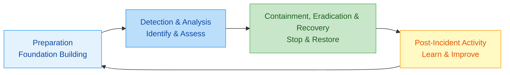
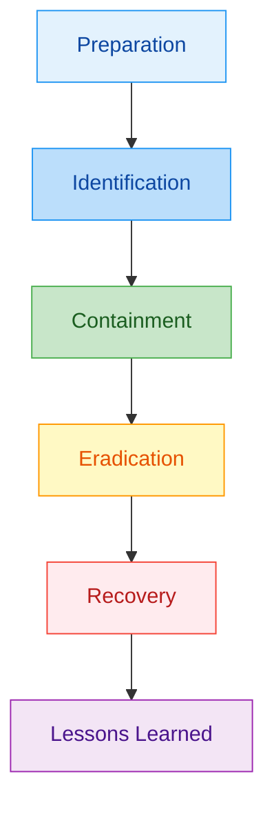
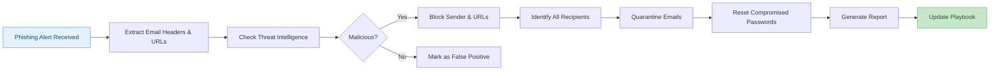

---
tags: [soc]
---
# 🚨 Comprehensive Full-Stack Lesson: The Incident Management Lifecycle

## TCM Exam Objectives

- **Describe the Incident Management Lifecycle** – Know that it's a continuous cycle: Preparation → Detection & Analysis → Containment, Eradication & Recovery → Post-Incident Activity.
- **Compare NIST (4-phase) vs. SANS (6-step) frameworks** – NIST: Preparation → Detection & Analysis → Containment/Eradication/Recovery → Post-Incident Activity. SANS: Preparation → Identification → Containment → Eradication → Recovery → Lessons Learned.
- **Explain the Preparation phase** – Know the key activities: build IR team, develop playbooks, deploy tools (SIEM, EDR), conduct tabletop exercises, establish communication channels.
- **Explain the Detection & Analysis phase** – Know detection methods (automated, human reporting, threat intel) and analysis techniques (alert triage, forensic analysis, log correlation).
- **Explain Containment, Eradication & Recovery** – Distinguish short-term vs. long-term containment. Know eradication removes the threat, recovery restores operations.
- **Explain Post-Incident Activity** – Understand lessons learned, detection gap analysis, playbook updates, forensic evidence archiving, and metrics review.
- **Understand regulatory obligations** – Know GDPR (72-hour breach notification), CCPA (notify affected residents), and NIS2 (report significant incidents promptly).
- **Identify key metrics** – MTTD (<24h target), MTTA (<15 min), MTTR (<4h), false positive rate (<5%), escalation rate (<20%).

# 🚨 Comprehensive Full-Stack Lesson: The Incident Management Lifecycle

## 🎯 Lesson Overview
This lesson provides an in-depth exploration of the **Incident Management Lifecycle**—the structured approach organizations use to detect, respond to, and recover from cybersecurity incidents. You'll learn the complete process from preparation to post-incident analysis, including frameworks, tools, metrics, and best practices for building a resilient incident response capability.

## 1. 📚 Introduction to Incident Management

### 1.1 What is Incident Management?

**Incident Management** is the structured process of identifying, managing, and mitigating the effects of cybersecurity incidents to minimize damage, recover operations, and prevent future occurrences 【turn0search7】. It serves as a critical component of an organization's cybersecurity strategy, enabling a swift and efficient response to breaches, malware attacks, data theft, and other threats.

The importance of incident management lies in its ability to:
- **Minimize Downtime**: Rapid containment and resolution reduce operational disruptions
- **Limit Financial Losses**: Prevents extensive monetary damage from data theft, ransomware demands, or regulatory fines
- **Preserve Reputation**: Demonstrates a commitment to security, fostering trust among stakeholders
- **Ensure Compliance**: Satisfies regulatory requirements like GDPR, HIPAA, or PCI DSS
- **Enhance Preparedness**: Helps organizations adapt to evolving threats by identifying weaknesses and improving defenses 【turn0search7】

### 1.2 Regulatory Obligations & Compliance

Compliance is an essential part of incident management. Regulations like GDPR (General Data Protection Regulation), CCPA (California Consumer Privacy Act), and NIS2 (Network and Information Security Directive 2) have strict requirements on how organizations detect, respond to, and report incidents 【turn0search7】.

- **GDPR** mandates that organizations report data breaches to authorities within **72 hours** if personal data is compromised. Non-compliance can result in fines of up to **4% of global annual revenue**.
- **CCPA** requires businesses to notify affected California residents of breaches involving personal information and imposes penalties for failing to protect consumer data.
- **NIS2**, an EU directive, expands on NIS1 by enforcing stricter cybersecurity measures and requiring critical infrastructure operators to report significant security incidents promptly.

## 2. 🔄 Incident Management Lifecycle Frameworks

📌 **Exam Tip:** The PSAA exam expects you to compare NIST (4-phase) and SANS (6-step) frameworks. NIST groups Containment + Eradication + Recovery into one phase; SANS separates them. Both include Preparation and Lessons Learned. A classic question: "Which framework has a dedicated Identification phase?" — That's SANS (step 2), not NIST.

### NIST vs. SANS Framework Comparison

| **Aspect** | **NIST SP 800-61 (4 phases)** | **SANS PICERL (6 steps)** | **PSAA Exam Note** |
|------------|------------------------------|--------------------------|-------------------|
| **Phases/Steps** | 1. Preparation 2. Detection & Analysis 3. Containment, Eradication & Recovery 4. Post-Incident Activity | 1. Preparation 2. Identification 3. Containment 4. Eradication 5. Recovery 6. Lessons Learned | NIST groups CE&R; SANS splits them |
| **Identification** | Part of Detection & Analysis | Separate dedicated step | SANS emphasizes this as distinct |
| **Containment** | Combined with Eradication & Recovery | Separate step | NIST: short-term and long-term together |
| **Lessons Learned** | Post-Incident Activity | Lessons Learned (final step) | Both frameworks include this |
| **Best For** | Comprehensive IR program management | Operational, step-by-step response execution | Know both for the exam |

### 2.1 NIST Incident Response Lifecycle

The **National Institute of Standards and Technology (NIST)** framework, defined in SP 800-61, presents a four-phase lifecycle that is widely adopted across industries 【turn0search0】【turn0search8】:

📊 Detailed NIST Framework Breakdown

#### **Phase 1: Preparation**
- Establish an incident response team and define their roles
- Develop policies, playbooks, and protocols for various incident types
- Implement communication channels and procedures
- Conduct training and simulations
- Set up logging, monitoring, and alerting systems
- Arrange on-call schedules and escalation procedures

#### **Phase 2: Detection & Analysis**
- Detect potential anomalies through monitoring tools and user reports
- Analyze alerts, logs, and other data to determine if a security incident occurred
- Classify the incident's severity and scope
- Establish an incident record and communicate broadly
- Bring the incident response team together and facilitate collaboration

#### **Phase 3: Containment, Eradication & Recovery**
- **Containment**: Limit the spread of the threat by isolating affected systems
- **Eradication**: Remove malicious elements, reset compromised accounts, and patch vulnerabilities
- **Recovery**: Restore affected systems, data, files, and configurations to normal operation using backups
- Monitor for signs of residual threats or vulnerabilities

#### **Phase 4: Post-Incident Activity**
- Conduct post-incident reviews to identify areas of improvement
- Document what went well and what could be improved
- Update policies, procedures, communications plans, and technologies
- Create institutional knowledge for future incidents

### 2.2 SANS Incident Response Framework

The **SysAdmin, Audit, Network, and Security (SANS)** framework expands the NIST model into six specific steps 【turn0search7】:

### 2.3 (ISC)² Seven-Step Lifecycle

The **International Information System Security Certification Consortium** ((ISC)²) defines a seven-step lifecycle that runs in a fixed order 【turn0search2】:
1. Detection
2. Response
3. Mitigation
4. Reporting
5. Recovery
6. Remediation
7. Lessons Learned

## 3. 🛠️ Phase-by-Phase Deep Dive

### 3.1 Preparation: Building the Foundation

🔧 Detailed Preparation Checklist

#### **Team Structure & Roles**
- **Incident Commander (IC)**: Leads the response effort, makes critical decisions, coordinates across teams, serves as main point of contact for leadership and external stakeholders 【turn0search7】
- **Security Analysts**: Investigate incidents, analyze malware, perform forensic analysis
- **Subject Matter Experts (SMEs)**: Provide specialized knowledge for specific systems or applications
- **Communication Coordinator**: Manages internal and external communications
- **Legal & Compliance Liaison**: Ensures regulatory requirements are met and handles legal implications
- **Documentation Specialist**: Records all actions and decisions during the incident

#### **Technical Preparations**
- Implement **Security Information and Event Management (SIEM)** systems for centralized logging
- Deploy **Endpoint Detection and Response (EDR)** solutions on all endpoints
- Set up **network monitoring tools** to detect anomalous traffic
- Establish **secure communication channels** for incident response (out-of-band communication)
- Create **incident response playbooks** for common attack scenarios
- Implement **ticketing systems** for tracking incidents from detection to resolution

#### **Procedural Preparations**
- Develop **incident response policy** with clear objectives and scope
- Create **communication templates** for various stakeholders
- Establish **escalation procedures** with defined timeframes
- Define **evidence preservation procedures** for potential legal action
- Conduct **regular training and simulations** (tabletop exercises)
- Establish **relationships with external entities** (law enforcement, industry ISACs)

### 3.2 Detection & Analysis: Identifying the Threat

#### **Detection Methods**
1. **Automated Detection Systems**:
   - SIEM rules and correlation engines
   - Intrusion Detection/Prevention Systems (IDS/IPS)
   - Endpoint Detection and Response (EDR) alerts
   - Network anomaly detection

2. **Human Reporting**:
   - User reports of suspicious emails or activities
   - Help desk tickets for unusual system behavior
   - Third-party notifications (vendors, partners, researchers)

3. **Threat Intelligence Feeds**:
   - Indicators of Compromise (IOCs) from commercial feeds
   - Open-source intelligence (OSINT)
   - Industry-specific threat sharing (ISACs)

#### **Analysis Techniques**
- **Alert Triage**: Prioritize alerts based on severity, asset criticality, and potential impact 【turn0search21】
- **Forensic Analysis**: Examine system memory, disk images, and network captures
- **Malware Analysis**: Static and dynamic analysis of suspicious files
- **Log Correlation**: Identify patterns across multiple systems and timeframes
- **Threat Intelligence Integration**: Correlate findings with known threat actors and campaigns

### 3.3 Containment, Eradication & Recovery: Stopping the Bleeding

⚔️ Containment Strategies Comparison

| **Strategy** | **Description** | **Pros** | **Cons** | **When to Use** |
|--------------|----------------|----------|----------|-----------------|
| **Isolation** | Disconnect affected systems from network | Immediate threat containment | May impact business operations | Confirmed malware with lateral movement potential |
| **Quarantine** | Move affected systems to isolated network segment | Preserves evidence | Requires additional infrastructure | Forensic investigation needed |
| **Account Disablement** | Disable compromised user accounts | Quick user-level containment | May impact legitimate users | Account compromise with privilege escalation |
| **Rate Limiting** | Restrict network traffic to/from affected systems | Maintains some availability | May not fully contain threat | Suspected but unconfirmed compromise |

**Containment Decision Factors**:
- Criticality of affected assets
- Type and severity of the incident
- Need to preserve evidence
- Importance of affected systems to critical business processes
- Resources required to implement the strategy 【turn0search6】

#### **Eradication Process**
1. **Identify Root Cause**: Determine how the attacker gained access
2. **Remove Malware**: Delete malicious files and registry entries
3. **Close Vulnerabilities**: Apply patches and configuration changes
4. **Reset Credentials**: Force password resets for all potentially compromised accounts
5. **Validate Eradication**: Scan systems to ensure no remnants remain

#### **Recovery Process**
1. **Restore from Clean Backups**: Use known-good backups for system restoration
2. **Phased Reconnection**: Gradually reconnect systems to network with monitoring
3. **Validation Testing**: Verify system integrity and functionality
4. **Monitoring**: Enhanced monitoring for signs of residual threats or reinfection
5. **Business Function Restoration**: Return business processes to normal operations

### 3.4 Post-Incident Activity: Learning from Experience

📋 Post-Incident Review Template

#### **Incident Summary**
- **Incident ID**: [Unique identifier]
- **Detection Date/Time**: [When incident was first detected]
- **Resolution Date/Time**: [When incident was fully resolved]
- **Incident Commander**: [Name of person leading response]
- **Incident Severity**: [Critical/High/Medium/Low]
- **Affected Systems**: [List of impacted systems and data]

#### **Timeline Reconstruction**
- **Initial Compromise**: [When attacker first gained access]
- **Detection**: [When incident was first detected]
- **Containment**: [When threat was contained]
- **Eradication**: [When threat was eliminated]
- **Recovery**: [When systems were restored]

#### **Response Evaluation**
- **What Worked Well**:
  - [Specific actions or decisions that were effective]
  - [Tools or processes that proved valuable]

- **What Could Be Improved**:
  - [Delays or inefficiencies in response]
  - [Missing tools or information]
  - [Communication breakdowns]

#### **Root Cause Analysis**
- **Initial Attack Vector**: [How attacker gained access]
- **Vulnerability Exploited**: [Specific weakness exploited]
- **Failure Points**: [Where existing controls failed]

#### **Action Items**
| **Action Item** | **Priority** | **Owner** | **Due Date** | **Status** |
|-----------------|--------------|-----------|--------------|------------|
| [Specific improvement] | [High/Medium/Low] | [Responsible person] | [Date] | [Open/In Progress/Complete] |

#### **Lessons Learned Documentation**
- **New Threat Intelligence Identified**: [Any new IOCs or TTPs]
- **Process Improvements Needed**: [Changes to procedures or playbooks]
- **Training Needs Identified**: [Additional training for team members]
- **Technology Gaps Identified**: [New tools or capabilities needed]

## 4. 📊 Metrics & KPIs for Measuring Effectiveness

### 4.1 Core Incident Management Metrics

📈 Comprehensive Metrics Dashboard

| **Metric** | **Definition** | **Calculation** | **Target** | **Industry Benchmark** |
|------------|----------------|-----------------|------------|------------------------|
| **MTTD (Mean Time to Detect)** | Average time from incident occurrence to detection | `(Detection Time - Occurrence Time) / Number of Incidents` | < 24 hours | 24-48 hours |
| **MTTA (Mean Time to Acknowledge)** | Average time from detection to initial response | `(Acknowledgment Time - Detection Time) / Number of Incidents` | < 15 minutes | 15-30 minutes |
| **MTTR (Mean Time to Resolve/Repair)** | Average time from detection to full resolution | `(Resolution Time - Detection Time) / Number of Incidents` | < 4 hours | 4-8 hours |
| **MTBF (Mean Time Between Failures)** | Average operational time between system failures | `Total Operational Time / Number of Failures` | > 30 days | 7-30 days |
| **Incident Volume** | Number of incidents per time period | `Count of incidents in period` | Varies by organization | Trending downward |
| **False Positive Rate** | Percentage of alerts that don't represent actual incidents | `(False Positives / Total Alerts) × 100` | < 5% | 10-30% |
| **Escalation Rate** | Percentage of incidents requiring escalation | `(Escalated Incidents / Total Incidents) × 100` | < 20% | 20-30% |
| **Recovery Time Objective (RTO)** | Maximum tolerable downtime for systems | `Business-defined maximum downtime` | Varies by system | < 4 hours for critical |
| **Recovery Point Objective (RPO)** | Maximum tolerable data loss | `Business-defined maximum data loss` | < 1 hour for critical | 1-24 hours |

**Advanced Metrics**:
- **Cost per Incident**: Total financial impact of incidents / Number of incidents
- **Incident Recurrence Rate**: Percentage of incidents that are repeat occurrences
- **Detection Coverage**: Percentage of attack techniques covered by detection rules
- **Containment Efficiency**: Time from detection to containment / Total incident duration

### 4.2 Business Impact Metrics

## 5. 🤖 Automation & Tools: Enhancing Response Capabilities

### 5.1 SOAR (Security Orchestration, Automation, and Response)

**SOAR platforms** are critical for modern incident management, enabling automation of repetitive tasks and orchestration of complex response workflows 【turn0search18】【turn0search22】.

🤖 SOAR Playbook Implementation

#### **SOAR Playbook Components**
1. **Triggers**: Events that initiate the playbook (alert received, manual trigger)
2. **Actions**: Automated steps to take (API calls, system queries, notifications)
3. **Conditions**: Decision points that determine next actions
4. **Outputs**: Results of actions (data, status, artifacts)
5. **Integrations**: Connections to other security tools and platforms

#### **Sample SOAR Playbook: Phishing Response**

#### **Benefits of SOAR Implementation**
- **Time Savings**: 50% reduction in playbook-building time with low-code platforms 【turn0search5】
- **Consistency**: Standardized response across all incidents
- **Scalability**: Handle increasing incident volumes without proportional staff increases
- **Reduced Human Error**: Automated processes minimize mistakes in high-pressure situations
- **Faster Response**: Machine-speed execution of repetitive tasks
- **Better Documentation**: Automatic logging of all actions and decisions

### 5.2 Essential Tool Categories

🛠️ Comprehensive Tool Stack

#### **Detection & Analysis Tools**
- **SIEM (Security Information and Event Management)**: Centralized log aggregation and correlation
  - Examples: Splunk, IBM QRadar, LogRhythm
- **EDR (Endpoint Detection and Response)**: Endpoint monitoring and response
  - Examples: CrowdStrike Falcon, SentinelOne, Microsoft Defender for Endpoint
- **NDR (Network Detection and Response)**: Network traffic analysis
  - Examples: Darktrace, ExtraHop, Vectra
- **Threat Intelligence Platforms**: Aggregation and analysis of threat data
  - Examples: Anomali ThreatStream, Recorded Future, ThreatConnect

#### **Response & Recovery Tools**
- **SOAR Platforms**: Orchestration and automation
  - Examples: Swimlane, IBM Resilient, Splunk SOAR
- **Forensic Analysis Tools**: Evidence collection and analysis
  - Examples: EnCase, FTK, Autopsy
- **Backup & Recovery Solutions**: System restoration
  - Examples: Veeam, Commvault, Rubrik
- **Communication & Collaboration**: Incident coordination
  - Examples: Slack, Microsoft Teams, PagerDuty

#### **Management & Documentation Tools**
- **Incident Management Platforms**: Ticketing and tracking
  - Examples: ServiceNow, Jira Service Management, Freshservice
- **Knowledge Base Systems**: Playbook and documentation storage
  - Examples: Confluence, Notion, SharePoint
- **Metrics & Reporting Dashboards**: Performance visualization
  - Examples: Tableau, Power BI, Kibana

## 6. 🏗️ Building an Incident Response Program

### 6.1 Implementation Roadmap

🗺️ 12-Month Implementation Plan

#### **Months 1-3: Foundation Building**
- Develop incident response policy and charter
- Establish incident response team structure and roles
- Conduct initial risk assessment and asset inventory
- Implement basic logging and monitoring capabilities
- Create initial incident response playbooks for top 3 attack types

#### **Months 4-6: Capability Development**
- Deploy SIEM and EDR solutions
- Develop threat intelligence integration capability
- Create detailed playbooks for additional incident types
- Conduct first tabletop exercise
- Establish communication protocols and templates

#### **Months 7-9: Integration & Automation**
- Implement SOAR platform for automation
- Integrate threat intelligence feeds with security tools
- Develop metrics and KPIs measurement capabilities
- Conduct functional exercises (purple teaming)
- Begin regular cadence of training and simulations

#### **Months 10-12: Optimization & Maturation**
- Conduct comprehensive post-incident reviews
- Refine playbooks based on lessons learned
- Implement advanced detection capabilities (behavioral analytics)
- Establish formal relationships with external entities
- Achieve initial maturity level (e.g., SOC-CMM Level 3)

### 6.2 Team Structure & Roles

👥 Optimal Team Composition

#### **Core Team Roles**
- **Incident Commander**: Overall leadership and decision-making
- **Lead Investigator**: Technical lead for investigation and analysis
- **Forensic Analyst**: Evidence preservation and forensic analysis
- **Malware Analyst**: Reverse engineering and malware analysis
- **Network Analyst**: Network traffic analysis and monitoring
- **Endpoint Analyst**: Host-based analysis and investigation

#### **Extended Team Roles**
- **Legal Counsel**: Legal implications and regulatory compliance
- **Public Relations**: External communications and reputation management
- **Human Resources**: Employee-related aspects and insider threats
- **Business Continuity**: Business impact assessment and recovery planning
- **Physical Security**: Physical aspects of incidents (e.g., device theft)

#### **Virtual Team Members**
- **Subject Matter Experts**: System administrators, application owners
- **External Consultants**: Specialized expertise as needed
- **Law Enforcement Liaison**: For criminal incidents
- **Industry Peers**: Information sharing and collaboration

## 7. ⚠️ Common Challenges & Solutions

### 7.1 Alert Fatigue & False Positives

**Challenge**: Analysts become overwhelmed by excessive alerts, leading to missed critical threats.

**Solutions**:
- Implement **risk-based alerting** that prioritizes based on asset criticality and threat severity
- Deploy **machine learning algorithms** to filter out known false positive patterns
- Establish **regular tuning processes** for detection rules based on false positive analysis
- Implement **alert enrichment** to provide context before human review 【turn0search21】

### 7.2 Skills Gap & Resource Constraints

**Challenge**: Limited security expertise and insufficient staffing for 24/7 coverage.

**Solutions**:
- **Outsource specific functions** to Managed Security Service Providers (MSSPs)
- Implement **automation** for repetitive tasks to free up analyst time
- Develop **cross-training programs** to build breadth across team members
- Establish **retention programs** including competitive compensation and career development

### 7.3 Communication Breakdown

**Challenge**: Poor communication during incidents leads to delayed response and confusion.

**Solutions**:
- Implement **out-of-band communication channels** that don't rely on potentially compromised systems
- Establish **clear escalation procedures** with defined timeframes and responsibilities
- Use **incident management platforms** that provide real-time visibility to all stakeholders
- Conduct **regular communication exercises** as part of tabletop simulations

## 8. 🔮 Future Trends in Incident Management

### 8.1 AI-Driven Autonomous Response

The future of incident management is moving toward **autonomous systems** that can:
- **Understand business context** and make risk-based decisions
- **Learn from historical incidents** to improve response effectiveness
- **Coordinate complex responses** across multiple security tools
- **Adapt to novel threats** using generative AI and machine learning

### 8.2 Integrated Risk Management

Future incident management systems will be **deeply integrated** with:
- **Enterprise risk management** frameworks
- **Business continuity planning**
- **Compliance management** systems
- **Security posture management** tools

This integration will enable **holistic risk-based decision making** that considers business impact, regulatory requirements, and operational constraints.

### 8.3 Predictive Incident Prevention

Advanced analytics will enable **predictive capabilities** that:
- **Forecast attack patterns** based on threat intelligence and historical data
- **Pre-emptively adjust defenses** based on predicted threats
- **Optimize resource allocation** based on risk forecasting
- **Reduce incident volume** through proactive vulnerability management

## 9. 📚 Lesson Summary & Key Takeaways

### 9.1 Core Concepts Recap

1. **Incident Management is a Lifecycle**: Not a linear process but a continuous cycle of preparation, detection, response, and improvement 【turn0search8】

2. **Multiple Frameworks Exist**: NIST (4 phases), SANS (6 steps), and (ISC)² (7 steps) provide structured approaches with common elements 【turn0search7】【turn0search2】

3. **Preparation is Foundation**: Investing in team, tools, and processes before incidents occur is critical for effective response

4. **Speed Matters**: Metrics like MTTD, MTTA, and MTTR directly impact business damage and recovery costs 【turn0search13】【turn0search14】

5. **Automation is Essential**: SOAR platforms enable handling of increasing incident volumes without proportional staff increases 【turn0search18】【turn0search22】

6. **Learning is Continuous**: Post-incident reviews are critical for improving future response capabilities 【turn0search9】【turn0search10】

7. **Communication is Key**: Clear, timely communication with stakeholders is as important as technical response

8. **Metrics Drive Improvement**: What gets measured gets improved; establish and track meaningful KPIs

### 9.2 Implementation Checklist

✅ Comprehensive Implementation Checklist

#### **Governance & Strategy**
- [ ] Executive sponsorship and support secured
- [ ] Incident response policy developed and approved
- [ ] Incident response team chartered and roles defined
- [ ] Budget allocated for tools, training, and resources
- [ ] Integration with business continuity and disaster recovery

#### **People & Organization**
- [ ] Core incident response team established with defined roles
- [ ] Extended team members identified and engaged
- [ ] Training and certification program implemented
- [ ] Tabletop exercise schedule established (at least quarterly)
- [ ] Communication protocols with executive leadership defined

#### **Process & Playbooks**
- [ ] Incident classification and severity levels defined
- [ ] Playbooks developed for top 5-10 incident types
- [ ] Escalation procedures with timeframes established
- [ ] Evidence preservation and chain of custody procedures defined
- [ ] Post-incident review process established and documented

#### **Technology & Tools**
- [ ] SIEM implementation with adequate logging coverage
- [ ] EDR deployment on all endpoints
- [ ] Network monitoring capabilities established
- [ ] SOAR platform implemented for automation
- [ ] Threat intelligence feeds integrated with security tools
- [ ] Backup and recovery solutions validated

#### **Metrics & Measurement**
- [ ] Key metrics (MTTD, MTTA, MTTR) defined and baselined
- [ ] Reporting dashboards created for executive visibility
- [ ] Regular metrics review cadence established
- [ ] Benchmarking against industry standards planned
- [ ] Continuous improvement process implemented

## 10. 📖 Additional Resources & Next Steps

### 10.1 Recommended Reading & References

- **NIST SP 800-61**: Computer Security Incident Handling Guide 【turn0search1】
- **SANS Incident Response Process**: Detailed framework and resources 【turn0search7】
- **SOC-CMM (Security Operations Center Capability Maturity Model)**: For assessing and improving SOC capabilities
- **MITRE ATT&CK Framework**: For understanding adversary tactics and techniques

### 10.2 Professional Development

- **Certified Incident Handler (GCIH)**: SANS certification for incident handlers
- **Certified Computer Security Incident Handler (CCSIH)**: EC-Council certification
- **Certified Information Systems Security Professional (CISSP)**: (ISC)² certification with incident management focus
- **Regular training and workshops** on new tools and techniques

### 10.3 Implementation Support

- **Engage with external consultants** for initial setup and validation
- **Participate in industry information sharing** (ISACs, US-CERT)
- **Attend incident management conferences and workshops**
- **Join professional communities** for knowledge sharing and support

---

> 💡 **Final Insight**: Effective incident management is not about preventing all incidents—which is impossible—but about minimizing their impact and recovering quickly. Organizations that invest in comprehensive preparation, robust detection capabilities, efficient response processes, and continuous learning will build the resilience needed to thrive in today's threat landscape. The most successful organizations view incidents not as failures but as opportunities to learn, improve, and strengthen their security posture for the future.