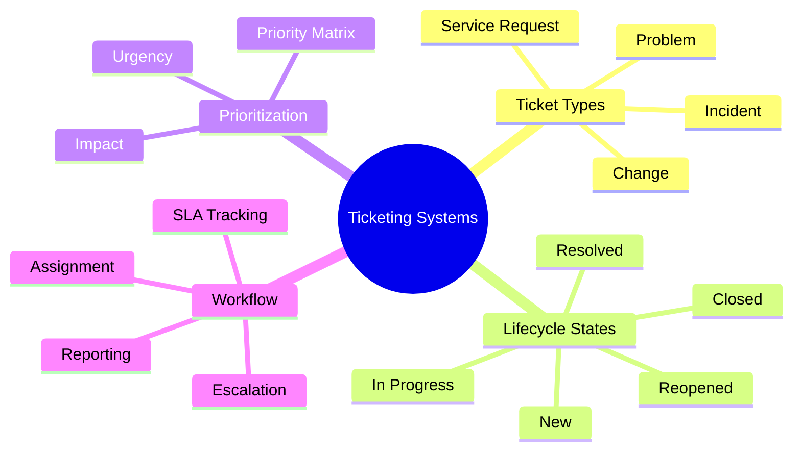
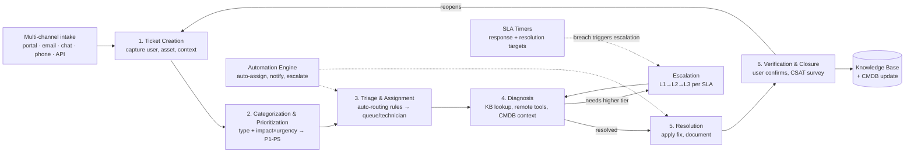

# Ticketing Systems and Workflow Management
## TCM Exam Objectives

- **Define the purpose of a ticketing system in a SOC** – Explain how it captures, routes, tracks, and resolves security incidents and service requests through structured workflows governed by SLAs.
- **Describe the ticket lifecycle** – List the stages: creation → categorization/prioritization → triage/assignment → diagnosis → resolution/escalation → closure.
- **Distinguish ticket types** – Differentiate Incident tickets (restore service), Service Request tickets (fulfill need), Problem tickets (find root cause), and Change tickets (modify infrastructure).
- **Apply the Impact × Urgency priority matrix** – Calculate priority (P1–P5) by combining impact (scope of damage) and urgency (time sensitivity). Know P1 = Critical (15 min response, 4h resolution).
- **Understand SLA and escalation mechanics** – Explain functional escalation (L1→L2→L3), hierarchical escalation (manager notification), and automatic escalation (SLA breach triggers).
- **Identify automation patterns** – Auto-assignment, auto-categorization via NLP/ML, SLA-driven escalation, approval workflows, and auto-resolution for known issues.
- **Know key integration points** – CMDB (asset context), monitoring/observability tools (auto-create tickets from alerts), knowledge base (attach resolutions), collaboration tools (Slack/Teams).
- **List ticketing KPIs** – Know targets for First Response Time, MTTR, First Contact Resolution (FCR >70%), SLA Breach Rate, Backlog Volume, Reopen Rate, CSAT.

A ticketing system is a centralized platform that captures, routes, tracks, and resolves service requests and incidents through a structured workflow governed by SLAs, automation rules, and escalation paths — it's the operational backbone of IT service management (ITSM), turning chaotic ad-hoc requests into a measurable, auditable service delivery pipeline.【turn0search4】【turn4fetch1】

📌 **Exam Tip:** The PSAA exam tests the Impact × Urgency matrix. Memorize: P1 = High Impact + High Urgency = Critical (15 min response). A question may give you impact ("entire company can't work") and urgency ("must be fixed today") and ask you to calculate priority — that's P1.

## Platform Landscape at a Glance

| Platform | Best For | Strengths | Pricing | Implementation |
|---|---|---|---|---|
| **ServiceNow** | Enterprises, complex workflows | AI-powered features, Integration Hub (100+ connectors), robust CMDB, full ITIL adherence | Subscription (enterprise quote) | ~6 weeks initial, ~3 months full |
| **Jira Service Management** | Dev teams, agile orgs | Developer-friendly APIs, Atlassian Marketplace, fast setup | From $20/agent | 2 weeks–2 months |
| **Freshservice** | SMBs, fast onboarding | Learns from past incidents, intuitive UI | $25–$130/agent/mo | 3–6 months |
| **Zendesk** | Customer-centric teams | Omnichannel intake (email, social, chat), strong reporting | $69–$149/agent/mo | 30 days–6 months |
| **Ivanti Neurons** | Enterprises with legacy systems | Customizable self-service portal, iPaaS | Quote-based | Weeks–months |
| **SolarWinds Service Desk** | Mid-size orgs, IT + observability | AI/ML, integrated observability stack | $39–$99 | Weeks–months |

Source: 【turn1fetch1】

---

## The Ticket Lifecycle — End to End

The ticket lifecycle is the structured path a request follows from creation to resolution, where every stage defines ownership, priority, and next steps. A typical lifecycle moves through creation → categorization/prioritization → triage/assignment → diagnosis → resolution/escalation → closure.【turn1fetch0】

The dotted lines show the control plane that overlays the linear lifecycle: SLA timers run alongside every stage and trigger automatic escalation on breach, while the automation engine handles routing, notifications, and even auto-resolution for known issues.【turn3search5】【turn3search6】

---

## Module 1 — Core Components

A modern ITSM ticketing system isn't just a database of requests; it's a suite of integrated modules.【turn0search0】【turn0search4】

**Intake channels** — self-service portal, email, chat (Slack/Teams), phone, and API-driven creation from monitoring tools. Omnichannel intake ensures tickets are captured consistently regardless of how the request arrives.【turn1fetch1】

**Ticket record & data model** — each ticket carries requester info, category, priority, SLA timers, assignment, status, work notes, activity log, and links to related CIs, problems, or changes. The richness of this record is what enables reporting and automation downstream.【turn4fetch1】

**Service catalog** — predefined, requestable services (new laptop, software access, onboarding) with conditional forms, approval workflows, and fulfillment SLAs. Catalog items standardize intake so requests arrive with complete information.【turn5find1】

**Workflow engine** — the rules layer that moves tickets through states: auto-assignment by category/skill, status transitions, approval routing, escalation triggers, and notifications. This is what separates a ticketing *system* from a ticketing *list*.【turn3search5】【turn3search8】

**Knowledge base** — searchable articles linked to tickets so analysts can attach resolutions and users can self-serve. KB articles are the feedback output of resolved tickets, closing the loop between resolution and prevention.【turn4fetch1】

**Reporting & analytics** — dashboards on volume, SLA performance, backlog, CSAT, and category breakdowns. Without measurement, the lifecycle stays on paper.【turn4fetch1】

---

## Module 2 — Ticket Types

ITIL-aligned ticketing systems distinguish several ticket types, each with its own workflow and purpose.【turn0search4】

**Incident tickets** — generated when an event disrupts an IT service's operation. Goal: restore service as fast as possible. Example: "Email server down."

**Service request tickets** — generated when a user needs assistance, information, or access to a service. These follow a request fulfillment workflow, often with approvals. Example: "Provision new Salesforce license."

**Problem tickets** — created to investigate the root cause of recurring incidents. The goal isn't a quick fix; it's prevention. Example: "Why do checkout failures keep happening every Monday?" — opened after multiple related incidents.

**Change tickets** — track modifications to IT infrastructure: software updates, server maintenance, network architecture changes. These follow a change management workflow with risk assessment, CAB approval, and rollback plans.

| **Ticket Type** | **Goal** | **Example** | **Workflow** | **PSAA Exam Focus** |
|-----------------|----------|-------------|--------------|---------------------|
| **Incident** | Restore service ASAP | "Email server down" | Detect → Triage → Resolve | Fastest turnaround, SLA-driven |
| **Service Request** | Fulfill a need | "Provision new VPN access" | Submit → Approve → Fulfill | Follows request fulfillment, not IR |
| **Problem** | Find root cause of recurring incidents | "Why do checkout failures happen every Monday?" | Investigate → RCA → Prevent | Longest timeline, prevention-focused |
| **Change** | Modify infrastructure safely | "Apply security patch to database server" | Plan → Approve (CAB) → Implement → Review | Requires risk assessment and rollback plan |

📌 **Exam Tip:** The PSAA exam will present a scenario and ask you to classify it as an incident, service request, problem, or change. Remember: "Server is down, restore it" = Incident. "I need software installed" = Service Request. "Why do users keep losing connectivity?" = Problem. "Apply a firewall rule update" = Change.

The distinction matters because mixing them — treating every request as an incident, or every incident as a change — breaks SLAs, skews metrics, and hides root-cause patterns.【turn0search4】
---

## Module 3 — Prioritization: The Impact × Urgency Matrix

Priority isn't arbitrary; it's calculated from two dimensions.【turn3search1】【turn3search2】

- **Impact** — the extent of the incident and potential damage (how many users/services affected)
- **Urgency** — how quickly a resolution is required (time-sensitive the issue is)

Combining the two on a matrix yields priority levels, typically P1–P5.【turn3search3】

| | Urgency: High | Urgency: Medium | Urgency: Low |
|---|---|---|---|
| **Impact: High** | P1 – Critical | P2 – High | P3 – Medium |
| **Impact: Medium** | P2 – High | P3 – Medium | P4 – Low |
| **Impact: Low** | P3 – Medium | P4 – Low | P5 – Planning |

**P1 (Critical)** scenarios: complete system outages, security breaches, data corruption, payment processing failures — demand immediate action and senior staff involvement.【turn3search0】

Without a defined matrix, prioritization depends on whoever picks up the ticket first, which over time skews SLAs, inflates backlog, and creates friction between support and the business.【turn3search1】

---

## Module 4 — SLAs and Escalation

SLAs (Service Level Agreements) are the contractual clock on every ticket — they define target response and resolution times by priority and trigger escalation when breached.

**Typical SLA targets by priority**

| Priority | Response Target | Resolution Target | Escalation |
|---|---|---|---|
| P1 – Critical | 15 min | 4 hours | Immediate, auto-page on-call + manager |
| P2 – High | 1 hour | 8 hours | Notify team lead at 50% SLA elapsed |
| P3 – Medium | 4 hours | 24 hours | Escalate at 75% elapsed |
| P4 – Low | 8 hours | 72 hours | Reminder at 90% elapsed |

The key shift in modern platforms is treating SLAs as **active triggers, not passive timers**. Instead of waiting for a breach and then firefighting, automation fires at 50%/75%/90% of SLA elapsed — paging a backup, notifying a manager, or re-routing — so breaches are caught before they happen.【turn3search6】

**Escalation rules** are predefined workflows that automatically escalate based on response delays, priority, or customer profile. Functional escalation moves a ticket up the tier ladder (L1→L2→L3); hierarchical escalation pulls in a manager; automatic escalation fires on SLA breach.【turn3search8】

---

## Module 5 — Automation and Workflows

Automation is where the ticketing system earns its keep — auto-categorizing, routing, and escalating tickets to eliminate the manual handoffs that cause delays.【turn0search1】

**Common automation patterns**

- **Auto-assignment** — tickets routed to queues based on category, department, or keyword. A Finance software access request auto-routes to the finance-apps queue; an Engineering hardware request routes to endpoint support.【turn5find1】
- **Auto-categorization & prioritization** — NLP/ML classifies incoming tickets and assigns priority before a human touches them.
- **SLA-driven escalation** — timers fire actions at thresholds rather than at breach.【turn3search6】
- **Approval workflows** — service requests trigger manager or CAB approval chains automatically.
- **Notification chains** — requester, assignee, and watchers updated at every state transition.
- **Auto-resolution** — for known issues (password resets, common errors), workflows execute scripted fixes and close the ticket without human intervention. About half of help desk calls are password resets — prime candidates for automation.【turn0search1】

---

## Module 6 — Integrations

A ticketing system in isolation is just a tracking tool. Its power comes from integration with the rest of the IT stack.

**CMDB (Configuration Management Database)** — a centralized database of IT assets (Configuration Items) and their relationships. Linking tickets to CIs gives technicians asset context, speeds diagnosis, and enables impact analysis. When a ticket is raised against a server, the CMDB shows what services depend on it, who owns it, and its recent change history.【turn0search16】【turn0search15】

**Monitoring / observability tools** — alerts from Datadog, SolarWinds, LogicMonitor, or SIEMs auto-create tickets when thresholds breach. This closes the event→alert→incident loop discussed in the previous lesson. Bi-directional integration lets the ticketing system update the monitoring tool when an incident is resolved.【turn0search17】

**Knowledge base** — analysts attach KB articles to tickets; resolved tickets feed new articles back. This is the flywheel that makes the service desk faster over time.【turn4fetch1】

**Collaboration / chat** — Slack, Teams, and email integrations let users create and update tickets from inside the tools they already use, and let technicians collaborate on resolution without context-switching.【turn1fetch1】

**Identity / IAM** — integration with Active Directory / Entra ID for SSO, auto-population of requester attributes, and role-based access control.

**Platform integration depth varies** — ServiceNow's Integration Hub offers 100+ out-of-box connectors via API, JDBC, ODBC, email, SNMP; Jira leans on the Atlassian Marketplace; Freshservice and Zendesk provide strong REST APIs; Ivanti offers iPaaS with REST/webhooks/SOAP.【turn1fetch1】

---

## Module 7 — KPIs and Measurement

What gets measured gets managed. The metrics that matter for a ticketing operation:

| Metric | What it reveals | Example |
|---|---|---|
| **First Response Time** | How quickly IT acknowledges a request | 15 min from creation to first human reply |
| **Time to Own** | Delays before actual work begins | 1.5 hrs from submission to assignment |
| **MTTR (Time to Resolve)** | End-to-end resolution speed | 6 hrs from open to resolved |
| **FCR (First Contact Resolution)** | % resolved on first interaction | Target: 70%+ |
| **SLA Breach Rate** | % of tickets missing targets | 12% breach signals workload/routing issues |
| **Backlog Volume** | Unresolved tickets at a point in time | 240 open, 60 aged >7 days |
| **Reopened Ticket Rate** | Quality of resolution | 8% reopen suggests rushed closures |
| **Escalation Rate** | % moving up tiers | 15% — flags training gaps or complexity |
| **CSAT** | User satisfaction post-resolution | 4.2/5 average rating |

Sources: 【turn4fetch1】【turn3search11】【turn3search13】

---

## Module 8 — AI and the Modern Ticketing Stack

AI is reshaping ticketing from passive tracking to active resolution. Gartner predicts agentic AI will autonomously resolve 80% of common service issues without human intervention by 2029.【turn3search15】

**Where AI is landing today**

- **Auto-triage** — LLMs classify tickets, assign categories, and set priority with 81–89% accuracy in studies, often matching human consensus for routine categorization.【turn3search16】
- **Action-taking triage** — beyond tagging, AI reads the ticket, reasons about intent, calls the right API (password reset, license provisioning, refund), and writes back to the user. Forrester pegs the cost difference at ~$4.75 per classified-only ticket vs. ~$0.38 per fully resolved one.【turn3search18】
- **Resolution suggestion** — LLMs surface similar past tickets and recommended resolution steps, enriching the ticket with context 10× faster than manual lookup. One mid-market Jira implementation reported 80%+ autonomous resolution with <1% of decisions overturned by humans.【turn3search17】
- **SLA prediction** — ML models forecast which tickets are likely to breach before the timer fires, enabling proactive intervention.【turn3search19】

ServiceNow leads the AI-in-ITSM race per Gartner's 2024 Magic Quadrant, with AI embedded across triage, categorization, and expert identification.【turn1fetch1】 The pattern across platforms: AI compresses the distance between intake and resolution, with humans increasingly reviewing AI-generated determinations rather than executing every step themselves.

---

## Best Practices Recap

- **Define the lifecycle before tooling** — the steps (creation → categorization → triage → diagnosis → resolution → closure) must be documented, trained, and enforced; the tool automates the process, it doesn't invent it.【turn1fetch0】
- **Treat SLAs as active triggers** — fire actions at 50/75/90% elapsed, not at breach.【turn3search6】
- **Use the priority matrix consistently** — without it, prioritization becomes whoever picks up first.【turn3search1】
- **Distinguish ticket types** — incidents, requests, problems, and changes each have different goals and workflows; mixing them corrupts metrics and SLAs.【turn0search4】
- **Invest in CMDB and KB integration** — asset context and resolution knowledge are what turn a tracking tool into a service platform.【turn0search16】【turn4fetch1】
- **Automate the repetitive** — password resets, access requests, and routine status checks shouldn't consume skilled staff time.【turn0search1】
- **Measure the right KPIs** — FCR, MTTR, SLA breach rate, CSAT, and reopen rate together tell you whether the system is healthy, not just busy.【turn4fetch1】

The throughline: a ticketing system is the connective tissue between events/alerts/incidents (upstream) and the tiered analyst workforce (downstream). It's where signals become work, where work becomes measurable, and where measurement becomes improvement.