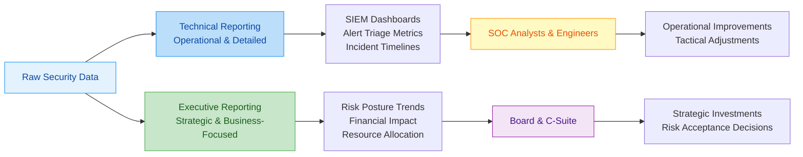
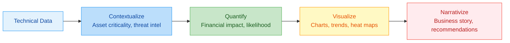

# ?? Executive vs. Technical Reporting: A Full-Stack Lesson for Cybersecurity Professionals


## TCM Exam Objectives

- **Distinguish executive from technical reporting** � Know audience (Board/C-Suite vs. SOC Analysts/Engineers), focus (business risk vs. operational details), time horizon (strategic months/years vs. real-time/days), and language (business terms vs. technical jargon).
- **Identify the Board's core question** � Understand that the Board asks: "Are we spending the right amount on the right risks?" This is a capital allocation question framed as security.
- **Translate technical metrics to executive terms** � Know how to convert MTTD (4.2 hours ? "we detect active intrusions within 4.2 hours, 48% faster than industry average"), vulnerability counts (847 open ? "3 internet-facing systems with active exploits, $2.3M potential breach cost").
- **Structure an executive dashboard** � Know the components: overall risk score, trend indicators, critical alerts, compliance status, incident summary, resource utilization, strategic initiatives.
- **Apply the five-step translation process** � Contextualize ? Quantify ? Visualize ? Narrativize ? Develop recommendations.
- **Avoid common translation pitfalls** � Vanity metrics ("we blocked 1M attacks"), technical jargon ("implemented UEBA with ML"), missing context, no business impact, no recommendations.
- **Tailor reports by industry** � Know how reporting differs for Financial Services (GLBA, PCI DSS), Healthcare (HIPAA), Government (FISMA), and Critical Infrastructure (NERC CIP).
- **Use NIST CSF 2.0 as a reporting framework** � Map SOC activities to the six functions (Govern, Identify, Protect, Detect, Respond, Recover) for structured executive reporting.

# ?? Executive vs. Technical Reporting: A Full-Stack Lesson for Cybersecurity Professionals

## ?? Lesson Overview
This lesson provides a comprehensive exploration of the critical distinctions between **executive reporting** and **technical reporting** in cybersecurity. You'll learn how to tailor communication to different audiences, translate technical metrics into business value, and develop reporting frameworks that drive informed decision-making at all organizational levels.



?? **Exam Tip:** The PSAA exam will ask you to identify which type of reporting is appropriate for a given audience. If the audience is "Board of Directors," the answer is executive reporting (risk posture, financial impact, strategic recommendations). If the audience is "SOC analysts monitoring the SIEM," the answer is technical reporting (MTTD, alert queue, IOCs).

## 1. ?? Understanding the Fundamental Differences

### 1.1 Core Definitions and Purposes

**Technical Reporting** focuses on operational details, specific metrics, and actionable information for security practitioners. It answers "what happened, how, and what should we do technically?" ?turn0search1?. The primary audience includes SOC analysts, security engineers, and incident responders who need granular data to perform their daily functions.

**Executive Reporting** translates technical metrics into business-relevant risk narratives that board members and executives can use for strategic decision-making ?turn0search5?. It answers "what is the business impact, what are our risks, and what resources do we need?" The audience includes C-suite executives, board members, and business stakeholders without deep technical backgrounds.

### 1.2 Key Differences at a Glance

<details>
<summary>?? Comprehensive Comparison Table</summary>

| **Aspect** | **Technical Reporting** | **Executive Reporting** |
|------------|-------------------------|-------------------------|
| **Primary Audience** | SOC Analysts, Security Engineers, IR Teams | Board of Directors, C-Suite, Business Leaders |
| **Focus** | Operational efficiency, detection accuracy, incident details | Business risk, financial impact, strategic alignment |
| **Time Horizon** | Real-time to tactical (hours/days) | Strategic (months/years) |
| **Detail Level** | High - specific IPs, hashes, timestamps, KQL queries | Low - trends, risk scores, business impact |
| **Metrics Examples** | MTTD, MTTR, false positive rate, alert volume | Risk posture trends, potential breach cost, compliance status |
| **Actionability** | Immediate technical actions (patch, isolate, investigate) | Resource allocation, risk acceptance, strategic investments |
| **Language** | Technical jargon, CVE IDs, MITRE ATT&CK techniques | Plain business language, financial terms, risk concepts |
| **Frequency** | Continuous, real-time, per-incident | Periodic (monthly/quarterly), per-major incident |
| **Success Measurement** | Faster detection, reduced false positives, efficient response | Improved risk posture, adequate resource allocation, informed governance |

</details>

## 2. ?? Technical Reporting: Deep Dive

### 2.1 Essential Technical Metrics and KPIs

<details>
<summary>?? Comprehensive Technical Metrics Framework</summary>

#### **Detection & Response Metrics**
| **Metric** | **Definition** | **Target** | **Industry Benchmark** |
|------------|----------------|------------|------------------------|
| **Mean Time to Detect (MTTD)** | Average time from incident occurrence to detection | < 4 hours | 4-24 hours |
| **Mean Time to Acknowledge (MTTA)** | Average time from alert generation to analyst review | < 15 minutes | 15-30 minutes |
| **Mean Time to Resolve (MTTR)** | Average time from detection to full resolution | < 4 hours | 4-8 hours |
| **False Positive Rate** | Percentage of alerts that don't represent actual incidents | < 5% | 10-30% |
| **Detection Coverage** | Percentage of MITRE ATT&CK techniques covered by detections | > 65% | 40-60% |

#### **Operational Efficiency Metrics**
| **Metric** | **Definition** | **Target** | **Industry Benchmark** |
|------------|----------------|------------|------------------------|
| **Alerts per Analyst per Shift** | Number of alerts handled by each analyst per shift | 20-30 | 50-100 (overloaded) |
| **Analyst Utilization** | Percentage of time analysts spend on active investigation | 70-80% | 60-70% |
| **Escalation Rate** | Percentage of incidents requiring escalation to higher tiers | < 20% | 20-30% |
| **First-Call Resolution Rate** | Percentage of incidents resolved at Tier 1 | > 50% | 30-40% |
| **Tool ROI** | Return on investment for security tools | > 3:1 | 2:1 |

#### **Incident-Specific Metrics**
- **Incident Timeline**: Detailed chronological sequence of events with timestamps
- **Affected Assets**: Specific systems, data, and users impacted
- **Attack Vector**: Method of initial compromise and lateral movement
- **Indicators of Compromise (IOCs)**: Hashes, IPs, domains, and artifacts
- **Containment Actions**: Specific steps taken to isolate and neutralize threats

**Example Technical Report Excerpt**:
```
Incident ID: INC-2026-0421
Detection Time: 2026-04-21 14:32 UTC
Severity: High
Affected Systems: 3 endpoints, 1 database server
Attack Vector: Spear-phishing email with malicious attachment
IOCs: 
  - File hash: a1b2c3d4e5f6...
  - C2 domain: malicious-domain.com
  - IP: 192.168.1.100
Containment: 
  - 14:35 - Isolated affected endpoints
  - 14:40 - Blocked C2 domain at firewall
  - 14:45 - Reset compromised user credentials
Status: Contained, pending eradication
```
</details>

### 2.2 Technical Reporting Tools and Templates

<details>
<summary>??? Technical Reporting Stack</summary>

#### **SIEM and SOC Platforms**
- **Splunk Enterprise Security**: Custom dashboards and correlation searches
- **IBM QRadar**: Incident timeline and forensic evidence packages
- **Microsoft Sentinel**: Workbooks and hunting queries with KQL
- **Exabeam**: User and entity behavior analytics reports

#### **Incident Response Platforms**
- **Swimlane**: Automated case management with detailed audit trails
- **IBM Resilient**: Artifact tracking and evidence chain of custody
- **Palo Alto Cortex XSOAR**: War room summaries and action histories

#### **Forensic Analysis Tools**
- **EnCase/FTK**: Disk image analysis reports with file system timelines
- **Volatility**: Memory analysis with process listings and network connections
- **Wireshark**: Packet capture analysis with protocol dissection

#### **Standard Technical Report Template**:
```markdown
# Incident Technical Report - [Incident ID]

## Executive Summary
- **Incident Date**: [Date/Time]
- **Severity**: [Critical/High/Medium/Low]
- **Status**: [Open/Contained/Resolved]
- **Affected Systems**: [Count and types]

## Detailed Timeline
| Time (UTC) | Event | Source | Action Taken |
|------------|-------|--------|--------------|
| 14:32 | Initial detection | EDR alert | Alert triage began |
| 14:35 | Confirmation | Sandbox analysis | Isolation ordered |
| 14:40 | Containment | Firewall block | C2 domain blocked |

## Technical Analysis
### Attack Vector
- **Initial Compromise**: Spear-phishing email with malicious macro
- **Lateral Movement**: SMB exploit (MS17-010)
- **Privilege Escalation**: Token impersonation

### Indicators of Compromise
| Type | Value | First Seen | Last Seen |
|------|-------|------------|-----------|
| File Hash | SHA256: a1b2c3... | 14:32 | 14:35 |
| Domain | malicious-domain.com | 14:34 | 14:40 |
| IP | 192.168.1.100 | 14:33 | 14:38 |

## Impact Assessment
- **Data Compromised**: Customer PII records (estimated 5,000)
- **Systems Affected**: 3 endpoints, 1 database server
- **Business Impact**: 4 hours of downtime for customer portal

## Containment & Eradication
- Isolated affected systems from network
- Reset all potentially compromised credentials
- Removed malicious files and registry entries
- Applied security patches for vulnerabilities

## Recommendations
1. Implement email filtering for malicious attachments
2. Enhance endpoint detection rules for similar malware
3. Conduct user awareness training for phishing
4. Review and update incident response playbooks
```
</details>

## 3. ?? Executive Reporting: Strategic Communication

### 3.1 The Board's Perspective and Needs

<details>
<summary>?? Understanding Board-Level Information Requirements</summary>

Boards and executives are sophisticated decision-makers who govern organizations worth hundreds of millions or billions of dollars. They evaluate capital allocation, M&A risk, regulatory exposure, and competitive positioning. However, they are **not trained** to interpret technical security metrics ?turn0search5?.

#### **The Board's Core Question**
Behind every board question about cybersecurity is a version of the same underlying concern: **"Are we spending the right amount on the right risks?"** This is a capital allocation question framed as a security question. The board needs to know:
1. Whether the security program is reducing the most material risks to the business
2. Whether the current investment level is appropriate relative to the threat environment
3. Whether there are specific risks that require additional investment or acceptance decisions that only the board can authorize

#### **Why Technical Metrics Fail at Board Level**
1. **CVSS scores and vulnerability counts are operational, not strategic**: They tell security teams whether operations are performing against known workloads but do not convey business risk, financial exposure, or governance decisions ?turn0search5?.
2. **Mean-time metrics require operational context**: A mean time to detect of 4 hours is only meaningful if the board knows what assets were involved, what the detection baseline was, and what financial exposure existed during the detection window.
3. **Technical reporting creates passive governance**: Boards trained to review metrics they cannot contextualize become rubber stamps rather than active governors, eliminating the CISO's ability to use board authority for resource escalation or strategic decisions.
4. **SEC disclosure rules raised the bar**: The SEC's 2023 cybersecurity disclosure rules require material risk disclosure rather than process description, establishing an external legal standard for the minimum quality of board-level security understanding ?turn0search5?.

#### **What Boards Actually Need**
- **Risk posture trends** (improving or deteriorating)
- **Peer benchmarking** where available
- **Specific investments required** to address highest-priority exposures
- **Metrics tied to** the organization's cyber insurance coverage requirements
- **Financial impact** of potential incidents
- **Compliance status** and regulatory exposure
- **Strategic alignment** of security with business objectives
</details>

### 3.2 Effective Executive Reporting Framework

<details>
<summary>?? Executive Reporting Structure & Content</summary>

#### **Executive Summary Format** (1-2 slides max)
```markdown
# Cybersecurity Risk Update - [Quarter/Year]

## Current Risk Posture
- **Overall Risk Level**: [Low/Moderate/Elevated/High] (?/? from last quarter)
- **Key Achievements**: 
  - Reduced critical vulnerability remediation time by 35%
  - Achieved 98% compliance with [regulation]
- **Critical Concerns**:
  - 3 internet-facing systems with actively exploited vulnerabilities
  - Increasing sophistication of phishing attacks targeting finance team

## Financial Impact
- **Potential Breach Cost**: $2.3M (based on industry benchmarks)
- **Current Security Investment**: 0.8% of IT budget (industry average: 1.2%)
- **Recommended Investment**: $450K for advanced threat detection

## Strategic Recommendations
1. **Approve $450K investment** for threat detection platform
2. **Accept risk** for legacy system vulnerabilities (cost: $1.2M to remediate)
3. **Enhance oversight** of third-party vendor risks
```

#### **Key Executive Metrics Translated**
| **Technical Metric** | **Executive Translation** | **Business Value** |
|---------------------|-------------------------|-------------------|
| 847 open vulnerabilities | 3 internet-facing systems with actively exploited CVEs | $2.3M potential breach cost |
| 94% patching compliance | 6% of critical systems unpatched beyond SLA | $1.8M exposure during detection window |
| MTTD: 4.2 hours | 4.2 hours to detect active intrusion | $45K/hour business impact |
| 15 incidents last quarter | 3 incidents affecting customer data | Regulatory reporting required, $500K fine risk |
| 0 critical incidents | No material breaches detected | Program effectiveness validated |

#### **Board Reporting Templates**
1. **Risk Posture Dashboard**: Traffic light reporting (Red/Amber/Green) on critical risk areas
2. **Trend Analysis**: 12-month rolling metrics showing improvement or deterioration
3. **Peer Benchmarking**: Comparison with industry peers and competitors
4. **Investment ROI**: Security spending vs. risk reduction metrics
5. **Compliance Status**: Regulatory requirement adherence and audit findings
6. **Incident Impact**: Business disruption and financial impact of incidents
</details>

### 3.3 Cyber Risk Quantification for Executives

<details>
<summary>?? Translating Technical Risk into Financial Terms</summary>

#### **Risk Quantification Framework**
1. **Identify Critical Assets**: Determine business value of systems and data
2. **Threat Modeling**: Assess likelihood and impact of various attack scenarios
3. **Financial Impact Analysis**: Calculate potential costs including:
   - **Direct Costs**: Incident response, legal fees, regulatory fines
   - **Indirect Costs**: Business disruption, customer churn, reputational damage
   - **Opportunity Costs**: Delayed initiatives, competitive disadvantage

#### **Example: Translating Patch Metrics**
**Technical Report**: "We patched 94% of critical vulnerabilities within SLA this quarter, up from 87% last quarter."

**Executive Translation**: "We improved our patching performance, but the 6% of unpatched critical systems include 3 internet-facing applications with known active exploits. These represent $2.3M in potential breach cost based on industry benchmarks. We recommend investing $150K in automated patching tools to address this gap."

#### **Risk Matrix Example**
| **Risk Scenario** | **Likelihood** | **Financial Impact** | **Risk Score** | **Treatment** |
|-------------------|----------------|----------------------|----------------|---------------|
| Ransomware attack | Medium | $5-10M | High | Mitigate ($300K investment) |
| Data breach | Medium | $2-5M | Medium | Transfer (cyber insurance) |
| Insider threat | Low | $1-3M | Low | Accept (monitor) |
| Third-party breach | High | $1-2M | Medium | Mitigate (vendor management) |

#### **Industry Benchmarking**
- **Security Spending**: 0.8-1.2% of IT budget (your organization: 0.8%)
- **Incident Frequency**: 2-5 incidents per year (your organization: 3)
- **MTTD**: 4-8 hours (your organization: 4.2 hours)
- **MTTR**: 4-8 hours (your organization: 6.1 hours)
</details>

## 4. ?? The Translation Process: Technical to Executive

### 4.1 Step-by-Step Translation Framework



<details>
<summary>?? Detailed Translation Process</summary>

#### **Step 1: Contextualize Technical Metrics**
- **Asset Criticality**: Weight vulnerabilities by business impact of affected systems
- **Threat Intelligence**: Correlate vulnerabilities with active exploitation in the wild
- **Environmental Factors**: Consider existing controls and mitigations
- **Historical Context**: Compare with previous periods and industry benchmarks

#### **Step 2: Quantify Business Impact**
- **Financial Modeling**: Calculate potential costs of incidents
- **Risk Scoring**: Develop consistent risk scoring methodology
- **Scenario Analysis**: Model various attack scenarios and outcomes
- **ROI Calculation**: Quantify return on security investments

#### **Step 3: Visualize for Executive Consumption**
- **Dashboards**: Executive-friendly visualizations with drill-down capability
- **Trend Analysis**: 12-month rolling metrics showing direction
- **Heat Maps**: Risk visualization by business unit or asset type
- **Benchmark Comparisons**: Peer and industry comparisons

#### **Step 4: Craft Business Narrative**
- **Executive Summary**: 1-2 paragraph synopsis with key findings
- **Risk Posture**: Overall assessment with trend direction
- **Key Concerns**: Top 3-5 risks requiring attention
- **Recommendations**: Specific actions with resource requirements
- **Decision Points**: Clear choices for board consideration

#### **Step 5: Develop Actionable Recommendations**
- **Prioritized Actions**: Based on risk reduction and business value
- **Resource Requirements**: Specific budget and staffing needs
- **Timeline**: Implementation schedule with milestones
- **Success Metrics**: How effectiveness will be measured
- **Alternative Options**: Risk acceptance or transfer considerations
</details>

### 4.2 Common Translation Pitfalls and Solutions

<details>
<summary>?? Avoiding Translation Mistakes</summary>

| **Pitfall** | **Example** | **Solution** |
|-------------|-------------|--------------|
| **Vanity Metrics** | "We blocked 1M attacks last quarter" | "We reduced successful intrusion attempts by 35%" |
| **Technical Jargon** | "Implemented UEBA with ML algorithms" | "Enhanced detection of insider threats using behavioral analytics" |
| **Missing Context** | "MTTD is 4.2 hours" | "MTTD is 4.2 hours, 48% faster than industry average" |
| **No Business Impact** | "15 incidents last quarter" | "3 incidents affected customer data, $500K regulatory fine risk" |
| **No Recommendations** | "847 open vulnerabilities" | "3 critical vulnerabilities need $150K to remediate, preventing $2.3M breach risk" |
| **No Trend Analysis** | "94% patching compliance" | "Patching compliance improved from 87% to 94%, reducing risk exposure by $1.8M" |

**Key Principle**: Every technical metric should answer the "So what?" question for business stakeholders. If it doesn't inform a business decision, it doesn't belong in executive reporting.
</details>
## 5. ?? Reporting Frameworks and Standards

### 5.1 NIST Cybersecurity Framework (CSF) 2.0

<details>
<summary>??? NIST CSF 2.0 Reporting Alignment</summary>

The NIST CSF 2.0 provides a comprehensive framework for organizing and communicating cybersecurity risk ?turn0search22?. It consists of six functions that provide structure for both technical and executive reporting:

#### **Govern Function** (New in CSF 2.0)
- **Executive Focus**: Organizational context, risk management strategy, roles & responsibilities
- **Technical Focus**: Policy implementation, governance workflows
- **Reporting Example**: "Cybersecurity governance structure established with clear accountability for risk decisions"

#### **Identify Function**
- **Executive Focus**: Asset management, business environment, governance
- **Technical Focus**: Asset inventories, business impact analysis
- **Reporting Example**: "100% of critical assets identified and prioritized based on business impact"

#### **Protect Function**
- **Executive Focus**: Access control, awareness & training, data security
- **Technical Focus**: Identity management, protective technology
- **Reporting Example**: "Implemented privileged access management for 100% of critical systems"

#### **Detect Function**
- **Executive Focus**: Anomalies & events, security continuous monitoring
- **Technical Focus**: Detection processes, monitoring technologies
- **Reporting Example**: "Mean time to detect decreased from 6.2 to 4.2 hours (32% improvement)"

#### **Respond Function**
- **Executive Focus**: Response planning, communications, analysis
- **Technical Focus**: Mitigation, improvements
- **Reporting Example**: "Incident response playbooks updated for 95% of likely attack scenarios"

#### **Recover Function**
- **Executive Focus**: Recovery planning, improvements
- **Technical Focus**: Recovery processes, communications
- **Reporting Example**: "Business continuity plans tested for all critical business processes"

#### **Executive Reporting Template Based on NIST CSF**:
```markdown
# NIST CSF Risk Posture Report

## Govern (Governance)
- **Risk Management Strategy**: [Status and effectiveness]
- **Organizational Context**: [Alignment with business objectives]
- **Roles & Responsibilities**: [Clarity and accountability]

## Identify (Asset Management)
- **Critical Asset Coverage**: [% of assets identified]
- **Business Impact Analysis**: [Completion status]
- **Risk Assessment**: [Methodology and frequency]

## Protect (Safeguards)
- **Access Control Effectiveness**: [Metrics]
- **Awareness Training**: [Completion and effectiveness]
- **Data Security**: [Controls and status]

## Detect (Anomaly Detection)
- **Detection Coverage**: [% of ATT&CK techniques covered]
- **Monitoring Effectiveness**: [MTTD trends]
- **Alert Quality**: [False positive rates]

## Respond (Incident Response)
- **Response Capability**: [Metrics]
- **Communication Protocols**: [Testing and effectiveness]
- **Lessons Learned**: [Implementation status]

## Recover (Resilience)
- **Recovery Planning**: [Completeness]
- **Improvement Implementation**: [Status]
- **Business Continuity**: [Testing and readiness]
```
</details>

### 5.2 Industry-Specific Reporting Standards

<details>
<summary>?? Tailoring Reports to Industry Requirements</summary>

#### **Financial Services (GLBA, PCI DSS)**
- **Focus**: Customer data protection, transaction security
- **Key Metrics**: Fraud prevention, compliance audit results
- **Executive Concern**: Regulatory fines, customer trust, financial loss
- **Technical Details**: Encryption status, access logs, vulnerability scans

#### **Healthcare (HIPAA, HITECH)**
- **Focus**: Protected Health Information (PHI) security
- **Key Metrics**: PHI exposure incidents, breach notification compliance
- **Executive Concern**: Patient safety, regulatory penalties, reputational damage
- **Technical Details**: Audit logs, access controls, encryption status

#### **Government/Federal (FISMA, NIST 800-53)**
- **Focus**: National security systems, citizen data protection
- **Key Metrics**: Authorization status, continuous monitoring
- **Executive Concern**: National security, public trust, compliance mandates
- **Technical Details**: Control implementations, assessment results

#### **Critical Infrastructure (NERC CIP)**
- **Focus**: Operational technology and industrial control systems
- **Key Metrics**: System reliability, incident prevention
- **Executive Concern**: Service disruption, public safety, economic impact
- **Technical Details**: Network segmentation, access controls, monitoring
</details>

## 6. ??? Tools and Platforms for Reporting

### 6.1 Integrated Reporting Solutions

<details>
<summary>??? Technology Stack for Effective Reporting</summary>

#### **SIEM and Security Analytics Platforms**
- **Splunk Enterprise Security**: Custom dashboards, correlation searches, and reporting
- **IBM QRadar**: Incident timeline and forensic evidence packages
- **Microsoft Sentinel**: Workbooks and hunting queries with KQL
- **Exabeam**: User and entity behavior analytics reports

#### **GRC and Risk Management Platforms**
- **ServiceNow GRC**: Integrated risk management and compliance reporting
- **RSA Archer**: Risk quantification and executive dashboards
- **LogicGate**: Risk matrix visualization and trend analysis
- **CyberStrong**: Automated NIST CSF alignment and reporting

#### **Executive Dashboard Solutions**
- **Tableau**: Custom visualization with drill-down capability
- **Power BI**: Interactive dashboards with real-time data
- **Domo**: Business intelligence with mobile access
- **Dundas BI: Advanced analytics and visualization

#### **Specialized Reporting Tools**
- **Swimlane**: Automated case management with reporting templates
- **Cortex XSOAR**: War room summaries and incident reports
- **Living Security: AI-powered human risk reporting ?turn0search15?**
- **KavachOne: Board-level cybersecurity reporting templates ?turn0search17?**

#### **Key Features to Look For**:
1. **Pre-built Templates**: Industry-specific and role-based reporting
2. **Customization**: Ability to tailor metrics and visualizations
3. **Automation**: Scheduled report generation and distribution
4. **Integration**: Connection with existing security tools and data sources
5. **Drill-down**: Capability to investigate underlying data
6. **Mobile Access**: Executive-friendly mobile interfaces
7. **Collaboration**: Annotation and sharing capabilities
</details>

### 6.2 Building Effective Dashboards

<details>
<summary>?? Dashboard Design Best Practices</summary>

#### **Executive Dashboard Components**
1. **Overall Risk Score**: Single metric summarizing risk posture
2. **Trend Indicators**: Arrows showing direction of key metrics
3. **Critical Alerts**: High-priority items requiring immediate attention
4. **Compliance Status**: Traffic light indicators for key regulations
5. **Incident Summary**: Recent incidents with business impact
6. **Resource Utilization**: Budget and staffing metrics
7. **Strategic Initiatives**: Progress on key security programs

#### **Design Principles**:
- **Simplicity**: Maximum 5-7 key metrics per view
- **Clarity**: Plain language with minimal jargon
- **Context**: Industry benchmarks and historical comparisons
- **Actionability**: Clear implications and recommended actions
- **Visual Hierarchy**: Most important information prominent
- **Consistency**: Standard formats and time periods
- **Timeliness**: Current data with clear timestamps

#### **Example Executive Dashboard Layout**:
```
+---------------------------------------------+
|  CYBERSECURITY RISK POSTURE - Q4 2026      |
+---------------------------------------------+
| OVERALL RISK: MODERATE ?                    |
| (Up from LOW last quarter)                  |
+---------------------------------------------+
| CRITICAL METRICS:                           |
| � Breach Risk: $2.3M (?15%)                |
| � Compliance: 98% (?2%)                    |
| � Incidents: 3 (?2 from last quarter)      |
+---------------------------------------------+
| KEY CONCERNS:                               |
| 1. 3 unpatched internet-facing systems     |
| 2. Increasing phishing sophistication      |
| 3. Third-party vendor risk exposure        |
+---------------------------------------------+
| RECENT INCIDENTS:                           |
| � Customer data exposure (resolved)         |
| � Ransomware attempt (contained)            |
| � Insider threat investigation (ongoing)    |
+---------------------------------------------+
| RECOMMENDED ACTIONS:                        |
| 1. Approve $450K threat detection platform |
| 2. Accept risk for legacy systems           |
| 3. Enhance vendor risk management           |
+---------------------------------------------+
```
</details>

## 7. ?? Best Practices and Implementation Roadmap

### 7.1 Developing a Reporting Strategy

<details>
<summary>??? 6-Month Implementation Plan</summary>

#### **Months 1-2: Assessment and Planning**
- Conduct stakeholder interviews to understand information needs
- Audit current reporting processes and gaps
- Define reporting framework and metrics taxonomy
- Select and implement reporting tools and platforms
- Develop initial templates and dashboards

#### **Months 3-4: Development and Testing**
- Build automated data collection and integration
- Create executive dashboards and reports
- Develop technical reporting templates
- Establish reporting cadence and distribution
- Pilot test with key stakeholders

#### **Months 5-6: Refinement and Rollout**
- Incorporate feedback from pilot testing
- Finalize reporting templates and processes
- Train reporting staff and stakeholders
- Implement governance and quality assurance
- Establish continuous improvement process

#### **Key Success Factors**:
1. **Executive Sponsorship**: Visible support from C-suite and board
2. **Stakeholder Engagement**: Continuous input from report consumers
3. **Data Quality**: Accurate, timely, and consistent data sources
4. **Automation**: Reduce manual effort and human error
5. **Training**: Ensure both creators and consumers understand reports
6. **Governance**: Clear ownership and accountability for reporting
7. **Continuous Improvement**: Regular review and refinement
</details>

### 7.2 Common Challenges and Solutions

<details>
<summary>?? Overcoming Implementation Obstacles</summary>

| **Challenge** | **Impact** | **Solution** |
|---------------|------------|--------------|
| **Data Silos** | Incomplete or inconsistent reporting | Implement integrated GRC platform with single source of truth |
| **Metric Overload** | Confusing, unfocused reports | Establish hierarchy of metrics with clear definitions |
| **Technical Jargon** | Executive disengagement | Develop glossary and plain-language translations |
| **No Context** | Misinterpretation of metrics | Always include benchmarks, trends, and business impact |
| **Manual Processes** | Slow, error-prone reporting | Automate data collection and report generation |
| **No Follow-up** | Reports without action | Establish clear action plans and accountability |
| **Siloed Communication** | Reports not shared with right stakeholders | Implement role-based distribution and access |

**Critical Reminder**: The goal of reporting is not to present data but to drive informed decisions. Every report should answer: "What decision does this inform?" and "What action should be taken?" ?turn0search5?.
</details>

## 8. ?? Measuring Reporting Effectiveness

### 8.1 Key Performance Indicators for Reporting

<details>
<summary>?? Evaluating Your Reporting Program</summary>

#### **Usage Metrics**
- **Report Distribution**: Number of stakeholders receiving reports
- **Engagement Rate**: Open and review rates for digital reports
- **Meeting Attendance**: Participation in report review meetings
- **Follow-up Actions**: Number of decisions or actions resulting from reports

#### **Quality Metrics**
- **Timeliness**: Reports delivered on schedule
- **Accuracy**: Data quality and correctness
- **Completeness**: All required information included
- **Clarity**: Understanding by target audience
- **Actionability**: Reports leading to decisions or actions

#### **Impact Metrics**
- **Decision Quality**: Improved outcomes from data-driven decisions
- **Resource Allocation**: Better alignment of security investments
- **Risk Reduction**: Measurable improvement in risk posture
- **Compliance**: Enhanced regulatory adherence
- **Stakeholder Satisfaction**: Positive feedback from report consumers

#### **Continuous Improvement Process**:
1. **Collect Feedback**: Regular surveys and interviews with stakeholders
2. **Analyze Effectiveness**: Measure impact on decisions and actions
3. **Identify Gaps**: Areas needing improvement or additional information
4. **Implement Changes**: Update templates, metrics, and processes
5. **Monitor Results**: Track improvements in reporting effectiveness
</details>

## 9. ?? Future Trends in Security Reporting

### 9.1 Emerging Technologies and Approaches

<details>
<summary>?? The Future of Cybersecurity Reporting</summary>

#### **AI-Powered Reporting**
- **Natural Language Generation**: Automated narrative summaries from data
- **Predictive Analytics**: Forecasting risk trends and potential incidents
- **Anomaly Detection**: Identifying unusual patterns in security data
- **Personalized Insights**: Tailored information for individual stakeholders

#### **Real-Time Interactive Dashboards**
- **Live Data Feeds**: Real-time risk posture updates
- **Drill-down Capability**: Investigation of underlying metrics
- **Scenario Modeling**: "What-if" analysis for different risk scenarios
- **Mobile Accessibility**: Decision support anywhere, anytime

#### **Integrated Risk Management**
- **Holistic View**: Cybersecurity integrated with enterprise risk
- **Business Context**: Security metrics aligned with business processes
- **Financial Integration**: Security spending tied to business outcomes
- **Regulatory Alignment**: Compliance with evolving disclosure requirements

#### **Enhanced Visualization**
- **Interactive Heat Maps**: Dynamic risk visualization
- **3D Risk Modeling**: Spatial representation of threat landscapes
- **Temporal Analysis**: Time-based risk evolution
- **Comparative Benchmarking**: Real-time industry comparisons
</details>

## 10. ?? Lesson Summary and Action Plan

### 10.1 Key Takeaways

1. **Audience Matters**: Technical reporting serves operational needs; executive reporting drives strategic decisions ?turn0search1??turn0search5?.

2. **Translation is Critical**: Every technical metric must answer "So what?" for business stakeholders ?turn0search5?.

3. **Business Impact is King**: Executives care about financial impact, risk exposure, and resource allocation, not technical details ?turn0search5??turn0search6?.

4. **Context is Essential**: Metrics without context (benchmarks, trends, business impact) are meaningless ?turn0search5?.

5. **Frameworks Provide Structure**: NIST CSF 2.0 and other frameworks offer organized approaches to reporting ?turn0search22?.

6. **Automation Enables Scale**: Tools and platforms make consistent, timely reporting possible ?turn0search11??turn0search15?.

7. **Continuous Improvement is Necessary**: Reporting programs must evolve with business needs and threat landscapes.

### 10.2 Immediate Action Plan

<details>
<summary>?? 90-Day Implementation Checklist</summary>

#### **Days 1-30: Assessment and Planning**
- [ ] Identify key stakeholders and their information needs
- [ ] Audit current reporting processes and gaps
- [ ] Define reporting framework and metrics taxonomy
- [ ] Select reporting tools and platforms
- [ ] Develop initial templates and dashboards

#### **Days 31-60: Development and Testing**
- [ ] Build automated data collection and integration
- [ ] Create executive dashboards and reports
- [ ] Develop technical reporting templates
- [ ] Establish reporting cadence and distribution
- [ ] Pilot test with key stakeholders

#### **Days 61-90: Refinement and Rollout**
- [ ] Incorporate feedback from pilot testing
- [ ] Finalize reporting templates and processes
- [ ] Train reporting staff and stakeholders
- [ ] Implement governance and quality assurance
- [ ] Establish continuous improvement process

**Success Metrics for First 90 Days**:
- 100% of executives receive tailored security reports
- 50% reduction in time spent preparing reports
- 90% stakeholder satisfaction with report quality
- 3+ key decisions informed by security reports
</details>

## ?? Conclusion

Effective security reporting bridges the critical gap between technical execution and business strategy. By mastering both technical and executive reporting, security professionals can ensure that operational excellence translates into strategic value. The most successful security programs are those that can tell a compelling business story supported by solid technical data�driving informed decisions that protect and enable the organization.

> **Final Insight**: The best security reporting doesn't just inform�it transforms how organizations perceive and manage cyber risk. By translating technical metrics into business narratives, security professionals become strategic advisors rather than technical implementers. This shift in perspective is what enables organizations to make truly risk-informed decisions at every level.

---

**Additional Resources**:
- **NIST Cybersecurity Framework 2.0**: [Official Documentation](https://www.nist.gov/cyberframework) ?turn0search22?
- **CompTIA CySA+ Study Guide**: [Reporting & Communication Domain](https://certstud.com) ?turn0search4?
- **Executive Dashboard Templates**: [CyberSaint](https://www.cybersaint.io) ?turn0search11?
- **Board Reporting Guide**: [Decryption Digest](https://www.decryptiondigest.com) ?turn0search5?

*This lesson provides the foundation for developing comprehensive reporting capabilities that serve both technical and executive audiences. By implementing these practices, security professionals can enhance communication, drive better decisions, and demonstrate the business value of security investments.*