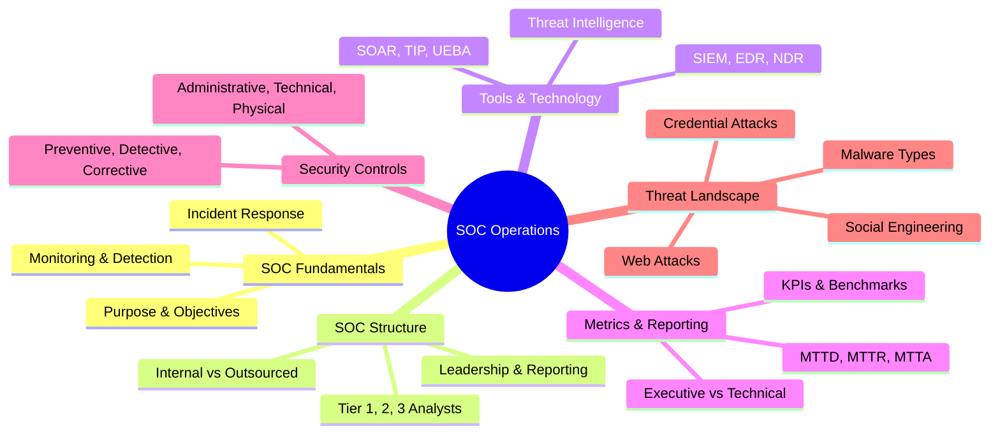
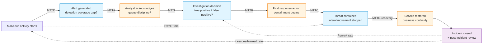

# Key Performance Indicators (KPIs) for a SOC
## TCM Exam Objectives

- **Categorize SOC KPIs** – Distinguish Detection KPIs (MTTD, detection coverage, FPR, FNR), Response KPIs (MTTA, MTTI, MTTR, MTTC, TTN), and Operational Health KPIs (alert volume, escalation rate, analyst utilization, SLA compliance, dwell time).
- **Understand the KPI pipeline** – Map each KPI to its point in the alert-to-closure workflow: MTTD (activity start → alert), MTTA (alert → acknowledge), MTTI (acknowledge → investigation decision), MTTR (detection → first action), MTTC (detection → containment).
- **Know healthy benchmark ranges** – MTTD: 30 min–4 hours. MTTA: critical 20 min, high 1h. MTTR: 2–4 hours. Detection coverage: 50–60%. FPR: ≤10–15% mature, ≤5% tuned. FNR: ≤1% critical. SLA compliance: ≥99%.
- **Recognize vanity metrics** – Identify "total alerts processed," "tickets closed," "threats blocked" as vanity metrics that describe activity but NOT effectiveness.
- **Understand tier-specific metrics** – Know that Tier 1 is measured on throughput and triage accuracy, Tier 2 on investigation depth and decision quality, Tier 3 on proactive outcomes (hunts, detection rules authored).
- **Apply the three-layer metrics framework** – Strategic (Board/CISO: dwell time, risk exposure), Operational (SOC leadership: MTTR, analyst workload), Tactical (analysts: FPR per rule, alert lifecycle).
- **Understand the alert-to-incident ratio** – Know this diagnostic metric: too many alerts never converting to incidents = over-alerting; too few alerts preceding incidents = coverage gaps.
- **Recognize definition inconsistency as a pitfall** – Explain why MTTR must be consistently defined across the team (e.g., "containment" means the same thing to all analysts).

SOC KPIs are quantifiable measurements that evaluate how effectively a Security Operations Center detects threats, responds to incidents, and sustains operational health — and a well-built metrics program balances **speed metrics** (MTTD, MTTA, MTTI, MTTR, MTTC), **quality metrics** (false positive/negative rates, detection coverage, classification accuracy), and **operational metrics** (alert volume, escalation rate, analyst utilization, SLA compliance) across three reporting layers: strategic, operational, and tactical.【turn1fetch0】【turn3fetch1】【turn7fetch0】

## How KPIs Map to the SOC Workflow

Every KPI lives at a specific point in the alert-to-closure pipeline. Knowing where each clock starts and stops is what makes the numbers comparable across teams and time.

The dotted lines show the cross-cutting metrics: dwell time spans from first malicious action to containment, rework rate measures closed cases that reopen, and the lessons-learned implementation rate feeds improvements back into detection coverage.【turn5fetch0】【turn9fetch1】

---

📌 **Exam Tip:** The PSAA exam tests which KPI maps to which lifecycle stage. Memorize the pipeline: MTTD (start → alert), MTTA (alert → acknowledge), MTTI (acknowledge → decision), MTTR (detection → first action), MTTC (detection → containment). A question may ask: "Which metric measures how quickly an analyst begins investigating after an alert fires?" That's MTTA.

## Master KPI Comparison Table

| Category | KPI | What It Measures | Formula | Healthy Benchmark | Primary Owner |
|---|---|---|---|---|---|
| **Detection** | MTTD | Time from malicious activity start to alert generation | Alerted At − Activity Started At, averaged | 30 min – 4 hrs (critical ≤ 2 hrs) | Detection Engineering |
| **Detection** | Detection Coverage | % of MITRE ATT&CK techniques with tested detections | Covered techniques ÷ total techniques | 50–60% (healthy) | Detection Engineering |
| **Detection** | False Positive Rate | % of alerts that are benign | False positives ÷ total alerts | ≤ 10–15% (mature); ≤ 5% (tuned) | Tier 1 / Detection Eng |
| **Detection** | False Negative Rate | % of real threats missed (critical) | Missed threats ÷ total real threats | ≤ 1% (critical) | Tier 3 / Threat Hunting |
| **Detection** | Asset / Telemetry Coverage | % of assets with sensors reporting | Monitored assets ÷ total assets | ≥ 98% | SOC Engineering |
| **Response** | MTTA | Time from alert creation to human acknowledgment | Acknowledged At − Alert Created At | Critical 20 min; High 1 hr; Med 2 hrs; Low 6 hrs | Tier 1 Lead |
| **Response** | MTTI | Time from detection to investigation decision | Decision At − Detection At | ≤ 60 min (critical) | Tier 1 / Tier 2 |
| **Response** | MTTR (Respond) | Time from detection to first meaningful response action | First action At − Detection At | Critical 30–60 min; overall 2–4 hrs | Incident Response |
| **Response** | MTTC | Time from detection to threat contained | Containment At − Detection At | Tracked by severity | Incident Response |
| **Response** | MTTR (Recovery) | Time to restore affected services after containment | Restored At − Containment At | Tracked by severity | IR / IT Operations |
| **Response** | Time to Notify (TTN) | Time from confirmed incident to org notification | Notify At − Confirmed At | Critical ≤ 15 min; High ≤ 30 min | SOC Manager |
| **Operational** | Alert Volume | Total alerts per period (by severity) | Count | Tracked as trend | SOC Manager |
| **Operational** | Escalation Rate | % of incidents escalated to higher tier | Escalated ÷ total incidents | ~15–20% (context-dependent) | SOC Manager |
| **Operational** | Analyst Utilization / Capacity | Available capacity vs expected work | Analysts × triage hours × days vs MTTR × alert volume × 1.15 | Capacity ≥ work + 15% buffer | SOC Manager |
| **Operational** | SLA Compliance | % of alerts meeting response/resolution SLAs | Met SLA ÷ total SLA-tracked | ≥ 99% | SOC Manager |
| **Operational** | Incident Closure Rate | % of open cases resolved in timeframe | Closed ÷ total open | ≥ 80% | SOC Manager |
| **Operational** | Investigation Rework Rate | % of closed cases reopened | Reopened ÷ total closed | Low / trending down | Tier 2 Lead |
| **Operational** | Threat Dwell Time | Time attacker in environment before containment | Containment At − Intrusion At | Trending down over time | CISO / SOC Manager |
| **Operational** | Severity Classification Accuracy | % correctly classified on first assessment | Correct ÷ total classified | ≥ 95% | Tier 1 / QA |
| **Operational** | Automated vs Manual Response Ratio | % response actions via SOAR/scripts | Automated actions ÷ total actions | Increasing over time | SOAR Engineering |

Sources: 【turn1fetch0】【turn2find0】【turn9fetch0】【turn4fetch0】【turn9fetch1】

---

## Module 1 — Detection KPIs

Detection metrics answer: *is the SOC seeing real threats, and only real threats?* Poor detection performance distorts every downstream metric.【turn3fetch1】

### MTTD (Mean Time to Detect)

Measures the average time from when malicious activity starts to when the SOC becomes aware of it — typically when an alert is generated or an incident is confirmed. High-performing teams fall between **30 minutes and 4 hours**; best-in-class providers achieve **≤ 2 hours for critical threats**. MTTD depends heavily on detection coverage and the alert ingestion pipeline's latency. Early-stage attack events like compromised VPN authentications are harder to detect quickly, which is why latency tends to creep in at the front of the kill chain.【turn1fetch0】【turn9fetch0】

### Detection Coverage (MITRE ATT&CK)

The percentage of MITRE ATT&CK techniques (194 pre-impact techniques) for which your team has implemented and tested detections. **A coverage of 50–60% is considered healthy**; chasing 100% is both unachievable and unadvisable because it consumes enormous operational energy on threats that may never materialize. Coverage gaps include not just missing detection logic but telemetry gaps where sensors cannot observe the events a technique requires — meaning even existing detections may not reach a reliable verdict.【turn1fetch0】【turn3fetch1】【turn9fetch1】

### False Positive Rate (FPR)

The percentage of alerts that turn out to be benign. FPR is the number one detection challenge for most SOCs and a direct driver of analyst workload — when it rises, MTTA and investigation time degrade with it. Benchmarks: **≤ 20% early maturity, ≤ 10–15% mature, ≤ 5% highly tuned**. At 10,000 alerts/month and 15% FPR, 1,500 alerts require unnecessary investigation; reducing to 8% frees roughly 700 analyst actions per month. Reducing FPR typically improves multiple IR metrics simultaneously because it restores focus and speeds decision-making.【turn9fetch0】【turn5fetch0】

### False Negative Rate (FNR)

The percentage of real threats the SOC missed. FNR is the most consequential measurement gap because **false negatives are structurally invisible** — standard metrics count observable events, and the threats you missed by definition do not appear in any dashboard. FNR is surfaced through purple team exercises, threat hunting, and third-party breach notifications. Target **≤ 1% for critical threats**.【turn9fetch0】【turn7fetch0】

### Asset / Telemetry Coverage

The percentage of assets with sensors actively reporting into the SOC's telemetry pipeline. Target **≥ 98%**. Unmonitored assets are blind spots where attackers can operate with zero signal generation — directly inflating FNR and dwell time.【turn9fetch0】
---

## Module 2 — Response KPIs

Response metrics decompose the pipeline between detection and resolution. Aggregate response time masks where the pipeline actually breaks; the value is in stage-level granularity.【turn7fetch0】

### MTTA (Mean Time to Acknowledge)

Time from alert creation to a human analyst (or automated IR system) formally acknowledging and beginning triage. MTTA reflects queue discipline and is **often the first signal a team is understaffed, overwhelmed, or struggling with prioritization**. Top-10% benchmarks: Critical **20 min**, High **1 hour**, Medium **2 hours**, Low **6 hours**.【turn1fetch0】【turn4fetch0】

### MTTI (Mean Time to Investigate)

The average time to investigate a possible but unconfirmed threat and decide whether it's a real incident or a false positive. Mature SOCs target **MTTI ≤ 60 minutes for critical alerts**. Long investigation times point to missing context, weak enrichment, or too much manual pivoting between tools. High-volume alert types with high MTTI are prime candidates for tuning, training, or automation.【turn1fetch0】【turn3fetch1】

### MTTR (Respond)

The most overloaded metric in security operations — the "R" may stand for respond, resolve, recover, or repair, and these are **not interchangeable**. A team may respond quickly but recover slowly. As "respond," it measures detection-to-first-action: generally **2–4 hours acceptable** across all severities, with **critical incidents contained within 30–60 minutes** in mature, automated SOCs. Managers should decompose MTTR by alert source, type, and individual to find pain points.【turn1fetch0】【turn9fetch0】

### MTTC (Mean Time to Contain)

Time from confirmed detection to the point where the threat is isolated and can no longer spread. MTTC focuses on risk reduction — it's the metric that best reflects whether the SOC prevented an incident from becoming a larger operational event. Define containment consistently (host isolated? all malicious infra blocked? attacker access revoked?) because inconsistent definitions make benchmarking meaningless.【turn4fetch0】

### MTTR (Recovery)

Time to restore affected systems, services, or business operations after containment and eradication. Recovery connects security operations directly to business continuity — even with strong detection and containment, slow recovery still produces prolonged downtime and stakeholder impact. This is the metric that maps most cleanly to business outcomes.【turn4fetch0】

### Time to Notify (TTN)

How quickly the SOC notifies the organization after confirming an incident. Best-practice benchmarks: **Critical ≤ 15 min, High ≤ 30 min, Medium ≤ 2 hours**. This SLA protects executives from late surprises and ensures decision-makers engage early when business risk is high.【turn9fetch0】

---

## Module 3 — Operational Health KPIs

Operational metrics track whether the SOC can sustain its detection and response performance over time without burning out the team or breaching its commitments.

### Alert Volume & Signal-to-Noise

High alert volume isn't automatically bad — it becomes a problem when signal-to-noise is poor. Track total alerts, true positive count, and whether priority labels reflect reality. Indian enterprises averaged **1,847 alerts/day** in 2026 per CERT-In reports, illustrating why volume management is existential for SOC operations.【turn0search3】【turn5fetch0】

### Escalation Rate

The percentage of incidents Tier 1 passes to Tier 2/3. **Escalation rate is consistently misread as a capacity signal when it's a quality signal.** A rising escalation rate can reflect a training problem (analysts lack expertise), a context problem (investigations lack enrichment), or a capacity problem (analysts lack time). Each requires a different intervention. When investigations lack sufficient context, escalation becomes the default outcome rather than a true signal of uncertainty. If escalation is too low, you may be under-escalating real risk.【turn5fetch0】【turn9fetch1】

### Analyst Utilization & SOC Capacity

**SOC capacity = analysts × available triage hours/day × days/month.** **Expected work = MTTR × monthly alert volume × 1.15 surge buffer.** Capacity should exceed expected work by at least 15% to handle surges. When capacity falls significantly below expected work, the team risks burnout that cannot be sustained — and alert dwell time rises as a second-order effect. Capacity planning should also account for internal growth: if your trend is 1.15 alerts/user and headcount is growing from 500 to 1,000, expect alert volume to double.【turn1fetch0】【turn6search1】

### SLA Compliance

The percentage of alerts meeting agreed response and resolution SLAs. Target **≥ 99%**. SLA compliance is the governance backbone — when it dips, the SOC is either understaffed, mis-tooled, or mis-prioritized. Decompose by severity, alert source, and shift to find where breaches cluster.【turn9fetch0】

### Incident Closure Rate & Investigation Rework Rate

Closure rate measures resolved cases ÷ open cases — target **≥ 80%**. But closure rate alone is a vanity metric if not paired with **rework rate** (reopened cases ÷ closed cases). High rework means investigations are closing prematurely — the intervention is *more thorough investigation, not faster investigation*. A SOC measured purely on closure volume has a structural incentive to close alerts without full investigation, which is how real threats get missed.【turn6search5】【turn9fetch1】

### Threat Dwell Time

How long an attacker remains in the environment before containment. Dwell time is a powerful **board-level metric** because it represents exposure in one number — when dwell time drops, business risk drops. Internal detection consistently shortens dwell time compared to external notification (third-party or law enforcement tipping off the organization). Mandiant M-Trends and Verizon DBIR both support this directional point. Track dwell time by incident type; if one type trends up while others stabilize, that's where to invest in detection depth.【turn5fetch0】【turn9fetch1】

---

## Tier-Specific Analyst Metrics

Each tier has different KPIs because they do different work. Measuring a Tier 1 analyst on metrics designed for Tier 3 (or vice versa) produces noise, not signal.

| Metric | Tier 1 (Triage) | Tier 2 (Investigation) | Tier 3 (Hunt / IR / Engineering) |
|---|---|---|---|
| **Primary KPI** | Alerts triaged per shift; MTTA; FPR of closed alerts | MTTI; escalation accuracy; incident closure rate | Threats hunted/caught; detection rules authored; FNR via purple team |
| **Quality metric** | False positive close rate; correct escalation decisions | Investigation rework rate; severity classification accuracy | Detection coverage %; lessons-learned implementation rate |
| **Speed target** | Acknowledge critical in ≤ 20 min | Investigate critical in ≤ 60 min | Contain critical in ≤ 30–60 min |
| **Volume metric**| Alerts reviewed per day (target 30–80) | Incidents resolved per week | Hunts conducted; rules tuned per quarter |
| **Development metric** | KB articles authored; playbook adherence | Cross-team coordination; mentoring Tier 1 | Detection engineering output; threat intel contributions |

Tier 1 lives and dies by **throughput and triage accuracy** — the question is whether they correctly classify alerts as true/false positive and escalate the right ones. Tier 2 is measured on **investigation depth and decision quality** — did they reach the right verdict with appropriate context? Tier 3 owns **proactive outcomes** — what did hunting find, what detection gaps did engineering close, what did the purple team surface that automated detection missed?【turn0search8】【turn0search11】【turn0search12】

---

## The Three-Layer Metrics Framework

A single metric list does not solve the measurement problem — the same metric that drives a responder's decisions is noise to a board member. The framework needs three layers with explicit connections between them.【turn9fetch1】

**Strategic (Board / CISO)** — five north-star KPIs that translate security performance into business terms: cyber risk exposure (as a maturity view, not a raw count); dwell time trend with industry benchmark context; response time by severity for critical/high incidents against SLA targets; compliance posture against applicable frameworks; and investment effectiveness framed as change over time in outcomes the business can evaluate. Boards rate CISO reporting highest on regulatory trends and key initiatives, with less progress translating risk into business-financial terms — these five KPIs close that gap.【turn9fetch1】

**Operational (SOC Leadership)** — alert volume and triage efficiency, MTTD, incident response SLA adherence decomposed by stage, analyst workload and capacity utilization, vulnerability remediation velocity, and cost per incident by severity tier. Overtime hours and level of effort are often under-measured; including them gives leadership earlier warning when the operating model is unsustainable.【turn9fetch1】

**Tactical (Analysts & Detection Engineers)** — per-rule, per-source, and per-technique granularity. A single detection rule with a high FPR is a specific tuning target hidden by a lower aggregate. Tactical diagnostics include FPR per rule and source, technique coverage mapped against actual telemetry, detection rule age and freshness, alert lifecycle timing per analyst and alert type, and false negative surfacing through purple team exercises and threat hunting. At this granularity, every metric points to a specific tuning action rather than a general program assessment.【turn9fetch1】

---

## Pitfalls, Vanity Metrics & Best Practices

### Vanity metrics to avoid

Common vanity metrics on SOC dashboards include **total alerts processed, tickets closed, threats blocked, and raw event counts** — each describes how much is happening, none tells you whether the organization is better protected today than yesterday. The actionability test: if this metric moved significantly in either direction, would it change a decision you make this week? If not, it's vanity. The deeper problem: a SOC measured on closure volume has a structural incentive to close alerts without full investigation, which is how real threats get missed. A green dashboard can coexist with entire categories of adversary behavior going undetected — the 2026 SOC-CMM report found **64% of SOCs have no formal metrics program**, and when that foundation is missing, what gets reported is whatever the tools produce by default.【turn7fetch0】

### Alert fatigue

Alert fatigue is the operational state where investigation quality degrades because alert volume exceeds analyst capacity — not the volume itself, but the degradation. Analysts skim, closures happen on pattern-matching instead of evidence, and the team stops asking "is this real?" and starts asking "can I close this and move on?" That shift is the failure mode. Alert fatigue has three dimensions: cognitive desensitization (analysts stop reacting), operational degradation (alerts dismissed or barely investigated), and human impact (burnout and attrition). Morale interventions like better PTO policies address symptoms, not the operational condition that produces burnout. Reducing false positives typically improves multiple IR metrics simultaneously because it restores focus.【turn6search8】【turn6search9】【turn5fetch0】

### Definition inconsistency

MTTR and containment often vary by team. If "containment" means "block the hash" for one analyst and "isolate the host" for another, metrics won't represent the same outcome. Document definitions in the incident response plan and train teams to measure consistently — otherwise benchmarking over time is meaningless.【turn5fetch0】

### Data fragmentation

Siloed telemetry across SIEM, endpoint, identity, and email creates gaps and inconsistent clocks. An incident may appear at different times in different systems, which makes mean time calculations messy. Centralized visibility and consistent data pipelines are a prerequisite for meaningful measurement.【turn5fetch0】

### Best practices summary

- **Decompose aggregate metrics into stages** — aggregate MTTD/MTTR masks where the pipeline breaks; stage-level granularity (acknowledge, investigate, contain, recover) reveals the real bottleneck.【turn7fetch0】
- **Prefer median over mean** for time-based metrics — medians resist outliers that throw off averages, especially for incidents with extreme durations.【turn1fetch0】
- **Pair throughput metrics with quality metrics** — closure rate with rework rate, escalation rate with escalation accuracy, FPR with FNR. Throughput alone incentivizes gaming.【turn9fetch1】
- **Track trends, not snapshots** — executives should expect declining MTTD and dwell time over time, not just compliance with static targets.【turn9fetch0】
- **Make false negatives visible** through purple team exercises, threat hunting, and third-party breach notifications — they are structurally invisible in standard metrics.【turn7fetch0】
- **Map coverage gaps explicitly** against MITRE ATT&CK techniques and threat-intel mappings for relevant adversary groups — uncolored cells show exactly where an attacker can operate undetected.【turn9fetch1】
- **Connect tactical metrics to strategic outcomes** — without that translation infrastructure, CISOs cannot convert security program performance into business terms, and the SOC becomes a cost center rather than a measurable risk-reduction capability.【turn9fetch1】