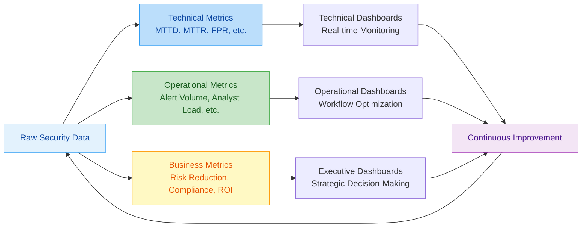
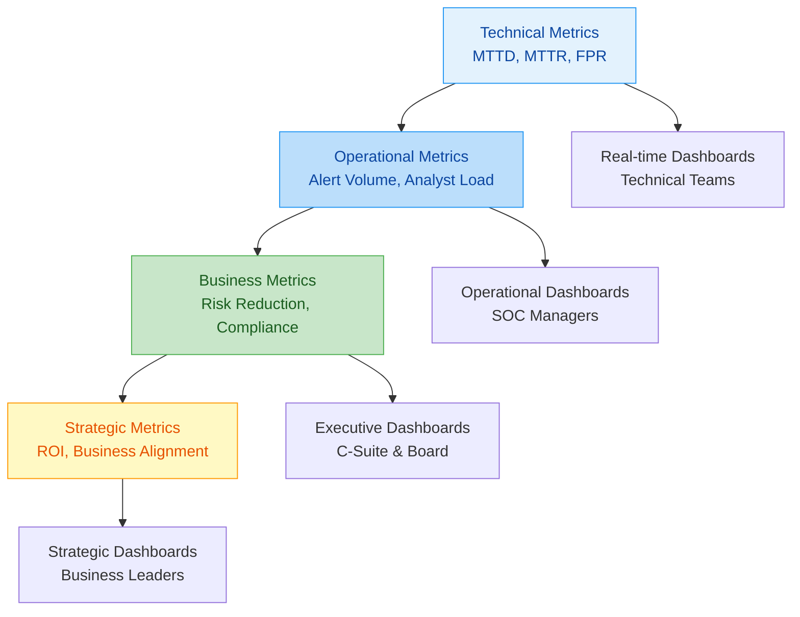
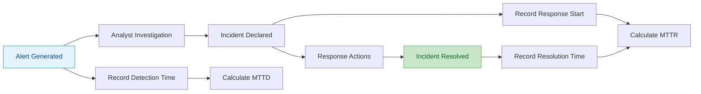
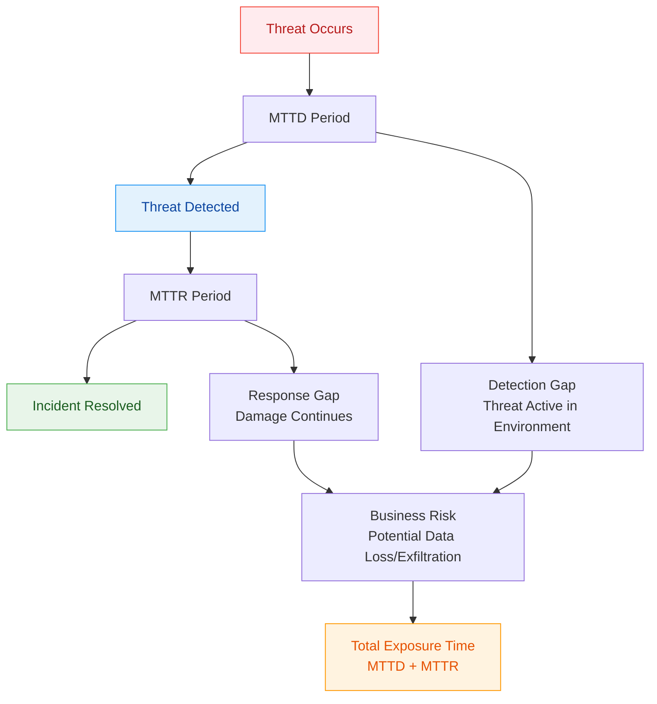
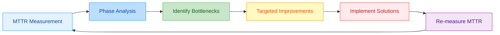
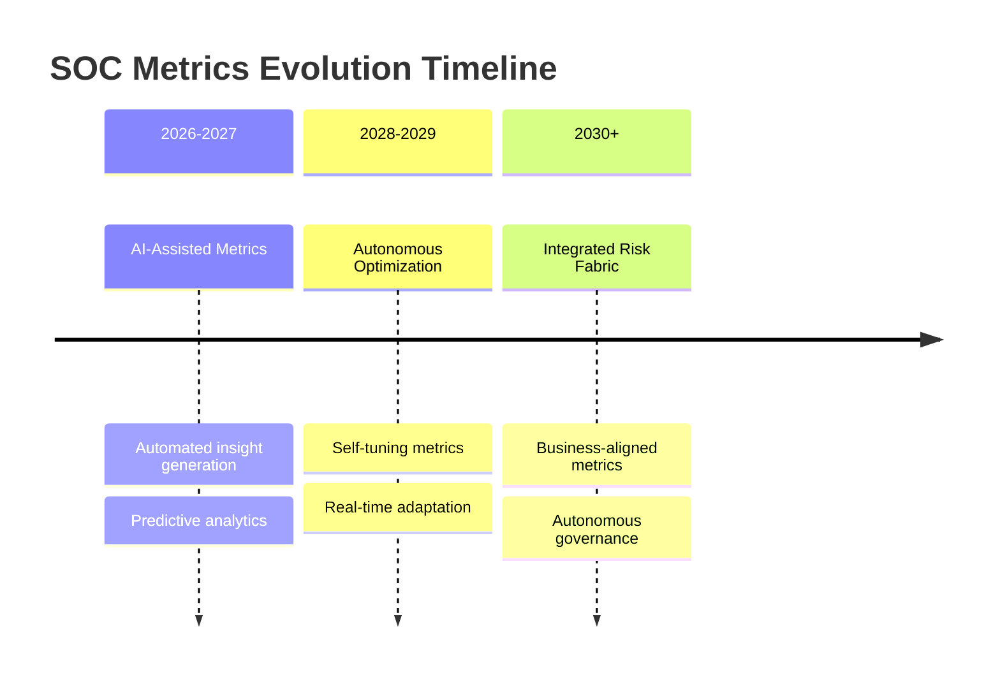

---
tags: [soc]
---
# 📊 Measuring and Reporting on SOC Efficiency: A Full-Stack Lesson on MTTD, MTTR, and Beyond


## TCM Exam Objectives

- **Define MTTD and MTTR** – Mean Time to Detect = average time from compromise to detection. Mean Time to Respond = average time from detection to resolution. Know formulas and example calculations.
- **Understand the MTTD-MTTR relationship** – Total Exposure Time = MTTD + MTTR. Both are equally critical; slow detection AND slow response create business risk.
- **Know industry benchmarks** – MTTD: overall average ~9.5 hours, best-in-class <4 hours. MTTR: overall 8-12 hours, best-in-class <4 hours. Financial services: MTTD 8-12h, Healthcare: 12-18h.
- **Explain the metric hierarchy** – Distinguish Technical (real-time, for analysts), Operational (daily/weekly, for managers), Business (monthly/quarterly, for CISO), and Strategic (quarterly/annual, for Board) metrics.
- **Describe the technical implementation of MTTD/MTTR measurement** – Know data sources (SIEM, EDR), timestamp collection, automation via API integrations, and common challenges (determining initial compromise time, time zone normalization).
- **List strategies for reducing MTTD** – Enhanced detection (threat intel, UEBA, deception tech), detection engineering (rule tuning, automation), visibility (log source expansion, 100% EDR coverage).
- **List strategies for reducing MTTR** – Standardized playbooks, SOAR automation, cross-training, clear roles, communication protocols, pre-authorized containment actions.
- **Create role-based reports** – Know the content and format differences for analyst dashboards (real-time, alert queue), SOC manager reports (team performance, workload), and executive dashboards (risk posture, financial impact, ROI).

# 📊 Measuring and Reporting on SOC Efficiency: A Full-Stack Lesson on MTTD, MTTR, and Beyond

## 🎯 Lesson Overview
This lesson provides a comprehensive, full-stack exploration of how to measure, analyze, and report on Security Operations Center (SOC) efficiency. You'll learn the technical foundations of key metrics like **Mean Time to Detect (MTTD)** and **Mean Time to Respond (MTTR)**, how to implement measurement systems, create effective reporting frameworks, and drive continuous improvement in your security operations.



📌 **Exam Tip:** The PSAA exam WILL test MTTD and MTTR formulas and benchmarks. Memorize: MTTD = Σ(Detection Time - Compromise Time) / Number of Incidents. MTTR = Σ(Resolution Time - Detection Time) / Number of Incidents. Know that best-in-class MTTD is <4 hours (industry average ~9.5h) and best-in-class MTTR is <4 hours (industry average 8-12h).

## 1. 🔍 Foundations of SOC Efficiency Measurement

### 1.1 Why SOC Metrics Matter

Security Operations Center metrics are **quantifiable data points** that measure the effectiveness, efficiency, and maturity of security operations 【turn0search7】. They enable SOC professionals to:

- **Objectively assess performance** rather than relying on subjective assessments
- **Identify bottlenecks and inefficiencies** in detection and response workflows
- **Benchmark against industry standards** to understand relative performance
- **Justify resource allocation and investments** with data-driven evidence
- **Demonstrate value and ROI** to leadership and stakeholders

Without robust metrics, SOCs risk "flying blind," unable to distinguish between true progress and mere activity 【turn0search7】. The median time for ransomware operators to achieve their objectives is **under 24 hours** 【turn0search0】, making efficient detection and response critical.

### 1.2 The Metric Hierarchy: From Technical to Strategic

Effective SOC measurement follows a **hierarchical approach** that connects technical metrics to business outcomes:

<details>
<summary>📊 Detailed Metric Hierarchy Framework</summary>



#### **Level 1: Technical Metrics** (Real-time)
- **Purpose**: Operational monitoring and immediate troubleshooting
- **Audience**: SOC Analysts, Engineers
- **Update Frequency**: Real-time to hourly
- **Examples**: MTTD, MTTR, alert volume, false positive rate

#### **Level 2: Operational Metrics** (Daily/Weekly)
- **Purpose**: Workflow optimization and resource management
- **Audience**: SOC Managers, Team Leads
- **Update Frequency**: Daily to weekly
- **Examples**: Analyst utilization, case closure rate, escalation patterns

#### **Level 3: Business Metrics** (Monthly/Quarterly)
- **Purpose**: Business alignment and compliance reporting
- **Audience**: CISO, Executive Team
- **Update Frequency**: Monthly to quarterly
- **Examples**: Compliance SLA adherence, business impact, cost per incident

#### **Level 4: Strategic Metrics** (Quarterly/Annual)
- **Purpose**: Strategic planning and investment justification
- **Audience**: Board, Business Leadership
- **Update Frequency**: Quarterly to annually
- **Examples**: Risk reduction, ROI, program maturity
</details>

## 2. ⏱️ Deep Dive: MTTD and MTTR

### 2.1 Mean Time to Detect (MTTD)

#### **Definition and Calculation**
**MTTD** is the average time between when a threat enters the environment and when it is detected by the SOC 【turn0search7】【turn0search10】. It measures the **detection capability** and visibility of security controls.

**Calculation Formula**:
```
MTTD = Σ (Detection Time - Initial Compromise Time) / Number of Incidents
```

**Example Calculation**:
- Incident 1: Compromise at 10:00 AM, Detected at 11:30 AM → 1.5 hours
- Incident 2: Compromise at 2:00 PM, Detected at 2:45 PM → 0.75 hours
- MTTD = (1.5 + 0.75) / 2 = **1.125 hours** (67.5 minutes)

#### **Technical Implementation**
<details>
<summary>🔧 Technical Implementation for MTTD Measurement</summary>

#### **Data Sources**:
- SIEM platforms (Splunk, QRadar, Elastic)
- EDR solutions (CrowdStrike, SentinelOne)
- Network detection tools (Darktrace, ExtraHop)
- Threat intelligence platforms

#### **Timestamp Collection**:
```python
# Pseudo-code for MTTD calculation
def calculate_mttd(incidents):
    total_time = 0
    valid_incidents = 0
    
    for incident in incidents:
        if incident.compromise_time and incident.detection_time:
            time_to_detect = (incident.detection_time - incident.compromise_time).total_seconds() / 3600
            total_time += time_to_detect
            valid_incidents += 1
    
    return total_time / valid_incidents if valid_incidents > 0 else 0
```

#### **Challenges in Accurate Measurement**:
1. **Determining Initial Compromise Time**: Often requires forensic analysis
2. **Time Zone Normalization**: Ensuring consistent timestamps across systems
3. **Data Source Gaps**: Missing logs or delayed reporting
4. **Incident Classification**: Distinguishing between incidents and false positives

**Best Practices**:
- Use **UTC timestamps** for consistency
- Implement **automated timestamp collection** where possible
- Maintain **incident databases** with required fields
- Regularly **audit data quality** for timestamp accuracy
</details>

#### **Industry Benchmarks and Context**
MTTD benchmarks vary significantly by industry, threat type, and detection capability:

| **Industry** | **Average MTTD** | **Best-in-Class** | **Source** |
|--------------|------------------|-------------------|------------|
| Financial Services | 8-12 hours | < 4 hours | Industry Reports |
| Healthcare | 12-18 hours | < 6 hours | Compliance Data |
| Technology | 6-10 hours | < 3 hours | SOC Surveys |
| Government | 15-24 hours | < 8 hours | Federal Reports |
| **Overall Average** | **9.5 hours** | **< 4 hours** | **Multiple Sources** |

> 💡 **Key Insight**: An MTTD under 1 hour for phishing attacks is considered competitive in many industries 【turn0search9】. However, MTTD should be evaluated in context with MTTR and business impact.

### 2.2 Mean Time to Respond (MTTR)

#### **Definition and Calculation**
**MTTR** measures the average time from detection to containment or remediation of a security incident 【turn0search7】【turn0search2】. It evaluates the **response efficiency** and effectiveness of incident handling processes.

**Calculation Formula**:
```
MTTR = Σ (Resolution Time - Detection Time) / Number of Incidents
```

**Example Calculation**:
- Incident 1: Detected at 11:30 AM, Resolved at 1:00 PM → 1.5 hours
- Incident 2: Detected at 2:45 PM, Resolved at 3:30 PM → 0.75 hours
- MTTR = (1.5 + 0.75) / 2 = **1.125 hours** (67.5 minutes)

#### **Technical Implementation**
<details>
<summary>⚙️ MTTR Measurement Architecture</summary>

#### **Key Components**:
1. **Incident Tracking System**: ServiceNow, Jira, or dedicated IR platforms
2. **Automated Timestamps**: Integration with detection and response tools
3. **Workflow Integration**: SOAR platforms for automated metric collection
4. **Reporting Dashboards**: Real-time visualization of MTTR trends

#### **Data Collection Workflow**:


#### **Automation for Accuracy**:
- **API Integrations**: Connect SIEM, SOAR, and ITSM tools for automatic timestamp collection
- **Scripted Collections**: Use Python or PowerShell scripts to extract and normalize data
- **Data Validation**: Implement checks for missing or illogical timestamps
- **Exception Handling**: Define rules for incidents without clear resolution times

**Technical Challenges**:
1. **Defining "Resolution"**: Different organizations define resolution differently
2. **Multi-stage Incidents**: Handling incidents with multiple response phases
3. **Cross-team Coordination**: Time spent waiting for other teams
4. **Communication Overhead**: Time spent in meetings and coordination

**Solutions**:
- **Clear Definitions**: Document what constitutes "resolved" for each incident type
- **Phase Tracking**: Break MTTR into phases (containment, eradication, recovery)
- **Coordination Metrics**: Track handoff times between teams
- **Communication Efficiency**: Measure meeting time vs. action time
</details>

#### **Industry Benchmarks and Context**
MTTR benchmarks depend on incident severity, complexity, and organizational maturity:

| **Incident Type** | **Average MTTR** | **Best-in-Class** | **Business Impact** |
|-------------------|------------------|-------------------|---------------------|
| Phishing | 4-6 hours | < 2 hours | Low-Medium |
| Malware Infection | 6-8 hours | < 4 hours | Medium |
| Ransomware | 24-48 hours | < 12 hours | High |
| Data Breach | 72+ hours | < 24 hours | Critical |
| **Overall Average** | **8-12 hours** | **< 4 hours** | **Varies** |

### 2.3 The MTTD-MTTR Relationship

<details>
<summary>🔄 Understanding the Detection-Response Continuum</summary>



**Key Insights**:
1. **Total Exposure Time** = MTTD + MTTR
2. **Detection vs. Response**: Both are equally important for risk reduction
3. **Automation Impact**: SOAR can significantly reduce both metrics 【turn0search18】
4. **Severity Correlation**: More severe incidents typically have longer MTTR but should have shorter MTTD

**Optimization Strategy**:
- **Reduce MTTD** through better detection rules, threat intelligence, and monitoring
- **Reduce MTTR** through automation, playbooks, and skilled analysts
- **Balance Investment**: Detecting quickly but responding slowly still leaves exposure
</details>

## 3. 📈 Comprehensive SOC Metrics Framework

### 3.1 Core Metric Categories

<details>
<summary>📊 Complete SOC Metrics Framework</summary>

#### **1. Detection and Response Metrics**
| **Metric** | **Definition** | **Target** | **Industry Benchmark** |
|------------|----------------|------------|------------------------|
| **MTTD** | Average time from compromise to detection | < 4 hours | 9.5 hours average |
| **MTTR** | Average time from detection to resolution | < 4 hours | 8-12 hours average |
| **MTTC** | Mean Time to Contain (subset of MTTR) | < 2 hours | 4-6 hours average |
| **False Positive Rate** | % of alerts that are benign | < 5% | 10-30% typical |
| **True Positive Rate** | % of alerts that are actual incidents | > 90% | 70-85% typical |
| **Detection Coverage** | % of MITRE ATT&CK techniques covered | > 65% | 40-60% typical 【turn0search0】 |

#### **2. Operational Metrics**
| **Metric** | **Definition** | **Target** | **Business Impact** |
|------------|----------------|------------|---------------------|
| **Alert Volume** | Total alerts per day/week | Trend analysis | Resource planning |
| **Alert-to-Incident Ratio** | % of alerts becoming incidents | 5-15% | Alert quality |
| **Analyst Utilization** | % time on core SOC tasks | 70-80% | Efficiency |
| **Escalation Rate** | % incidents escalated | < 20% | Skill distribution |
| **Case Closure Rate** | % cases closed per period | > 90% | Throughput |
| **Reopen Rate** | % cases reopened | < 5% | Quality |

#### **3. Analyst Performance Metrics**
| **Metric** | **Definition** | **Target** | **Development Need** |
|------------|----------------|------------|---------------------|
| **Alerts per Analyst** | Alerts handled per shift | 20-30 | Workload balance |
| **Investigation Time** | Average time per investigation | Trend analysis | Skill development |
| **First-Call Resolution** | % resolved at Tier 1 | > 50% | Training effectiveness |
| **Documentation Quality** | Completeness of case records | > 95% | Process compliance |
| **Skill Development** | Certifications/training completed | Annual goals | Career growth |

#### **4. Business Alignment Metrics**
| **Metric** | **Definition** | **Target** | **Executive Interest** |
|------------|----------------|------------|------------------------|
| **Compliance SLA Adherence** | % meeting regulatory response times | 100% | Risk management |
| **Business Impact Score** | Financial impact of incidents | Trending down | ROI demonstration |
| **Cost per Incident** | Average cost to resolve | Trending down | Budget justification |
| **Risk Reduction** | Quantified risk reduction | Year-over-year | Security investment |
| **Incident Recurrence** | % of recurring incidents | < 10% | Process improvement |
</details>

### 3.2 Advanced Metrics for Modern SOCs

<details>
<summary>🚀 Next-Generation SOC Metrics</summary>

#### **1. Automation Impact Metrics**
- **Automation Rate**: % of actions automated vs. manual
- **Time Savings**: Hours saved through automation
- **Error Reduction**: Decrease in human errors through automation
- **Consistency Improvement**: Variance reduction in response times

#### **2. Threat Intelligence Metrics**
- **Intelligence Actionability**: % of intel leading to detections
- **Intelligence Latency**: Time from threat emergence to intel integration
- **Coverage Expansion**: New attack techniques covered through intel
- **False Positive Reduction**: Decrease due to better intel context

#### **3. Cloud Security Metrics**
- **Cloud MTTD**: Detection time for cloud-native threats
- **Cloud MTTR**: Response time for cloud incidents
- **Misconfiguration Detection**: Time to detect cloud misconfigurations
- **Remediation Automation**: % of cloud issues auto-remediated

#### **4. Business Continuity Metrics**
- **Downtime Reduction**: Decrease in system downtime from incidents
- **Recovery Time Objective (RTO)**: Actual vs. target recovery times
- **Recovery Point Objective (RPO)**: Data loss measurement
- **Business Resumption Time**: Time to resume normal operations

#### **5. Maturity Assessment Metrics**
- **Process Maturity**: Capability maturity model levels
- **Technology Coverage**: % of environment with adequate monitoring
- **Skill Gaps**: Identified skill deficiencies
- **Playbook Coverage**: % of scenarios with documented procedures
</details>

## 4. 🛠️ Implementing a Metrics Program

### 4.1 Technical Architecture for Metrics Collection

<details>
<summary>🏗️ SOC Metrics Technical Stack</summary>

#### **Layer 1: Data Sources**
```
SIEM Platforms (Splunk, QRadar, Elastic)
├── EDR Solutions (CrowdStrike, SentinelOne)
├── Network Security (Firewalls, IDS/IPS)
├── Cloud Security (CSPM, CWPP)
├── Email Security (Proofpoint, Mimecast)
└── Threat Intelligence Platforms
```

#### **Layer 2: Data Collection & Normalization**
```python
# Example data normalization pipeline
def normalize_metrics_data(raw_data):
    normalized = {
        'timestamp': convert_to_utc(raw_data['timestamp']),
        'incident_id': raw_data['incident_id'],
        'detection_time': parse_timestamp(raw_data['detection_time']),
        'resolution_time': parse_timestamp(raw_data['resolution_time']),
        'analyst': raw_data['analyst'],
        'severity': normalize_severity(raw_data['severity']),
        'status': raw_data['status']
    }
    return normalized
```

#### **Layer 3: Metrics Calculation Engine**
```
┌─────────────────────────────────────────────────────────────┐
│                    Metrics Calculation Engine                │
├─────────────────────────────────────────────────────────────┤
│  • MTTD Calculator                                          │
│  • MTTR Calculator                                          │
│  • False Positive Rate Analyzer                             │
│  • Analyst Performance Tracker                              │
│  • Trend Analysis Engine                                    │
└─────────────────────────────────────────────────────────────┘
```

#### **Layer 4: Visualization & Reporting**
```
┌─────────────────────────────────────────────────────────────┐
│                  Visualization & Reporting Layer             │
├─────────────────────────────────────────────────────────────┤
│  • Real-time Dashboards (Grafana, Kibana)                   │
│  • Executive Reports (Power BI, Tableau)                    │
│  • Automated Alerts (Email, Slack, Teams)                   │
│  • Mobile Applications (iOS, Android)                       │
└─────────────────────────────────────────────────────────────┘
```

#### **Layer 5: Integration & Automation**
- **SOAR Platforms**: Swimlane, IBM Resilient, Cortex XSOAR
- **ITSM Integration**: ServiceNow, Jira Service Management
- **Communication Platforms**: Slack, Microsoft Teams
- **Documentation Systems**: Confluence, SharePoint
</details>

### 4.2 Step-by-Step Implementation Roadmap

<details>
<summary>🗺️ 6-Month Implementation Plan</summary>

#### **Month 1: Assessment and Planning**
- [ ] Conduct current state assessment of metrics capabilities
- [ ] Define metric taxonomy and calculation standards
- [ ] Identify data sources and integration requirements
- [ ] Select metrics platform and visualization tools
- [ ] Develop implementation roadmap and timeline

#### **Month 2: Foundation Building**
- [ ] Implement data collection from primary sources (SIEM, EDR)
- [ ] Develop data normalization and validation pipelines
- [ ] Create initial metric calculations (MTTD, MTTR)
- [ ] Build basic dashboards for technical teams
- [ ] Establish data quality monitoring

#### **Month 3: Core Metrics Implementation**
- [ ] Deploy comprehensive metrics calculation engine
- [ ] Implement operational metrics (alert volume, analyst load)
- [ ] Create analyst performance tracking system
- [ ] Develop automated reporting for daily operations
- [ ] Establish metrics governance and ownership

#### **Month 4: Advanced Metrics & Integration**
- [ ] Implement business alignment metrics
- [ ] Integrate with SOAR for automated metric collection
- [ ] Develop executive dashboards and reports
- [ ] Implement trend analysis and benchmarking
- [ ] Create metrics-driven alerting system

#### **Month 5: Optimization & Automation**
- [ ] Automate report generation and distribution
- [ ] Implement predictive analytics for trend forecasting
- [ ] Develop mobile accessibility for key metrics
- [ ] Create metrics-driven process improvement workflows
- [ ] Establish continuous improvement process

#### **Month 6: Maturity & Sustainability**
- [ ] Conduct comprehensive metrics program audit
- [ ] Develop metrics training program for new analysts
- [ ] Implement advanced visualization techniques
- [ ] Establish industry benchmarking program
- [ ] Create metrics roadmap for next 12 months
</details>

### 4.3 Common Implementation Challenges

<details>
<summary>⚠️ Overcoming Implementation Obstacles</summary>

| **Challenge** | **Impact** | **Solution** |
|---------------|------------|--------------|
| **Data Silos** | Incomplete metrics, inconsistent data | Implement integrated data warehouse with normalized schemas |
| **Manual Processes** | Slow, error-prone data collection | Automate collection through APIs and scripted extraction |
| **Metric Overload** | Analysis paralysis, no focus | Prioritize 5-7 key metrics, use layered dashboards |
| **Poor Data Quality** | Inaccurate metrics, wrong decisions | Implement data validation, regular audits, exception handling |
| **Resistance to Measurement** | Analyst pushback, gaming metrics | Involve analysts in design, use metrics for development not punishment |
| **Lack of Context** | Misinterpretation of metrics | Always provide benchmarks, trends, and business impact |
| **Tool Limitations** | Unable to calculate desired metrics | Select flexible platforms, consider custom development |
| **Reporting Burden** | Time spent on reporting vs. analysis | Automate report generation, use templates, prioritize insights |

**Critical Success Factors**:
1. **Executive Sponsorship**: Visible support from CISO and leadership
2. **Analyst Involvement**: Frontline teams help design and validate metrics
3. **Data Quality Focus**: Accurate, timely, consistent data is foundation
4. **Actionable Insights**: Metrics should drive decisions, not just track activity
5. **Continuous Improvement**: Regular review and refinement of metrics program
</details>

## 5. 📊 Effective Reporting Frameworks

### 5.1 Role-Based Reporting Strategy

<details>
<summary>👥 Tailoring Reports to Stakeholder Needs</summary>

#### **1. Technical Analyst Reports**
**Purpose**: Real-time operational awareness and troubleshooting
**Audience**: SOC Analysts, Security Engineers
**Frequency**: Real-time to hourly
**Content**:
- Current alert queue and status
- Active incidents with timelines
- Personal performance metrics
- Detection rule effectiveness
- System health and performance

**Example Dashboard**:
```
+---------------------------------------------+
|  ANALYST DASHBOARD - [Analyst Name]         |
+---------------------------------------------+
| CURRENT SHIFT:                              |
| Alerts Assigned: 24                         |
| Incidents Declared: 3 (12.5% conversion)    |
| Avg Investigation Time: 18 minutes          |
| Cases Closed: 2                             |
| Pending Cases: 1                            |
+---------------------------------------------+
| ACTIVE INCIDENTS:                           |
| INC-2026-0421 - High Priority               |
|   Status: Investigating                     |
|   Time Elapsed: 2h 15m                      |
|   Next Action: Forensic analysis            |
+---------------------------------------------+
| PERFORMANCE METRICS:                        |
| This Week:                                  |
| Avg MTTD: 3.2 hours (↓15% from last week)  |
| Avg MTTR: 1.8 hours (↓10%)                 |
| False Positive Rate: 4.2% (target <5%)     |
+---------------------------------------------+
```

#### **2. SOC Manager Reports**
**Purpose**: Operational management and resource optimization
**Audience**: SOC Managers, Team Leads
**Frequency**: Daily to weekly
**Content**:
- Team performance metrics
- Workload distribution and balance
- Escalation patterns and trends
- Training and development needs
- Process improvement opportunities

**Example Report Section**:
```markdown
## Weekly SOC Performance Summary - Week of April 21, 2026

### Team Performance Overview
- **Total Alerts Processed**: 1,247 (↑8% from previous week)
- **Incident Conversion Rate**: 12.3% (within target range)
- **Average MTTD**: 3.1 hours (↓15% trend improvement)
- **Average MTTR**: 1.9 hours (meeting target of <2 hours)

### Analyst Utilization
| Analyst | Alerts Assigned | Cases Closed | Avg Investigation Time | Utilization |
|---------|-----------------|--------------|------------------------|-------------|
| J. Smith | 127 | 8 | 16 min | 78% |
| A. Patel | 119 | 7 | 19 min | 75% |
| M. Chen | 132 | 9 | 15 min | 82% |
| **Team Avg** | **126** | **8** | **17 min** | **78%** |

### Escalation Analysis
- **Escalation Rate**: 18% (within target <20%)
- **Primary Escalation Reasons**:
  1. Advanced malware analysis (32%)
  2. Cloud security incidents (28%)
  3. Network forensics (22%)

### Recommendations
1. **Additional Training**: Advanced malware analysis for Tier 1 team
2. **Process Improvement**: Cloud incident response playbook update
3. **Resource Adjustment**: Reassign 1 analyst to cover peak hours
```

#### **3. Executive Reports**
**Purpose**: Strategic decision-making and resource allocation
**Audience**: CISO, CIO, Executive Team, Board
**Frequency**: Monthly to quarterly
**Content**:
- Business risk and impact metrics
- Compliance and regulatory status
- Investment ROI and budget justification
- Strategic trend analysis
- Benchmarking against industry peers

**Executive Dashboard Template**:
```
+---------------------------------------------+
|  CYBERSECURITY PERFORMANCE DASHBOARD        |
|  April 2026                                 |
+---------------------------------------------+
| RISK POSTURE: MODERATE (↓ from HIGH)       |
|                                             |
| KEY METRICS:                                |
| • Breach Risk: $2.1M (↓15% from Q1)        |
| • MTTD: 3.1 hours (Industry avg: 9.5h)     |
| • MTTR: 1.9 hours (Industry avg: 8.2h)     |
| • Compliance: 98% (↑2% from Q1)            |
+---------------------------------------------+
| BUSINESS IMPACT:                            |
| • Incidents Prevented: 47 (est. $890K)     |
| • Cost per Incident: $2,340 (↓18%)         |
| • Downtime Avoided: 142 hours              |
| • Productivity Preserved: 1,840 hours      |
+---------------------------------------------+
| STRATEGIC INVESTMENTS:                      |
| • SOAR Platform: $45K → $180K ROI (300%)  |
| • Threat Intel: $28K → $112K ROI (400%)   |
| • Training Program: $15K → $67K ROI (447%)|
+---------------------------------------------+
| RECOMMENDATIONS:                            |
| 1. Approve $65K for cloud security upgrade |
| 2. Accept risk for legacy system (cost)    |
| 3. Enhance third-party risk management     |
+---------------------------------------------+
```
</details>

### 5.2 Report Templates and Structures

<details>
<summary>📋 Comprehensive Report Templates</summary>

#### **1. Daily Operations Report**
```markdown
# Daily SOC Operations Report - [Date]

## Executive Summary
- **Total Alerts Processed**: [Number]
- **Incidents Declared**: [Number] ([X]% conversion rate)
- **Critical Incidents**: [Number] with [Y] contained
- **MTTD (Today)**: [X] hours | **MTTR (Today)**: [Y] hours

## Incident Activity
| Incident ID | Severity | Status | Time Open | Analyst | Notes |
|-------------|----------|--------|------------|---------|-------|
| INC-0421-001 | High | Contained | 4h 32m | J. Smith | Ransomware attempt |
| INC-0421-002 | Medium | Investigating | 2h 15m | A. Patel | Phishing campaign |

## Performance Metrics
- **Alert Queue Depth**: [Number] (Target: < [X])
- **Analyst Utilization**: [X]% (Target: 70-80%)
- **Escalation Rate**: [X]% (Target: <20%)
- **False Positive Rate**: [X]% (Target: <5%)

## Issues and Challenges
- [Issue 1]: [Description] - [Mitigation]
- [Issue 2]: [Description] - [Mitigation]

## Recommendations
1. [Action item] - [Owner] - [Due date]
2. [Action item] - [Owner] - [Due date]
```

#### **2. Monthly Performance Report**
```markdown
# Monthly SOC Performance Report - [Month, Year]

## Performance Overview
| Metric | Current | Previous | Trend | Target | Status |
|--------|---------|----------|-------|--------|--------|
| MTTD | 3.1h | 3.8h | ↓18% | <4h | ✓ |
| MTTR | 1.9h | 2.3h | ↓17% | <2h | ✓ |
| FPR | 4.2% | 5.8% | ↓28% | <5% | ✓ |
| Throughput | 1,247 | 1,156 | ↑8% | - | - |

## Incident Analysis
### By Severity
| Severity | Count | % | Avg MTTD | Avg MTTR | Status |
|----------|-------|---|----------|----------|--------|
| Critical | 2 | 17% | 1.2h | 3.1h | ✓ |
| High | 8 | 67% | 2.8h | 1.7h | ✓ |
| Medium | 2 | 17% | 4.5h | 1.2h | - |

### By Type
- Phishing: 7 cases (58%) - 92% prevented
- Malware: 3 cases (25%) - 100% contained
- Policy Violations: 2 cases (17%) - 100% resolved

## Business Impact
- **Estimated Risk Reduction**: $890,000
- **Cost Savings from Automation**: $42,000
- **Compliance Penalties Avoided**: $150,000

## Initiatives and Projects
### Completed
- SOAR playbook automation (30% efficiency gain)
- Threat intelligence integration (25% faster detection)

### In Progress
- Cloud security monitoring (60% complete)
- Analyst training program (40% complete)

## Recommendations
1. **Investment**: $65K for cloud security upgrade
2. **Resource**: Add 1 analyst for cloud expertise
3. **Process**: Update incident response playbooks
```

#### **3. Quarterly Executive Report**
```markdown
# Quarterly Cybersecurity Performance Report - Q[X] [Year]

## Strategic Overview
- **Overall Risk Level**: [Low/Moderate/Elevated/High] (Trend: ↓/→/↑)
- **Key Achievements**: 
  - Reduced MTTD by 35% through automation
  - Achieved 98% compliance with [regulation]
  - Prevented estimated $2.1M in potential breach costs

## Financial Performance
| Metric | Q[X] | Q[X-1] | Trend | Annualized |
|--------|------|--------|-------|------------|
| Security Investment | $X | $Y | ↑/↓ | $Z |
| Risk Reduction Value | $A | $B | ↑/↓ | $C |
| ROI | X% | Y% | ↑/↓ | Z% |
| Cost per Incident | $X | $Y | ↑/↓ | $Z |

## Operational Excellence
- **MTTD**: [X] hours (Industry benchmark: [Y] hours)
- **MTTR**: [X] hours (Industry benchmark: [Y] hours)
- **Detection Coverage**: [X]% of MITRE ATT&CK techniques
- **Analyst Efficiency**: [X] alerts/analyst/shift

## Strategic Initiatives
### Completed This Quarter
- [Initiative 1]: [Results and impact]
- [Initiative 2]: [Results and impact]

### In Progress
- [Initiative 1]: [Status and expected completion]
- [Initiative 2]: [Status and expected completion]

## Risk Assessment
| Risk Area | Current Level | Trend | Mitigation Status |
|-----------|---------------|-------|-------------------|
| External Threats | [Level] | ↓/→/↑ | [Status] |
| Insider Threats | [Level] | ↓/→/↑ | [Status] |
| Compliance Risk | [Level] | ↓/→/↑ | [Status] |
| Third-Party Risk | [Level] | ↓/→/↑ | [Status] |

## Recommendations for Next Quarter
1. **Strategic Investment**: [Description and business case]
2. **Resource Allocation**: [Description and rationale]
3. **Risk Acceptance**: [Description and justification]
4. **Process Improvement**: [Description and expected impact]

## Appendix
- Detailed metric definitions
- Benchmarking methodology
- Investment ROI calculations
```
</details>

## 6. 🚀 Optimizing MTTD and MTTR

### 6.1 Strategies for Reducing MTTD

<details>
<summary>🎯 Technical and Process Improvements</summary>

#### **1. Enhanced Detection Capabilities**
- **Threat Intelligence Integration**: Real-time feeds for known IOCs
- **Behavioral Analytics**: UEBA for anomaly detection
- **Deception Technology**: Honeypots and canary files
- **Continuous Monitoring**: 24/7 visibility with automated alerts

#### **2. Detection Engineering Improvements**
```python
# Example: Detection rule optimization
def optimize_detection_rule(rule):
    # Analyze historical alert data
    false_positives = analyze_false_positives(rule)
    
    # Refine rule based on patterns
    if false_positives > threshold:
        add_context_filters(rule)
        adjust_thresholds(rule)
        implement_exception_handling(rule)
    
    # Test optimized rule
    test_results = test_rule(rule)
    
    if test_results.improvement > min_improvement:
        deploy_rule(rule)
        monitor_performance(rule)
```

#### **3. Visibility Enhancements**
- **Log Source Expansion**: Add missing critical data sources
- **Network Visibility**: Full packet capture and analysis
- **Endpoint Coverage**: 100% EDR deployment
- **Cloud Visibility**: CSPM and CWPP implementation

#### **4. Automation and Orchestration**
- **Automated Triage**: SOAR for initial alert assessment
- **Enrichment Automation**: Automatic context addition
- **Correlation Engines**: Multi-source event correlation
- **Predictive Analytics**: Machine learning for threat prediction

**Expected Impact**: 30-50% reduction in MTTD 【turn0search0】

**Implementation Roadmap**:
1. **Assess current detection gaps** (Week 1-2)
2. **Prioritize high-impact detections** (Week 3-4)
3. **Implement automation** (Week 5-8)
4. **Measure and optimize** (Week 9-12)
</details>

### 6.2 Strategies for Reducing MTTR

<details>
<summary>⚡ Response Optimization Techniques</summary>

#### **1. Process Improvements**
- **Standardized Playbooks**: Documented procedures for common incidents
- **Clear Roles and Responsibilities**: Defined escalation paths
- **Communication Protocols**: Standardized templates and channels
- **Decision Trees**: Visual guides for complex decisions

#### **2. Technology Enhancements**
- **SOAR Implementation**: Automate repetitive response actions
- **Integration**: Connect SIEM, EDR, and ITSM for seamless workflow
- **Self-Service Remediation**: Automated containment for common issues
- **Remote Response Capabilities**: Secure remote access for incident response

#### **3. Team Development**
- **Cross-Training**: Analysts trained in multiple technologies
- **Specialization**: Deep expertise in critical areas
- **Simulation Exercises**: Regular practice through tabletop exercises
- **Knowledge Management**: Centralized repository of procedures and lessons learned

#### **4. Metrics-Driven Improvement**


**Specific MTTR Reduction Techniques**:

| **Phase** | **Common Delay** | **Solution** | **Expected Impact** |
|-----------|------------------|--------------|---------------------|
| **Detection** | Alert fatigue | Prioritization and noise reduction | 20-30% faster detection |
| **Analysis** | Manual investigation | Automated enrichment and correlation | 40-50% faster analysis |
| **Containment** | Approval delays | Pre-authorized containment actions | 60-70% faster containment |
| **Eradication** | Tool limitations | Integrated response tools | 30-40% faster eradication |
| **Recovery** | Testing delays | Automated validation and rollback | 20-30% faster recovery |

**Case Study Example**:
- **Initial MTTR**: 8.5 hours
- **Implemented**: SOAR automation + playbooks
- **Result**: 2.1 hours (75% reduction)
- **ROI**: $450K investment saved $1.2M annually
</details>

### 6.3 Automation Impact on Metrics

<details>
<summary>🤖 Quantifying Automation Benefits</summary>

#### **Automation Impact Framework**:
```
┌─────────────────────────────────────────────────────────────┐
│                    Automation Impact Framework               │
├─────────────────────────────────────────────────────────────┤
│  • Time Savings: [Hours saved per month] × [Loaded rate]    │
│  • Error Reduction: [Error rate] × [Cost per error]         │
│  • Consistency Improvement: [Variance reduction] × [Impact] │
│  • Scalability: [Additional capacity] × [Value per unit]    │
│  • Analyst Satisfaction: [Retention value] + [Productivity] │
└─────────────────────────────────────────────────────────────┘
```

#### **Example Automation Metrics**:
| **Metric** | **Before Automation** | **After Automation** | **Improvement** |
|------------|----------------------|---------------------|-----------------|
| Manual Triage Time | 15 min/alert | 2 min/alert | 87% reduction |
| Investigation Time | 45 min/incident | 18 min/incident | 60% reduction |
| Response Time | 2.5 hours avg | 1.2 hours avg | 52% reduction |
| False Positive Handling | 20 min each | 5 min each | 75% reduction |
| Report Generation | 4 hours/week | 30 min/week | 87% reduction |

**ROI Calculation**:
- **Investment**: $120K (SOAR platform + implementation)
- **Annual Savings**: $385K (analyst time + error reduction + efficiency)
- **Payback Period**: 3.7 months
- **3-Year ROI**: 287%

**Implementation Strategy**:
1. **Start with high-volume, low-complexity tasks**
2. **Measure baseline before implementation**
3. **Implement in phases with clear metrics**
4. **Continuously optimize based on results**
5. **Expand to more complex use cases over time**
</details>

## 7. 📈 Advanced Analytics and Predictive Metrics

### 7.1 Predictive Analytics in SOC Operations

<details>
<summary>🔮 Moving from Reactive to Predictive</summary>

#### **1. Trend Analysis and Forecasting**
- **Historical Pattern Analysis**: Identify cyclical patterns in incidents
- **Seasonal Trend Prediction**: Anticipate peak periods (holidays, events)
- **Resource Planning**: Predict staffing needs based on trends
- **Budget Forecasting**: Project future resource requirements

#### **2. Predictive Risk Modeling**
```python
# Example: Predictive risk model
def predict_incident_risk(factors):
    risk_score = 0
    
    # Threat intelligence factors
    risk_score += factors['threat_intel_score'] * 0.3
    
    # Vulnerability factors
    risk_score += factors['vulnerability_count'] * 0.2
    risk_score += factors['critical_vulns'] * 0.15
    
    # Environmental factors
    risk_score += factors['internet_exposure'] * 0.1
    risk_score += factors['patch_compliance'] * 0.1
    
    # Historical factors
    risk_score += factors['incident_history'] * 0.15
    
    return normalize_risk_score(risk_score)
```

#### **3. Anomaly Prediction**
- **Behavioral Baselines**: Establish normal patterns for early anomaly detection
- **Deviation Alerting**: Predict potential incidents before they occur
- **Capacity Planning**: Predict when systems will be overwhelmed
- **Failure Prediction**: Anticipate tool or process failures

#### **4. Prescriptive Analytics**
- **Optimal Response Recommendations**: Suggest best response actions based on similar past incidents
- **Resource Optimization**: Recommend optimal analyst assignment
- **Process Improvement**: Identify process bottlenecks before they impact operations
- **Investment Prioritization**: Recommend where to invest for maximum impact
</details>

### 7.2 Machine Learning for Metrics Enhancement

<details>
<summary>🧠 ML-Powered Metric Evolution</summary>

#### **1. Automated Metric Optimization**
- **Dynamic Thresholds**: ML algorithms adjust thresholds based on patterns
- **Anomaly Detection**: Identify unusual patterns in metrics themselves
- **Predictive Alerting**: Predict when metrics will breach thresholds
- **Root Cause Analysis**: Automatically identify factors impacting metrics

#### **2. Natural Language Processing for Insights**
- **Automated Insights Generation**: NLP creates narrative explanations of metric trends
- **Anomaly Explanation**: Plain-language explanations of unusual patterns
- **Recommendation Engine**: Suggests actions based on metric patterns
- **Report Generation**: Automatically creates narratives from data

#### **3. Computer Vision for Dashboards**
- **Visual Anomaly Detection**: Identify unusual patterns in visualizations
- **Dashboard Optimization**: Suggest layout improvements based on usage patterns
- **Accessibility Enhancement**: Automatically adjust displays for different needs
- **Contextual Highlighting**: Draw attention to important changes

**Implementation Example**:


**Expected Benefits**:
- 40-60% reduction in time to identify metric anomalies
- 30-50% improvement in prediction accuracy
- 50-70% reduction in manual analysis time
- 25-45% improvement in decision quality
</details>

## 8. 🏆 Best Practices and Common Pitfalls

### 8.1 Best Practices for SOC Metrics

<details>
<summary>✅ Proven Practices for Success</summary>

#### **1. Start with Business Objectives**
- **Align metrics with business goals**: Risk reduction, compliance, cost efficiency
- **Define success criteria**: What does "good" look like for each metric?
- **Establish ownership**: Clear accountability for each metric
- **Regular review cadence**: Monthly business reviews of key metrics

#### **2. Ensure Data Quality**
- **Automated data validation**: Check for missing, inconsistent, or illogical data
- **Regular audits**: Monthly data quality assessments
- **Exception handling**: Define how to handle data gaps or anomalies
- **Version control**: Track changes to calculation methodologies

#### **3. Implement Layered Dashboards**
- **Role-based access**: Different views for different stakeholders
- **Drill-down capability**: From summary to detailed data
- **Real-time updates**: For operational metrics
- **Historical context**: Trends and comparisons

#### **4. Focus on Actionable Insights**
- **Every metric should drive action**: If no action possible, reconsider the metric
- **Set thresholds**: Define normal, warning, and critical ranges
- **Automated alerts**: Trigger when metrics breach thresholds
- **Clear escalation paths**: What to do when metrics indicate problems

#### **5. Continuously Improve**
- **Regular metric reviews**: Quarterly assessment of metric relevance
- **Stakeholder feedback**: Incorporate input from metric consumers
- **Benchmark against industry**: Understand relative performance
- **Celebrate successes**: Recognize when metrics show improvement

**Key Success Factors**:
1. **Executive Sponsorship**: Visible support from CISO and leadership
2. **Analyst Buy-In**: Frontline teams understand and value metrics
3. **Technology Investment**: Adequate tools for data collection and analysis
4. **Process Integration**: Metrics embedded in daily operations
5. **Continuous Education**: Regular training on metric interpretation
</details>

### 8.2 Common Pitfalls to Avoid

<details>
<summary>⚠️ Avoiding Measurement Mistakes</summary>

| **Pitfall** | **Why It Happens** | **How to Avoid** |
|-------------|-------------------|------------------|
| **Vanity Metrics** | Focus on activity over impact | Tie every metric to business value |
| **Metric Overload** | Trying to measure everything | Prioritize 5-7 key metrics |
| **Gaming Metrics** | Metrics used for punishment | Use for development, not punishment |
| **Siloed Metrics** | Departments protect their data | Integrated data warehouse |
| **Static Thresholds** | "One size fits all" approach | Dynamic, context-aware thresholds |
| **Ignoring Context** | Raw numbers without explanation | Always provide benchmarks and trends |
| **Reporting Burden** | Manual, time-consuming reporting | Automate report generation |
| **No Follow-up** | Reports without action items | Every report includes recommendations |

**Critical Mistakes to Avoid**:
1. **Using MTTD as the only metric**: Can incentivize hasty, incomplete detections
2. **Focusing only on speed**: Accuracy and completeness matter equally
3. **Ignoring analyst experience**: Metrics should account for skill levels
4. **Neglecting tool effectiveness**: Sometimes the tool, not the process, is the issue
5. **Forgetting business context**: Technical metrics without business impact are meaningless

**Red Flags in Metrics Programs**:
- 🚨 Metrics improving but incidents increasing
- 🚨 High analyst turnover or dissatisfaction
- 🚨 Consistently missing targets without action
- 🚨 No correlation between metrics and business outcomes
- 🚨 Over-reliance on a single metric for decision-making
</details>

## 9. 🔮 Future Trends in SOC Metrics

### 9.1 Emerging Technologies and Approaches

<details>
<summary>🚀 The Future of SOC Measurement</summary>

#### **1. AI-Powered Metric Evolution**
- **Autonomous Metric Optimization**: AI continuously refines metrics and thresholds
- **Predictive Performance Management**: Anticipate and prevent metric degradation
- **Natural Language Generation**: Automated narrative explanations of trends
- **Causal AI**: Understand cause-and-effect relationships in metrics

#### **2. Real-Time Adaptive Metrics**
- **Dynamic Metric Adjustment**: Metrics evolve based on changing conditions
- **Context-Aware Measurement**: Metrics adapt based on incident type, severity, or environment
- **Predictive Alerting**: Anticipate metric breaches before they occur
- **Automated Mitigation**: Trigger automatic responses to metric anomalies

#### **3. Integrated Risk Metrics**
- **Business Risk Quantification**: Direct correlation between SOC metrics and business risk
- **Financial Impact Modeling**: Real-time calculation of incident financial impact
- **Risk-Adjusted Metrics**: Metrics normalized for risk context
- **Portfolio Risk Management**: Metrics across entire security portfolio

#### **4. Enhanced Visualization**
- **3D Risk Modeling**: Spatial representation of risk landscapes
- **Temporal Analysis**: Time-based risk evolution visualization
- **Comparative Benchmarking**: Real-time industry comparisons
- **Interactive Exploration**: Drill-down through multiple dimensions

**Implementation Timeline**:

</details>

### 9.2 Industry Evolution and Standardization

<details>
<summary>📈 The Maturing of SOC Metrics</summary>

#### **1. Standardization Efforts**
- **Industry Frameworks**: Development of standard metric definitions
- **Benchmarking Standards**: Common methodologies for comparison
- **Certification Programs**: Metrics-based SOC maturity assessments
- **Regulatory Alignment**: Metrics tied to compliance requirements

#### **2. Industry-Specific Metrics**
- **Financial Services**: Transaction-focused security metrics
- **Healthcare**: Patient data protection and PHI-specific metrics
- **Critical Infrastructure**: OT/IT convergence metrics
- **Government**: Classification-specific security metrics

#### **3. Supply Chain Metrics**
- **Third-Party Risk Metrics**: Vendor security performance measurement
- **Supply Chain Attack Metrics**: Detection and response for supply chain threats
- **Ecosystem Risk Metrics**: Overall security posture of partner ecosystem
- **Collaborative Defense Metrics**: Shared metrics across organizations

#### **4. Sustainability Metrics**
- **Green Security Operations**: Energy efficiency of security operations
- **Resource Utilization**: Optimizing analyst workload for sustainability
- **Tool Efficiency**: Maximizing value from security investments
- **Long-term Viability**: Metrics for SOC program sustainability
</details>

## 10. 📚 Lesson Summary and Implementation Guide

### 10.1 Key Takeaways

1. **MTTD and MTTR are foundational but not sufficient**: They must be part of a comprehensive metrics framework that includes operational, business, and strategic metrics 【turn0search0】【turn0search7】.

2. **Context is critical**: Raw metrics without benchmarks, trends, and business impact are meaningless. Always provide context for interpretation 【turn0search5】.

3. **Automation transforms metrics**: SOAR and automation don't just improve MTTD/MTTR—they transform how metrics are collected, analyzed, and acted upon 【turn0search18】.

4. **Different stakeholders need different metrics**: Technical teams need real-time operational metrics, while executives need strategic business alignment metrics 【turn0search5】【turn0search15】.

5. **Metrics should drive action**: Every metric should answer "So what?" and drive specific decisions or actions. If not, reconsider its value.

6. **Data quality is foundational**: Inaccurate or incomplete data undermines the entire metrics program. Invest in data quality from the start.

7. **Continuous improvement is essential**: Metrics programs should evolve with the threat landscape, business needs, and technological capabilities.

### 10.2 Implementation Checklist

<details>
<summary>🎯 90-Day Implementation Roadmap</summary>

#### **Days 1-30: Foundation**
- [ ] Define 5-7 key metrics aligned with business objectives
- [ ] Assess current data sources and quality
- [ ] Select metrics platform and visualization tools
- [ ] Establish baseline measurements for key metrics
- [ ] Create initial technical dashboards for SOC team

#### **Days 31-60: Core Implementation**
- [ ] Implement comprehensive data collection from all sources
- [ ] Develop automated metric calculation pipelines
- [ ] Create role-based dashboards (analyst, manager, executive)
- [ ] Establish regular reporting cadence (daily, weekly, monthly)
- [ ] Implement alerting for metric threshold breaches

#### **Days 61-90: Optimization and Maturity**
- [ ] Analyze initial trends and identify improvement opportunities
- [ ] Refine metrics based on stakeholder feedback
- [ ] Implement automation for metric collection and reporting
- [ ] Conduct first quarterly business review of metrics
- [ ] Develop 12-month metrics roadmap for continuous improvement

**Success Metrics for First 90 Days**:
- 100% of key metrics defined with calculations documented
- 90% of data sources integrated and automated
- 80% of stakeholders satisfied with metric relevance and timeliness
- 3+ data-driven decisions made using new metrics
- Baseline established for all key metrics with 3 months of trend data
</details>

### 10.3 Additional Resources

<details>
<summary>📖 Further Learning and References</summary>

#### **Industry Reports and Frameworks**
- **MITRE ATT&CK Framework**: For detection coverage measurement 【turn0search0】
- **NIST Cybersecurity Framework**: For business alignment metrics
- **SOC-CMM (Capability Maturity Model)**: For SOC maturity assessment
- **Industry benchmarking reports**: For comparative analysis

#### **Technical Implementation Guides**
- **Splunk Metrics Documentation**: For SIEM-based metric implementation
- **SOAR Platform Guides**: For automation-enhanced metrics
- **Python for Data Analysis**: For custom metric calculation
- **Visualization Tool Guides**: For effective dashboard creation

#### **Professional Development**
- **CompTIA CySA+**: Covers SOC metrics in depth 【turn0search4】
- **SANS FOR508**: Advanced incident response and metrics
- **EC-Council CHFI**: Computer forensics and investigation metrics
- **ISACA CRISC**: Risk and compliance metrics alignment

#### **Community Resources**
- **SOC跃迁社区 (Community)**: Practitioner discussions and templates
- **Reddit r/cybersecurity**: Community Q&A on metrics challenges
- **LinkedIn SOC Professionals Group**: Industry networking and best practices
- **GitHub SOC Metrics Repositories**: Open-source tools and templates
</details>

---

> **Final Insight**: Effective SOC measurement is not about tracking activity—it's about **demonstrating value, driving improvement, and enabling better decisions**. The most successful SOCs use metrics as a **strategic asset** that aligns security operations with business objectives, quantifies risk reduction, and justifies investments. By implementing a comprehensive metrics program that evolves with your organization's needs, you transform your SOC from a cost center into a **strategic business enabler** that demonstrably protects and enables the organization.

*This lesson provides the foundation for implementing a metrics-driven SOC program. By following the frameworks, best practices, and implementation roadmap provided, you can establish measurement capabilities that drive continuous improvement and demonstrate the strategic value of security operations.*