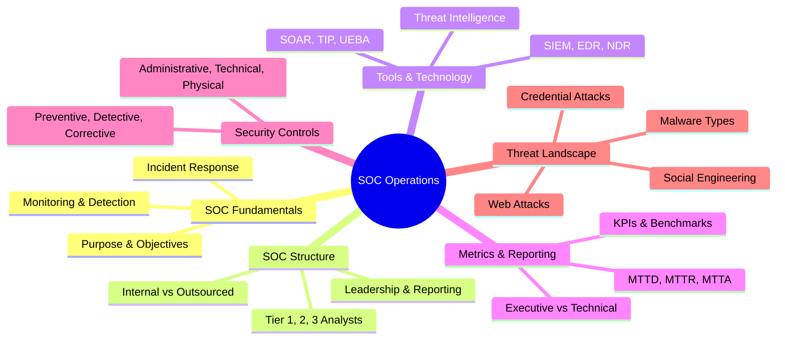
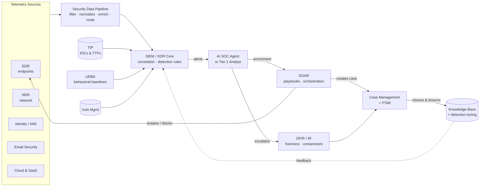

# Overview of the SOC Tool Stack
## TCM Exam Objectives

- **Identify the 11 core SOC tool categories** – EDR, SIEM, SOAR, XDR, NDR, UEBA, TIP, Vulnerability Management, CSPM/CNAPP, Email Security, Case Management/IR, DFIR/Forensics, AI SOC Agents. Know the function and a leading vendor for each.
- **Explain the SOC data flow pipeline** – Describe how telemetry flows from sensors → data pipeline → SIEM/XDR → AI/analyst triage → SOAR orchestration → case management → feedback loop.
- **Understand tool convergence trends** – Know that SOAR is being absorbed into SIEM, UEBA into analytics layers, CSPM into CNAPP suites, and AI agents are handling the investigation tier.
- **Match tools to SOC-CMM maturity levels** – Foundation (SOC-CMM 1-2): EDR + Email + Vuln Mgmt + basic SIEM. Operational (3-4): add SOAR, UEBA, TIP, CSPM. Specialized (5): add NDR, XDR, CNAPP, DFIR, AI agents.
- **Distinguish SIEM vs. XDR** – SIEM = centralized log aggregation/correlation across all sources. XDR = pre-integrated multi-layer detection across endpoint, network, email, cloud in one platform with unified console.
- **Know leading vendors for each category** – EDR: CrowdStrike, SentinelOne, Microsoft Defender. SIEM: Splunk, Sentinel, Google SecOps, XSIAM. SOAR: Splunk SOAR, Cortex XSOAR, Tines. NDR: Vectra, Darktrace, ExtraHop.
- **Understand AI SOC agents** – Explain their function: autonomously investigate alerts by forming hypotheses, gathering evidence, and delivering verdicts with reasoning — compressing Tier 1 investigation from 30-70 minutes to minutes.
- **Explain the feedback loop** – Every closed incident should feed back into detection coverage and playbook refinement — this separates a mature SOC from a busy one.

The modern SOC tool stack is a layered pipeline that turns raw telemetry from endpoints, network, identity, cloud, and email into correlated detections, automated enrichment, and orchestrated response — anchored by a SIEM (or converged XDR platform) as the analytical core, fed by detection sensors, augmented by threat intelligence and behavioral analytics, and automated through SOAR and increasingly AI agents. In 2026 the stack spans 11 core categories, and the strategic shift is toward consolidation: SOAR is being absorbed into SIEM, UEBA into analytics layers, CSPM and CDR into CNAPP suites, and AI SOC agents are taking over the investigation tier between detection and response.【turn1fetch1】【turn3fetch0】

📌 **Exam Tip:** The PSAA exam tests your knowledge of what each tool does and when to use it. Scenario questions are common: "You need to analyze network traffic for lateral movement" → NDR. "You need to automate a phishing response workflow" → SOAR. "You need centralized log correlation across the enterprise" → SIEM.

## How the Stack Fits Together

The stack is best understood as a **data flow pipeline**, not a list of products. Telemetry originates at sensors, gets normalized and routed through a data pipeline, lands in a SIEM or XDR for correlation, generates alerts that are triaged (by humans or AI agents), enriched via threat intel and UEBA, acted on through SOAR playbooks, tracked in case management, and closed with feedback loops back into detection tuning.

The dotted feedback line is what separates a mature SOC from a busy one — every closed incident should feed back into detection coverage and playbook refinement, otherwise the same threats recur.【turn5search8】【turn5search5】

## Master Comparison Table

| Tool Category | Core Function | Key Capabilities | Leading Vendors (2026) | Integrates With |
|---|---|---|---|---|
| **EDR** | Endpoint threat detection & containment | Behavioral detection, process/file/registry telemetry, host isolation, forensic capture | CrowdStrike Falcon, Microsoft Defender for Endpoint, SentinelOne, Carbon Black (Broadcom), Cortex XDR | SIEM, SOAR, XDR, DFIR |
| **SIEM** | Centralized log aggregation, correlation, compliance | Log ingestion/normalization, rule + behavioral correlation, dashboards, audit reporting | Splunk ES (Cisco), Microsoft Sentinel, Google Security Operations, Palo Alto XSIAM, IBM QRadar, Elastic, Sumo Logic | All sensors, SOAR, TIP, UEBA, case mgmt |
| **SOAR** | Workflow automation & orchestration | Playbooks, API orchestration, automated enrichment, case management | Splunk SOAR (Cisco), Cortex XSOAR, Tines, Torq, Google SecOps SOAR, IBM QRadar SOAR, TheHive, Swimlane | SIEM, EDR, TIP, ITSM, email |
| **XDR** | Integrated multi-layer detection & response | Pre-integrated endpoint/network/email/cloud detection, unified investigation console | Cortex XDR, Microsoft Defender XDR, Trend Vision One, CrowdStrike Falcon, Cisco XDR | Replaces several point products; feeds SIEM |
| **NDR** | Network traffic analysis & threat detection | Lateral movement detection, exfiltration, encrypted-traffic analytics, IoT/OT visibility | Vectra AI, Darktrace, ExtraHop, Corelight, Fidelis, NETSCOUT | SIEM, XDR, SOAR |
| **UEBA** | Behavioral anomaly detection for users/entities | Baselining, risk scoring, insider-threat & compromised-account detection | Exabeam, Securonix, Microsoft Sentinel UEBA, Splunk UBA | SIEM (often embedded) |
| **TIP** | Threat intelligence aggregation & operationalization | IOC aggregation, enrichment, lifecycle management, automated distribution | Anomali ThreatStream, ThreatConnect, ThreatQ, MISP (open source) | SIEM, EDR, SOAR, firewalls |
| **Vulnerability Mgmt** | Attack surface reduction | Network/host scanning, risk-based prioritization, asset exposure tracking | Tenable, Qualys, Rapid7 | SIEM, CMDB, ITSM |
| **CSPM / CDR / CNAPP** | Cloud posture & runtime threat detection | Misconfiguration detection, multi-cloud visibility, container/K8s security, runtime threat detection | Wiz, Orca, Prisma Cloud, Sysdig, Aqua, Lacework FortiCNAPP, CloudGuard | SIEM, cloud logs, SOAR |
| **Email Security** | Phishing & malware blocking | URL/attachment analysis, sender reputation, post-delivery remediation | Proofpoint, Microsoft Defender for O365, Mimecast, Abnormal | SIEM, SOAR, EDR |
| **Case Management / IR** | Incident tracking, documentation, audit | Case lifecycle, evidence chain, collaboration, metrics | ServiceNow SecOps, TheHive, Cortex XSOAR, Swimlane | SOAR, ITSM, SIEM |
| **DFIR / Forensics** | Deep investigation & evidence collection | Disk imaging, memory analysis, timeline reconstruction, mobile forensics | Magnet AXIOM, EnCase, FTK, Cellebrite, Velociraptor, Volatility, Autopsy | EDR, case mgmt, SIEM |
| **AI SOC Agents** | Autonomous alert investigation | Hypothesis-driven investigation, evidence gathering across tools, verdict with reasoning | Dropzone AI, Prophet Security, 7ai | SIEM, EDR, cloud, identity, case mgmt |

Sources: 【turn2fetch0】【turn3fetch0】【turn4fetch0】【turn3fetch1】【turn5search3】
---

## Module Cards — Category by Category

### SIEM — The Analytical Core

A SIEM centralizes security logs from endpoints, servers, network devices, cloud platforms, and identity systems, then normalizes and correlates that data to detect attack patterns and maintain an investigative record. At foundational maturity it's a log aggregator; at advanced maturity it becomes the SOC's central analytical workspace, with detections aligned to MITRE ATT&CK and rich context enrichment.【turn2fetch0】【turn3fetch0】

Cost is driven primarily by **data volume and retention, not features** — the SANS 2025 SOC Survey found 42% of SOCs dump all incoming data into a SIEM without a plan, turning it into an expensive dumping ground. Selective ingestion and tuning matter more than vendor choice. In 2026 the SIEM decision is increasingly a platform decision: Splunk (now Cisco), Microsoft Sentinel + Defender XDR, Google Security Operations, and Palo Alto XSIAM (which absorbed QRadar SaaS after the 2024 IBM deal) all bundle automation and XDR capabilities, so the SIEM you pick shapes your downstream options.【turn2fetch0】【turn3fetch1】【turn0search5】

### SOAR — Automation & Orchestration

SOAR platforms codify repetitive response steps into playbooks that execute across SIEM, EDR, email, ITSM, and threat intel tools — reducing MTTR and analyst toil. The critical boundary in 2026: a SOAR playbook **automates a response your team already designed; it executes decisions, it does not investigate or decide.** If the bottleneck is investigation itself rather than post-decision response steps, that's a different category (AI SOC agents).【turn3fetch1】

Standalone SOAR largely disappeared into bigger platforms between 2023 and 2026 — Splunk SOAR, Cortex XSOAR, Google SecOps SOAR, and IBM QRadar SOAR (formerly Resilient) are now bundled with their parent SIEMs. Newer entrants like Tines and Torq emphasize no-code and AI-assisted workflow building. The biggest pitfall is automating broken processes; the highest convergence risk of any category.【turn3fetch0】【turn3fetch1】

### EDR / XDR — Endpoint & Multi-Layer Detection

EDR continuously monitors endpoint activity — process trees, file operations, registry changes, network connections — to detect fileless attacks, living-off-the-land techniques, and post-exploitation behavior that signature-based AV misses. It also provides the SOC's primary forensic telemetry source and the ability to isolate compromised hosts instantly. It is typically the **first true SOC control** an organization depployes, preceding analytics or automation.【turn2fetch0】

XDR extends EDR across multiple layers (endpoint, network, email, cloud) within a single platform with pre-integrated detection and a unified investigation console. The trade-off: lower complexity and total cost versus vendor lock-in and potentially weaker best-of-breed capability in any single domain. Microsoft Defender XDR, Cortex XDR, Trend Vision One, CrowdStrike Falcon, and Cisco XDR (successor to the retired SecureX) are the leading platforms.【turn4fetch0】

### NDR — Network Detection & Response

NDR monitors network traffic to catch what endpoints miss: lateral movement, data exfiltration, attacks on unmanaged IoT/OT devices, and insider threats. It requires no endpoint agents and can detect encrypted-traffic patterns without decryption (though it can't inspect content). Leading vendors — Vectra AI, Darktrace, ExtraHop, Corelight (built on open-source Zeek), Fidelis — focus on anomaly detection, which means higher false-positive rates and the need for network architecture that supports traffic mirroring. NDR is less effective in fully cloud-native environments where east-west traffic is opaque.【turn3fetch1】【turn5search8】

### UEBA — Behavioral Analytics

UEBA establishes baselines of normal behavior for users, service accounts, and entities, then flags deviations that suggest credential misuse, lateral movement, privilege abuse, or insider threats — patterns rule-based detection structurally misses. It requires a 30–90 day baseline period before becoming effective and can generate abstract alerts that are hard to investigate. Exabeam (post-LogRhythm merger), Securonix, Sentinel UEBA, and Splunk UBA lead; UEBA is increasingly **bundled into SIEM analytics layers** rather than bought standalone.【turn3fetch0】【turn3fetch1】

### TIP — Threat Intelligence Platforms

A TIP centralizes collection, enrichment, and lifecycle management of threat intelligence from multiple feeds, transforming raw IOCs into actionable intelligence with confidence scoring and distribution to detection, blocking, and response workflows. The core value is **operationalizing intelligence** — pushing IOCs into SIEM detection rules, EDR blocklists, and firewall policies automatically. Anomali ThreatStream, ThreatConnect, ThreatQ, and the open-source MISP are the primary options. Limited value without mature security operations to consume the intel.【turn3fetch0】【turn3fetch1】

### Vulnerability Management

Systematically identifies known weaknesses and misconfigurations across servers, endpoints, network devices, and cloud workloads, with risk-based prioritization that shifts security from reactive detection to proactive risk reduction. Tenable, Qualys, and Rapid7 dominate. The common pitfall is scanning without remediation ownership — vulnerability data feeds into the SIEM for correlation with active threats and into the CMDB for asset context.【turn2fetch0】

### CSPM / CDR / CNAPP

As organizations move to cloud, traditional tools lose visibility. CSPM continuously evaluates cloud environments for misconfigurations, excessive permissions, and compliance gaps — addressing the **leading root cause of cloud breaches**. CDR adds runtime threat detection for cloud-native attacks (container compromise, API abuse, serverless exploitation). Most vendors now sell both together as a CNAPP. Wiz, Orca, Prisma Cloud, Sysdig, Aqua, and Lacework FortiCNAPP lead. CSPM can generate overwhelming findings volume, requiring cloud expertise to prioritize.【turn3fetch1】【turn4fetch0】

### Email Security

Email remains the most common initial-access vector. Email security platforms inspect inbound/outbound traffic for phishing, malware, and impersonation, analyzing sender reputation, content, URLs, and attachments, with post-delivery remediation. Proofpoint, Microsoft Defender for O365, Mimecast, and Abnormal lead. Email alerts should feed directly into SOC workflows early — treating phishing as "IT noise" is how downstream endpoint and identity compromise begins.【turn3fetch0】

### Case Management & DFIR

Case management platforms (ServiceNow SecOps, TheHive, Cortex XSOAR, Swimlane) structure the incident response process with consistent documentation, metrics, collaboration, and audit trails — essential once you have multiple analysts or compliance obligations. DFIR tooling handles deep investigation and evidence collection: Magnet AXIOM, EnCase, FTK, and Cellebrite for commercial suites; Velociraptor, Volatility, Autopsy, and Eric Zimmerman's EZ Tools for open-source workflows. Memory-first collection (Volexity Surge Collect) is increasingly important for APT investigation.【turn3fetch1】【turn5search2】【turn5search3】

### AI SOC Agents — The Emerging Tier

AI SOC agents autonomously investigate alerts by forming a hypothesis, gathering evidence across connected security tools, and delivering a verdict with reasoning and evidence attached — confirmed threats get escalated to human analysts who direct response. This is no longer experimental in 2026: Gartner named Dropzone AI a Cool Vendor for the Modern SOC and listed it in the 2025 Hype Cycle for Security Operations. Dropzone, Prophet Security, and 7ai lead. The agents need access to detection sources but not a mature stack, so this category **enters the picture earlier than most** — when alert volume outruns the team, when night/weekend alerts wait until morning, or when an organization wants to bring Tier 1 investigation in-house.【turn4fetch0】

---

## Stack Composition by Maturity & Org Size

The stack you need depends on where you sit on the SOC-CMM maturity model (stages 0–5: Non-existent → Initial → Managed → Defined → Quantitatively Managed → Optimizing).【turn5search11】 Most mid-sized organizations already own 60–70% of the capabilities they need, often underutilized.【turn3fetch0】

| Maturity Layer | Typical Stack | Trigger to Add |
|---|---|---|
| **Foundation (SOC-CMM 1–2)** SMB / first SOC | EDR + Email Security + Vulnerability Management + basic log aggregation (Sentinel or Elastic) | Multiple log sources or compliance needs → full SIEM |
| **Operational (SOC-CMM 3–4)** Mid-market | + SIEM (advanced correlation) + SOAR + UEBA + TIP + CSPM | High alert volume drowning analysts → AI SOC agents; cloud-native workloads → CDR/CNAPP |
| **Specialized (SOC-CMM 5)** Enterprise | + NDR + XDR (consolidation) + CNAPP + DFIR suite + Case Management + AI agents | Multi-domain intrusions, proactive threat hunting, 24/7 coverage |

A practical sequencing principle from the 2026 buyer's guide: **get endpoint and log visibility first, add correlation when you have data worth correlating, and add AI-led investigation when alert volume outruns your team.** You do not need all 11 categories.【turn1fetch1】

---

## Convergence Trends & Forward Look

Four consolidation forces are reshaping the stack: SOAR functionality is increasingly absorbed into SIEM platforms; UEBA is bundled into analytics layers; email and endpoint security consolidate into suites; and CSPM + CDR merge into CNAPP. The SIEM is unlikely to disappear and increasingly acts as the SOC control plane, with XDR and AI agents attaching to it rather than replacing it.【turn3fetch0】

The deeper structural shift is toward the **agentic SOC**, where AI agents take on investigation work between detection and response while analysts direct strategy and run response. This compresses the distance between SOC tiers — Tier 1 work shifts from executing investigations to reviewing AI-generated verdicts, and Tiers 2/3 gain time for threat hunting, detection engineering, and architectural work. Security data pipeline platforms are emerging as a distinct control-plane layer between sensors and SIEM, owning data quality, routing, and cost efficiency — and serving as the data foundation needed for AI-driven operations.【turn0search9】【turn4fetch0】

The throughline across this stack: tools are necessary but not sufficient. A green dashboard can coexist with entire categories of adversary behavior going undetected, and tool sprawl — deploying dozens of products when a handful deliver real value — creates integration nightmares and alert fatigue that actively reduce security effectiveness. The mature SOC is the one where every tool has a clear role in the data flow, every integration has an owner, and every closed incident feeds back into detection coverage.