---
tags: [soc]
---
# Comprehensive Full-Stack Lesson: SIEM, EDR, NDR, and SOAR Platforms in Modern Security Operations


## TCM Exam Objectives

- **Define the SOC Visibility Triad** – Explain how SIEM (logs), EDR (endpoints), and NDR (network) provide three complementary visibility dimensions. Understand what each sees that the others miss.
- **Compare SIEM, EDR, NDR, and SOAR** – Know each platform's primary data source, visibility focus, detection approach, response capability, and compliance role.
- **Explain SIEM architecture** – Describe the six key components: log collection, parsing/normalization, event correlation, alerting, reporting, forensic analysis. Understand next-gen SIEM evolution (UEBA, ML, XDR integration).
- **Explain EDR capabilities** – Continuous monitoring, behavioral analysis, threat detection, automated response (isolation, process kill, file quarantine), investigation tools, threat intel integration.
- **Explain NDR detection methodologies** – Signature-based, behavioral anomaly, protocol analysis, encrypted traffic analysis, network-based threat hunting.
- **Explain SOAR architecture** – Integration framework, workflow engine, automation engine, case management, reporting/analytics. Know the difference between SOAR (orchestrate existing tools) and AI agents (autonomously investigate).
- **Understand integration patterns** – Explain bi-directional integration benefits: SIEM → SOAR (alert forwarding), EDR → SIEM (telemetry sharing), NDR → EDR (network context), SOAR ↔ all (orchestration).
- **Distinguish XDR vs. integrated SOC stack** – XDR = single-vendor pre-integrated (lower complexity, vendor lock-in). Integrated stack = best-of-breed tools with custom integration (maximum flexibility, higher maintenance).

# Comprehensive Full-Stack Lesson: SIEM, EDR, NDR, and SOAR Platforms in Modern Security Operations

## 🎯 Lesson Overview
This lesson provides an in-depth exploration of the four foundational technologies that power modern Security Operations Centers (SOCs): **Security Information and Event Management (SIEM)**, **Endpoint Detection and Response (EDR)**, **Network Detection and Response (NDR)**, and **Security Orchestration, Automation, and Response (SOAR)**. You'll learn their architectures, integration patterns, implementation strategies, and how they combine to create a unified defense ecosystem.

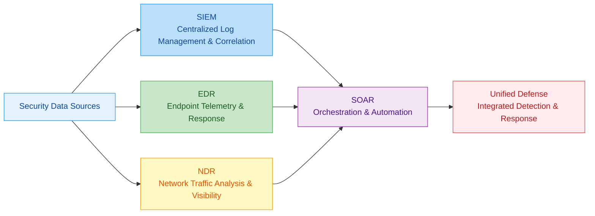

📌 **Exam Tip:** The PSAA exam tests the SOC Visibility Triad (SIEM + EDR + NDR). A classic question: "Which tool provides visibility into network traffic patterns that endpoints miss?" Answer: NDR. "Which tool provides the centralized log correlation and compliance reporting?" Answer: SIEM. "Which tool provides endpoint process execution monitoring and isolation?" Answer: EDR.

## 1. 📚 Foundations of the SOC Visibility Triad

### 1.1 Understanding the Core Technologies

**SIEM (Security Information and Event Management)** is the centralized log management and analysis platform that aggregates security data from across the organization. It provides real-time monitoring, correlation of events, and compliance reporting by collecting and normalizing log data from network devices, security appliances, applications, and operating systems 【turn0search12】.

**EDR (Endpoint Detection and Response)** focuses on continuous monitoring and response at the endpoint level. It provides deep visibility into endpoint activities, detects advanced threats that evade traditional signature-based antivirus, and enables automated response capabilities for containment and investigation 【turn0search5】.

**NDR (Network Detection and Response)** delivers visibility into network traffic patterns and behaviors. It analyzes network metadata to detect anomalies, lateral movement, and command-and-control communications, providing context that endpoint and log-centric tools miss 【turn0search3】.

**SOAR (Security Orchestration, Automation, and Response)** coordinates and automates security operations workflows. It connects disparate security tools, automates repetitive tasks, and orchestrates complex incident response processes to improve efficiency and response times 【turn0search7】.

### 1.2 The SOC Visibility Triad Concept

The integration of SIEM, EDR, and NDR forms what security professionals call the **SOC Visibility Triad** - a comprehensive approach that provides visibility across three critical dimensions: logs, endpoints, and network traffic 【turn0search4】.

<details>
<summary>📊 Detailed Visibility Triad Comparison</summary>

| **Dimension** | **SIEM** | **EDR** | **NDR** |
|---------------|----------|---------|---------|
| **Primary Data Source** | Log files, events, alerts | Process, memory, file system, registry | Network packets, metadata, flows |
| **Visibility Focus** | What happened (events) | What's executing on systems | What's moving across the network |
| **Detection Approach** | Correlation rules, signatures | Behavioral analysis, machine learning | Anomaly detection, traffic analysis |
| **Response Capability** | Alert generation, ticketing | Process termination, file quarantine | Network session blocking, traffic rerouting |
| **Compliance Role** | Primary compliance reporting | Endpoint compliance verification | Network traffic auditing |
| **Typical Deployment** | Centralized server | Endpoint agents | Network sensors, taps, cloud |

</details>

## 2. 🔍 Deep Dive: SIEM Platforms

### 2.1 SIEM Architecture and Core Components

<details>
<summary>🔧 SIEM Technical Architecture</summary>

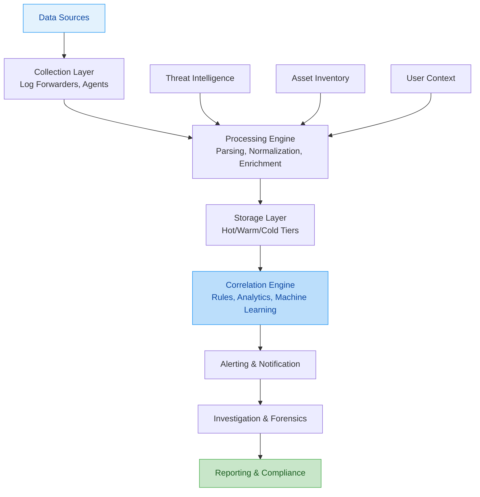

**Key SIEM Components**:
1. **Log Collection**: Ingests data from firewalls, IDS/IPS, servers, applications, cloud services
2. **Parsing & Normalization**: Transforms raw logs into standardized formats (CEF, LEEF, JSON)
3. **Event Correlation**: Applies rules to identify patterns across multiple data sources
4. **Alerting**: Generates alerts based on correlation rules and risk scoring
5. **Reporting**: Provides compliance dashboards and audit reports
6. **Forensic Analysis**: Enables historical investigation and incident reconstruction

**Modern SIEM Evolution**:
- **Next-Gen SIEM**: Incorporates user and entity behavior analytics (UEBA), machine learning, and threat intelligence integration 【turn0search7】
- **Cloud-Native SIEM**: Leverages cloud scalability and advanced analytics capabilities
- **Extended Detection and Response (XDR)**: Extends SIEM with native integration of EDR and NDR capabilities 【turn0search2】
</details>

### 2.2 SIEM Implementation Best Practices

<details>
<summary>⚙️ SIEM Deployment Architecture</summary>

#### **Data Source Prioritization**
1. **Critical Assets**: Domain controllers, databases, mail servers
2. **Security Devices**: Firewalls, IDS/IPS, web application firewalls
3. **Endpoint Telemetry**: Windows event logs, Sysmon, EDR feeds
4. **Cloud Services**: AWS CloudTrail, Azure Activity Logs, GCP Audit Logs
5. **Application Logs**: Web servers, databases, custom applications

#### **Correlation Rule Development**
```python
# Example: SIEM correlation rule logic
def detect_suspicious_login_pattern():
    # Failed logins followed by success
    failed_logins = query_events(event_type="login_failed", 
                                 timeframe="1h", 
                                 threshold=5)
    
    for failed_event in failed_logins:
        subsequent_success = query_events(
            event_type="login_success",
            source_ip=failed_event.source_ip,
            username=failed_event.username,
            timeframe="5m",
            after_event=failed_event
        )
        
        if subsequent_success:
            alert = create_alert(
                rule="suspicious_login_pattern",
                severity="medium",
                entities=[failed_event.username, failed_event.source_ip]
            )
            enrich_alert(alert, threat_intel=True, asset_context=True)
```

#### **Performance Optimization**
- **Data Tiering**: Hot storage (recent data, fast queries), warm storage (historical, slower queries), cold storage (compliance archives)
- **Query Optimization**: Pre-computed summaries, materialized views for common queries
- **Parallel Processing**: Distributed computing for large-scale data analysis
- **Intelligent Sampling**: Reduce data volume while maintaining detection fidelity
</details>

## 3. 🖥️ Deep Dive: EDR Platforms

### 3.1 EDR Architecture and Capabilities

<details>
<summary>🛡️ EDR Technical Architecture</summary>

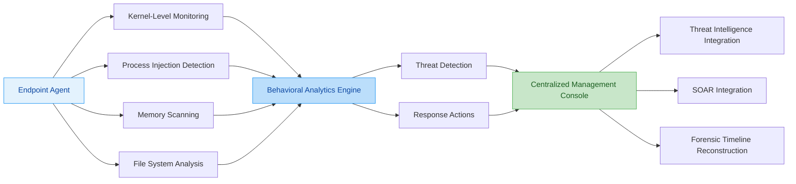

**EDR Core Capabilities**:
1. **Continuous Monitoring**: Real-time visibility into process executions, file modifications, network connections, and registry changes
2. **Behavioral Analysis**: Detects anomalies using machine learning models trained on normal endpoint behavior
3. **Threat Detection**: Identifies malware, fileless attacks, living-off-the-land techniques, and insider threats
4. **Automated Response**: Isolate endpoints, kill processes, quarantine files, and collect forensic artifacts
5. **Investigation Tools**: Visual timeline reconstruction, process tree analysis, and incident storytelling
6. **Threat Intelligence Integration**: Enriches detections with indicators of compromise (IOCs) and adversary tactics, techniques, and procedures (TTPs)

**Advanced EDR Features**:
- **Application Control**: Whitelist/blacklist applications to prevent unauthorized execution
- **Device Control**: Manage USB devices and peripheral access
- **Encryption**: Endpoint data encryption and key management
- **Vulnerability Assessment**: Patch management and vulnerability detection
- **Cloud Workload Protection**: Extend EDR capabilities to cloud instances and containers
</details>

### 3.2 EDR Implementation Strategies

<details>
<summary>🎯 EDR Deployment Framework</summary>

#### **Agent Deployment Models**
1. **Persistent Agents**: Installed continuously on endpoints (recommended for most enterprises)
2. **Ephemeral Agents**: Temporary deployment for incident response (useful for forensics)
3. **Agentless Monitoring**: Uses network-based detection (limited but non-intrusive)
4. **Hybrid Approach**: Combines persistent agents for critical systems with network-based monitoring for others

#### **Detection Tuning Process**
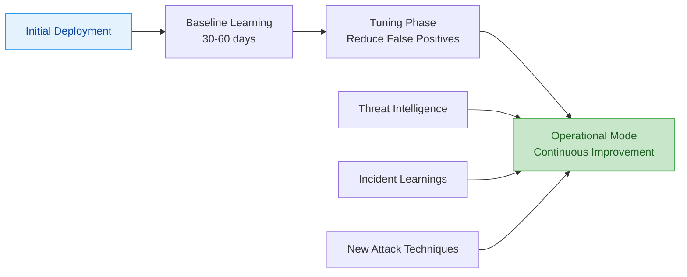

#### **Response Action Matrix**
| **Severity** | **Action** | **Automation Level** | **Approval Required** |
|--------------|------------|----------------------|----------------------|
| **Critical** | Network isolation | Automatic | No |
| **High** | Process termination | Automatic | No |
| **Medium** | File quarantine | Semi-automatic | Yes (24h) |
| **Low** | Alert only | Manual | Yes (72h) |

#### **Performance Impact Mitigation**
- **Resource Scheduling**: Run heavy scans during off-peak hours
- **Differential Analysis**: Only scan changed files and processes
- **Agent Resource Limits**: CPU, memory, and I/O caps to prevent impact
- **Cloud-Assisted Analysis**: Offload complex analysis to cloud resources
</details>

## 4. 🌐 Deep Dive: NDR Platforms

### 4.1 NDR Architecture and Network Visibility

<details>
<summary>📡 NDR Technical Architecture</summary>

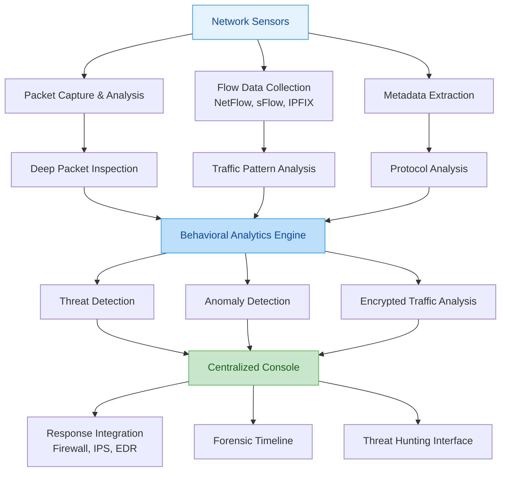

**NDR Core Capabilities**:
1. **Traffic Analysis**: Continuous monitoring of network flows for anomalies and malicious patterns
2. **Metadata Extraction**: Creates metadata from network traffic without full packet capture (reduces storage)
3. **Encrypted Traffic Analysis**: Uses TLS/SSL metadata to detect threats in encrypted traffic
4. **Behavioral Baselining**: Learns normal network behavior and identifies deviations
5. **Threat Detection**: Identifies C2 channels, lateral movement, data exfiltration, and network reconnaissance
6. **Forensic Reconstruction**: Provides detailed packet capture and timeline reconstruction for investigations

**NDR Deployment Models**:
- **Inline Deployment**: Sensors sit in the network path (active blocking capabilities)
- **Out-of-Band**: Passive monitoring via network taps or SPAN ports (no performance impact)
- **Cloud-Based**: SaaS NDR solutions that analyze cloud network traffic
- **Hybrid**: Combines on-premises sensors with cloud analytics for comprehensive coverage
</details>

### 4.2 NDR Detection Methodologies

<details>
<summary>🔬 NDR Detection Techniques</summary>

#### **1. Signature-Based Detection**
```python
# Example: Known malware C2 signature
def detect_known_c2_traffic():
    c2_signatures = load_threat_intel_signatures()
    network_flows = get_network_flows(timeframe="1h")
    
    for flow in network_flows:
        for signature in c2_signatures:
            if signature.match(flow):
                alert = create_alert(
                    type="known_c2",
                    severity="high",
                    src_ip=flow.source_ip,
                    dst_ip=flow.destination_ip,
                    protocol=flow.protocol
                )
                # Auto-block if inline deployment
                if deployment_type == "inline":
                    block_traffic(flow, duration="24h")
```

#### **2. Behavioral Anomaly Detection**
- **Statistical Models**: Detects unusual traffic patterns based on standard deviations
- **Machine Learning Models**: Identifies sophisticated anomalies that evade rule-based detection
- **Peer Group Analysis**: Compares entity behavior against similar entities (e.g., users, devices)
- **Time Series Analysis**: Detects temporal patterns and cyclical anomalies

#### **3. Protocol Analysis**
- **Deep Packet Inspection**: Examines packet contents for protocol violations
- **Protocol Fingerprinting**: Identifies applications and services regardless of port
- **Encrypted Traffic Identification**: Uses TLS fingerprints and certificate analysis
- **Covert Channel Detection**: Identifies hidden communications in legitimate protocols

#### **4. Network-Based Threat Hunting**
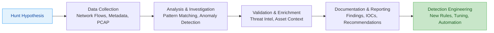
</details>

## 5. 🤖 Deep Dive: SOAR Platforms

### 5.1 SOAR Architecture and Workflow Automation

<details>
<summary>⚙️ SOAR Technical Architecture</summary>

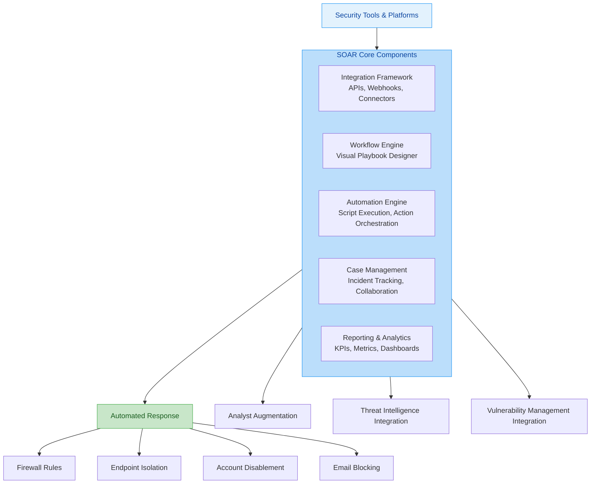

**SOAR Core Components**:
1. **Integration Framework**: Connects with SIEM, EDR, NDR, threat intelligence platforms, IT service management tools, and communication platforms
2. **Workflow Engine**: Enables visual design of incident response playbooks with drag-and-drop simplicity
3. **Automation Engine**: Executes actions across integrated tools based on playbook definitions
4. **Case Management**: Tracks incidents, manages tasks, and facilitates collaboration among analysts
5. **Reporting & Analytics**: Measures effectiveness, identifies trends, and demonstrates ROI

**SOAR Evolution**:
- **From SOAR to XDR**: Extended detection and response platforms incorporate SOAR capabilities natively 【turn0search7】
- **AI-Driven Automation**: Machine learning enhances decision-making and reduces analyst cognitive load
- **Agentic AI**: Autonomous AI agents that can triage, investigate, and respond to incidents 【turn0search2】
</details>

### 5.2 SOAR Playbook Development

<details>
<summary>📋 SOAR Playbook Framework</summary>

#### **Phishing Response Playbook Example**
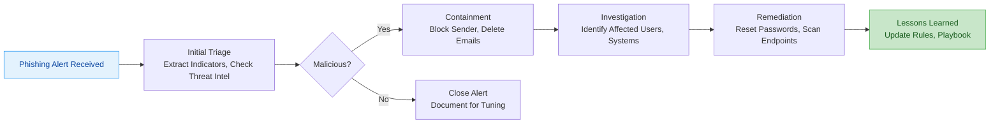

#### **Playbook Development Best Practices**
1. **Start with Common Scenarios**: Phishing, malware outbreaks, account compromise
2. **Define Clear Triggers**: Specify what initiates the playbook (alert, manual, schedule)
3. **Establish Decision Points**: Create conditional logic based on investigation findings
4. **Include Human Approval Steps**: Critical actions require analyst confirmation
5. **Document Everything**: Ensure audit trails and knowledge transfer
6. **Regular Testing**: Validate playbooks through tabletop exercises and simulations
7. **Continuous Improvement**: Update based on lessons learned and new threat intelligence

#### **Automation Level Matrix**
| **Action Type** | **Automation Level** | **Frequency** | **Approval Required** |
|-----------------|---------------------|---------------|----------------------|
| **Containment** | Semi-automatic | High | Yes (24h) |
| **Investigation** | Assisted | Medium | No |
| **Remediation** | Manual | Low | Yes (immediate) |
| **Reporting** | Automatic | High | No |
| **Communication** | Assisted | Medium | Yes (manager) |

#### **Integration Architecture**
```python
# Example: SOAR integration pattern
class SOARPlaybook:
    def __init__(self):
        self.integrations = {
            'siem': SIEMConnector(),
            'edr': EDRConnector(),
            'ndr': NDRConnector(),
            'firewall': FirewallConnector(),
            'email': EmailSecurityConnector(),
            'ticketing': ITSMConnector()
        }
    
    def execute_phishing_response(self, alert):
        # Step 1: Enrich alert with context
        indicators = extract_indicators(alert)
        threat_intel = query_threat_intel(indicators)
        affected_users = identify_affected_users(alert)
        
        # Step 2: Automated containment
        for user in affected_users:
            self.integrations['email'].block_sender(alert.sender)
            self.integrations['email'].delete_emails(user, alert.subject)
        
        # Step 3: Investigation
        for user in affected_users:
            endpoints = self.integrations['edr'].get_user_endpoints(user)
            for endpoint in endpoints:
                scan_result = self.integrations['edr'].scan_endpoint(endpoint)
                if scan_result.malicious:
                    self.integrations['edr'].isolate_endpoint(endpoint)
                    create_ticket(endpoint, "Malware detected")
        
        # Step 4: User communication
        send_notification(affected_users, "Password reset required")
        
        # Step 5: Documentation
        create_case_report(alert, affected_users, actions_taken)
```
</details>

## 6. 🔗 Integration Architecture: Building a Unified Defense

### 6.1 The Modern SOC Stack Integration

<details>
<summary>🌐 Comprehensive Integration Architecture</summary>

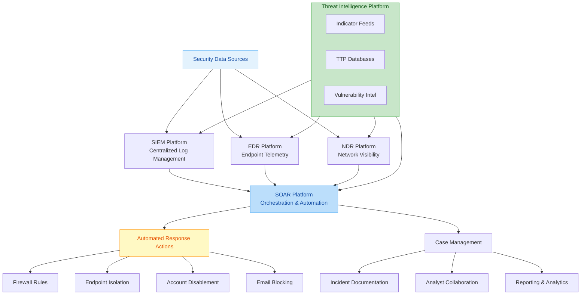

**Key Integration Points**:
1. **SIEM to SOAR**: Forward alerts with context for automated response
2. **EDR to SIEM**: Share endpoint telemetry for correlation with other events
3. **NDR to EDR**: Provide network context for endpoint investigations
4. **SOAR to All Platforms**: Orchestrate actions across the entire security stack
5. **Threat Intel to All**: Enrich detections with indicators and TTPs

**Bi-Directional Integration Benefits**:
- **EDR + NDR**: Endpoint network connections + network traffic context = complete visibility
- **SIEM + SOAR**: Centralized alerting + automated response = faster resolution
- **All Platforms + Threat Intel**: Context-enriched detections across all sensors
</details>

### 6.2 XDR as an Integration Framework

<details>
<summary>🔄 XDR Integration Model</summary>

**Extended Detection and Response (XDR)** represents the evolution toward native integration of EDR, NDR, and additional security telemetry sources 【turn0search7】. XDR provides:

1. **Unified Data Lake**: Normalizes and correlates data from multiple sources
2. **Single Pane of Glass**: Consolidated view across endpoints, network, cloud, and email
3. **Automated Investigation**: AI-driven correlation and root cause analysis
4. **Coordinated Response**: Actions across multiple security controls simultaneously

**XDR Implementation Approaches**:
- **Native XDR**: Single vendor solution with pre-built integrations (limited flexibility)
- **Open XDR**: Platform-agnostic approach that integrates best-of-breed tools 【turn0search2】
- **Hybrid XDR**: Combines native capabilities with open integration frameworks

**XDR vs. Integrated SOC Stack**:
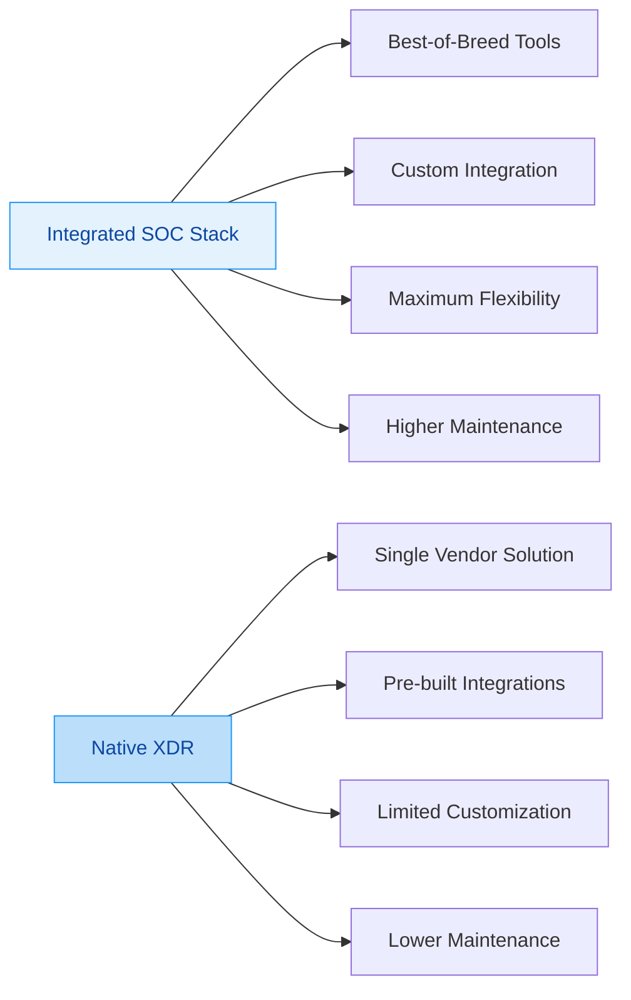
</details>

## 7. 🚀 Implementation Roadmap and Best Practices

### 7.1 Phased Implementation Strategy

<details>
<summary>🗺️ 12-Month Implementation Roadmap</summary>

#### **Phase 1: Foundation (Months 1-3)**
- Deploy SIEM with essential log sources
- Implement EDR on critical endpoints (servers, executive systems)
- Establish basic correlation rules and alerting
- Develop initial incident response procedures
- **Success Metrics**: Log coverage >70%, EDR coverage >50%, initial alerts configured

#### **Phase 2: Network Visibility (Months 4-6)**
- Deploy NDR sensors at critical network segments
- Integrate SIEM with EDR and NDR
- Develop integrated correlation rules
- Implement basic SOAR workflows for common scenarios
- **Success Metrics**: Network visibility >80%, integrated alerts >30, automated responses >20%

#### **Phase 3: Automation & Optimization (Months 7-9)**
- Expand SOAR playbooks for all major incident types
- Implement threat intelligence integration
- Develop advanced detection rules using machine learning
- Establish continuous tuning processes
- **Success Metrics**: Manual response time reduced by 50%, alert accuracy >85%

#### **Phase 4: Maturity & Enhancement (Months 10-12)**
- Implement advanced analytics and UEBA
- Expand to cloud and hybrid environments
- Develop threat hunting program
- Establish metrics and KPIs for continuous improvement
- **Success Metrics**: MTTR < 2 hours, detection coverage >90% of MITRE ATT&CK techniques
</details>

### 7.2 Tool Selection Criteria

<details>
<summary>📊 Comprehensive Tool Evaluation Framework</summary>

| **Evaluation Category** | **Weight** | **Key Considerations** |
|-------------------------|------------|------------------------|
| **Detection Effectiveness** | 30% | Coverage of MITRE ATT&CK, false positive rate, detection accuracy |
| **Integration Capabilities** | 25% | API quality, pre-built integrations, data export formats |
| **Automation & Response** | 20% | Action library, customization options, approval workflows |
| **Scalability & Performance** | 15% | Data volume capacity, query performance, resource requirements |
| **Total Cost of Ownership** | 10% | Licensing, implementation, maintenance, training costs |

**Vendor Evaluation Matrix**:
1. **Technical Fit**: How well does the solution meet your specific requirements?
2. **Integration Ecosystem**: Does it integrate with your existing and future tools?
3. **Support & Maintenance**: What level of support is provided? SLA guarantees?
4. **Roadmap Alignment**: Does the vendor's vision align with your strategic direction?
5. **Community & Reputation**: What do existing customers say? Industry recognition?

**Common Pitfalls to Avoid**:
- **Over-Engineering**: Implementing more complexity than needed for current maturity level
- **Under-Budgeting**: Not accounting for implementation, training, and ongoing maintenance
- **Ignoring Integration**: Selecting tools that don't work well together
- **Neglecting Tuning**: Expecting out-of-the-box detections to be accurate without tuning
- **Lack of Metrics**: Not establishing baseline metrics to measure improvement
</details>

## 8. 📈 Measuring Success: KPIs and Metrics

### 8.1 Key Performance Indicators for SOC Tools

<details>
<summary>📈 Comprehensive Metrics Framework</summary>

| **Metric Category** | **Specific Metrics** | **Target** | **Industry Benchmark** |
|---------------------|----------------------|------------|------------------------|
| **Detection Effectiveness** | MTTD, Detection Coverage, False Positive Rate | MTTD < 4h, Coverage > 65%, FPR < 5% | MTTD 4-24h, Coverage 40-60%, FPR 10-30% |
| **Response Efficiency** | MTTR, Containment Time, Automation Rate | MTTR < 4h, Containment < 1h, Auto > 50% | MTTR 4-8h, Containment 2-4h, Auto 20-40% |
| **Operational Efficiency** | Alerts per Analyst, Analyst Utilization, Escalation Rate | 20-30 alerts/shift, 70-80% utilization, <20% escalation | 50-100 alerts/shift, 60-70% utilization, 20-30% escalation |
| **Business Impact** | Risk Reduction, Incident Recurrence, Cost per Incident | >20% annual reduction, <5% recurrence, < $50K/incident | 10-15% reduction, 5-10% recurrence, $100K-$500K/incident |

**Advanced Metrics for Integrated Stack**:
- **Cross-Platform Correlation Rate**: Percentage of alerts that involve multiple platforms
- **Automation Effectiveness**: Reduction in manual steps per incident
- **Integration Health**: API response times, data sync rates
- **Threat Intel Utilization**: Percentage of detections enriched with threat intelligence
- **Time to Value**: Time from deployment to first actionable detection
</details>

### 8.2 Continuous Improvement Process

<details>
<summary>🔄 Continuous Improvement Framework</summary>

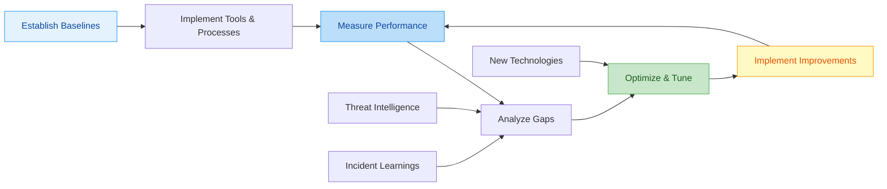

**Improvement Cycle**:
1. **Monthly**: Review metrics, tune detection rules, update playbooks
2. **Quarterly**: Strategic assessment, technology evaluation, roadmap updates
3. **Annually**: Comprehensive architecture review, vendor evaluation, budget planning

**Key Improvement Areas**:
- **Detection Coverage**: Identify gaps using MITRE ATT&CK framework
- **Response Automation**: Identify repetitive manual tasks for automation
- **Integration Efficiency**: Optimize data flows and reduce latency
- **Analyst Productivity**: Reduce cognitive load through better workflows
- **Threat Intelligence**: Enhance context and accuracy of detections
</details>

## 9. 🔮 Future Trends and Evolution

### 9.1 Emerging Technologies and Integration Patterns

<details>
<summary>🚀 Future Technology Trends</summary>

#### **1. AI-Driven Autonomous SOC**
- **Agentic AI**: Autonomous agents that triage, investigate, and respond to incidents 【turn0search2】
- **Predictive Analytics**: Anticipate attacks before they occur based on patterns and trends
- **Natural Language Processing**: Generate narrative reports and explanations for stakeholders

#### **2. Cloud-Native Security Operations**
- **Serverless Security**: Function-as-a-Service for security automation
- **Cloud Security Posture Management**: Integrated with SIEM/SOAR
- **Multi-Cloud Visibility**: Unified monitoring across AWS, Azure, GCP

#### **3. Extended Detection and Response Evolution**
- **XDR 2.0**: Deeper integration with identity, cloud, and SaaS applications
- **Open XDR Standards**: Industry-wide interoperability standards
- **Behavioral XDR**: Focus on behavior-based detection across all telemetry sources

#### **4. Convergence of IT and Security Operations**
- **Unified Observability**: Combining security monitoring with performance monitoring
- **Shared Data Platforms**: Common data lakes for IT and security analytics
- **Integrated Response**: Coordinated remediation across IT and security workflows

**Implementation Considerations**:
- **Skills Evolution**: Analysts need cloud, AI, and automation skills
- **Architecture Evolution**: Move from centralized to distributed, edge-based processing
- **Vendor Consolidation**: Reduce tool sprawl through platform consolidation
- **Data Strategy**: Unified data architecture for security and operational analytics
</details>

## 10. 📚 Summary and Implementation Guide

### 10.1 Key Takeaways

1. **Integration is Key**: The value of individual tools is multiplied when integrated effectively
2. **People, Process, Technology**: Technology is only one-third of the equation
3. **Start with Foundation**: Build a strong SIEM and EDR foundation before adding complexity
4. **Measure Continuously**: Establish metrics early and review them regularly
5. **Automate Thoughtfully**: Automate repetitive tasks, but maintain human oversight for critical decisions
6. **Adapt and Evolve**: Threat landscape changes rapidly; your SOC tools must evolve too

### 10.2 Implementation Checklist

<details>
<summary>✅ Comprehensive Implementation Checklist</summary>

#### **Phase 1: Foundation**
- [ ] Define security operations requirements and scope
- [ ] Establish baseline metrics and KPIs
- [ ] Select and deploy SIEM with essential log sources
- [ ] Deploy EDR on critical endpoints
- [ ] Develop initial correlation rules and alerting
- [ ] Establish incident response procedures

#### **Phase 2: Network Visibility**
- [ ] Deploy NDR sensors at critical network segments
- [ ] Integrate SIEM with EDR and NDR
- [ ] Develop integrated correlation rules
- [ ] Implement basic SOAR workflows
- [ ] Establish threat intelligence integration

#### **Phase 3: Automation & Optimization**
- [ ] Expand SOAR playbooks for all major incident types
- [ ] Implement advanced detection rules
- [ ] Develop continuous tuning processes
- [ ] Establish metrics and reporting
- [ ] Implement training and certification programs

#### **Phase 4: Maturity & Enhancement**
- [ ] Implement advanced analytics and UEBA
- [ ] Expand to cloud and hybrid environments
- [ ] Develop threat hunting program
- [ ] Establish vendor management processes
- [ ] Implement continuous improvement framework
</details>

### 10.3 Recommended Resources

- **NIST Cybersecurity Framework**: For alignment with industry standards 【turn0search12】
- **MITRE ATT&CK Framework**: For detection coverage planning and assessment
- **SOC-CMM (Capability Maturity Model)**: For SOC maturity assessment
- **Industry Reports**: Gartner Magic Quadrant, Forrester Wave for vendor evaluation
- **Community Forums**: Reddit r/cybersecurity, SANS Institute community for practitioner insights

---

> 💡 **Final Insight**: The most successful security operations are not those with the most tools, but those that integrate tools effectively, empower their analysts, and continuously adapt to the evolving threat landscape. Start with a strong foundation, measure relentlessly, and never stop improving.