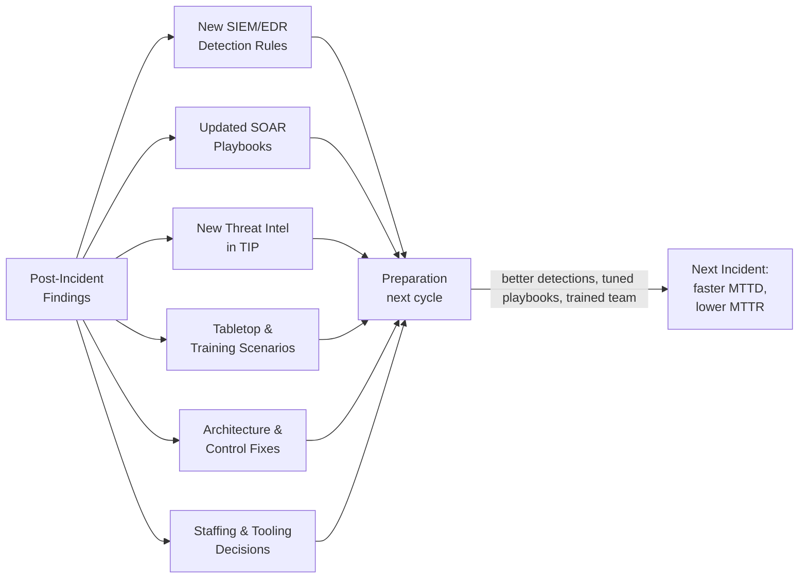

# The Relationship Between SOC Tools and the Incident Response Lifecycle
## TCM Exam Objectives

- **Map SOC tools to NIST IR lifecycle phases** – Know which tools support each phase: Preparation (SOAR playbooks, TIP, EDR/NDR deployment, vulnerability mgmt), Detection & Analysis (SIEM, EDR, NDR, UEBA, TIP, AI agents), Containment/Eradication/Recovery (EDR isolation, SOAR playbooks, firewalls, DFIR suites, backup systems), Post-Incident (case management, SIEM tuning, detection engineering).
- **Understand the NIST SP 800-61 Rev. 3 changes** – Know that Rev. 3 reframes IR around CSF 2.0 functions (Govern/Identify/Protect as preparation, Detect/Respond/Recover as active IR, Improvement as continuous connective tissue).
- **Explain the closed-loop feedback model** – Post-incident findings → new detection rules → revised SOAR playbooks → updated threat intel → training scenarios → architecture fixes → staffing/tooling decisions → next cycle.
- **Describe the role of each primary tool in IR** – SIEM (detection engine correlating all logs), EDR (telemetry + host isolation), NDR (network traffic + lateral movement detection), SOAR (automated playbooks), DFIR suites (evidence preservation, forensic analysis).
- **Understand evidence preservation and order of volatility** – Know RFC 3227: registers/cache → routing tables/ARP/process tables → system memory → temporary files → disk → remote logs → physical config → archival media.
- **Identify the forensic tools and their uses** – FTK Imager (first-response imaging), EnCase (disk analysis), Magnet AXIOM (artifact-first), Velociraptor (enterprise-scale collection), Volatility (memory analysis).
- **Recognize the most decisive IR phase** – Know that Containment is widely regarded as the most critical phase: without it, even the best detection and eradication fail.
- **Explain how the lifecycle becomes a cycle** – Phase 4 (Post-Incident) outputs become Phase 1 (Preparation) inputs. A mature SOC gets faster with every incident handled.

SOC tools are not standalone products — each maps to specific stages of the NIST SP 800-61 incident response lifecycle, with SIEM and EDR driving Detection & Analysis, SOAR and EDR executing Containment, forensic suites powering Eradication and Post-Incident evidence collection, and threat intelligence plus detection engineering feeding the cyclical feedback loop back into Preparation. The current NIST SP 800-61 Revision 3 (finalized in 2025, superseding Rev. 2) reframes IR around the CSF 2.0 functions — Govern/Identify/Protect as the preparation foundation, with Detect, Respond, and Recover as the active IR phases, plus continuous Improvement as the connective tissue — but the operational mapping of tools to phases remains grounded in the classic four-phase model that practitioners still use day-to-day.【turn4search4】【turn4search6】【turn0search3】

📌 **Exam Tip:** The PSAA exam frequently tests the tool-to-phase mapping. Remember: SIEM + EDR + NDR = Detection & Analysis phase. SOAR + EDR = Containment/Eradication. DFIR suites = Post-Incident evidence. A question might ask: "In which IR phase would you use a SOAR playbook to isolate a compromised endpoint?" Answer: Containment, Eradication & Recovery.

## The Lifecycle × Tool Stack at a Glance

The most useful mental model treats the IR lifecycle as a closed loop: each phase consumes the output of the previous one and produces the raw material for the next, with post-incident activity feeding detection gaps and lessons learned back into preparation.

```mermaid
flowchart LR
    subgraph PREP[1. Preparation]
      P1[IR Plans & Playbooks<br/>SOAR]
      P2[Threat Intel<br/>TIP]
      P3[EDR/NDR Deploy]
      P4[Tabletop & Purple Team]
      P5[Detection Engineering]
    end
    subgraph DA[2. Detection & Analysis]
      D1[SIEM Correlation]
      D2[EDR Telemetry]
      D3[NDR Traffic]
      D4[UEBA Anomalies]
      D5[AI SOC Agent<br/>auto-investigation]
    end
    subgraph CER[3. Containment, Eradication & Recovery]
      C1[EDR Host Isolation]
      C2[SOAR Playbooks<br/>auto-contain]
      C3[Forensic Imaging<br/>FTK, EnCase, AXIOM]
      C4[Memory Capture<br/>Volatility, Velociraptor]
      C5[Patch & Restore]
    end
    subgraph PIA[4. Post-Incident Activity]
      A1[Lessons Learned Meeting]
      A2[SIEM Rule Tuning]
      A3[Detection Gap Analysis]
      A4[Forensic Report<br/>+ Chain of Custody]
      A5[Metrics Review<br/>MTTD/MTTR]
    end
    PREP --> DA --> CER --> PIA
    PIA -.->|feedback: new detections, tuned playbooks, training| PREP
```

The dotted feedback line is the single most important structural feature of the lifecycle — without it, the SOC repeats the same mistakes and the same detection gaps persist incident after incident.【turn4search1】【turn4search3】

## Master Comparison Table

| IR Phase | Primary SOC Tools | Key Actions | Typical Outputs | Handoff To |
|---|---|---|---|---|
| **1. Preparation** | SOAR (playbooks), TIP, EDR/NDR deployment, SIEM (detection rules), vulnerability management, case management, training platforms | Build IR plans, codify playbooks, deploy sensors, run tabletop exercises and purple team engagements, tune detection rules, establish comms protocols and contact trees | Documented IR plan, validated playbooks, trained IRT, baseline detection coverage, asset inventory | Feeds Detection & Analysis (sensors live, rules tuned) |
| **2. Detection & Analysis** | SIEM (correlation engine), EDR (endpoint telemetry), NDR (network traffic), UEBA (behavioral baselines), TIP (IOC enrichment), SOAR (auto-enrichment), AI SOC agents (autonomous investigation), email security | Ingest and correlate telemetry, match against threat intel, triage alerts, investigate scope/impact, classify severity, decide escalate or close | Validated incidents with severity, scope, IOCs, attack timeline | Escalation to Containment with full context package |
| **3. Containment, Eradication & Recovery** | EDR (host isolation, process kill), SOAR (automated containment playbooks), firewalls/NDR (network isolation), DFIR suites (EnCase, FTK, Magnet AXIOM), memory tools (Volatility, Velociraptor, FTK Imager), backup/recovery systems, patch management | Isolate affected systems short-term and long-term, preserve volatile evidence in order of volatility, image disks and memory, eradicate malware/artifacts, restore from clean backups, validate systems before return to production | Contained threat, preserved evidence with chain of custody, clean restored systems, eradication confirmation | Post-Incident Activity with evidence package and timeline |
| **4. Post-Incident Activity** | Case management (TheHive, ServiceNow SecOps), SIEM (rule tuning), detection engineering platforms, forensic analysis suites, SOC metrics dashboards, knowledge base | Conduct lessons-learned meeting, perform root-cause analysis, tune SIEM rules and EDR detections, update playbooks, write forensic report, archive evidence, review MTTD/MTTR/reopen rate | Lessons-learned report, updated detections, revised playbooks, training inputs, metrics trends | Feeds back into Preparation (next cycle) |

Sources: 【turn0search5】【turn2search0】【turn2search6】【turn3fetch0】【turn4search3】

---

## Phase 1 — Preparation: Building the Foundation

Preparation is the phase that determines whether the next three phases execute in minutes or in chaos. NIST SP 800-61r3 notes that organizations with mature documented procedures reduce MTTR by up to 40% compared to those relying on ad-hoc processes.【turn3fetch0】

**SOAR as the playbook repository.** SOAR platforms (Splunk SOAR, Cortex XSOAR, Tines, Torq) codify response sequences for common incident types — phishing triage, malware containment, brute-force response, cloud policy enforcement — so that when an incident fires, the team executes a validated workflow rather than improvising under pressure. Playbooks define roles, decision points, and automated actions, and they double as training material for new analysts.【turn1search3】【turn1search0】

**Threat intelligence platforms (TIP).** A TIP (Anomali, ThreatConnect, ThreatQ, MISP) aggregates IOCs and TTPs from multiple feeds, enriches them with confidence scoring, and distributes them into SIEM detection rules, EDR blocklists, and firewall policies before any incident occurs. This is what makes Detection & Analysis fast — the intel is already operationalized rather than looked up reactively.

**Sensor deployment and detection engineering.** EDR, NDR, and SIEM agents must be deployed across the estate, and detection rules aligned to MITRE ATT&CK techniques. Vulnerability management (Tenable, Qualys, Rapid7) reduces the attack surface proactively. Purple team exercises — where red and blue teams collaborate against realistic attack scenarios — test whether detections actually fire and feed results back into detection engineering, closing gaps before a real adversary exploits them.【turn2search12】【turn2search13】

**Tabletop exercises and IR team readiness.** Regular simulations validate the IR plan, communication protocols, and contact trees. The output of every tabletop is a set of gaps — missing playbooks, unclear ownership, broken integrations — that get resolved in this phase rather than during a live incident.【turn1search5】
---

## Phase 2 — Detection & Analysis: Identifying and Validating Incidents

This is where the SOC tool stack earns its keep. The phase has two sub-stages: **detection** (something happened) and **analysis** (what happened, how bad is it, what do we do). The SANS framework splits this into "Identification" as a distinct step, but NIST groups them — operationally they blur because validation often requires deeper investigation.【turn0search13】

**SIEM correlation as the detection engine.** The SIEM ingests logs from firewalls, endpoints, cloud platforms, IAM systems, and applications, then applies correlation rules to surface attack patterns. A single EDR alert on one machine might not cross the escalation threshold, but five EDR alerts across five machines with similar process patterns, originating from the same subnet within 30 minutes and correlated with unusual authentication events, is a SIEM-level incident that only becomes visible when endpoint data flows into the broader correlation engine.【turn2search4】【turn2search2】

**EDR and NDR as primary telemetry sources.** EDR surfaces suspected threats and sends prioritized alerts based on behavioral analytics, asset criticality, and threat-intel correlation; analysts investigate using forensic timelines and contextual data to validate whether the alert is genuine. NDR catches what endpoints miss — lateral movement, data exfiltration, attacks on unmanaged IoT/OT devices — by analyzing network traffic patterns.【turn2search0】【turn0search5】

**UEBA for the subtle stuff.** User and Entity Behavior Analytics establishes baselines of normal behavior and flags deviations — credential misuse, privilege abuse, insider threats — that rule-based detection structurally misses. UEBA outputs feed into the SIEM as enriched risk scores on users and entities.

**Threat intelligence enrichment.** During analysis, the TIP provides context — is this IP a known C2? Is this hash associated with a documented campaign? — that turns a generic alert into a scoped incident. SOAR automates this enrichment: when an alert fires, the playbook queries the TIP, EDR, and identity systems, attaches the context, and presents the analyst with a pre-enriched incident rather than a raw alert.【turn1search1】【turn1search4】

**AI SOC agents and autonomous investigation.** The newest addition to this phase: AI agents (Dropzone AI, Prophet Security, 7ai) autonomously investigate alerts by forming a hypothesis, gathering evidence across connected tools, and delivering a verdict with reasoning attached. This compresses the analysis stage dramatically — what took a Tier 1 analyst 30-70 minutes can be done in minutes, with humans reviewing verdicts rather than executing every investigative step.

**Output of this phase:** a validated incident with severity classification, scope assessment, identified IOCs, and an attack timeline — the context package handed to Containment.

---

## Phase 3 — Containment, Eradication & Recovery: Stopping the Bleeding

NIST groups these three activities into one phase because they overlap operationally — you contain as you eradicate, and recovery begins before eradication is fully complete on every system. Containment is widely regarded as the most decisive phase: without it, even the best detection and eradication efforts fail because the attacker keeps moving.【turn3fetch1】【turn1search7】

**Short-term vs. long-term containment.** Short-term containment isolates the immediate threat — EDR isolates the endpoint from the network, SOAR blocks malicious IPs and disables compromised accounts, firewalls segment affected subnets. Long-term containment patches the vulnerability or removes the access path that allowed the compromise, so the attacker can't return through the same vector. EDR is the workhorse here: it can automatically isolate an endpoint, terminate a malicious process, or quarantine a file, and it keeps a forensic record of past events for reconstruction.【turn2search0】【turn2search5】

**SOAR-driven automated containment.** Research on large enterprise deployments shows SOAR reduces average containment time from multiple hours to several minutes and lowers analyst workload by up to 60%, while improving consistency of zero-trust enforcement. A phishing outbreak playbook can trigger automated workstation isolation, credential resets, and malicious domain blocks without analyst intervention — the playbook executes decisions humans already designed.【turn2search6】【turn1search3】

**Evidence preservation before eradication.** This is the critical handoff that separates mature IR from amateur cleanup. Before any artifact is wiped, volatile evidence must be captured in **order of volatility** (RFC 3227): registers and cache → routing tables/ARP cache/process tables → system memory → temporary file systems → disk storage → remote logs → physical configuration → archival media. Memory is captured first because it disappears the moment power is cut — running processes, network connections, injected code, encryption keys all live there and are gone instantly on shutdown.【turn4search8】【turn4search9】【turn4search12】

**Forensic tooling for evidence collection:**
- **FTK Imager** — captures volatile memory, swap files, and disk images; the standard first-response tool
- **EnCase (OpenText)** — disk analysis and full-disk imaging with EnScripts for automated artifact analysis; maintains data integrity with hash verification
- **Magnet AXIOM** — artifact-first workflow across disk, memory, cloud, and mobile
- **Velociraptor** — open-source, agent-based remote forensic collection at enterprise scale
- **Volatility Framework** — memory analysis to identify malicious processes, injected code, and IOCs from RAM captures【turn2search8】【turn2search9】【turn4search10】

**Chain of custody.** Every piece of evidence gets timestamped, hashed, and duplicated, with a documented chain showing who handled it, when, and why — preserving admissibility for potential legal proceedings. This matters even if litigation never materializes, because internal accountability and audit require the same discipline.【turn1search10】【turn1search8】

**Eradication.** Removing the threat from the environment — deleting malware, closing backdoors, rotating all compromised credentials, revoking malicious sessions, patching the exploited vulnerability. DFIR personnel use forensic findings to ensure no persistence mechanisms survive.

**Recovery.** Restoring systems to normal operations — rebuilding from clean images, restoring from verified backups, validating that systems are clean before returning them to production. Recovery is not a single step but a priority-ordered process: high-priority assets may be held back until eradication is confirmed complete, while less critical systems recover first.【turn1search7】

---

## Phase 4 — Post-Incident Activity: The Feedback Engine

This phase is what makes the lifecycle a cycle rather than a line. NIST and SANS both emphasize that without structured post-incident activity, the SOC repeats the same mistakes — and the same root-cause analysis surfaces the same findings incident after incident.【turn0search1】【turn4search3】

**Lessons-learned meeting.** A structured debrief held within days of incident closure, attended by the IR team, SOC leadership, IT operations, and relevant business stakeholders. The agenda: what happened, how was it detected, how was it contained, what worked, what failed, what would we do differently. The output is a written report distributed to stakeholders and archived in the case management system (TheHive, ServiceNow SecOps, Cortex XSOAR).【turn1search0】

**Root-cause analysis via forensic evidence.** The evidence preserved during Phase 3 — disk images, memory captures, network captures, EDR forensic timelines — gets analyzed to reconstruct the full attack chain: initial access vector, lateral movement path, persistence mechanisms, data accessed or exfiltrated. This is where DFIR tooling pays off: Magnet AXIOM, Volatility, and Velociraptor turn raw artifacts into a narrative of what the attacker actually did.【turn2search10】【turn1search10】

**Detection gap analysis and SIEM tuning.** The single most actionable output: identifying which detections fired, which should have fired but didn't, and which produced false positives that wasted analyst time. New detection rules get authored in the SIEM and EDR; existing rules get tuned to reduce noise. VMRay's IR metrics guide tracks this as "lessons-learned implementation rate" — how many lessons become actual changes including playbook updates, tuning changes, architectural fixes, and training improvements.【turn4search3】【turn4search1】

**Playbook updates.** SOAR playbooks get revised based on what actually happened — if the containment playbook missed a step that a human had to execute manually, that step gets codified. If the escalation path was unclear, it gets redefined. The playbook library evolves with each incident.【turn1search3】

**Metrics review.** Post-incident is when the SOC reviews its KPIs for the incident: MTTD (how fast did we detect?), MTTA (how fast did we acknowledge?), MTTR/MTTC (how fast did we contain and resolve?), reopen rate (did we close prematurely?), and false negative surfacing (what did we miss entirely?). These metrics feed back into staffing, automation, and detection engineering decisions for the next cycle.【turn4search0】【turn4search3】

**Evidence archiving.** All forensic evidence, reports, and chain-of-custody documentation get archived per the organization's retention policy — typically years, especially if regulatory or legal follow-up is possible.

---

## The Feedback Loop: Why This Is a Cycle, Not a Pipeline

The lifecycle's defining feature is that Phase 4 outputs become Phase 1 inputs. Every closed incident should produce:

- **New detection rules** in the SIEM and EDR (closing detection gaps surfaced in post-incident analysis)
- **Revised SOAR playbooks** (codifying manual steps that analysts executed during the incident)
- **Updated threat intel** in the TIP (new IOCs and TTPs observed during the incident)
- **Training inputs** for the IR team (tabletop scenarios derived from real incidents)
- **Architecture fixes** (structural weaknesses that allowed the incident to occur or spread)
- **Metrics-driven staffing and tooling decisions** (if MTTA is rising, add shift coverage; if false positives are rising, invest in rule cleanup)【turn4search3】【turn4search1】

The lifecycle's value proposition in one sentence: **a mature SOC gets faster with every incident it handles** — not because the team works harder, but because post-incident activity systematically converts each incident's lessons into better detections, tighter playbooks, and smarter tools for the next cycle. Organizations that skip or rush Phase 4 break this loop and find themselves responding to the same types of incidents with the same gaps year after year.【turn4search3】【turn3fetch0】

---

## NIST SP 800-61 Rev. 3: The Modern Reframing

Worth noting for completeness: NIST SP 800-61 Revision 3 (finalized in 2025, superseding Rev. 2) restructured IR around CSF 2.0 rather than presenting a standalone four-phase lifecycle. Under Rev. 3, **Govern, Identify, and Protect are the preparation foundation** (not incident response itself), while **Detect, Respond, and Recover are the active IR functions**, with **Improvement** as a continuous category connecting them. The operational reality on the SOC floor hasn't changed — practitioners still map tools to Preparation, Detection & Analysis, Containment/Eradication/Recovery, and Post-Incident Activity — but Rev. 3 explicitly frames IR as embedded in broader cybersecurity risk management rather than a standalone process, which aligns tool selection with business risk and governance rather than pure operational throughput.【turn4search4】【turn4search6】【turn0search3】

The throughline across both revisions and across the SANS PICERL model: the SOC tool stack exists to serve the lifecycle, not the other way around. A SIEM without correlation rules tuned to the organization's threat model is expensive log storage. A SOAR platform without validated playbooks is shelfware. EDR without forensic evidence preservation is alert noise. The tools only deliver value when mapped to specific IR phase outcomes — and when the post-incident feedback loop closes back into preparation, making the entire stack sharper with every incident handled.