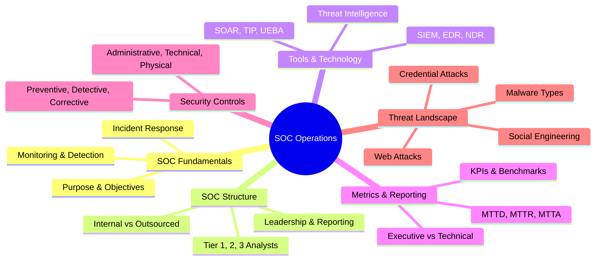
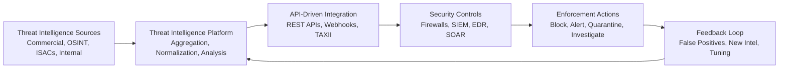

# ?? Full-Stack Lesson: Threat Intelligence Platforms & Firewalls Integration


## TCM Exam Objectives

- **Define Threat Intelligence and TIP** � CTI is knowledge about threat actors' motives, intents, and capabilities. A TIP aggregates, normalizes, analyzes, and disseminates threat intel from multiple sources.
- **Explain TIP core capabilities** � Ingestion/aggregation of multiple feeds, normalization (STIX/TAXII), correlation/analysis, dissemination via APIs, and collaboration/sharing.
- **Describe the TIP-firewall integration architecture** � Sources ? TIP (aggregation, normalization, analysis) ? API-driven integration ? Security controls (firewalls, SIEM, EDR, SOAR) ? Enforcement actions ? Feedback loop.
- **Understand STIX and TAXII** � STIX = Structured Threat Information Expression (standardized language for threat data). TAXII = Trusted Automated Exchange of Intelligence Information (transport mechanism).
- **Know leading TIP platforms** � Microsoft Defender TI (78 trillion signals), ThreatConnect (operationalizing intel), MISP (open-source, community-driven), OpenCTI (knowledge graph), ThreatQ (scoring/prioritization).
- **Apply threat intelligence to firewall enforcement** � Dynamic block lists, custom detection rules in SIEM, orchestration workflows, automated response actions.
- **Understand firewall integration patterns** � Cloud-native (TIP ? Cloud Firewall), Hybrid (on-prem TIP ? hybrid firewall), MSSP (MSSP TIP ? customer firewalls).
- **Identify key metrics for TIP-firewall integration** � MTTD (<24h), MTTR (<4h), false positive rate (<5%), threat coverage (>95%), automation rate (>70%).



# ?? Full-Stack Lesson: Threat Intelligence Platforms & Firewalls Integration

?? **Exam Tip:** The PSAA exam tests the difference between STIX and TAXII. STIX = WHAT (the threat data format/language). TAXII = HOW (the transport protocol to share it). Think of STIX as the language and TAXII as the postal service. Also know that MISP is the leading open-source TIP � it's free and community-driven.

## ?? 1. Introduction: Foundational Concepts

### 1.1 What is Threat Intelligence?
Cyber Threat Intelligence (CTI) is knowledge, skills, and experience-based information concerning the motives, intents, and capabilities of cyber threat actors. It transforms raw data into actionable insights that enable organizations to make informed decisions about their security posture ?turn0search9?. Unlike simple threat data feeds, true threat intelligence provides context, such as actor attribution, attack patterns, and potential business impact.

### 1.2 What is a Threat Intelligence Platform (TIP)?
A Threat Intelligence Platform is a software system that aggregates, normalizes, analyzes, and disseminates threat intelligence from multiple sources. It serves as the central hub for collecting, curating, and operationalizing threat data across an organization's security ecosystem ?turn0search0??turn0search5?. TIPs typically provide capabilities for:
- **Ingestion and aggregation** of multiple threat feeds (commercial, open-source, internal)
- **Normalization and standardization** of data (using formats like STIX/TAXII)
- **Correlation and analysis** to identify relationships between indicators
- **Dissemination** to security controls via APIs and integrations
- **Collaboration and sharing** with internal teams and external communities

### 1.3 Firewalls in Modern Security Architecture
Next-generation firewalls (NGFW) have evolved beyond simple packet filtering to become intelligent security gateways that inspect traffic at multiple layers. Modern firewalls can:
- Apply threat intelligence-based filtering to block known malicious IPs, domains, and URLs ?turn0search19?
- Perform deep packet inspection to identify malware and exploits
- Integrate with cloud security platforms for consistent policy enforcement
- Provide detailed logging and analytics for security monitoring

## ??? 2. Technical Architecture: How TIPs and Firewalls Integrate

### 2.1 Integration Framework Overview
The integration between Threat Intelligence Platforms and firewalls follows a systematic architecture that enables automated threat prevention and enhanced situational awareness. The core components of this architecture include:



### 2.2 Key Technical Components

#### Threat Feed Aggregation & Normalization
The TIP begins by collecting threat intelligence from diverse sources, including:
- **Commercial feeds** from security vendors
- **Open-source intelligence** (OSINT) from public databases
- **Industry ISACs** (Information Sharing and Analysis Centers)
- **Internal findings** from past incidents and vulnerability scans

All data is normalized to standard formats (STIX/TAXII) to ensure consistency across different systems ?turn0search0?. This process involves:
- **Deduplication** of identical indicators from multiple sources
- **Validation** to remove false positives
- **Scoring** based on confidence, relevance, and recency
- **Enrichment** with additional context (geolocation, threat actor association)

#### Contextual Enrichment & Correlation
As security telemetry flows through the firewall, it is enriched in real-time with threat intelligence context. For example:
- **IP addresses** are checked against known command-and-control servers
- **File hashes** are compared with malware signatures
- **URLs** are verified against phishing databases
- **DNS queries** are correlated with known malicious domains

This enrichment enables firewalls to move beyond simple signature-based detection to contextual blocking based on current threat landscapes ?turn0search0?.

#### Automated Enforcement & Orchestration
The integrated system enables automated response actions:
- **Dynamic block lists** are automatically updated on firewalls when new threats are identified
- **Custom detection rules** are generated for SIEM systems based on emerging TTPs
- **Orchestration workflows** trigger automated responses (e.g., isolating affected systems, updating policies) ?turn0search0??turn0search5?

### 2.3 Integration Protocols & Standards
Modern TIPs and firewalls communicate using standardized protocols:
- **STIX (Structured Threat Information Expression)** - standardized language for representing cyber threat information
- **TAXII (Trusted Automated Exchange of Intelligence Information)** - transport mechanism for sharing cyber threat intelligence
- **REST APIs** - for direct integration between platforms
- **Webhooks** - for event-driven notifications
- **OpenIOC (Open Indicators of Compromise)** - framework for sharing threat indicators

## ?? 3. Practical Implementation: Building an Integrated Stack

### 3.1 Platform Selection Considerations
When selecting a Threat Intelligence Platform, consider these key factors:

| Evaluation Criteria | Key Questions | Considerations |
|-------------------|--------------|----------------|
| **Data Sources** | What sources does it aggregate? | Ensure coverage of commercial, OSINT, and industry-specific feeds |
| **Integration Capabilities** | Does it integrate with our firewall? | Look for pre-built integrations or robust API support |
| **Automation** | Can it automate enforcement actions? | Check for SOAR capabilities and workflow automation |
| **Scalability** | Can it handle our data volumes? | Consider cloud-native architectures for elastic scaling |
| **Customization** | Can we add custom indicators? | Ensure ability to incorporate internal threat data |
| **Usability** | Does it provide actionable intelligence? | Look for prioritization and context features |

### 3.2 Leading Threat Intelligence Platforms
Based on 2026 evaluations, here are leading platforms across different categories:

| Platform | Best For | Key Features | Pricing Model |
|----------|----------|--------------|---------------|
| **Microsoft Defender TI** | Global threat visibility | Aggregates 78 trillion daily signals, native SIEM/XDR integration | Commercial |
| **ThreatConnect** | Operationalizing intelligence | Unified workbench, risk quantification, low-code automation | Commercial |
| **MISP** | Information sharing | Community-driven, supports STIX/TAXII, open-source | Free |
| **OpenCTI** | Knowledge management | Knowledge graph, visualization, integrations with MISP/TheHive | Free |
| **ThreatQ** | Scoring & prioritization | Central repository, noise reduction, smart collections | Commercial |
| **ShadowDragon Horizon** | Attribution & identity correlation | Identity graphing, searches 550+ sources, 15B+ breach records | Commercial |

<details>
<summary>?? Deep Dive: Open Source Options</summary>

For organizations considering open-source solutions, two platforms stand out:

**MISP (Malware Information Sharing Platform)**
- Community-driven platform for sharing IOC
- Supports STIX, TAXII, and OpenIOC formats
- Provides automatic correlation of indicators across events
- Ideal for information sharing and collaboration

**OpenCTI**
- Knowledge management platform for threat intelligence
- Features a powerful knowledge graph interconnecting actors, malware, and campaigns
- Provides visualization tools to map attack patterns
- Integrates with MISP and TheHive for incident response
- Best for organizations focused on analysis and research
</details>

### 3.3 Firewall Integration Patterns
Firewalls can be integrated with TIPs in several architectural patterns:

#### Pattern 1: Cloud-Native Integration
```
Cloud TIP ? Cloud Firewall ? Enforcement
    ?            ?
    +-- Feedback Loop --+
```
**Best for:** Cloud-first organizations, distributed environments

#### Pattern 2: Hybrid Deployment
```
On-Premises TIP ? Hybrid Firewall ? Cloud Enforcement
        ?                ?

        +--- Feedback Loop ----+
```
**Best for:** Organizations with legacy systems and cloud workloads

#### Pattern 3: MSSP Integration
```
MSSP TIP ? Customer Firewalls ? Centralized Monitoring
    ?            ?
    +-- Feedback Loop --+
```
**Best for:** Organizations without dedicated security teams

### 3.4 Implementation Best Practices
Based on industry experience, successful implementations follow these practices:

1. **Start with clear use cases** - Define specific problems you want to solve (e.g., "reduce phishing attempts" or "block ransomware communications")
2. **Establish data quality metrics** - Ensure threat intelligence is accurate, timely, and relevant
3. **Implement feedback loops** - Continuously tune and refine based on false positives and new intelligence
4. **Prioritize automation** - Focus on automating routine tasks to free analysts for strategic work
5. **Ensure proper change management** - Implement controls for updating firewall policies based on threat intelligence
6. **Monitor and measure impact** - Track metrics like mean time to detect (MTTD) and mean time to respond (MTTR)

## ?? 4. Advanced Integration Scenarios

### 4.1 Real-Time Threat Prevention
The integrated stack enables real-time prevention capabilities:
- **Dynamic block lists** automatically update firewall rules when new threats are identified
- **Behavioral analytics** detect anomalies that may indicate new attack patterns
- **Automated responses** isolate compromised systems or block malicious traffic

### 4.2 Threat Hunting & Investigation
Threat intelligence transforms reactive incident response into proactive threat hunting:
- **Contextual investigation** - Analysts can understand the "who, what, why, and how" behind attacks
- **Lateral movement detection** - Intelligence helps identify potential breach paths
- **Attribution analysis** - Advanced platforms like ShadowDragon Horizon correlate identifiers to attribute attacks to specific actors ?turn0search7?

### 4.3 Vulnerability Management Prioritization
Integrate threat intelligence with vulnerability management to:
- **Prioritize patching** based on active exploitation in the wild
- **Identify exposure mapping** - Understand which vulnerabilities are being targeted in your industry
- **Quantify risk** - Align threat data with financial risk for better decision making ?turn0search7?

### 4.4 Cloud Security Integration
Modern cloud-native firewalls (like Azure Firewall) can leverage threat intelligence for:
- **Intelligent filtering** - Block traffic to/from known malicious IPs and domains ?turn0search19?
- **Consistent policy enforcement** - Apply same rules across cloud and on-premises environments
- **Centralized management** - Manage cloud and on-premises firewalls from a single interface

## ?? 5. Performance Metrics & Continuous Improvement

### 5.1 Key Performance Indicators
Track these metrics to measure the effectiveness of your TIP-firewall integration:

| Metric | Description | Target |
|--------|-------------|--------|
| **Mean Time to Detect (MTTD)** | Time from threat emergence to detection | < 24 hours |
| **Mean Time to Respond (MTTR)** | Time from detection to containment | < 4 hours |
| **False Positive Rate** | Percentage of incorrect alerts | < 5% |
| **Threat Coverage** | Percentage of known threats blocked | > 95% |
| **Automation Rate** | Percentage of responses automated | > 70% |

### 5.2 Continuous Improvement Process
Implement a feedback loop for ongoing optimization:

1. **Collect feedback** from security analysts on alert quality
2. **Analyze false positives** and adjust intelligence filters
3. **Update scoring algorithms** based on relevance to your environment
4. **Expand data sources** based on coverage gaps
5. **Refine automation rules** to reduce analyst workload

## ?? 6. Emerging Trends & Future Directions

### 6.1 AI-Powered Threat Intelligence
Artificial intelligence and machine learning are transforming threat intelligence:
- **Predictive analytics** - Anticipate attacks before they occur
- **Behavioral analysis** - Identify anomalous patterns that may indicate new threats
- **Automated curation** - AI helps filter and prioritize intelligence for human analysts

### 6.2 Cloud-Native Intelligence Platforms
Cloud-based TIPs offer several advantages:
- **Elastic scaling** - Handle massive data volumes without infrastructure concerns
- **Global coverage** - Access to threat data from multiple regions
- **Rapid deployment** - Implement quickly without hardware procurement

### 6.3 Integration with DevSecOps
Threat intelligence is increasingly being integrated into development pipelines:
- **Pre-commit hooks** - Check code against known vulnerable patterns
- **CI/CD integration** - Scan artifacts for indicators of compromise
- **Runtime protection** - Apply intelligence to application security monitoring

### 6.4 Quantum-Resistant Intelligence
As quantum computing advances, threat intelligence platforms are beginning to:
- **Track quantum-safe algorithms** - Monitor adoption of post-quantum cryptography
- **Identify quantum-vulnerable systems** - Flag systems using encryption that quantum computers could break
- **Prepare migration strategies** - Plan transitions to quantum-resistant algorithms

## ??? 7. Common Challenges & Mitigation Strategies

### 7.1 Data Overload
**Challenge:** Too much threat data leads to alert fatigue and missed detections.
**Solution:** Implement intelligent filtering and scoring to prioritize high-confidence, relevant threats.

### 7.2 Integration Complexity
**Challenge:** Connecting diverse security tools from different vendors.
**Solution:** Look for platforms with robust API support and pre-built integrations for common security tools.

### 7.3 False Positives
**Challenge:** Legitimate traffic blocked due to inaccurate threat intelligence.
**Solution:** Implement feedback mechanisms to continuously tune and improve accuracy.

### 7.4 Skills Gap
**Challenge:** Difficulty finding analysts with threat intelligence expertise.
**Solution:** Invest in training and consider managed services to augment internal teams.

### 7.5 Cost Management
**Challenge:** Balancing intelligence costs with security needs.
**Solution:** Start with open-source options (like MISP) and add commercial feeds as budget allows.

## ?? 8. Implementation Roadmap

### Phase 1: Foundation (Weeks 1-4)
- Conduct threat intelligence maturity assessment
- Identify key use cases and success metrics
- Select and implement TIP platform
- Integrate with existing SIEM/log management

### Phase 2: Core Integration (Weeks 5-8)
- Connect TIP to next-generation firewalls
- Implement basic automated blocking of known threats
- Establish feedback mechanisms for tuning
- Train security team on new capabilities

### Phase 3: Advanced Capabilities (Weeks 9-12)
- Implement threat hunting workflows
- Integrate with vulnerability management
- Develop custom intelligence feeds from internal sources
- Expand automation with SOAR platform

### Phase 4: Optimization (Ongoing)
- Continuously tune based on metrics
- Expand data sources and coverage
- Implement advanced use cases (attribution, etc.)
- Regularly test and update incident response procedures

## ?? Conclusion

The integration of Threat Intelligence Platforms with firewalls represents a paradigm shift from reactive security to proactive, intelligence-driven defense. By transforming raw threat data into actionable intelligence and automating enforcement across security controls, organizations can significantly improve their security posture while optimizing resource utilization.

The key to success lies in selecting the right platforms, implementing robust integration patterns, and establishing continuous improvement processes. As threat landscapes continue to evolve, this integrated approach will become increasingly essential for organizations seeking to defend against sophisticated cyber attacks.

> ?? **Pro Tip**: Start with a clear use case rather than technology-first. Whether it's reducing phishing attempts, blocking ransomware communications, or improving vulnerability prioritization, beginning with specific objectives will guide your implementation and demonstrate value more quickly.

Remember that threat intelligence is most valuable when it's actionable, timely, and relevant to your specific environment. The integration between TIPs and firewalls creates a powerful foundation for modern security operations, but it requires ongoing commitment to refinement and optimization to realize its full potential.