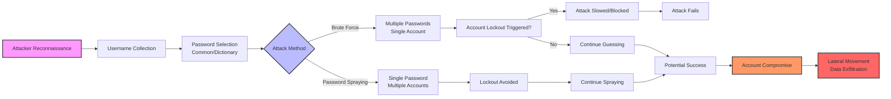
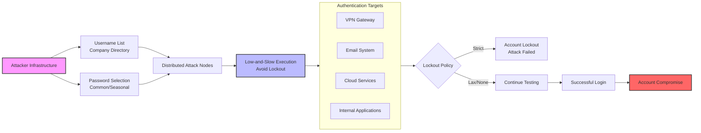
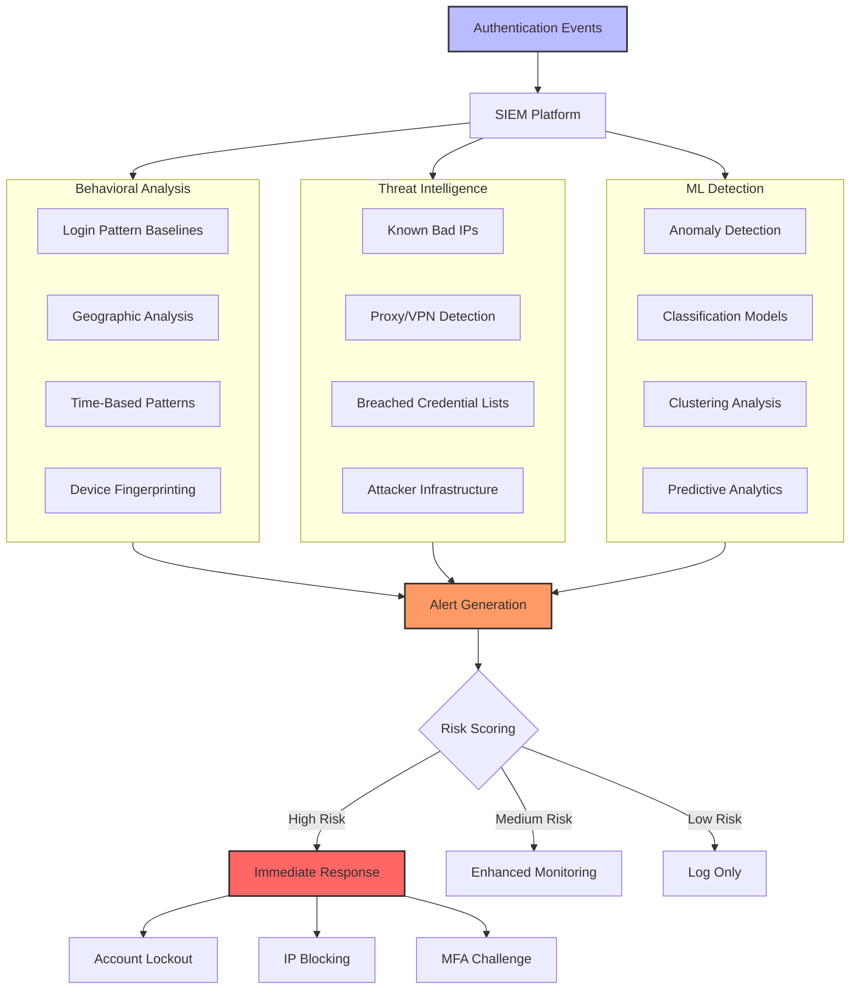
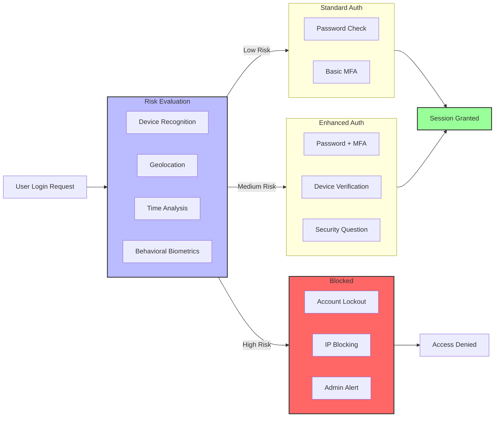
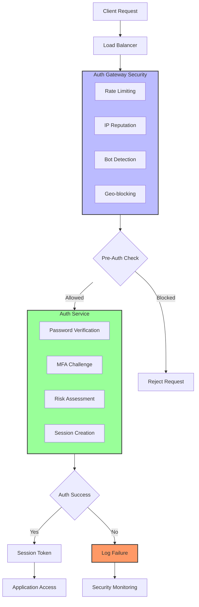
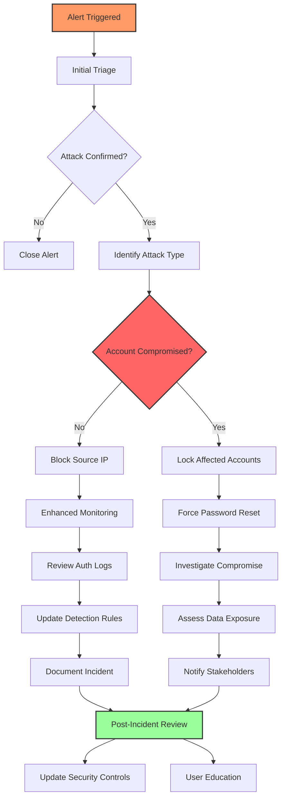
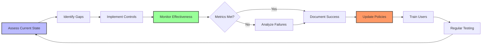
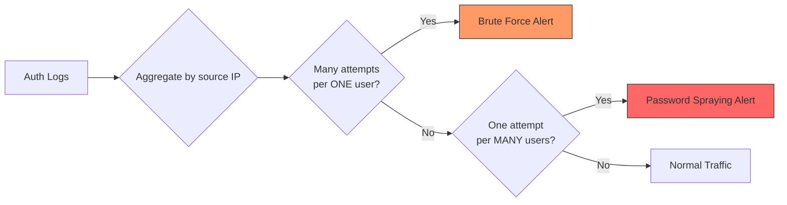
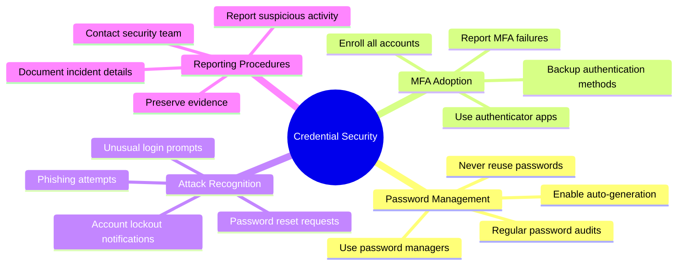
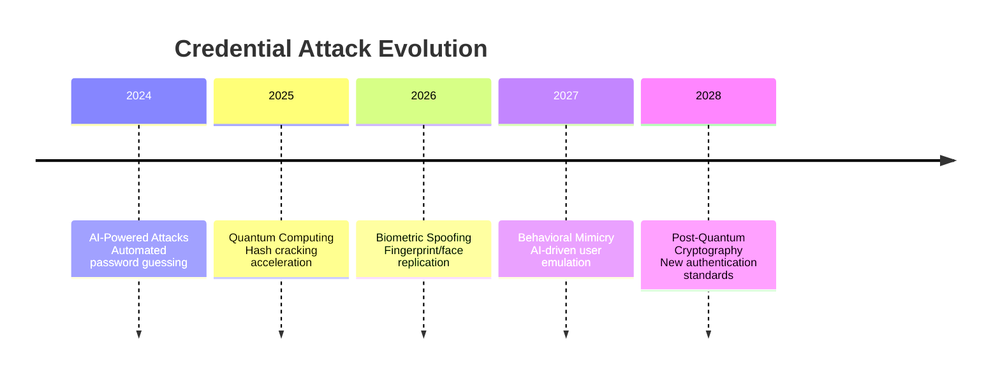

---
tags: [vulnerability]
---
# 🔐 Full-Stack Lesson: Credential-Based Attacks (Brute Force & Password Spraying)

## TCM Exam Objectives

- Distinguish brute force, password spraying, credential stuffing, and dictionary attacks
- Explain how password spraying avoids account lockout and why it is harder to detect
- Identify detection indicators for credential attacks in SIEM logs (failed logins, unusual geography, user-agent rotation)
- Apply NIST SP 800-63B password guidelines (length over complexity, no periodic resets, breached password screening)
- Design adaptive MFA and risk-based authentication policies
- Execute the incident response playbook for credential compromise: containment, eradication, recovery

# 🔐 Full-Stack Lesson: Credential-Based Attacks (Brute Force & Password Spraying)

## 📖 Lesson Overview
This comprehensive lesson explores credential-based attacks, focusing on **brute force** and **password spraying** techniques. You'll learn attack methodologies, detection strategies, prevention frameworks, and how to build resilient authentication architectures. This knowledge is essential for security professionals defending identity infrastructure in modern organizations.



## 1. 🎯 Introduction to Credential-Based Attacks

### 1.1 What Are Credential-Based Attacks?
Credential-based attacks exploit weaknesses in authentication systems to gain unauthorized access to user accounts. Unlike vulnerability exploitation, these attacks target the **human element** of security—our tendency to create memorable but weak passwords and reuse them across multiple services.

**Key Characteristics**:
- **Non-technical execution**: Often requires no software vulnerabilities
- **High success rate**: Exploits predictable human behavior
- **Low detection profile**: Can appear as legitimate login attempts
- **Gateway to broader access**: Compromised credentials enable lateral movement

📌 **Exam Tip:** Key distinction: Brute Force = many passwords against ONE account (triggers lockout). Password Spraying = one common password against MANY accounts (avoids lockout). Credential Stuffing = uses known breached username/password pairs. The exam tests which attack type maps to which lockout behavior.

### 1.2 Attack Taxonomy & Comparison

| Attack Type | Description | Target | Method | Lockout Trigger |
|-------------|-------------|--------|--------|-----------------|
| **Brute Force** | Systematic password guessing | Single account | Multiple passwords against one account | Yes (usually) |
| **Password Spraying** | Common password testing | Multiple accounts | One password against many accounts | No (usually) |
| **Credential Stuffing** | Breached credential reuse | Multiple accounts | Known username/password pairs | Possible |
| **Dictionary Attack** | Wordlist-based guessing | Single account | Dictionary words against one account | Yes |

## 2. 🚀 Brute Force Attacks Deep Dive

### 2.1 Attack Methodology & Implementation

<details>
<summary>🔧 Technical Implementation Details</summary>

```python
# Pseudo-code for brute force attack implementation
def brute_force_attack(target_username, target_service):
    # Load password dictionaries (common, leaked, custom)
    password_lists = [
        load_common_passwords(),
        load_leaked_passwords(),
        generate_custom_wordlist(target_username)
    ]
    
    # Combine and deduplicate passwords
    all_passwords = set().union(*password_lists)
    
    # Attack configuration
    max_attempts = 10000
    delay_between_attempts = 0.5  # seconds
    user_agents = rotate_user_agents()  # Avoid detection
    
    # Execute attack
    for password in all_passwords:
        if attempt_count >= max_attempts:
            break
            
        try:
            # Rotate IP if available (proxy/VPN)
            rotate_ip()
            
            # Attempt login
            response = attempt_login(
                username=target_username,
                password=password,
                service=target_service,
                user_agent=next(user_agents)
            )
            
            # Check success
            if response.success:
                print(f"[+] Success: {target_username}:{password}")
                return password
                
            # Handle lockout
            if "locked" in response.message.lower():
                print(f"[!] Account locked: {response.message}")
                break
                
        except Exception as e:
            print(f"[-] Error: {e}")
            
        finally:
            attempt_count += 1
            time.sleep(delay_between_attempts)
    
    return None
```
</details>

**Brute Force Variations**:
- **Simple Brute Force**: Tries all possible character combinations
- **Dictionary Attack**: Uses predefined wordlists 【turn0search0】
- **Hybrid Attack**: Combines dictionary words with numbers/symbols
- **Pattern-Based Attack**: Exploits known password patterns (e.g., Season+Year: Summer2024!)

### 2.2 Detection Indicators

<details>
<summary>📊 SIEM Detection Rules</summary>

```yaml
# Elastic SIEM rule for brute force detection
name: "Brute Force Attack Detection"
type: "threshold"
index: "auth-*"
filter:
  - query_string:
      query: "event.action:login AND event.outcome:failure"
threshold:
  field: "user.name"
  value: 5
  timeframe: "5m"
  additional:
    - query_string:
        query: "source.ip: * AND NOT source.ip: 10.0.0.0/8"
actions:
  - email:
      to: "soc@company.com"
      subject: "Brute Force Alert: {{user.name}}"
  - slack:
      channel: "#security-alerts"
      message: "Brute force detected on {{user.name}} from {{source.ip}}"

# Splunk detection search
index=auth sourcetype=login action=failure
| stats count as failures by user, src_ip
| where failures > 5
| lookup allowed_ips src_ip OUTPUT allowed
| search NOT allowed=true
| sort - failures
```
</details>

**Warning Signs**:
- Multiple failed logins from same IP address 【turn0search0】
- Rapid succession of password attempts
- Login attempts from unusual geographic locations
- User-agent string rotation patterns
- Failed logins during off-hours

## 3. 🎯 Password Spraying Attacks Deep Dive

### 3.1 Attack Methodology & Advantages

<details>
<summary>⚙️ Password Spraying Architecture</summary>


</details>

**Key Advantages for Attackers**:
1. **Lockout Avoidance**: One password per account avoids triggering lockout policies 【turn0search0】
2. **Low Detection Profile**: Appears as legitimate user mistakes

📌 **Exam Tip:** NIST SP 800-63B guidelines are frequently tested. Key changes: NO periodic password resets (unless compromised), NO complexity requirements (length > complexity), minimum 8-12 characters, screen against breached password lists. The exam tests whether you know the modern NIST approach vs. legacy practices.
3. **High Success Rate**: Exploits common password practices
4. **Scalability**: Can target thousands of accounts simultaneously

### 3.2 Username Collection Techniques

<details>
<summary>🔍 Username Enumeration Methods</summary>

```python
# Username enumeration via various techniques
def enumerate_usernames(target_domain):
    usernames = set()
    
    # 1. Email pattern guessing
    patterns = [
        "{first}.{last}@{domain}",
        "{first_initial}{last}@{domain}",
        "{first}{last_initial}@{domain}",
        "{first}@{domain}"
    ]
    
    # 2. LinkedIn scraping (if available)
    linkedin_users = scrape_linkedin_company(target_domain)
    for user in linkedin_users:
        for pattern in patterns:
            email = pattern.format(
                first=user.first_name.lower(),
                last=user.last_name.lower(),
                first_initial=user.first_name[0].lower(),
                last_initial=user.last_name[0].lower(),
                domain=target_domain
            )
            usernames.add(email)
    
    # 3. GitHub/Slack API enumeration
    if github_token:
        github_users = enumerate_github_org_members(target_domain)
        usernames.update(github_users)
    
    # 4. DNS/MX record analysis
    mx_records = lookup_mx_records(target_domain)
    if "google" in mx_records:
        # Google Workspace enumeration
        usernames.update(google_workspace_enum(target_domain))
    
    # 5. Breach database correlation
    breached_emails = query_breach_databases(target_domain)
    usernames.update(breached_emails)
    
    return list(usernames)
```
</details>

**Common Username Patterns**:
- firstname.lastname@company.com 【turn0search0】
- firstinitial+lastname@company.com
- employee_id@company.com
- role_based@company.com (admin@, hr@, it@)

## 4. 🔍 Detection & Monitoring Framework

### 4.1 Multi-Layer Detection Strategy

<details>
<summary>📈 Comprehensive Detection Architecture</summary>


</details>

### 4.2 Key Detection Indicators

| Indicator | Description | Detection Method | False Positive Rate |
|-----------|-------------|------------------|---------------------|
| **Multiple Account Failures** | Many accounts failing from same IP | SIEM threshold rules | Low |
| **Distributed Low-Volume Attacks** | Few attempts per account, many accounts | Statistical analysis | Medium |
| **Geographic Anomalies** | Logins from unusual locations | GeoIP correlation | Medium |
| **Time-Based Patterns** | Logins outside normal hours | Behavioral baselining | Low |
| **User-Agent Rotation** | Changing browser/client signatures | Fingerprint analysis | Low |
| **MFA Fatigue** | Multiple MFA denials | Auth log analysis | Medium |

<details>
<summary>🚨 Advanced Detection Rules</summary>

```sql
-- SQL detection query for password spraying
WITH login_attempts AS (
    SELECT 
        user_id,
        source_ip,
        COUNT(*) as attempt_count,
        COUNT(DISTINCT user_agent) as user_agent_variety,
        MIN(timestamp) as first_attempt,
        MAX(timestamp) as last_attempt,
        ARRAY_AGG(DISTINCT user_agent) as user_agents
    FROM authentication_logs
    WHERE 
        timestamp >= NOW() - INTERVAL '1 hour'
        AND action = 'login'
        AND outcome = 'failure'
    GROUP BY user_id, source_ip
),
spraying_patterns AS (
    SELECT 
        source_ip,
        COUNT(DISTINCT user_id) as targeted_users,
        COUNT(*) as total_attempts,
        AVG(attempt_count) as avg_attempts_per_user,
        MAX(attempt_count) as max_attempts_per_user,
        BOOL_OR(user_agent_variety > 3) as rotating_user_agents
    FROM login_attempts
    GROUP BY source_ip
    HAVING COUNT(DISTINCT user_id) > 10  -- Targeting multiple accounts
)
SELECT 
    s.*,
    CASE 
        WHEN s.targeted_users > 50 AND s.avg_attempts_per_user < 2 THEN 'Password Spraying'
        WHEN s.max_attempts_per_user > 5 THEN 'Brute Force'
        ELSE 'Other Attack Pattern'
    END as attack_type,
    ti.threat_actor,
    ti.confidence
FROM spraying_patterns s
LEFT JOIN threat_intel ti ON s.source_ip = ti.ip_address
WHERE 
    s.targeted_users > 10
    OR s.max_attempts_per_user > 5
ORDER BY s.targeted_users DESC, s.total_attempts DESC;
```
</details>

## 5. 🛡️ Prevention & Mitigation Framework

### 5.1 Technical Controls

<details>
<summary>🔐 Authentication Security Architecture</summary>


</details>

**Password Policy Recommendations**:
1. **Length Over Complexity**: Minimum 12-16 characters 【turn0search20】
2. **No Periodic Resets**: Unless compromise suspected 【turn0search20】
3. **Breached Password Checking**: Screen against known breach databases 【turn0search23】
4. **Allow Paste-In**: Supports password manager usage 【turn0search20】
5. **Show While Typing**: Reduces typos and shoulder-surfing risk 【turn0search20】

### 5.2 Multi-Factor Authentication (MFA) Strategy

<details>
<summary>🛡️ MFA Implementation Framework</summary>

```python
# Adaptive MFA decision engine
class AdaptiveMFA:
    def __init__(self):
        self.risk_engine = RiskEngine()
        self.auth_methods = {
            'low': ['password'],
            'medium': ['password', 'sms_otp'],
            'high': ['password', 'authenticator_app', 'biometric'],
            'critical': ['password', 'hardware_token', 'biometric']
        }
    
    def evaluate_risk(self, user, login_context):
        risk_score = 0
        
        # Device risk
        if not login_context['trusted_device']:
            risk_score += 25
        
        # Location risk
        if login_context['new_location']:
            risk_score += 30
        if login_context['high_risk_country']:
            risk_score += 40
        
        # Time risk
        if login_context['off_hours']:
            risk_score += 15
        if login_context['impossible_travel']:
            risk_score += 50
        
        # Behavioral risk
        if login_context['typing_pattern_mismatch']:
            risk_score += 20
        if login_context['session_anomaly']:
            risk_score += 25
        
        # Threat intelligence
        if login_context['ip_in_threat_feed']:
            risk_score += 45
        if login_context['user_agent_malicious']:
            risk_score += 35
        
        # Clamp score
        risk_score = min(100, risk_score)
        
        # Determine risk level
        if risk_score >= 70:
            return 'critical'
        elif risk_score >= 40:
            return 'high'
        elif risk_score >= 20:
            return 'medium'
        else:
            return 'low'
    
    def get_auth_methods(self, risk_level):
        return self.auth_methods[risk_level]
    
    def challenge_user(self, user, methods):
        # Present appropriate authentication challenges
        challenges = []
        for method in methods:
            challenge = create_challenge(method, user)
            challenges.append(challenge)
        return challenges
```
</details>

**MFA Best Practices**:
1. **Adaptive Authentication**: Risk-based MFA challenges
2. **Multiple Factors**: Combine something you know, have, and are
3. **Backup Methods**: Prevent account lockout from lost factors
4. **User Education**: Clear instructions for MFA setup and use
5. **Monitoring**: Track MFA enrollment and failure patterns

## 6. 📊 NIST Guidelines & Best Practices

### 6.1 NIST SP 800-63B Password Guidelines

<details>
<summary>📋 NIST Compliance Checklist</summary>

| Guideline | Requirement | Implementation | Verification |
|-----------|-------------|----------------|--------------|
| **Password Length** | 8-64 characters minimum | Configure password policy | Audit user passwords |
| **Password Complexity** | No complexity requirements | Remove complexity rules | Policy configuration check |
| **Password Renewal** | No periodic renewal required | Disable password expiration | Account policy review |
| **Password History** | No history required | Disable password history | Configuration verification |
| **Breached Passwords** | Screen against breach lists | Implement breached password protection | Breach database integration |
| **Password Storage** | Salted, hashed using approved algorithm | Use bcrypt/scrypt/Argon2 | Security assessment |
| **Rate Limiting** | Implement rate limiting | Configure account lockout | Penetration testing |
| **Session Management** | Secure session handling | Implement session timeouts | Security review |

**NIST-Compliant Password Policy**:
```json
{
  "password_policy": {
    "min_length": 12,
    "max_length": 128,
    "complexity_required": false,
    "special_characters_required": false,
    "numeric_required": false,
    "uppercase_required": false,
    "lowercase_required": false,
    "history_count": 0,
    "max_age_days": 0,
    "min_age_days": 0,
    "breached_password_check": true,
    "rate_limiting": {
      "max_attempts": 5,
      "lockout_duration_minutes": 15,
      "reset_after_success": true
    }
  }
}
```
</details>

### 6.2 Architecture Best Practices

<details>
<summary>🏗️ Secure Authentication Architecture</summary>


</details>

## 7. 🚨 Incident Response & Recovery

### 7.1 Attack Response Playbook

<details>
<summary>🚨 Incident Response Steps</summary>


</details>

**Response Actions**:
1. **Immediate Containment**: Lock affected accounts, block source IPs
2. **Investigation**: Determine scope and method of attack
3. **Eradication**: Remove attacker access, close vulnerabilities
4. **Recovery**: Restore accounts from known-good state
5. **Lessons Learned**: Update controls and detection rules

### 7.2 Recovery & Post-Incident Actions

<details>
<summary>🔧 Technical Recovery Steps</summary>

```bash
# Account recovery script (PowerShell)
function Recover-CompromisedAccount {
    param(
        [string]$userPrincipalName,
        [string]$incidentId
    )
    
    # 1. Disable account immediately
    Set-ADUser -Identity $userPrincipalName -Enabled $false
    
    # 2. Force password reset
    Set-ADAccountPassword -Identity $userPrincipalName `
        -Reset -NewPassword (ConvertTo-SecureString -AsPlainText "TempP@ssw0rd!" -Force)
    
    # 3. Revoke all sessions
    Revoke-AzureADUserAllRefreshToken -ObjectId $userPrincipalName
    Disconnect-ExchangeOnline -UserPrincipalName $userPrincipalName
    
    # 4. Check for mailbox rules
    $rules = Get-InboxRule -Mailbox $userPrincipalName
    foreach ($rule in $rules) {
        if ($rule.From -like "*external*" -or $rule.DeleteMessage) {
            Remove-InboxRule -Identity $rule.Identity -Confirm:$false
            Write-Log "Removed suspicious rule: $($rule.Name)"
        }
    }
    
    # 5. Scan for mailbox forwarding
    $forwarding = Get-Mailbox $userPrincipalName | 
        Select-Object ForwardingSmtpAddress, DeliverToMailboxAndForward
    if ($forwarding.ForwardingSmtpAddress) {
        Set-Mailbox $userPrincipalName -ForwardingSmtpAddress $null
        Write-Log "Removed unauthorized forwarding to: $($forwarding.ForwardingSmtpAddress)"
    }
    
    # 6. Re-enable with conditions
    Set-ADUser -Identity $userPrincipalName -Enabled $true
    Set-ADUser -Identity $userPrincipalName -ChangePasswordAtLogon $true
    
    # 7. Document actions
    $recoveryRecord = [PSCustomObject]@{
        IncidentId       = $incidentId
        UserPrincipalName = $userPrincipalName
        Timestamp        = Get-Date
        Actions          = @(
            "Account disabled"
            "Password reset"
            "Sessions revoked"
            "Inbox rules checked"
            "Forwarding removed"
            "Account re-enabled"
            "Forced password change"
        )
    }
    
    Export-Csv -InputObject $recoveryRecord -Path "C:\Incidents\$incidentId.csv" -Append
}
```
</details>

## 8. 📈 Metrics & Continuous Improvement

### 8.1 Key Security Metrics

| Metric | Target | Current Benchmark | Measurement Method |
|--------|--------|-------------------|---------------------|
| **Failed Login Rate** | < 5% | 5-15% | Auth logs analysis |
| **Account Lockout Rate** | < 2% | 2-5% | Account management logs |
| **MFA Adoption** | > 95% | 60-80% | User enrollment stats |
| **Password Spraying Detection** | > 90% | 70-85% | SIEM alert accuracy |
| **Mean Time to Detect** | < 1 hour | 2-4 hours | Incident timestamps |
| **Mean Time to Respond** | < 4 hours | 4-8 hours | Response logs |
| **Password Reset Rate** | < 10% | 10-20% | Help desk tickets |

### 8.2 Continuous Improvement Framework

<details>
<summary>🔄 Security Enhancement Cycle</summary>


</details>

📌 **Exam Tip:** Know the SIEM detection patterns: Brute Force = threshold rule on failed logins per user (>5 in 5 minutes). Password Spraying = statistical analysis of one IP targeting many accounts (few attempts each). Differentiate by the COUNT of unique users targeted and the COUNT of attempts per user.



## 9. 🎓 User Education & Awareness

### 9.1 Training Framework

<details>
<summary>👥 User Awareness Program</summary>


</details>

**Training Topics**:
1. **Password Hygiene**: Creating strong, unique passwords
2. **MFA Usage**: Proper setup and troubleshooting
3. **Attack Recognition**: Identifying phishing and social engineering
4. **Reporting Procedures**: How and when to report incidents
5. **Safe Behavior**: Secure practices for remote work and travel

## 10. 🔮 Future Trends & Emerging Threats

### 10.1 Evolving Attack Techniques

<details>
<summary>🚀 Next-Generation Attack Vectors</summary>


</details>

**Emerging Threats**:
1. **AI-Powered Attacks**: Machine learning for password prediction
2. **Quantum Computing**: Threat to current cryptographic standards
3. **Biometric Attacks**: Spoofing fingerprint and facial recognition
4. **Behavioral Biometrics**: Mimicking user typing patterns
5. **Session Hijacking**: Exploiting SSO and federation tokens

### 10.2 Defense Evolution

<details>
<summary>🛡️ Next-Generation Defenses</summary>

```python
# Future authentication architecture concept
class FutureAuthSystem:
    def __init__(self):
        self.quantum_resistant = QuantumResistantCrypto()
        self.behavioral_ai = BehavioralAI()
        self.continuous_auth = ContinuousAuthentication()
        self.zero_trust = ZeroTrustFramework()
    
    def authenticate_user(self, user, context):
        # Multi-layered authentication
        layers = [
            self.password_verification(user),
            self.device_verification(context),
            self.biometric_verification(user),
            self.behavioral_verification(user, context),
            self.location_verification(context),
            self.risk_assessment(context)
        ]
        
        # Continuous authentication during session
        self.continuous_auth.monitor(user, context)
        
        # Zero-trust verification for each resource
        if self.zero_trust.verify(user, context):
            return self.generate_session(user, context)
```
</details>

## 📚 Summary & Key Takeaways

1. **Layered Defense**: No single control is sufficient; implement multiple layers
2. **Risk-Based Approach**: Adapt security measures to risk levels
3. **User Education**: Humans remain the weakest link; invest in training
4. **Monitoring & Detection**: Implement comprehensive logging and analysis
5. **Incident Preparedness**: Have response plans ready before attacks occur
6. **Continuous Improvement**: Regularly update controls and policies
7. **Future Readiness**: Prepare for emerging threats like AI and quantum computing

> 💡 **Final Thought**: Credential-based attacks exploit human behavior, not just technical vulnerabilities. The most effective defense combines robust technical controls with user education and continuous monitoring. By implementing a full-stack approach covering prevention, detection, response, and recovery, organizations can significantly reduce their risk exposure.

---

**Additional Resources**:
- [NIST SP 800-63B Digital Identity Guidelines](https://pages.nist.gov/800-63-3/sp800-63b.html) 【turn0search19】【turn0search21】
- [MITRE ATT&CK Technique T1110.003](https://attack.mitre.org/techniques/T1110/003) 【turn0search4】
- [Password Spraying Detection Guide](https://learn.microsoft.com/en-us/security/operations/incident-response-playbook-password-spray) 【turn0search12】