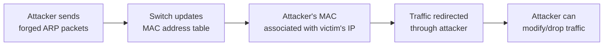
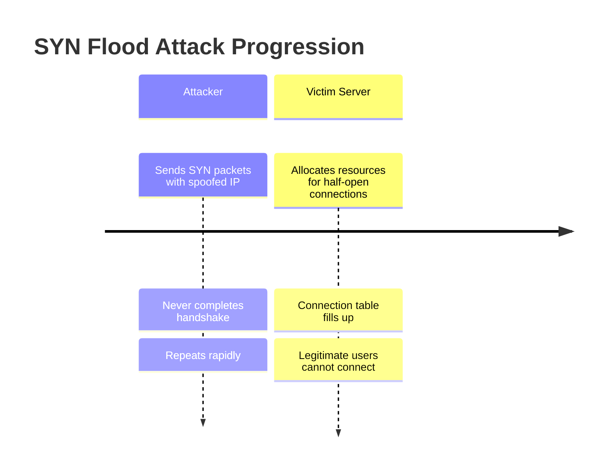
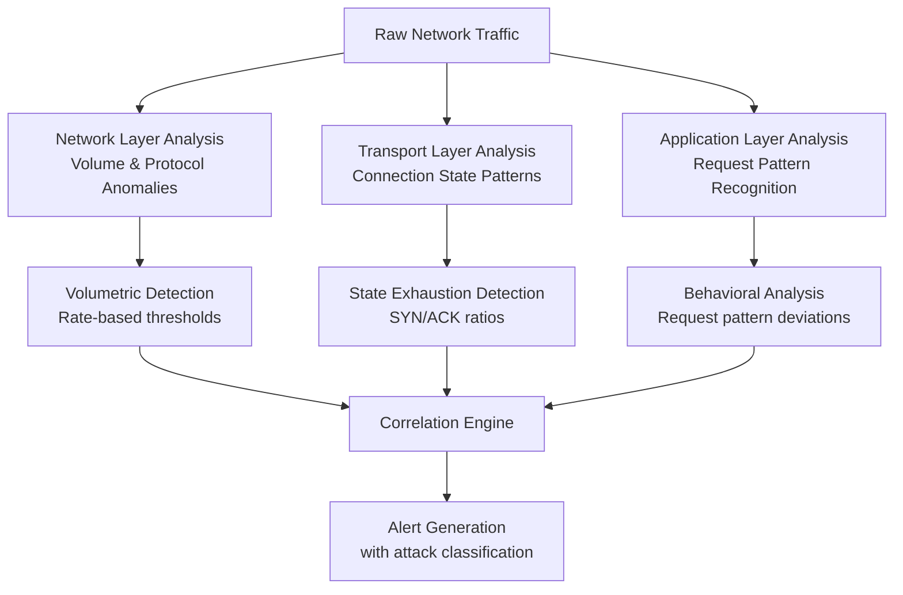
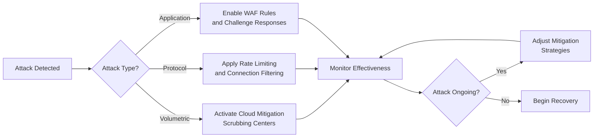
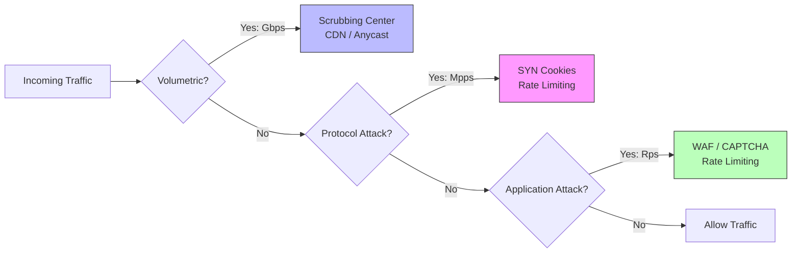

---
tags: [soc]
---
# 🛡️ Full-Stack Lesson: Denial of Service (DoS) & Distributed DoS (DDoS) Attacks

## TCM Exam Objectives

- Distinguish DoS from DDoS by source, scale, and mitigation complexity
- Classify DDoS attacks by OSI layer: volumetric (L3), protocol (L4), application (L7)
- Explain amplification techniques (DNS, NTP, Memcached) and their multiplication factors
- Describe mitigation strategies at each layer (scrubbing centers, SYN cookies, WAF)
- Identify attack types from traffic metrics: Gbps (volumetric), Mpps (protocol), Rps (application)
- Apply incident response playbook for DDoS: detection, containment, recovery

# 🛡️ Full-Stack Lesson: Denial of Service (DoS) & Distributed DoS (DDoS) Attacks

## 📚 1. Introduction: Foundational Concepts

### 1.1 What are DoS and DDoS Attacks?
A **Denial-of-Service (DoS) attack** is a malicious attempt to make a service unavailable to legitimate users by overwhelming it with traffic or exploiting vulnerabilities that cause it to crash or become unresponsive 【turn0search2】. The key characteristic is that a DoS attack originates from a **single source** (one IP address or device).

A **Distributed Denial-of-Service (DDoS) attack** amplifies this concept by using **multiple compromised systems** (often organized into a botnet) to attack a single target 【turn0search2】【turn0search5】. This distributed nature makes DDoS attacks significantly more powerful and harder to mitigate.

> 💡 **Key Distinction**: The fundamental difference lies in the **source of the attack**. DoS = one attacker, DDoS = many attackers (distributed) 【turn0search19】【turn0search20】.

📌 **Exam Tip:** Distinguish DDoS attacks by OSI layer AND measurement metric: Volumetric (L3) = Gbps, Protocol (L4) = Mpps (packets per second), Application (L7) = Rps (requests per second). On the exam, match the metric to the attack type.

### 1.2 The Evolution and Threat Landscape
DDoS attacks have grown dramatically in scale and sophistication over the years. By 2016, attacks exceeded **1 terabit per second** 【turn0search2】, and modern attacks often combine multiple vectors (volumetric, protocol, and application-layer) to maximize impact 【turn0search5】. The emergence of **IoT botnets** like Mirai has dramatically increased attack capabilities, allowing attackers to harness thousands of compromised devices.

## 🏗️ 2. The Full-Stack Anatomy: How Attacks Work at Each OSI Layer

### 2.1 Physical Layer (Layer 1)
While less common in remote attacks, physical-layer disruptions can include:
- **Cable cutting**: Physically severing network connections
- **Electromagnetic interference**: Disrupting signal transmission
- **Power outages**: Targeting datacenter power infrastructure

*Attack Complexity*: Low (requires physical access)
*Mitigation*: Physical security, redundant power, diverse cabling

### 2.2 Data Link Layer (Layer 2)
Attacks at this layer target local network infrastructure:
- **MAC flooding**: Overwhelming switch MAC tables
- **VLAN hopping**: Exploiting VLAN misconfigurations
- **ARP spoofing**: Redirecting traffic through attacker-controlled devices

### 2.3 Network Layer (Layer 3) - The Primary DDoS Battleground
Network-layer attacks aim to saturate bandwidth or exhaust router/ firewall resources 【turn0search10】. These are often called **volumetric attacks** and are measured in **bits per second (Bps)** 【turn0search5】.

#### Common Layer 3 Attack Vectors:
| Attack Type | Description | Mechanism |
|-------------|-------------|-----------|
| **UDP Flood** | Sends massive UDP packets to random ports | Victim's system checks for applications, wastes resources, and sends "destination unreachable" replies |
| **ICMP Flood** (Smurf Attack) | Overwhelms with ping requests | Uses spoofed broadcast addresses to amplify traffic |
| **Ping of Death** | Sends malformed or oversized packets | Exploits IP fragmentation vulnerabilities to crash systems |
| **Land Attack** | Sends spoofed packets with same source/destination IP | Confuses target's TCP/IP stack |

**Amplification Techniques**: Attackers use **reflection/amplification** to multiply traffic volume:
- **DNS Amplification**: Using open DNS resolvers to amplify responses (can amplify traffic 50-100x) 【turn0search5】
- **NTP Amplification**: Exploiting monlist command in NTP servers (amplification factor ~556x)
- **Memcached Amplification**: Exploiting exposed memcached servers (amplification factor up to 51,000x)

📌 **Exam Tip:** Memorize the amplification factors: DNS = 50-100x, NTP = ~556x, Memcached = up to 51,000x. Memcached has the highest amplification factor and is the most dangerous. The exam may ask which service provides the greatest amplification.

### 2.4 Transport Layer (Layer 4)
Transport-layer attacks target connection state and protocol weaknesses 【turn0search12】. These are measured in **packets per second (Pps)** 【turn0search5】.

#### Key Layer 4 Attack Mechanisms:

- **SYN Flood**: Exploits TCP handshake vulnerability by sending SYN requests without completing the handshake 【turn0search5】
- **Fragmentation Attacks**: Sends fragmented packets that overwhelm reassembly processes
- **ACK Flood**: Sends ACK packets to non-existent connections, causing target to reset connections
- **TCP State-Exhaustion**: Consumes firewall/load balancer state tables with connection attempts

### 2.5 Application Layer (Layer 7) - The Modern Frontier
Application-layer attacks target specific application functions or vulnerabilities, often using **seemingly legitimate requests** 【turn0search11】. These are measured in **requests per second (Rps)** 【turn0search5】.

#### Why Layer 7 Attacks Are Particularly Dangerous:
- **Low bandwidth, high impact**: Hard to detect with network monitoring
- **Mimic legitimate traffic**: Uses valid HTTP/HTTPS requests with proper headers 【turn0search11】
- **Target specific resources**: Focus on CPU/memory-intensive operations (logins, searches, database queries)
- **Bypass traditional defenses**: Often pass through firewalls and IPS devices

#### Common Layer 7 Attack Techniques:
| Attack Type | Target | Mechanism |
|-------------|--------|-----------|
| **HTTP Flood** | Web servers | Sends valid GET/POST requests that exhaust server resources |
| **Slowloris** | Web servers | Opens many connections and keeps them open with partial HTTP requests |
| **R.U.D.Y.** (Are You Dead Yet?) | Web forms | Submits long forms slowly to exhaust server processes |
| **Low and Slow** | Any application | Sends small, periodic packets to avoid detection while consuming resources |

🔧 Technical Deep Dive: Layer 7 Attack Mechanics

A Layer 7 attack typically follows this sequence:

1. **Target Selection**: Attackers choose resource-intensive endpoints (login pages, search functions, checkout processes) 【turn0search11】
2. **Botnet Activation**: Compromised devices generate requests that appear legitimate
3. **Request Mimicry**: Each request includes valid headers, cookies, and session tokens
4. **Resource Exhaustion**: Server allocates resources for each request, eventually running out of:
   - CPU cycles for processing
   - Memory for session storage
   - Database connections for query execution
   - Thread pools for request handling

The challenge lies in distinguishing between:
- **Legitimate users**: Making varied, sometimes slow requests
- **Attackers**: Making coordinated, pattern-based requests
- **Legitimate spikes**: From marketing campaigns or news events

## 🔍 3. Detection and Analysis Framework

### 3.1 Traffic Analysis Techniques
Effective detection requires multi-layered monitoring:

### 3.2 Key Detection Metrics
- **Volume-based**: Gbps (gigabits per second), Mpps (million packets per second)
- **Protocol-specific**: SYN/ACK packet ratios, connection establishment rates
- **Application-specific**: Requests per second, error rates, response time degradation
- **Behavioral**: Deviations from baseline traffic patterns, geographic anomalies

### 3.3 Challenges in Detection
- **False positives**: Legitimate traffic spikes (marketing campaigns, news events)
- **Low-and-slow attacks**: Gradual resource consumption below detection thresholds
- **Encrypted traffic**: TLS/SSL inspection requirements for Layer 7 detection
- **Distributed sources**: Difficulty correlating distributed low-volume attacks

## 🛡️ 4. Mitigation Strategies: A Multi-Layered Approach

### 4.1 Network Layer Mitigation (Layer 3)
#### Infrastructure Capacity Planning
- **Overprovisioning bandwidth**: Excess capacity absorbs volumetric attacks
- **Anycast networking**: Distributes traffic across multiple geographic locations
- **BGP community tagging**: Enables upstream filtering of attack traffic

#### Filtering Techniques
- **ACLs (Access Control Lists)**: Block traffic from known malicious IPs
- **Rate limiting**: Restricts traffic volume from specific sources
- **Blackholing**: Routing attack traffic to null interfaces (last resort)

#### Specialized Appliances
- **DDoS mitigation hardware**: FPGA-based devices for line-rate filtering
- **Scrubbing centers**: Redirect traffic through specialized cleaning centers 【turn0search16】

### 4.2 Transport Layer Mitigation (Layer 4)
#### TCP/IP Stack Hardening
- **SYN cookies**: Cryptographic protection against SYN floods
- **Connection tracking**: Stateful firewall rules to track legitimate connections
- **TCP intercept**: Proxy connections to validate legitimacy

#### Load Balancing and Distribution
- **Load balancers**: Distribute traffic across multiple servers
- **Connection pooling**: Reuse established connections for legitimate clients
- **Request rate limiting**: Cap connections per IP/time period

### 4.3 Application Layer Mitigation (Layer 7)
#### Web Application Firewalls (WAF)
- **Signature-based detection**: Block known attack patterns
- **Behavioral analysis**: Identify anomalous request patterns
- **Challenge-response**: CAPTCHA or JavaScript challenges for suspicious clients

#### Application Optimization
- **Caching**: Serve static content from cache to reduce server load
- **Content Delivery Networks (CDNs)**: Distribute content globally
- **Microservice architecture**: Isolate critical functions from resource-intensive operations

⚙️ Advanced Mitigation: Capability-Based Architecture

Emerging research proposes **capability-based network architectures** where routers use Physically Unclonable Functions (PUFs) to generate and verify capabilities 【turn0search9】. This approach:

1. **Destination-controlled traffic**: Recipients have complete control over incoming traffic
2. **Hardware-based verification**: Transient Effect Ring Oscillator PUFs generate unforgeable capabilities
3. **Reduced computational overhead**: Hardware-based capability generation is more efficient than cryptographic methods
4. **Simulation results**: Throughput remains nearly unaffected even when attack traffic varies from 10-80% of total traffic

This represents a paradigm shift from reactive filtering to proactive capability-based admission control.

## 🚨 5. Incident Response and Recovery

### 5.1 Preparation Phase
- **Develop incident response plans**: Specific procedures for DDoS events
- **Establish monitoring baselines**: Normal traffic patterns for anomaly detection
- **Create contact lists**: ISP, upstream providers, law enforcement contacts
- **Conduct tabletop exercises**: Practice response procedures with realistic scenarios

### 5.2 Identification and Analysis
- **Confirm attack**: Distinguish from legitimate traffic spikes
- **Classify attack type**: Volumetric, protocol, or application-layer
- **Assess impact**: Service degradation, complete outage, collateral damage
- **Identify attack sources**: Geographic distribution, botnet characteristics

### 5.3 Containment and Mitigation

### 5.4 Post-Incident Activities
- **Forensic analysis**: Determine attack vectors and effectiveness of mitigations
- **Documentation**: Record timeline, actions taken, lessons learned
- **System hardening**: Implement additional protections based on findings
- **Reporting**: Notify stakeholders, comply with regulatory requirements

## 🔮 6. Emerging Trends and Future Challenges

### 6.1 Attack Evolution
- **Multi-vector campaigns**: Simultaneous Layer 3/4/7 attacks 【turn0search5】
- **Advanced Persistent DoS (APDoS)**: Prolonged attacks lasting weeks 【turn0search2】
- **IoT botnet expansion**: Growing number of compromised devices
- **AI-driven attacks**: Machine learning for attack optimization and evasion

### 6.2 Defensive Innovations
- **AI-powered detection**: Behavioral analysis using machine learning
- **Edge computing**: Distributed mitigation at network edges
- **5G network slicing**: Isolated network segments for critical services
- **Quantum-resistant protocols**: Preparing for post-quantum cryptography

### 6.3 Regulatory and Compliance Landscape
- **Data breach notification laws**: DDoS as a precursor to data exfiltration
- **Critical infrastructure protection**: Sector-specific regulations
- **Cyber insurance requirements**: Mandating specific mitigation capabilities
- **International cooperation**: Cross-border attack attribution and response

## 📊 7. Comparative Analysis: DoS vs DDoS

| Aspect | DoS Attack | DDoS Attack |
|--------|------------|-------------|
| **Source** | Single IP/device 【turn0search19】 | Multiple distributed sources 【turn0search2】 |
| **Scale** | Limited by single connection bandwidth | Can exceed Tbps 【turn0search2】 |
| **Detection** | Relatively easy (identifiable source) | Difficult (distributed, mimics legitimate) |
| **Mitigation Complexity** | Straightforward (block single IP) | Complex (requires distributed filtering) |
| **Common Vectors** | All layers, but limited impact | Primarily volumetric and protocol attacks |
| **Typical Duration** | Short-term (hours) | Can be prolonged (days/weeks) |
| **Primary Motivation** | Testing, nuisance, targeted disruption | Extortion, competitive advantage, hacktivism |

📌 **Exam Tip:** Know the specific mitigation for each attack type: SYN flood → SYN cookies; volumetric DDoS → scrubbing centers / CDN / anycast; Layer 7 attacks → WAF + rate limiting + CAPTCHA. SYN cookies are cryptographic and don't consume state table entries.

## 🎯 8. Practical Implementation Guide

### 8.1 For Small Organizations
1. **Use CDN services**: Cloudflare, AWS CloudFront for basic protection
2. **Implement rate limiting**: On web servers and APIs
3. **Monitor traffic patterns**: Simple anomaly detection
4. **Develop response procedures**: Basic playbook for DDoS events

### 8.2 For Medium Enterprises
1. **Deploy WAF solutions**: Cloud-based or on-premises
2. **Implement network segmentation**: Isolate critical services
3. **Establish ISP relationships**: For upstream filtering during attacks
4. **Conduct regular vulnerability assessments**: Identify weaknesses

### 8.3 For Large Enterprises
1. **Multi-layered defense-in-depth**: On-premises appliances + cloud mitigation
2. **24/7 Security Operations Center**: Continuous monitoring and response
3. **Threat intelligence integration**: Real-time attack indicator sharing
4. **Red team exercises**: Test mitigation effectiveness regularly
5. **Business continuity planning**: Ensure critical functions during attacks

## 💎 Conclusion

Denial of Service and Distributed Denial of Service attacks represent significant threats to organizational availability, requiring a **multi-layered, defense-in-depth** approach that addresses vulnerabilities across the entire technology stack. From physical infrastructure to application logic, each layer presents unique attack vectors and requires specific mitigation strategies.

The evolution toward **distributed, multi-vector attacks** demands **adaptive, intelligent defense systems** that can distinguish between legitimate users and attackers while maintaining service availability. As attacks grow in sophistication and scale, organizations must adopt **proactive, intelligence-driven security postures** rather than reactive mitigation alone.

> ⚠️ **Final Note**: The most effective defense combines **technical controls** (network appliances, WAFs, monitoring), **operational procedures** (incident response, capacity planning), and **strategic partnerships** (ISPs, cloud providers, information sharing communities). No single solution provides complete protection—rather, effective DDoS resilience requires a **layered, adaptive approach** that evolves with the threat landscape.

Remember: **Availability is a security property**—protecting it requires the same diligence as confidentiality and integrity protections.