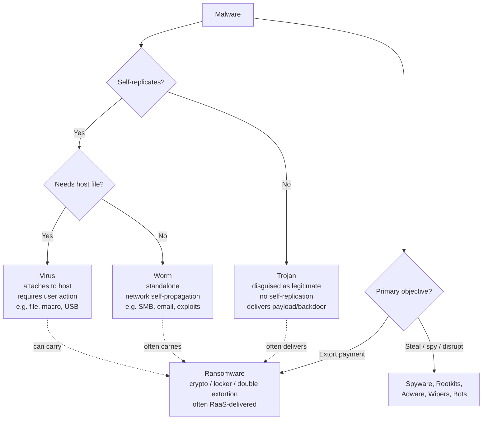
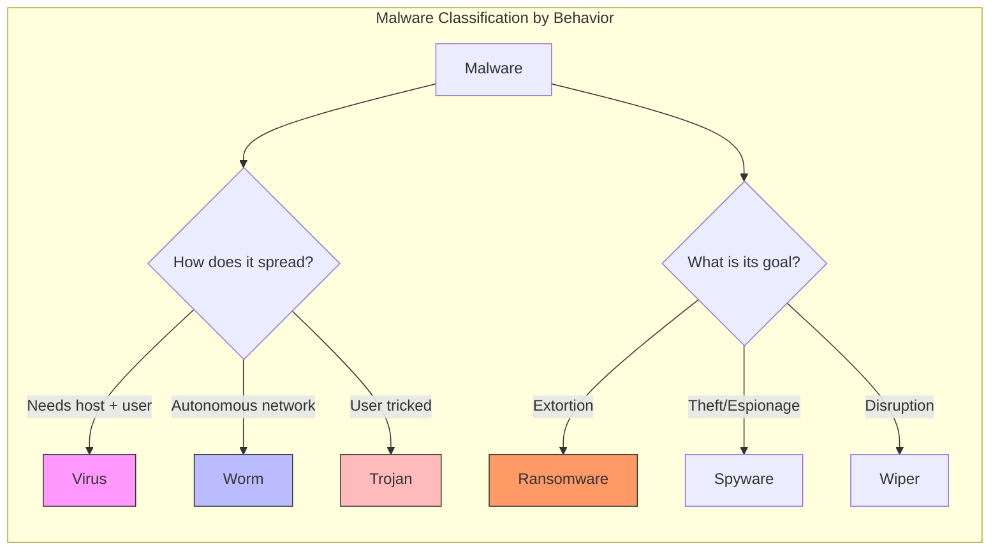

# Malware Types Viruses, Worms, Trojans, Ransomware

## TCM Exam Objectives

- Classify malware by propagation method (self-replicating vs. user-triggered) and payload objective
- Distinguish viruses, worms, trojans, and ransomware by behavior, spread mechanism, and detection approach
- Explain the ransomware kill chain: delivery, encryption, double extortion, and RaaS models
- Compare signature-based, heuristic, behavioral, and sandboxing detection methods
- Describe the SOC analyst's response playbook for each malware type
- Identify indicators of compromise (IOCs) for major malware families (Emotet, WannaCry, LockBit)

Malware is broadly classified by **how it propagates and what it does once executed** — viruses attach to host files and require user action to spread, worms self-replicate across networks without user intervention, trojans disguise themselves as legitimate software to trick users into installation (without self-replicating), and ransomware encrypts or locks victim data to extort payment, increasingly using double-extortion and RaaS models in 2025.【turn0search1】【turn0search2】【turn0search7】 Understanding these distinctions is foundational for SOC analysts because detection method, response playbook, and blast radius all depend on malware classification.

## Malware Family Taxonomy

The four core malware types differ along three axes: whether they self-replicate, whether they need a host file, and their primary payload objective. Modern threats increasingly blur these lines — WannaCry is ransomware that propagates like a worm, Emotet is a trojan with worm-like spreading capabilities, and NotPetya was ransomware in name only (a destructive wiper).【turn1search0】【turn1search9】

The dotted lines show the critical real-world overlap: trojans, worms, and viruses are all **delivery mechanisms** that frequently carry ransomware as their payload. This is why treating "ransomware" as a separate category from "trojan" misses the point — ransomware is *what the malware does*, while trojan/worm/virus describes *how it got there*.

## Master Comparison Table

| Dimension | Virus | Worm | Trojan | Ransomware |
|---|---|---|---|---|
| **Self-replicates** | Yes, by attaching to host files | Yes, standalone across networks | No — relies on user installation | Varies (some strains worm-like, most rely on other delivery) |
| **Needs host file** | Yes — inserts copy into legitimate programs | No — independent executable | No — standalone disguised app | No — standalone payload |
| **User action required** | Yes (execute infected file) | No — spreads automatically | Yes (tricked into running) | Usually yes (via trojan/worm/phishing delivery) |
| **Primary propagation** | File sharing, USB, email attachments | Network exploits, SMB, email, vulnerabilities | Phishing, fake downloads, software bundles | Phishing, RDP brute force, trojan/worm delivery, IAB access |
| **Primary objective** | Spread + payload (corrupt, display, etc.) | Rapid spread + payload (backdoor, DDoS, data theft) | Backdoor access, credential theft, malware delivery | Extort payment via encryption or lockout |
| **Network impact** | Low–medium (per host) | High (rapid lateral movement) | Medium (initial foothold) | High (encrypts across reachable shares) |
| **Detection challenge** | Signature works if not polymorphic | Network traffic anomalies, EDR behavioral | Heuristic/behavioral (no replication signature) | Behavioral (mass file encryption), EDR, decoy files |
| **Iconic examples** | CIH, Melissa, ILOVEYOU | Code Red, Nimda, Conficker, Stuxnet | Emotet, Zeus, TrickBot | WannaCry, NotPetya, LockBit, Conti, BlackCat |
| **Typical SOC response** | Isolate host, remove infected files, restore | Network segmentation, patch SMB, isolate subnet | Contain host, hunt for lateral movement, reset creds | Isolate, preserve evidence, assess backups, IR engagement |

Sources: 【turn0search0】【turn0search1】【turn0search2】【turn0search6】【turn0search7】

---

## Module 1 — Virus

A computer virus is malware that **propagates by inserting a copy of itself into other programs or files**, and requires some form of user action to initiate infection — executing an infected file, opening a malicious attachment, or running a file from an infected USB drive.【turn0search1】【turn0search6】

**How it works.** The virus attaches its malicious code to a legitimate host file (an executable, a document macro, a boot sector). When the user runs the host file, the virus code executes first, replicates by infecting other files on the system or removable media, and then typically hands control back to the original program so the user notices nothing. This dependence on a host file and user action is the defining distinction from worms.【turn0search1】【turn0search8】

**Propagation vectors.** Email attachments, infected USB drives, file-sharing networks, compromised software downloads, and malicious Office macros. Because viruses need execution, social engineering is usually part of the delivery — the file is named "invoice.pdf.exe" or the macro is embedded in a document that prompts the user to "Enable Content."

**Real-world examples.** Melissa (1999, Word macro virus that mass-mailed itself), ILOVEYOU (2000, VBScript that overwrote files and mailed itself to the victim's contacts), CIH/Chernobyl (1998, that overwrote critical system data). These are older threats, but the virus model persists in modern macro-based attacks and document-born malware.

**Why it matters for SOC analysts.** Viruses are typically caught by signature-based AV if the strain is known, but polymorphic variants (which mutate their code on each replication to evade signatures) require heuristic and behavioral detection. A virus outbreak on a file share can rapidly infect dozens of workstations that map that share, making file-server quarantine and host isolation the first response actions.

---

📌 **Exam Tip:** The key differentiator between virus and worm: viruses need a host file AND user action to spread; worms are standalone and spread autonomously across networks. On the exam, if the description says "self-replicates without user intervention" = worm. "Requires user to execute infected file" = virus.

## Module 2 — Worm

A worm is a sub-class of virus that **can travel independently without attaching to a host program** and spreads across networks without user action. Worms take advantage of file or information transport features on the system, allowing them to propagate unaided — and a single worm can send out hundreds or thousands of copies of itself, creating a huge devastating effect.【turn0search6】【turn0search8】

**How it works.** A worm is a standalone executable that, once running on a host, scans for vulnerable targets on the network (or internet), exploits a vulnerability to gain execution on the target, transfers a copy of itself, and repeats. The propagation is autonomous — no user clicks, no file execution required beyond the initial compromise. Worms typically exploit network services: SMB ( EternalBlue / CVE-2017-0144), RDP, web server vulnerabilities, or weak credentials.【turn1search5】【turn1search7】

**Real-world examples.**
- **WannaCry (2017)** — technically ransomware, but it spread as a worm using the EternalBlue SMB exploit, infecting 230,000+ computers across 150 countries in a single day and crippling the UK's NHS.【turn1search10】【turn1search11】【turn1search13】
- **NotPetya (2017)** — masqueraded as ransomware but was a destructive wiper with worm-like propagation via EternalBlue and Mimikatz credential theft; caused $10 billion+ in damage globally, hitting Maersk, FedEx, and Merck hardest.【turn1search6】【turn1search9】
- **Emotet** — originally a banking trojan, evolved worm-like capabilities to self-propagate via brute-forced credentials and SMB shares, becoming a major malware delivery platform.【turn1search0】【turn1search2】
- **Stuxnet (2010)** — a worm targeting Iranian nuclear centrifuges, spreading via USB and network shares to reach air-gapped systems.

**Why worms are uniquely dangerous.** Their autonomous network propagation means a single patient zero can compromise an entire segment within minutes, often before any alert fires. The empirical propagation studies of WannaCry and NotPetya show that EternalBlue-based worms can reach thousands of hosts within hours because each infected host becomes a new spreading vector.【turn1search7】 This is why **network segmentation, prompt patching of network-exposed vulnerabilities (especially SMB and RDP), and rapid EDR-driven host isolation** are the primary worm defenses. A SOC responding to a worm outbreak prioritizes containment of the spreading mechanism over individual host cleanup.
---

## Module 3 — Trojan

A Trojan horse is malware **disguised as legitimate or useful software** that tricks users into installing it. Unlike viruses and worms, it does not self-replicate — instead, it relies entirely on social engineering to get executed. Once inside, it can steal sensitive data, create backdoors, log keystrokes, exfiltrate data, or download additional malware.【turn0search7】【turn0search2】

**How it works.** The trojan is delivered as a seemingly useful app, installer, or document — a cracked game, a fake antivirus, a "shipping invoice" attachment, a software update. Once the user executes it, the trojan establishes persistence (registry run keys, scheduled tasks, services), opens a backdoor (reverse shell, C2 beacon), and begins its malicious activity: credential harvesting, keylogging, screen capture, or downloading a second-stage payload like ransomware.【turn0search7】【turn1search1】

**The trojan as a delivery platform.** Modern trojans are less often the end payload and more often the **initial access mechanism** that delivers other malware. Emotet is the canonical example: it began as a banking trojan stealing financial credentials in 2014, then evolved into a global malware delivery service, using its worm-like spreading capabilities to build a botnet that sold access to other threat actors who used it to deploy TrickBot, Ryuk, and Conti ransomware.【turn1search0】【turn1search1】【turn1search2】 CISA's advisory on Emotet documents its use of phishing attachments (T1566.001), credential brute-forcing (T1110.001), and SMB/Windows Admin Shares (T1021.002) for lateral movement.【turn1search2】

**Real-world examples.**
- **Emotet** — banking trojan turned malware delivery platform, taken down in 2021 but repeatedly resurfacing
- **Zeus** — banking trojan stealing credentials via keystroke logging and form grabbing
- **TrickBot** — modular trojan that evolved into a banking credential thief, lateral movement tool, and ransomware delivery vector
- **Remote Access Trojans (RATs)** — DarkComet, njRAT, Quasar — provide attackers full interactive remote control

**Why trojans evade detection.** Because they don't self-replicate, there's no spreading behavior to flag — a trojan sitting on one host looks like a legitimate process making outbound connections. Detection relies on **heuristic analysis (suspicious process behavior, unusual network destinations), behavioral monitoring (EDR catching credential access, persistence mechanisms), and sandboxing** (detonating suspicious files in isolated environments to observe actions).【turn0search14】【turn0search15】【turn1search19】 Evasion techniques are advanced — Emotet detects virtual machines and sandbox environments and remains dormant to avoid analysis.【turn1search1】

---

📌 **Exam Tip:** WannaCry is the most commonly cited ransomware example on exams. Know it propagated as a **worm** using EternalBlue (SMB exploit). NotPetya was actually a **wiper** disguised as ransomware (destructive, irreversible). Double extortion = encryption + data theft + leak threat. RaaS = Ransomware-as-a-Service (affiliate model).

## Module 4 — Ransomware

Ransomware is malware that **encrypts a victim's files or locks them out of their device and demands a ransom payment** to restore access. While early ransomware simply locked the screen, modern variants use cryptoviral extortion — encrypting files with strong asymmetric cryptography so that decryption without the attacker's private key is computationally infeasible.【turn0search1】【turn0search3】

**Types of ransomware:**
- **Crypto ransomware** — encrypts files (documents, databases, photos) using AES/RSA; the victim pays for the decryption key. Example: LockBit, BlackCat/ALPHV.
- **Locker ransomware** — locks the entire system or screen, preventing access but not encrypting files; often easier to remediate. Example: early Winlocker variants.
- **Double extortion** — encrypts files *and* exfiltrates data first, threatening to publish it on a leak site if the ransom isn't paid. This is the dominant model in 2025 — victims face both operational disruption and data breach exposure even if they have backups.【turn0search10】【turn2search5】【turn2search6】
- **Ransomware-as-a-Service (RaaS)** — the ransomware developer licenses the payload to affiliates who conduct the attacks and split the proceeds. This professionalized model lowered the barrier to entry and is overwhelmingly favored by top threat actors in 2025.【turn2search5】【turn2search7】
- **Wiper disguised as ransomware** — NotPetya is the canonical example: it displayed a ransom note but the encryption was destructive and irreversible, making it a geopolitical weapon rather than a profit-driven attack.【turn1search6】【turn1search9】

**How ransomware gets in.** Phishing emails (trojan delivery), exposed RDP services brute-forced by attackers, exploitation of perimeter vulnerabilities (VPN appliances, firewalls), stolen credentials purchased from Initial Access Brokers (IABs), and supply chain compromises. The 2025 trends show phishing and RDP exploitation remain the dominant initial access vectors, with IAB forums providing the first point of entry for many ransomware compromises.【turn2search5】【turn2search7】

**Real-world examples.**
- **WannaCry (2017)** — worm-propagated crypto ransomware using EternalBlue; 230,000+ systems in 150 countries; NHS crippled.【turn1search10】【turn1search11】
- **NotPetya (2017)** — wiper disguised as ransomware; $10B+ global damage via Maersk, FedEx, Merck.【turn1search9】
- **LockBit** — dominant RaaS operation through 2023-2024, taken down by Operation Cronos in early 2024 but resurfacing
- **BlackCat/ALPHV** — sophisticated RaaS using Rust, double extortion, targeted healthcare and critical infrastructure
- **Conti, Royal, BlackBasta, Akira, Cicada3301, DragonForce** — active RaaS brands in 2024-2025, with affiliate churn and group rebranding as a persistent pattern【turn2search7】

**2025-2026 trends.** RaaS and double extortion dominate; leak sites publish victim data routinely; affiliates migrate between cartels; groups relax entry requirements to recruit lower-skilled operators (DragonForce, Cicada3301); supply chain attacks amplify blast radius; and critical infrastructure (healthcare, finance, industrial/OT) remains the prime target. Average recovery costs hit $2.73 million in 2025, a 50% jump year-over-year, with 59% of organizations reporting ransomware hits.【turn2search5】【turn2search6】【turn2search7】【turn0search10】

---

## Module 5 — Detection & Defense Stack

Because no single malware type has a single detection method, mature SOCs layer multiple detection techniques — each catching what the others miss.

**Signature-based detection.** Matches files against a database of known malware hashes and byte patterns. Fast, low false-positive rate, and effective against known threats — but **fundamentally handicapped against polymorphic and metamorphic malware** that changes its code on each replication. Conventional signature methods will fail against any new variant or zero-day.【turn1search15】【turn1search18】【turn0search14】

**Heuristic analysis.** Uses rules and algorithms to scan code for commands that indicate malicious intent without needing a known signature — for example, a program that attempts to write to the boot sector, modify the registry run keys, or open a reverse shell. Heuristics can detect new malware variants but may produce more false positives than signature-based detection, and they're faster than sandboxing because they don't execute the file.【turn0search14】【turn0search17】【turn1search16】

**Behavioral analysis.** Monitors what a file *does* at runtime — file modifications, registry changes, network connections, process injection, credential access — rather than what it *is*. This is the primary defense against fileless malware, trojans, and polymorphic threats because the behavior is hard to disguise even when the code changes. EDR platforms are built around behavioral detection.【turn1search19】【turn2search2】

**Sandboxing.** Executes suspicious files in an isolated virtual environment (replicating a standard OS) and observes their behavior — file modifications, network connections, system setting changes — without risking production systems. Sandboxing catches zero-day and polymorphic threats by their actions, but sophisticated malware detects sandbox environments (checking for VM artifacts, user interaction, specific registry keys) and remains dormant to evade analysis — Emotet is a documented example.【turn0search15】【turn1search1】

**Polymorphic and metamorphic evasion.** Polymorphic malware continuously changes its code or appearance each time it spreads while keeping the core malicious functionality intact, bypassing signature-based systems. Metamorphic viruses go further — they **rewrite their entire codebase** with each generation, making them even harder to detect. Defense requires behavior-based analysis, sandboxing, machine learning models trained on variant patterns, and memory forensics to find consistent traces.【turn1search15】【turn1search18】【turn1search19】

**Defense in depth.** A layered strategy deploying multiple controls so that if one layer fails, the next one catches the attack — originating from NSA military doctrine and now the NIST-defined standard for malware defense. The layers include: firewalls and network segmentation, email security (phishing blocking), endpoint protection (EDR with signature + heuristic + behavioral), patch management (closing the vulnerabilities worms exploit), identity and access management (MFA, least privilege), immutable/offline backups (the ultimate ransomware recovery), and user security awareness training.【turn2search10】【turn2search11】【turn2search13】

---

📌 **Exam Tip:** Know the SOC response order per malware type: worm = isolate subnet first (network containment), virus = quarantine file shares, trojan = rotate credentials + hunt lateral movement, ransomware = isolate host + preserve evidence + assess backups. Containment priority differs because worm spreads fastest.

## Module 6 — The SOC Analyst's Role in Malware Identification & Response

When a malware alert fires, the SOC analyst's job moves through a predictable workflow that maps to the IR lifecycle: triage → identification → containment → investigation → escalation or resolution.

**Triage (Tier 1).** An EDR alert fires — say, a process attempting mass file encryption. The Tier 1 analyst reviews the alert in the EDR console, examines the parent process tree, checks the file hash against threat intelligence (is this a known ransomware family?), and decides: false positive (close), true positive requiring containment, or needs deeper investigation (escalate to Tier 2). The EDR is the primary tool here because it provides the forensic timeline — process executions, file operations, network connections, registry modifications — that lets the analyst reconstruct what happened.【turn2search2】

**Identification.** What malware type is this? The behavior tells you: mass file encryption with a ransom note = ransomware; autonomous SMB scanning and exploitation = worm; a process beaconing to a C2 with no replication = trojan/RAT; file infection across the file share = virus. Correct classification drives the response playbook — a worm requires network containment, a trojan requires credential rotation and lateral movement hunting, ransomware requires backup assessment and possibly IR team engagement.

**Containment.** EDR host isolation is the first move —切断 the infected host from the network to stop spreading (critical for worms and ransomware) while preserving the host for forensic analysis. For worm outbreaks, the SOC may need to isolate entire subnets or block SMB/RDP traffic at the firewall. SOAR playbooks automate this: a confirmed ransomware detection triggers automatic host isolation, credential reset, and malicious IP/domain blocking without waiting for analyst action.【turn2search0】【turn2search1】

**Investigation (Tier 2/3).** Map the scope: what other hosts are compromised? What data was exfiltrated (critical for double-extortion ransomware)? What was the initial access vector? This requires correlating EDR telemetry with SIEM logs, querying the TIP for related IOCs, and possibly running memory forensics (Volatility, Velociraptor) to capture volatile evidence before the host is wiped.【turn1search19】

**Evidence preservation.** Before any eradication, capture volatile evidence in order of volatility — memory first (running processes, network connections, injected code, encryption keys), then disk images. For ransomware, this preserves the encryption keys and C2 communications that may enable decryption or attribution. Chain of custody matters if legal follow-up is possible.

**Response playbook by malware type:**
- **Virus outbreak** → quarantine file shares, isolate infected hosts, run AV scans across the segment, restore clean files from backup
- **Worm** → isolate subnets, patch the exploited vulnerability network-wide, block the spreading protocol at the firewall, hunt for all compromised hosts
- **Trojan/RAT** → isolate host, rotate all credentials the user had access to, hunt for lateral movement (the trojan has been there a while), check for data exfiltration, rebuild the host
- **Ransomware** → isolate immediately, preserve evidence, assess backup integrity, engage IR team if double-extortion, notify legal/comms for breach disclosure, do *not* pay without legal and government guidance

---

## The Throughline

These four malware types are not just academic categories — they determine **how fast the threat spreads, how you detect it, what your first response move is, and what your recovery looks like**. A SOC that treats all malware the same will be too slow on worms (which spread in minutes), too noisy on trojans (which don't replicate and need behavioral detection), and too passive on ransomware (which needs immediate isolation and backup assessment). The mature SOC layers detection methods — signature for the known, heuristic for the suspicious, behavioral for the evasive, sandbox for the unknown — and maps each malware type to a specific response playbook, with the IR lifecycle (preparation, detection & analysis, containment/eradication/recovery, post-incident) as the connective tissue. In 2025, the dominant pattern is convergence: trojans deliver ransomware, worms propagate ransomware, and RaaS professionalizes the entire kill chain — which means defenders must be fluent in all four categories simultaneously, not just one.