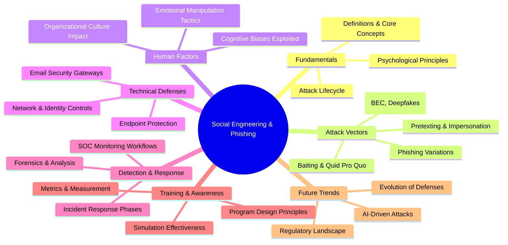
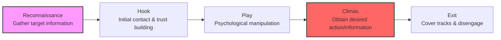
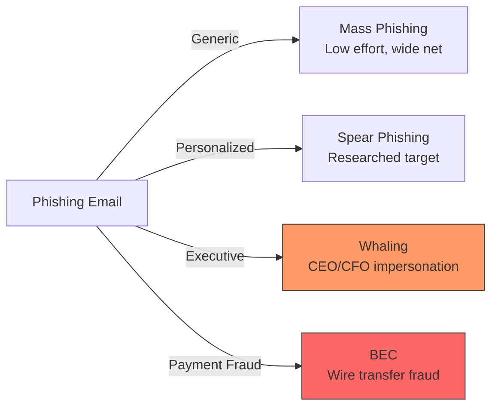
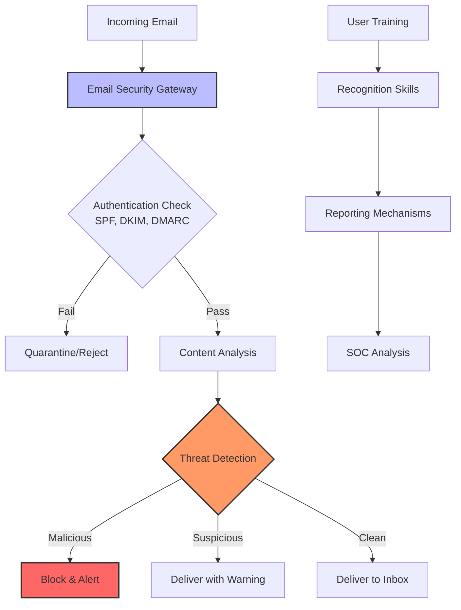
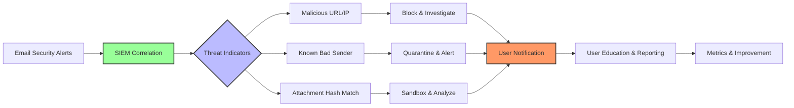
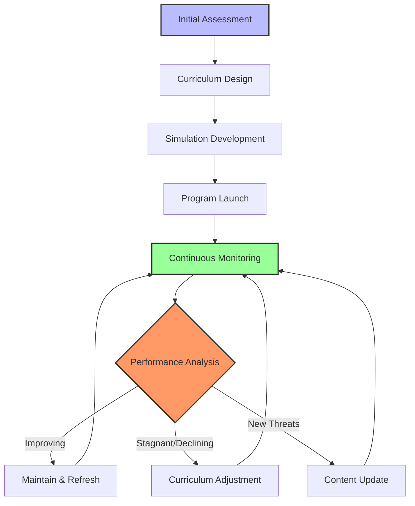

---
tags: [soc]
---
# 🎣 Full-Stack Lesson: Social Engineering & Phishing - Understanding, Defending, and Responding

## TCM Exam Objectives

- Identify the five phases of the social engineering attack lifecycle (Reconnaissance → Hook → Play → Climax → Exit)
- Distinguish phishing, spear phishing, whaling, smishing, vishing, and BEC by target and method
- Explain psychological principles exploited in social engineering (authority, urgency, scarcity, social proof)
- Describe email authentication controls: SPF, DKIM, and DMARC
- Plan a phishing simulation program with key metrics (report rate, dwell time, repeat offender rate)
- Apply SOC detection workflows for user-reported phishing and automated email security alerts

# 🎣 Full-Stack Lesson: Social Engineering & Phishing - Understanding, Defending, and Responding

## 🗺️ Lesson Overview: The Human Factor in Cybersecurity

Social engineering represents the **art of human manipulation** in cybersecurity, where attackers exploit psychological principles rather than technical vulnerabilities to gain access to systems, data, or physical spaces 【turn0search1】. Phishing, a subset of social engineering, specifically uses fraudulent communications to trick individuals into revealing sensitive information or executing malicious actions.

> 💡 **Key Insight**: Unlike technical attacks that exploit software vulnerabilities, social engineering attacks target the **human operating system**—our psychology, emotions, and social behaviors. According to CISA, being suspicious of unsolicited contacts and not revealing personal information are fundamental defenses 【turn0search0】.

## 1. 🧠 Fundamentals: The Psychology of Manipulation

📌 **Exam Tip:** Memorize the six psychological principles exploited in social engineering: Authority, Intimidation, Consensus/Social Proof, Scarcity, Urgency, Familiarity/Trust. The exam often gives a scenario and asks which principle is being exploited (e.g., "Act now or your account will be closed" = Urgency/Scarcity).

### 1.1 Core Principles of Social Engineering

Social engineering succeeds by exploiting fundamental **cognitive biases** and **emotional triggers** that affect human decision-making:

| Psychological Principle | Attack Application | Defense Strategy |
|-------------------------|-------------------|------------------|
| **Authority** | Impersonating executives or IT staff | Verify identity through independent channels |
| **Intimidation** | Threatening consequences for non-compliance | Pause and verify through official procedures |
| **Consensus/Social Proof** | "Others have already complied" | Check with colleagues or supervisors |
| **Scarcity** | "Limited time offer" or "Last chance" | Take time to evaluate, don't rush |
| **Urgency** | "Account will be closed in 24 hours" | Be suspicious of artificial time pressure |
| **Familiarity/Trust** | Using known brands or personal details | Verify through alternative communication methods |

### 1.2 The Social Engineering Attack Lifecycle

**Detailed Phase Breakdown**:

🔍 Detailed Attack Phase Analysis

#### **Phase 1: Reconnaissance**
- **Information Gathering**: Social media profiling, company website analysis, public records review
- **Target Selection**: Identifying high-value targets (executives, finance staff, IT administrators)
- **Infrastructure Preparation**: Creating convincing domains, email addresses, phone numbers

#### **Phase 2: Hook**
- **Initial Contact**: Email, phone call, text message, or in-person approach
- **Trust Building**: Using personal details to appear legitimate
- **Pretext Development**: Creating a believable scenario (e.g., "IT support calling about a virus")

#### **Phase 3: Play**
- **Psychological Manipulation**: Applying pressure, creating urgency, invoking authority
- **Objection Handling**: Anticipating and countering questions or hesitation
- **Escalation**: Increasing pressure or expanding the scenario

#### **Phase 4: Climax**
- **Action Elicitation**: Requesting sensitive information, money transfer, or system access
- **Commitment Extraction**: Getting the target to agree to the request
- **Execution**: Completing the fraudulent transaction or obtaining credentials

#### **Phase 5: Exit**
- **Evidence Removal**: Deleting emails, texts, or other communications
- **Discovery Delay**: Tactics to prevent immediate detection
- **Future Preparation**: Setting up for additional attacks or maintaining access

## 2. 🎯 Attack Vectors: From Phishing to Advanced Techniques

📌 **Exam Tip:** Distinguish phishing variations: Mass phishing = generic email to many; Spear phishing = targeted at specific individual; Whaling = targets executives/C-suite; Smishing = SMS text; Vishing = voice call; BEC = impersonates executive for wire transfer fraud. BEC causes the highest financial losses.

### 2.1 Phishing Variations & Evolution

| Attack Type | Target | Method | Detection Difficulty | Impact Potential |
|-------------|--------|--------|---------------------|------------------|
| **Mass Phishing** | General public | Generic emails casting wide net | Low | Medium |
| **Spear Phishing** | Specific individuals/orgs | Personalized emails using gathered info | Medium | High |
| **Whaling** | High-profile executives | CEO/CFO impersonation | High | Very High |
| **Smishing** | Mobile users | SMS/text message phishing | Medium | Medium |
| **Vishing** | Phone targets | Voice call phishing | High | High |
| **Business Email Compromise (BEC)** | Organizations | Executive impersonation for wire transfers | Very High | Extremely High 【turn0search22】 |

### 2.2 Advanced Attack Techniques

⚔️ Deep Dive: Advanced Social Engineering Attacks

#### **Business Email Compromise (BEC)**
BEC represents one of the most financially damaging attack types, where cybercriminals impersonate executives or trusted partners to trick employees into transferring funds or sensitive data 【turn0search22】【turn0search23】. Common BEC scenarios include:
- **CEO Fraud**: Impersonating the CEO requesting urgent wire transfers
- **Account Compromise**: Compromising legitimate executive email accounts
- **Attorney Impersonation**: Posing as legal counsel handling confidential matters
- **Data Theft**: Requesting W-2 forms or other sensitive employee data

#### **Deepfake Phishing**
Emerging AI technology enables **synthetic media manipulation** where attackers create convincing audio or video impersonations of executives 【turn0search21】. These deepfakes can be used in vishing attacks or video messages to:
- Authorize fraudulent transactions
- Provide false instructions to employees
- Create compromising material for extortion

#### **Pretexting Scenarios**
Attackers create elaborate fictional scenarios to obtain information:
- **IT Support Pretext**: Claiming to need credentials for system maintenance
- **Delivery Pretext**: Impersonating delivery services for package deliveries
- **Survey Pretext**: Conducting fake surveys to gather organizational information
- **Romance Pretext**: Building romantic relationships for long-term manipulation

#### **Multi-Channel Attacks**
Modern attacks often combine multiple vectors:
- **Email + Phone**: Initial email followed by "verification" call
- **Social Media + Email**: Using LinkedIn information to craft targeted emails
- **In-Person + Digital**: Physical access attempts combined with electronic surveillance

## 3. 🛡️ Technical Defenses: A Layered Approach

### 3.1 Email Security Architecture

📌 **Exam Tip:** Know the email authentication triad: SPF (sender policy framework — which IPs can send), DKIM (digital signature on email), DMARC (policy for unauthenticated email — reject/quarantine/none). DMARC = policy layer on top of SPF + DKIM.

**Key Technical Controls**:

| Defense Layer | Implementation | Effectiveness | Maintenance |
|--------------|----------------|---------------|-------------|
| **Email Authentication** | SPF, DKIM, DMARC records | High for domain spoofing | Low - initial setup |
| **Advanced Threat Protection** | AI-based email scanning | Medium-High | Medium - regular tuning |
| **URL Rewriting & Sandboxing** | Link analysis at click time | High for known malicious URLs | High - requires infrastructure |
| **Attachment Detonation** | Sandbox analysis of attachments | Medium-High | High - resource intensive |
| **Internal Email Protection** | Scanning internal mail flow | Medium (lateral movement) | Medium - configuration |

### 3.2 Endpoint & Network Protections

⚙️ Technical Control Implementation Details

#### **Endpoint Detection and Response (EDR)**
Modern EDR solutions provide critical capabilities for detecting social engineering attacks:
- **Process Monitoring**: Detecting credential dumping tools or unusual PowerShell execution
- **Script Logging**: Recording malicious scripts that may be delivered via phishing
- **Network Connection Monitoring**: Identifying command-and-control communications
- **File Analysis**: Detecting malicious attachments or downloaded payloads

#### **Network Security Controls**
- **DNS Filtering**: Blocking known malicious domains
- **SSL Inspection**: Decrypting and inspecting encrypted traffic
- **Network Segmentation**: Limiting lateral movement if compromise occurs
- **Behavioral Analytics**: Detecting unusual access patterns

#### **Identity and Access Management**
- **Multi-Factor Authentication (MFA)**: Critical defense against credential theft
- **Conditional Access**: Risk-based authentication requiring additional verification
- **Privileged Access Management**: Just-in-time access for administrative accounts
- **Passwordless Authentication**: Eliminating passwords as an attack vector

#### **Security Information and Event Management (SIEM)**
Centralized logging and analysis enables detection of:
- **Multiple Failed Logins**: Potential brute force or password spraying
- **Geographically Impossible Logins**: Impossible travel scenarios
- **Anomalous Email Patterns**: Unusual sending patterns or recipients
- **File Access Anomalies**: Mass file access or data exfiltration attempts

## 4. 👁️ Detection & Response: SOC Workflows

### 4.1 Phishing Detection in SOC Operations

SOC teams employ **correlated analysis** across multiple data sources to detect phishing attacks effectively 【turn0search6】. The key workflow involves:

### 4.2 Incident Response Lifecycle

🚨 Comprehensive Incident Response Framework

#### **Phase 1: Preparation**
- **Playbook Development**: Create specific phishing response procedures
- **Team Training**: Regular tabletop exercises and simulations
- **Tool Deployment**: SIEM, SOAR, and forensic analysis tools
- **Communication Templates**: Pre-drafted internal and external notifications

#### **Phase 2: Identification & Triage**
- **Alert Sources**: Email security, user reports, SIEM correlations
- **Severity Assessment**: Based on target, sender, and payload analysis
- **Scope Determination**: Number of recipients, potential impact
- **Initial Containment**: Disable malicious links, quarantine emails

#### **Phase 3: Containment**
- **Technical Containment**:
  - Block malicious domains and IPs
  - Reset compromised credentials
  - Disable malicious accounts
  - Isolate affected endpoints
- **User Communication**: Notification without tipping off attackers

#### **Phase 4: Eradication**
- **Email Removal**: Delete phishing emails from all mailboxes
- **Malware Removal**: Clean affected systems and restore from clean backups
- **Vulnerability Patching**: Address exploited vulnerabilities
- **Account Recovery**: Secure and validate all affected accounts

#### **Phase 5: Recovery**
- **System Restoration**: Return systems to normal operation
- **Monitoring**: Enhanced monitoring for related activity
- **User Support**: Assistance for affected users
- **Validation**: Confirm eradication and system integrity

#### **Phase 6: Lessons Learned**
- **Post-Incident Review**: Analyze response effectiveness
- **Metrics Analysis**: Measure response times and effectiveness
- **Control Improvement**: Update defenses based on findings
- **Training Updates**: Enhance user training with real examples

## 5. 🎓 Training & Awareness: Building Human Firewalls

### 5.1 Effective Training Program Design

> ⚠️ **Critical Insight**: Traditional annual training is insufficient. Effective security awareness requires **continuous, adaptive programs** that evolve with threats 【turn0search3】【turn0search11】.

**Program Design Principles**:

| Principle | Implementation | Measurement |
|-----------|----------------|-------------|
| **Realism** | Use current, relevant attack scenarios | Simulation engagement rates |
| **Frequency** | Regular, brief training modules | Completion and retention rates |
| **Relevance** | Tailored to roles and risk levels | Role-based simulation performance |
| **Interactivity** | Hands-on exercises and decision-making | Behavior change in simulations |
| **Feedback** | Immediate, constructive feedback | Reporting and improvement trends |

### 5.2 Phishing Simulation Programs

📊 Advanced Simulation Metrics & Analysis

#### **Beyond Click Rates: Comprehensive Metrics**
While click rates provide a basic measure, they don't capture the full picture of organizational resilience. Effective programs measure 【turn0search14】【turn0search15】:

1. **Reporting Rate**: Percentage of users who report suspicious emails
   - **Target**: > 40% of users actively report
   - **Measurement**: Reports per simulation vs. total emails sent

2. **Dwell Time**: Time from email delivery to report
   - **Target**: < 2 hours average
   - **Measurement**: Timestamp difference between delivery and report

3. **Repeat Offender Rate**: Percentage of users who fail multiple simulations
   - **Target**: < 10% after training interventions
   - **Measurement**: Tracking individual failure patterns

4. **Role-Based Risk Assessment**: Failure rates by department/seniority
   - **Target**: Identify high-risk groups for targeted training
   - **Measurement**: Comparative analysis across organizational units

5. **Behavioral Change**: Improvement over time
   - **Target**: 50% reduction in failure rates over 6 months
   - **Measurement**: Trend analysis of simulation results

#### **Simulation Design Elements**
- **Scenario Variety**: Different attack types (phishing, spear phishing, BEC)
- **Difficulty Progression**: From obvious to sophisticated attacks
- **Contextual Relevance**: Using current events and organizational context
- **Feedback Mechanisms**: Immediate, educational feedback for all actions
- **Adaptive Difficulty**: Adjusting based on organizational performance

### 5.3 Training Program Implementation

## 6. 📊 Metrics & Measurement: Quantifying Human Risk

### 6.1 Key Performance Indicators

📈 Comprehensive Metrics Framework

#### **Leading Indicators (Predictive)**
- **Training Engagement**: Module completion rates and assessment scores
- **Simulation Performance**: Click rates and reporting rates over time
- **Culture Assessment**: Employee perceptions of security importance
- **Knowledge Retention**: Pre- and post-training assessments

#### **Lagging Indicators (Outcome)**
- **Phishing Success Rate**: Successful attacks per 1000 employees
- **Incident Severity**: Financial and operational impact of successful attacks
- **Time to Detection**: How quickly phishing is identified and reported
- **Time to Remediation**: Speed of containing and eradicating threats

#### **Advanced Risk Metrics**
- **Human Risk Index**: Composite score based on multiple factors
- **Departmental Risk Heatmap**: Visual representation of organizational risk
- **Behavioral Analytics**: Changes in employee behavior over time
- **Cost per Incident**: Total cost of phishing incidents including response

#### **Benchmarking Metrics**
- **Industry Comparisons**: Performance against peer organizations
- **Historical Trends**: Year-over-year improvement measurement
- **Threat Landscape Alignment**: Training relevance to current threats
- **ROI Calculation**: Value of prevented incidents vs. program costs

### 6.2 Program ROI Measurement

**Calculation Framework**:
1. **Cost Avoidance**: (Expected incidents × Average cost) - Actual incidents cost
2. **Productivity Savings**: Time saved through reduced incidents
3. **Insurance Premium Reductions**: Lower premiums due to reduced risk
4. **Regulatory Compliance**: Avoided fines and penalties

> 💡 **Industry Benchmark**: Organizations with mature programs typically see **$2.50-$5.00** returned for every dollar invested in security awareness 【turn0search3】.

## 7. 🔮 Future Trends & Emerging Threats

### 7.1 Evolution of Social Engineering

| Trend | Current State | 2026 Projection | Defense Implications |
|-------|---------------|------------------|---------------------|
| **AI-Powered Attacks** | Early adoption | Widespread use | Need for AI-detection tools |
| **Deepfake Technology** | Experimental | Production quality | Audio/video verification |
| **Personalization Scale** | Manual research | Automated at scale | Behavioral analysis critical |
| **Multi-Channel Orchestration** | Sequential attacks | Simultaneous across channels | Unified threat visibility |
| **Insider Threat Convergence** | Separate concerns | Social engineering enabling insiders | Integrated monitoring |

### 7.2 Defense Evolution

🚀 Next-Generation Defense Technologies

#### **AI-Driven Defense Systems**
- **Behavioral Biometrics**: Continuous authentication based on typing patterns, mouse movements
- **Predictive Analytics**: Anticipating attack patterns based on organizational behavior
- **Natural Language Processing**: Real-time analysis of communication patterns for anomalies
- **Automated Response**: SOAR playbooks that adapt based on attack characteristics

#### **Zero Trust Architecture Evolution**
- **Identity-Centric Security**: Continuous verification of all users and devices
- **Microsegmentation**: Limiting lateral movement through granular access controls
- **Risk-Based Authentication**: Dynamic authentication requirements based on context
- **Encrypted Everything**: Protecting data in transit and at rest with strong encryption

#### **Human-Centric Security**
- **Security Culture Programs**: Building security into organizational DNA
- **Psychological Safety**: Encouraging reporting without fear of punishment
- **Cognitive Security Training**: Building mental models for threat recognition
- **Stress Testing**: Realistic simulations under various conditions

#### **Regulatory & Compliance Evolution**
- **Mandatory Breach Notification**: Standardized reporting requirements
- **Security Awareness Regulations**: Minimum training standards
- **Liability Frameworks**: Clear responsibility for breaches
- **International Cooperation**: Cross-border threat intelligence sharing

## 8. 📋 Implementation Checklist & Best Practices

✅ Comprehensive Implementation Checklist

#### **Foundation (0-3 Months)**
- [ ] Conduct baseline phishing assessment
- [ ] Establish security awareness team
- [ ] Deploy basic email authentication (SPF, DKIM, DMARC)
- [ ] Implement reporting button in email clients
- [ ] Develop initial incident response playbook
- [ ] Launch basic training program for all employees

#### **Development (3-6 Months)**
- [ ] Implement regular phishing simulations
- [ ] Deploy advanced email security gateway
- [ ] Establish metrics and measurement framework
- [ ] Conduct role-based training for high-risk groups
- [ ] Integrate with SIEM for centralized monitoring
- [ ] Develop executive protection program

#### **Maturity (6-12 Months)**
- [ ] Implement adaptive training based on simulation results
- [ ] Deploy SOAR for automated response
- [ ] Conduct red team exercises including social engineering
- [ ] Establish vendor risk management program
- [ ] Implement continuous improvement process
- [ ] Achieve measurable reduction in human risk

#### **Advanced (12+ Months)**
- [ ] Deploy AI-powered detection and response
- [ ] Implement behavioral analytics
- [ ] Establish threat intelligence program
- [ ] Conduct regular security culture assessments
- [ ] Achieve industry-recognized certifications
- [ ] Share lessons learned with industry community

## 9. 🎯 Conclusion: Building Resilient Human Firewalls

Social engineering and phishing represent **enduring threats** that exploit fundamental aspects of human psychology rather than technical vulnerabilities. Effective defense requires a **full-stack approach** that combines:

1. **Technical Controls**: Email security, endpoint protection, and network defenses
2. **Human Factors**: Comprehensive training and awareness programs
3. **Process Integration**: Incident response and continuous improvement
4. **Cultural Transformation**: Building security into organizational DNA
5. **Measurement & Adaptation**: Data-driven program optimization

The most successful programs recognize that **security is everyone's responsibility**—from the boardroom to the break room. By implementing the comprehensive strategies outlined in this lesson, organizations can significantly reduce their risk exposure and build resilient human firewalls that complement technical defenses.

> 🌟 **Final Insight**: In the words of security veteran Bruce Schneier, "Security is a process, not a product." This is particularly true for social engineering defense, where continuous adaptation, education, and cultural evolution are essential to staying ahead of increasingly sophisticated human-targeted attacks.

---

**📚 Additional Resources**:
- [CISA Social Engineering Guidance](https://www.cisa.gov/news-events/news/avoiding-social-engineering-and-phishing-attacks) 【turn0search0】
- [NIST Incident Response Framework](https://www.nist.gov/cyberframework) 【turn0search9】
- [SOC Detection Workflows](https://cyberdefenders.org/blog/how-to-identify-phishing-a-soc-analysts) 【turn0search6】
- [Training Program Design](https://www.adaptivesecurity.com/blog/social-engineering-training) 【turn0search3】
- [Phishing Simulation Metrics](https://www.adaptivesecurity.com/blog/measure-phishing-simulation-program) 【turn0search14】