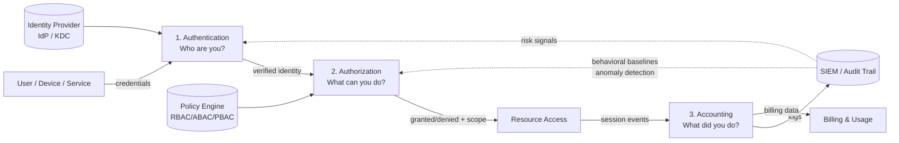
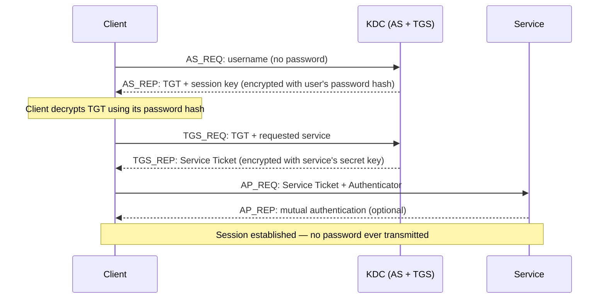
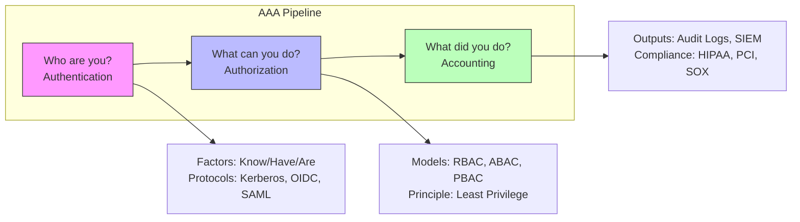

# Authentication, Authorization, and Accounting (AAA)

## TCM Exam Objectives

- Describe the AAA framework and how authentication, authorization, and accounting interrelate
- Compare authentication protocols: Kerberos, OAuth 2.0, OIDC, and SAML 2.0
- Distinguish between RBAC, ABAC, and PBAC authorization models
- Differentiate RADIUS, TACACS+, and Diameter by transport, encryption, and use case
- Map AAA to Zero Trust Architecture (NIST SP 800-207)
- Explain PAM, ITDR, and their role in identity-centric security operations

**AAA (Authentication, Authorization, and Accounting)** is a security framework that answers three sequential questions for every access request — *who are you, what are you allowed to do, and what did you do while you were here* — forming the control plane that governs identity, access, and accountability across network, application, and cloud environments.【turn0search0】【turn0search4】 In 2025, AAA is the structural backbone of Zero Trust Architecture, Identity and Access Management (IAM), and modern SOC operations, because identity — not the network perimeter — is now the primary attack surface.【turn1search25】【turn2search1】

## The AAA Pipeline

Every access request flows through three gates in sequence. Authentication establishes identity, authorization determines permissions against policy, and accounting records the session for audit, compliance, and security monitoring. The output of each gate feeds the next, and the accounting logs loop back into detection and policy refinement.



The dotted feedback lines show how accounting feeds back into the other two pillars: behavioral baselines derived from accounting logs inform dynamic authorization decisions, and risk signals (impossible travel, MFA fatigue, anomalous access patterns) tighten authentication requirements in real time. This closed loop is what makes AAA a *framework* rather than a one-time check.

## Master Comparison of the Three A's

| Dimension | Authentication | Authorization | Accounting |
|---|---|---|---|
| **Question answered** | Who are you? | What are you allowed to do? | What did you do? |
| **Core function** | Verify identity via credentials/factors | Grant or deny access based on policy | Record session activity and resource usage |
| **When it runs** | At session start (and continuously in Zero Trust) | At every access request, per-session | Throughout the session, continuously |
| **Common methods** | Passwords, MFA, certificates, biometrics, Kerberos, OIDC, SAML | RBAC, ABAC, PBAC, least privilege, ACLs | Audit logs, session logs, accounting packets, SIEM ingestion |
| **Typical protocols** | Kerberos, OAuth 2.0, OIDC, SAML, RADIUS, TACACS+, EAP | XACML, OAuth 2.0 scopes, SAML assertions, policy engines | RADIUS accounting, TACACS+ accounting, Syslog, Diameter accounting |
| **Output** | Verified identity assertion (ticket, token, assertion) | Access decision (allow/deny) + permission scope | Chronological audit trail, session records, billing data |
| **Failure mode** | Impersonation, credential theft, brute force | Privilege escalation, broken access control, over-permissioning | Log gaps, tampering, insufficient retention, blind spots |
| **Primary owner** | Identity Provider (IdP), KDC, Directory | Policy Engine, IAM, PAM | SIEM, log management, compliance team |

Sources: 【turn0search0】【turn0search3】【turn0search4】【turn1search15】【turn1search26】

---

## Module 1 — Authentication: Proving Identity

Authentication is the process by which a system verifies that a user, device, or service is who or what it claims to be, typically by validating credentials against a trusted identity store.【turn0search2】【turn0search3】 The strength of authentication depends on the *factors* presented and the *protocol* used to exchange them.

### The Three Authentication Factors (NIST)

NIST SP 800-63 and related publications define three categories of authentication evidence, and Multi-Factor Authentication (MFA) requires evidence from at least two distinct categories.【turn1search20】【turn1search24】

- **Something you know** (knowledge factor) — password, PIN, security question. Weakest factor; vulnerable to guessing, phishing, reuse, and breach leaks.【turn1search22】【turn1search23】
- **Something you have** (possession factor) — hardware token (YubiKey, FIDO), smartphone with authenticator app, smart card, OTP via SMS. Stronger, but SMS is increasingly deprecated due to SIM-swapping attacks.【turn1search22】
- **Something you are** (inherence factor) — biometrics: fingerprint, facial recognition, iris scan. Strongest for usability but raises privacy and revocation concerns.【turn1search21】

MFA's value is structural: even if one factor is compromised, the attacker still cannot authenticate. With 81% of breaches involving stolen or weak credentials, MFA is the single highest-impact control an organization can deploy.【turn1search23】

📌 **Exam Tip:** Memorize the three authentication factors — Something You Know (password/PIN), Something You Have (token/phone), Something You Are (biometrics). MFA requires at least two distinct categories. The exam often asks which factor category a specific control belongs to.

### Kerberos — The Enterprise Ticket System

Kerberos is the default authentication protocol for Windows Active Directory and many enterprise environments, using a ticket-based system that allows entities to prove identity over insecure networks without ever transmitting passwords.【turn0search25】【turn1search14】

The Kerberos flow involves four entities: the User/Client, the Key Distribution Center (KDC, typically a Domain Controller), the Ticket Granting Server (TGS, part of the KDC), and the target Service. The KDC maintains a database of secret keys (derived from passwords) for all principals.【turn1search10】【turn1search13】



The TGT (Ticket Granting Ticket) is the critical artifact — it's the user's "proof of authentication" cached locally and presented to request service tickets without re-entering the password. Kerberos relies on time synchronization between client and KDC; clock drift creates vulnerability to replay attacks, and compromise of the KDC allows issuance of forged tickets (the basis of Golden Ticket attacks).【turn0search25】【turn1search13】

### OAuth 2.0 — Authorization Framework (often confused with authentication)

OAuth 2.0 is an authorization framework, not an authentication protocol — it defines how a client application can obtain scoped access to a user's resources on another service without exposing the user's credentials.【turn0search11】【turn1search0】 The framework specifies several grant types for different use cases:

- **Authorization Code** — the most common grant type for web and server-side applications; the authorization server returns a single-use code that the client exchanges for an access token, keeping the token exchange server-side and out of the browser.【turn1search2】
- **Authorization Code with PKCE** — the recommended grant for mobile apps and SPAs, adding a proof key to prevent code interception.【turn1search3】
- **Client Credentials** — machine-to-machine authentication where the client is the resource owner (no user involved).
- **Device Code** — for input-constrained devices (smart TVs, IoT).
- **Refresh Token** — obtain a new access token without re-prompting the user.【turn1search0】

The Implicit and Password grants are now legacy/deprecated due to security weaknesses.【turn1search0】

### OpenID Connect (OIDC) — The Authentication Layer on OAuth

OIDC is an interoperable authentication protocol built *on top of* OAuth 2.0, adding an ID Token (a JWT) that contains verifiable assertions about the user's identity.【turn0search10】【turn0search14】 Where OAuth answers "can this app access this resource?", OIDC answers "who is this user?" — and the combination of OAuth 2.0 + OIDC is the modern standard for web and mobile authentication, enabling SSO across cloud applications.【turn0search11】

OIDC uses JWT (JSON Web Tokens) as its token format, which are self-contained, digitally signed, and stateless — unlike SAML's XML assertions. This makes OIDC lighter-weight and better suited to modern APIs and mobile applications.【turn0search12】

### SAML 2.0 — Enterprise SSO Workhorse

SAML (Security Assertion Markup Language) 2.0 is an XML-based protocol for exchanging authentication and authorization data between an Identity Provider (IdP) and a Service Provider (SP), ratified as an OASIS standard in 2005.【turn1search9】 SAML enables web-based cross-domain Single Sign-On — users authenticate once to the IdP and access multiple SPs without re-entering credentials.【turn1search6】

Two flows dominate: **SP-initiated** (the user tries to access an SP, which redirects to the IdP for authentication, then back with a SAML assertion) and **IdP-initiated** (the user starts at the IdP portal and launches an app). SP-initiated provides stronger replay protection and tighter session control; IdP-initiated is easier to configure in IT-managed environments.【turn1search7】 The SAML assertion contains authentication statements, attribute statements (user attributes), and authorization decision statements, all signed by the IdP for verification by the SP.【turn1search9】

📌 **Exam Tip:** The AAA protocol comparison (RADIUS vs. TACACS+ vs. Diameter) is frequently tested. Key distinctions: RADIUS uses UDP and only encrypts the password; TACACS+ uses TCP and encrypts the entire packet; Diameter uses TCP/SCTP and is the standard for telecom. RADIUS = network access (VPN/Wi-Fi), TACACS+ = device admin (routers/switches).



### Protocol Selection Logic

| Use Case | Recommended Protocol |
|---|---|
| Windows enterprise authentication, AD-integrated services | Kerberos |
| Web SSO across enterprise SaaS apps (Salesforce, Workday) | SAML 2.0 |
| Modern web/mobile apps, API-first, cloud-native | OAuth 2.0 + OIDC |
| Machine-to-machine API access | OAuth 2.0 Client Credentials |
| Network device admin (routers, switches) | TACACS+ |
| Remote user network access (VPN, Wi-Fi) | RADIUS |
| Telecom / mobile networks | Diameter |

---

## Module 2 — Authorization: Enforcing Permissions

Authorization determines what an authenticated identity is permitted to do — which resources it can access, what operations it can perform, and under what conditions.【turn0search2】【turn0search3】 Authorization runs *after* authentication (you must know who someone is before deciding what they can do) and is enforced through access control models.

### Access Control Models

**Role-Based Access Control (RBAC)** — NIST-standardized model where permissions are assigned to roles, and users are assigned to roles. RBAC scales well for structured environments because the number of roles is typically far smaller than the number of users or permissions. A "Financial Analyst" role might grant read access to the general ledger and write access to expense reports, regardless of *which* user holds that role.【turn0search15】【turn0search16】 RBAC is the dominant model in enterprise environments and is required by frameworks like SOC 2 and ISO 27001.

**Attribute-Based Access Control (ABAC)** — NIST SP 800-162 defines ABAC as a rule-based approach where access decisions evaluate attributes of the subject (role, department, clearance), the object (classification, owner, sensitivity), and the environment (time, location, device posture).【turn0search17】 ABAC enables fine-grained, context-aware policies — "allow a nurse to view patient records only during their shift, from a hospital-managed device, for patients assigned to their unit." ABAC is more flexible than RBAC but more complex to design and maintain.【turn0search18】【turn1search19】

**Policy-Based Access Control (PBAC)** — An overarching model that externalizes access policy from application code into a centralized policy engine (often using XACML or OPA/Rego). PBAC can express both RBAC and ABAC policies and is the foundation of dynamic, real-time authorization in Zero Trust architectures.

**Hybrid RBAC-A** — Many organizations combine RBAC's simplicity with ABAC's granularity, using RBAC for coarse-grained role assignment and ABAC for fine-grained contextual decisions on top. This hybrid delivers scalability without sacrificing context-awareness.【turn0search18】

### Least Privilege and Just-in-Time Access

The principle of **least privilege** — granting users only the access they need to perform their function, and only for the time required — is the foundational authorization principle underlying NIST 800-207 Zero Trust, SOC 2, and ISO 27001.【turn1search29】【turn2search0】 Modern implementations move beyond static role assignment to **just-in-time (JIT) access**, where privileged permissions are granted on-demand for a specific task and revoked automatically when the task completes. This is the operational core of Privileged Access Management (PAM).

### Privileged Access Management (PAM)

PAM is the subset of IAM focused specifically on privileged users — IT admins, DBAs, security engineers, and high-privilege business users who can affect critical systems.【turn2search0】【turn2search4】 Where IAM answers "who are you?", PAM answers "what can you do when it really matters?" PAM platforms (CyberArk, Delinea, BeyondTrust) enforce:

- **Credential vaulting** — privileged credentials are stored in an encrypted vault and never exposed to the user
- **Session brokering** — access is proxied through the PAM platform, which records the session
- **Just-in-time elevation** — privileges are granted for a specific window and auto-revoked
- **Session recording** — full audit trail of privileged actions for forensic review【turn2search0】【turn2search3】

---

## Module 3 — Accounting: The Audit Trail

Accounting (sometimes called auditing) is the process of recording user activity, resource consumption, and session events for the purposes of billing, compliance, security monitoring, and forensic investigation.【turn0search0】【turn0search3】 Without accounting, the first two A's are unverifiable — you cannot prove who accessed what, when, or whether policy was enforced.

### What Accounting Captures

Audit logs record the **who, what, when, where, and why** of every access event:【turn1search18】

- **Who** — the authenticated identity (user ID, service account, API key)
- **What** — the action taken (read, write, delete, login, privilege escalation)
- **When** — precise timestamp (critical for sequence reconstruction)
- **Where** — source IP, device, location, application
- **Why** — the business context or access request that triggered the action

A series of audit logs forms an **audit trail** — a chronological, tamper-proof sequence that allows administrators to trace activity, security teams to investigate breaches, and auditors to verify compliance.【turn1search15】【turn1search16】

### The AAA Protocol Accounting Functions

RADIUS, TACACS+, and Diameter all include dedicated accounting functions that record session start/stop, bytes transferred, duration, and resource consumption. RADIUS uses UDP port 1813 for accounting; TACACS+ encrypts the entire accounting packet (not just the password, as RADIUS does); Diameter provides the most robust accounting with reliable TCP/SCTP transport.【turn0search9】【turn0search8】

### SIEM Integration and Compliance

Accounting logs are most valuable when centralized in a SIEM (Security Information and Event Management) platform, where they can be correlated across systems, searched for anomalies, and retained per regulatory requirements.【turn1search17】 Key compliance drivers:

- **HIPAA** — requires audit trails for all access to electronic health records (EHRs)
- **FDA 21 CFR Part 11** — requires tamper-proof audit trails for electronic records in pharma/medical devices
- **PCI DSS** — requires audit logs for all access to cardholder data
- **SOX** — requires audit trails for financial system access
- **ISO 27001** — requires logging and monitoring of access events
- **GDPR** — requires records of processing activities for personal data【turn1search18】【turn1search19】

The accounting logs also feed **Identity Threat Detection and Response (ITDR)**, a newer SOC discipline that monitors identity-related activity to detect credential abuse, privilege escalation, MFA bypass, and account takeover — the attacks that occur *after* authentication succeeds but *before* traditional endpoint or network detection catches them.【turn2search11】【turn2search14】

---

## The AAA Protocols — RADIUS vs TACACS+ vs Diameter

These three protocols are the network-layer AAA workhorses, each with distinct transport, encryption, and use-case characteristics.

```mermaid
quadrantChart
    title AAA Protocol Positioning
    x-axis "Less Reliable Transport" --> "More Reliable Transport"
    y-axis "Network Access (User Auth)" --> "Device Admin (Privileged Auth)"
    quadrant-1 Q1[Enterprise Device Admin]
    quadrant-2 Q2[Legacy Network Access]
    quadrant-3 Q3[Lightweight Access]
    quadrant-4 Q4[Modern Telecom/Mobile]
    "RADIUS": [0.25, 0.3]
    "TACACS+": [0.8, 0.8]
    "Diameter": [0.75, 0.45]
```

| Dimension | RADIUS | TACACS+ | Diameter |
|---|---|---|---|
| **Transport** | UDP (connectionless) | TCP (connection-oriented) | TCP or SCTP (connection-oriented) |
| **Ports** | 1812 (auth), 1813 (accounting) | 49 | 3868 |
| **Encryption** | Only password encrypted | Entire packet encrypted | Hop-by-hop security (IPsec/TLS) |
| **AAA separation** | Combines auth + authz | Separates all three (granular control) | Separates all three |
| **Command authorization** | No external command authorization | Granular per-command authorization | Supports complex policies |
| **Primary use case** | Network access (VPN, Wi-Fi, RADIUS dial-in) | Network device administration (routers, switches, firewalls) | Telecom / mobile / IMS networks |
| **Standardization** | Open standard (RFC 2865) | Originally Cisco proprietary, now RFC 1492 | Open standard (RFC 6733) |
| **Reliability** | Lower (UDP, no retransmission) | Higher (TCP) | Highest (TCP/SCTP + failover) |
| **Vendor support** | Universal | Broad (despite Cisco origins) | Telecom-focused |

Sources: 【turn0search6】【turn0search8】【turn0search9】【turn2search5】【turn2search8】

**RADIUS** is the workhorse for user network access — VPN concentrators, Wi-Fi controllers, and remote access servers authenticate users against a RADIUS server backed by LDAP or Active Directory. Its UDP transport makes it lightweight but less reliable; only the password is encrypted, leaving other attributes exposed.【turn0search6】【turn2search5】

**TACACS+** is preferred for network device administration because it separates authentication, authorization, and accounting into distinct services, enabling granular per-command authorization — you can allow a helpdesk technician to run `show interface` but not `configure terminal`. Its TCP transport and full-packet encryption make it more reliable and secure for privileged operations, though historically Cisco-proprietary.【turn0search8】【turn0search9】

**Diameter** was designed to overcome RADIUS's limitations — reliable transport, failover, mandatory security, and richer policy support — and is the standard for telecom and mobile networks (4G/5G IMS, policy control). Despite technical superiority, it has not displaced RADIUS in enterprise IT due to RADIUS's entrenched deployment base.【turn2search6】【turn2search8】

---

## AAA in Modern Security Architecture

### Zero Trust Architecture (NIST SP 800-207)

NIST SP 800-207 defines Zero Trust as a resource-centric security model that removes implicit trust based on network location and requires continuous authentication, authorization, and encryption for every access request.【turn1search25】【turn1search27】【turn1search29】 AAA is not a component of Zero Trust — AAA *is* Zero Trust's operational core:

- **Verify explicitly** — every access request is authenticated based on all available data (identity, location, device posture, behavior)
- **Least privilege access** — authorization is granted per-session, with the minimum scope required
- **Assume breach** — accounting and continuous monitoring detect lateral movement and compromised identities【turn1search20】【turn1search29】

The ZTA logical components map directly to AAA: the **Identity Provider (IdP)** performs authentication, the **Policy Engine (PE)** performs authorization by evaluating identity + device + context, and the **Policy Enforcement Point (PEP)** gates access and generates accounting events.【turn1search26】

### Identity as the New Perimeter

With cloud adoption, hybrid work, and supply chain complexity, attackers no longer breach firewalls — they log in using stolen or misused credentials.【turn2search1】【turn2search14】 This shift makes IAM the strategic control plane:

- **IAM** governs the full identity lifecycle: who are you, what can you access, across the entire organization
- **PAM** secures the privileged subset: what can you do when it really matters
- **ITDR** monitors for identity-based attacks: detecting credential abuse, privilege escalation, and account takeover *after* authentication succeeds but *before* traditional EDR/network tools catch them【turn2search0】【turn2search11】

📌 **Exam Tip:** Know that OAuth 2.0 is an **authorization framework**, NOT an authentication protocol. OIDC is the authentication layer built on top of OAuth 2.0. SAML 2.0 is XML-based and used for enterprise SSO. Kerberos is the Windows AD default using ticket-based auth.

### AAA and the SOC

For security analysts, AAA is the data foundation of identity-centric detection. Authentication logs reveal brute-force attempts, impossible travel, and MFA fatigue attacks. Authorization logs reveal privilege escalation, unauthorized access attempts, and policy violations. Accounting logs provide the forensic timeline for incident reconstruction.【turn2search10】【turn2search11】 The convergence of AAA data with endpoint telemetry (EDR) and network telemetry (NDR) in the SIEM is what enables the SOC to detect the full kill chain — because the modern attack doesn't start with a malware payload, it starts with a valid credential.

---

## Recap

AAA is the three-gate pipeline governing every access decision: **authentication** verifies identity (via factors, MFA, and protocols like Kerberos, OIDC, SAML, and OAuth 2.0), **authorization** enforces permissions (via RBAC, ABAC, PBAC, and least-privilege models including PAM), and **accounting** records activity for audit, compliance, SIEM correlation, and ITDR. The network protocols RADIUS, TACACS+, and Diameter implement AAA at the infrastructure layer — RADIUS for user network access, TACACS+ for device administration, Diameter for telecom. In the Zero Trust era, AAA has evolved from a perimeter checkpoint into a continuous, identity-centric control plane where every access request is verified, every permission is scoped to the minimum required, and every action is logged — because identity, not the network, is now the security perimeter that attackers target and defenders must protect.【turn1search25】【turn2search1】【turn1search29】