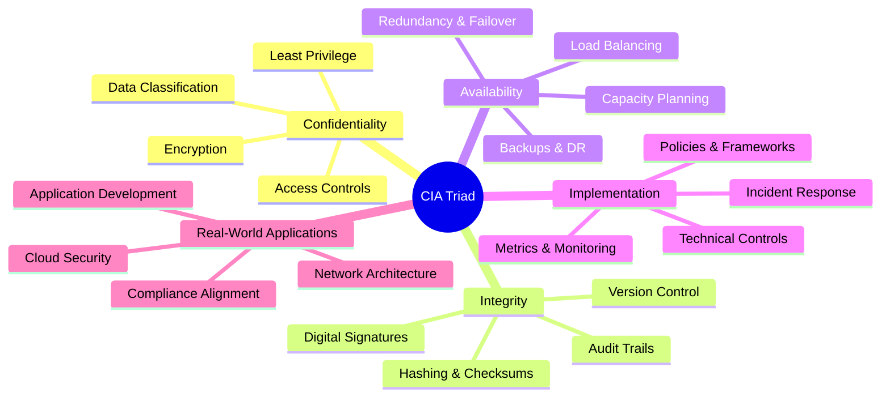
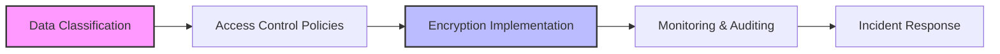
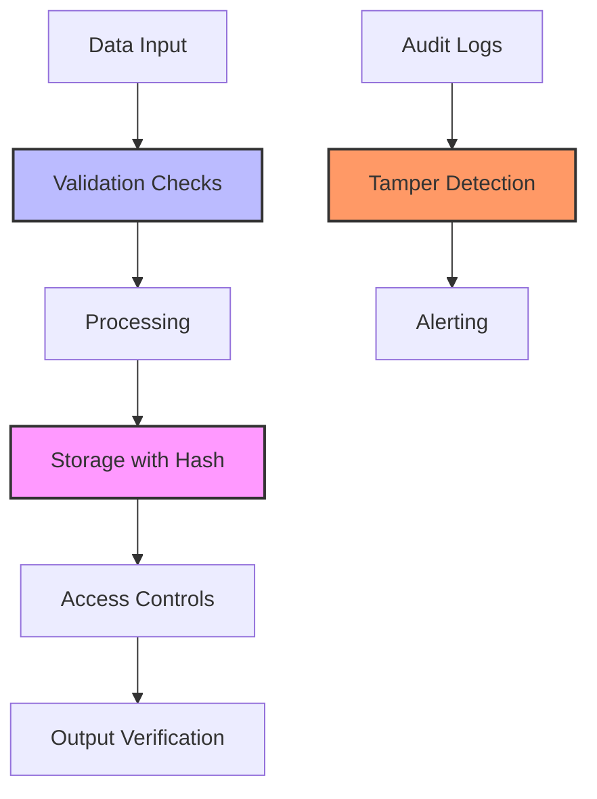
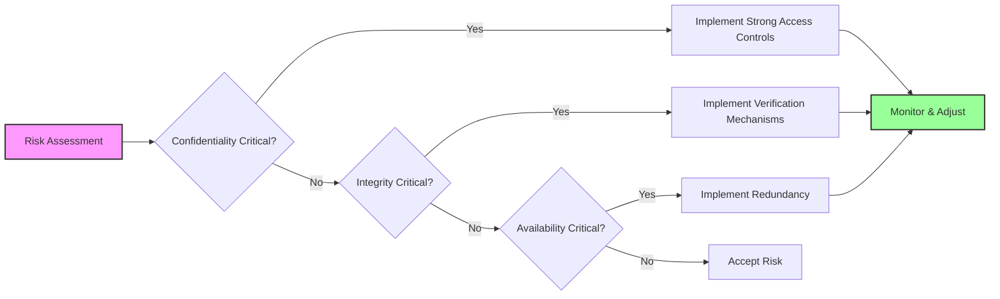
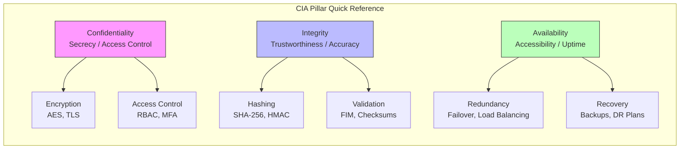
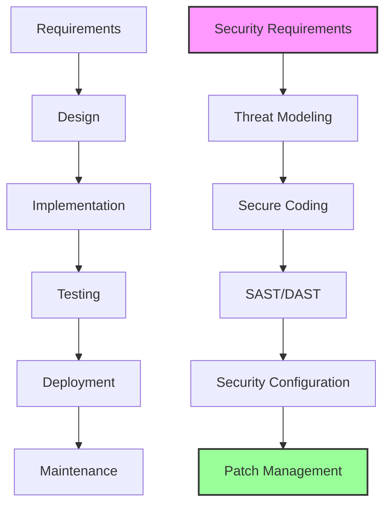
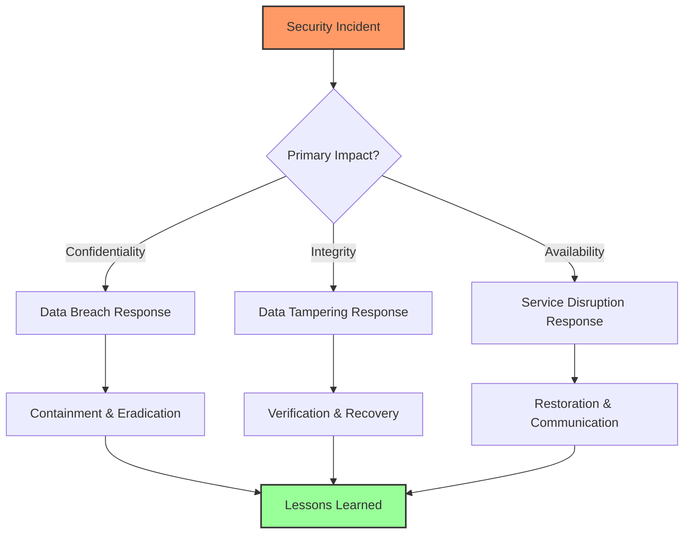

---
tags: [soc]
---
# 🔒 The CIA Triad: A Full-Stack Lesson on Confidentiality, Integrity, and Availability

## TCM Exam Objectives

- Explain the CIA Triad and describe each pillar (Confidentiality, Integrity, Availability)
- Identify real-world threats and controls for each CIA pillar
- Compare encryption, access control, and hashing mechanisms
- Distinguish between RBAC, MAC, DAC, and ABAC access control models
- Calculate and interpret availability metrics (uptime, RTO, RPO, MTBF, MTTR)
- Analyze trade-offs and interdependencies among CIA objectives
- Map CIA principles to SOC 2, NIST SP 800-53, and ISO 27001 frameworks

# 🔒 The CIA Triad: A Full-Stack Lesson on Confidentiality, Integrity, and Availability

## 📖 Lesson Overview
The **CIA Triad**—**Confidentiality, Integrity, and Availability**—is the foundational model of information security, guiding organizations in protecting their most critical assets 【turn0search0】【turn0search6】. This lesson provides a comprehensive exploration of each pillar, their interrelationships, practical implementation strategies, and real-world applications across modern technology stacks.



## 1. 🎯 Introduction to the CIA Triad

### 1.1 What is the CIA Triad?
The CIA Triad is a **security model** that forms the basis for developing security systems and identifying vulnerabilities 【turn0search6】. It segments information security into three distinct but interconnected focus areas, helping security teams address different concerns systematically 【turn0search6】【turn0search7】.

> 💡 **Key Insight**: The CIA Triad isn't just theoretical—it's embedded in modern security frameworks like **NIST SP 800-53**, **ISO 27001**, and **SOC 2** audits, which expect all three pillars to be demonstrably enforced 【turn0search9】.

### 1.2 Historical Context and Evolution
While the exact origins are debated, the triad emerged in the 1970s-1980s as computing systems became networked and data protection needs grew. It has since evolved from a military/government framework to become the **universal language of information security** across industries.

📌 **Exam Tip:** The CIA Triad is the #1 most tested foundational concept on the PSAA exam. Memorize each pillar's definition, a real-world threat example, and at least one control. Be ready to identify which pillar is impacted by a given scenario (e.g., "A DDoS takes down the website" = Availability failure).

## 2. 🔍 Confidentiality: Protecting Information from Unauthorized Access

### 2.1 Definition and Scope
**Confidentiality** ensures that information is accessible only to those authorized to have access 【turn0search7】. It involves efforts to keep data secret or private through controlled access mechanisms 【turn0search6】.

### 2.2 Key Concepts and Mechanisms

<details>
<summary>🔧 Technical Implementation Details</summary>

#### Access Control Models
- **Discretionary Access Control (DAC)**: Owners determine access rights
- **Mandatory Access Control (MAC)**: System-enforced labels (e.g., classified, secret)
- **Role-Based Access Control (RBAC)**: Access based on organizational roles
- **Attribute-Based Access Control (ABAC)**: Dynamic policies based on attributes

#### Encryption Techniques
- **Data at Rest**: AES-256 for disk encryption, database encryption
- **Data in Transit**: TLS 1.3 for network communication, VPNs
- **Data in Use**: Homomorphic encryption, secure enclaves (Intel SGX)
- **Key Management**: HSMs, key rotation policies, split knowledge

#### Authentication Methods
- **Multi-Factor Authentication (MFA)**: Something you know, have, are
- **Biometric Systems**: Fingerprint, facial recognition, retina scans
- **Certificate-Based Authentication**: X.509 certificates, smart cards
- **Behavioral Biometrics**: Keystroke dynamics, mouse patterns
</details>

### 2.3 Common Threats and Vulnerabilities
| Threat Type | Description | Real-World Example | Impact |
|-------------|-------------|-------------------|--------|
| **Data Breaches** | Unauthorized access to sensitive data | Capital One breach (2019) - 100M+ records 【turn0search9】 | Financial loss, reputation damage |
| **Man-in-the-Middle (MITM)** | Intercepting communications | Session hijacking on unsecured WiFi | Data theft, credential harvesting |
| **Insider Threats** | Malicious or negligent employees | Edward Snowden NSA leaks | Massive data exposure, legal consequences |
| **Social Engineering** | Manipulating people for access | Phishing campaigns targeting executives | Account compromise, malware installation |
| **Misconfigured Cloud Storage** | Publicly accessible databases | MongoDB exposures (multiple incidents) | Massive data leaks, regulatory fines |

### 2.4 Practical Controls and Best Practices



**1. Data Classification Framework**
- **Public**: Marketing materials, published research
- **Internal**: Internal documentation, employee directories
- **Confidential**: Financial data, customer information
- **Restricted**: Trade secrets, executive communications

**2. Technical Controls Matrix**
| Control Type | Implementation | Effectiveness | Maintenance |
|--------------|----------------|---------------|-------------|
| **Network Segmentation** | VLANs, firewalls, microsegmentation | High | Medium |
| **Endpoint Protection** | EDR, DLP, application whitelisting | Medium-High | High |
| **Identity Management** | IAM, PAM, SSO, MFA | High | Medium |
| **Data Loss Prevention** | Content inspection, contextual analysis | Medium | High |
| **Encryption** | Full disk, database, email, files | Very High | Low |

## 3. ✅ Integrity: Ensuring Data Trustworthiness and Accuracy

### 3.1 Definition and Importance
**Integrity** means data is trustworthy, complete, and has not been accidentally altered or modified by unauthorized users 【turn0search7】. It ensures that information remains authentic, accurate, and reliable throughout its lifecycle 【turn0search6】.

### 3.2 Verification Mechanisms and Controls

<details>
<summary>🔐 Technical Deep Dive: Integrity Verification</summary>

#### Cryptographic Techniques
- **Hash Functions**: SHA-256, SHA-3 for file integrity verification
- **Digital Signatures**: RSA, ECDSA for non-repudiation and authenticity
- **Message Authentication Codes (MAC)**: HMAC for data origin authentication
- **Blockchain**: Distributed ledgers for tamper-evident logging

#### File Integrity Monitoring (FIM)
```python
# Pseudocode for FIM implementation
class FileIntegrityMonitor:
    def __init__(self):
        self.baseline_hashes = self.load_baseline()
        
    def scan_system(self):
        current_files = self.get_critical_files()
        changes = []
        
        for file_path in current_files:
            current_hash = self.calculate_hash(file_path)
            baseline_hash = self.baseline_hashes.get(file_path)
            
            if baseline_hash != current_hash:
                changes.append({
                    'file': file_path,
                    'old_hash': baseline_hash,
                    'new_hash': current_hash,
                    'timestamp': datetime.now(),
                    'action': 'modified' if baseline_hash else 'created'
                })
        
        return changes
    
    def verify_configuration(self):
        # Check system files, configurations, and critical binaries
        critical_paths = [
            '/etc/passwd',
            '/etc/shadow',
            '/usr/bin/',
            '/windows/system32/'
        ]
        # Implementation details...
```

#### Database Integrity Controls
- **Transaction Logs**: ACID compliance for database operations
- **Change Data Capture (CDC)**: Track data modifications over time
- **Triggers & Constraints**: Enforce business rules at database level
- **Versioning**: Maintain history of changes with rollback capabilities
</details>

### 3.3 Common Integrity Attacks and Failures
| Attack Type | Description | Case Study | Detection Method |
|-------------|-------------|------------|------------------|
| **Data Tampering** | Unauthorized modification | Government financial system records deleted to conceal fraud 【turn0search9】 | Audit logs, FIM alerts |
| **Log Manipulation** | Altering audit trails | Attackers modify logs to hide intrusion | Log analysis, SIEM correlations |
| **Supply Chain Attacks** | Compromised updates | SolarWinds Orion breach (2020) | Code signing verification, sandboxing |
| **SQL Injection** | Database manipulation | Equifax breach (2017) - 147M records | Input validation, parameterized queries |
| **Man-in-the-Middle** | Intercept & modify | SSL stripping attacks | Certificate validation, HSTS |

### 3.4 Practical Implementation Framework

**1. Integrity Verification Layers**


**2. Technical Controls for Different Data States**
| Data State | Primary Controls | Secondary Controls | Verification Frequency |
|------------|------------------|-------------------|------------------------|
| **In Transit** | TLS, mTLS, VPNs | Certificate pinning, HSTS | Real-time |
| **At Rest** | Encryption, hashing | Access controls, FIM | Periodic scans |
| **In Use** | Secure enclaves, homomorphic encryption | Memory protection, process isolation | Continuous |
| **Archival** | Write-once media, blockchain | Digital signatures, timestamps | On access |

## 4. 🌐 Availability: Ensuring Access When Needed

### 4.1 Definition and Business Impact
**Availability** means data and systems are accessible when needed 【turn0search7】. It ensures that authorized users have timely and reliable access to information and resources.

### 4.2 Availability Architecture and Design Principles

<details>
<summary>🏗️ Technical Architecture for High Availability</summary>

#### Redundancy Patterns
- **Active-Active**: Multiple systems handling traffic simultaneously
- **Active-Passive**: Primary system with hot standby
- **N+1 Redundancy**: N systems plus 1 backup
- **Geographic Redundancy**: Multi-region deployments

#### Load Balancing Strategies
```nginx
# Example: Nginx load balancing configuration
upstream backend {
    least_conn;  # Least connections algorithm
    server backend1.example.com weight=5;
    server backend2.example.com;
    server backend3.example.com backup;  # Backup server
    
    health_check interval=10 fails=3 passes=2;
    sticky cookie srv_id expires=1h domain=.example.com path=/;
}

server {
    location / {
        proxy_pass http://backend;
        proxy_next_upstream error timeout http_500 http_502 http_503 http_504;
        proxy_connect_timeout 5s;
        proxy_read_timeout 30s;
    }
}
```

#### Disaster Recovery Solutions
- **Hot Site**: Fully operational with real-time data replication
- **Warm Site**: Partially equipped with recent backups
- **Cold Site**: Basic infrastructure requiring setup time
- **Cloud DR**: Multi-region failover with automated recovery

#### Capacity Planning Approaches
- **Vertical Scaling**: Increasing resources (CPU, RAM, storage)
- **Horizontal Scaling**: Adding more instances
- **Auto-scaling**: Dynamic resource adjustment based on demand
- **Caching**: Redis, Memcached for reducing database load
</details>

### 4.3 Common Availability Threats
| Threat Category | Specific Threats | Business Impact | Mitigation Strategies |
|-----------------|------------------|-----------------|----------------------|
| **DDoS Attacks** | Volumetric, protocol, application-layer | Service unavailability, revenue loss | CDN, scrubbing centers, rate limiting |
| **Ransomware** | Crypto-viral extortion | Data lockout, operational disruption | Backups, endpoint protection, user training |
| **System Failures** | Hardware, software, network | Downtime, data loss | Redundancy, monitoring, failover |
| **Natural Disasters** | Earthquakes, floods, fires | Physical damage, extended outages | Geographic redundancy, DR plans |
| **Human Error** | Misconfiguration, accidental deletion | Service disruption, data loss | Change management, automation, testing |

### 4.4 Availability Metrics and SLAs

**1. Key Performance Indicators**
| Metric | Definition | Target | Industry Benchmark |
|--------|------------|--------|-------------------|
| **Uptime** | Percentage of time system is operational | 99.999% ("five nines") | 99.9% - 99.99% |
| **RTO (Recovery Time Objective)** | Maximum acceptable downtime | < 4 hours | 4-24 hours |
| **RPO (Recovery Point Objective)** | Maximum acceptable data loss | < 15 minutes | 1-4 hours |
| **MTBF (Mean Time Between Failures)** | Average time between failures | > 1 year | 3-6 months |
| **MTTR (Mean Time To Recovery)** | Average time to restore service | < 1 hour | 2-4 hours |

**2. Availability by Service Tier**
| Tier | Uptime Guarantee | RTO | RPO | Suitable For |
|------|------------------|-----|-----|--------------|
| **Tier 1** | 99% | 24h | 24h | Development environments |
| **Tier 2** | 99.9% | 8h | 4h | Internal applications |
| **Tier 3** | 99.99% | 1h | 15m | Business-critical systems |
| **Tier 4** | 99.999% | 15m | < 1m | Life-safety, financial systems |

## 5. 🔗 Interconnections and Trade-offs

### 5.1 The Triad in Practice: Balancing Act
The three pillars often exist in tension with each other. For example:
- **Maximizing Confidentiality** (extreme access controls) can reduce **Availability** (legitimate users can't access data)
- **Ensuring Integrity** (rigid validation) can impact **Availability** (delays in processing)
- **Maximizing Availability** (multiple copies) can compromise **Confidentiality** (increased attack surface)

### 5.2 Risk-Based Decision Framework



📌 **Exam Tip:** Know the three data states (at rest, in transit, in use) and which encryption protects each. AES-256 = at rest, TLS 1.3 = in transit, Homomorphic encryption = in use. Also know hash algorithms (SHA-256, SHA-3) for integrity verification.



### 5.3 Real-World Case Studies

<details>
<summary>📊 Case Study Analysis: CIA Trade-offs in Practice</summary>

#### Case 1: Healthcare Patient Records
- **Challenge**: HIPAA compliance requires both confidentiality (patient privacy) and availability (emergency access)
- **Solution**: Role-based access with break-glass procedures
- **Trade-off**: Slight availability delay for verification vs. guaranteed confidentiality
- **Outcome**: Balanced approach with audit trails for all access

#### Case 2: Financial Trading System
- **Challenge**: Microsecond latency requirements vs. data integrity
- **Solution**: In-memory processing with async verification
- **Trade-off**: Minor integrity verification delay for speed
- **Outcome**: Real-time trading with post-trade reconciliation

#### Case 3: E-Commerce Platform
- **Challenge**: High availability (Black Friday) vs. fraud prevention
- **Solution**: Tiered verification based on transaction risk
- **Trade-off**: Some fraudulent transactions vs. legitimate customer friction
- **Outcome**: 99.99% availability with <0.1% fraud rate
</details>

📌 **Exam Tip:** Availability metrics are highly testable. Commit to memory: RTO = max acceptable downtime, RPO = max acceptable data loss. "Five nines" = 99.999% uptime = ~5 minutes downtime per year. MTBF measures reliability (time between failures), MTTR measures recovery speed (time to restore).

## 6. 🛠️ Implementation Across the Stack

### 6.1 Application Development Security

**1. Secure Development Lifecycle Integration**


**2. CIA in Code Implementation**
```java
// Example: Applying CIA principles in application code

// Confidentiality: Encrypting sensitive data
public class DataEncryptor {
    private static final String ALGORITHM = "AES/GCM/NoPadding";
    
    public String encrypt(String plaintext, SecretKey key) {
        Cipher cipher = Cipher.getInstance(ALGORITHM);
        cipher.init(Cipher.ENCRYPT_MODE, key);
        byte[] encrypted = cipher.doFinal(plaintext.getBytes());
        return Base64.getEncoder().encodeToString(encrypted);
    }
    
    // Integrity: Adding HMAC for verification
    public String generateHmac(String data, SecretKey key) {
        Mac mac = Mac.getInstance("HmacSHA256");
        mac.init(key);
        byte[] hmac = mac.doFinal(data.getBytes());
        return Base64.getEncoder().encodeToString(hmac);
    }
    
    // Availability: Implementing circuit breaker pattern
    public class CircuitBreaker {
        private int failureCount = 0;
        private int threshold = 5;
        private long timeout = 60000;
        private long lastFailureTime = 0;
        
        public void execute(Runnable operation) {
            if (isOpen()) {
                throw new ServiceUnavailableException("Circuit breaker open");
            }
            
            try {
                operation.run();
                reset();
            } catch (Exception e) {
                recordFailure();
                throw e;
            }
        }
        
        private boolean isOpen() {
            return failureCount >= threshold && 
                   System.currentTimeMillis() - lastFailureTime < timeout;
        }
    }
}
```

### 6.2 Cloud Security Architecture

**1. Shared Responsibility Model**
| Cloud Service Model | Confidentiality | Integrity | Availability |
|---------------------|-----------------|-----------|--------------|
| **IaaS** | Customer: OS, apps, data | Customer: OS, apps, data | Provider: Infrastructure, Customer: Apps |
| **PaaS** | Customer: App code, data | Customer: App code, data | Provider: Runtime, Customer: Apps |
| **SaaS** | Provider: Data encryption | Provider: Data management | Provider: Service, Customer: Config |

**2. Cloud-Specific Controls**
- **Confidentiality**: KMS, VPC, Security Groups, IAM Policies
- **Integrity**: CloudTrail, Config Rules, GuardDuty
- **Availability**: Auto Scaling, Multi-AZ, Route 53 Health Checks

### 6.3 Network Security Controls

**1. Defense-in-Depth Architecture**
```
Internet
    │
    ├── DDoS Protection (Cloudflare, AWS Shield)
    │
    ├── Web Application Firewall (WAF)
    │
    ├── Load Balancer (with health checks)
    │
    ├── Application Servers (auto-scaling group)
    │
    ├── Database (primary/standby with replication)
    │
    └── Storage (encrypted backups, versioning)
```

**2. Network Segmentation for CIA**
| Zone | Confidentiality Level | Integrity Requirements | Availability Needs |
|------|----------------------|------------------------|-------------------|
| **DMZ** | Medium | High (public-facing) | High (always available) |
| **Internal** | High | Medium | Medium |
| **Restricted** | Very High | Very High | Low (if needed) |
| **Management** | Very High | High | Medium |

## 7. 📏 Metrics and Measurement

### 7.1 CIA Metrics Framework

<details>
<summary>📈 Comprehensive Metrics Dashboard</summary>

#### Confidentiality Metrics
| Metric | Definition | Target | Measurement Method |
|--------|------------|--------|-------------------|
| **Access Violation Rate** | Unauthorized access attempts per month | < 5 | SIEM logs, access reviews |
| **Encryption Coverage** | % of sensitive data encrypted | 100% | Data discovery scans |
| **Authentication Success Rate** | % of legitimate auths successful | > 99.5% | Auth logs analysis |
| **Data Classification Coverage** | % of data classified | > 95% | Data inventory audits |
| **Privileged Access Ratio** | % users with admin rights | < 5% | IAM reports |

#### Integrity Metrics
| Metric | Definition | Target | Measurement Method |
|--------|------------|--------|-------------------|
| **Change Failure Rate** | % of changes causing incidents | < 5% | Change management records |
| **Hash Verification Failures** | Failed integrity checks per day | 0 | FIM alerts |
| **Audit Log Completeness** | % of actions logged | 100% | Log analysis |
| **Recovery Time Objective Met** | % of recoveries within RTO | > 95% | DR test results |
| **Data Accuracy Rate** | % of data without errors | > 99.9% | Data quality checks |

#### Availability Metrics
| Metric | Definition | Target | Measurement Method |
|--------|------------|--------|-------------------|
| **System Uptime** | % of time systems available | 99.99% | Monitoring systems |
| **MTBF** | Mean time between failures | > 90 days | Incident records |
| **MTTR** | Mean time to recovery | < 2 hours | Incident management |
| **Peak Load Handling** | % of peak capacity sustained | > 120% | Load testing |
| **Recovery Point Objective Met** | % of backups within RPO | 100% | Backup verification |
</details>

### 7.2 Maturity Assessment Model

| Level | Confidentiality | Integrity | Availability |
|-------|-----------------|-----------|--------------|
| **1 - Initial** | Basic access controls | Manual backups | Single systems |
| **2 - Repeatable** | RBAC implemented | Periodic hashing | Redundant systems |
| **3 - Defined** | Encryption deployed | FIM operational | DR plan tested |
| **4 - Managed** | Metrics tracked | Automated verification | Multi-region failover |
| **5 - Optimizing** | Predictive controls | Blockchain integrity | Self-healing systems |

## 8. 🚨 Incident Response and CIA Triad

### 8.1 Incident Classification by CIA Impact



### 8.2 Response Strategies by Pillar

<details>
<summary>🚨 Incident Response Playbooks</summary>

#### Confidentiality Breach Response
1. **Identify**: What data was accessed? How?
2. **Contain**: Revoke access, reset credentials, isolate systems
3. **Eradicate**: Remove malware, close vulnerabilities
4. **Recover**: Restore from clean backups, implement new controls
5. **Communicate**: Notify affected parties, regulators as required
6. **Lessons**: Improve access controls, monitoring, training

#### Integrity Incident Response
1. **Identify**: What was modified? When? How?
2. **Verify**: Use known-good copies for comparison
3. **Restore**: Rollback to verified state
4. **Investigate**: Determine root cause and attack vector
5. **Strengthen**: Implement additional verification controls
6. **Document**: Update audit trails and evidence preservation

#### Availability Incident Response
1. **Assess**: Scope and impact of outage
2. **Mitigate**: Activate disaster recovery plans
3. **Restore**: Bring systems back online incrementally
4. **Communicate**: Status updates to stakeholders
5. **Analyze**: Determine cause and prevention measures
6. **Improve**: Update capacity planning and redundancy
</details>

## 9. 🔮 Future Trends and Evolving Challenges

### 9.1 Emerging Technologies Impact

| Technology | Impact on Confidentiality | Impact on Integrity | Impact on Availability |
|------------|---------------------------|---------------------|------------------------|
| **Quantum Computing** | Breaks current encryption | New hash algorithms needed | New quantum-resistant protocols |
| **AI/ML** | Advanced threat detection | Deepfakes for tampering | Automated response systems |
| **IoT** | Increased attack surface | Physical-digital integrity | Massive scale requirements |
| **Blockchain** | Privacy challenges | Immutable ledgers | Scalability issues |
| **Edge Computing** | Distributed data protection | Edge integrity verification | Latency improvements |

### 9.2 Adversarial Evolution
- **AI-Powered Attacks**: Automated social engineering, adaptive malware
- **Supply Chain Complexity**: Third-party risks across all pillars
- **Regulatory Expansion**: Stricter requirements for all three principles
- **Privacy-Utility Balance**: GDPR vs. business needs for data availability

## 10. 📚 Implementation Checklist and Best Practices

<details>
<summary>✅ Comprehensive Implementation Checklist</summary>

#### Confidentiality Implementation
- [ ] Data classification policy and procedures
- [ ] Access control models (RBAC, ABAC) implemented
- [ ] Encryption for data at rest, in transit, and in use
- [ ] Multi-factor authentication deployed
- [ ] Privileged access management solution
- [ ] Data loss prevention (DLP) systems
- [ ] Regular access reviews and recertification
- [ ] Security awareness training program

#### Integrity Implementation
- [ ] File integrity monitoring (FIM) deployed
- [ ] Cryptographic hashing for critical files
- [ ] Digital signatures for code and documents
- [ ] Audit logging with tamper protection
- [ ] Database transaction logging and rollback
- [ ] Version control systems for configurations
- [ ] Change management processes with approvals
- [ ] Regular data quality checks and validation

#### Availability Implementation
- [ ] Redundant systems and components
- [ ] Load balancing and failover mechanisms
- [ ] Regular backups with tested restoration
- [ ] Disaster recovery plan with annual testing
- [ ] Capacity planning and monitoring
- [ ] DDoS protection and mitigation
- [ ] Geographic redundancy for critical systems
- [ ] Business continuity plan and training

#### Cross-Cutting Controls
- [ ] Security metrics and monitoring dashboard
- [ ] Incident response plan with CIA-specific playbooks
- [ ] Regular vulnerability assessments and penetration testing
- [ ] Security architecture review process
- [ ] Third-party risk management program
- [ ] Compliance with relevant frameworks (NIST, ISO, SOC 2)
</details>

## 🎓 Conclusion: The Enduring Relevance of the CIA Triad

The CIA Triad remains the **cornerstone of information security** because it provides a simple yet comprehensive framework for thinking about complex security challenges. Its beauty lies in its **adaptability**—from early mainframe systems to today's cloud-native architectures, the principles remain constant while implementation evolves.

> 💡 **Final Insight**: As noted in the search results, security failures rarely happen in a vacuum. When something goes wrong, the question isn't just *what* happened, but *which principle failed* 【turn0search9】. The CIA Triad provides that diagnostic clarity, enabling effective response and continuous improvement.

The most effective security programs don't treat confidentiality, integrity, and availability as competing priorities but as **complementary objectives** that require careful balancing based on organizational risk, regulatory requirements, and business needs. By understanding the trade-offs and implementing a risk-based approach, organizations can build resilient systems that protect their most critical assets while enabling business operations.

---

**📚 Additional Resources**:
- [NIST Cybersecurity Framework](https://www.nist.gov/cyberframework) - Aligns with CIA principles
- [ISO/IEC 27001](https://www.iso.org/isoiec-27001-information-security.html) - International security standard
- [Cloud Security Alliance Guidance](https://cloudsecurityalliance.org/) - Cloud-specific CIA implementation
- [SANS Institute Reading Room](https://www.sans.org/reading-room/) - In-depth security papers

*This lesson provides a foundational understanding of the CIA Triad. For specific implementation guidance, consult with security professionals and refer to vendor documentation for your particular technology stack.*