---
tags: [soc]
---
# 🌐 Full-Stack Lesson: Common Network Protocols

## TCM Exam Objectives

- State the default port and transport protocol (TCP/UDP) for DNS, HTTP, HTTPS, SMTP, SSH, FTP, and DHCP
- Explain DNS resolution: recursive vs. iterative queries, root → TLD → authoritative chain
- Compare HTTP (port 80), HTTPS (port 443 with TLS), HTTP/2 (multiplexing), and HTTP/3 (QUIC over UDP)
- Describe the SMTP conversation: HELO, MAIL FROM, RCPT TO, DATA, QUIT
- Explain SSH authentication methods (password, public key) and port forwarding
- Describe the DHCP DORA process (Discover, Offer, Request, Acknowledge) and lease management

# 🌐 Full-Stack Lesson: Common Network Protocols

## 📚 1. Introduction to Network Protocol Stacks

Network protocols are standardized rules that allow devices to communicate across a network. A **protocol stack** is a layered set of these rules, where each layer serves a specific function and builds upon the layers below it 【turn0search25】. Understanding these protocols is essential for system design, network administration, and cybersecurity.

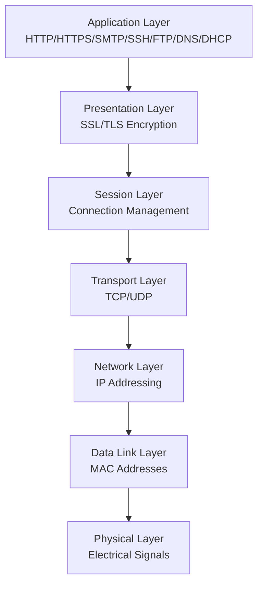

📌 **Exam Tip:** Memorize the port-protocol mappings: DNS=53 (UDP), HTTP=80 (TCP), HTTPS=443 (TCP), SMTP=25/587/465 (TCP), SSH=22 (TCP), FTP=21/20 (TCP), DHCP=67/68 (UDP). The exam frequently tests "which port does protocol X use?" and "which protocol uses UDP vs. TCP?"

## 🔍 2. Protocol Overview & Port Reference

Here's a quick reference table for the protocols we'll cover in detail:

| Protocol | Full Name | Port(s) | Transport | Primary Function |
|----------|-----------|---------|-----------|------------------|
| **DNS** | Domain Name System | 53 | UDP/TCP | Domain name → IP resolution 【turn0search2】【turn0search4】 |
| **HTTP** | Hypertext Transfer Protocol | 80 | TCP | Web page transfer 【turn0search4】 |
| **HTTPS** | HTTP Secure | 443 | TCP | Encrypted web communication 【turn0search4】 |
| **SMTP** | Simple Mail Transfer Protocol | 25, 587, 465 | TCP | Email transmission 【turn0search4】 |
| **SSH** | Secure Shell | 22 | TCP | Secure remote login & file transfer 【turn0search20】 |
| **FTP** | File Transfer Protocol | 21, 20 | TCP | File transfer 【turn0search19】【turn0search22】 |
| **DHCP** | Dynamic Host Configuration Protocol | 67, 68 | UDP | Automatic IP assignment 【turn0search22】 |

## 📖 3. Deep Dive: Protocol by Protocol

### 3.1 DNS (Domain Name System)

#### What It Does
DNS translates human-readable domain names (like `example.com`) into machine-readable IP addresses (like `93.184.216.34`) 【turn0search2】. It's often described as the "phonebook of the internet."

#### How It Works: Resolution Process
DNS resolution can be **recursive** or **iterative**:

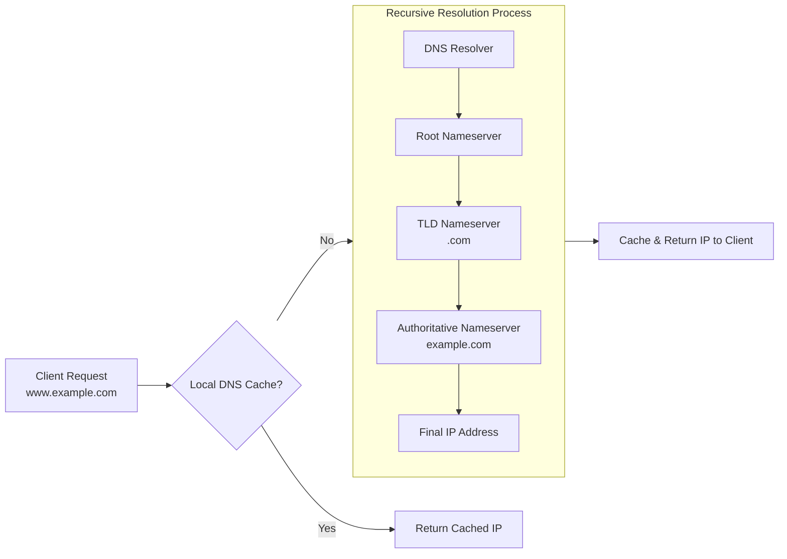

**Recursive Resolution** 【turn0search9】【turn0search10】【turn0search11】:
1. Client sends query to local DNS resolver (usually ISP DNS)
2. Resolver checks its cache—if found, returns immediately
3. If not cached, resolver queries root nameserver
4. Root responds with referral to TLD nameserver (e.g., `.com`)
5. TLD responds with referral to authoritative nameserver for the domain
6. Authoritative server provides final IP address
7. Resolver caches result and returns to client

**Iterative Resolution** 【turn0search9】【turn0search11】:
- Each DNS server returns best answer it has (referral or final answer)
- Client (resolver) is responsible for following referrals
- Reduces load on individual servers but increases client responsibility

<details>
<summary>🔧 Technical Implementation Details</summary>

DNS uses **UDP port 53** for standard queries and **TCP port 53** for zone transfers and responses larger than 512 bytes. Key record types include:

- **A Record**: Maps domain to IPv4 address
- **AAAA Record**: Maps domain to IPv6 address
- **CNAME Record**: Canonical name (alias)
- **MX Record**: Mail exchange servers
- **TXT Record**: Text records (SPF, DKIM, etc.)
- **NS Record**: Nameserver records

DNS caching occurs at multiple levels: browser, OS, resolver, and authoritative servers, with each record having a **TTL (Time to Live)** specifying how long to cache it 【turn0search9】.

📌 **Exam Tip:** Know the DNS record types: A = IPv4, AAAA = IPv6, CNAME = alias/Canonical Name, MX = Mail Exchange, TXT = text records (SPF, DKIM), NS = Nameserver. Recursive resolution = resolver does all the work. Iterative = resolver follows referrals. Also know DNSSEC (adds cryptographic signatures), DoH (DNS over HTTPS, port 443), DoT (DNS over TLS, port 853).
</details>

#### Security Considerations
- **DNSSEC**: Adds cryptographic signatures to prevent spoofing
- **DNS over HTTPS (DoH)**: Encrypts DNS queries
- **DNS over TLS (DoT)**: Another encryption method for DNS
- **Cache Poisoning**: Attackers corrupt resolver caches

---

### 3.2 HTTP/HTTPS (Hypertext Transfer Protocol)

#### HTTP: The Foundation of the Web
HTTP is an **application layer protocol** for transmitting web documents like HTML 【turn0search4】. It operates on **TCP port 80** and follows a client-server model.

**HTTP Request/Response Cycle**:
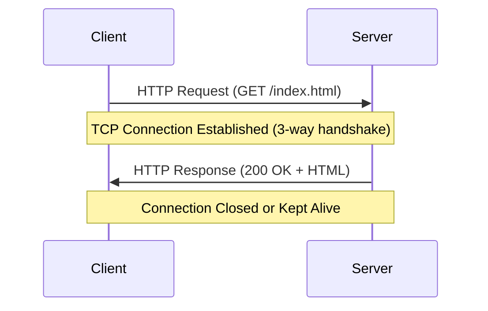

**Key HTTP Methods**:
- **GET**: Retrieve data
- **POST**: Submit data
- **PUT**: Update data
- **DELETE**: Remove data
- **HEAD**: Retrieve headers only

#### HTTPS: Secure HTTP
HTTPS is HTTP encrypted with **TLS/SSL**, operating on **port 443** 【turn0search4】. It provides:
- **Encryption**: Protects data in transit
- **Authentication**: Verifies server identity
- **Integrity**: Detects data tampering

**TLS Handshake Process** 【turn0search14】【turn0search15】【turn0search16】【turn0search17】【turn0search18】:
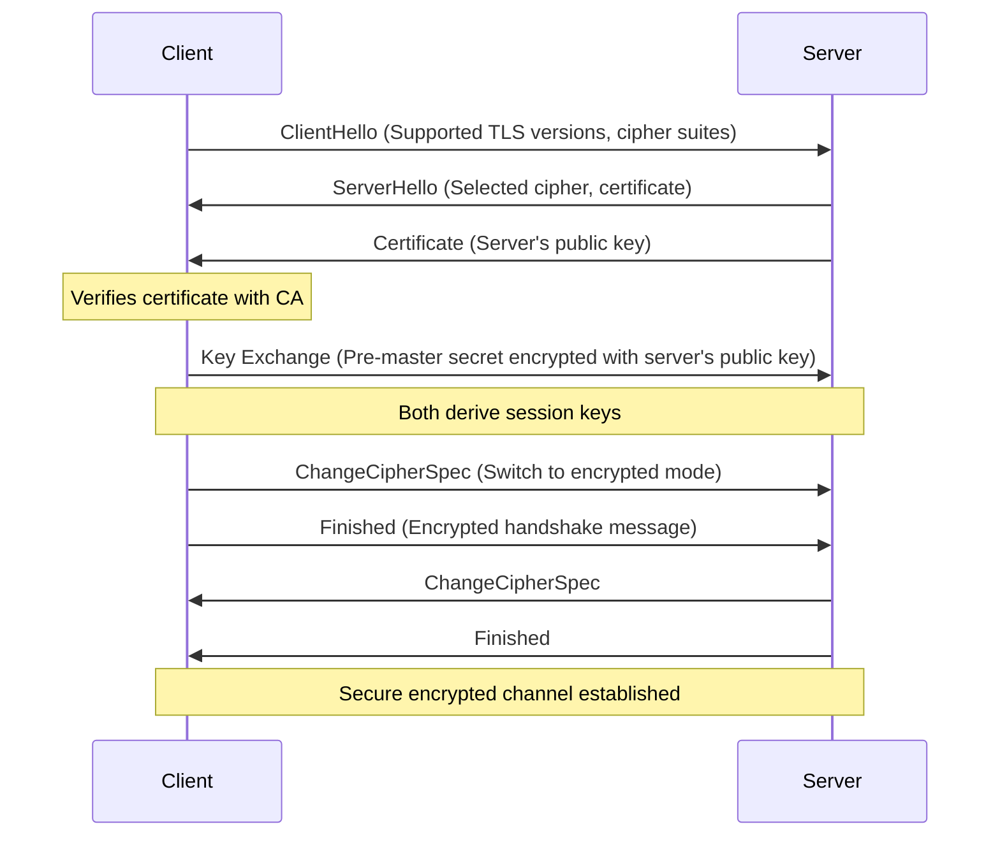

<details>
<summary>⚙️ Advanced HTTP Features</summary>

**HTTP/2 Improvements**:
- Multiplexing (multiple requests over single connection)
- Header compression (HPACK)
- Server push
- Binary protocol (vs text-based HTTP/1.1)

**HTTP/3 (QUIC)**:
- Uses UDP instead of TCP
- Built-in encryption (TLS 1.3)
- Reduced connection establishment time
- Better performance on mobile networks

**Status Codes**:
- **2xx Success**: 200 OK, 201 Created
- **3xx Redirection**: 301 Moved Permanently, 302 Found
- **4xx Client Errors**: 404 Not Found, 403 Forbidden
- **5xx Server Errors**: 500 Internal Server Error, 503 Service Unavailable
</details>

---

### 3.3 SMTP (Simple Mail Transfer Protocol)

#### What It Does
SMTP is used for **sending and relaying email** between mail servers 【turn0search4】. It operates on **port 25** (unencrypted), **port 587** (submission with TLS), or **port 465** (SMTPS, implicit TLS).

#### How It Works
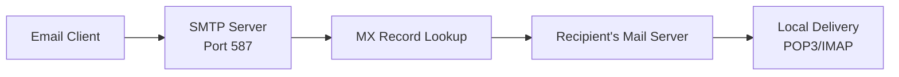

**SMTP Conversation Example**:
```
S: 220 smtp.example.com ESMTP
C: HELO client.example.com
S: 250 Hello client.example.com
C: MAIL FROM:<sender@example.com>
S: 250 OK
C: RCPT TO:<recipient@example.org>
S: 250 OK
C: DATA
S: 354 Start mail input
C: Subject: Test Email
C: 
C: This is the email body.
C: .
S: 250 Message accepted for delivery
C: QUIT
S: 221 Bye
```

#### Security Considerations
- **STARTTLS**: Upgrades plain connection to encrypted
- **SMTPS**: Implicit TLS on port 465
- **SPF/DKIM/DMARC**: Email authentication frameworks
- **Open Relay**: Misconfigured servers that relay spam

---

### 3.4 SSH (Secure Shell)

#### What It Does
SSH provides **secure remote login** and **secure file transfer** over an unsecured network 【turn0search20】. It replaces insecure protocols like Telnet and rlogin. It operates on **port 22**.

#### How It Works
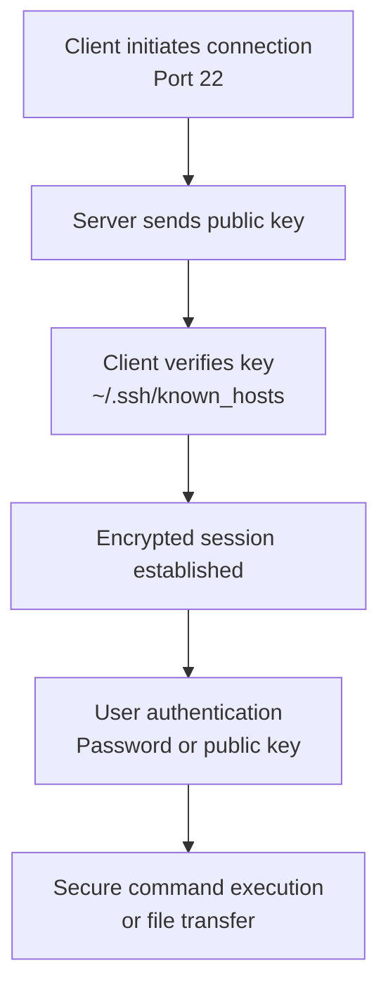

**SSH Authentication Methods**:
1. **Password**: Simple but less secure
2. **Public Key**: Cryptographic key pair
3. **Host-based**: Based on client host
4. **Keyboard-interactive**: Challenge-response

<details>
<summary>🔐 SSH Advanced Features</summary>

**Port Forwarding**:
- **Local**: `ssh -L 8080:remote:80 user@host`
- **Remote**: `ssh -R 8080:local:80 user@host`
- **Dynamic**: SOCKS proxy

**SCP/SFTP**: Secure file transfer over SSH
- **SCP**: `scp file.txt user@host:/path/`
- **SFTP**: Interactive file transfer

**SSH Agent**: Holds private keys in memory
- `ssh-add ~/.ssh/id_rsa`
- `ssh -A user@host` (agent forwarding)
</details>

---

### 3.5 FTP (File Transfer Protocol)

#### What It Does
FTP is used for **transferring files** between a client and server 【turn0search19】【turn0search22】. It uses **two channels**:
- **Control Channel**: Port 21 (commands)
- **Data Channel**: Port 20 (active) or high ports (passive)

#### How It Works
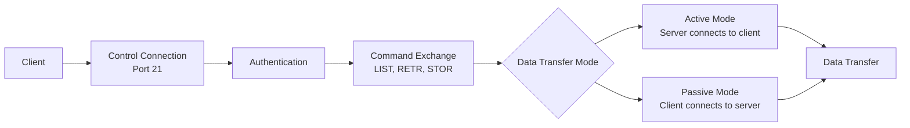

**FTP Commands**:
- `USER username`: Send username
- `PASS password`: Send password
- `LIST`: List directory
- `RETR file`: Retrieve file
- `STOR file`: Store file
- `PASV`: Enter passive mode
- `QUIT`: Close connection

#### Security Considerations
- **FTPS**: FTP over TLS (explicit on port 21, implicit on port 990)
- **SFTP**: SSH File Transfer Protocol (different from FTPS, uses SSH)
- **Plain FTP**: Sends credentials in clear text (insecure)

---

📌 **Exam Tip:** Memorize the DHCP DORA process: D=Discover (client broadcasts), O=Offer (server offers IP), R=Request (client requests), A=Acknowledge (server confirms). DHCP uses UDP — broadcasts because the client has no IP yet. Renewal at 50% lease time (unicast to original server), rebind at 87.5% (broadcast to any server).

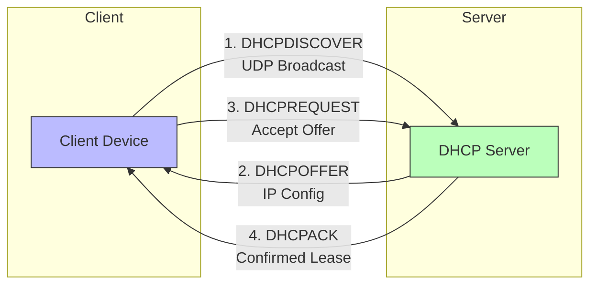

### 3.6 DHCP (Dynamic Host Configuration Protocol)

#### What It Does
DHCP automatically assigns **IP addresses**, **subnet masks**, **default gateways**, and **DNS servers** to devices on a network 【turn0search22】. It uses **UDP ports 67** (server) and **68** (client).

**DHCP Lease Process**:
1. **DHCPDISCOVER**: Client broadcasts looking for server
2. **DHCPOFFER**: Server offers IP configuration
3. **DHCPREQUEST**: Client requests offered configuration
4. **DHCPACK**: Server acknowledges and assigns lease

<details>
<summary>⚙️ DHCP Configuration Details</summary>

**DHCP Options**:
- Option 1: Subnet Mask
- Option 3: Router/Default Gateway
- Option 6: DNS Servers
- Option 12: Hostname
- Option 15: Domain Name
- Option 51: Lease Time
- Option 53: DHCP Message Type
- Option 54: Server Identifier
- Option 82: Relay Agent Information

**Lease Renewal**:
- At 50% lease time: Client attempts to renew with original server
- At 87.5% lease time: Client broadcasts for any server
- If lease expires: Client must release IP and start new DORA process

**DHCP Relay**: Routers forward DHCP broadcasts between subnets
</details>

## 🔗 4. Protocol Interconnections & Stack Integration

### 4.1 Real-World Scenario: Loading a Web Page

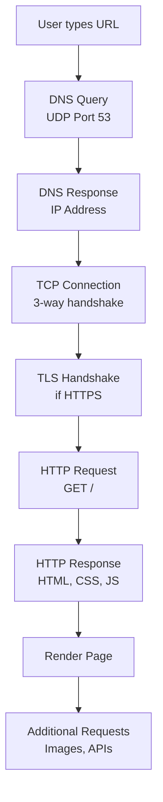

### 4.2 Protocol Stack Implementation

| Layer | Protocol Example | Implementation |
|-------|------------------|----------------|
| Application | HTTP, SMTP, DNS | User applications, browsers |
| Presentation | TLS/SSL | Encryption, compression |
| Session | RPC, NetBIOS | Connection management |
| Transport | TCP/UDP | Reliable delivery, ports |
| Network | IP | Addressing, routing |
| Data Link | Ethernet, Wi-Fi | MAC addressing, framing |
| Physical | Cables, radios | Bit transmission |

## 🛡️ 5. Security Considerations Across Protocols

### 5.1 Common Attack Vectors

| Protocol | Attack Type | Mitigation |
|----------|-------------|------------|
| **DNS** | Cache poisoning, amplification | DNSSEC, rate limiting |
| **HTTP** | Man-in-the-middle, injection | HTTPS, HSTS, CSP |
| **SMTP** | Relay, spoofing | SPF, DKIM, DMARC |
| **SSH** | Brute force, key theft | Key-based auth, fail2ban |
| **FTP** | Sniffing, bounce attacks | FTPS/SFTP, firewall rules |
| **DHCP** | Rogue server, starvation | DHCP snooping, port security |

### 5.2 Defense in Depth Strategy

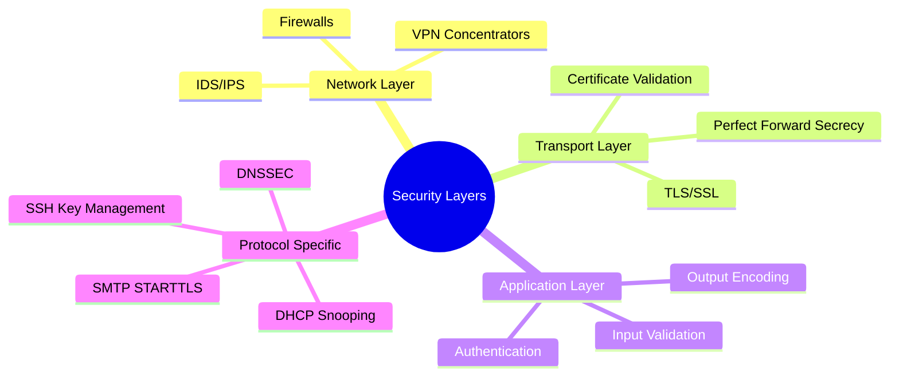

## 🧪 6. Troubleshooting & Tools

### 6.1 Diagnostic Tools by Protocol

| Protocol | Tool | Example Usage |
|----------|------|---------------|
| **DNS** | `dig`, `nslookup` | `dig example.com` |
| **HTTP/HTTPS** | `curl`, `wget` | `curl -I https://example.com` |
| **SMTP** | `telnet`, `swaks` | `telnet smtp.example.com 25` |
| **SSH** | `ssh`, `ssh-keyscan` | `ssh -v user@example.com` |
| **FTP** | `ftp`, `lftp` | `ftp ftp.example.com` |
| **DHCP** | `dhclient`, `dhcping` | `dhclient -v` |

### 6.2 Common Issues & Solutions

<details>
<summary>❓ Frequently Asked Questions</summary>

**Q: Why is DNS using both UDP and TCP?**
A: UDP for standard queries (faster, less overhead), TCP for zone transfers and large responses (>512 bytes).

**Q: How does SSH differ from Telnet?**
A: SSH encrypts all traffic including authentication, while Telnet sends everything in clear text.

**Q: What's the difference between FTPS and SFTP?**
A: FTPS is FTP with TLS (separate control and data channels), SFTP is a subsystem of SSH (single encrypted channel).

**Q: Why does DHCP use broadcast instead of unicast?**
A: Clients don't have IP addresses initially, so they must broadcast to discover servers.

**Q: How can I test SMTP without sending an email?**
A: Use `swaks --to recipient@example.com --server smtp.example.com` or `telnet smtp.example.com 25` and manually enter SMTP commands.
</details>

## 📊 7. Performance Optimization

### 7.1 Protocol-Specific Optimizations

| Protocol | Optimization Technique | Impact |
|----------|------------------------|--------|
| **DNS** | Caching, prefetching, EDNS(0) | Reduced latency, fewer queries |
| **HTTP/2** | Multiplexing, header compression | Faster page loads, reduced overhead |
| **HTTPS** | Session resumption, OCSP stapling | Faster handshakes, privacy |
| **SMTP** | Connection reuse, pipelining | Faster email delivery |
| **SSH** | Connection multiplexing, compression | Reduced latency for multiple sessions |
| **FTP** | Passive mode, segmented transfer | Firewall compatibility, faster transfers |
| **DHCP** | Lease time optimization, conflict detection | Reduced broadcasts, fewer conflicts |

## 🚀 8. Future Trends & Evolution

### 8.1 Emerging Protocols & Technologies

- **DNS over HTTPS (DoH)**: Encrypting DNS queries for privacy
- **HTTP/3 (QUIC)**: UDP-based, faster connection establishment
- **SMTP MTA-STS**: SMTP MTA Strict Transport Security
- **SSH certificates**: Replacing traditional key pairs
- **FTP replacement**: Cloud storage APIs (S3, Google Cloud Storage)
- **DHCPv6**: IPv6 auto-configuration

### 8.2 Protocol Convergence

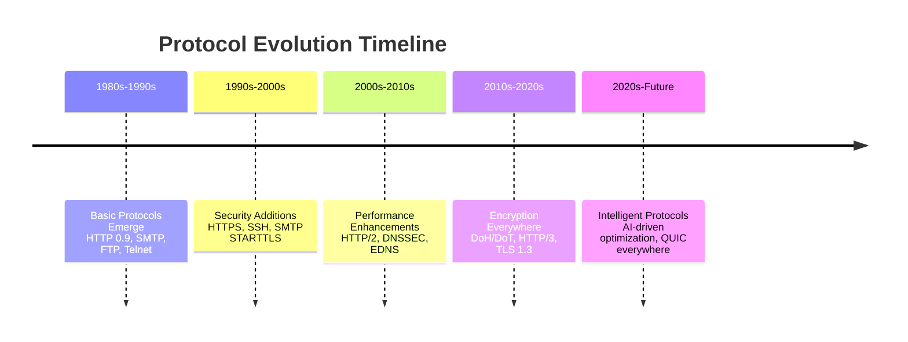

## 📝 9. Summary & Key Takeaways

1. **Layered Architecture**: Protocols operate at different OSI layers, with each layer serving specific functions
2. **Port Numbers**: Well-known ports (0-1023) identify specific services 【turn0search22】
3. **Security Evolution**: Protocols are adding encryption and authentication (DNS→DNSSEC, HTTP→HTTPS)
4. **Performance vs. Security**: Constant trade-off between speed and protection
5. **Troubleshooting Skills**: Understanding protocol conversations is essential for debugging
6. **Interconnectedness**: Protocols work together (DNS resolves names for HTTP/SMTP/FTP)
7. **Continuous Evolution**: Protocols adapt to new requirements (HTTP/2, HTTP/3, DNS over HTTPS)

## 🎯 10. Practical Exercises

<details>
<summary>📝 Hands-On Practice Scenarios</summary>

### Beginner Level
1. **DNS Investigation**:
   - Use `dig example.com` to see DNS resolution
   - Try `dig +trace example.com` to see iterative process
   - Experiment with different record types (`dig MX example.com`)

2. **HTTP Exploration**:
   - Use `curl -v http://example.com` to see request/response
   - Compare with `curl -v https://example.com`
   - Try different methods (`curl -X POST http://httpbin.org/post`)

### Intermediate Level
3. **SMTP Testing**:
   - Set up a local mail server (Postfix/Dovecot)
   - Send email using `swaks` or `telnet`
   - Implement SPF/DKIM/DMARC records

4. **SSH Mastery**:
   - Set up key-based authentication
   - Configure port forwarding
   - Implement SSH certificates

### Advanced Level
5. **Protocol Implementation**:
   - Write a simple DNS resolver in Python
   - Implement a basic HTTP server
   - Create a DHCP client simulator

6. **Security Analysis**:
   - Capture and analyze traffic with Wireshark
   - Identify protocol weaknesses
   - Implement mitigations
</details>

## 📚 Recommended Resources

- [RFC Documents](https://www.rfc-editor.org/) - Protocol specifications
- [Wireshark Guide](https://www.wireshark.org/docs/) - Network analysis
- [OWASP Testing Guide](https://owasp.org/www-project-web-security-testing-guide/) - Security testing
- [Linux Network Stack](https://www.kernel.org/doc/html/latest/networking/) - Implementation details

---

> 💡 **Pro Tip**: The best way to truly understand these protocols is to capture traffic with Wireshark and analyze the actual packet exchanges. Try visiting a website, sending an email, or transferring files while capturing packets to see these protocols in action!

This comprehensive lesson covers the fundamental protocols that power modern networking. From the application layer down to the physical infrastructure, each protocol plays a crucial role in enabling the interconnected world we rely on daily. Whether you're troubleshooting network issues, designing system architectures, or securing communications, a deep understanding of these protocols is essential for success in IT, networking, and cybersecurity fields.